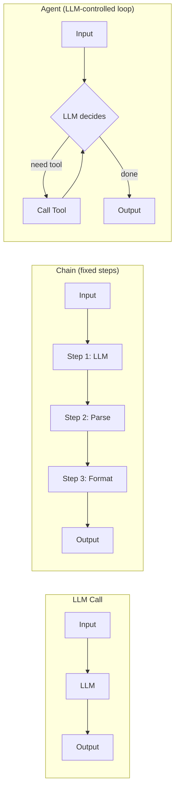
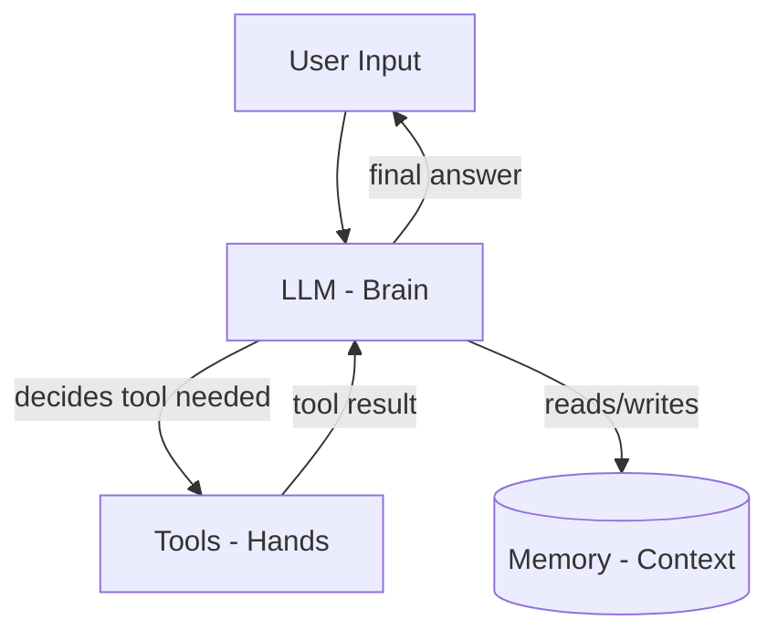
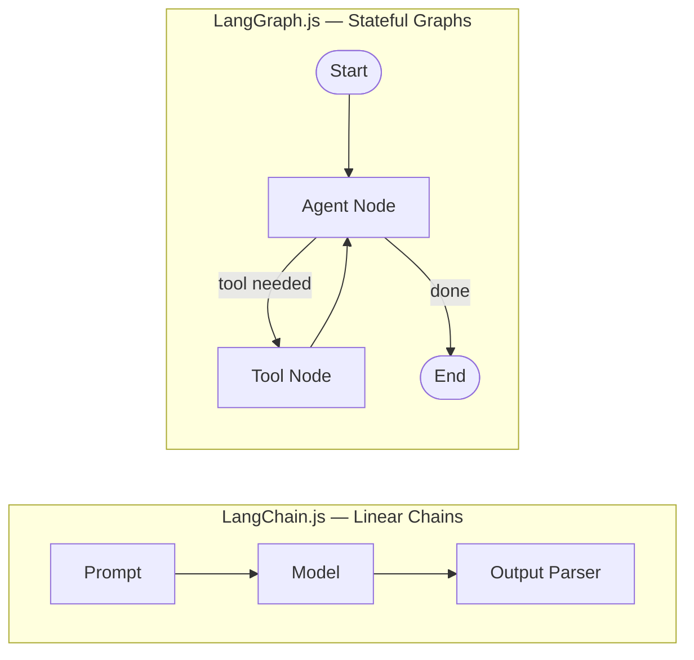
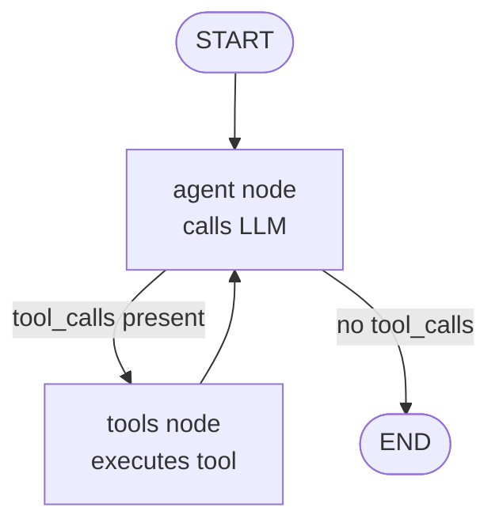

# Foundations of AI Agents

🟢 Beginner

## Kya hota hai ek "AI Agent"?

Socho ek second ke liye — tum Swiggy pe khana order karte ho aur delivery late ho jaati hai. Tum customer support ko message karte ho: "Mera order kaha hai?"

Ek **normal chatbot** (jo sirf LLM call kar raha hai) tumhe bolega: "I'm sorry for the inconvenience, please contact the restaurant." — kyunki usko sirf tumhara text samajhna aata hai, usko koi *action* lene ka access nahi hai.

Lekin ek **AI Agent** kya karega?
1. Tumhara order ID database se check karega (tool call — `getOrderStatus`)
2. Delivery partner ka live location dekhega (tool call — `getDeliveryPartnerLocation`)
3. Agar delay lag raha hai, refund ya coupon issue karega (tool call — `issueCoupon`)
4. Fir tumhe ek proper, context-aware jawab dega

Yahi fark hai ek **LLM** aur ek **Agent** mein. LLM sirf "sochta" hai (text predict karta hai). Agent **sochta bhi hai aur karta bhi hai** — woh apne aap decide karta hai ki kaunsa tool kab call karna hai, result dekhkar agla step kya lena hai, aur kab rukna hai.

> [!info]
> **Formal definition**: An AI agent is a system where an LLM controls the flow of an application — deciding which actions to take, in what order, using what inputs — based on the current state, rather than following a hardcoded sequence written by a developer.

Is course mein hum yehi seekhenge: LLM-based apps se lekar full production-grade autonomous agents tak, using **LangChain.js** and **LangGraph.js**.

## Kyun zaruri hai yeh samajhna?

Tum ek Node.js/TypeScript developer ho. Tumne pehle bhi APIs banayi hain jaha ek request aati hai, kuch fixed steps chalte hain (validate → DB query → response), aur response chala jaata hai. Yeh **deterministic control flow** hai — tumne code likha, code ne exactly wahi kiya jo likha tha.

Agent-based systems mein control flow **non-deterministic** hota hai — LLM decide karta hai ki kya karna hai. Yeh ek mindset shift hai, aur isiliye foundations clear hona bahut zaroori hai warna aage LangGraph ke concepts (state, nodes, edges) confusing lagenge.

## LLM Call vs Chain vs Agent — teeno mein fark

Yeh teeno terms bahut confuse karte hain shuruaat mein. Table se samjhte hain:

| Concept | Control Flow | Example |
|---|---|---|
| **LLM Call** | Ek single request-response. Koi loop nahi. | "Translate this to Hindi" → jawab aaya, khatam |
| **Chain** | Fixed, developer-defined sequence of steps (kabhi kabhi LLM steps ke beech). | prompt → LLM → parse output → format → DB save (hamesha isi order mein) |
| **Agent** | LLM khud decide karta hai next step kya hoga, loop mein, jab tak task complete na ho. | User query → LLM decides "mujhe weather tool chahiye" → tool result → LLM decides "ab main jawab de sakta hoon" → done |



Zomato ka example: "Chain" hai jaise ek fixed recipe — always onion pehle chopped hoga, phir tomato, phir masala. "Agent" hai jaise ek smart chef jo fridge dekh ke decide karta hai ki aaj kya banana hai, kaunsa ingredient use karna hai, aur agar ek cheez missing hai toh substitute dhoondta hai — sab apne aap.

## Ek Agent ke 4 core components

Har agent, chahe woh simple ho ya complex, in 4 cheezo se milkar banta hai:

1. **LLM (the brain)** — decisions leta hai, reasoning karta hai. Ye GPT-4, Claude, Gemini, ya koi bhi chat model ho sakta hai.
2. **Tools (the hands)** — functions jo agent call kar sakta hai: database query, API call, file read/write, calculator, web search, etc.
3. **Memory (the context)** — pichli conversation, intermediate results, ya long-term facts jo agent yaad rakhta hai.
4. **Orchestration loop (the control logic)** — jo decide karta hai: "LLM se pucho → agar tool call chahiye toh call karo → result wapas LLM ko do → repeat, jab tak final answer na mile."



Is chapter mein hum sabse zyada is 4th point pe focus karenge — **orchestration loop** — kyunki yehi woh cheez hai jo frameworks (LangChain/LangGraph) hamare liye handle karte hain.

## Manual Approach: Raw OpenAI SDK se Agent Loop banate hain

Chalo pehle dekhte hain ki bina kisi framework ke, sirf raw OpenAI SDK use karke, ek chota sa agent kaise banta hai. Isse tumhe pata chalega ki framework **actually kya problem solve karta hai** — kyunki jab tak tumne dard nahi dekha, painkiller ki value samajh nahi aati.

### Setup

```bash
mkdir manual-agent && cd manual-agent
npm init -y
npm install openai typescript tsx @types/node dotenv
npx tsc --init
```

`.env`:
```
OPENAI_API_KEY=sk-...
```

### Ek simple "weather agent" — manually

```typescript
// manual-agent.ts
import OpenAI from "openai";
import "dotenv/config";

const client = new OpenAI({ apiKey: process.env.OPENAI_API_KEY });

// Step 1: Tool define karo — yeh sirf ek normal TS function hai
function getWeather(city: string): string {
  // real app mein yaha ek actual weather API call hoga
  const fakeWeatherDB: Record<string, string> = {
    mumbai: "32°C, humid, chance of rain",
    delhi: "40°C, dry, heat wave warning",
    bangalore: "24°C, pleasant, light breeze",
  };
  return fakeWeatherDB[city.toLowerCase()] ?? "Weather data not available";
}

// Step 2: OpenAI ko batana ki yeh tool exist karta hai (JSON schema)
const tools: OpenAI.Chat.Completions.ChatCompletionTool[] = [
  {
    type: "function",
    function: {
      name: "getWeather",
      description: "Get current weather for a given city",
      parameters: {
        type: "object",
        properties: {
          city: { type: "string", description: "City name, e.g. Mumbai" },
        },
        required: ["city"],
      },
    },
  },
];

async function runAgent(userMessage: string) {
  // Step 3: Conversation history manually maintain karo
  const messages: OpenAI.Chat.Completions.ChatCompletionMessageParam[] = [
    { role: "user", content: userMessage },
  ];

  // Step 4: THE LOOP — yeh dil hai agent ka
  while (true) {
    const response = await client.chat.completions.create({
      model: "gpt-4o-mini",
      messages,
      tools,
    });

    const choice = response.choices[0];
    const toolCalls = choice.message.tool_calls;

    // Case A: LLM ne final answer de diya, tool call nahi chahiye
    if (!toolCalls || toolCalls.length === 0) {
      return choice.message.content;
    }

    // Case B: LLM ne tool call maanga hai — assistant ka message history mein daalo
    messages.push(choice.message);

    // Step 5: Har tool call ko manually execute karo
    for (const toolCall of toolCalls) {
      if (toolCall.function.name === "getWeather") {
        const args = JSON.parse(toolCall.function.arguments);
        const result = getWeather(args.city);

        // Step 6: Tool ka result wapas messages mein daalo, sahi format mein
        messages.push({
          role: "tool",
          tool_call_id: toolCall.id,
          content: result,
        });
      }
    }
    // Loop wapas chalega — LLM ko tool result ke saath dobara call karenge
  }
}

runAgent("Mumbai aur Delhi mein aaj weather kaisa hai? Konsa city ghumne ke liye better hai?")
  .then(console.log);
```

Yeh code kaam karta hai. Lekin ab socho — yeh **sirf ek tool** ke liye hai. Production mein sochne wali cheezein:

> [!warning]
> Manual loop mein yeh sab tumhe khud handle karna padega:
> - **Multiple tools** — agar 10 tools hain toh `if/else` ya `switch` ka jungle ban jaayega
> - **Parallel tool calls** — LLM ek saath 3 tools call kar sakta hai, unka execution order aur error handling
> - **Infinite loop protection** — agar LLM baar baar tool call karta rahe toh max iteration limit
> - **Streaming** — user ko real-time token-by-token response dikhana (raw SDK mein isko tool-calling ke saath mix karna painful hai)
> - **Retry & error handling** — tool fail ho gaya toh kya? API rate limit lag gaya toh?
> - **Memory/persistence** — conversation ko DB mein save karna, session restore karna
> - **Multi-step planning** — agar task complex hai (pehle X karo, uske result se Y decide karo, phir Z) toh state manage karna mushkil hai
> - **Different providers** — agar kal OpenAI se Anthropic ya Gemini switch karna pade, poora code rewrite

Yeh sab "boilerplate" nahi hai — yeh **hard engineering problems** hain jo har agent banane wale ko face karne padte hain. Aur yehi wo jagah hai jaha framework kaam aata hai.

## Frameworks kyun zaruri hain — especially JS/TS ecosystem mein

Tum ek Node dev ho, toh tumhe pata hai ki JS ecosystem kitni fast-moving hai — naya framework, naya pattern, har 6 mahine mein kuch naya trend. AI space toh usse bhi zyada fast move kar raha hai:

- Naye model providers har mahine aa rahe hain (OpenAI, Anthropic, Google, Mistral, Groq, local models via Ollama)
- Tool-calling ka format har provider mein thoda alag hai
- Streaming protocols alag hain
- Best practices (jaise ReAct, Plan-and-Execute, Reflection) research papers se aa rahe hain aur bahut fast evolve ho rahe hain

Agar tum sab kuch manually likhoge:
1. Har provider switch pe tumhara poora tool-calling loop rewrite hoga
2. Naya agent pattern try karne ke liye tumhe woh pattern khud implement karna padega
3. Community ke saath code share/reuse nahi kar paoge (har koi apna khud ka loop likhega)

**LangChain.js aur LangGraph.js** yeh problem solve karte hain:

| Problem | Manual Approach | Framework Approach |
|---|---|---|
| Provider switch | Poora tool-loop rewrite | `new ChatOpenAI()` → `new ChatAnthropic()`, baaki same |
| Multi-tool orchestration | Custom `if/else` jungle | `bindTools()` + framework handles routing |
| Complex multi-step agents | Manual state machine likhna padta hai | LangGraph ka `StateGraph` — declarative nodes/edges |
| Streaming | Manually merge karna padta hai with tool calls | Built-in `.stream()` support |
| Observability/debugging | `console.log` sprinkle karna | LangSmith se automatic tracing |
| Memory/checkpointing | Khud DB schema design karna | Built-in checkpointers (Postgres, SQLite, Redis) |
| Community patterns | Khud research paper padhkar implement karna | Pre-built agent patterns (ReAct, etc.) |

> [!tip]
> Framework use karne ka matlab yeh nahi ki tumhe underlying concept samajhna nahi hai. Isiliye humne pehle manual loop dikhaya — ab jab tumhe LangGraph mein `ToolNode` ya `bindTools()` dikhega, tumhe pata hoga ki **andar kya ho raha hai**, sirf magic nahi lagega.

## LangChain.js kya hai?

**LangChain.js** ek framework hai jo LLM applications banane ke liye common building blocks provide karta hai:
- **Chat Models** — unified interface (`ChatOpenAI`, `ChatAnthropic`, `ChatGoogleGenerativeAI`, etc.) — sabka API roughly same lagta hai
- **Prompts** — reusable, templated prompts
- **Tools** — function-calling ko structured way mein define karne ka tarika (Zod schemas ke saath)
- **Output Parsers** — LLM ke text output ko structured JSON/objects mein convert karna
- **LCEL (LangChain Expression Language)** — chains ko `.pipe()` operator se compose karna
- **Retrievers** — RAG (documents search karke context dena) ke liye

LangChain best hai jab tumhe **linear ya semi-linear workflows** banane hain — chains jaha steps mostly fixed hain, thoda LLM decision hai.

## LangGraph.js kya hai — aur yeh LangChain se alag kyu hai?

**LangGraph.js** LangChain team ka hi banaya hua library hai, lekin yeh specifically **complex, stateful, cyclic agent workflows** ke liye design hua hai.

Socho IRCTC ka ticket booking flow — yeh linear nahi hai:
- User train dhoondta hai → available seats check hoti hain
- Agar seat nahi mili → waitlist ka option → user decide karta hai continue karna hai ya nahi
- Payment fail ho sakta hai → retry loop
- Tatkal mein multiple attempts, race conditions

Yeh **branches, loops, aur conditional paths** wala flow hai — LangChain ki simple linear chain isko elegantly represent nahi kar sakti. Yahi LangGraph solve karta hai:

- **Graph-based** — tumhara agent ek graph hai: **nodes** (steps/functions) aur **edges** (connections, jo conditional ho sakte hain)
- **Explicit State** — ek shared state object jo har node update kar sakta hai
- **Cycles allowed** — agent loop laga sakta hai (tool call → check → tool call → ... → done) bina "recursion" likhe
- **Built-in persistence** — checkpointers se state ko beech mein save/resume kar sakte ho (human-in-the-loop ke liye zaruri)
- **Multi-agent support** — multiple specialized agents ko coordinate karna easy hai



> [!info]
> **Rule of thumb**: Simple, predictable workflow (prompt → LLM → parse) → LangChain LCEL kaafi hai. Jaise hi tumhe **loops, branching decisions, multiple agents, ya human approval steps** chahiye → LangGraph use karo. Is course ke chapters 1-11 LangChain fundamentals cover karenge, aur 12 se aage hum LangGraph mein deep dive karenge.

Dono ek dusre ko replace nahi karte — LangGraph ke andar tum LangChain ke chat models, tools, aur prompts hi use karte ho. LangGraph sirf **orchestration layer** add karta hai upar se.

## Same Agent, Ab LangChain.js Ke Saath

Ab wahi weather example LangChain.js mein banate hain, taaki farak seedha dikhe.

### Setup

```bash
npm install @langchain/openai @langchain/core zod dotenv
```

```typescript
// langchain-agent.ts
import { ChatOpenAI } from "@langchain/openai";
import { tool } from "@langchain/core/tools";
import { z } from "zod";
import "dotenv/config";

// Step 1: Tool define karo — Zod schema se, type-safe aur clean
const getWeatherTool = tool(
  async ({ city }) => {
    const fakeWeatherDB: Record<string, string> = {
      mumbai: "32°C, humid, chance of rain",
      delhi: "40°C, dry, heat wave warning",
      bangalore: "24°C, pleasant, light breeze",
    };
    return fakeWeatherDB[city.toLowerCase()] ?? "Weather data not available";
  },
  {
    name: "getWeather",
    description: "Get current weather for a given city",
    schema: z.object({
      city: z.string().describe("City name, e.g. Mumbai"),
    }),
  }
);

// Step 2: Model banao aur tool bind karo — provider switch karna ho toh
// bas yeh line change hogi, baaki sab same rahega
const model = new ChatOpenAI({ model: "gpt-4o-mini" }).bindTools([getWeatherTool]);

async function runAgent(userMessage: string) {
  const messages: any[] = [{ role: "user", content: userMessage }];

  while (true) {
    const response = await model.invoke(messages);
    messages.push(response);

    // No tool calls => final answer
    if (!response.tool_calls || response.tool_calls.length === 0) {
      return response.content;
    }

    // Tool calls ko execute karo — LangChain ka tool object khud
    // apna schema-validated input handle karta hai
    for (const toolCall of response.tool_calls) {
      if (toolCall.name === "getWeather") {
        const result = await getWeatherTool.invoke(toolCall.args);
        messages.push({
          role: "tool",
          content: result,
          tool_call_id: toolCall.id,
        });
      }
    }
  }
}

runAgent("Mumbai aur Delhi mein aaj weather kaisa hai?").then(console.log);
```

Dekha? Loop ka structure same hai (kyunki concept same hai), lekin:
- Tool definition Zod schema se **type-safe** hai — invalid input pe automatic validation error
- `bindTools()` se provider-agnostic tool binding
- `tool.invoke()` khud arguments validate karta hai

Yeh already better hai, lekin abhi bhi loop **manually** likha hai. LangChain isko aur simplify karta hai pre-built agent constructors se — jo hum Chapter 8 (Building Your First Agent) mein dekhenge.

## Preview: Wahi Agent, LangGraph.js Mein (glimpse)

Yeh abhi sirf ek jhalak hai — poori depth Chapter 12 se milegi. Lekin yeh dekhna zaruri hai ki LangGraph loop ko explicit **graph** ke roop mein kaise represent karta hai:

```typescript
// langgraph-preview.ts
import { StateGraph, MessagesAnnotation, END, START } from "@langchain/langgraph";
import { ChatOpenAI } from "@langchain/openai";
import { ToolNode } from "@langchain/langgraph/prebuilt";
import { tool } from "@langchain/core/tools";
import { z } from "zod";
import "dotenv/config";

const getWeatherTool = tool(
  async ({ city }) => {
    const fakeWeatherDB: Record<string, string> = {
      mumbai: "32°C, humid, chance of rain",
      delhi: "40°C, dry, heat wave warning",
    };
    return fakeWeatherDB[city.toLowerCase()] ?? "Weather data not available";
  },
  {
    name: "getWeather",
    description: "Get current weather for a given city",
    schema: z.object({ city: z.string() }),
  }
);

const tools = [getWeatherTool];
const model = new ChatOpenAI({ model: "gpt-4o-mini" }).bindTools(tools);

// Node 1: LLM ko call karo
async function callModel(state: typeof MessagesAnnotation.State) {
  const response = await model.invoke(state.messages);
  return { messages: [response] };
}

// Conditional edge: decide karo tool call karna hai ya khatam karna hai
function shouldContinue(state: typeof MessagesAnnotation.State) {
  const lastMessage = state.messages[state.messages.length - 1];
  const hasToolCalls = (lastMessage as any).tool_calls?.length > 0;
  return hasToolCalls ? "tools" : END;
}

// Graph banao: nodes + edges
const workflow = new StateGraph(MessagesAnnotation)
  .addNode("agent", callModel)
  .addNode("tools", new ToolNode(tools))
  .addEdge(START, "agent")
  .addConditionalEdges("agent", shouldContinue)
  .addEdge("tools", "agent"); // yahi cycle hai — tool ke baad wapas agent

const app = workflow.compile();

const result = await app.invoke({
  messages: [{ role: "user", content: "Mumbai mein weather kaisa hai?" }],
});

console.log(result.messages[result.messages.length - 1].content);
```

Notice karo — humne **loop khud nahi likha**. Humne bas graph structure define kiya: `agent` node → conditional check → agar tool chahiye toh `tools` node → wapas `agent` node → jab tak `END` na aaye. LangGraph engine khud loop chalata hai.



## Local Dev Environment Setup (is poore course ke liye)

```bash
mkdir agentic-ai-js && cd agentic-ai-js
npm init -y
npm install typescript tsx @types/node dotenv -D
npm install @langchain/core @langchain/openai @langchain/langgraph zod
npx tsc --init
```

`.env`:
```
OPENAI_API_KEY=sk-...
# Optional: agar LangSmith se tracing dekhni hai (Chapter 10 mein cover hoga)
LANGCHAIN_TRACING_V2=true
LANGCHAIN_API_KEY=ls-...
LANGCHAIN_PROJECT=agentic-ai-course
```

`package.json` mein script add karo:
```json
{
  "scripts": {
    "dev": "tsx watch src/index.ts"
  }
}
```

> [!warning]
> **Common mistake**: API key `.env` file mein hai lekin `import "dotenv/config"` file ke top pe likhna bhool jaate hain — result: `process.env.OPENAI_API_KEY` `undefined` aata hai aur confusing 401 error milta hai. Hamesha entry-point file ke **sabse pehle line** pe `import "dotenv/config"` daalo.

> [!warning]
> **Cost gotcha**: Agent loops mein har iteration ek naya LLM call hai. Agar tumhara agent 5 baar loop chalata hai ek query ke liye, toh tumhara cost aur latency dono 5x ho jaate hain. Production mein hamesha **max iteration limit** set karo (LangGraph mein `recursionLimit` option milta hai `invoke()` call mein) taaki koi buggy loop tumhara OpenAI bill na uda de.

## Key Takeaways

- **LLM** ek text predictor hai; **Agent** ek system hai jaha LLM khud decide karta hai kaunse actions lene hain aur kab rukna hai — control flow developer ke bajaye LLM ke haath mein hota hai.
- Har agent 4 cheezo se banta hai: **LLM (brain)**, **Tools (hands)**, **Memory (context)**, aur **Orchestration loop (control logic)**.
- Raw OpenAI SDK se manually agent loop likhna possible hai, lekin production mein multi-tool handling, streaming, retries, memory, aur provider-switching bahut painful ho jaate hain — yehi gap frameworks fill karte hain.
- **LangChain.js** linear/semi-linear workflows (chains) ke liye best hai — unified model interface, tools, prompts, parsers.
- **LangGraph.js** complex, stateful, cyclic agent workflows ke liye hai — explicit graph (nodes + edges), built-in loops, persistence, aur human-in-the-loop support.
- LangGraph, LangChain ko replace nahi karta — woh LangChain ke chat models/tools ko hi use karta hai, bas ek orchestration layer add karta hai.
- Rule of thumb: simple prompt → LLM → parse ke liye LangChain LCEL; loops/branching/multi-agent/approval steps chahiye toh LangGraph.
- Hamesha `recursionLimit`/max-iteration guard rakho agent loops mein — warna cost aur latency uncontrolled ho sakti hai.
