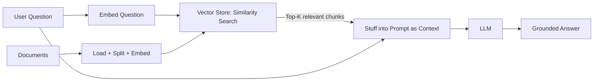

# RAG — Retrieval-Augmented Generation

🟡 Intermediate

## Kya hota hai RAG?

Socho ek second ke liye — tumne apne company ka ek naya HR chatbot banaya hai jo LLM use karta hai. Employee poochta hai: *"Mera maternity leave policy kya hai?"* Ab LLM ne to duniya bhar ka data padha hai training ke time — Wikipedia, Reddit, StackOverflow — lekin usne tumhari company ka **internal HR policy document** kabhi nahi dekha. Toh wo kya karega? Confidently galat jawab banayega (hallucinate karega), ya phir keh dega "I don't have that information."

Ab ek dusra scenario socho — Zomato pe tumne order kiya, aur customer support chatbot se poocha "mera order kahan hai?" Yeh answer LLM ke training data mein kabhi ho hi nahi sakta — kyunki yeh **real-time, tumhare specific order ka data** hai jo abhi database mein baitha hai.

Dono cases mein problem same hai: **LLM ke paas woh specific, private, ya real-time knowledge nahi hai jo answer dene ke liye chahiye.**

Yahi pe RAG (Retrieval-Augmented Generation) kaam aata hai. Idea simple hai:

1. Pehle apne data (documents, PDFs, DB records) ko chhote-chhote **chunks** mein todo.
2. Un chunks ko **embeddings** (numbers ki list, jo matlab capture karti hai) mein convert karke ek **vector store** mein daal do.
3. Jab user koi question puche, us question se **relevant chunks retrieve karo** vector store se.
4. Un chunks ko LLM ke prompt mein **context** ke roop mein daal do, aur LLM ko bolo "isi context ke base pe answer do."

Basically — LLM ko "open-book exam" dene jaisa hai. Usse sab kuch yaad rakhne ki zarurat nahi, bas sahi page khol ke dena hai answer dene ke time.



## Kyun zaruri hai agentic AI ke liye?

Agent banate waqt RAG bahut critical hai kyunki:

- **Hallucination kam karta hai** — LLM ko fabricate karne ke bajaye actual documents se answer dene ko milta hai.
- **Fresh/private data** — company docs, product catalogs, personal notes — yeh sab cheezein LLM ke training data mein nahi hoti. RAG unhe "on-demand" LLM tak pahunchata hai.
- **No fine-tuning zaroorat** — naya model train karne ki jagah, tum bas apna data vector store mein daal do. Cost aur time dono bachta hai.
- **Source attribution** — RAG ke saath tum bata sakte ho "yeh answer is document ke page 5 se aaya hai," jo trust badhata hai (jaise IRCTC apne refund policy page ka link deta hai).
- **Tool banata hai agent ke liye** — Chapter 7 mein humne tools dekhe the. RAG pipeline ko bhi ek "retriever tool" bana ke agent ko de sakte ho, taaki agent khud decide kare kab knowledge base search karni hai (Chapter 19 mein isko graphs mein use karenge).

> [!info]
> RAG koi single algorithm nahi hai — yeh ek **pattern/architecture** hai jisme retrieval aur generation combine hote hain. LangChain.js isme har step (loading, splitting, embedding, storing, retrieving) ke liye ready-made abstractions deta hai.

## RAG Pipeline — Step by Step

Poora pipeline 5 major steps mein todte hain:

| Step | Kaam | LangChain.js Concept |
|------|------|----------------------|
| 1. Load | Raw data ko app mein laana (PDF, txt, web page, DB) | Document Loaders |
| 2. Split | Bade documents ko chhote chunks mein todna | Text Splitters |
| 3. Embed | Chunks ko vectors (numbers) mein convert karna | Embeddings Models |
| 4. Store | Vectors ko store + index karna fast search ke liye | Vector Stores |
| 5. Retrieve + Generate | Query se relevant chunks nikaal ke LLM ko dena | Retrievers + Chains |

Chalo ek-ek karke dekhte hain, real TypeScript code ke saath.

### Setup — Dependencies

```bash
npm install langchain @langchain/openai @langchain/community @langchain/textsplitters @langchain/core
npm install pdf-parse cheerio   # PDF aur web loaders ke liye
```

`.env` file mein apni API key daalo:

```bash
OPENAI_API_KEY=sk-...
```

> [!tip]
> Agar OpenAI ka billing setup nahi karna, toh LangChain.js mein `@langchain/community` ke through Ollama (local models) ya HuggingFace embeddings bhi use kar sakte ho. Neeche hum ek example dikhayenge dono ke saath.

---

## Step 1: Document Loaders

Document loaders ka kaam hai — kisi bhi source (file, web, DB) se raw text nikaal ke LangChain ke standard `Document` format mein convert karna. Har `Document` mein do cheezein hoti hain:

```typescript
interface Document {
  pageContent: string;       // actual text
  metadata: Record<string, any>; // source, page number, etc.
}
```

### Text File Loader

```typescript
import { TextLoader } from "langchain/document_loaders/fs/text";

const loader = new TextLoader("./data/company-policy.txt");
const docs = await loader.load();

console.log(docs[0].pageContent); // poora text ek Document mein
console.log(docs[0].metadata);    // { source: './data/company-policy.txt' }
```

### PDF Loader

Real projects mein zyadatar knowledge PDFs mein hoti hai — offer letters, policy docs, research papers.

```typescript
import { PDFLoader } from "@langchain/community/document_loaders/fs/pdf";

const loader = new PDFLoader("./data/hr-handbook.pdf", {
  splitPages: true, // har page ek alag Document banega
});

const docs = await loader.load();
console.log(`Total pages loaded: ${docs.length}`);
console.log(docs[0].metadata); // { source: '...', pdf: { totalPages: ... }, loc: { pageNumber: 1 } }
```

### Directory Loader (multiple files ek saath)

```typescript
import { DirectoryLoader } from "langchain/document_loaders/fs/directory";
import { TextLoader } from "langchain/document_loaders/fs/text";
import { PDFLoader } from "@langchain/community/document_loaders/fs/pdf";

const loader = new DirectoryLoader("./data", {
  ".txt": (path) => new TextLoader(path),
  ".pdf": (path) => new PDFLoader(path),
});

const docs = await loader.load();
console.log(`Loaded ${docs.length} documents from directory`);
```

### Web Page Loader

Zomato ke FAQ page ya kisi documentation site se data khinchne ke liye:

```typescript
import { CheerioWebBaseLoader } from "@langchain/community/document_loaders/web/cheerio";

const loader = new CheerioWebBaseLoader(
  "https://example.com/faq",
  { selector: "article" } // sirf article tag ka content lo, nav/footer nahi
);

const docs = await loader.load();
```

> [!warning]
> Web loaders scraping karte hain — production mein `robots.txt` aur rate-limits ka dhyan rakho. Bahut saari websites JS-rendered content use karti hain jo Cheerio (static HTML parser) nahi padh payega — waha Playwright loader use karo.

---

## Step 2: Text Splitters

Ek poora PDF (50 pages) ek hi chunk mein embed karna galat idea hai — do reasons se:

1. **Embedding models ki token limit hoti hai** — bahut lamba text truncate ho jayega.
2. **Retrieval ki quality kharab hoti hai** — agar chunk bahut bada hai, toh usme relevant aur irrelevant dono info mix ho jayegi, aur similarity search confuse ho jayega.

Isliye documents ko **chunks** mein todna zaroori hai — jaise dabbawala poora tiffin ek saath nahi dete, systematically alag-alag dabbe mein baant ke deliver karte hain.

### RecursiveCharacterTextSplitter (sabse common)

Yeh splitter pehle paragraphs pe todne ki koshish karta hai, phir sentences pe, phir words pe — taaki meaning intact rahe.

```typescript
import { RecursiveCharacterTextSplitter } from "@langchain/textsplitters";

const splitter = new RecursiveCharacterTextSplitter({
  chunkSize: 1000,      // har chunk max ~1000 characters
  chunkOverlap: 200,    // consecutive chunks ke beech 200 chars overlap (context na tootey)
});

const chunks = await splitter.splitDocuments(docs);

console.log(`${docs.length} documents split into ${chunks.length} chunks`);
console.log(chunks[0].pageContent.length); // ~1000 ya kam
```

**`chunkOverlap` kyun zaruri hai?** Socho ek sentence chunk ke exact boundary pe kat gaya — "Employee ko 6 months ka maternity | leave milta hai poore salary ke saath." Agar overlap na ho, toh dono chunks adhoore reh jayenge. Overlap ensure karta hai ki important context dono chunks mein present rahe.

### Recommended chunk sizes (rule of thumb)

| Content type | chunkSize | chunkOverlap |
|---|---|---|
| Short FAQs/policies | 300–500 | 50–100 |
| General docs/articles | 800–1200 | 100–200 |
| Code files | 1000–1500 (use `fromLanguage`) | 100–200 |
| Dense legal/technical PDFs | 500–800 | 100–150 |

### Code-aware splitting

Agar tum codebase ko RAG mein daal rahe ho (jaise ek internal "ask questions about our repo" tool):

```typescript
import { RecursiveCharacterTextSplitter } from "@langchain/textsplitters";

const jsSplitter = RecursiveCharacterTextSplitter.fromLanguage("js", {
  chunkSize: 1000,
  chunkOverlap: 100,
});

const codeChunks = await jsSplitter.splitDocuments(codeDocs);
```

Yeh function boundaries, class boundaries jaise semantic points pe split karta hai — bilkul beech mein function ko nahi todta.

> [!tip]
> Chunking ek "art" hai, exact science nahi. Chota chunk = precise retrieval par kam context. Bada chunk = zyada context par noisy retrieval. Production mein evaluation dataset banake alag-alag chunk sizes test karo.

---

## Step 3: Embeddings

Embedding ek text (word, sentence, paragraph) ko ek **vector** (floating point numbers ki list, jaise `[0.021, -0.42, 0.87, ...]`) mein convert karta hai. Iska magic yeh hai — **similar meaning wale texts, vector space mein ek dusre ke paas hote hain.**

Jaise Swiggy pe agar tum "biryani" search karo, toh "hyderabadi biryani," "chicken dum biryani" results mein aayenge, chaahe exact word match na ho — kyunki unka **meaning** close hai. Embeddings yehi kaam numbers ke through karte hain.

### OpenAI Embeddings

```typescript
import { OpenAIEmbeddings } from "@langchain/openai";

const embeddings = new OpenAIEmbeddings({
  model: "text-embedding-3-small", // sasta aur fast; "text-embedding-3-large" zyada accurate
});

// Ek single text embed karna
const vector = await embeddings.embedQuery("What is the maternity leave policy?");
console.log(vector.length); // 1536 dimensions (text-embedding-3-small ke liye)

// Multiple documents embed karna (batch)
const vectors = await embeddings.embedDocuments([
  "Employees get 6 months of paid maternity leave.",
  "Sick leave is capped at 12 days per year.",
]);
console.log(vectors.length); // 2
```

### Local/Free Embeddings (Ollama)

Agar OpenAI cost avoid karni hai, ya data privacy strict hai (company ka data bahar nahi ja sakta):

```typescript
import { OllamaEmbeddings } from "@langchain/ollama";

const embeddings = new OllamaEmbeddings({
  model: "nomic-embed-text", // pehle `ollama pull nomic-embed-text` karo
  baseUrl: "http://localhost:11434",
});

const vector = await embeddings.embedQuery("test query");
```

> [!warning]
> **Embedding model consistency zaruri hai.** Jis model se tumne documents embed kiye the, query bhi usi model se embed karo. `text-embedding-3-small` se banaya vector store, `text-embedding-3-large` ke query vector se compare nahi kar sakte — dimensions/scale match nahi karenge.

### Cost consideration

| Model | Cost (per 1M tokens) | Dimensions |
|---|---|---|
| `text-embedding-3-small` | ~$0.02 | 1536 |
| `text-embedding-3-large` | ~$0.13 | 3072 |
| Ollama (local) | Free (compute cost only) | model-dependent |

Production mein `text-embedding-3-small` zyada use hota hai — accuracy/cost ka best balance.

---

## Step 4: Vector Stores

Vector store woh database hai jo embeddings ko store karta hai aur fast **similarity search** provide karta hai — "in millions vectors mein se, top 5 vectors do jo is query vector ke sabse paas hain."

### In-Memory Vector Store (prototyping ke liye)

Chhote projects, demos, ya testing ke liye — LangChain.js ka built-in in-memory store kaafi hai:

```typescript
import { MemoryVectorStore } from "langchain/vectorstores/memory";
import { OpenAIEmbeddings } from "@langchain/openai";
import { Document } from "@langchain/core/documents";

const embeddings = new OpenAIEmbeddings({ model: "text-embedding-3-small" });

const documents: Document[] = [
  new Document({ pageContent: "Employees get 6 months paid maternity leave.", metadata: { source: "hr-policy.pdf", page: 3 } }),
  new Document({ pageContent: "Sick leave is capped at 12 days per year.", metadata: { source: "hr-policy.pdf", page: 4 } }),
  new Document({ pageContent: "Work from home is allowed twice a week.", metadata: { source: "hr-policy.pdf", page: 5 } }),
];

const vectorStore = await MemoryVectorStore.fromDocuments(documents, embeddings);

// Similarity search
const results = await vectorStore.similaritySearch("How many WFH days do I get?", 2);
results.forEach((doc) => console.log(doc.pageContent, doc.metadata));
```

> [!warning]
> `MemoryVectorStore` process restart hone pe **sab data khokar** jata hai (RAM mein hi rehta hai) — kabhi bhi production mein use mat karo. Yeh sirf learning/prototyping ke liye hai.

### Hosted Vector Store — Chroma (self-hosted / local Docker)

```bash
docker run -p 8000:8000 chromadb/chroma
npm install @langchain/community chromadb
```

```typescript
import { Chroma } from "@langchain/community/vectorstores/chroma";
import { OpenAIEmbeddings } from "@langchain/openai";

const embeddings = new OpenAIEmbeddings({ model: "text-embedding-3-small" });

const vectorStore = await Chroma.fromDocuments(documents, embeddings, {
  collectionName: "hr-policies",
  url: "http://localhost:8000",
});

// Baad mein existing collection se connect karna (re-embed nahi karna padega)
const existingStore = new Chroma(embeddings, {
  collectionName: "hr-policies",
  url: "http://localhost:8000",
});

const results = await existingStore.similaritySearch("maternity leave", 3);
```

### Hosted Vector Store — Pinecone (fully managed, production-grade)

Pinecone jaisa fully-managed vector DB use karo jab scale, uptime, aur multi-region support chahiye (jaise ek real production SaaS product).

```bash
npm install @pinecone-database/pinecone @langchain/pinecone
```

```typescript
import { Pinecone } from "@pinecone-database/pinecone";
import { PineconeStore } from "@langchain/pinecone";
import { OpenAIEmbeddings } from "@langchain/openai";

const pinecone = new Pinecone({ apiKey: process.env.PINECONE_API_KEY! });
const pineconeIndex = pinecone.Index("hr-policies-index");

const embeddings = new OpenAIEmbeddings({ model: "text-embedding-3-small" });

// Documents add karna
const vectorStore = await PineconeStore.fromDocuments(documents, embeddings, {
  pineconeIndex,
  maxConcurrency: 5, // rate limiting ke liye
});

// Query
const results = await vectorStore.similaritySearch("maternity leave policy", 3);

// Metadata filter ke saath search (sirf specific source se)
const filteredResults = await vectorStore.similaritySearch(
  "leave policy",
  3,
  { source: "hr-policy.pdf" } // Pinecone metadata filter
);
```

### Vector store choose kaise karein?

| Vector Store | Kab use karo |
|---|---|
| `MemoryVectorStore` | Learning, quick prototypes, chhote demo apps |
| Chroma | Self-hosted, dev/staging, medium-scale apps, full control chahiye |
| Pinecone | Production, large scale, managed infra, multi-region |
| pgvector (Postgres) | Already Postgres use kar rahe ho, aur ek hi DB mein sab rakhna chahte ho |

> [!tip]
> Agar tum already Postgres use kar rahe ho (jaise iss repo ke PostgreSQL notes mein cover kiya hai), `@langchain/community` ka `PGVectorStore` use karke apne existing DB mein hi vectors store kar sakte ho — ek naye service ki zarurat nahi.

---

## Step 5: Retrievers aur Full RAG Chain

Vector store se `similaritySearch` seedhe call karna kaam chala deta hai, lekin LangChain ka **Retriever** interface isse ek reusable, composable component banata hai jo kisi bhi chain mein plug ho sakta hai.

### Basic Retriever

```typescript
const retriever = vectorStore.asRetriever({
  k: 4, // top 4 relevant chunks
});

const relevantDocs = await retriever.invoke("What is the WFH policy?");
```

### Poora RAG Chain (LCEL ke saath)

Ab sabse important part — sab kuch jodke ek complete RAG pipeline banate hain, jo query leke, retrieve karke, LLM se grounded answer generate karta hai.

```typescript
import { ChatOpenAI } from "@langchain/openai";
import { OpenAIEmbeddings } from "@langchain/openai";
import { MemoryVectorStore } from "langchain/vectorstores/memory";
import { RecursiveCharacterTextSplitter } from "@langchain/textsplitters";
import { TextLoader } from "langchain/document_loaders/fs/text";
import { ChatPromptTemplate } from "@langchain/core/prompts";
import { StringOutputParser } from "@langchain/core/output_parsers";
import {
  RunnableSequence,
  RunnablePassthrough,
} from "@langchain/core/runnables";
import { Document } from "@langchain/core/documents";

// ---- 1. Load ----
const loader = new TextLoader("./data/company-policy.txt");
const rawDocs = await loader.load();

// ---- 2. Split ----
const splitter = new RecursiveCharacterTextSplitter({
  chunkSize: 800,
  chunkOverlap: 100,
});
const chunks = await splitter.splitDocuments(rawDocs);

// ---- 3. Embed + Store ----
const embeddings = new OpenAIEmbeddings({ model: "text-embedding-3-small" });
const vectorStore = await MemoryVectorStore.fromDocuments(chunks, embeddings);
const retriever = vectorStore.asRetriever({ k: 4 });

// ---- 4. Prompt ----
const prompt = ChatPromptTemplate.fromTemplate(`
You are a helpful HR assistant. Answer the question ONLY using the context below.
If the answer is not in the context, say "I don't have that information in the policy documents."

Context:
{context}

Question: {question}

Answer:`);

// Helper: retrieved Documents ko ek single string mein format karna
function formatDocs(docs: Document[]): string {
  return docs.map((doc, i) => `[${i + 1}] ${doc.pageContent}`).join("\n\n");
}

// ---- 5. Chain (LCEL) ----
const llm = new ChatOpenAI({ model: "gpt-4o-mini", temperature: 0 });

const ragChain = RunnableSequence.from([
  {
    context: retriever.pipe(formatDocs),
    question: new RunnablePassthrough(),
  },
  prompt,
  llm,
  new StringOutputParser(),
]);

// ---- Run it ----
const answer = await ragChain.invoke("How many maternity leave days do I get?");
console.log(answer);
// "According to the policy, employees get 6 months of paid maternity leave."
```

Yaha kya ho raha hai, step by step:

1. `retriever.pipe(formatDocs)` — question leta hai, relevant chunks retrieve karta hai, unhe ek readable string mein format karta hai.
2. `RunnablePassthrough()` — original question ko bina change kiye aage pass kar deta hai (prompt mein `{question}` ke liye).
3. Yeh dono parallel mein run hote hain (object syntax ki wajah se), phir `prompt` template mein fill hote hain.
4. `llm` grounded answer generate karta hai, sirf provided context ke base pe.
5. `StringOutputParser` LLM ka raw response clean string mein convert karta hai.

> [!info]
> Yeh pattern LCEL (LangChain Expression Language) ka use karta hai jo humne Chapter 5 mein detail mein dekha tha. RAG chain basically ek normal LCEL chain hi hai — bas beech mein ek retrieval step add ho gaya.

### Sources ke saath answer dena (production pattern)

Real apps mein user ko sirf answer nahi, **source bhi dikhana chahiye** — trust ke liye (jaise Perplexity ya Bing Chat karte hain).

```typescript
import { RunnableMap } from "@langchain/core/runnables";

async function ragWithSources(question: string) {
  const retrievedDocs = await retriever.invoke(question);
  const context = formatDocs(retrievedDocs);

  const formattedPrompt = await prompt.formatMessages({ context, question });
  const response = await llm.invoke(formattedPrompt);

  return {
    answer: response.content,
    sources: retrievedDocs.map((doc) => ({
      source: doc.metadata.source,
      page: doc.metadata.loc?.pageNumber ?? doc.metadata.page ?? "N/A",
      snippet: doc.pageContent.slice(0, 150) + "...",
    })),
  };
}

const result = await ragWithSources("What is the WFH policy?");
console.log(result.answer);
console.log(result.sources);
```

---

## RAG as a Tool (agent ke andar)

Agentic setup mein, hum poori RAG chain ko ek **tool** bana dete hain, taaki LLM khud decide kare ki kab knowledge base query karni hai — jaise ek smart Zomato support agent jo pehle decide karta hai "yeh order-tracking question hai ya refund-policy question," phir sahi source consult karta hai.

```typescript
import { tool } from "@langchain/core/tools";
import { z } from "zod";

const knowledgeBaseTool = tool(
  async ({ query }) => {
    const docs = await retriever.invoke(query);
    return formatDocs(docs);
  },
  {
    name: "search_hr_policy",
    description:
      "Search the internal HR policy documents for information about leave, benefits, WFH rules, etc. Use this whenever the user asks a company-policy-related question.",
    schema: z.object({
      query: z.string().describe("The search query related to HR policy"),
    }),
  }
);
```

Is tool ko Chapter 7/8 mein banaye agent ke tools array mein daal do, aur LLM khud decide karega kab isko call karna hai. Chapter 19 mein hum yehi pattern LangGraph ke andar bhi dekhenge (retrieval node as a graph node).

---

## Common Mistakes aur Gotchas

> [!warning]
> **1. Chunk size bahut bada rakhna** — Agar chunk 4000+ characters ka hai, similarity search "diluted" ho jata hai kyunki ek chunk mein multiple unrelated topics mix ho jaate hain. Chota rakho (500-1000), overlap ke saath.

> [!warning]
> **2. Top-K bahut kam rakhna** — Agar `k: 1` rakha aur wahi ek chunk irrelevant nikla, toh LLM ke paas koi useful context nahi bachega. `k: 3-5` se start karo.

> [!warning]
> **3. Embedding aur query mismatch** — Different embedding models ka dimension/scale different hota hai. Same model use karo dono jagah (indexing time aur query time).

> [!warning]
> **4. No metadata filtering** — Agar tumhare paas multiple documents/tenants ka data ek hi vector store mein hai (jaise multi-tenant SaaS), aur tum metadata filter use nahi karte, toh User A ka query User B ka private data retrieve kar sakta hai. **Hamesha `metadata.tenantId` jaisa filter lagao.**

> [!warning]
> **5. Stale vector store** — Agar source document update hota hai (jaise HR policy change hui), lekin vector store re-index nahi hua, toh RAG purana/galat info dega. Production mein ek re-indexing pipeline (cron job ya webhook-triggered) rakho.

> [!warning]
> **6. Cost forget karna** — Har query pe embedding call + LLM call dono lagte hain. High-traffic app mein caching (same query dobara embed na karo) aur embedding model choice (small vs large) cost pe bada impact daalte hain.

## Production Considerations

- **Latency**: Retrieval + LLM call dono sequential hain — total latency dono ka sum hota hai. Streaming use karo taaki user ko turant kuch dikhna shuru ho jaye (Chapter 20 mein streaming detail mein cover hoga).
- **Reranking**: Top-K retrieval kabhi-kabhi noisy results deta hai. Production RAG mein aksar ek **reranker** (jaise Cohere Rerank) add karte hain jo retrieved chunks ko dobara score karke best wale upar laata hai.
- **Hybrid search**: Sirf vector similarity kaafi nahi hota kabhi-kabhi (exact keyword match miss ho sakta hai, jaise product codes ya IDs). Production mein **hybrid search** (vector + keyword/BM25) use karte hain.
- **Evaluation**: RAG pipeline ko systematically evaluate karo — precision (kitne retrieved chunks actually relevant the) aur recall (kitna relevant content miss ho gaya). Tools: RAGAS, LangSmith evaluators (Chapter 10 mein tracing cover hoga).
- **Chunking strategy testing**: Ek hi chunk size sab documents ke liye kaam nahi karta. A/B test karo different chunk sizes/overlaps ke saath apne actual queries pe.

## Key Takeaways

- RAG = **Retrieval** (relevant info dhundo) + **Augmented Generation** (LLM ko us info ke saath answer generate karne do) — yeh LLM ko private/fresh data se "ground" karta hai aur hallucination kam karta hai.
- Pipeline ke 5 steps hote hain: **Load → Split → Embed → Store → Retrieve+Generate**.
- **Document Loaders** (`TextLoader`, `PDFLoader`, `DirectoryLoader`, `CheerioWebBaseLoader`) raw data ko LangChain ke `Document` format mein laate hain.
- **Text Splitters** (`RecursiveCharacterTextSplitter`) bade documents ko chhote, overlapping chunks mein todte hain — retrieval quality ke liye critical.
- **Embeddings** (`OpenAIEmbeddings`, `OllamaEmbeddings`) text ko vectors mein convert karte hain jahan similar meaning wale texts close hote hain.
- **Vector Stores** (`MemoryVectorStore` for prototyping; `Chroma`, `Pinecone`, `PGVectorStore` for production) embeddings store aur fast similarity search karte hain.
- **Retrievers + LCEL chains** sab kuch jodke ek working RAG pipeline banate hain — `retriever.pipe(formatDocs)` pattern yaad rakho.
- RAG ko ek **tool** bana ke agent ko diya ja sakta hai, taaki agent khud decide kare kab knowledge base consult karni hai.
- Production mein dhyan do: chunk size tuning, metadata filtering (multi-tenant safety), reranking, hybrid search, aur regular re-indexing.
