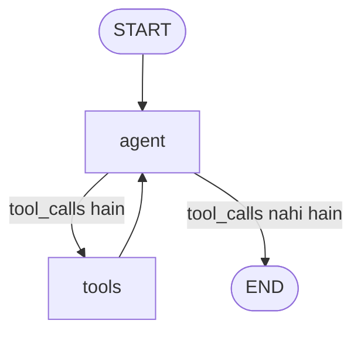

# Tools Inside Graphs

🟡 Intermediate

## Kya hota hai?

Chapter 7 mein humne tools manually wire kiye the — LLM ko call karo, `tool_calls` check karo, `for` loop chalao, har tool `.invoke()` karo, result ko `ToolMessage` bana ke wapas messages array mein push karo, phir LLM ko dobara call karo. Ye poora dance humne apne haath se likha tha, taaki samajh aaye hood ke neeche kya ho raha hai.

Ab socho Swiggy ka delivery-partner-assignment system. Har order ke liye wahi steps repeat hote hain — nearest partner dhundo, unhe notify karo, accept/reject dekho, dobara try karo agar reject hua. Koi engineer roz subah uth ke ye logic haath se nahi likhta — ek **standard, battle-tested module** hai jo ye pattern handle karta hai, aur engineers sirf business rules customize karte hain.

LangGraph.js mein bhi yahi cheez hai: **`ToolNode`**. Ye ek pre-built node hai jo Chapter 7 ka poora "execute tool calls aur ToolMessage banao" wala boilerplate tumhare liye kar deta hai — automatically, parallel execution ke saath, error handling ke saath, aur graph ke andar ek clean, reusable node ki tarah plug-and-play hota hai.

```
Chapter 7 (manual):  aiResponse.tool_calls → for loop → matchedTool.invoke() → new ToolMessage(...)
Chapter 19 (LangGraph): new ToolNode([tool1, tool2, ...])   ← yehi sab automatic
```

## Kyun zaruri hai agent-building mein?

Jab tum LangGraph mein ek tool-calling agent banate ho, tumhare graph mein hamesha ek recurring loop hota hai:

```
agent (LLM decide karta hai) → tools (execute karo) → agent (result dekh ke next step decide karo) → ... → END
```

Ye "agent ↔ tools" loop itna common hai ki LangChain team ne isko ek first-class, reusable building block bana diya — `ToolNode`. Isko khud se implement karna galat nahi hai (Chapter 7 mein humne kiya bhi), lekin production mein `ToolNode` use karna better hai kyunki:

1. **Parallel execution built-in hai** — agar LLM ek saath 3 tools call kare, `ToolNode` unhe automatically parallel (`Promise.all`-style) run karta hai, sequential nahi.
2. **Error handling standardized hai** — tool fail ho to graph crash nahi hota, error message automatically `ToolMessage` mein wrap ho jaata hai.
3. **Less boilerplate** — tumhe manually `tool_call_id` track karna, `ToolMessage` banana, registry maintain karna — kuch nahi karna padta.
4. **Graph ke saath naturally integrate hota hai** — `MessagesAnnotation` state ke saath directly kaam karta hai, jo LangGraph ka standard message-passing state hai.

> [!info]
> `ToolNode` aur `toolsCondition` dono `@langchain/langgraph/prebuilt` module se aate hain. Ye "prebuilt" module LangGraph ke sabse common patterns (ReAct agent, tool execution) ko ready-made components ki tarah deta hai — Chapter 22 mein hum `createReactAgent` bhi dekhenge, jo internally `ToolNode` hi use karta hai.

---

## Setup

```bash
npm install @langchain/langgraph @langchain/core @langchain/openai zod
```

```ts
// Common imports used throughout this chapter
import { StateGraph, MessagesAnnotation, START, END } from "@langchain/langgraph";
import { ToolNode, toolsCondition } from "@langchain/langgraph/prebuilt";
import { ChatOpenAI } from "@langchain/openai";
import { tool } from "@langchain/core/tools";
import { z } from "zod";
```

---

## 1. `MessagesAnnotation` — Tool-Calling Agents Ka Standard State

Tool-calling loops mein state kaafi predictable hoti hai: bas ek growing array of messages (`HumanMessage`, `AIMessage`, `ToolMessage`). LangGraph iske liye ek ready-made state schema deta hai — `MessagesAnnotation` — taaki tumhe har baar `messages` field aur uska reducer khud se likhna na pade.

```ts
import { MessagesAnnotation } from "@langchain/langgraph";

// MessagesAnnotation internally kuch aisa hi hai:
//
// Annotation.Root({
//   messages: Annotation<BaseMessage[]>({
//     reducer: (existing, update) => existing.concat(
//       Array.isArray(update) ? update : [update]
//     ),
//     default: () => [],
//   }),
// });

type AgentState = typeof MessagesAnnotation.State;
// { messages: BaseMessage[] }
```

> [!tip]
> Iska reducer **append** karta hai, replace nahi — jab bhi koi node `{ messages: [newMessage] }` return karta hai, wo naya message existing array mein add ho jaata hai, purane messages delete nahi hote. Yehi behavior chahiye hota hai conversation history maintain karne ke liye (jaisa tumne Chapter 15 mein reducers detail se dekha tha).

Zyadatar tool-calling graphs `MessagesAnnotation` ko seedha use kar lete hain. Agar tumhe extra fields chahiye (jaise `retryCount`, `userId`), to `Annotation.Root` mein `...MessagesAnnotation.spec` spread kar sakte ho:

```ts
import { Annotation, MessagesAnnotation } from "@langchain/langgraph";

const CustomAgentState = Annotation.Root({
  ...MessagesAnnotation.spec,
  retryCount: Annotation<number>({
    reducer: (existing, update) => existing + update,
    default: () => 0,
  }),
});
```

---

## 2. `ToolNode` — Anatomy

`ToolNode` ek class hai jo tumhare tools ka array leta hai aur ek aisa node banata hai jo:

1. State ke `messages` array se **last message** nikaalta hai
2. Check karta hai ki wo `AIMessage` hai aur usme `tool_calls` hain
3. Har `tool_call` ke liye matching tool dhundta hai (naam se match)
4. Sab tools ko **parallel** execute karta hai
5. Har result ko `ToolMessage` mein wrap karta hai (`tool_call_id` automatically set hota hai)
6. `{ messages: [...toolMessages] }` return karta hai — jo `MessagesAnnotation` ke reducer se automatically append ho jaata hai

```ts
import { tool } from "@langchain/core/tools";
import { z } from "zod";
import { ToolNode } from "@langchain/langgraph/prebuilt";

const getWeatherTool = tool(
  async ({ city }: { city: string }) => {
    const mockWeatherDB: Record<string, string> = {
      pune: "29°C, Partly Cloudy",
      mumbai: "32°C, Humid",
      delhi: "38°C, Sunny",
    };
    return mockWeatherDB[city.toLowerCase()] ?? `Weather data available nahi hai ${city} ke liye.`;
  },
  {
    name: "get_weather",
    description: "Kisi bhi city ka current weather return karta hai.",
    schema: z.object({ city: z.string().describe("Shehar ka naam") }),
  }
);

// Bas itna hi — tools ka array do, ToolNode ban jaata hai
const toolNode = new ToolNode([getWeatherTool]);
```

### `ToolNode` ko standalone test karna

`ToolNode` bhi ek normal `Runnable` hai — tum isko graph ke bahar bhi directly invoke kar sakte ho, testing ke liye:

```ts
import { AIMessage } from "@langchain/core/messages";

const result = await toolNode.invoke({
  messages: [
    new AIMessage({
      content: "",
      tool_calls: [
        {
          name: "get_weather",
          args: { city: "Pune" },
          id: "call_123",
          type: "tool_call",
        },
      ],
    }),
  ],
});

console.log(result);
/*
{
  messages: [
    ToolMessage {
      content: "29°C, Partly Cloudy",
      tool_call_id: "call_123",
      name: "get_weather",
      ...
    }
  ]
}
*/
```

> [!tip]
> Ye standalone testing pattern bahut useful hai — tumhe poora graph compile kiye bina hi verify karna hai ki tumhara `ToolNode` sahi se kaam kar raha hai, given ek fake `AIMessage` with `tool_calls`.

---

## 3. `toolsCondition` — Routing Ka Ready-Made Helper

Chapter 14 mein humne `shouldContinue` naam ka ek custom routing function likha tha jo check karta tha ki last message mein `tool_calls` hain ya nahi. `toolsCondition` exactly yehi function hai, pre-built:

```ts
import { toolsCondition } from "@langchain/langgraph/prebuilt";

// toolsCondition internally roughly ye karta hai:
//
// function toolsCondition(state: typeof MessagesAnnotation.State) {
//   const lastMessage = state.messages[state.messages.length - 1];
//   if (lastMessage.tool_calls?.length) {
//     return "tools";
//   }
//   return END;
// }
```

Isko `.addConditionalEdges()` ke saath directly use karte hain:

```ts
graph.addConditionalEdges("agent", toolsCondition);
```

`toolsCondition` do possible values return karta hai: `"tools"` (agar tool call pending hai) ya `END` (agar LLM final answer de chuka hai). Ye already `pathMap` ke bina bhi kaam karta hai kyunki LangGraph ismein default mapping samajh leta hai, lekin explicit likhna zyada readable hota hai:

```ts
graph.addConditionalEdges("agent", toolsCondition, {
  tools: "tools",
  [END]: END,
});
```

---

## 4. Poora Worked Example — ReAct-Style Weather + Calculator Agent

Ab sab kuch jodte hain — ek complete, runnable tool-calling agent jo `StateGraph` + `ToolNode` + `toolsCondition` use karke banaya gaya hai.

```ts
import { StateGraph, MessagesAnnotation, START, END } from "@langchain/langgraph";
import { ToolNode, toolsCondition } from "@langchain/langgraph/prebuilt";
import { ChatOpenAI } from "@langchain/openai";
import { tool } from "@langchain/core/tools";
import { z } from "zod";

// ---------- 1. Tools define karo ----------
const getWeatherTool = tool(
  async ({ city }: { city: string }) => {
    const mockWeatherDB: Record<string, string> = {
      pune: "29°C, Partly Cloudy",
      mumbai: "32°C, Humid",
      delhi: "38°C, Sunny",
    };
    return mockWeatherDB[city.toLowerCase()] ?? `Weather data available nahi hai ${city} ke liye.`;
  },
  {
    name: "get_weather",
    description: "Kisi bhi city ka current weather return karta hai.",
    schema: z.object({ city: z.string().describe("Shehar ka naam") }),
  }
);

const calculatorTool = tool(
  async ({ expression }: { expression: string }) => {
    // Production mein 'eval' kabhi mat use karo — yeh sirf demo ke liye hai.
    // Real project mein 'mathjs' jaisi safe-eval library use karo.
    try {
      // eslint-disable-next-line no-eval
      const result = eval(expression);
      return `${expression} = ${result}`;
    } catch {
      return `Error: "${expression}" ek valid math expression nahi hai.`;
    }
  },
  {
    name: "calculator",
    description: "Simple math expressions evaluate karta hai, jaise '25 * 4' ya '(100 + 50) / 2'.",
    schema: z.object({ expression: z.string().describe("Math expression, jaise '25 * 4'") }),
  }
);

const allTools = [getWeatherTool, calculatorTool];

// ---------- 2. LLM ko tools ke saath bind karo ----------
const model = new ChatOpenAI({ model: "gpt-4o", temperature: 0 });
const modelWithTools = model.bindTools(allTools);

// ---------- 3. Nodes define karo ----------

// "agent" node — LLM ko call karta hai, decide karta hai tool chahiye ya nahi
async function callModel(state: typeof MessagesAnnotation.State) {
  const response = await modelWithTools.invoke(state.messages);
  // MessagesAnnotation reducer isko automatically append kar dega
  return { messages: [response] };
}

// "tools" node — sirf ek line! ToolNode sab kuch handle karta hai
const toolNode = new ToolNode(allTools);

// ---------- 4. Graph banao ----------
const graph = new StateGraph(MessagesAnnotation)
  .addNode("agent", callModel)
  .addNode("tools", toolNode)
  .addEdge(START, "agent")
  .addConditionalEdges("agent", toolsCondition, {
    tools: "tools",
    [END]: END,
  })
  .addEdge("tools", "agent"); // tool result wapas agent ko do — loop

const app = graph.compile();

// ---------- 5. Run karo ----------
async function main() {
  const result = await app.invoke({
    messages: [
      { role: "user", content: "Pune ka weather kya hai, aur 15% tip agar bill 850 hai to kitna banega?" },
    ],
  });

  // Sirf final answer print karo
  const lastMessage = result.messages[result.messages.length - 1];
  console.log(lastMessage.content);
}

main();
```

**Expected flow (roughly):**

```
1. agent node → LLM decide karta hai: get_weather("Pune") aur calculator("850 * 0.15") dono chahiye
2. tools node → ToolNode dono ko PARALLEL execute karta hai, 2 ToolMessages banata hai
3. agent node → LLM dono results dekh ke final natural-language answer banata hai
4. toolsCondition → tool_calls nahi hain ab, to END
```

Output kuch aisa hoga:

```
Pune mein abhi 29°C hai aur mausam Partly Cloudy hai. Aur ₹850 ke bill pe 15% tip ₹127.50 banega.
```

### Graph visualize karo

```ts
const drawableGraph = await app.getGraphAsync();
console.log(drawableGraph.drawMermaid());
```



Ye bilkul wahi diagram hai jo Chapter 14 mein humne "Tool-Calling Agent Loop" section mein dekha tha — bas ab `tools` node manually likhne ke bajaye `ToolNode` se aa raha hai.

---

## 5. Parallel Tool Execution — Andar Kya Ho Raha Hai

Jab LLM ek response mein multiple `tool_calls` return karta hai (jaisa upar wale example mein hua), `ToolNode` unhe **sequentially loop nahi karta** — sabko ek saath `Promise.all`-style parallel run karta hai:

```ts
// ToolNode internally roughly ye karta hai (simplified):
async function runToolNode(state: { messages: BaseMessage[] }) {
  const lastMessage = state.messages[state.messages.length - 1] as AIMessage;
  const toolCalls = lastMessage.tool_calls ?? [];

  const toolMessages = await Promise.all(
    toolCalls.map(async (call) => {
      const matchedTool = toolRegistry.get(call.name);
      try {
        const output = await matchedTool!.invoke(call.args);
        return new ToolMessage({ content: output, tool_call_id: call.id!, name: call.name });
      } catch (err) {
        return new ToolMessage({
          content: `Error: ${(err as Error).message}`,
          tool_call_id: call.id!,
          name: call.name,
        });
      }
    })
  );

  return { messages: toolMessages };
}
```

> [!info]
> Ye parallelism latency ke liye bahut important hai. Agar LLM 3 independent tools call kare (jaise weather + calculator + web search), sequential execution mein 3x latency lagegi. `ToolNode` ke parallel execution se sab ek saath chalte hain — total time ~ sabse slowest tool ka time, teeno ka sum nahi.

> [!warning]
> Parallel execution ka matlab hai ki tools **independent** hone chahiye — agar ek tool ka output dusre tool ka input hai (sequential dependency), to LLM khud dusra tool call tab tak nahi karega jab tak pehle wale ka result na dekh le (ye alag `agent → tools → agent → tools` cycles mein hoga, ek hi batch mein nahi). Lekin agar tumne khud custom logic likhi hai jo do parallel tool calls ko manually order-dependent bana degi, wahan bugs aa sakte hain — is baare mein tool descriptions mein clear raho.

---

## 6. Error Handling — `ToolNode` Ka Default Behavior

`ToolNode` mein error handling **built-in aur default-on** hai — agar koi tool andar se throw karta hai, `ToolNode` poore graph ko crash nahi hone deta. Wo error ko catch karke, ek `ToolMessage` mein wrap karke LLM ko wapas bhej deta hai, taaki LLM khud decide kare graceful response kaise dena hai.

```ts
const flakyTool = tool(
  async ({ orderId }: { orderId: string }) => {
    if (orderId === "FAIL") {
      throw new Error("Order service temporarily unavailable");
    }
    return `Order ${orderId} status: Delivered`;
  },
  {
    name: "get_order_status",
    description: "Order ID se status fetch karta hai.",
    schema: z.object({ orderId: z.string() }),
  }
);

const toolNodeWithErrorHandling = new ToolNode([flakyTool]);

const result = await toolNodeWithErrorHandling.invoke({
  messages: [
    new AIMessage({
      content: "",
      tool_calls: [{ name: "get_order_status", args: { orderId: "FAIL" }, id: "call_1", type: "tool_call" }],
    }),
  ],
});

console.log(result.messages[0].content);
// "Error: Order service temporarily unavailable"
```

Agar tumhe ye default behavior **off** karna hai (jaise, tumhe chahiye ki tool error poore graph ko fail kare — kabhi kabhi ye desired hota hai critical operations ke liye), `handleToolErrors: false` pass karo:

```ts
const strictToolNode = new ToolNode([flakyTool], {
  handleToolErrors: false,
});

// Ab agar tool throw karta hai, poora graph.invoke() reject ho jayega
try {
  await strictToolNode.invoke({ messages: [/* ... */] });
} catch (err) {
  console.error("Graph crashed:", (err as Error).message);
}
```

| Option | Default | Behavior |
|---|---|---|
| `handleToolErrors: true` (default) | ✅ | Tool error catch hota hai, `ToolMessage` mein wrap hoke LLM ko jaata hai — LLM gracefully respond kar sakta hai |
| `handleToolErrors: false` | — | Tool error graph ke through propagate hota hai — poora `.invoke()` call fail ho jaata hai |

> [!tip]
> **Default (`true`) zyadatar production agents ke liye sahi choice hai.** Socho Zomato ka support bot — agar "check delivery partner location" tool internally fail ho jaaye (API timeout), tumhe poora conversation crash nahi karna, balki LLM ko bolna hai "abhi location fetch nahi ho pa raha, thodi der baad try karo" jaisa graceful message dena. `handleToolErrors: false` sirf tab use karo jab tool ki success **critical** ho aur fail hone pe upstream retry/alerting logic chalni chahiye (jaise payment processing tools).

---

## 7. Custom Tool Node — Jab `ToolNode` Kaafi Na Ho

`ToolNode` 90% cases ke liye perfect hai, lekin kabhi-kabhi tumhe extra control chahiye — jaise per-tool logging, tool-specific rate-limiting, ya destructive tools ke liye confirmation step. Aise cases mein tum apna khud ka node likh sakte ho (bilkul Chapter 7 wale pattern jaisa), aur `ToolNode` ki jagah use kar sakte ho:

```ts
import { AIMessage, ToolMessage } from "@langchain/core/messages";

const toolRegistry = new Map(allTools.map((t) => [t.name, t]));

async function customToolNode(state: typeof MessagesAnnotation.State) {
  const lastMessage = state.messages[state.messages.length - 1] as AIMessage;
  const toolCalls = lastMessage.tool_calls ?? [];

  const toolMessages = await Promise.all(
    toolCalls.map(async (call) => {
      console.log(`[audit] Tool called: ${call.name}`, call.args); // custom logging

      // Destructive tools ke liye extra guard (Chapter 16 mein human-in-the-loop se better solve hota hai)
      if (call.name === "charge_payment") {
        console.log("[guard] Payment tool detected — extra validation chal rahi hai...");
      }

      const matchedTool = toolRegistry.get(call.name);
      if (!matchedTool) {
        return new ToolMessage({
          content: `Error: Tool '${call.name}' registered nahi hai.`,
          tool_call_id: call.id!,
          name: call.name,
        });
      }

      try {
        const output = await matchedTool.invoke(call.args as Record<string, unknown>);
        return new ToolMessage({ content: output, tool_call_id: call.id!, name: call.name });
      } catch (err) {
        return new ToolMessage({
          content: `Error executing ${call.name}: ${(err as Error).message}`,
          tool_call_id: call.id!,
          name: call.name,
        });
      }
    })
  );

  return { messages: toolMessages };
}

// Graph mein "tools" node ki jagah customToolNode use karo
const customGraph = new StateGraph(MessagesAnnotation)
  .addNode("agent", callModel)
  .addNode("tools", customToolNode)
  .addEdge(START, "agent")
  .addConditionalEdges("agent", toolsCondition, { tools: "tools", [END]: END })
  .addEdge("tools", "agent");
```

> [!info]
> Ye pattern samajhna zaroori hai kyunki real production agents mein aksar `ToolNode` ke default behavior + kuch custom cross-cutting concerns (logging, metrics, guardrails) dono chahiye hote hain. Agar sirf per-tool logging chahiye, better approach hai LangChain callbacks use karna (Chapter 10) instead of poora `ToolNode` rewrite karna — lekin destructive-action guards jaisi cheezon ke liye custom node ya Chapter 16 ka human-in-the-loop interrupt pattern zyada robust hai.

---

## 8. Streaming Ke Saath `ToolNode`

Jab graph ko `.stream()` se run karte ho (Chapter 20 mein detail), `ToolNode` ke andar chal rahe tool calls ke updates bhi stream events mein dikhte hain:

```ts
const stream = await app.stream(
  { messages: [{ role: "user", content: "Delhi ka weather batao" }] },
  { streamMode: "updates" }
);

for await (const chunk of stream) {
  console.log(chunk);
  // { agent: { messages: [AIMessage with tool_calls] } }
  // { tools: { messages: [ToolMessage with weather data] } }
  // { agent: { messages: [AIMessage with final answer] } }
}
```

Har node (`agent`, `tools`) apna update alag se emit karta hai — isse tumhe real-time visibility milti hai ki agent kis step pe hai (jaise UI mein "Checking weather..." dikhana).

---

## 9. `ToolNode` vs Manual Loop (Chapter 7) — Comparison

| Aspect | Manual Loop (Chapter 7) | `ToolNode` (LangGraph) |
|---|---|---|
| Boilerplate | `for` loop, registry, `ToolMessage` banana khud | `new ToolNode([tools])` — ek line |
| Parallel execution | Khud `Promise.all` likhna padta | Built-in |
| Error handling | Khud try/catch likhna padta | Built-in (`handleToolErrors`) |
| Graph integration | N/A — ye standalone chat loop tha | Native `StateGraph` node |
| Control granularity | Full control (line-by-line) | Standard behavior; custom node likh ke override kar sakte ho |
| Kab use karo | Chhote scripts, single-turn tool calls, ya jab poora custom control chahiye | Multi-turn agent loops, production graphs — 95% cases |

> [!tip]
> Chapter 7 ka manual loop samajhna zaroori tha taaki tumhe pata ho `ToolNode` ke andar actually kya ho raha hai. Ab production code mein hamesha `ToolNode` (ya usse extend kiya hua custom node) use karo — reinventing the wheel karne ki zaroorat nahi.

---

## 10. Common Mistakes (Gotchas)

1. **`MessagesAnnotation` ka use na karna aur khud state likhna** — agar tum apna custom `messages` field banate ho bina sahi reducer ke (append instead of replace), `ToolNode` ke results purane messages ko overwrite kar denge. Hamesha `MessagesAnnotation` (ya usko spread karke extend kiya hua schema) use karo.

2. **`tools` node se `agent` node tak edge bhoolna** — agar `.addEdge("tools", "agent")` missing hai, to tool execute hone ke baad graph `tools` node pe hi ruk jayega, LLM ko result kabhi wapas nahi milega, aur loop complete nahi hoga.

3. **`toolsCondition` ko bina `pathMap` ke use karke confuse hona** — `toolsCondition` bina explicit `pathMap` ke bhi kaam karta hai, lekin `pathMap` dena visualization aur readability ke liye better practice hai. Ise likhna mat bhoolo jab graph complex ho jaaye.

4. **Sochna `ToolNode` LLM ko khud call karta hai** — nahi! `ToolNode` sirf **execution** karta hai — decide karna ki kaunsa tool call karna hai, ye kaam `agent` node (LLM) ka hai. `ToolNode` ko kabhi seedha `START` se connect mat karo — usse hamesha ek `AIMessage` chahiye jisme `tool_calls` ho.

5. **`handleToolErrors: false` production mein bina soche use karna** — ye poore graph ko crash karwa sakta hai ek single flaky external API ki wajah se. Default (`true`) rakho jab tak koi specific reason na ho.

6. **Bahut saare tools ek `ToolNode` mein daal dena bina categorization ke** — jaisa Chapter 7 mein bhi discuss kiya, bahut zyada tools LLM ki accuracy kam karte hain tool-selection mein. `ToolNode` khud is problem ko solve nahi karta — tumhe still sochna padega kaunse tools kis agent/node ko available karne hain (multi-agent architectures — Chapter 18 — isi problem ko solve karte hain).

7. **Destructive tools (payment, delete, email) ko bina guard ke `ToolNode` mein daal dena** — `ToolNode` khud koi confirmation step nahi maangta. Agar tool side-effecting hai, ya to custom node likho jisme guard logic ho, ya better — Chapter 16 ka **human-in-the-loop `interrupt()`** pattern use karo taaki execution se pehle explicit human approval mile.

---

## 11. Production Considerations

| Concern | Kya karo |
|---|---|
| **Latency** | `ToolNode` ka parallel execution already latency reduce karta hai jab multiple independent tools call hote hain. Slow tools (external APIs) ke liye timeout wrap karo tool ke andar (`Promise.race` / `AbortController`) — warna poora `ToolNode` us tool ke response ka wait karega |
| **Cost** | Har `agent → tools → agent` cycle do LLM calls hain. Loop ki max depth track karo (state mein `retryCount` field rakh ke) taaki infinite loops bill na fod dein |
| **Error observability** | `handleToolErrors: true` errors ko silently LLM tak bhej deta hai — production mein bhi in errors ko **log/trace** karo (LangSmith, Chapter 10) taaki tumhe pata chale kaunsa tool kitni baar fail ho raha hai |
| **Idempotency** | Agar graph retry karta hai (network issue ke baad), tool ke side effects duplicate na hon — jaise payment tool dobara charge na kare same request ke liye |
| **Guardrails for destructive tools** | Payment, delete, email-sending jaise tools ke liye human-in-the-loop confirmation (Chapter 16) ya explicit allow-list based execution consider karo |
| **Tool count per agent** | Ek `ToolNode` mein 10-15 se zyada tools daalne se pehle socho — zyada tools chahiye to multi-agent architecture (Chapter 18) mein split karo, jahan har sub-agent ke paas apna focused `ToolNode` ho |

> [!warning]
> **`ToolNode` sirf execution automate karta hai — safety tumhari responsibility hai.** Ye kabhi mat assume karo ki "LangGraph ka built-in component use kar raha hoon to sab safe hai". Destructive/side-effecting tools ke liye explicit guardrails design karna hamesha tumhara kaam hai.

---

## Key Takeaways

- **`ToolNode`** (`@langchain/langgraph/prebuilt`) Chapter 7 ke manual "execute tool_calls → build ToolMessages" loop ko automate karta hai — bas tools ka array pass karo, `new ToolNode([tool1, tool2])`.
- `ToolNode` last message se `tool_calls` nikaalta hai, matching tools **parallel** execute karta hai, aur `tool_call_id`-matched `ToolMessage`s ke saath `{ messages: [...] }` return karta hai.
- **`MessagesAnnotation`** tool-calling agents ka standard state schema hai — `messages` field with append-only reducer, jisse `ToolNode` ke results automatically history mein add ho jaate hain.
- **`toolsCondition`** (`@langchain/langgraph/prebuilt`) ready-made routing function hai jo check karta hai "last message mein tool_calls hain?" — `tools` ya `END` return karta hai.
- Standard tool-calling agent graph: `START → agent → (toolsCondition) → tools → agent → ... → END`.
- **Error handling built-in hai** (`handleToolErrors: true` by default) — tool fail hone pe graph crash nahi hota, error `ToolMessage` mein wrap hoke LLM ko milta hai. `false` set karke ye behavior override kar sakte ho jab strict failure chahiye ho.
- Jab extra control chahiye (custom logging, per-tool guards), apna **custom tool-execution node** likho — bilkul Chapter 7 ke pattern jaisa, bas graph ke andar node ki tarah.
- **Destructive tools ke liye `ToolNode` akela kaafi nahi hai** — human-in-the-loop confirmation (Chapter 16) ya custom guard logic add karo.
- Production mein: latency (timeouts), cost (loop depth limits), observability (tracing), aur idempotency — sab dhyan mein rakho jab `ToolNode`-based agents deploy karo.
- Agla chapter (**Streaming**) dikhayega ki `ToolNode` ke andar chal rahe steps ko real-time UI mein kaise expose karte hain — taaki user ko dikhe "agent abhi weather check kar raha hai" jaisa live feedback.
