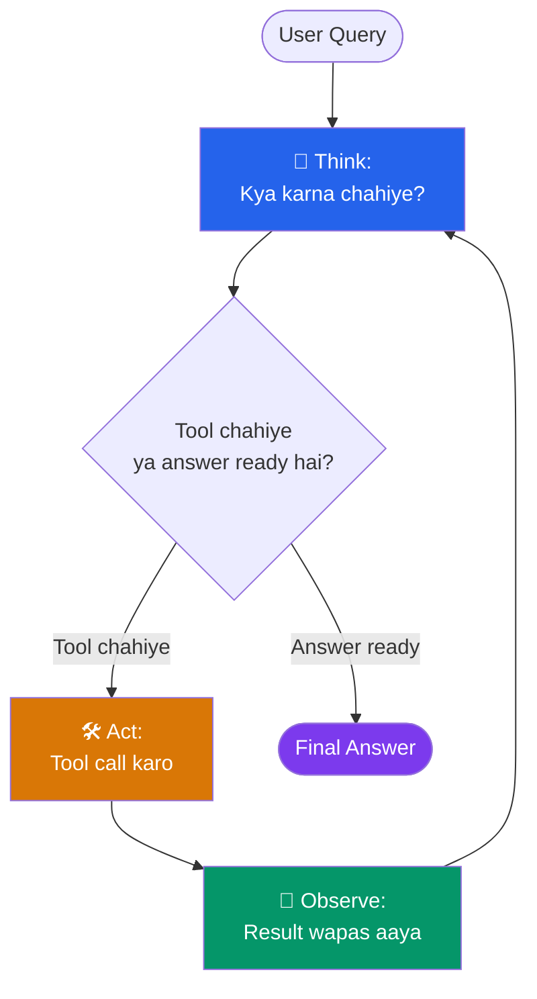
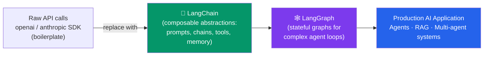
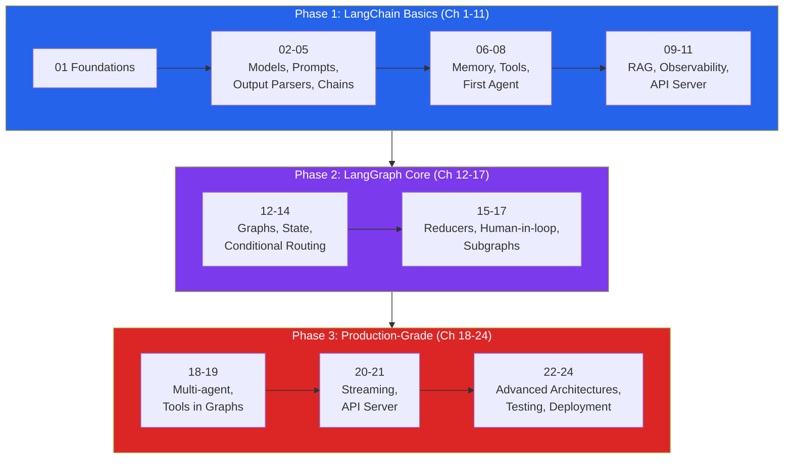

# Foundations of AI Agents

🟢 **Beginner**

## Kya hota hai yeh chapter?

Chalo ek chai ke saath baithte hain, kyunki yeh puri 24-chapter journey ka sabse important chapter hai. Agar iski neev kachi rahi, toh aage jaake LangGraph ke state graphs, multi-agent systems, sab kuch confusing lagega. Toh dhyaan se padhna — yeh chapter thoda lamba hai, lekin har cheez zaruri hai.

Is chapter mein hum samjhenge:
- Ek "AI Agent" actually hota kya hai — aur woh simple ChatGPT jaise LLM call se kaise alag hai
- LLM ke andar chal kya raha hota hai (tokens, context window, function calling) — kyunki agent banane se pehle engine samajhna zaruri hai
- **Observe → Think → Act** loop, jise industry mein **ReAct pattern** kehte hain
- LangChain aur LangGraph jaise frameworks kyun exist karte hain — hum apna khud ka agent loop kyun nahi likh lete?
- Kab tumhe sirf ek simple chain chahiye, aur kab full-blown agent
- Aage ke 23 chapters mein kya-kya seekhoge, taaki tumhare mind mein ek roadmap ban jaaye

---

## 1. LLM Call vs AI Agent — Fark Kya Hai?

### Kya hota hai ek simple LLM call?

Socho tumne Zomato pe khana order karne ke liye ek chatbot banaya. User ne pucha: *"Paneer tikka ki recipe batao"* — aur tumne seedha LLM ko yeh sawal bhej diya, usne jawab de diya. Bas. Ek request gayi, ek response aaya. Ismein na koi memory hai, na koi tool, na koi decision-making — sirf ek **glorified autocomplete** hai jo bohot accha likhta hai.

```python
from langchain_openai import ChatOpenAI

llm = ChatOpenAI(model="gpt-4o-mini", temperature=0)
response = llm.invoke("Paneer tikka ki recipe batao")
print(response.content)
```

Yeh bas ek **request-response** hai. Input gaya, text output aaya, kahani khatam. Isse hum "LLM call" ya "single-shot completion" kehte hain.

### Ab socho ek real AI Agent

Ab yeh scenario socho: User bolta hai — *"Mujhe pata karo ki Swiggy pe abhi konsa restaurant open hai near mujhe, aur unme se sabse acche rating wale se paneer tikka order kar do."*

Yahan LLM sirf text generate nahi kar sakta — usse:
1. **Sochna** padega ki kaunse steps chahiye (pehle location pata karo, phir restaurants dhundo, phir rating compare karo, phir order place karo)
2. **Tools use karne** padenge (location API, Swiggy search API, order placement API)
3. **Results dekh kar agla decision** lena padega (agar restaurant band hai toh dusra dhundo)
4. **State/memory rakhni** padegi (pehle wale steps yaad rakhne padenge taki context na khoye)

Yeh hai ek **Agent**. Ek simple formula yaad rakh lo:

> **Agent = LLM (brain) + Tools (hands) + Loop (decision-making cycle) + Memory (context)**

| Feature | Simple LLM Call | AI Agent |
|---|---|---|
| Interaction | Ek baar poochho, ek baar jawab | Multiple internal steps, loop chalti hai |
| Tools | Nahi (sirf text in → text out) | Haan — APIs, DB queries, calculators, search |
| Decision making | Nahi, seedha jawab | Haan — "ab kya karu?" khud decide karta hai |
| Memory | Stateless (by default) | Conversation + task history maintain karta hai |
| Example | "Is paragraph ka summary do" | "Mera flight book karo aur hotel bhi dhundo budget ke andar" |
| Predictability | High (deterministic-ish) | Lower (multi-step, kabhi kabhi galat path le sakta hai) |
| Latency/Cost | Low (1 API call) | High (N API calls, N tokens) |

> [!info]
> Yeh distinction interview mein bhi bohot poocha jaata hai: "What is the difference between an LLM application and an agent?" Answer hamesha yeh hona chahiye — **agency**, matlab decision-making capability jo tools aur loop se milti hai.

---

## 2. LLM Ke Andar Kya Chal Raha Hai? (Zaruri Basics)

Agent banane se pehle, engine ko samajhna zaruri hai. Yeh 3 concepts foundation hain.

### 2.1 Tokens aur Context Window

LLM text ko letter-by-letter ya word-by-word nahi padhta — woh **tokens** mein padhta hai. Token matlab chhote sub-word units.

- Rule of thumb: **1 token ≈ ¾ word** (ya 100 tokens ≈ 75 words)
- "apple" shayad ek hi token ho, lekin "unprecedented" jaise complex words multiple tokens mein toot sakte hain ("un", "precedent", "ed")
- OpenAI jaise providers apna khud ka tokenizer use karte hain (jaise `tiktoken` library with `o200k_base` encoding for GPT-4o)

**Context Window** LLM ki "short-term memory" hai — ek single request mein woh maximum kitne tokens process kar sakta hai (input + output dono milaake). Jaise GPT-4o ka context window 128,000 tokens hai.

> [!warning]
> Agent workflows mein yeh **critical** hai. Agent ka history (thoughts + actions + observations) tezi se badhta hai. Agar tum context window exceed kar doge, error aayega ya purani information silently drop ho jaayegi. Isliye production agents mein "context management" ek poora topic hai — hum ise chapter 06 (Memory) aur chapter 15 (State Management) mein detail se cover karenge.

Zomato analogy: Socho context window ek waiter ki notepad hai — usme sirf itni jagah hai ki woh ek table ka order likh sake. Agar order bohot lamba ho jaaye (20 items + special requests + allergies), purani cheezein bhool sakta hai agar notepad chhoti hai.

### 2.2 Function/Tool Calling

Pehle LLMs sirf raw text output kar sakte the. Agar tumhe LLM se web search karwana hota, toh uske text response se regex se query nikalni padti thi — bohot fragile approach.

**Function Calling** (ya Tool Calling) ne yeh badal diya. Modern LLMs ko fine-tune kiya gaya hai taaki woh pehchaan sakein ki kab ek function call karni chahiye, aur us function ke liye zaruri arguments ka JSON object output kar sakein.

Jab tum LLM ko "tools" ki list dete ho, tum essentially usse available functions ka JSON schema de rahe ho. LLM decide karta hai *kya* usse tool chahiye, aur agar haan, toh woh exact JSON payload reply karta hai jo tumhare local Python function ko execute karne ke liye chahiye.

```python
from langchain_core.tools import tool

@tool
def get_weather(location: str) -> str:
    """Fetch the current weather for a given location."""
    # Real app mein yahan ek weather API call hoga
    return f"The weather in {location} is sunny and 72°F."

tools = [get_weather]
llm_with_tools = llm.bind_tools(tools)

response = llm_with_tools.invoke("Seattle mein weather kaisa hai?")
print(response.tool_calls)
# Output: [{'name': 'get_weather', 'args': {'location': 'Seattle'}, 'id': 'call_abc123'}]
```

Dhyaan do — LLM ne khud weather call **nahi** ki. Usne bas bola "mujhe `get_weather(location='Seattle')` call karni chahiye." Actual function execute karna tumhara (ya framework ka) kaam hai. Yeh separation hi agent architecture ki foundation hai.

### 2.3 Structured Outputs (Pydantic v2)

Agents ko predictable data structures chahiye hote hain jo traditional software se interact kar sakein. Agar agent user data extract kar raha hai, tumhe conversational paragraph nahi chahiye — tumhe clean JSON chahiye.

Iske liye hum **Pydantic v2** use karte hain — Python ki standard data validation library. Yeh strict schemas define karne deta hai jo LLM ko follow karne padte hain.

```python
from pydantic import BaseModel, Field

class UserExtraction(BaseModel):
    name: str = Field(description="The full name of the user.")
    age: int = Field(description="The age of the user in years.")
    interests: list[str] = Field(default_factory=list, description="A list of hobbies.")

structured_llm = llm.with_structured_output(UserExtraction)

text = "My name is John Doe. I am 28 years old and I love hiking, reading, and coding."
result = structured_llm.invoke(text)

print(result.name)      # John Doe
print(result.age)       # 28
print(result.interests) # ['hiking', 'reading', 'coding']
```

`.with_structured_output()` background mein tool-calling mechanics use karta hai taaki response guaranteed schema match kare — koi brittle string-parsing ki zarurat nahi. Yeh concept chapter 04 mein deep-dive hoga.

---

## 3. The Agent Loop: Observe → Think → Act (ReAct Pattern)

Ab main concept — agent kaam kaise karta hai?

Foundational paradigm ka naam hai **ReAct** (Reason + Act), jo 2022 mein Yao et al. ke paper mein introduce hua tha. ReAct reasoning (Thought) aur acting (Action) ko ek iterative loop mein combine karta hai.

### Loop ke 4 steps:

1. **Thought (Observe + Think):** Agent current situation analyze karta hai aur decide karta hai ki aage kya karna hai.
2. **Action (Act):** Agent ek tool choose karta hai aur zaruri arguments provide karta hai.
3. **Observation:** System LLM ko pause karta hai, tool execute karta hai (jaise DB query ya API call), aur result wapas LLM ko feed karta hai.
4. **Repeat:** LLM naye information ko dekhta hai, sochta hai, aur ya toh doosra action leta hai, ya `Final Answer` deta hai.

### Ek real example dekho:

> **User:** Tokyo mein weather kaisa hai, aur kya pehnu?
>
> **Thought:** Pehle mujhe Tokyo ka current weather pata karna hoga.
> **Action:** `get_weather(location="Tokyo, Japan")`
> **Observation:** `Temperature is 15°C, raining.`
>
> **Thought:** Ab mujhe weather pata hai. 15°C aur baarish ke hisaab se clothing recommend karni hai.
> **Action:** `Final Answer: Abhi Tokyo mein 15°C hai aur baarish ho rahi hai. Light jacket pehno aur umbrella saath rakho.`

Yeh loop hi ek static chatbot ko ek **autonomous agent** mein badal deta hai jo multi-step problems solve kar sakta hai.

### Diagram se samjho



Yeh "Observe → Think → Act" cycle jab tak chalta rehta hai jab tak agent ko lagta nahi ki uske paas final answer dene ke liye kaafi information hai. Isi loop ko hum LangGraph mein baad mein ek explicit **graph** ke roop mein model karenge (chapter 12 onwards) — kyunki plain Python loop mein isse manage karna mushkil ho jaata hai jaise complexity badhti hai.

> [!tip]
> Interview trick: Agar koi tumse poochhe "agent kaise kaam karta hai," toh bas yeh char words yaad rakho: **Thought → Action → Observation → Repeat**. Yeh 90% agent architectures ka core hai — chahe woh LangChain ho, LangGraph ho, ya OpenAI ka native agent SDK ho.

---

## 4. Frameworks Kyun Chahiye? (LangChain / LangGraph)

### Kya hota hai agar tum apna khud ka agent loop likho?

Chalo dekhte hain ki bina framework ke ek basic ReAct loop kaisa dikhega — taki tumhe pata chale framework kya problem solve karta hai.

```python
import json
from openai import OpenAI

client = OpenAI()

tools_schema = [{
    "type": "function",
    "function": {
        "name": "get_weather",
        "description": "Fetch current weather for a location",
        "parameters": {
            "type": "object",
            "properties": {"location": {"type": "string"}},
            "required": ["location"],
        },
    },
}]

def get_weather(location: str) -> str:
    return f"{location} mein 15°C hai aur baarish ho rahi hai."

messages = [{"role": "user", "content": "Tokyo mein weather kaisa hai?"}]

# Manual loop -- yeh sab boilerplate hum baar baar likhenge har agent ke liye
while True:
    response = client.chat.completions.create(
        model="gpt-4o", messages=messages, tools=tools_schema
    )
    msg = response.choices[0].message
    messages.append(msg)

    if not msg.tool_calls:
        print(msg.content)  # Final answer mil gaya
        break

    # Har tool call ko manually handle karna padega
    for tool_call in msg.tool_calls:
        args = json.loads(tool_call.function.arguments)
        result = get_weather(**args)  # Agar 10 tools hon, yahan if-else ka pahad ban jaayega
        messages.append({
            "role": "tool",
            "tool_call_id": tool_call.id,
            "content": result,
        })
```

Yeh chhote example mein theek lag raha hai, lekin production mein jab tumhe **10+ tools**, **retry logic**, **streaming**, **memory persistence**, **multiple LLM providers**, **human-in-the-loop approval**, aur **multi-agent coordination** chahiye ho — yeh manual code exponentially complex ho jaata hai.

### Isliye LangChain aur LangGraph exist karte hain

Yeh Node.js developers ke liye ek accha analogy hai: jaise Express, Node ke raw `http` module ke upar baitha hai, waise hi **LangChain**, raw LLM API calls ke upar baitha hai.



**LangChain** deta hai:
- Standardized LLM wrappers (`ChatOpenAI`, `ChatAnthropic`) — provider switch karna ek line change
- Prompt Templates — reusable, dynamic prompts
- `.bind_tools()` aur `@tool` decorator — Python functions ko LLM-ready tools mein convert karna
- `.with_structured_output()` — Pydantic schemas ke saath guaranteed structured responses
- LCEL (LangChain Expression Language) — `|` pipe operator se chains banana

**LangGraph** deta hai (hum chapter 12 se deep dive karenge):
- ReAct jaise **cyclical loops** ko ek explicit **graph** (nodes + edges) ke roop mein model karna
- **State management** — agent history automatically track hoti hai
- **Human-in-the-loop** — kisi step pe pause karke human approval lena
- **Persistence** — agent ka state crash ke baad bhi resume ho sakta hai
- **Multi-agent orchestration** — multiple specialized agents ko coordinate karna

> [!info]
> LangChain linear aur simple cyclical workflows ke liye accha hai. Lekin jab loops complex ho jaate hain (agent kabhi aage jaata hai, kabhi peeche, kabhi parallel branches), plain LangChain chains isse handle karne mein struggle karte hain. Isi gap ko **LangGraph** fill karta hai — graph theory use karke stateful, multi-actor, cyclical workflows reliably manage karna.

### LangChain ka quick taste — LCEL Chains

```python
from langchain_openai import ChatOpenAI
from langchain_core.prompts import ChatPromptTemplate
from langchain_core.output_parsers import StrOutputParser

llm = ChatOpenAI(model="gpt-4o", temperature=0)

prompt = ChatPromptTemplate.from_messages([
    ("system", "Tum ek helpful assistant ho jo sirf {language} mein baat karta hai."),
    ("user", "{input}")
])

# Pipe operator (|) se chain banayi -- prompt -> llm -> parser
chain = prompt | llm | StrOutputParser()

response = chain.invoke({
    "language": "Hinglish",
    "input": "Quantum computing kya hoti hai, ek line mein batao."
})

print(response)
# Output: "Quantum computing woh technology hai jisme bits ki jagah qubits use hote hain,
#          jo ek saath multiple states mein reh sakte hain, isliye kuch calculations bohot fast ho jaate hain."
```

Yeh `|` operator Unix pipes jaisa hai — ek component ka output doosre ka input ban jaata hai. Isse hum chapter 05 mein detail se explore karenge.

---

## 5. Kab Simple Chain Kaafi Hai, Kab Full Agent Chahiye?

Yeh sabse important practical decision hai jo production mein tumhe baar baar lena padega. Har cheez ke liye agent mat banao — zyada tools, zyada latency, zyada cost, aur zyada unpredictability.

| Situation | Use Karo | Kyun |
|---|---|---|
| Fixed sequence of steps (summarize → translate → format) | **Simple Chain (LCEL)** | Steps predictable hain, koi decision-making nahi chahiye |
| "Extract structured data from this text" | **Structured Output call** | Ek hi LLM call, koi loop nahi chahiye |
| "Answer using this document" (RAG) | **Retrieval Chain** | Retrieve → Generate, ek fixed 2-step pattern |
| "Book a flight, check budget, negotiate hotel, adjust if unavailable" | **Full Agent (Tools + Loop)** | Multi-step, dynamic decisions, unknown number of steps |
| "Coordinate research + writing + editing agents together" | **Multi-Agent System (LangGraph)** | Multiple specialized agents, complex state sharing |
| "Customer support bot jo escalate kare human ko agar zaruri ho" | **Agent + Human-in-the-loop** | Dynamic + safety-critical decisions |

### Simple decision rule

> [!tip]
> Apne aap se poochho: **"Kya main pehle se jaanta hoon ki kitne steps lagenge, aur kaunse order mein?"**
> - Agar **haan** → Chain likho (LCEL). Fast, predictable, cheap.
> - Agar **nahi**, LLM ko khud decide karna padega ki kitne steps aur kaunsa tool kab use karna hai → Agent banao.

Real-world Zomato analogy: Agar tumhe bas "is order ka bill calculate karo" karna hai, woh ek fixed formula hai — chain kaafi hai. Lekin agar tumhe "customer ki complaint dekho, decide karo refund dena hai ya replacement, aur agar customer angry lage toh manager ko escalate karo" — yeh dynamic decision-making hai, ismein agent chahiye.

> [!warning]
> Common mistake: Beginners har cheez ke liye agent bana dete hain, chahe simple chain se kaam chal jaata. Isse latency aur cost dono badh jaate hain (agent ke andar LLM multiple baar call hoti hai), aur reliability kam ho jaati hai (jitne zyada autonomous decisions, utni zyada galti ki gunjaish). **Simplest solution jo kaam kare, wahi use karo.**

---

## 6. Poori 24-Chapter Journey Ka Roadmap

Ab jab foundation clear hai, dekhte hain aage kya-kya aane wala hai — taki tumhe pata rahe hum kahan se kahan tak jaa rahe hain.



**Phase 1 (Chapters 1-11) — LangChain Fundamentals:** Yahan hum LLM wrappers, prompt engineering, structured outputs, chains/LCEL, memory, tools, aur tumhara pehla actual working agent banayenge. Iske baad RAG (documents se answer nikalna) aur observability (LangSmith se tracing) bhi cover hoga.

**Phase 2 (Chapters 12-17) — LangGraph Core:** Yahan hum simple chains se aage badh kar **stateful graphs** seekhenge — nodes, edges, conditional routing, state reducers, human-in-the-loop approval flows, aur subgraphs (nested agents).

**Phase 3 (Chapters 18-24) — Production-Grade Systems:** Multi-agent systems (multiple agents ek saath kaam karte hue), streaming responses, agents ko API ke peeche serve karna, advanced architectures, testing strategies, aur finally production deployment — monitoring, cost control, error handling, sab kuch.

> [!info]
> Har chapter is course ka assumption hai ki tumne pichla chapter padha hai — concepts build karte jaate hain. Agar kabhi confuse ho jaao, is chapter (Foundations) pe wapas aa jaana — Agent = LLM + Tools + Loop + Memory, yeh formula sab kuch explain karta hai.

---

## 7. Ek Poora Mini-Agent Example (Preview)

Chapter khatam karne se pehle, chalo ek chhota sa complete agent dekhte hain jo abhi ke concepts ko jodta hai — LLM, tool binding, aur ek manual loop. Yeh chapter 08 mein hum properly LangChain ke `create_agent`/`AgentExecutor` patterns ke saath karenge, lekin abhi ke liye idea dekho:

```python
from langchain_openai import ChatOpenAI
from langchain_core.tools import tool
from langchain_core.messages import HumanMessage, ToolMessage

llm = ChatOpenAI(model="gpt-4o", temperature=0)

@tool
def get_weather(location: str) -> str:
    """Current weather batata hai kisi bhi location ke liye."""
    return f"{location} mein abhi 15°C hai aur baarish ho rahi hai."

@tool
def suggest_clothing(temperature_celsius: int, is_raining: bool) -> str:
    """Weather ke hisaab se clothing suggest karta hai."""
    if is_raining:
        return "Light jacket pehno aur umbrella saath rakho."
    return "Halke kapde theek rahenge."

tools = [get_weather, suggest_clothing]
llm_with_tools = llm.bind_tools(tools)
tool_map = {t.name: t for t in tools}

messages = [HumanMessage("Tokyo mein weather kaisa hai, aur kya pehnu?")]

# Yeh hi hai woh Observe -> Think -> Act loop, code mein
for _ in range(5):  # Max 5 iterations -- production mein hamesha ek upper limit rakho!
    ai_msg = llm_with_tools.invoke(messages)
    messages.append(ai_msg)

    if not ai_msg.tool_calls:
        print("Final Answer:", ai_msg.content)
        break

    for call in ai_msg.tool_calls:
        tool_result = tool_map[call["name"]].invoke(call["args"])
        messages.append(ToolMessage(content=str(tool_result), tool_call_id=call["id"]))
```

Notice karo:
- `bind_tools()` se LLM ko pata chala ki uske paas kya options hain
- LLM khud decide karta hai kaunsa tool call karna hai aur kab
- Humne loop mein `range(5)` limit lagayi — **yeh production mein zaruri hai**, warna agent infinite loop mein phas sakta hai aur tumhara API bill explode ho jaayega

> [!warning]
> **Common production gotcha:** Agents ka koi natural "stop" nahi hota agar tum khud limit na lagao. Har production agent mein max iteration count, timeout, aur cost-tracking zaruri hai. Hum ise chapter 24 (Production Deployment) mein detail se cover karenge.

---

## Key Takeaways

- **Agent = LLM + Tools + Loop + Memory.** Simple LLM call ek single request-response hai; agent multi-step decisions leta hai, tools use karta hai, aur apna context maintain karta hai.
- LLM ke andar 3 foundational concepts samajhna zaruri hai: **tokens/context window** (short-term memory limit), **function/tool calling** (LLM ko real-world actions se jodna), aur **structured outputs via Pydantic** (predictable data).
- **ReAct pattern** (Thought → Action → Observation → Repeat) hi wo core loop hai jo agents ko autonomous banata hai — yeh loop LangChain se lekar LangGraph tak, har jagah repeat hota hai.
- **LangChain** raw API calls ke upar composable abstractions deta hai (prompts, chains, tools, memory) — jaise Express, Node's `http` module ke upar baitha hai.
- **LangGraph** un cyclical, stateful, multi-actor workflows ke liye hai jo plain LangChain chains handle nahi kar paate — graph theory use karke reliability aur control milta hai.
- Har cheez ke liye agent mat banao — agar steps aur order pehle se pata hai, ek simple **chain** kaafi hai. Agent tab use karo jab LLM ko khud decide karna pade "ab kya karna hai."
- Production agents mein **iteration limits, cost tracking, aur error handling** shuru se hi plan karo — agent loop by default infinite ho sakta hai.
- Yeh course 3 phases mein chalega: LangChain basics (Ch 1-11) → LangGraph core (Ch 12-17) → Production-grade systems (Ch 18-24).
