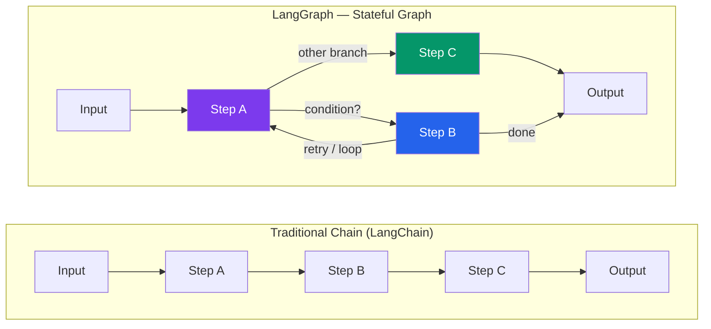

# Introduction to LangGraph

> 🟢 **Level: Beginner** (thoda intermediate flavor bhi hai, kyunki hum yahan se production-grade agent-building ki neev rakh rahe hain)

## Kya hota hai LangGraph?

Socho tum Zomato pe order daal rahe ho. Agar poora flow ek seedhi line mein chale — "order place karo → restaurant ko bhejo → deliver karo → khatam" — toh life easy hoti. Lekin real duniya mein aisa nahi hota:

- Restaurant ne order **reject** kar diya? Wapas restaurant list pe jao.
- Delivery partner nahi mila? **Retry** karo, thoda wait karo, phir se try karo.
- Payment fail ho gaya? User se **dobara** payment method maango.
- Order deliver ho gaya lekin user ne complaint ki? **Refund flow** trigger karo.

Ye ek seedhi line (linear chain) nahi hai — ye ek **graph** hai, jisme loops hain, branches hain, aur decisions hain jo runtime pe liye jaate hain. Zomato ka backend agar sirf "step A → step B → step C" jaisa likha hota, toh ye sab edge cases handle hi nahi ho pate.

**LangGraph** exactly isi problem ko solve karta hai — AI agents ke liye. Ye ek framework hai jo tumhare agent ke workflow ko ek **directed graph** ke roop mein model karta hai:

- **Nodes** = steps (jaise "LLM ko call karo", "tool chalao", "response format karo")
- **Edges** = transitions (kaunse step ke baad kaunsa step chalega)
- **State** = shared context jo har node dekh sakta hai aur update kar sakta hai (jaise order ka data jo pura pipeline share karta hai)

LangGraph, LangChain ke upar hi bana hai, lekin socheny ka tareeka bilkul alag hai — chain ki jagah, tum ek **state machine** design karte ho.

> [!tip]
> Agar tumne JS/TS mein **XState** use kiya hai state machines ke liye, toh LangGraph tumhe turant familiar lagega. Same mental model — bas iska use-case specifically LLM agents ke liye optimize kiya gaya hai. Is chapter ke end mein ek side-by-side comparison bhi hai.

---

## Kyun zaruri hai? Chains kaafi kyun nahi hain?

Chapter ke pichle hisso mein humne LangChain **chains** dekhi thi — `prompt | llm | parser` jaisi pipelines. Ye bahut powerful hain jab tumhara flow **predictable aur linear** ho. Lekin jaise hi tum "agent" banate ho — jo khud decide karta hai ki kya karna hai — chains ka model tootna shuru ho jaata hai.

### Ek concrete example: Customer Support Bot

Socho tum ek customer support bot bana rahe ho jo IRCTC ke refund queries handle karta hai:

1. User ka message aata hai
2. Bot classify karta hai: "billing", "technical", ya "general" query
3. Har category ka apna specialized handler hai
4. Agar handler ko lagta hai ki usse zyada info chahiye, wo user se **dobara puchega** (loop back!)
5. Jab tak satisfactory answer nahi mil jaata, ye chalta rahega
6. Aakhir mein sab ek common "format_response" node pe converge honge

Is flow mein **conditional branching** hai (kaunsa handler), **cycles** hain (dobara puchna), aur **convergence** hai (sab ek jagah milte hain). Ek plain LangChain chain (`RunnableSequence`) mein ye sab likhna possible hai, lekin bahut messy ho jaata hai — nested if-else, manual loops, state ko haath se pass karna. Ye code jaldi hi **unmaintainable spaghetti** ban jaata hai.



Chain (upar wala box) sirf ek direction mein chal sakti hai. Graph (neeche wala box) mein cycles hain, branches hain — bilkul waisa hi jaisa ek real agent ka decision-making hota hai.

### Jo cheezein chains natively support nahi karti:

| Requirement | Kyun chahiye | Chain mein problem |
|---|---|---|
| **Cycles / Loops** | Agent retry kare, ya jab tak sahi answer na mile tab tak sochta rahe (ReAct pattern) | Chain purely acyclic (DAG) hoti hai — loop banane ke liye hacky Python `while` loops likhne padte hain |
| **Conditional branching (runtime pe)** | LLM khud decide kare ki tool use karna hai ya seedha jawab dena hai | Chain mein branching hardcode karni padti hai, dynamic routing awkward hai |
| **Human-in-the-loop** | Kisi sensitive action (jaise payment refund) se pehle human approval chahiye | Chain ko pause/resume karne ka koi built-in tareeka nahi |
| **Persistence / Memory** | User ne kal baat adhoori chhodi thi, aaj wahi se continue karna hai | DIY — khud database mein state save-load karna padta hai |
| **Multi-agent coordination** | Ek "supervisor" agent, kai "worker" agents ko tasks assign kare | Chains mein agents ke beech handoff design karna bahut mushkil |

**Jab plain LangChain chain use karo:**
- Simple `prompt -> LLM -> output` — ek shot mein kaam ho jaaye
- RAG (Retrieval-Augmented Generation) jisme pipeline fixed hai: retrieve → augment → generate
- Koi iteration ya decision-making nahi chahiye

**Jab LangGraph use karo:**
- Agent jo khud decide kare ki kaunsa tool kab call karna hai, aur multiple baar call kar sake
- Multi-step reasoning jo tab tak loop kare jab tak koi condition satisfy na ho jaaye
- Workflow jisme human approval chahiye beech mein
- Multi-agent systems jaha agents ek doosre ko kaam handoff karte hain
- Koi bhi scenario jisme conversation state ko requests ke beech persist karna hai

---

## Graph-based Thinking: Core Primitives

LangGraph teen basic buildings blocks pe khada hai — **State**, **Nodes**, aur **Edges**. Chalo ek-ek karke samjhte hain, Zomato order-tracking example ke saath.

### 1. State — Shared Context (jaise order ka data)

State ek typed dictionary hai jo **poore graph mein shared** rehta hai. Har node isi state ko padhta hai aur update karta hai — bilkul waise jaise Zomato ka order object har microservice (payment, restaurant, delivery) ke through pass hota hai aur har service usme apna data add karti hai.

```python
from typing import TypedDict, Annotated
import operator

class AgentState(TypedDict):
    messages: Annotated[list, operator.add]  # Naye messages append honge, overwrite nahi
    next_action: str
    iteration_count: int
```

`Annotated[list, operator.add]` ek important detail hai — ye LangGraph ko batata hai ki jab koi node `messages` update kare, toh **naye messages ko list mein append karo**, poori list ko replace mat karo. Ye reducer function hai. Agar tum `Annotated` use nahi karoge, default behavior hoga — naya value purane ko **overwrite** kar dega.

> [!warning]
> Ye ek common mistake hai beginners ke liye: agar `messages` field pe reducer (`operator.add` ya `add_messages`) nahi lagaya, toh har node ke baad tumhara conversation history **gayab** ho jaayega — sirf last node ka return value bachega.

### 2. Nodes — Steps jo kaam karte hain

Nodes plain Python functions hain jo current state lete hain, kuch kaam karte hain, aur ek **partial update** return karte hain (poora naya state nahi — sirf jo change karna hai).

```python
def call_llm(state: AgentState) -> dict:
    """Node jo LLM ko call karta hai aur state update return karta hai."""
    response = llm.invoke(state["messages"])
    return {"messages": [response]}  # Sirf ye field update hogi

def check_order_status(state: AgentState) -> dict:
    """Node jo order status check karta hai — jaise Zomato ka tracking service."""
    status = fetch_order_status(state["order_id"])
    return {"status": status}
```

Notice karo — node poora state return nahi karta, sirf jo keys change karni hain wo return karta hai. LangGraph baaki state ko as-is rakhta hai (ya reducer logic apply karta hai jahan define ho).

### 3. Edges — Transitions (kaunsa step next chalega)

Do tarah ki edges hoti hain:

- **Normal edge**: hamesha A se B pe jaata hai, koi condition nahi
- **Conditional edge**: ek "router" function state dekhkar decide karta hai ki agla node kaunsa hoga

```python
graph.add_edge("call_llm", "process_response")            # Hamesha
graph.add_conditional_edges("process_response", router)   # Condition ke hisaab se
```

Router function bas ek string return karta hai — us string se next node decide hota hai:

```python
def router_function(state: AgentState) -> str:
    """State dekhkar batata hai ki agla node kaunsa hoga."""
    if state["counter"] < 3:
        return "loop_back"
    else:
        return "finish"
```

### 4. Special Nodes: START aur END

Har graph mein do special markers hote hain:
- `START` — graph ka entry point (yahan se execution shuru hota hai)
- `END` — graph ka exit point (yahan pahunchte hi execution ruk jaata hai)

```python
from langgraph.graph import StateGraph, START, END
```

### 5. Compilation — Graph ko runnable banana

Nodes aur edges define karne ke baad, tumhe graph ko **compile** karna padta hai. Ye ek runnable object banata hai jise tum `.invoke()` kar sakte ho.

```python
app = graph.compile()
result = app.invoke({"messages": [HumanMessage(content="Hello")]})
```

Compilation ke time LangGraph validate karta hai ki graph structurally sahi hai — koi orphan node toh nahi, START/END sahi se connected hain ya nahi, waghera.

---

## LangChain Agent vs LangGraph: Comparison Table

Ab tak jitna dekha, use ek table mein summarize karte hain — LangChain ka traditional "agent" approach vs LangGraph ka graph-based approach.

| Feature | LangChain Agent / Chain | LangGraph |
|---|---|---|
| Execution flow | Linear ya simple branching | Arbitrary graph, cycles allowed |
| State management | Chain ke through pass hota hai, mostly immutable | Centralized, mutable shared state object |
| Cycles / Loops | Natively support nahi (manual `while` loops) | First-class support (`add_edge` back to same node) |
| Conditional routing | Hardcoded ya AgentExecutor ke internal logic pe depend | Explicit `add_conditional_edges` — tum khud control karte ho |
| Human-in-the-loop | Manual workarounds, complex | Built-in `interrupt`/resume support |
| Persistence (memory) | DIY — khud implement karo | Built-in checkpointing (`MemorySaver`, SQL, Redis) |
| Multi-agent coordination | Mushkil, tightly coupled | Supervisor aur handoff patterns first-class |
| Streaming | Chain-level (poora output ek saath) | Node-level, token-level bhi possible |
| Debuggability | AgentExecutor ek "black box" jaisa lagta hai | Har node/edge visible hai — graph draw kar sakte ho |
| Best for | Simple RAG, one-shot tasks | Complex agents, tool-loops, production systems |

> [!info]
> LangChain ka purana `AgentExecutor` class ab officially **deprecated / legacy** treat kiya jaata hai naye projects ke liye. LangChain team khud recommend karti hai ki naye agents LangGraph mein banao — `create_react_agent` jaisa prebuilt helper bhi LangGraph package (`langgraph.prebuilt`) mein hi milta hai.

---

## Installation

```bash
# Core LangGraph
pip install langgraph

# LangChain core aur ek LLM provider bhi chahiye hoga
pip install langchain-core langchain-openai

# Visualization ke liye (optional)
pip install pygraphviz
# Ya built-in Mermaid output use karo (extra install ki zaroorat nahi)
```

Installation verify karo:

```python
import langgraph
print(langgraph.__version__)
```

API key set karo (OpenAI ya jo bhi provider use kar rahe ho):

```bash
# .env file mein ya environment variable
export OPENAI_API_KEY="sk-..."
```

```python
import os
os.environ["OPENAI_API_KEY"] = "sk-..."
```

---

## Tumhara Pehla LangGraph: Hello World

Chalo sabse simple graph banate hain — do nodes, sequence mein.

```python
from typing import TypedDict
from langgraph.graph import StateGraph, START, END


# 1. State define karo
class GreetingState(TypedDict):
    name: str
    greeting: str


# 2. Node functions define karo
def create_greeting(state: GreetingState) -> dict:
    return {"greeting": f"Hello, {state['name']}! Welcome to LangGraph."}


def add_signoff(state: GreetingState) -> dict:
    return {"greeting": state["greeting"] + " Have a great day!"}


# 3. Graph build karo
graph = StateGraph(GreetingState)
graph.add_node("greet", create_greeting)
graph.add_node("enhance", add_signoff)

graph.add_edge(START, "greet")
graph.add_edge("greet", "enhance")
graph.add_edge("enhance", END)

# 4. Compile aur run karo
app = graph.compile()
result = app.invoke({"name": "Siddesh", "greeting": ""})

print(result["greeting"])
# Output: Hello, Siddesh! Welcome to LangGraph. Have a great day!
```

Bas itna hi! Ye chain jaisa hi simple lag raha hai abhi — lekin agla step dekhte hain jaha ye chain se alag ho jaata hai: **loops aur branching**.

### Graph ko visualize karo

```python
# Mermaid diagram syntax mein output
print(app.get_graph().draw_mermaid())
```

Ye Mermaid-compatible text deta hai jo tum kisi bhi Mermaid renderer mein paste karke graph ko visually dekh sakte ho — bahut useful hai debugging ke liye.

---

## Ab thoda complex: Conditional Branching aur Loops

Yahi wo jagah hai jaha LangGraph asli power dikhata hai. Neeche ek example hai jisme ek node khud ko **3 baar loop** karta hai jab tak counter 3 tak na pahunch jaaye — bilkul retry logic jaisa (jaise payment gateway 3 baar retry kare fail hone pe).

```python
from typing import TypedDict, Annotated
import operator
from langgraph.graph import StateGraph, START, END


class RetryState(TypedDict):
    messages: Annotated[list, operator.add]
    counter: int
    status: str


def process_node(state: RetryState) -> dict:
    print(f"Processing... attempt {state.get('counter', 0) + 1}")
    return {"counter": state.get("counter", 0) + 1}


def final_node(state: RetryState) -> dict:
    return {"status": "completed"}


def router_function(state: RetryState) -> str:
    """State dekhkar decide karta hai — loop continue kare ya finish."""
    if state["counter"] < 3:
        return "loop_back"
    return "finish"


builder = StateGraph(RetryState)

builder.add_node("process_node", process_node)
builder.add_node("final_node", final_node)

builder.add_edge(START, "process_node")

# Conditional routing add karo
builder.add_conditional_edges(
    "process_node",           # Source node
    router_function,          # Routing logic
    {
        "loop_back": "process_node",  # Router "loop_back" bole toh wapas process_node
        "finish": "final_node",       # Router "finish" bole toh final_node
    },
)

builder.add_edge("final_node", END)
compiled_graph = builder.compile()

# Ye 3 baar loop karega phir finish hoga
result = compiled_graph.invoke({"messages": [], "counter": 0, "status": "pending"})
print(f"Final Counter: {result['counter']}, Status: {result['status']}")
# Output: Final Counter: 3, Status: completed
```

Ye exact wahi pattern hai jo ek **real agent** use karta hai jab wo tool call karta hai, result dekhta hai, aur decide karta hai ki aur ek tool call chahiye ya final answer de de. Isi pattern ko "ReAct" (Reason + Act) kehte hain, jo aage ke chapters mein detail mein cover hoga.

> [!tip]
> Production mein infinite loop se bachne ke liye hamesha ek **max iteration guard** rakho router function mein (jaise upar `counter < 3`), warna agent kabhi-kabhi endlessly loop kar sakta hai aur tumhara LLM bill aasman chhoo lega.

---

## XState se Comparison (JS/TS Developers ke liye)

Agar tumne Node.js projects mein **XState** use kiya hai state machines ke liye, toh mental model bilkul close hai:

| XState Concept | LangGraph Equivalent |
|---|---|
| `Machine` | `StateGraph` |
| `context` | State (`TypedDict`) |
| `states` / `on` | Nodes + Edges |
| `guards` | Conditional edge functions (router) |
| `actions` | Node functions |
| `invoke` (services) | Nodes jo LLM ya tools call karte hain |
| `assign` | Node ka return value (partial state update) |
| `final` state | `END` node |

**XState example (conceptual):**
```typescript
// TypeScript / XState
const agentMachine = createMachine({
  id: "agent",
  initial: "thinking",
  context: { messages: [], toolResults: [] },
  states: {
    thinking: {
      invoke: { src: "callLLM", onDone: "deciding" },
    },
    deciding: {
      always: [
        { target: "usingTool", guard: "needsTool" },
        { target: "responding" },
      ],
    },
    usingTool: {
      invoke: { src: "executeTool", onDone: "thinking" },
    },
    responding: { type: "final" },
  },
});
```

**LangGraph equivalent:**
```python
from langgraph.graph import StateGraph, START, END

graph = StateGraph(AgentState)

graph.add_node("thinking", call_llm)
graph.add_node("using_tool", execute_tool)
graph.add_node("responding", format_response)

graph.add_edge(START, "thinking")
graph.add_conditional_edges("thinking", decide_next, {
    "use_tool": "using_tool",
    "respond": "responding",
})
graph.add_edge("using_tool", "thinking")  # Cycle wapas!
graph.add_edge("responding", END)

app = graph.compile()
```

Dono jagah same idea hai: states, transitions, aur guards ke through control flow. Farak sirf itna hai ki LangGraph specifically LLM-driven decisions ke liye bana hai (LLM khud "guard" ban jaata hai jab wo decide karta hai tool call karni hai ya nahi).

---

## Common Mistakes aur Gotchas

1. **Reducer bhoolna State fields pe**: Agar `messages` jaisi list field pe `Annotated[list, operator.add]` ya `add_messages` reducer nahi lagaya, toh har node purani list ko overwrite kar dega. Conversation history gayab ho jaayegi.

2. **Router function se galat string return karna**: `add_conditional_edges` ka teesra argument (mapping dictionary) ke keys aur router function ke return values match hone chahiye. Agar router `"loop_back"` return kare lekin mapping mein sirf `"retry"` key ho, toh `KeyError` aayega runtime pe.

3. **Infinite loops**: Conditional edge se cycle banate waqt hamesha ek exit condition guaranteed rakho (max iterations, timeout, ya explicit success flag). Warna agent kabhi khatam nahi hoga aur API costs explode ho jaayenge.

4. **Node se poora state return karna (jab sirf partial chahiye)**: Nodes ko sirf wo keys return karni chahiye jo change hui hain. Poora state dobara return karna galat nahi hai technically, lekin reducer logic (jaise `operator.add`) ke saath conflict create kar sakta hai agar tum socho ki "overwrite" ho raha hai jabki "append" ho raha hai.

5. **`StateGraph` ko bina compile kiye invoke karne ki koshish**: `graph.invoke()` nahi chalega — pehle `app = graph.compile()` karna zaroori hai, phir `app.invoke()`.

> [!warning]
> Production mein, agar tumhara graph LLM calls pe based hai, toh **latency aur cost** dono ka dhyan rakho. Har loop iteration ek naya LLM call hai — matlab naya cost aur naya latency. Agle chapters mein hum streaming, checkpointing, aur cost-optimization patterns dekhenge jo isko production-ready banate hain.

---

## Key Takeaways

- LangGraph AI workflows ko **directed graphs** ke roop mein model karta hai — nodes (functions) aur edges (transitions) ke through.
- Linear chains ke ulat, graphs **cycles**, **conditional branching**, aur **human-in-the-loop** ko natively support karte hain.
- Teen core primitives: **State** (typed dict, shared context), **Nodes** (Python functions jo partial updates return karte hain), aur **Edges** (normal ya conditional transitions).
- `START` aur `END` special nodes hain jo entry/exit point define karte hain; graph ko `compile()` karke ek runnable object milta hai.
- State fields pe reducers (`operator.add`, `add_messages`) lagana zaroori hai warna data overwrite ho jaayega.
- LangChain chains simple, one-shot tasks ke liye best hain; LangGraph tab use karo jab tumhe loops, dynamic routing, memory, ya multi-agent coordination chahiye.
- Mental model **XState** jaisa hi hai agar tum JS/TS background se aa rahe ho — states, guards, actions sab map hote hain.
- Hamesha loops mein **exit conditions** rakho — infinite loop production mein disaster ban sakta hai (cost + latency).
