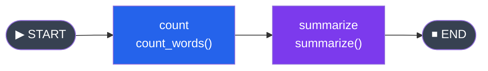

# State Graphs, Nodes and Edges

🟡 Intermediate

Socho ek second ke liye — tum Zomato pe khana order karte ho. Order place hote hi ek pipeline chalta hai: "order confirm" → "restaurant ko bhejo" → "rider assign karo" → "pickup" → "deliver". Har step pe kuch state change hoti hai — order status, rider location, ETA. Ye poora flow ek **graph** hai: nodes (steps) aur edges (kaunse step ke baad kaunsa step) se bana hua, aur beech mein ek shared "state" hai jo har step update karta rehta hai.

**LangGraph ka `StateGraph`** exactly yehi karta hai — tumhare AI agent ke pura workflow ko ek graph ki tarah define karne deta hai, jahan state ek object ki tarah nodes ke beech se guzarti hai, update hoti rehti hai, aur end mein final result milta hai.

Pichle chapter mein humne LangGraph ka overview dekha tha. Ab is chapter mein hum **StateGraph** ke core building blocks — State schema, Nodes, Edges, START/END, compile aur invoke — ko deeply samjhenge, aur ek pura runnable example bhi banayenge.

> [!info]
> Agar tumne Express.js ya any middleware-chain pattern use kiya hai, to socho: `req`/`res` object jo middleware se middleware flow karta hai, bas fark itna hai ki yahan flow linear nahi — **graph-shaped** hai, jisme branches aur cycles bhi ho sakte hain.

---

## Kya hota hai StateGraph?

`StateGraph` LangGraph ka core class hai jisse tum apna pura agent workflow define karte ho. Isme teen cheezein hoti hain:

- **State** — ek typed dictionary/object jo saare nodes ke beech shared hota hai (jaise order object jo Zomato ke pipeline mein saare stages se guzarta hai)
- **Nodes** — Python functions jo state ko read karte hain, kuch kaam karte hain (LLM call, tool call, koi computation), aur state ka ek **partial update** return karte hain
- **Edges** — connections jo define karte hain ki ek node ke baad flow kahan jayega

```python
from langgraph.graph import StateGraph, START, END
```

Yehi teen import tumhe har LangGraph file mein dikhenge.

### Kyun zaruri hai?

Normal function calls mein data linear flow karta hai — A call karo, B call karo, C call karo. Lekin real agents mein:
- Kabhi flow condition ke hisaab se branch hota hai ("agar confidence kam hai to human se pucho, warna directly respond karo")
- Kabhi loop chalta hai ("jab tak tool call complete na ho, retry karo")
- Multiple nodes same state ko modify karte hain, aur tumhe pata hona chahiye ki updates kaise merge honge

`StateGraph` yeh sab explicitly, visually aur debug-friendly tarike se model karne deta hai — bajaye iske ki tum nested if-else aur while loops mein spaghetti code likho.

---

## State Define Karna: TypedDict se

State ek Python `TypedDict` ke through define hoti hai. Agar tum TypeScript se aaye ho, to ye seedha `interface` jaisa hai — sirf ek difference: TypeScript ka `interface` sirf compile-time check hai, Python ka `TypedDict` bhi runtime pe koi enforcement nahi karta (ye sirf type-hinting ke liye hai), lekin LangGraph ise **schema** ki tarah use karta hai to samajhne ke liye ki state mein kaunse keys exist karte hain aur unhe kaise merge karna hai.

```python
from typing import TypedDict

class MyState(TypedDict):
    query: str
    response: str
    confidence: float
```

**TypeScript equivalent (comparison ke liye):**
```typescript
interface MyState {
  query: string;
  response: string;
  confidence: number;
}
```

`TypedDict` batata hai LangGraph ko: "state mein ye keys honi chahiye, aur inke types ye hain." Har node function isi shape ke dictionary ko receive karega aur isi shape ka partial update return karega.

### Defaults ka scene

`TypedDict` mein directly default values set nahi kar sakte (jaise Python dataclass mein hota hai). Isliye initial values tumhe `invoke()` call karte waqt provide karni padti hain:

```python
class SearchState(TypedDict):
    query: str
    results: list[str]
    page: int

# Invoke karte waqt saari zaruri initial values do
app.invoke({"query": "langgraph tutorial", "results": [], "page": 1})
```

> [!warning]
> Agar tum kisi key ko initial state mein include nahi karoge aur koi node uss key ko read karne ki koshish karega (jaise `state["page"]`), to `KeyError` aayega. Hamesha apni saari state keys ko initial dictionary mein include karo — chahe empty string ya empty list ke saath hi kyun na ho.

### Pydantic se State (alternative)

`TypedDict` ke alawa tum `Pydantic BaseModel` bhi use kar sakte ho agar tumhe **runtime validation** chahiye (jaise field types automatically check ho, invalid data pe error aaye):

```python
from pydantic import BaseModel

class MyStateModel(BaseModel):
    query: str
    response: str = ""
    confidence: float = 0.0

graph = StateGraph(MyStateModel)
```

Pydantic ka fayda: agar koi node galat type ka data return kare (jaise `confidence` mein string), to validation error turant pakड़ में aa jaayega — production mein ye bahut helpful hai. `TypedDict` lightweight hai aur zyada common hai tutorials/prototypes mein; Pydantic zyada robust hai production graphs ke liye jaha data validation critical ho.

| Feature | TypedDict | Pydantic BaseModel |
|---|---|---|
| Runtime validation | Nahi | Haan |
| Default values | Sirf `invoke()` pe | Class mein define kar sakte ho |
| Performance | Thoda fast (no validation overhead) | Thoda slower (validation cost) |
| Best for | Prototyping, simple graphs | Production, complex validation needs |

---

## Nodes Add Karna

**Node kya hota hai?** Ek plain Python function jo:
1. Current state ko argument ke roop mein receive karta hai
2. Kuch kaam karta hai — LLM call, tool call, database query, koi bhi transformation
3. Ek **partial state update dictionary** return karta hai

Socho jaise dabbawala ek dabba pick karta hai (state), usme kuch nahi badalta agar uska kaam sirf transport karna hai, lekin agar wo kisi stage pe koi label add karta hai to sirf wahi field update hoti hai — poora dabba dobara nahi banaya jaata.

```python
def analyze_query(state: MyState) -> dict:
    """Query ko analyze karo aur confidence set karo."""
    query = state["query"]
    # Kuch analysis logic
    is_clear = len(query.split()) > 3
    return {
        "confidence": 0.9 if is_clear else 0.3
    }

def generate_response(state: MyState) -> dict:
    """Query ke basis pe response generate karo."""
    return {
        "response": f"Here is the answer to: {state['query']}"
    }
```

Inhe graph mein add karo `add_node()` se:

```python
graph = StateGraph(MyState)
graph.add_node("analyze", analyze_query)
graph.add_node("generate", generate_response)
```

`add_node` ke do arguments hote hain:
- **Node name** (string) — ek unique identifier jisse baad mein edges mein refer karoge
- **Function** — jo actual logic execute karega

> [!tip]
> Node ka naam aur function ka naam same rakhna zaruri nahi, lekin readability ke liye ek jaisa rakhna best practice hai (jaise `"analyze"` node aur `analyze_query` function). Bade graphs mein ye debugging aur visualization dono easy bana deta hai.

### Sabse Important Rule: Partial Update

Node function **poori state return nahi karta** — sirf wo keys jo usne update ki hain. Baaki saari state as-is rehti hai. LangGraph internally in dictionaries ko current state ke saath **merge** kar deta hai.

Iska matlab: agar `MyState` mein `query`, `response`, `confidence` teen keys hain, aur `analyze_query` sirf `{"confidence": 0.9}` return karta hai, to `query` aur `response` unchanged rehte hain — overwrite nahi hote.

Ye Redux ke reducer pattern jaisa hai agar tumne React/Redux use kiya hai — `{...state, ...update}` jaisa spread merge hota hai (default behavior ke liye; custom reducers se ye merge logic aur bhi customize kiya ja sakta hai, jo hum future chapter mein "State Management and Reducers" mein dekhenge).

---

## Edges Add Karna

Edge batata hai: "Node A ke complete hone ke baad, flow node B pe jayega."

```python
graph.add_edge("analyze", "generate")
```

Ye ek **normal (unconditional) edge** hai — hamesha A ke baad B chalega. (Conditional/branching edges — jahan flow kisi condition pe depend karta hai — agle chapter "Conditional Edges and Routing" mein cover honge.)

### START aur END: Special Virtual Nodes

Har graph ko ek **entry point** aur kam se kam ek **exit point** chahiye hota hai. LangGraph do special virtual nodes provide karta hai:

- **`START`** — represent karta hai ki execution kahan se shuru hoga
- **`END`** — represent karta hai ki execution kahan khatam hoga

```python
from langgraph.graph import START, END

graph.add_edge(START, "analyze")       # Entry: "analyze" se shuru karo
graph.add_edge("generate", END)        # Exit: "generate" ke baad ruk jao
```

Socho `START` ko Zomato app kholne jaisa (order journey ka trigger point), aur `END` ko "order delivered" jaisa — journey ka final stop. Ek graph mein multiple paths bhi `END` tak ja sakte hain (jaise agar different branches alag-alag jagah se terminate hoti hain) — ye tab useful hota hai jab tumhare paas conditional routing ho.

> [!warning]
> Agar koi node `END` (ya kisi aage wale node) se connect nahi hai, to compile-time pe LangGraph error dega ki graph "dead end" pe hai. Har node ka ek clear outgoing path hona chahiye.

---

## Poora Example: Linear Graph

Chalo ek simple, fully-runnable graph banate hain jo text ko process karta hai — word count nikalta hai aur ek summary banata hai.

```python
from typing import TypedDict
from langgraph.graph import StateGraph, START, END


class PipelineState(TypedDict):
    text: str
    word_count: int
    summary: str


def count_words(state: PipelineState) -> dict:
    words = state["text"].split()
    return {"word_count": len(words)}


def summarize(state: PipelineState) -> dict:
    text = state["text"]
    # Demonstration ke liye simple truncation hi "summary" hai
    summary = text[:100] + "..." if len(text) > 100 else text
    return {"summary": f"({state['word_count']} words) {summary}"}


# Graph banao
graph = StateGraph(PipelineState)
graph.add_node("count", count_words)
graph.add_node("summarize", summarize)

graph.add_edge(START, "count")
graph.add_edge("count", "summarize")
graph.add_edge("summarize", END)

# Compile karo
app = graph.compile()
```

Iska flow kuch aisa dikhता है:



Ab isse run karte hain:

```python
result = app.invoke({
    "text": "LangGraph is a powerful framework for building stateful AI agent workflows. "
            "It models computation as a directed graph with nodes and edges.",
    "word_count": 0,
    "summary": "",
})

print(result["summary"])
# Output: (21 words) LangGraph is a powerful framework for building stateful AI agent workflows. It models computation as a di...
```

Dekha? Sirf 3 cheezein ki: state define karo → nodes/edges add karo → compile aur invoke karo. Yehi LangGraph ka core mental model hai.

---

## Graph Compile Karna

`graph.compile()` call karna zaruri hai run karne se pehle. Ye do kaam karta hai:

1. **Validation** — check karta hai ki graph structurally sahi hai
2. **Compiled runnable object return karta hai** (`CompiledGraph` / `CompiledStateGraph`), jisme `invoke`, `stream`, `ainvoke` jaise methods available hote hain

```python
app = graph.compile()
```

Compilation ke waqt LangGraph ye validate karta hai:
- Har node ka koi incoming edge hai (ya `START` se connected hai)
- Har node ka koi outgoing edge hai (ya `END` se connected hai)
- Edges mein reference kiye gaye node names actually graph mein exist karte hain

Agar koi mismatch hai (jaise typo mein node name galat likh diya), compile time pe hi error milega — runtime tak wait nahi karna padta. Ye TypeScript ke compile-time type checking jaisa comfort deta hai.

### Compile-time Options

`compile()` mein tum extra options bhi pass kar sakte ho:

```python
from langgraph.checkpoint.memory import MemorySaver

# Checkpointing (state persistence) ke saath
memory = MemorySaver()
app = graph.compile(checkpointer=memory)

# Interrupt points ke saath (human-in-the-loop ke liye)
app = graph.compile(
    checkpointer=memory,
    interrupt_before=["dangerous_action"]
)
```

- **`checkpointer`** — state ko step-by-step save karta hai, taaki tum kisi bhi point se resume kar sako (crash recovery, multi-turn conversations ke liye critical). Detail mein "Human in the Loop" chapter mein cover hoga.
- **`interrupt_before`** — kisi specific node se pehle graph execution ko pause kar deta hai, taaki human approval le sako (jaise "payment process" karne se pehle user confirmation lena).

---

## Graph Run Karna

Compile karne ke baad tumhare paas kai tareeke hain graph ko run karne ke.

### Synchronous: `invoke`

```python
result = app.invoke({"text": "Hello world", "word_count": 0, "summary": ""})
print(result)  # Poora final state dictionary
```

`invoke` graph ko end-to-end run karta hai aur final state return karta hai — sabse simple aur common tareeka.

### Asynchronous: `ainvoke`

Agar tum Node.js background se aaye ho, to tumhe async default lagta hai. Python mein async **opt-in** hai — explicitly `async`/`await` likhna padta hai. LangGraph dono support karta hai:

```python
import asyncio

async def main():
    result = await app.ainvoke({
        "text": "Hello world",
        "word_count": 0,
        "summary": "",
    })
    print(result)

asyncio.run(main())
```

**Node.js comparison:**
```typescript
// Node.js mein tum ye karte:
const result = await app.invoke({ text: "Hello world" });

// Python async mein:
result = await app.ainvoke({"text": "Hello world"})
```

> [!tip]
> Production mein, agar tum FastAPI jaisa async web framework use kar rahe ho, to hamesha `ainvoke` use karo — warna `invoke` ka synchronous call tumhare event loop ko block kar dega aur concurrent requests slow ho jayengi.

### Streaming: `stream` aur `astream`

Real-time output ke liye — jaise ChatGPT mein response word-by-word aata hai — tum state updates ko **stream** kar sakte ho jaise-jaise nodes complete hote hain:

```python
for event in app.stream({"text": "Hello world", "word_count": 0, "summary": ""}):
    print(event)
    # Har event ek dict hai jisme node ka naam key hai aur uska output value
    # {"count": {"word_count": 2}}
    # {"summarize": {"summary": "(2 words) Hello world"}}
```

Async streaming:

```python
async for event in app.astream(initial_state):
    print(event)
```

Streaming ka use case: agar tumhara graph 5 nodes ka hai aur har node 2-3 second leta hai, to `invoke` use karne pe user ko 15 second tak kuch nahi dikhega. `stream` se tum har node complete hone pe UI update kar sakte ho — jaise Zomato app mein "order confirmed" → "preparing" → "picked up" real-time update hoti hai.

---

## Ek Real-World-ish Example: LLM Pipeline

Ab tak humne pure logic wale nodes dekhe. Chalo ek aisa graph banate hain jo actually LLM calls karta hai — ek article generation pipeline: outline banao → draft likho → polish karo.

```python
from typing import TypedDict
from langchain_openai import ChatOpenAI
from langchain_core.messages import HumanMessage, SystemMessage
from langgraph.graph import StateGraph, START, END

llm = ChatOpenAI(model="gpt-4o-mini", temperature=0)


class ArticleState(TypedDict):
    topic: str
    outline: str
    draft: str
    final: str


def generate_outline(state: ArticleState) -> dict:
    messages = [
        SystemMessage(content="You are a technical writer. Create a brief outline."),
        HumanMessage(content=f"Create an outline for an article about: {state['topic']}"),
    ]
    response = llm.invoke(messages)
    return {"outline": response.content}


def write_draft(state: ArticleState) -> dict:
    messages = [
        SystemMessage(content="You are a technical writer. Write a short article."),
        HumanMessage(content=f"Write an article following this outline:\n{state['outline']}"),
    ]
    response = llm.invoke(messages)
    return {"draft": response.content}


def polish(state: ArticleState) -> dict:
    messages = [
        SystemMessage(content="You are an editor. Polish this article for clarity."),
        HumanMessage(content=f"Polish this draft:\n{state['draft']}"),
    ]
    response = llm.invoke(messages)
    return {"final": response.content}


# Graph banao
graph = StateGraph(ArticleState)
graph.add_node("outline", generate_outline)
graph.add_node("draft", write_draft)
graph.add_node("polish", polish)

graph.add_edge(START, "outline")
graph.add_edge("outline", "draft")
graph.add_edge("draft", "polish")
graph.add_edge("polish", END)

app = graph.compile()

result = app.invoke({
    "topic": "Why Python is great for AI development",
    "outline": "",
    "draft": "",
    "final": "",
})

print(result["final"])
```

Notice karo — har node independently apna kaam karta hai aur sirf apni respective key update karta hai. State object (`ArticleState`) ek "shared context" ki tarah kaam kar raha hai jo pipeline ke saath-saath grow hoti jaati hai — bilkul Swiggy order ke object jaisa jisme order status, rider info, ETA sab progressively fill hote jaate hain.

> [!warning]
> **Cost aur latency ka dhyan rakho**: Yahan 3 sequential LLM calls ho rahe hain — outline, draft, polish. Agar `gpt-4o-mini` bhi use karo, har call ka apna latency (typically 1-3 seconds) aur token cost hai. Production mein isko optimize karne ke tareeke: (1) jahan possible ho wahan cheaper/faster models use karo, (2) independent steps ko parallel chalao (LangGraph fan-out patterns se — future chapter mein), (3) caching add karo agar same topic dobara aaye.

---

## Graph Visualize Karna

LangGraph tumhare graph ko Mermaid diagram ke roop mein export kar sakta hai — documentation aur debugging dono ke liye useful.

```python
# Mermaid diagram ko string ke roop mein nikalo
mermaid_str = app.get_graph().draw_mermaid()
print(mermaid_str)
```

Iska output kuch aisा dikhega:

```
%%{init: {'flowchart': {'curve': 'linear'}}}%%
graph TD;
    __start__([<p>__start__</p>]):::first
    outline(outline)
    draft(draft)
    polish(polish)
    __end__([<p>__end__</p>]):::last
    __start__ --> outline;
    outline --> draft;
    draft --> polish;
    polish --> __end__;
```

Isse tum kisi bhi Mermaid-compatible tool mein render kar sakte ho (GitHub markdown, Mermaid Live Editor, VS Code extensions).

### PNG ke roop mein save karna (extra dependencies chahiye)

```python
# pygraphviz ya grandalf chahiye hoga
from IPython.display import Image, display

# Jupyter notebook mein:
display(Image(app.get_graph().draw_mermaid_png()))

# File mein save karne ke liye:
with open("graph.png", "wb") as f:
    f.write(app.get_graph().draw_mermaid_png())
```

---

## Graph ko Inspect Karna

Kabhi-kabhi tumhe programmatically graph ke structure ko inspect karna hota hai — jaise debugging ke liye ya dynamic documentation generate karne ke liye:

```python
# Graph object nikalo
g = app.get_graph()

# Saare nodes list karo
print(g.nodes)
# {'__start__': ..., 'outline': ..., 'draft': ..., 'polish': ..., '__end__': ...}

# Saare edges list karo
print(g.edges)
# [Edge(source='__start__', target='outline'), Edge(source='outline', target='draft'), ...]
```

---

## Node Functions ke Common Patterns

### Pattern 1: Pure transformation (koi I/O nahi)
```python
def transform(state: MyState) -> dict:
    return {"processed": state["raw"].upper()}
```
Sabse fast aur predictable — koi external call nahi, sirf data transformation.

### Pattern 2: LLM call
```python
def llm_node(state: MyState) -> dict:
    response = llm.invoke(state["messages"])
    return {"messages": [response]}
```
Sabse common pattern agentic workflows mein.

### Pattern 3: External API call
```python
import httpx

def api_node(state: MyState) -> dict:
    response = httpx.get(f"https://api.example.com/search?q={state['query']}")
    return {"api_result": response.json()}
```
Tools, search APIs, database lookups yahan aate hain.

### Pattern 4: Async node
```python
async def async_node(state: MyState) -> dict:
    async with httpx.AsyncClient() as client:
        response = await client.get(f"https://api.example.com/data")
    return {"data": response.json()}
```

Jab tum async node functions use karte ho, graph ko `ainvoke` ya `astream` se hi run karo — `invoke` mixed sync/async nodes ke saath issues create kar sakta hai.

---

## Gotchas aur Common Mistakes

> [!warning]
> **1. Poori state return karna bhool jaana ya galti se overwrite karna.** Agar tum node se `{"text": "", "word_count": 5, "summary": ""}` jaisa return karte ho jab sirf `word_count` update karna tha, to `text` aur `summary` accidentally reset ho jayenge. Sirf wahi keys return karo jo actually change hui hain.

> [!warning]
> **2. `compile()` call karna bhool jaana.** `graph.add_edge(...)` ke baad direct `graph.invoke(...)` call nahi kar sakte — `StateGraph` object khud runnable nahi hai. Pehle `app = graph.compile()` karna zaruri hai.

> [!warning]
> **3. Node names mein typo.** `add_edge("anlyze", "generate")` jaisi typo (agar node ka actual naam `"analyze"` hai) compile time pe error dega — lekin agar tumne edge define hi nahi ki uss node ke liye, to graph "unreachable node" jaisi silent problem de sakta hai. Hamesha `compile()` ke error messages carefully padho.

> [!warning]
> **4. Initial state mein saari keys na dena.** Agar `PipelineState` mein `word_count: int` field hai aur tum `invoke({"text": "hello"})` call karte ho (bina `word_count` diye), to jo bhi node pehle `state["word_count"]` access karega wahan `KeyError` aayega. Hamesha saari declared keys ke liye kam se kam default value do.

> [!warning]
> **5. Mutable default state (jaise list) ko sab jagah share karna.** Agar tum `results: list[str]` field ko initial invoke mein same mutable list object baar-baar reuse karte ho (jaise ek module-level `[]` variable), to unexpected shared-state bugs aa sakte hain. Har invoke ke liye fresh list/dict banao.

---

## Key Takeaways

- `StateGraph` LangGraph ka core class hai — State define karo → Nodes add karo → Edges add karo → Compile karo → Invoke karo.
- **State** ek `TypedDict` (ya validation chahiye to `Pydantic BaseModel`) hai jo TypeScript ke `interface` jaisa type safety deta hai.
- **Nodes** plain Python functions hain jo full state receive karte hain lekin sirf **partial update** dictionary return karte hain — baaki state as-is reh jaati hai (merge hoti hai, overwrite nahi).
- **Edges** define karte hain flow kahan jayega — `add_edge(from, to)` se normal edges banti hain.
- **`START`** aur **`END`** special virtual nodes hain jo graph ka entry aur exit point mark karte hain — har graph mein zaruri hain.
- **`compile()`** graph ko validate karta hai (missing edges, typo'd node names pakadta hai) aur ek runnable `CompiledGraph` return karta hai.
- Run karne ke 4 tareeke: `invoke` (sync), `ainvoke` (async), `stream` (real-time updates), `astream` (async streaming).
- `app.get_graph().draw_mermaid()` se tum apna graph visualize kar sakte ho — documentation aur debugging dono ke liye kaam aata hai.
- Common gotchas: `compile()` bhool jaana, initial state mein keys miss karna, node names mein typo, aur galti se poori state overwrite kar dena.
- Agle chapter mein hum **conditional edges** dekhenge — jahan flow kisi condition ke basis pe dynamically decide hota hai (jaise "agar confidence kam hai to retry karo, warna aage badho").
