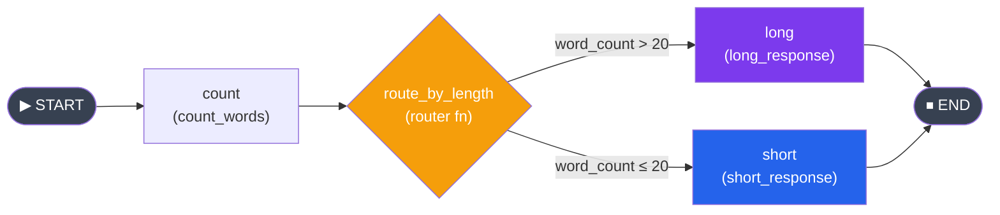
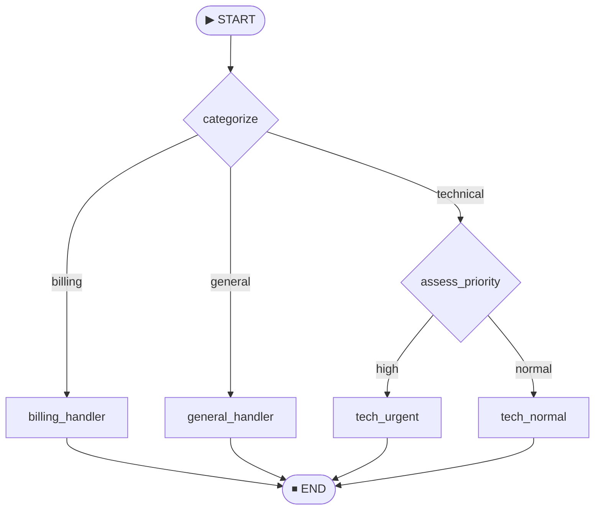

# Conditional Edges and Routing

🟡 Intermediate

## Kya hota hai?

Socho ek second ke liye — tum Zomato pe order karte ho aur backend ko decide karna padta hai ki order "restaurant ke paas bhejo" ya "cancel karo" ya "refund process karo". Yeh decision kisi ek fixed path pe nahi chalta — yeh depend karta hai ki **abhi state kya hai** (order confirm hua? payment fail hui? restaurant closed hai?).

LangGraph mein bhi agent ka har step ek fixed, seedhi line mein nahi chalta. Agent kabhi tool call karega, kabhi seedha jawab de dega, kabhi user se clarification maangega. Yeh "agle step ka decision" lena hi **conditional edges** ka kaam hai.

Ab tak tumne jo graphs banaye hain (pichले chapters mein) unme edges fixed the — Node A hamesha Node B pe jaata tha. Lekin real agents mein aisa nahi chalta. Agent ka behaviour **state-dependent** hota hai, aur is state-dependent branching ko implement karne ka tool hai `add_conditional_edges`.

## Kyun zaruri hai?

Bina conditional edges ke, tumhara graph sirf ek "linear pipeline" reh jaata — jaise ek assembly line jisme har product same steps se guzarta hai. Lekin agent banane ka poora point hi yeh hai ki wo **decide** kar sake:

- Kya mujhe tool use karna chahiye ya seedha answer de doon?
- Kya user ka sawal billing se related hai ya technical se?
- Kya main is task ko retry karoon ya give up karke error return karoon?
- Kya maine already 10 baar try kar liya (infinite loop se bachna)?

Yeh sab decisions **runtime pe state dekh kar** liye jaate hain — aur yahi asli "agentic" behaviour hai. Conditional edges ke bina, LangGraph sirf ek fancy function-chaining library reh jaata. Conditional edges ke saath, yeh ek **decision-making engine** ban jaata hai.



Agar tum Node.js background se aa rahe ho, toh isko Express middleware ki tarah socho jo request ke type ke hisaab se different handler pe route karta hai:

```typescript
// Node.js analogy — Express routing
app.use((req, res, next) => {
  if (req.body.type === "billing") return billingHandler(req, res);
  if (req.body.type === "technical") return techHandler(req, res);
  return generalHandler(req, res);
});
```

LangGraph mein isi cheez ko `add_conditional_edges` se karte hain — bas yahan "request type" ki jagah "current state" hota hai.

---

## `add_conditional_edges()` — Method Signature

```python
graph.add_conditional_edges(
    source="node_name",           # Kis node ke BAAD decision lena hai
    path=router_function,         # Function jo return karta hai next node ka naam
    path_map={"key": "node"},     # Optional: router ke return value ko node name se map karta hai
)
```

Teeno parameters samajhte hain:

| Parameter | Kaam |
|---|---|
| `source` | Us node ka naam jiske execution ke turant baad routing decision lena hai |
| `path` | Ek plain Python function (router function) jo current state leta hai aur ek string return karta hai |
| `path_map` | Dictionary jo router ke return value (string) ko actual node name se map karti hai. Optional hai. |

> [!info]
> `path` function LangGraph ka koi special class nahi hai — yeh ek **normal Python function** hai jo state leke ek string return karta hai. Bas itna hi contract hai.

### Router Function — Sabse Important Piece

Router function ka kaam simple hai: current state dekho, decide karo, aur ek **string** return karo jo batata hai ki agla node kaunsa hai.

```python
def router(state: MyState) -> str:
    if state["confidence"] > 0.8:
        return "respond"
    else:
        return "clarify"
```

Bas itna hi hai. Yeh function na koi state modify karta hai, na koi side-effect karta hai (ideally) — sirf ek routing decision deta hai. Isko ek traffic signal ki tarah socho: yeh khud gaadi nahi chalata, bas batata hai ki left jaana hai ya right.

> [!warning]
> Router function sirf routing decision ke liye hota hai — state update mat karo isme. Agar state update karni hai (jaise `word_count` calculate karna), toh wo kaam ek **regular node** mein karo, router mein nahi. Router sirf `str` return karega, dictionary nahi.

---

## Basic Example — Word Count Router

Yeh example dekho: ek text ka word count nikalke decide karte hain ki "short response" dikhana hai ya "long response".

```python
from typing import TypedDict
from langgraph.graph import StateGraph, START, END


class ReviewState(TypedDict):
    text: str
    word_count: int
    result: str


def count_words(state: ReviewState) -> dict:
    return {"word_count": len(state["text"].split())}


def short_response(state: ReviewState) -> dict:
    return {"result": f"Short text ({state['word_count']} words): {state['text']}"}


def long_response(state: ReviewState) -> dict:
    return {"result": f"Long text ({state['word_count']} words): {state['text'][:50]}..."}


def route_by_length(state: ReviewState) -> str:
    """Router: word count ke basis pe decide karo."""
    if state["word_count"] > 20:
        return "long"
    return "short"


graph = StateGraph(ReviewState)
graph.add_node("count", count_words)
graph.add_node("short", short_response)
graph.add_node("long", long_response)

graph.add_edge(START, "count")
graph.add_conditional_edges("count", route_by_length, {
    "short": "short",
    "long": "long",
})
graph.add_edge("short", END)
graph.add_edge("long", END)

app = graph.compile()

# Chota text test karo
result = app.invoke({"text": "Hello world", "word_count": 0, "result": ""})
print(result["result"])  # Short text (2 words): Hello world

# Bada text test karo
long_text = "This is a much longer piece of text that contains many words and should trigger the long response path in our graph"
result = app.invoke({"text": long_text, "word_count": 0, "result": ""})
print(result["result"])  # Long text (21 words): This is a much longer piece of text that contains...
```

Yahan flow samjho: `count` node pehle word count calculate karta hai state mein daalta hai. Uske baad `route_by_length` function (jo koi node nahi hai, sirf ek routing function hai) us state ko dekhke decide karta hai — `"short"` ya `"long"` return karta hai. Wo string `path_map` dictionary se lookup hoti hai aur actual node execute hota hai.

---

## `path_map` Parameter — Detail Mein

`path_map` router function ke return values ko **actual node names** se map karta hai. Yeh kab useful hai?

1. Jab tum chahte ho router simple labels return kare, exact node names nahi (readability ke liye)
2. Jab tumhe `END` pe map karna ho

```python
# Router descriptive labels return karta hai
def classify(state):
    score = state["score"]
    if score >= 90:
        return "excellent"
    elif score >= 70:
        return "good"
    else:
        return "needs_work"

# Labels ko actual node names se map karo
graph.add_conditional_edges("evaluate", classify, {
    "excellent": "celebrate",
    "good": "summarize",
    "needs_work": "retry",
})
```

Agar tum `path_map` bilkul omit kar do, toh router ka return value **exactly** kisi node ke naam se ya `END` se match hona chahiye:

```python
def classify(state):
    if state["score"] >= 70:
        return "summarize"    # Yeh ek actual node ka naam hona chahiye
    return END                # Seedha END bhi return kar sakte ho

graph.add_conditional_edges("evaluate", classify)  # path_map ki zaroorat nahi
```

> [!tip]
> Production code mein `path_map` explicitly likhna best practice hai — even jab return values node names se match karte hon. Isse tumhare graph ki "possible transitions" explicit ho jaati hain, aur agar koi typo ho toh turant pakad mein aa jaata hai (LangGraph `path_map` na hone pe silently us node name ko dhoondhne ki koshish karega).

---

## Routing to END

Ek bahut common pattern hai: ya toh kaam continue karo, ya ruk jao. Iska best example agent ka tool-calling loop hai:

```python
from langgraph.graph import END

def should_continue(state: AgentState) -> str:
    last_message = state["messages"][-1]
    # Agar LLM ne tool call kiya hai, toh tool execution pe jao
    if last_message.tool_calls:
        return "tools"
    # Warna, kaam khatam
    return END

graph.add_conditional_edges("agent", should_continue, {
    "tools": "tool_executor",
    END: END,
})
```

Yeh pattern IRCTC ke ticket booking flow jaisa hai — agar payment fail ho gaya, retry pe jao; agar success ho gaya, booking confirm karke flow khatam kar do. Har baar "check karo, phir decide karo continue karna hai ya stop" — yehi conditional edge ka core use-case hai.

---

## Multiple Possible Next Nodes (Fan-Out)

Conditional edge sirf 2 options tak limited nahi hai — tum ek hi routing decision se **kayi** alag nodes mein route kar sakte ho. Socho jaise Swiggy ka order ek hi dispatch system se "restaurant confirm", "delivery partner assign", "cancel", "refund" — chaar alag flows mein ja sakta hai.

```python
class TaskState(TypedDict):
    task_type: str
    input_data: str
    output: str


def route_task(state: TaskState) -> str:
    task_map = {
        "translate": "translator",
        "summarize": "summarizer",
        "analyze": "analyzer",
        "code": "coder",
    }
    return task_map.get(state["task_type"], "default_handler")


def translator(state: TaskState) -> dict:
    return {"output": f"Translated: {state['input_data']}"}

def summarizer(state: TaskState) -> dict:
    return {"output": f"Summary: {state['input_data'][:20]}..."}

def analyzer(state: TaskState) -> dict:
    return {"output": f"Analysis of: {state['input_data']}"}

def coder(state: TaskState) -> dict:
    return {"output": f"Code for: {state['input_data']}"}

def default_handler(state: TaskState) -> dict:
    return {"output": f"Default handling: {state['input_data']}"}


graph = StateGraph(TaskState)

for name, func in [
    ("translator", translator),
    ("summarizer", summarizer),
    ("analyzer", analyzer),
    ("coder", coder),
    ("default_handler", default_handler),
]:
    graph.add_node(name, func)

graph.add_node("router_node", lambda state: {})  # No-op, sirf routing ke liye
graph.add_edge(START, "router_node")

graph.add_conditional_edges("router_node", route_task, {
    "translator": "translator",
    "summarizer": "summarizer",
    "analyzer": "analyzer",
    "coder": "coder",
    "default_handler": "default_handler",
})

# Saare paths END pe convergence karte hain
for node in ["translator", "summarizer", "analyzer", "coder", "default_handler"]:
    graph.add_edge(node, END)

app = graph.compile()

result = app.invoke({"task_type": "summarize", "input_data": "A very long document about AI", "output": ""})
print(result["output"])  # Summary: A very long document...
```

> [!tip]
> Notice kiya `router_node` khud kuch nahi karta — `lambda state: {}` sirf ek **pass-through node** hai jiska use hi routing decision lene ke liye hai. Yeh pattern common hai jab tumhe START ke turant baad hi branching chahiye ho.

---

## Pattern: LLM Decides the Next Step

Yeh sabse important pattern hai poore agent-building mein. Yahan tak jo bhi routing dekhi, wo deterministic rules pe based thi (word count, score, task_type). Lekin real agents mein **LLM khud decide karta hai** ki agla step kya hoga — aur router function sirf LLM ke response ko interpret karke route karta hai.

```python
from typing import TypedDict, Annotated
import operator
from langchain_openai import ChatOpenAI
from langchain_core.messages import HumanMessage, AIMessage, BaseMessage
from langgraph.graph import StateGraph, START, END

llm = ChatOpenAI(model="gpt-4o-mini", temperature=0)


class AgentState(TypedDict):
    messages: Annotated[list[BaseMessage], operator.add]
    final_answer: str


def call_agent(state: AgentState) -> dict:
    """Agent node: LLM ko call karta hai."""
    system_prompt = (
        "You are a helpful assistant. If you need to do math, "
        "respond with CALCULATE: <expression>. Otherwise, respond normally."
    )
    messages = [{"role": "system", "content": system_prompt}] + state["messages"]
    response = llm.invoke(messages)
    return {"messages": [response]}


def calculator(state: AgentState) -> dict:
    """Last message mein se math expression nikaalke execute karta hai."""
    last_msg = state["messages"][-1].content
    expression = last_msg.split("CALCULATE:")[-1].strip()
    try:
        result = eval(expression)  # Production mein safe evaluator use karo!
        return {"messages": [HumanMessage(content=f"The result is: {result}")]}
    except Exception as e:
        return {"messages": [HumanMessage(content=f"Error calculating: {e}")]}


def format_final(state: AgentState) -> dict:
    return {"final_answer": state["messages"][-1].content}


def should_calculate(state: AgentState) -> str:
    """Router: check karo LLM calculate karna chahta hai ya nahi."""
    last_message = state["messages"][-1]
    if "CALCULATE:" in last_message.content:
        return "calculate"
    return "done"


graph = StateGraph(AgentState)
graph.add_node("agent", call_agent)
graph.add_node("calculator", calculator)
graph.add_node("format", format_final)

graph.add_edge(START, "agent")
graph.add_conditional_edges("agent", should_calculate, {
    "calculate": "calculator",
    "done": "format",
})
# Calculate karne ke baad wapas agent pe jao (cycle!) taaki result interpret kar sake
graph.add_edge("calculator", "agent")
graph.add_edge("format", END)

app = graph.compile()

result = app.invoke({
    "messages": [HumanMessage(content="What is 1234 * 5678?")],
    "final_answer": "",
})
print(result["final_answer"])
```

Notice karo yeh **cycle**: `agent -> calculator -> agent`. Agent tab tak calculator use karta rahega jab tak wo final answer dene ke liye ready na ho jaaye. Yeh bilkul waisa hi hai jaise tum Google Maps pe route search karte ho — agent baar baar "check karo, adjust karo" karta hai jab tak destination na mil jaaye.

> [!warning]
> Real production code mein kabhi `eval()` use mat karo untrusted input pe — yeh security risk hai (arbitrary code execution). Yahan sirf demo ke liye use kiya hai. Production mein `numexpr`, `asteval`, ya khud ka safe math parser use karo.

---

## Building a Decision Tree — Multi-Level Routing

Conditional edges ko **chain** kiya ja sakta hai taaki ek decision tree ban jaaye — bilkul customer support ke ticket-routing system jaisa (pehle category decide karo, phir priority).



```python
class SupportState(TypedDict):
    question: str
    category: str
    priority: str
    response: str


def categorize(state: SupportState) -> dict:
    q = state["question"].lower()
    if "bill" in q or "payment" in q or "charge" in q:
        return {"category": "billing"}
    elif "bug" in q or "error" in q or "crash" in q:
        return {"category": "technical"}
    else:
        return {"category": "general"}


def assess_priority(state: SupportState) -> dict:
    q = state["question"].lower()
    if "urgent" in q or "crash" in q or "down" in q:
        return {"priority": "high"}
    return {"priority": "normal"}


def route_category(state: SupportState) -> str:
    return state["category"]


def route_priority(state: SupportState) -> str:
    return state["priority"]


def billing_handler(state: SupportState) -> dict:
    return {"response": "Billing team will review your inquiry."}

def tech_normal(state: SupportState) -> dict:
    return {"response": "A technician will look into this within 24 hours."}

def tech_urgent(state: SupportState) -> dict:
    return {"response": "URGENT: Escalating to on-call engineer immediately."}

def general_handler(state: SupportState) -> dict:
    return {"response": "Thank you for reaching out. We will respond shortly."}


graph = StateGraph(SupportState)

graph.add_node("categorize", categorize)
graph.add_node("assess_priority", assess_priority)
graph.add_node("billing", billing_handler)
graph.add_node("tech_normal", tech_normal)
graph.add_node("tech_urgent", tech_urgent)
graph.add_node("general", general_handler)

graph.add_edge(START, "categorize")

# Pehla branch: category ke hisaab se
graph.add_conditional_edges("categorize", route_category, {
    "billing": "billing",
    "technical": "assess_priority",
    "general": "general",
})

# Dusra branch: technical tickets, priority ke hisaab se
graph.add_conditional_edges("assess_priority", route_priority, {
    "high": "tech_urgent",
    "normal": "tech_normal",
})

# Saare leaf nodes END pe jaate hain
for node in ["billing", "tech_normal", "tech_urgent", "general"]:
    graph.add_edge(node, END)

app = graph.compile()

# Alag alag paths test karo
tests = [
    "I was overcharged on my bill",
    "The app keeps crashing, this is urgent!",
    "How do I change my username?",
]

for q in tests:
    result = app.invoke({"question": q, "category": "", "priority": "", "response": ""})
    print(f"Q: {q}")
    print(f"A: {result['response']}\n")
```

Yahan do alag `add_conditional_edges` calls hain — ek `categorize` node ke baad, ek `assess_priority` node ke baad. Yeh chaining hi decision tree banati hai. Har router apna kaam karta hai, apne scope mein — poore tree ka logic ek hi jagah likhne ki zaroorat nahi.

---

## Default / Fallback Edges — Safety Net

Jab tum `path_map` use karte ho, yeh zaroori hai ki router **har possible case ko handle** kare. Agar router koi aisi value return kare jo `path_map` mein nahi hai, toh LangGraph runtime error throw karega — aur production mein yeh crash matlab downtime.

Isko UPI transaction ki tarah socho: agar transaction status "success", "failed", "pending" ke alawa koi 4th unexpected status aaye (jo tumne handle nahi kiya), toh poora system crash nahi hona chahiye — usko gracefully "unknown" bucket mein daal dena chahiye.

**Strategy 1: Router mein hi catch-all rakho**
```python
def route(state):
    category = state.get("category", "unknown")
    if category in ("billing", "technical", "general"):
        return category
    return "general"  # Fallback
```

**Strategy 2: `END` ko fallback ki tarah use karo**
```python
graph.add_conditional_edges("node", route, {
    "known_path": "handler",
    END: END,  # Kuch bhi aur aaye, terminate kar do
})
```

> [!warning]
> Common mistake: router `path_map` mein na hone wali koi random string return kar de (jaise LLM se aaya hua koi unexpected label) aur tumne fallback nahi socha. Yeh production mein silent crash ka number-1 reason hai jab LLM-based classification use karte ho. **Hamesha** router mein ek explicit `else` / default branch rakho.

---

## Complex Routing with Multiple Conditions

Real agents mein routing sirf ek field pe depend nahi karti — kayi state fields ko combine karke decision leni padti hai. Yeh production-grade agents ka bread-and-butter pattern hai:

```python
def complex_router(state: AgentState) -> str:
    has_tool_calls = bool(state["messages"][-1].tool_calls)
    iteration = state.get("iteration_count", 0)
    max_iterations = 5

    if iteration >= max_iterations:
        return "force_respond"          # Safety: infinite loop se bachao
    elif has_tool_calls:
        return "execute_tools"
    else:
        return "respond"
```

Is pattern mein teen cheezein ek saath check ho rahi hain:
1. Kya iteration limit cross ho gayi (safety check — sabse pehle check karo)
2. Kya LLM ne tool call kiya
3. Warna direct respond karo

> [!tip]
> **Order matters** router mein. Safety checks (jaise max iterations) hamesha **sabse pehle** check karo, taaki koi bhi doosra condition unhe override na kar sake. Production agents mein yeh iteration guard likhna optional nahi hai — mandatory hai, warna ek buggy LLM response tumhara agent infinite loop mein daal sakta hai aur tumhara API bill bhi infinite ho jaayega.

---

## Common Gotchas aur Mistakes

1. **Router se dictionary return karna** — Router function sirf `str` return karega (node ka naam), state update nahi. Agar tum `{"result": "xyz"}` jaisa dict return karoge, LangGraph confuse ho jaayega ki yeh node hai ya router.

2. **`path_map` mein missing keys** — Router ne jo string return ki, agar wo `path_map` mein exist nahi karti, runtime error aayega. Hamesha default/fallback branch rakho.

3. **Router mein side-effects** — Router function ko "pure" rakho jahan tak ho sake. State mutate karna, API calls karna — yeh sab actual **nodes** mein hona chahiye, routers mein nahi. Warna debugging bahut mushkil ho jaati hai (kyunki router multiple baar call ho sakta hai internally graph traversal ke during).

4. **Infinite loops bhool jaana** — Jab bhi cycle bana rahe ho (`agent -> tool -> agent`), hamesha ek iteration counter aur max-limit rakho. Warna production mein yeh runaway cost aur latency issue banega.

5. **`END` ko string `"END"` samajhna** — `END` `langgraph.graph` se import hone wala ek special sentinel object hai, plain string `"END"` nahi. `path_map` mein key ki tarah `END` object hi use karo, `"END"` string nahi.

```python
from langgraph.graph import END

# Sahi
graph.add_conditional_edges("node", router, {"done": END})

# Galat — yeh END sentinel se match nahi karega
graph.add_conditional_edges("node", router, {"done": "END"})
```

---

## Practice Exercises

### Exercise 1: Grade Router
Ek graph banao jo student ka score (0-100) leke alag feedback nodes pe route kare:
- 90-100: `"excellent"` node
- 70-89: `"good"` node
- 50-69: `"needs_improvement"` node
- 50 se kam: `"failing"` node

Har node appropriate feedback text return kare. Scores 95, 75, 55, aur 30 se test karo.

### Exercise 2: Content Classifier
Ek graph banao jo text content ko classify karke alag process kare:
1. `classify` node: decide kare text "question", "statement", ya "command" hai (simple heuristics use karo — `?` se end hota hai, verb se start hota hai, etc.)
2. Conditionally route karo:
   - `answer_question` — "That's a great question about..." respond kare
   - `acknowledge_statement` — "I understand that..." respond kare
   - `execute_command` — "I will now..." respond kare
3. Saare paths `format_output` pe converge karein, phir END

Test karo: "What is Python?", "Python is a great language.", "Tell me about Python."

### Exercise 3: Retry Loop
Ek graph banao jisme cycle ho, jo ek unreliable operation simulate kare:
1. `attempt` node: random number 1-10 generate kare, state mein store kare
2. Router: agar number 8 ya usse zyada hai, "success" pe route karo; warna wapas "attempt" pe
3. State mein attempts count track karo
4. Safety limit add karo: 10 attempts ke baad force-route to "give_up" node

```python
import random

def attempt(state):
    roll = random.randint(1, 10)
    return {
        "last_roll": roll,
        "attempts": state["attempts"] + 1,
    }
```

### Exercise 4: LLM-Powered Router
Ek graph banao jisme LLM khud routing decide kare:
1. `receive_query` node: user ka question leta hai
2. `classify_with_llm` node: LLM se query ko "factual", "creative", ya "code" classify karwata hai
3. LLM ki classification ke basis pe teen alag handler nodes pe route karo
4. Har handler LLM ko category ke hisaab se alag system prompt ke saath use kare

### Exercise 5: Multi-Level Decision Tree
Support ticket wale example ko extend karo aur ek teesra level routing add karo:
- Category aur priority determine karne ke baad, specific sub-handlers pe route karo:
  - billing + high: `"billing_escalation"`
  - billing + normal: `"billing_queue"`
  - technical + high: `"tech_oncall"`
  - technical + normal: `"tech_queue"`
- Ek node add karo end mein jo poora routing path (list ki tarah state mein store karke) log kare

Poore graph ko Mermaid se visualize karo aur saare paths verify karo.

---

## Key Takeaways

- `add_conditional_edges` state-based branching enable karta hai — yehi agent decision-making ka core hai.
- Router function state leta hai aur ek **string** return karta hai jo agle node ka naam (ya label) batata hai — kabhi dictionary ya state update nahi.
- `path_map` router ke return values ko actual node names se map karta hai; isko omit kar sakte ho agar return values exactly node names (ya `END`) hon.
- Fan-out routing se ek hi conditional edge se kayi alag nodes mein route kar sakte ho.
- "LLM decides the next step" pattern hi tool-using agents ki foundation hai.
- Cycles (Node A → Node B → Node A) se agent tab tak iterate kar sakta hai jab tak final answer ready na ho.
- Hamesha ek maximum iteration guard rakho — production mein infinite loops seedha cost aur latency disaster banate hain.
- Router mein fallback/default branch zaroor rakho — warna unexpected value aane pe runtime crash hoga.
- `END` ek sentinel object hai (import from `langgraph.graph`), plain string `"END"` nahi.
