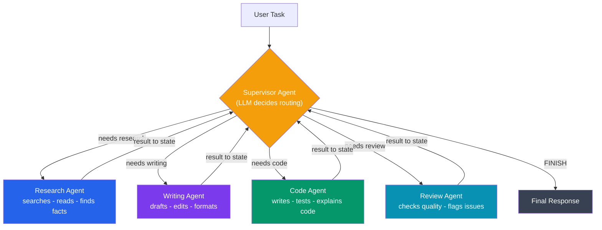
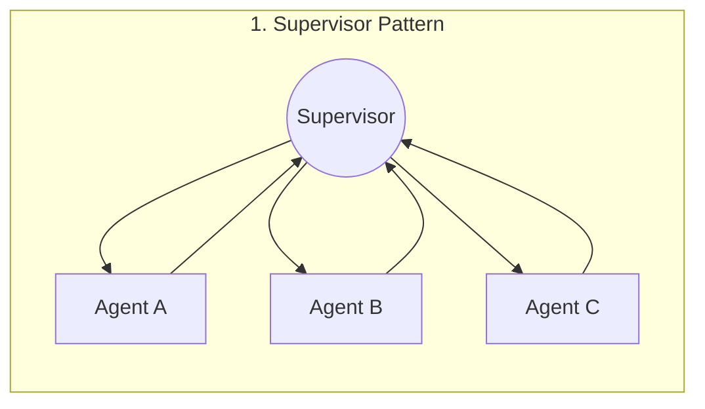
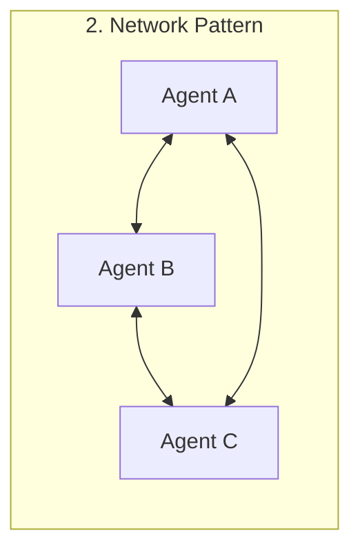
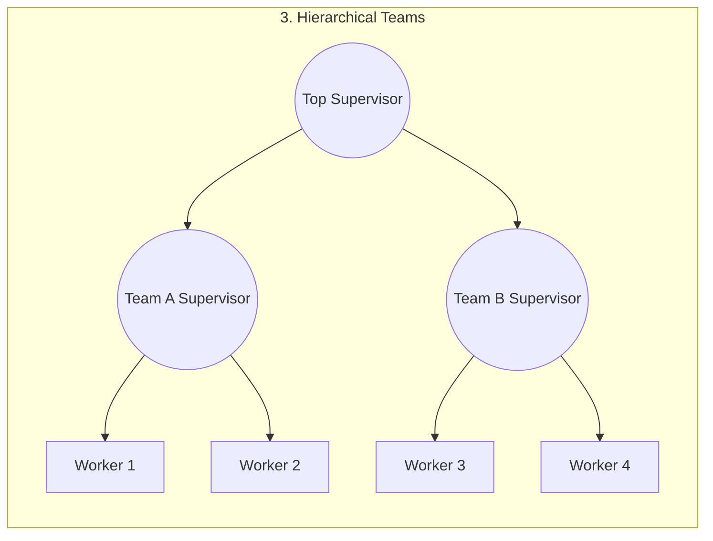
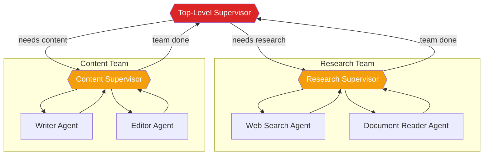
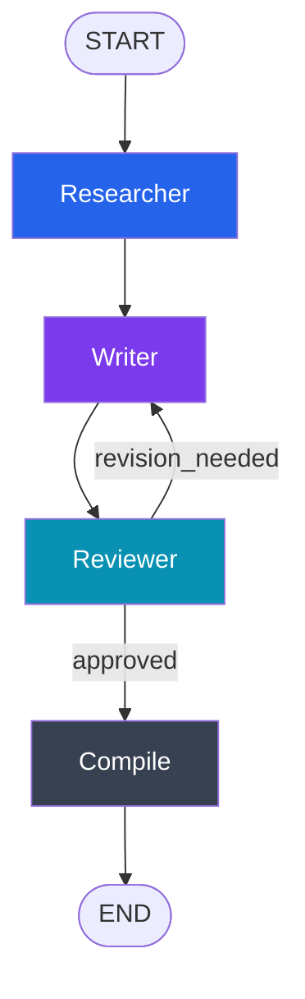

# Multi-Agent Systems

🔴 Production-grade

## Kya hota hai?

Socho tumne ek single LangGraph agent banaya — usko tools diye, memory di, RAG bhi laga diya. Ab boss aaya aur bola: "Ye agent customer ke liye research bhi kare, blog post bhi likhe, code bhi generate kare, aur khud hi apna kaam review bhi kare." Tumne saare prompts, saare tools, saara context ek hi system prompt mein thoons diya. Result? Agent confuse ho jaata hai, prompt itna bada ho jaata hai ki LLM bhatakne lagta hai, aur ek chhota sa bug fix karne ke liye poore monolithic prompt ko touch karna padta hai.

Yehi wo jagah hai jahan **Multi-Agent Systems** kaam aate hain. Idea bilkul wahi hai jo tum Node.js mein microservices banate waqt sochte ho — **ek mega-agent ko chhote, specialized agents mein todo**, jinme se har ek apna ek kaam achhe se karta hai, aur ek coordination layer unhe saath mein kaam karwati hai.

**Node.js microservice analogy:**
```
API Gateway (supervisor)
  |-- Auth Service (specialist)
  |-- Payment Service (specialist)
  |-- Notification Service (specialist)
  |-- User Service (specialist)
```

Bilkul waise hi, Zomato ka backend socho — ek single "God service" nahi hai jo restaurant search, order placement, payment, delivery tracking sab kuch khud handle kare. Har cheez ke liye alag microservice hai, aur ek API Gateway decide karta hai ki request kis service ko bhejni hai. Multi-agent AI systems mein bhi yahi pattern hai: ek **supervisor** (ya coordinator) decide karta hai ki task kis **specialist agent** ke paas jaana chahiye.



## Kyun zaruri hai?

| Problem with single agent | Multi-agent kaise solve karta hai |
|---|---|
| Ek hi system prompt mein bahut saare instructions -> LLM confuse hota hai | Har agent ka apna focused, chhota system prompt |
| Bahut saare tools ek agent ko diye -> galat tool select karta hai | Har specialist ke paas sirf uske domain ke tools |
| Debugging mushkil — pata hi nahi chalta kahan galti hui | Har agent ka kaam isolated hai, trace karna easy hai |
| Ek change poore behavior ko break kar sakta hai | Ek specialist ko update karo, baaki untouched rehte hain |
| Context window bhar jaata hai (research + draft + review sab ek jagah) | Har agent sirf apne relevant context ko dekhta hai |
| Parallel kaam nahi ho sakta | Independent specialists parallel bhi chal sakte hain |

> [!tip]
> Rule of thumb: agar tumhare agent ka system prompt "You are an assistant that can research, write, code, AND review" jaisa lambi list ban raha hai — ye signal hai ki time aa gaya hai use multiple agents mein split karne ka.

---

## Teen Core Architectures

Multi-agent systems banane ke teen mukhya patterns hain. Inko samajhna zaruri hai kyunki production mein tum inka combination use karoge.







| Pattern | Kaise kaam karta hai | Kab use karo | Node.js analogy |
|---|---|---|---|
| **Supervisor** | Ek central "manager" LLM decide karta hai next kaun sa agent chalega | Clear task-routing chahiye, ek hi decision point ho | API Gateway jo requests route karta hai |
| **Network (Handoff)** | Har agent khud decide karta hai kisko "handoff" karna hai, koi central manager nahi | Agents ke beech dynamic, peer-to-peer collaboration chahiye | Event-driven microservices, ek service dusre ko directly call kare |
| **Hierarchical Teams** | Supervisors ka supervisor — bade problem ko teams mein todo, har team ka apna mini-supervisor | Bahut bada, complex system jisme dono team-level aur global-level coordination chahiye | Org chart — CTO -> Engineering Manager -> Developers |

Ab in teeno ko detail mein, code ke saath, dekhte hain.

---

## Pattern 1: Supervisor Pattern

Sabse common aur sabse simple-to-reason-about architecture. Ek "supervisor" node poore conversation state ko dekhta hai aur decide karta hai — "next kaun sa specialist chalega, ya kaam khatam ho gaya?"

**Real-world analogy:** Zomato ke customer support mein jab tum chat karte ho, pehle ek triage bot (supervisor) tumhara message padhta hai. Agar "mera refund kahan hai" likha hai to Billing team ko route karta hai. Agar "order late hai" likha hai to Delivery team ko. Triage bot khud refund process nahi karta — wo sirf route karta hai.

```python
from typing import TypedDict, Annotated, Literal
from langchain_core.messages import HumanMessage, AIMessage, BaseMessage, SystemMessage
from langchain_openai import ChatOpenAI
from langgraph.graph import StateGraph, START, END
from langgraph.graph.message import add_messages

llm = ChatOpenAI(model="gpt-4o-mini", temperature=0)


class MultiAgentState(TypedDict):
    messages: Annotated[list[BaseMessage], add_messages]
    next_agent: str
    final_response: str


# --- Supervisor: sirf routing decide karta hai, kaam khud nahi karta ---
def supervisor(state: MultiAgentState) -> dict:
    """Decide karta hai kaunsa agent aage chalega, ya FINISH."""
    system_prompt = """Tum ek supervisor ho jo ek team manage karte ho:
- "researcher": Information aur facts dhundhne ke liye
- "writer": Content draft/edit karne ke liye
- "coder": Code likhne aur explain karne ke liye

Conversation dekh kar decide karo ki next step kaunsa agent handle karega.
SIRF ek word return karo: "researcher", "writer", "coder", ya "FINISH"
Agar task complete ho gaya hai to "FINISH" bolo."""

    response = llm.invoke([
        SystemMessage(content=system_prompt),
        *state["messages"],
    ])
    next_agent = response.content.strip().strip('"').lower()
    return {"next_agent": next_agent}


# --- Specialist Agents: sirf apna focused kaam karte hain ---
def researcher(state: MultiAgentState) -> dict:
    response = llm.invoke([
        SystemMessage(content="Tum ek research specialist ho. Relevant information dhundo, "
                              "sources cite karo, aur factual data do. Thorough raho."),
        *state["messages"],
    ])
    return {"messages": [AIMessage(content=f"[Researcher]: {response.content}", name="researcher")]}


def writer(state: MultiAgentState) -> dict:
    response = llm.invoke([
        SystemMessage(content="Tum ek writing specialist ho. Clear, engaging content draft karo. "
                              "Conversation mein diye gaye research ko use karo."),
        *state["messages"],
    ])
    return {"messages": [AIMessage(content=f"[Writer]: {response.content}", name="writer")]}


def coder(state: MultiAgentState) -> dict:
    response = llm.invoke([
        SystemMessage(content="Tum ek coding specialist ho. Clean, well-commented code likho. "
                              "Apne implementation choices explain karo."),
        *state["messages"],
    ])
    return {"messages": [AIMessage(content=f"[Coder]: {response.content}", name="coder")]}


def finalize(state: MultiAgentState) -> dict:
    """Team ke saare contributions se ek final, coherent response banata hai."""
    response = llm.invoke([
        SystemMessage(content="Team ke upar ke kaam se ek final, coherent response compile karo."),
        *state["messages"],
    ])
    return {"final_response": response.content}


# --- Routing function ---
def route_supervisor(state: MultiAgentState) -> str:
    next_agent = state.get("next_agent", "FINISH")
    if next_agent in ("finish", "FINISH"):
        return "finalize"
    return next_agent


# --- Graph banate hain ---
graph = StateGraph(MultiAgentState)

graph.add_node("supervisor", supervisor)
graph.add_node("researcher", researcher)
graph.add_node("writer", writer)
graph.add_node("coder", coder)
graph.add_node("finalize", finalize)

graph.add_edge(START, "supervisor")

graph.add_conditional_edges("supervisor", route_supervisor, {
    "researcher": "researcher",
    "writer": "writer",
    "coder": "coder",
    "finalize": "finalize",
})

# Har specialist ke baad, wapas supervisor ke paas jao next decision ke liye
graph.add_edge("researcher", "supervisor")
graph.add_edge("writer", "supervisor")
graph.add_edge("coder", "supervisor")
graph.add_edge("finalize", END)

app = graph.compile()

# Run karo
result = app.invoke({
    "messages": [
        HumanMessage(content="Mujhe Python decorators pe ek blog post chahiye, code examples ke saath.")
    ],
    "next_agent": "",
    "final_response": "",
})

print(result["final_response"])
```

Ye ek **star topology** banata hai — supervisor beech mein, saare specialists uske around radiate karte hain. Visualize karne ke liye:

```python
print(app.get_graph().draw_mermaid())
```

> [!info]
> Notice karo — is diagram mein cycle hai: `researcher -> supervisor -> writer -> supervisor -> ...`. Yehi cycle multi-agent systems ko powerful banata hai (supervisor jitni baar chahe kisi bhi agent ko dobara bula sakta hai), lekin isi wajah se **infinite loop** ka risk bhi aata hai. Isko agla section mein fix karenge.

### Infinite Loops Se Bachna

Supervisor pattern mein ek cycle hai (`specialist -> supervisor -> specialist`). Agar LLM kabhi confuse ho jaaye aur baar-baar wahi agent ko route karta rahe (ya kabhi "FINISH" na bole), tumhara graph hamesha ke liye chalta rahega — aur har iteration ek LLM call hai, matlab **paisa aur latency dono barbaad**. Isliye ek hard safety limit lagana **mandatory** hai:

```python
class SafeMultiAgentState(TypedDict):
    messages: Annotated[list[BaseMessage], add_messages]
    next_agent: str
    iteration_count: int
    max_iterations: int
    final_response: str


def supervisor(state: SafeMultiAgentState) -> dict:
    # Safety check sabse pehle
    if state["iteration_count"] >= state["max_iterations"]:
        return {"next_agent": "FINISH", "iteration_count": state["iteration_count"] + 1}

    # Normal supervisor logic
    response = llm.invoke([
        SystemMessage(content="... (routing prompt jaisa upar) ..."),
        *state["messages"],
    ])
    return {
        "next_agent": response.content.strip().strip('"').lower(),
        "iteration_count": state["iteration_count"] + 1,
    }


# Safety limit ke saath initialize karo
result = app.invoke({
    "messages": [HumanMessage(content="...")],
    "next_agent": "",
    "iteration_count": 0,
    "max_iterations": 10,
    "final_response": "",
})
```

> [!warning]
> Production mein **hamesha** `max_iterations` (ya `recursion_limit` — LangGraph `graph.invoke(..., config={"recursion_limit": 25})` bhi provide karta hai) set karo. Bina iske, ek buggy supervisor prompt tumhara poora OpenAI/Anthropic bill kharch kar sakta hai ek hi request mein, ya request hamesha ke liye hang ho sakti hai.

---

## Pattern 2: Network Pattern (Agent Handoff)

Supervisor pattern mein ek central "boss" hota hai. Lekin kabhi-kabhi tumhe chahiye ki agents **khud decide karein** ki kaam kisko dena hai — bina kisi central coordinator ke. Isko **handoff pattern** ya **network pattern** kehte hain.

**Analogy:** Ek dabbawala apna tiffin drop karke agle dabbawala ko directly handoff kar deta hai — usse Mumbai headquarters se permission nahi leni padti har step pe. Har dabbawala apne decision khud leta hai based on jahan tiffin ko jaana hai.

Modern LangGraph mein handoff implement karne ka recommended tarika **`Command`** object hai — ye ek single return value mein state update **aur** next node dono specify karta hai, isliye tumhe alag se conditional-edge routing function likhne ki zarurat nahi padti:

```python
from typing import Annotated, Literal
from langchain_core.messages import HumanMessage, AIMessage, BaseMessage
from langchain_core.tools import tool, InjectedToolCallId
from langgraph.graph import StateGraph, START, END, MessagesState
from langgraph.types import Command
from langgraph.prebuilt import InjectedState


def research_agent(state: MessagesState) -> Command[Literal["writer", "coder", "__end__"]]:
    """Research karta hai, phir khud decide karta hai kisko handoff karna hai."""
    response = llm.invoke([
        SystemMessage(content="Tum research agent ho. Research karo, phir decide karo: "
                              "agar writing chahiye 'HANDOFF:writer' bolo. "
                              "Agar code chahiye 'HANDOFF:coder' bolo. "
                              "Agar kaam ho gaya 'DONE' bolo."),
        *state["messages"],
    ])
    content = response.content
    new_message = AIMessage(content=content, name="researcher")

    # Agent khud decide karta hai kahan jaana hai
    if "HANDOFF:writer" in content:
        goto = "writer"
    elif "HANDOFF:coder" in content:
        goto = "coder"
    else:
        goto = END

    # Command ek saath state update aur navigation dono karta hai
    return Command(
        goto=goto,
        update={"messages": [new_message]},
    )


def writing_agent(state: MessagesState) -> Command[Literal["reviewer", "__end__"]]:
    response = llm.invoke([
        SystemMessage(content="Tum writing agent ho. Content likho, phir decide karo: "
                              "agar review chahiye 'HANDOFF:reviewer' bolo, warna 'DONE' bolo."),
        *state["messages"],
    ])
    goto = "reviewer" if "HANDOFF:reviewer" in response.content else END
    return Command(
        goto=goto,
        update={"messages": [AIMessage(content=response.content, name="writer")]},
    )


def reviewer_agent(state: MessagesState) -> Command[Literal["__end__"]]:
    response = llm.invoke([
        SystemMessage(content="Tum reviewer ho. Content review karke feedback do."),
        *state["messages"],
    ])
    return Command(
        goto=END,
        update={"messages": [AIMessage(content=response.content, name="reviewer")]},
    )


graph = StateGraph(MessagesState)
graph.add_node("researcher", research_agent)
graph.add_node("writer", writing_agent)
graph.add_node("reviewer", reviewer_agent)

graph.add_edge(START, "researcher")
# Note: koi add_conditional_edges nahi chahiye — Command khud routing karta hai!

app = graph.compile()
```

> [!info]
> **`Command` kyun use karo instead of conditional edges?** Purane pattern mein agent function sirf state return karta tha, aur ek **alag** `route_from_research()` function last message parse karke decide karta tha kahan jaana hai. `Command(goto=..., update=...)` in dono cheezon ko ek jagah la deta hai — jis node ko pata hai "maine kya kaam kiya" usi ko pata hota hai "ab kahan jaana hai". Ye current (2025+) LangGraph mein **recommended way hai multi-agent handoffs implement karne ka**, khaaskar jab agents ek dusre ko directly call karte hain.

### Purana Style: Conditional Edges Se Handoff (still valid, samajhne ke liye)

Agar tum routing logic ko agent se alag rakhna chahte ho (testability ke liye), purana pattern bhi kaam karta hai:

```python
class HandoffState(TypedDict):
    messages: Annotated[list[BaseMessage], add_messages]
    current_agent: str


def route_from_research(state: HandoffState) -> str:
    last_msg = state["messages"][-1].content
    if "HANDOFF:writer" in last_msg:
        return "writer"
    if "HANDOFF:coder" in last_msg:
        return "coder"
    return END


graph.add_conditional_edges("researcher", route_from_research)
```

**Supervisor vs. Network — kab kaunsa use karo?**

| | Supervisor | Network (Handoff) |
|---|---|---|
| Control | Centralized — ek jagah se routing logic manage hoti hai | Decentralized — har agent apna decision leta hai |
| Debugging | Easy — sab decisions ek supervisor mein dikhte hain | Harder — decision logic har agent mein bikhri hai |
| Flexibility | Kam — supervisor ko sab agents ke baare mein pata hona chahiye | Zyada — naya agent add karna baaki agents ko touch nahi karta |
| Best for | Clear task categories (research/write/code jaisa) | Dynamic collaboration jahan next step pehle se pata nahi |

---

## Pattern 3: Hierarchical Teams (Supervisor of Supervisors)

Jab ek single supervisor ke paas bahut zyada specialist agents ho jaate hain (10+), routing decision khud complex ho jaata hai. Solution: agents ko **teams** mein group karo, har team ka apna mini-supervisor ho, aur ek **top-level supervisor** teams ke beech route kare.

**Analogy:** Ek bade e-commerce company (Flipkart jaisa) mein CEO directly kisi individual developer ko task nahi deta. CEO Engineering VP se baat karta hai, VP apni team ke andar kaam distribute karta hai. Har layer apne scope tak simit rehta hai.



LangGraph mein hierarchical teams ko implement karne ka cleanest tarika hai **sub-graphs** — har team apna khud ka compiled `StateGraph` hai, jo top-level graph mein ek single node ki tarah use hota hai.

```python
from langgraph.graph import StateGraph, START, END, MessagesState
from langgraph.types import Command
from typing import Literal


# ---------- Research Team (apna mini-graph) ----------
def research_team_supervisor(state: MessagesState) -> Command[Literal["web_search", "doc_reader", "__end__"]]:
    response = llm.invoke([
        SystemMessage(content="Tum research team ke supervisor ho. 'web_search', 'doc_reader', "
                              "ya 'FINISH' mein se ek bolo."),
        *state["messages"],
    ])
    decision = response.content.strip().lower()
    goto = decision if decision in ("web_search", "doc_reader") else END
    return Command(goto=goto)


def web_search_agent(state: MessagesState) -> Command[Literal["research_team_supervisor"]]:
    response = llm.invoke([SystemMessage(content="Web search karke facts do."), *state["messages"]])
    return Command(
        goto="research_team_supervisor",
        update={"messages": [AIMessage(content=response.content, name="web_search")]},
    )


def doc_reader_agent(state: MessagesState) -> Command[Literal["research_team_supervisor"]]:
    response = llm.invoke([SystemMessage(content="Documents padh kar summary do."), *state["messages"]])
    return Command(
        goto="research_team_supervisor",
        update={"messages": [AIMessage(content=response.content, name="doc_reader")]},
    )


research_graph = StateGraph(MessagesState)
research_graph.add_node("research_team_supervisor", research_team_supervisor)
research_graph.add_node("web_search", web_search_agent)
research_graph.add_node("doc_reader", doc_reader_agent)
research_graph.add_edge(START, "research_team_supervisor")
research_team_app = research_graph.compile()


# ---------- Content Team (apna mini-graph) ----------
def content_team_supervisor(state: MessagesState) -> Command[Literal["writer", "editor", "__end__"]]:
    response = llm.invoke([
        SystemMessage(content="Tum content team ke supervisor ho. 'writer', 'editor', "
                              "ya 'FINISH' mein se ek bolo."),
        *state["messages"],
    ])
    decision = response.content.strip().lower()
    goto = decision if decision in ("writer", "editor") else END
    return Command(goto=goto)


def writer_agent(state: MessagesState) -> Command[Literal["content_team_supervisor"]]:
    response = llm.invoke([SystemMessage(content="Content likho."), *state["messages"]])
    return Command(
        goto="content_team_supervisor",
        update={"messages": [AIMessage(content=response.content, name="writer")]},
    )


def editor_agent(state: MessagesState) -> Command[Literal["content_team_supervisor"]]:
    response = llm.invoke([SystemMessage(content="Content edit/polish karo."), *state["messages"]])
    return Command(
        goto="content_team_supervisor",
        update={"messages": [AIMessage(content=response.content, name="editor")]},
    )


content_graph = StateGraph(MessagesState)
content_graph.add_node("content_team_supervisor", content_team_supervisor)
content_graph.add_node("writer", writer_agent)
content_graph.add_node("editor", editor_agent)
content_graph.add_edge(START, "content_team_supervisor")
content_team_app = content_graph.compile()


# ---------- Top-Level Supervisor: sub-graphs ko as nodes treat karta hai ----------
def top_supervisor(state: MessagesState) -> Command[Literal["research_team", "content_team", "__end__"]]:
    response = llm.invoke([
        SystemMessage(content="Tum top-level supervisor ho. Do teams manage karte ho: "
                              "'research_team' aur 'content_team'. Jo bhi task ke liye chahiye, "
                              "wo bolo, ya 'FINISH' agar sab ho gaya."),
        *state["messages"],
    ])
    decision = response.content.strip().lower()
    if decision in ("research_team", "content_team"):
        return Command(goto=decision)
    return Command(goto=END)


top_graph = StateGraph(MessagesState)
top_graph.add_node("top_supervisor", top_supervisor)
top_graph.add_node("research_team", research_team_app)   # compiled sub-graph as a node!
top_graph.add_node("content_team", content_team_app)      # compiled sub-graph as a node!

top_graph.add_edge(START, "top_supervisor")
top_graph.add_edge("research_team", "top_supervisor")
top_graph.add_edge("content_team", "top_supervisor")

app = top_graph.compile()

result = app.invoke({
    "messages": [HumanMessage(content="AI regulation ke upar ek report banao, research + polished writing ke saath.")]
})
```

> [!tip]
> Compiled `StateGraph` (`research_team_app`, `content_team_app`) ko directly `add_node()` mein pass karna LangGraph ka built-in **subgraph** support hai — jaisa tumne pichhle chapter (Subgraphs) mein padha hoga. Hierarchical teams essentially "multi-agent + subgraphs" ka combination hai.

---

## Shared vs. Separate State

Multi-agent systems design karte waqt sabse zaruri decision ye hai: **agents ek dusre ka data kaise dekhte hain?**

### Shared State (Default, Simple)

Saare agents ek hi state read/write karte hain.

```python
class SharedState(TypedDict):
    messages: Annotated[list[BaseMessage], add_messages]
    # Saare agents ye dekh aur modify kar sakte hain:
    research_data: str
    draft: str
    code: str
```

**Pros:** Simple, agents ek dusre ka kaam directly dekh sakte hain.
**Cons:** Agents galti se ek dusre ka data overwrite kar sakte hain (race-condition jaisi situation).

### Separate State with Shared Communication Channel

Har agent ka apna "workspace" hota hai state mein, aur wo `messages` channel ke through communicate karte hain — bilkul microservices ke pattern jaisa jahan har service apna database rakhta hai, lekin ek message queue se baat karta hai.

```python
class IsolatedState(TypedDict):
    # Shared communication channel
    messages: Annotated[list[BaseMessage], add_messages]

    # Agent-specific workspaces (sirf apna respective agent likhta hai)
    researcher_workspace: dict  # Sirf researcher yahan likhta hai
    writer_workspace: dict      # Sirf writer yahan likhta hai
    coder_workspace: dict       # Sirf coder yahan likhta hai

    # Shared results (sirf finalize likhta hai)
    final_output: str


def researcher(state: IsolatedState) -> dict:
    # messages padhta hai, SIRF researcher_workspace mein likhta hai
    findings = do_research(state["messages"])
    return {
        "researcher_workspace": {"findings": findings, "sources": [...]},
        "messages": [AIMessage(content=f"Research complete. Mila: {findings[:100]}")],
    }


def writer(state: IsolatedState) -> dict:
    # messages + researcher_workspace padhta hai, SIRF writer_workspace mein likhta hai
    research = state["researcher_workspace"]
    draft = write_article(research["findings"])
    return {
        "writer_workspace": {"draft": draft, "word_count": len(draft.split())},
        "messages": [AIMessage(content=f"Draft complete. {len(draft.split())} words.")],
    }
```

| | Shared State | Isolated Workspaces |
|---|---|---|
| Simplicity | Zyada simple | Thoda zyada boilerplate |
| Conflict risk | Zyada (do agents ek hi key overwrite kar sakte) | Kam (har agent ka apna namespace) |
| Debugging | Mushkil — pata nahi kisne kya likha | Easy — workspace se hi pata chal jaata hai |
| Best for | Chhote, 2-3 agent systems | Bade teams, production systems |

---

## Poora Worked Example: Research + Writing + Review Team

Ab sab kuch combine karke ek **complete, practical multi-agent pipeline** banate hain — jisme supervisor pattern nahi, balki ek **fixed pipeline with a revision loop** hai (bahut common production pattern: Research -> Write -> Review -> [Revise ya Publish]).

```python
from typing import TypedDict, Annotated
from langchain_core.messages import HumanMessage, AIMessage, SystemMessage, BaseMessage
from langchain_openai import ChatOpenAI
from langgraph.graph import StateGraph, START, END
from langgraph.graph.message import add_messages

llm = ChatOpenAI(model="gpt-4o-mini", temperature=0)


class TeamState(TypedDict):
    messages: Annotated[list[BaseMessage], add_messages]
    task: str
    research_output: str
    draft: str
    review: str
    revision_needed: bool
    revision_count: int
    max_revisions: int
    final: str


def research_agent(state: TeamState) -> dict:
    """Topic ko thoroughly research karta hai."""
    response = llm.invoke([
        SystemMessage(content="Tum ek thorough researcher ho. Detailed, factual information "
                              "multiple perspectives ke saath do. Findings clearly structure karo."),
        HumanMessage(content=f"Is topic pe research karo: {state['task']}"),
    ])
    return {
        "research_output": response.content,
        "messages": [AIMessage(content=f"[Research Agent] Research complete on: {state['task']}", name="researcher")],
    }


def writing_agent(state: TeamState) -> dict:
    """Research aur (agar hai to) review feedback ke basis pe article likhta hai."""
    writing_prompt = f"Is topic pe ek well-structured article likho: {state['task']}\n\nResearch:\n{state['research_output']}"
    if state.get("review") and state.get("revision_needed"):
        writing_prompt += f"\n\nPrevious review feedback jo address karna hai:\n{state['review']}"

    response = llm.invoke([
        SystemMessage(content="Tum ek skilled writer ho. Clear, engaging content banao."),
        HumanMessage(content=writing_prompt),
    ])
    return {
        "draft": response.content,
        "revision_count": state.get("revision_count", 0) + 1,
        "messages": [AIMessage(
            content=f"[Writing Agent] Draft v{state.get('revision_count', 0) + 1} complete.",
            name="writer",
        )],
    }


def review_agent(state: TeamState) -> dict:
    """Draft review karta hai aur decide karta hai revision chahiye ya nahi."""
    response = llm.invoke([
        SystemMessage(content="Tum ek strict editor ho. Article ko accuracy, clarity, "
                              "aur completeness ke liye review karo. Agar issues hain to clearly likho. "
                              "Last mein VERDICT: APPROVE ya VERDICT: REVISE likho."),
        HumanMessage(content=f"Is article ko review karo:\n{state['draft']}"),
    ])
    content = response.content
    needs_revision = "VERDICT: REVISE" in content.upper()

    # Max revisions cross ho gaye to force-approve karo (infinite loop se bachne ke liye)
    if state["revision_count"] >= state["max_revisions"]:
        needs_revision = False

    return {
        "review": content,
        "revision_needed": needs_revision,
        "messages": [AIMessage(
            content=f"[Review Agent] {'Revision chahiye' if needs_revision else 'Approved!'}",
            name="reviewer",
        )],
    }


def compile_final(state: TeamState) -> dict:
    return {
        "final": state["draft"],
        "messages": [AIMessage(content="[System] Article finalized aur published.", name="system")],
    }


def route_after_review(state: TeamState) -> str:
    if state["revision_needed"]:
        return "writer"  # Revision ke liye wapas bhejo
    return "compile"


# Graph banate hain
graph = StateGraph(TeamState)

graph.add_node("researcher", research_agent)
graph.add_node("writer", writing_agent)
graph.add_node("reviewer", review_agent)
graph.add_node("compile", compile_final)

graph.add_edge(START, "researcher")
graph.add_edge("researcher", "writer")
graph.add_edge("writer", "reviewer")
graph.add_conditional_edges("reviewer", route_after_review, {
    "writer": "writer",
    "compile": "compile",
})
graph.add_edge("compile", END)

app = graph.compile()

# Team ko run karo
result = app.invoke({
    "task": "Large language models ka software development pe impact",
    "messages": [],
    "research_output": "",
    "draft": "",
    "review": "",
    "revision_needed": False,
    "revision_count": 0,
    "max_revisions": 3,
    "final": "",
})

# Conversation log print karo
for msg in result["messages"]:
    print(f"{msg.name or 'unknown'}: {msg.content[:120]}")

print("\n--- Final Article ---")
print(result["final"][:500])
```



Ye is course ka sabse "production-realistic" example hai — kyunki real teams (jaise editorial pipeline, code review pipeline) exactly is shape mein kaam karte hain: **linear flow + ek bounded revision loop**.

---

## Prebuilt Helper: `langgraph-supervisor`

Har baar supervisor routing logic haath se likhna repetitive hai. LangChain team ne ek official helper package banaya hai — `langgraph-supervisor` — jo bahut common supervisor boilerplate ko wrap kar deta hai:

```bash
pip install langgraph-supervisor
```

```python
from langgraph_supervisor import create_supervisor
from langgraph.prebuilt import create_react_agent
from langchain_openai import ChatOpenAI

llm = ChatOpenAI(model="gpt-4o-mini")

research_agent = create_react_agent(
    model=llm,
    tools=[web_search_tool],
    name="researcher",
    prompt="Tum ek research specialist ho. Facts dhundo aur sources cite karo.",
)

writer_agent = create_react_agent(
    model=llm,
    tools=[],
    name="writer",
    prompt="Tum ek writing specialist ho. Clear, engaging content banao.",
)

workflow = create_supervisor(
    agents=[research_agent, writer_agent],
    model=llm,
    prompt=(
        "Tum ek supervisor ho jo research aur writer agents manage karte ho. "
        "Task ko sahi specialist ko route karo."
    ),
)

app = workflow.compile()

result = app.invoke({
    "messages": [{"role": "user", "content": "Python decorators pe blog post likho."}]
})
```

> [!info]
> `langgraph-supervisor` internally wahi `Command`-based handoff pattern use karta hai jo humne upar manually likha. Seekhne ke liye manual pattern samajhna zaruri hai (interviews mein bhi ye poocha jaata hai), lekin production mein tum ye prebuilt helper use kar sakte ho taaki boilerplate kam ho.

---

## Comparison: Node.js Microservices vs. LangGraph Multi-Agent

| Concept | Node.js Microservices | LangGraph Multi-Agent |
|---|---|---|
| Coordinator | API Gateway / Orchestrator | Supervisor node |
| Service | Express app | Specialist agent node |
| Communication | HTTP / Message Queue | Shared state + messages |
| State | Database per service | TypedDict with workspaces |
| Routing | API Gateway rules | Conditional edges / `Command(goto=...)` |
| Retry | Circuit breaker | Cycle back + revision count |
| Monitoring | Logging, tracing (e.g. OpenTelemetry) | Stream events, state history, LangSmith |

**Key Insight:** Microservices mein tumhe network calls, serialization, aur eventual consistency ki chinta karni padti hai. LangGraph multi-agent mein saare agents in-process state share karte hain, isliye coordination simpler hai — lekin isi wajah se **careful state design** zaruri hai taaki agents ek dusre ka data corrupt na karein.

---

## Production Considerations

> [!warning]
> **Cost:** Har specialist agent ek alag LLM call hai. Ek supervisor jo 5 baar route karta hai (research -> write -> review -> revise -> compile) matlab kam se kam 5-6 LLM calls, ek single-agent system ke comparison mein. Multi-agent systems **zyada accurate** ho sakte hain, lekin **latency aur cost dono badh jaate hain**. Chhote tasks ke liye single agent hi kaafi hai — multi-agent tab use karo jab task genuinely alag domains mein split hota ho.

> [!warning]
> **Latency:** Sequential multi-agent pipeline (researcher -> writer -> reviewer) matlab total latency = sum of all agent latencies. Agar agents independent hain (jaise "researcher" aur "fact-checker" jo ek dusre pe depend nahi karte), unhe **parallel branches** mein chalao (LangGraph mein multiple edges ek hi node se nikal kar automatically parallel execute hoti hain, jab tak wo ek common node pe converge na karein).

- **Error handling:** Agar ek specialist agent fail ho jaaye (LLM timeout, tool error), supervisor ko us failure ko handle karna chahiye — chahe retry karke, chahe fallback agent ko route karke, chahe user ko clearly bata kar.
- **Observability:** Production mein har agent ka naam (jaisa humne `AIMessage(..., name="researcher")` mein kiya) trace karna zaruri hai — taaki jab kuch galat ho, tum exactly pata laga sako kaunsa agent zimmedar tha. LangSmith jaisa tracing tool multi-agent debugging ke liye bahut madad karta ha.
- **Guardrails:** Har agent ka scope tightly define karo. Agar "coder" agent ko accidentally payment-related messages mil jaayein, wo un pe hallucinate kar sakta hai. Supervisor ka routing prompt jitna specific hoga, utna kam confusion hoga.
- **Recursion limit:** `app.invoke(inputs, config={"recursion_limit": 25})` — ye LangGraph ka built-in safety net hai, `max_iterations` state field ke upar ek extra layer of protection.

---

## Common Mistakes

1. **Supervisor ko kaam khud karne dena.** Supervisor ka kaam sirf route karna hai. Agar supervisor khud research/writing bhi karne lage, uska prompt overloaded ho jaata hai — wahi original problem wapas aa jaata hai jo multi-agent solve karne aaya tha.
2. **Iteration limit bhool jaana.** Ek buggy routing prompt easily infinite loop bana sakta hai. Hamesha `max_iterations` ya `recursion_limit` set karo.
3. **Overlapping responsibilities.** Agar "writer" aur "editor" dono ka kaam almost same hai, LLM confuse hoga kisko route karna hai. Har agent ka scope clearly, non-overlapping define karo.
4. **Bahut zyada agents.** 3-5 specialists ke baad, flat supervisor pattern manage karna mushkil ho jaata hai. Is point pe hierarchical teams mein switch karo.
5. **State conflicts ignore karna.** Shared state mein agar do agents ek hi key likh rahe hain (bina reducer ke), ek dusre ka data silently overwrite ho sakta hai. Isolated workspaces ya proper reducers use karo.

---

## Key Takeaways

- Single agent jab **bahut saare unrelated responsibilities** handle karne lagta hai, tab **multi-agent architecture** mein split karna chahiye — bilkul microservices ki tarah.
- **Supervisor pattern**: ek central LLM decide karta hai next kaunsa specialist chalega. Simple, debuggable, but centralized bottleneck ban sakta hai.
- **Network (handoff) pattern**: agents khud decide karte hain kisko handoff karna hai, using `Command(goto=..., update=...)` — decentralized aur flexible, but debug karna thoda harder.
- **Hierarchical teams**: bade systems ke liye supervisors-of-supervisors, jahan har team apna khud ka sub-graph hai jo top-level graph mein ek node ki tarah plug hota hai.
- **Iteration limits (`max_iterations` / `recursion_limit`) hamesha lagao** — multi-agent cycles bina safety guard ke infinite loop ban sakte hain.
- **Shared state** simple hai but conflict-prone; **isolated workspaces** zyada robust hain bade systems ke liye.
- `langgraph-supervisor` jaisa prebuilt helper production boilerplate kam karta hai, lekin manual pattern samajhna interviews aur debugging dono ke liye zaruri hai.
- Multi-agent systems ka trade-off: **behtar accuracy aur separation of concerns**, but **zyada cost aur latency** — chhote tasks ke liye single agent hi kaafi hota hai.
