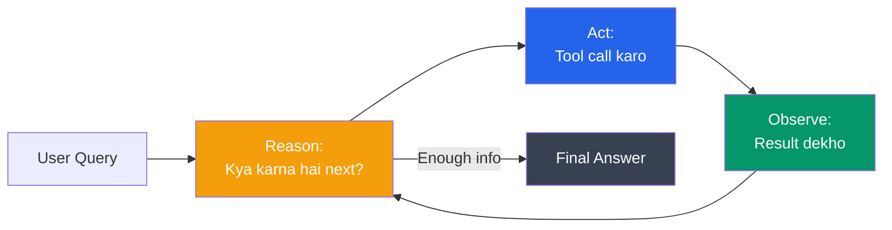
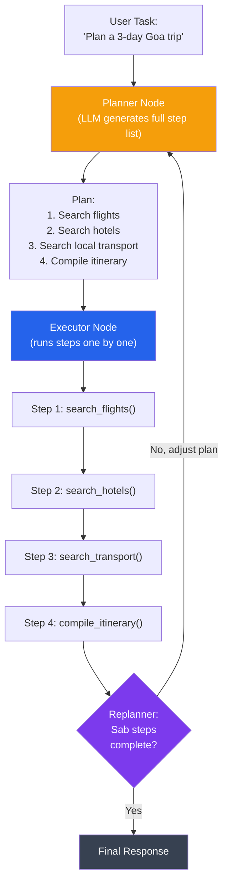
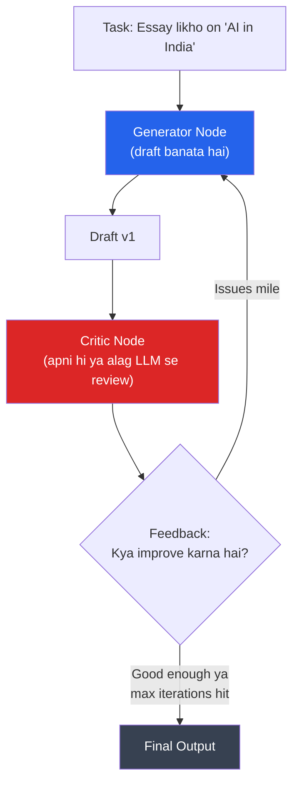
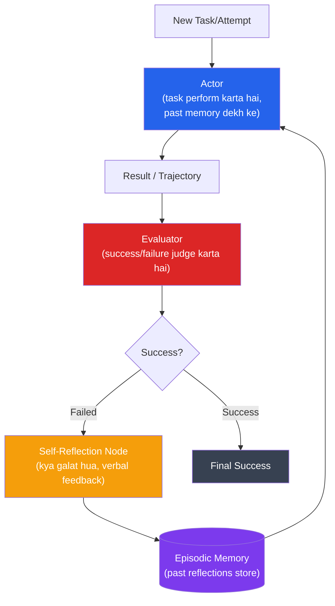
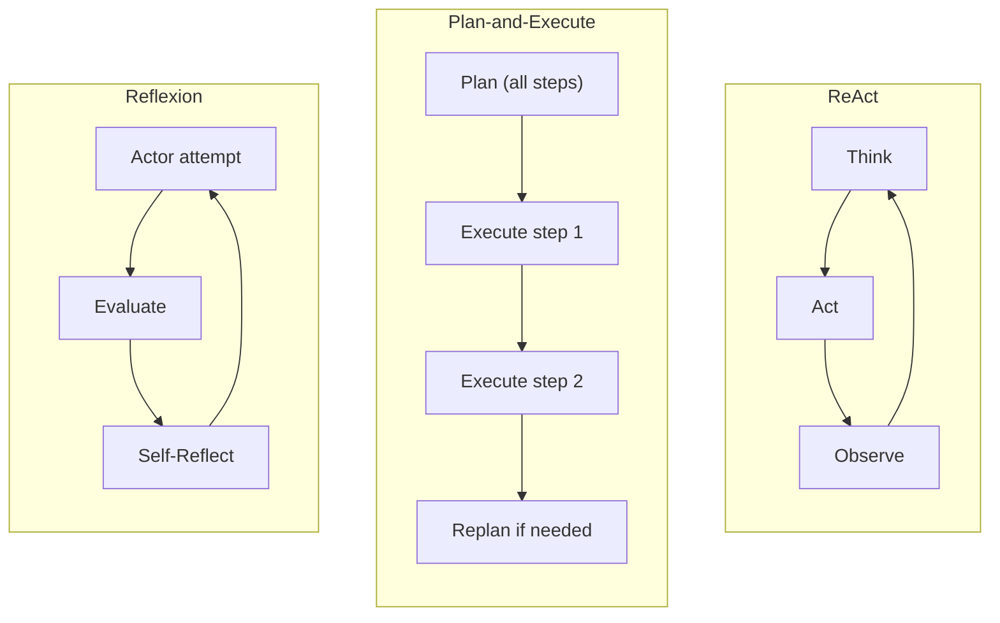
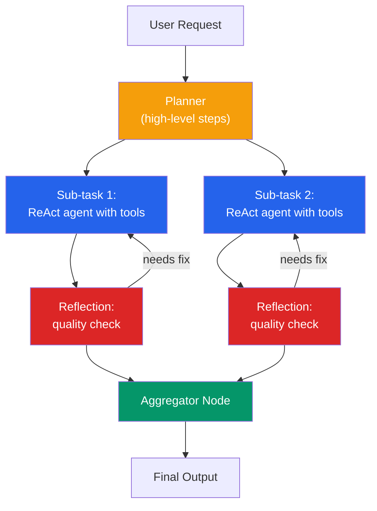
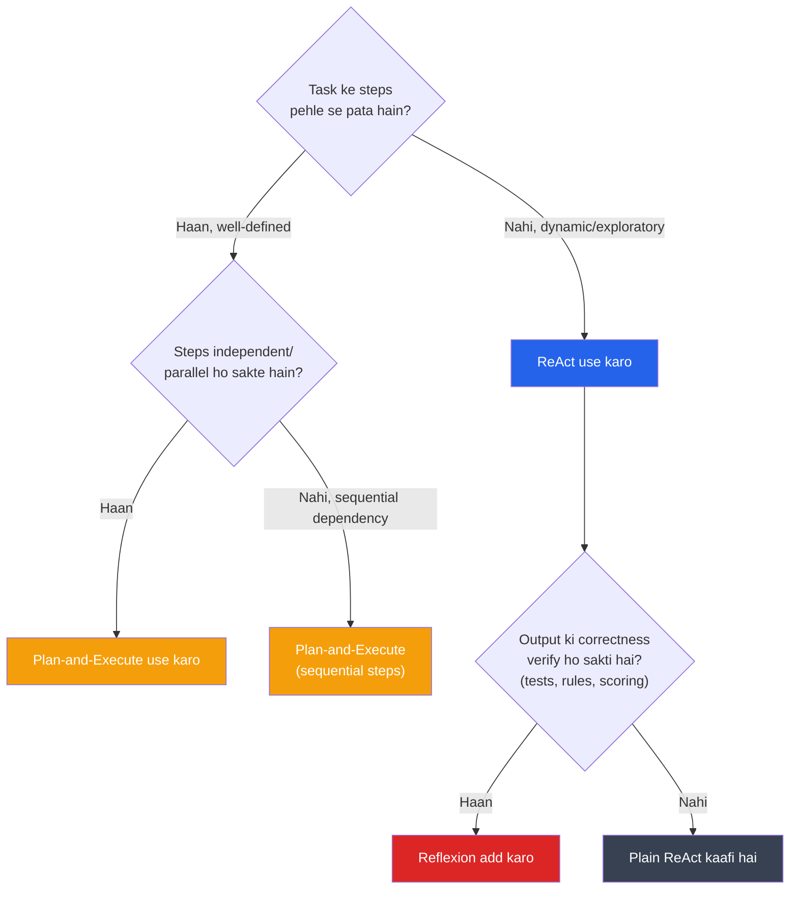

# Advanced Agent Architectures

🔴 Production-grade

## Kya hota hai?

Ab tak jo bhi agent tumne banaye hain — chahe wo simple ReAct loop ho, chahe multi-agent supervisor setup — sab ek common cheez share karte hain: agent **step-by-step, ek-ek karke sochta hai**. "Ek tool call karo, result dekho, agla decide karo, repeat." Ye kaam karta hai chhote tasks ke liye, lekin jaise hi task complex hota hai — jaise "poora market research report banao aur competitor analysis bhi karo" — ye approach struggle karne lagti hai.

Socho ek second ke liye — tumhe IRCTC se Mumbai se Goa tak ka multi-leg trip plan karna hai: train book karo, phir hotel dekho, phir local cab arrange karo. Agar tum step-by-step sochte ho ("pehle train dekhta hoon... achha ab kya karu... hotel dekhta hoon... ab kya... cab dekhta hoon") to tum baar-baar bhatak sakte ho, galat order mein kaam kar sakte ho, ya bhool sakte ho ki asli goal kya tha. Lekin agar tum pehle ek **plan** banao — "1. Train book karo, 2. Hotel book karo, 3. Cab arrange karo" — aur phir har step ko execute karo, to kaam zyada organized aur reliable hota hai.

Yehi exact problem hai jo **Advanced Agent Architectures** solve karte hain. Is chapter mein hum dekhenge:
1. **Planner-Executor Pattern** — pehle poora plan banao, phir execute karo
2. **Reflection / Self-Critique Loops** — agent apna khud ka kaam check kare aur improve kare
3. **ReAct vs Plan-and-Execute vs Reflexion** — teen major architectures ka comparison
4. Sahi architecture kaise choose karein apne problem ke liye
5. Latency, cost, aur reliability ke tradeoffs

> [!info]
> Ye chapter tumhare pichhle knowledge (StateGraph, nodes, edges, conditional routing, multi-agent systems) par build hota hai. Agar tumne Chapter 12-19 nahi padhe, pehle unhe revise kar lo.

---

## Recap: ReAct — Jo Ab Tak Tum Use Kar Rahe Ho

Chapter 8 mein humne `create_react_agent` use karke apna pehla agent banaya tha. Wo **ReAct (Reasoning + Acting)** pattern follow karta hai:



**ReAct ka loop:** Think → Act → Observe → Think → Act → Observe → ... jab tak final answer na mile.

```python
from langgraph.prebuilt import create_react_agent
from langchain_openai import ChatOpenAI
from langchain_core.tools import tool

@tool
def search_flights(origin: str, destination: str) -> str:
    """Search available flights between two cities."""
    return f"Found 3 flights from {origin} to {destination}: IndiGo 6E-204, Air India AI-101, Vistara UK-995"

@tool
def search_hotels(city: str) -> str:
    """Search available hotels in a city."""
    return f"Found hotels in {city}: Taj, ITC, OYO Rooms"

llm = ChatOpenAI(model="gpt-4o", temperature=0)
agent = create_react_agent(llm, tools=[search_flights, search_hotels])

result = agent.invoke({
    "messages": [("user", "Mujhe Mumbai se Goa jaana hai aur wahan stay bhi chahiye")]
})
print(result["messages"][-1].content)
```

**ReAct ki dikkat kya hai?** Har step par agent poori history dekh kar decide karta hai "ab kya karu." Isme koi upfront plan nahi hota — agent "improvise" karta hai. Chhote, linear tasks ke liye ye bilkul theek hai. Lekin jaise hi task mein **multiple independent sub-tasks** hote hain jo parallel ho sakte hain, ya jaha planning ahead se cost/time bachta hai — ReAct inefficient ho jaata hai. Har LLM call mein poori conversation history bhejni padti hai (token cost badhta hai), aur agent kabhi-kabhi galat direction mein loop mein phas jaata hai.

---

## Pattern 1: Planner-Executor Architecture

### Kya hota hai?

**Planner-Executor** pattern do responsibilities ko clearly separate karta hai:

1. **Planner** — task ko dekh kar ek **poora, multi-step plan** banata hai upfront (jaise ek to-do list)
2. **Executor** — us plan ke har step ko execute karta hai, ek-ek karke, tools use karke

Zomato analogy: Socho tumne Zomato pe ek bada order diya — 3 restaurants se khana, ek gift wrapping service, aur delivery scheduling. Ek "Operations Manager" (Planner) pehle poora plan banata hai: "1. Restaurant A se order confirm karo, 2. Restaurant B se order confirm karo, 3. Gift wrap arrange karo, 4. Delivery slot book karo." Phir ye plan "Execution Team" (Executor) ko de diya jaata hai jo har step ko actually perform karta hai. Agar beech mein kuch fail ho (restaurant B band hai), to sirf wo step re-plan hota hai — poora plan discard nahi karna padta.



### Kyun zaruri hai?

| Problem with ReAct-only | Planner-Executor kaise solve karta hai |
|---|---|
| Har step par poori history LLM ko bhejni padti hai → costly | Plan ek baar banta hai, executor chhote focused calls karta hai |
| Multi-step tasks mein agent bhatak sakta hai | Upfront plan se clear roadmap milta hai |
| Independent steps bhi sequentially execute hote hain | Plan ke steps parallel execute ho sakte hain (agar independent hain) |
| Debugging mushkil — pata nahi agent "soch" kya raha tha | Plan explicitly visible hai — tum exactly dekh sakte ho kya steps banaye gaye |
| Long-horizon tasks (10+ steps) mein context window bhar jaata hai | Executor sirf current step ka context dekhta hai, poori history nahi |

> [!tip]
> Ye pattern originally **"Plan-and-Solve" prompting** aur **BabyAGI/AutoGPT** jaise early autonomous agent projects se popular hua tha. LangGraph isko implement karna bahut easy banata hai kyunki state explicitly manage hota hai.

### Code Example: Plan-and-Execute Agent in LangGraph

Ye example ek travel-planning agent banata hai jo pehle poora plan banata hai, phir har step execute karta hai, aur agar zaroorat pade to **re-plan** bhi karta hai.

```python
import operator
from typing import Annotated, List, Tuple, Union
from typing_extensions import TypedDict
from pydantic import BaseModel, Field

from langchain_openai import ChatOpenAI
from langchain_core.prompts import ChatPromptTemplate
from langgraph.graph import StateGraph, END
from langgraph.prebuilt import create_react_agent
from langchain_core.tools import tool


# ---------- 1. Tools jo executor use karega ----------
@tool
def search_flights(origin: str, destination: str) -> str:
    """Search available flights between two cities."""
    return f"Flights {origin}->{destination}: IndiGo 6E-204 (₹4500), Vistara UK-995 (₹6200)"

@tool
def search_hotels(city: str, nights: int) -> str:
    """Search hotels in a city for given number of nights."""
    return f"Hotels in {city} for {nights} nights: Taj (₹8000/night), OYO (₹1500/night)"

@tool
def search_local_transport(city: str) -> str:
    """Find local transport options in a city."""
    return f"Local transport in {city}: Ola/Uber cabs, scooter rentals ₹400/day"

tools = [search_flights, search_hotels, search_local_transport]
llm = ChatOpenAI(model="gpt-4o", temperature=0)

# Executor is a small ReAct agent that runs ONE step at a time
executor_agent = create_react_agent(llm, tools=tools)


# ---------- 2. State Definition ----------
class PlanExecuteState(TypedDict):
    input: str
    plan: List[str]
    past_steps: Annotated[List[Tuple[str, str]], operator.add]
    response: str


# ---------- 3. Planner ----------
class Plan(BaseModel):
    """Plan to follow, as a list of clear, sequential steps."""
    steps: List[str] = Field(
        description="Different steps to follow, in order. Should be sequential and specific."
    )

planner_prompt = ChatPromptTemplate.from_messages([
    ("system", """Tum ek expert travel planner ho. User ke goal ke liye ek simple, 
    step-by-step plan banao. Har step ek concrete action hona chahiye jo tools se 
    poora ho sake (flights, hotels, ya local transport search karna). 
    Zyada steps mat banao — sirf jitne zaroori hain."""),
    ("user", "{input}"),
])
planner = planner_prompt | llm.with_structured_output(Plan)


def plan_step(state: PlanExecuteState):
    plan = planner.invoke({"input": state["input"]})
    return {"plan": plan.steps}


# ---------- 4. Executor ----------
def execute_step(state: PlanExecuteState):
    plan = state["plan"]
    # Sabse pehla pending step lo
    task = plan[0]
    task_formatted = f"""Tumhara plan ka current task ye hai: {task}
    Poora context: {state["input"]}"""

    result = executor_agent.invoke({"messages": [("user", task_formatted)]})
    step_result = result["messages"][-1].content

    return {
        "past_steps": [(task, step_result)],
        "plan": plan[1:],   # is step ko plan se hata do, completed
    }


# ---------- 5. Replanner ----------
class Response(BaseModel):
    """Final response to the user."""
    response: str

class Act(BaseModel):
    """Action to perform: either continue with updated plan, or respond to user."""
    action: Union[Response, Plan] = Field(
        description="Agar sab steps complete ho gaye, Response bhejo. "
        "Agar plan update chahiye, updated Plan bhejo."
    )

replanner_prompt = ChatPromptTemplate.from_template("""
Tumhara original task: {input}

Original plan: {plan}

Ab tak complete hue steps aur unke results:
{past_steps}

Agar sab kaam ho gaya hai, user ko final Response do (saara information combine karke).
Agar aur steps chahiye, updated Plan do — sirf remaining steps include karo, jo already 
complete ho chuke hain unhe dobara mat karo.
""")
replanner = replanner_prompt | llm.with_structured_output(Act)


def replan_step(state: PlanExecuteState):
    output = replanner.invoke({
        "input": state["input"],
        "plan": state["plan"],
        "past_steps": state["past_steps"],
    })
    if isinstance(output.action, Response):
        return {"response": output.action.response}
    else:
        return {"plan": output.action.steps}


# ---------- 6. Routing ----------
def should_end(state: PlanExecuteState):
    if state.get("response"):
        return END
    return "agent"  # aur steps execute karne ke liye executor pe wapas jao


# ---------- 7. Graph Assembly ----------
workflow = StateGraph(PlanExecuteState)
workflow.add_node("planner", plan_step)
workflow.add_node("agent", execute_step)
workflow.add_node("replan", replan_step)

workflow.set_entry_point("planner")
workflow.add_edge("planner", "agent")
workflow.add_edge("agent", "replan")
workflow.add_conditional_edges("replan", should_end, {END: END, "agent": "agent"})

app = workflow.compile()

# ---------- 8. Run ----------
result = app.invoke({
    "input": "Mujhe Mumbai se Goa 3 din ka trip plan karna hai, flight, hotel aur local transport ke saath",
    "past_steps": [],
})
print(result["response"])
```

**Isme kya ho raha hai step-by-step:**
1. `plan_step` — poora task dekh kar structured `Plan` (list of steps) banata hai
2. `execute_step` — plan ka **pehla** step lekar, chhote ReAct agent se execute karwata hai, result ko `past_steps` mein append karta hai
3. `replan_step` — check karta hai ki kaam complete hua ya nahi. Agar haan, `Response` banata hai. Agar nahi, plan update karta hai (naye steps ya reorder)
4. Loop tab tak chalta hai jab tak replanner `Response` na de de

> [!warning]
> `operator.add` reducer `past_steps` ke liye zaroori hai — LangGraph ke state updates by default **overwrite** karte hain, replace nahi merge. Agar tum reducer nahi lagaoge, to har execute step pichhle steps ke results ko delete kar dega. (Ye Chapter 15 — State Management and Reducers — se concept hai.)

---

## Pattern 2: Reflection / Self-Critique Loops

### Kya hota hai?

Reflection pattern mein agent apna khud ka output banata hai, phir **khud hi usko critique karta hai** (ya ek dusra "critic" LLM critique karta hai), aur us feedback ke basis par improve karta hai. Ye bilkul waisa hai jaise tum code likhne ke baad khud review karte ho — "wait, ye edge case to maine handle hi nahi kiya" — aur fix kar dete ho, bina kisi senior developer ke bataye.

**Analogy — Swiggy delivery partner training:** Naya delivery partner order deliver karta hai (Generate). Uska supervisor (Critic) route, time, aur customer feedback check karta hai — "Tumne galat gate se enter kiya, isliye late ho gaye" (Critique). Delivery partner agli baar wahi mistake nahi karta (Revise). Kuch iterations ke baad delivery partner khud hi apna route optimize karne lagta hai.



### Kyun zaruri hai?

LLMs pehli try mein hamesha perfect output nahi dete — especially complex reasoning, code generation, ya long-form content mein. Reflection loop agent ko **quality control** deta hai, bina human ke beech mein aaye:

| Bina Reflection | Reflection ke saath |
|---|---|
| LLM ka pehla output hi final answer maan liya jaata hai | Output ko systematically critique kiya jaata hai |
| Hallucinations, logical gaps unnoticed reh jaate hain | Critic in issues ko specifically flag karta hai |
| Code generate hota hai bina test kiye | Code ko run karke errors ka feedback loop mein diya jaata hai |
| Quality inconsistent hoti hai | Iterative refinement se consistent quality milti hai |

> [!warning]
> Reflection **free nahi hai** — har iteration ek extra LLM call hai. Agar tum max 3 iterations allow karte ho, worst case tumhara cost aur latency 3x tak badh sakta hai. Isliye production mein hamesha ek **max iteration limit** aur/ya confidence threshold set karo.

### Code Example: Self-Reflection Loop in LangGraph

```python
from typing import Annotated, List
from typing_extensions import TypedDict
import operator

from langchain_openai import ChatOpenAI
from langchain_core.messages import HumanMessage, AIMessage, SystemMessage
from langgraph.graph import StateGraph, END

llm = ChatOpenAI(model="gpt-4o", temperature=0.7)


# ---------- 1. State ----------
class ReflectionState(TypedDict):
    task: str
    draft: str
    critique: str
    revision_count: int


MAX_REVISIONS = 3


# ---------- 2. Generator Node ----------
def generate_node(state: ReflectionState):
    if state.get("critique"):
        # Pehle critique incorporate karo
        prompt = f"""Task: {state['task']}

        Tumhara pichhla draft:
        {state['draft']}

        Critique jo mila:
        {state['critique']}

        Is critique ko incorporate karke, ek improved draft likho."""
    else:
        prompt = f"Task: {state['task']}\n\nEk draft likho."

    response = llm.invoke([HumanMessage(content=prompt)])
    return {
        "draft": response.content,
        "revision_count": state.get("revision_count", 0) + 1,
    }


# ---------- 3. Critic Node ----------
def critique_node(state: ReflectionState):
    critique_prompt = f"""Tum ek strict editor ho. Is draft ko critically review karo.

    Original Task: {state['task']}

    Draft:
    {state['draft']}

    Agar draft achha hai aur koi major issue nahi hai, sirf "APPROVED" likho.
    Agar issues hain, unhe specifically point out karo (factual errors, missing 
    points, unclear language, structure problems) — bullet points mein."""

    response = llm.invoke([SystemMessage(content=critique_prompt)])
    return {"critique": response.content}


# ---------- 4. Routing: continue ya stop? ----------
def should_continue(state: ReflectionState):
    if "APPROVED" in state["critique"]:
        return END
    if state["revision_count"] >= MAX_REVISIONS:
        return END  # safety net — infinite loop mat banao
    return "generate"


# ---------- 5. Graph ----------
workflow = StateGraph(ReflectionState)
workflow.add_node("generate", generate_node)
workflow.add_node("critique", critique_node)

workflow.set_entry_point("generate")
workflow.add_edge("generate", "critique")
workflow.add_conditional_edges(
    "critique", should_continue, {END: END, "generate": "generate"}
)

app = workflow.compile()

result = app.invoke({
    "task": "Ek 150-word paragraph likho 'India mein Agentic AI ka future' par",
    "revision_count": 0,
    "critique": "",
})
print(f"Final draft ({result['revision_count']} revisions):\n{result['draft']}")
```

> [!tip]
> Production systems mein "APPROVED" jaisa plain-text signal fragile hota hai (LLM kabhi format follow nahi karta). Better approach: `with_structured_output` use karke Pydantic model return karwao — `class Critique(BaseModel): approved: bool; feedback: str`. Ye Chapter 4 (Output Parsers and Structured Output) mein cover kiya gaya pattern hai.

---

## Pattern 3: Reflexion — Reflection + Memory

**Reflexion** (Shinn et al., 2023 paper se aaya naam) reflection pattern ka ek advanced version hai jisme agent apne **past mistakes ko episodic memory mein store** karta hai aur future attempts mein unko reference karta hai — sirf current draft improve nahi karta, balki apne "learnings" ko carry forward karta hai.

**Analogy:** Socho tum Swiggy delivery partner ho jo ek naye area mein delivery kar raha hai. Pehle din tumne galat building enter kiya, late ho gaye (mistake #1). Doosre din tumne wrong parking spot choose kiya (mistake #2). Ek normal reflection loop sirf "aaj ka" mistake fix karega. Lekin Reflexion mein tum ek **notebook maintain karte ho** — "Building X mein Gate 2 se entry lo," "Area Y mein bike stand C use karo" — aur har naye delivery attempt se pehle apni notebook check karte ho. Isse tum same mistakes repeat nahi karte, chahe task naya ho.



### Reflection vs Reflexion — Fark Kya Hai?

| Aspect | Simple Reflection | Reflexion |
|---|---|---|
| Scope | Ek hi task ke andar draft improve karta hai | Multiple attempts/episodes ke across seekhta hai |
| Memory | Sirf current conversation state | Persistent episodic memory (long-term) |
| Use case | Single-shot content generation, code review | Multi-attempt problem solving (coding challenges, games, complex reasoning tasks) |
| Complexity | Medium | High — memory management, retrieval logic chahiye |

### Code Example: Reflexion-style Agent

```python
from typing import Annotated, List
from typing_extensions import TypedDict
import operator

from langchain_openai import ChatOpenAI
from langchain_core.messages import HumanMessage
from langgraph.graph import StateGraph, END

llm = ChatOpenAI(model="gpt-4o", temperature=0.3)

MAX_ATTEMPTS = 4


class ReflexionState(TypedDict):
    task: str
    attempt: str
    is_correct: bool
    memory: Annotated[List[str], operator.add]  # persistent learnings across attempts
    attempt_count: int


def actor_node(state: ReflexionState):
    memory_text = "\n".join(f"- {m}" for m in state["memory"]) or "Koi past learning nahi hai."
    prompt = f"""Task: {state['task']}

    Pichhle attempts se seekhi gayi cheezein:
    {memory_text}

    In learnings ko dhyan mein rakhte hue, task solve karo."""

    response = llm.invoke([HumanMessage(content=prompt)])
    return {
        "attempt": response.content,
        "attempt_count": state.get("attempt_count", 0) + 1,
    }


def evaluator_node(state: ReflexionState):
    # Real system mein: code execution, unit tests, ya rule-based check
    eval_prompt = f"""Task: {state['task']}
    Attempt: {state['attempt']}

    Kya ye attempt task ko sahi tarah se solve karta hai? Sirf 'YES' ya 'NO' bolo."""
    verdict = llm.invoke([HumanMessage(content=eval_prompt)])
    return {"is_correct": "YES" in verdict.content.upper()}


def self_reflect_node(state: ReflexionState):
    reflect_prompt = f"""Task: {state['task']}
    Failed attempt: {state['attempt']}

    Ye attempt fail kyun hua? Ek concise, actionable learning likho (1-2 lines) 
    jo agli baar isi tarah ki galti se bachne mein madad kare."""
    reflection = llm.invoke([HumanMessage(content=reflect_prompt)])
    return {"memory": [reflection.content]}


def route_after_eval(state: ReflexionState):
    if state["is_correct"]:
        return END
    if state["attempt_count"] >= MAX_ATTEMPTS:
        return END  # give up after N tries
    return "reflect"


workflow = StateGraph(ReflexionState)
workflow.add_node("actor", actor_node)
workflow.add_node("evaluate", evaluator_node)
workflow.add_node("reflect", self_reflect_node)

workflow.set_entry_point("actor")
workflow.add_edge("actor", "evaluate")
workflow.add_conditional_edges(
    "evaluate", route_after_eval, {END: END, "reflect": "reflect"}
)
workflow.add_edge("reflect", "actor")

app = workflow.compile()

result = app.invoke({
    "task": "Ek Python function likho jo palindrome check kare, edge cases (empty string, spaces, case-sensitivity) ke saath",
    "memory": [],
    "attempt_count": 0,
})
print(f"Attempts: {result['attempt_count']}")
print(f"Final: {result['attempt']}")
```

> [!info]
> Production Reflexion systems mein `memory` ko sirf in-graph state mein rakhna kaafi nahi — usse **persistent store** (jaise vector DB ya Postgres) mein save karna chahiye taaki agent alag-alag sessions ke across bhi seekh sake. Ye Chapter 6 (Memory) ke long-term memory concepts se connect hota hai.

---

## Comparison: ReAct vs Plan-and-Execute vs Reflexion



| Dimension | ReAct | Plan-and-Execute | Reflexion |
|---|---|---|---|
| **Kaise sochta hai** | Ek-ek step, koi upfront plan nahi | Poora plan pehle, phir sequential execution | Attempt → evaluate → learn → retry |
| **Best for** | Simple/medium tasks, exploratory queries jaha next step pehle se pata nahi | Well-defined multi-step tasks (travel booking, report generation, data pipelines) | Tasks jaha correctness verify ho sakti hai (coding, math, puzzles, games) |
| **Latency** | Low-medium (ek loop = ek LLM call, chhote steps) | Medium (planning overhead + execution) lekin steps parallel ho sakte hain | High (multiple full attempts + evaluation + reflection) |
| **Cost (token usage)** | Medium — har turn poori history bhejni padti hai | Lower per-step — executor sirf current step dekhta hai | Highest — har failed attempt ek poora extra cycle hai |
| **Reliability** | Medium — long tasks mein bhatak sakta hai | High — explicit plan se predictability aati hai | High for verifiable tasks — self-correction se accuracy badhti hai |
| **Debuggability** | Medium — reasoning trace dekhna padta hai | High — plan explicitly visible, step-by-step audit trail | Medium-high — memory/reflections dekh sakte ho par attempts multiply ho jaate hain |
| **Complexity to build** | Low — `create_react_agent` se 5 lines mein | Medium — planner + executor + replanner nodes chahiye | High — actor + evaluator + memory management chahiye |
| **Human-in-the-loop fit** | Achha — kisi bhi step par pause kar sakte ho | Bahut achha — plan ko approve karwa sakte ho execution se pehle | Medium — mid-reflection interrupt karna complex hai |

### Real-World Scenario Mapping

| Scenario | Recommended Architecture | Kyun |
|---|---|---|
| Customer support chatbot jo FAQ answer kare | **ReAct** | Simple, single-turn ya few-turn interactions, low latency zaroori |
| "Meri poori Diwali shopping list ke liye best deals dhundo across 5 sites" | **Plan-and-Execute** | Clear sub-tasks (5 independent searches), parallel ho sakta hai |
| Coding agent jo LeetCode problem solve kare | **Reflexion** | Correctness verify ho sakti hai (test cases run karke), retry se accuracy badhti hai |
| Autonomous research assistant jo report banaye | **Plan-and-Execute + Reflection hybrid** | Plan se structure milta hai, reflection se quality control |
| Simple calculator/unit-converter agent | **ReAct (ya seedha function calling)** | Itna simple hai ki planning overhead bekaar hai |
| Data pipeline agent jo ETL steps execute kare | **Plan-and-Execute** | Steps well-known hain, order matter karta hai, retryable |

> [!warning]
> **Common mistake:** Har problem ke liye sabse "advanced" architecture (Reflexion) use karna. Agar tumhara task simple hai — jaise "aaj ka weather batao" — Reflexion lagana sirf latency aur cost badhayega bina kisi accuracy benefit ke. **Hamesha simplest architecture se start karo jo kaam kare, phir zaroorat padne par upgrade karo.**

---

## Hybrid Architectures — Production Mein Combination

Real production systems mein tum in patterns ko **combine** karoge. Ek common production pattern:



Isme:
- **Top-level Planner** poora task sub-tasks mein todta hai
- Har sub-task ek **ReAct agent** hai jo apne tools use karta hai
- Har sub-task ke output ko **reflection loop** se pass kiya jaata hai quality check ke liye
- Aakhir mein sab results ek **aggregator node** combine karta hai

Ye exactly wahi pattern hai jo Chapter 18 (Multi-Agent Systems) ke supervisor pattern ke saath milke — production-grade "Autonomous Developer Assistant," "Research Agent," ya "Report Generator" systems banaane mein use hota hai.

---

## Architecture Choose Karne Ka Decision Framework

Jab bhi naya agent design karo, ye questions khud se pucho:



**Checklist production mein architecture choose karte waqt:**

1. **Latency budget kya hai?** User real-time response expect karta hai (chatbot) ya batch/async process hai (report generation)? Real-time ke liye ReAct ya simple plan-execute; batch ke liye Reflexion affordable hai.
2. **Cost per request kitna acceptable hai?** Reflexion ke multiple LLM calls production scale par (lakhs of requests) bahut mehenga ho sakta hai.
3. **Kya correctness verify ho sakti hai programmatically?** Agar haan (code tests, math checks, structured validation) — Reflexion bahut effective hai. Agar nahi (subjective content jaise creative writing) — simple reflection (bina memory ke) better hai.
4. **Task kitna long-horizon hai?** 2-3 steps ke liye ReAct kaafi hai. 5+ independent steps ke liye Plan-and-Execute se predictability milti hai.
5. **Human oversight chahiye kaha?** Plan-and-Execute mein plan ko approve karwana (human-in-the-loop) bahut natural fits — Chapter 16 ka `interrupt()` pattern use karo plan approval ke liye.

---

## Latency, Cost, Reliability — Tradeoffs Deep Dive

### Latency

| Architecture | Typical latency profile |
|---|---|
| ReAct | Linear in number of tool calls — har call ek round-trip |
| Plan-and-Execute | Planning overhead (1 extra LLM call) + parallel execution possible = often **faster** than ReAct for multi-step tasks |
| Reflexion | Multiplicative — N attempts × (generate + evaluate + reflect) calls |

### Cost (Token Usage)

```python
# Approximate token cost comparison (illustrative)
# ReAct: har turn mein poori message history LLM ko jaati hai
# 5-step ReAct task ≈ 1+2+3+4+5 = 15 "units" of context (history grows)

# Plan-and-Execute: executor sirf current step dekhta hai
# 5-step plan-execute ≈ 1 (plan) + 5×1 (each step, minimal context) = 6 "units"

# Reflexion: har attempt poora fresh generation + evaluation + reflection
# 4 attempts ≈ 4 × 3 (generate + evaluate + reflect) = 12 "units", 
# lekin har unit apne aap mein poora task-sized call hai
```

> [!warning]
> Ye numbers illustrative hain — actual cost tumhare prompts, context size, aur model par depend karta hai. Production mein **LangSmith** (Chapter 10) use karke actual token usage measure karo, guess mat karo.

### Reliability

- **ReAct:** Failure mode = agent infinite loop mein phas sakta hai ya galat tool baar-baar call kar sakta hai. Mitigation: max iteration limit set karo (`recursion_limit` in LangGraph config).
- **Plan-and-Execute:** Failure mode = agar planner ka initial plan hi galat hai, sab steps galat direction mein jaate hain. Mitigation: replanner node rakho jo mid-execution course-correct kar sake.
- **Reflexion:** Failure mode = agent same mistake repeat kar sakta hai agar evaluator khud galat judge kare ("hallucinated success"). Mitigation: evaluator ko jitna ho sake **deterministic/rule-based** banao (LLM-as-judge ke bajaye actual test execution).

```python
# Production safety net: hamesha recursion_limit set karo
result = app.invoke(
    {"input": "complex task"},
    config={"recursion_limit": 25}  # LangGraph default 25 hai, explicit rakhna best practice hai
)
```

> [!tip]
> Production mein teeno metrics (latency, cost, reliability) ko LangSmith traces se continuously monitor karo. Agar tumhara Reflexion agent 90% cases mein pehle attempt mein hi pass ho raha hai, to shayad tumhe max attempts 4 se ghatakar 2 karna chahiye — cost bachega bina reliability loss ke.

---

## Key Takeaways

- **ReAct** (Think → Act → Observe loop) simple, exploratory tasks ke liye best hai jaha next step pehle se predict nahi kiya ja sakta — lekin long, multi-step tasks mein context bloat aur bhatakne ka risk hota hai.
- **Planner-Executor** pattern task ko upfront ek explicit plan mein todta hai (Planner), phir har step ko focused execution (Executor) se poora karta hai, aur zaroorat padne par **replan** karta hai — well-defined, multi-step tasks (travel booking, report generation, data pipelines) ke liye ideal.
- **Reflection loops** agent ko apna khud ka output critique karke improve karne dete hain (Generate → Critique → Revise) — content quality aur code correctness improve karne ke liye useful, lekin extra LLM calls ki wajah se cost/latency badhta hai.
- **Reflexion** reflection ka advanced version hai jo **episodic memory** maintain karta hai — agent apne past mistakes se seekhta hai across multiple attempts, verifiable tasks (coding, math, puzzles) ke liye sabse effective.
- Har architecture ka apna latency/cost/reliability tradeoff hai: ReAct medium-fast/medium-cost, Plan-and-Execute predictable/lower-per-step-cost, Reflexion highest-cost/highest-accuracy-for-verifiable-tasks.
- Production systems mein aksar **hybrid architectures** use hoti hain — planner top-level structure deta hai, har sub-task ek ReAct agent hota hai, aur reflection quality-control layer ke roop mein add hoti hai.
- Architecture choose karte waqt hamesha simplest option se start karo jo kaam kare — over-engineering (har jagah Reflexion lagana) sirf cost aur latency badhata hai bina proportional benefit ke.
- Hamesha `recursion_limit` set karo aur LangSmith se actual token/latency/success-rate metrics track karo — assumptions par mat chalo, data dekho.
