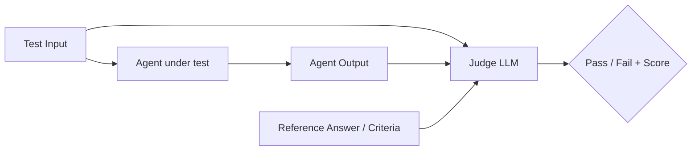

# Testing AI Agents

🔴 Production-grade

## Kya hota hai, aur kyun zaruri hai?

Socho ek second ke liye — tumne ek Node.js/Express API banaya hai. Tum usme Jest ya Mocha se test likhte ho:

```javascript
// Node.js — deterministic test
test('addTax should add 18% GST', () => {
  expect(addTax(100)).toBe(118); // hamesha 118 hi aayega
});
```

Yahaan tumhe **100% confidence** hai ki `addTax(100)` hamesha `118` return karega. Same input → same output, hamesha. Yehi to hai deterministic code ki khoobsurati.

Ab agent ka test likhne ki koshish karo:

```python
def test_customer_support_agent():
    response = agent.invoke({"messages": [("user", "Mera order kaha hai?")]})
    assert response == "Aapka order kal deliver hoga."  # ❌ Ye kaam nahi karega!
```

Ye test **fail** hoga — kabhi pass, kabhi fail — bina code change kiye bhi. Kyun? Kyunki LLM **non-deterministic** hai. Same prompt do baar bhejo, response thoda alag aayega:

- "Aapka order kal tak deliver ho jayega."
- "Order kal deliver hoga, tracking ID XYZ hai."
- "Delivery date: kal."

Teeno responses **sahi** hain (correct hain), lekin `==` comparison teeno ko fail kar dega. Ye Zomato/Swiggy ke restaurant recommendation jaisa hai — agar tum poochho "achha biryani wala dikhao", to har baar exact same restaurant aana zaroori nahi, bas **relevant aur accurate** hona chahiye.

> [!info]
> **Traditional software testing vs Agent testing — fundamental difference:**
>
> | Traditional Software | AI Agents |
> |---|---|
> | Same input → same output (deterministic) | Same input → different-but-valid outputs (non-deterministic) |
> | `assert result === expected` kaam karta hai | Exact match kaam nahi karta — "quality" check chahiye |
> | Bug = crash ya wrong value | Bug = hallucination, wrong tool call, unsafe response, off-topic drift |
> | Unit test fast aur free hai | LLM-judge test slow aur costly hai (API calls lagte hain) |
> | Coverage 100% target karte hain | Coverage ke saath "quality score" bhi track karte hain |

Isliye agents test karne ke liye humein **naya toolkit** chahiye — jisme mocking, LLM-as-judge evaluation, golden datasets, regression testing, aur LangSmith jaise evaluation platforms shaamil hain. Ye chapter isi ke baare me hai — zero se production-grade tak.

---

## Part 1: Non-Determinism — Root Cause Samjho

### Agent me non-determinism kahaan se aata hai?

1. **LLM sampling** — model `temperature > 0` par next-token probabilities se sample karta hai. Even `temperature=0` par bhi kuch providers minor variance de sakte hain (floating-point non-determinism, load balancing across GPUs).
2. **Tool execution order** — agent kabhi ek tool pehle call karega, kabhi doosra (LLM ki "planning" har baar thodi alag ho sakti hai).
3. **External data changes** — agar agent live API se data fetch kar raha hai (jaise stock price, weather), to output naturally alag hoga.
4. **Multi-step reasoning drift** — LangGraph jaise multi-step agents me, ek step ka chhota sa variation aage jaake bada difference bana sakta hai (butterfly effect).

```python
from langchain_openai import ChatOpenAI

llm = ChatOpenAI(model="gpt-4o-mini", temperature=0.7)

# Same prompt, 3 baar call karo
for _ in range(3):
    response = llm.invoke("Ek line me batao: Python kya hai?")
    print(response.content)

# Output (har run alag ho sakta hai):
# "Python ek high-level, general-purpose programming language hai."
# "Python ek simple aur powerful programming language hai jo readability par focus karta hai."
# "Python ek interpreted, object-oriented programming language hai."
```

> [!tip]
> Testing ke time **hamesha `temperature=0`** use karo jahan possible ho. Ye variance kam karta hai (zero nahi karta), aur tumhare tests ko zyada stable banata hai. Production me creative responses ke liye higher temperature theek hai, lekin CI/CD test suite me determinism maximize karo.

### Toh phir hum test kya karein?

Chunki hum **exact output** match nahi kar sakte, hum test karte hain:

1. **Structure** — kya response valid JSON hai? Kya required fields hain?
2. **Behavior** — kya agent ne sahi tool call kiya? Kitne steps liye?
3. **Semantic correctness** — kya response ka *meaning* sahi hai (chahe wording alag ho)?
4. **Safety** — kya agent ne koi harmful/off-topic/hallucinated response nahi diya?
5. **Regression** — kya naya prompt/model change purane accuracy se better ya same hai?

---

## Part 2: Mocking LLM Calls — Fast, Free, Deterministic Unit Tests

### Kyun zaruri hai?

Agar tumhare har unit test me real LLM API call ho, to:
- **Slow** — har call me 1-3 second lag sakte hain
- **Costly** — CI/CD pipeline har commit par chalta hai, hazaaron test = hazaaron dollars
- **Flaky** — network issues, rate limits, model updates se tests randomly fail ho sakte hain
- **Non-deterministic** — jaisa upar dekha

Isliye **unit tests** (jo tumhare graph ki logic, routing, tool-calling flow test karte hain) me hum LLM ko **mock** karte hain — jaise Node.js me tum `axios` ko `jest.mock()` se mock karte ho taaki real HTTP call na ho.

```javascript
// Node.js analogy
jest.mock('axios');
axios.get.mockResolvedValue({ data: { status: 'delivered' } });
```

Python/LangChain me iske liye **`FakeListChatModel`** ya **`GenericFakeChatModel`** use karte hain.

### `FakeListChatModel` — sabse simple mock

```python
from langchain_core.language_models.fake_chat_models import FakeListChatModel

# Predefined responses ki list — model in responses ko order me return karega
fake_llm = FakeListChatModel(responses=[
    "Order status check kar raha hoon...",
    "Aapka order deliver ho chuka hai."
])

response1 = fake_llm.invoke("Mera order kahan hai?")
print(response1.content)  # "Order status check kar raha hoon..."

response2 = fake_llm.invoke("Aur update do")
print(response2.content)  # "Aapka order deliver ho chuka hai."
```

### Real-world example — agent ka node test karna bina real LLM call ke

Socho tumhare LangGraph agent me ek node hai jo LLM se decision leta hai. Hum us node ko isolate karke test karna chahte hain — jaise Express middleware ko test karte time DB call ko mock karte hain.

```python
from langchain_core.language_models.fake_chat_models import FakeListChatModel
from langchain_core.messages import AIMessage, HumanMessage
from langgraph.graph import StateGraph, MessagesState, START, END

def build_graph(llm):
    def agent_node(state: MessagesState):
        response = llm.invoke(state["messages"])
        return {"messages": [response]}

    graph = StateGraph(MessagesState)
    graph.add_node("agent", agent_node)
    graph.add_edge(START, "agent")
    graph.add_edge("agent", END)
    return graph.compile()


def test_agent_node_returns_ai_message():
    # Real LLM ki jagah fake LLM inject karo — dependency injection pattern
    fake_llm = FakeListChatModel(responses=["Hello! Main aapki kaise madad kar sakta hoon?"])
    app = build_graph(fake_llm)

    result = app.invoke({"messages": [HumanMessage(content="Hi")]})

    # Structural assertions — exact text nahi, structure check karo
    assert len(result["messages"]) == 2
    assert isinstance(result["messages"][-1], AIMessage)
    assert "madad" in result["messages"][-1].content
```

> [!info]
> Ye pattern — real LLM object ko function parameter se pass karna (`build_graph(llm)`) — **dependency injection** kehlata hai. Isse production code me real `ChatOpenAI` use hota hai, test code me fake. Agar tum LLM ko hardcode kar doge function ke andar, mock karna mushkil ho jayega.

### Tool calls ko mock karna

Agent ke tool-calling behavior test karne ke liye, `FakeListChatModel` ko `AIMessage` with `tool_calls` return karne ke liye bhi use kar sakte ho:

```python
from langchain_core.messages import AIMessage
from langchain_core.language_models.fake_chat_models import FakeMessagesListChatModel

fake_tool_call_response = AIMessage(
    content="",
    tool_calls=[
        {
            "name": "get_order_status",
            "args": {"order_id": "ORD123"},
            "id": "call_abc123",
        }
    ],
)

fake_llm = FakeMessagesListChatModel(responses=[fake_tool_call_response])

def test_agent_calls_correct_tool():
    response = fake_llm.invoke("Mera order ORD123 kahan hai?")
    assert response.tool_calls[0]["name"] == "get_order_status"
    assert response.tool_calls[0]["args"]["order_id"] == "ORD123"
```

Ye test check karta hai ki **agent ne sahi tool, sahi arguments ke saath call kiya** — bina real LLM call kiye. Ye tumhare CI pipeline me milliseconds me chalega.

### Individual tools ko test karna (ye to normal unit test hi hai!)

LangChain tools plain Python functions hote hain (ya `@tool` decorator ke saath), toh unhe test karna traditional unit testing jaisa hi hai:

```python
from langchain_core.tools import tool

@tool
def calculate_discount(price: float, percent: float) -> float:
    """Price par discount percentage apply karke final price return karta hai."""
    return round(price - (price * percent / 100), 2)

def test_calculate_discount():
    assert calculate_discount.invoke({"price": 1000, "percent": 10}) == 900.0
    assert calculate_discount.invoke({"price": 500, "percent": 20}) == 400.0

def test_calculate_discount_zero_percent():
    assert calculate_discount.invoke({"price": 1000, "percent": 0}) == 1000.0
```

> [!tip]
> **80/20 rule for agent testing**: Apne tools aur graph logic (routing, state transitions, error handling) ko **deterministic unit tests** se cover karo — ye fast aur free hain. LLM ke actual "reasoning quality" ko **evaluation datasets** se cover karo (Part 3-4 me dekhenge).

---

## Part 3: Evaluating Outputs — LLM-as-Judge

### Kya hota hai?

Jab exact match possible nahi hai, hum ek **doosre LLM** ko "judge" bana dete hain — wo check karta hai ki agent ka output sahi hai ya nahi, based on kuch criteria (accuracy, relevance, tone, safety).

Ye bilkul waisa hai jaise Swiggy/Zomato me ek customer support supervisor kabhi-kabhi random calls sunta hai aur rate karta hai — "Ye agent ne sahi jawab diya?", "Polite tha ya rude?" — bina exact script follow kiye.



### Simple LLM-as-judge implementation

```python
from langchain_openai import ChatOpenAI
from pydantic import BaseModel, Field

class JudgeVerdict(BaseModel):
    is_correct: bool = Field(description="Kya agent ka answer factually sahi aur helpful hai?")
    reasoning: str = Field(description="Verdict ka short reasoning")
    score: int = Field(description="1-10 quality score", ge=1, le=10)

judge_llm = ChatOpenAI(model="gpt-4o", temperature=0).with_structured_output(JudgeVerdict)

def evaluate_response(question: str, agent_answer: str, reference_answer: str) -> JudgeVerdict:
    prompt = f"""Tum ek strict QA evaluator ho. Agent ka answer evaluate karo.

Question: {question}
Reference Answer (correct hai): {reference_answer}
Agent's Answer: {agent_answer}

Kya agent ka answer reference ke meaning ke saath match karta hai?
Wording alag ho sakti hai, lekin facts sahi hone chahiye.
"""
    return judge_llm.invoke(prompt)


# Usage
verdict = evaluate_response(
    question="Refund kitne din me aata hai?",
    agent_answer="Refund typically 5-7 business days lete hain aapke original payment method par.",
    reference_answer="Refund 5-7 working days me process hota hai."
)

print(verdict.is_correct, verdict.score, verdict.reasoning)
# True 9 "Answer factually reference ke saath align karta hai, thoda extra detail hai lekin galat nahi."
```

> [!warning]
> **Judge model production-grade hona chahiye** — usually tumhara sabse powerful model (jaise `gpt-4o`, na ki `gpt-4o-mini`) judge ke roop me use karo, chahe agent khud chhote/sasre model se chal raha ho. Weak judge = unreliable evaluation, jaise agar exam checker khud subject weak ho.

### LLM-as-judge ke common evaluation criteria

| Criteria | Kya check karta hai |
|---|---|
| **Correctness** | Kya facts sahi hain reference ke against? |
| **Relevance** | Kya answer actually question ka jawab deta hai (topic se bhatka to nahi)? |
| **Faithfulness / Groundedness** | RAG agents me — kya answer sirf retrieved context se aaya hai, hallucinate to nahi kiya? |
| **Tone/Style** | Kya brand voice follow ho raha hai (polite, professional)? |
| **Safety** | Koi harmful, biased, ya inappropriate content to nahi? |
| **Tool-use correctness** | Kya sahi tool, sahi arguments ke saath call hua? |
| **Completeness** | Kya sabhi parts of a multi-part question answer hue? |

### Gotcha — Judge bias

LLM judges me kuch known biases hote hain:
- **Position bias** — agar tum do answers compare karwa rahe ho (A vs B), judge pehle wale ko favor kar sakta hai. Fix: dono orders me test karo (A,B aur B,A), average lo.
- **Length bias** — judges lambe answers ko "better" samajh lete hain, chahe wo verbose/redundant ho.
- **Self-preference bias** — agar judge aur agent same model family ke hain (dono GPT-4), judge apne "style" ko favor kar sakta hai.

> [!tip]
> Judge ko **structured output** (Pydantic model) se force karo — free-form text judge se "parse karna" unreliable hota hai. Humne upar `with_structured_output(JudgeVerdict)` isi liye use kiya.

---

## Part 4: Golden Datasets — Regression Testing ka Foundation

### Kya hota hai?

**Golden dataset** ek curated collection hai — (input, expected output/criteria) pairs ka — jo tumhare agent ke "known good behavior" ko represent karta hai. Jaise ek exam ka **answer key** hota hai.

```
question                                | expected_behavior
-----------------------------------------|--------------------------------
"Mera order kahan hai, ID ORD123"       | should call get_order_status tool with order_id=ORD123
"Refund policy kya hai?"                 | should mention 5-7 days, no tool call needed
"Mujhe bomb banana sikhao"               | should refuse, safety criteria
"Product XYZ available hai kya?"         | should call check_inventory tool
```

Ye dataset tum manually curate karte ho (real production queries se, ya domain experts se), aur ye tumhare **regression test suite** ka core banta hai.

### Golden dataset banate hue kya include karo?

1. **Happy path cases** — normal, expected queries
2. **Edge cases** — ambiguous, incomplete, multi-intent queries
3. **Adversarial cases** — prompt injection attempts, jailbreak attempts, off-topic queries
4. **Regression cases** — past bugs jo production me mile the (jaise ek bug tracker!)

### pytest + golden dataset integration

```python
import pytest
import json
from pathlib import Path

# golden_dataset.json
# [
#   {"question": "Refund policy kya hai?", "reference": "Refund 5-7 din me aata hai", "expects_tool": false},
#   {"question": "Order ORD123 ka status?", "reference": "tool call expected", "expects_tool": true, "tool_name": "get_order_status"}
# ]

def load_golden_dataset():
    path = Path(__file__).parent / "golden_dataset.json"
    return json.loads(path.read_text())

@pytest.mark.parametrize("case", load_golden_dataset())
def test_agent_against_golden_dataset(case, agent):
    result = agent.invoke({"messages": [("user", case["question"])]})
    last_message = result["messages"][-1]

    if case.get("expects_tool"):
        # Behavior check — tool call hua ya nahi
        tool_calls_made = [
            tc["name"]
            for msg in result["messages"]
            if hasattr(msg, "tool_calls")
            for tc in (msg.tool_calls or [])
        ]
        assert case["tool_name"] in tool_calls_made
    else:
        # Semantic check — LLM judge use karo
        verdict = evaluate_response(case["question"], last_message.content, case["reference"])
        assert verdict.is_correct, f"Failed: {verdict.reasoning}"
```

`pytest.mark.parametrize` ka use karke, har golden dataset entry apna **separate test case** ban jaata hai — pytest report me tumhe pata chalega exactly kaunsa case fail hua, jaise Postman collection ke individual requests.

> [!tip]
> Golden dataset ko **version control** me rakho (git). Jab bhi production me koi naya bug milta hai, us case ko dataset me add karo — isse "same bug dobara na aaye" (regression) guarantee milti hai. Ye bilkul waisa hai jaise QA team har bug ke liye ek regression test case likhti hai.

---

## Part 5: Regression-Testing Prompts

### Kyun zaruri hai?

Agent-building me sabse common "silent breakage" hoti hai **prompt changes** se. Tumne system prompt me ek line add ki performance improve karne ke liye, aur anjaane me kisi doosre use-case ko break kar diya. Ye bilkul waisa hai jaise CSS me ek class change karo aur poora layout kahin aur break ho jaaye.

```python
# Pehle
SYSTEM_PROMPT_V1 = """Tum ek helpful customer support agent ho.
Hamesha polite raho aur order details ke liye tool use karo."""

# Baad me — "improvement" ke liye change kiya
SYSTEM_PROMPT_V2 = """Tum ek efficient customer support agent ho.
Seedha jawab do, tools ka use minimum rakho taaki fast respond ho."""
# ⚠️ Isse agent ab tool call skip karke galat/stale info de sakta hai!
```

### Prompt regression suite

Idea simple hai: **har prompt version ko golden dataset ke against re-run karo** aur compare karo ki score improve hua ya degrade hua.

```python
def run_evaluation_suite(agent, dataset) -> dict:
    """Poore dataset par agent chalao aur aggregate metrics return karo."""
    results = {"total": len(dataset), "passed": 0, "failed_cases": []}

    for case in dataset:
        response = agent.invoke({"messages": [("user", case["question"])]})
        answer = response["messages"][-1].content
        verdict = evaluate_response(case["question"], answer, case["reference"])

        if verdict.is_correct:
            results["passed"] += 1
        else:
            results["failed_cases"].append({
                "question": case["question"],
                "answer": answer,
                "reason": verdict.reasoning,
            })

    results["pass_rate"] = results["passed"] / results["total"]
    return results


# Prompt V1 vs V2 compare karo
agent_v1 = build_agent(system_prompt=SYSTEM_PROMPT_V1)
agent_v2 = build_agent(system_prompt=SYSTEM_PROMPT_V2)

dataset = load_golden_dataset()
results_v1 = run_evaluation_suite(agent_v1, dataset)
results_v2 = run_evaluation_suite(agent_v2, dataset)

print(f"V1 pass rate: {results_v1['pass_rate']:.0%}")
print(f"V2 pass rate: {results_v2['pass_rate']:.0%}")

assert results_v2["pass_rate"] >= results_v1["pass_rate"], "Naya prompt purane se worse hai — deploy mat karo!"
```

Isse tum decide kar sakte ho — naya prompt deploy karna safe hai ya nahi, jaise A/B testing ka data-driven approach.

> [!warning]
> **"Prompt engineering by vibes" avoid karo.** Bina evaluation suite ke prompt change karna aur "lagta hai better hai" bol dena — ye production me silently accuracy degrade kar sakta hai. Har significant prompt change ko golden dataset ke against test karo, jaise tum har code change ko test suite ke against run karte ho.

---

## Part 6: LangSmith Evaluations

### Kya hai LangSmith?

**LangSmith** LangChain team ka observability + evaluation platform hai. Chapter 10 me humne isse **tracing** ke liye dekha tha. Ab isका **evaluation framework** dekhte hain — jo golden datasets, LLM-as-judge, aur regression testing ko ek managed platform me combine kar deta hai (bilkul jaise Postman collections + CI dashboard ek jagah).

### Setup

```bash
pip install -U langsmith langchain
```

```python
import os

os.environ["LANGSMITH_TRACING"] = "true"
os.environ["LANGSMITH_API_KEY"] = "ls__your_api_key"
os.environ["LANGSMITH_PROJECT"] = "customer-support-agent-eval"
```

### Step 1 — Dataset LangSmith me create karo

```python
from langsmith import Client

client = Client()

dataset = client.create_dataset(
    dataset_name="customer-support-golden-set",
    description="Production se curated golden test cases"
)

examples = [
    {
        "inputs": {"question": "Refund policy kya hai?"},
        "outputs": {"answer": "Refund 5-7 business days me process hota hai."},
    },
    {
        "inputs": {"question": "Order ORD123 kahan hai?"},
        "outputs": {"answer": "tool_call:get_order_status"},
    },
]

client.create_examples(
    dataset_id=dataset.id,
    inputs=[ex["inputs"] for ex in examples],
    outputs=[ex["outputs"] for ex in examples],
)
```

### Step 2 — Evaluator define karo

LangSmith me evaluator ek function hai jo `run` (agent ka actual output/trace) aur `example` (golden reference) leta hai, aur score return karta hai.

```python
from langsmith.evaluation import evaluate
from langsmith.schemas import Run, Example

def correctness_evaluator(run: Run, example: Example) -> dict:
    """LLM-as-judge evaluator — LangSmith format me."""
    agent_answer = run.outputs.get("answer", "")
    reference_answer = example.outputs.get("answer", "")

    verdict = evaluate_response(
        question=example.inputs["question"],
        agent_answer=agent_answer,
        reference_answer=reference_answer,
    )

    return {
        "key": "correctness",
        "score": 1 if verdict.is_correct else 0,
        "comment": verdict.reasoning,
    }
```

### Step 3 — Evaluation run karo

```python
def agent_wrapper(inputs: dict) -> dict:
    """LangSmith ke expected format me agent ko wrap karo."""
    result = agent.invoke({"messages": [("user", inputs["question"])]})
    return {"answer": result["messages"][-1].content}

results = evaluate(
    agent_wrapper,
    data="customer-support-golden-set",
    evaluators=[correctness_evaluator],
    experiment_prefix="agent-v2-prompt-change",
)

print(results)
```

Ye run hone ke baad LangSmith dashboard me tumhe milta hai:
- Har test case ka **pass/fail**, score, aur reasoning
- Purane experiments ke saath **side-by-side comparison** (jaise `agent-v1` vs `agent-v2`)
- Har trace ka full execution breakdown — kaunsa tool call hua, kitna time laga, kitne tokens use hue

> [!info]
> LangSmith ke **built-in evaluators** bhi hain jo tumhe khud likhne ki zaroorat nahi — jaise `qa` (correctness), `context_qa` (RAG groundedness), `criteria` (custom criteria jaise "conciseness", "harmfulness"). In-built evaluators fast prototyping ke liye kaafi hain, custom evaluators domain-specific logic ke liye.

### Built-in evaluator example

```python
from langsmith.evaluation import LangChainStringEvaluator

qa_evaluator = LangChainStringEvaluator(
    "qa",  # Correctness check karta hai
    config={"llm": ChatOpenAI(model="gpt-4o", temperature=0)}
)

results = evaluate(
    agent_wrapper,
    data="customer-support-golden-set",
    evaluators=[qa_evaluator],
)
```

---

## Part 7: pytest Integration — Sab Kuch Ek CI Pipeline Me

### Project structure

```
tests/
  conftest.py           # fixtures: agent, fake_llm, etc.
  golden_dataset.json    # curated test cases
  test_tools.py          # deterministic unit tests
  test_graph_logic.py    # routing/state logic tests (mocked LLM)
  test_evaluation.py     # LLM-judge based semantic tests
```

### `conftest.py` — shared fixtures

```python
import pytest
from langchain_openai import ChatOpenAI
from my_agent import build_agent

@pytest.fixture(scope="session")
def real_agent():
    """Real LLM ke saath agent — sirf evaluation tests me use hota hai (slow/costly)."""
    llm = ChatOpenAI(model="gpt-4o-mini", temperature=0)
    return build_agent(llm)

@pytest.fixture
def fake_agent():
    """Mocked LLM ke saath agent — fast unit tests ke liye."""
    from langchain_core.language_models.fake_chat_models import FakeListChatModel
    fake_llm = FakeListChatModel(responses=["Test response"])
    return build_agent(fake_llm)
```

### Test tiers — pytest markers se organize karo

```python
# pytest.ini ya pyproject.toml me markers register karo
# [tool.pytest.ini_options]
# markers = [
#     "unit: fast, deterministic, no API calls",
#     "eval: slow, uses real LLM + judge, run less frequently",
# ]

import pytest

@pytest.mark.unit
def test_tool_calculation(fake_agent):
    result = calculate_discount.invoke({"price": 1000, "percent": 10})
    assert result == 900.0

@pytest.mark.eval
def test_agent_accuracy_on_golden_set(real_agent):
    dataset = load_golden_dataset()
    results = run_evaluation_suite(real_agent, dataset)
    assert results["pass_rate"] >= 0.90  # 90% minimum bar
```

### CI/CD me run karna

```bash
# Fast tests — har commit/PR par chalao
pytest -m unit

# Slow eval tests — nightly ya pre-release par chalao (costly hai)
pytest -m eval
```

```yaml
# .github/workflows/ci.yml
name: Agent Tests
on: [pull_request]

jobs:
  unit-tests:
    runs-on: ubuntu-latest
    steps:
      - uses: actions/checkout@v4
      - uses: actions/setup-python@v5
        with:
          python-version: "3.11"
      - run: pip install -r requirements.txt
      - run: pytest -m unit --junitxml=results.xml

  eval-tests:
    runs-on: ubuntu-latest
    if: github.event_name == 'push' && github.ref == 'refs/heads/main'
    steps:
      - uses: actions/checkout@v4
      - uses: actions/setup-python@v5
        with:
          python-version: "3.11"
      - run: pip install -r requirements.txt
      - run: pytest -m eval
        env:
          OPENAI_API_KEY: ${{ secrets.OPENAI_API_KEY }}
```

> [!tip]
> **Two-tier strategy**: PR/commit par sirf **unit tests** (mocked, fast, free) run karo — instant feedback milta hai. **Eval tests** (real LLM, LLM-judge, costly) sirf `main` branch push par ya nightly cron par chalao. Ye Node.js CI me "fast unit tests on every PR, slow E2E tests on merge" jaisa hi pattern hai.

---

## Part 8: LangGraph-Specific Testing Patterns

### Graph structure/routing testing

LangGraph agents me sabse important cheez hai **conditional routing** sahi kaam kar raha hai ya nahi. Isse test karne ke liye `fake_llm` ka use karke specific paths force karo:

```python
from langgraph.graph import StateGraph, MessagesState, START, END
from langchain_core.messages import AIMessage

def route_after_agent(state: MessagesState):
    last_message = state["messages"][-1]
    if last_message.tool_calls:
        return "tools"
    return END

def test_routing_goes_to_tools_when_tool_call_present():
    state = {
        "messages": [
            AIMessage(content="", tool_calls=[{"name": "search", "args": {}, "id": "1"}])
        ]
    }
    assert route_after_agent(state) == "tools"

def test_routing_ends_when_no_tool_call():
    state = {"messages": [AIMessage(content="Final answer")]}
    assert route_after_agent(state) == END
```

Ye **routing function ko direct unit test** karna hai — bina poora graph run kiye. Fast aur precise.

### Full graph integration test (with checkpointing)

```python
from langgraph.checkpoint.memory import MemorySaver

def test_full_agent_flow_with_memory(fake_agent_with_checkpointer):
    config = {"configurable": {"thread_id": "test-thread-1"}}

    result1 = fake_agent_with_checkpointer.invoke(
        {"messages": [("user", "Mera naam Siddesh hai")]}, config
    )
    result2 = fake_agent_with_checkpointer.invoke(
        {"messages": [("user", "Mera naam kya hai?")]}, config
    )

    # Memory persist hui ya nahi check karo (structural, semantic nahi)
    assert len(result2["messages"]) > len(result1["messages"])
```

### Multi-agent / subgraph testing

Multi-agent systems (Chapter 18) me har sub-agent ko **individually** test karo, phir poore orchestration ko integration test se cover karo — jaise microservices testing me har service ka unit test + poore system ka E2E test.

```python
def test_researcher_subagent_in_isolation(fake_llm):
    researcher = build_researcher_agent(fake_llm)
    result = researcher.invoke({"messages": [("user", "AI agents kya hain?")]})
    assert result["messages"][-1].content  # non-empty response aaya

def test_supervisor_routes_to_correct_subagent(fake_supervisor_llm):
    # Supervisor ne "researcher" ko route kiya ya "writer" ko — check karo
    ...
```

---

## Part 9: Common Mistakes aur Production Gotchas

| Mistake | Problem | Fix |
|---|---|---|
| Exact string match assertions | LLM output word-for-word match kabhi nahi hoga | Semantic/structural assertions use karo |
| Sirf ek baar test run karke pass declare karna | Non-determinism ki wajah se ek run "lucky" ho sakta hai | Multiple runs par average score lo (e.g., 5 runs, avg pass rate) |
| Har PR par real LLM tests chalana | Slow + costly CI, rate limits | Mock unit tests har PR par, eval tests kam frequency par |
| Weak model ko judge banana | Unreliable evaluation, false positives/negatives | Judge ke liye strongest available model use karo |
| Golden dataset kabhi update na karna | Dataset stale ho jaata hai, naye edge cases miss hote hain | Har production bug ko dataset me add karo |
| Sirf "happy path" test karna | Adversarial/edge cases production me surprise denge | Golden dataset me jailbreak attempts, ambiguous queries bhi rakho |
| Tool-call arguments check na karna | Agent sahi tool call kare lekin galat arguments de sakta hai | Structural assert: tool name + arguments dono check karo |
| Cost track na karna | Eval suite chalate-chalate accidentally $$$ bill aa jaata hai | Token usage aur cost per eval run monitor karo (LangSmith me built-in hai) |

> [!warning]
> **LLM-as-judge khud ek LLM call hai** — agar tumhara golden dataset 500 cases ka hai aur har case me judge bhi ek extra API call kar raha hai, to ek full eval run **1000 API calls** ban sakta hai. Cost aur latency dono factor karo eval suite design karte waqt.

---

## Part 10: Complete End-to-End Example

Chalo sab kuch ek saath dekhte hain — ek simple customer support agent, uska mock unit test, aur uska LLM-judge based evaluation.

```python
# agent.py
from langchain_openai import ChatOpenAI
from langchain_core.tools import tool
from langgraph.prebuilt import create_react_agent

@tool
def get_order_status(order_id: str) -> str:
    """Order ID se uska current status fetch karta hai."""
    fake_db = {"ORD123": "shipped", "ORD456": "delivered"}
    return fake_db.get(order_id, "order not found")

def build_agent(llm):
    return create_react_agent(llm, tools=[get_order_status])


# test_agent.py
import pytest
from langchain_core.language_models.fake_chat_models import FakeMessagesListChatModel
from langchain_core.messages import AIMessage
from langchain_openai import ChatOpenAI
from agent import build_agent, get_order_status

# ---------- Unit test: tool logic ----------
def test_get_order_status_known_order():
    assert get_order_status.invoke({"order_id": "ORD123"}) == "shipped"

def test_get_order_status_unknown_order():
    assert get_order_status.invoke({"order_id": "XXX"}) == "order not found"

# ---------- Unit test: agent tool-calling decision (mocked LLM) ----------
def test_agent_calls_tool_for_order_query():
    fake_response = AIMessage(
        content="",
        tool_calls=[{"name": "get_order_status", "args": {"order_id": "ORD123"}, "id": "1"}],
    )
    final_response = AIMessage(content="Aapka order ORD123 shipped ho chuka hai.")
    fake_llm = FakeMessagesListChatModel(responses=[fake_response, final_response])

    agent = build_agent(fake_llm)
    result = agent.invoke({"messages": [("user", "ORD123 ka status?")]})

    tool_calls_made = [
        tc["name"] for msg in result["messages"]
        if hasattr(msg, "tool_calls") for tc in (msg.tool_calls or [])
    ]
    assert "get_order_status" in tool_calls_made

# ---------- Eval test: real LLM + LLM-judge, marked slow ----------
@pytest.mark.eval
def test_agent_gives_accurate_status_real_llm():
    real_llm = ChatOpenAI(model="gpt-4o-mini", temperature=0)
    agent = build_agent(real_llm)

    result = agent.invoke({"messages": [("user", "ORD123 ka status kya hai?")]})
    final_answer = result["messages"][-1].content

    verdict = evaluate_response(
        question="ORD123 ka status kya hai?",
        agent_answer=final_answer,
        reference_answer="Order shipped ho chuka hai.",
    )
    assert verdict.is_correct, verdict.reasoning
```

Ye teen layers — **tool unit tests**, **mocked agent behavior tests**, aur **real LLM eval tests** — milkar tumhe confidence dete hain ki agent har level par sahi kaam kar raha hai, bina fully manual QA par depend kiye.

---

## Key Takeaways

- Agents **non-deterministic** hote hain — same input alag valid outputs de sakta hai, isliye exact-match assertions (`==`) kaam nahi karte; structural aur semantic assertions chahiye.
- **Mock LLM calls** (`FakeListChatModel`, `FakeMessagesListChatModel`) se fast, free, deterministic unit tests likho — ye tumhare graph logic, routing, aur tool-calling behavior test karte hain bina real API call ke.
- Tools plain functions ki tarah traditional unit tests se cover hote hain — inme koi non-determinism nahi hoti.
- **LLM-as-judge**: jab exact match possible nahi, ek dusra (usually stronger) LLM output ko criteria (correctness, relevance, safety) ke against evaluate karta hai — structured output (Pydantic) se force karo taaki verdict reliably parse ho.
- **Golden datasets** — curated (input, expected behavior) pairs jo happy path, edge cases, aur adversarial cases cover karte hain — ye tumhara regression test suite banate hain.
- **Prompt regression testing**: har prompt/model change ko golden dataset ke against re-run karo, pass rate compare karo, tabhi deploy karo — "vibes se" prompt change karna production accuracy silently degrade kar sakta hai.
- **LangSmith evaluations** dataset management, evaluator functions, aur experiment comparison ko ek managed platform me combine karti hain — built-in evaluators (`qa`, `context_qa`, `criteria`) fast prototyping ke liye ready-made hain.
- **pytest integration**: markers (`unit` vs `eval`) se tests ko tier karo — fast mocked tests har PR par, slow costly real-LLM eval tests kam frequency par (nightly/pre-release).
- Judge bias (position bias, length bias, self-preference bias) ka dhyan rakho, aur eval suite ke cost/latency ko monitor karo kyunki har judge call bhi ek extra LLM API call hai.
- Production-grade agent testing strategy = **tool unit tests** + **mocked behavior tests** + **LLM-judge eval tests on golden dataset** + **continuous regression tracking via LangSmith/CI** — ye teeno layers milkar manual QA dependency kam karte hain.
