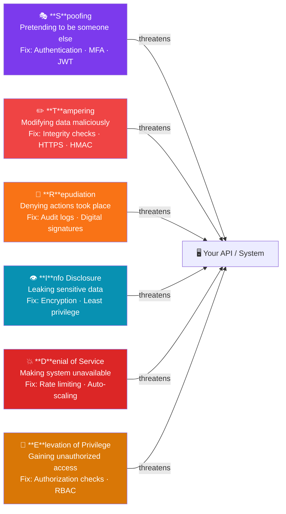

# Secure Coding & API Security: The Security Mental Model

Welcome to Phase 1 of the Secure Coding & API Security tutorial. In this section, we will establish a foundational "security mental model." Before writing a single line of code, developers must understand how attackers think, how systems are modeled for threats, and what the most critical vulnerabilities are today.

## 1. Threat Modeling with STRIDE

**Threat modeling** is the process of identifying potential threats to an application or system and prioritizing mitigations. The most widely adopted framework for this is **STRIDE**, created by Microsoft.

STRIDE is an acronym representing six categories of threats:



| Threat | Definition | Security Property Violated | Example Attack |
| :--- | :--- | :--- | :--- |
| **S**poofing | Pretending to be someone or something else. | Authentication | Session hijacking, credential stuffing. |
| **T**ampering | Modifying data maliciously. | Integrity | Altering data in transit, modifying a database record without authorization. |
| **R**epudiation | Claiming you didn't do something, and the system cannot prove otherwise. | Non-repudiation | Deleting audit logs, lacking transaction history. |
| **I**nformation Disclosure | Exposing information to unauthorized individuals. | Confidentiality | Data breaches, exposing API keys in source code. |
| **D**enial of Service | Making a system unavailable to legitimate users. | Availability | DDoS attacks, exploiting resource exhaustion bugs. |
| **E**levation of Privilege | Gaining capabilities without proper authorization. | Authorization | A standard user accessing an admin endpoint. |

**Mental Model Takeaway:** Whenever you design a new feature, ask yourself: *How could someone spoof this? How could they tamper with the data? Are we logging the action? Could this leak data? Can it be DDoSed? Can a user escalate privileges?*

## 2. The OWASP API Security Top 10

The Open Web Application Security Project (OWASP) maintains a list of the top 10 most critical security risks specifically for APIs. While the list updates periodically, the core themes remain consistent.

The most critical API vulnerabilities include:
1. **Broken Object Level Authorization (BOLA / IDOR)**
2. **Broken Authentication**
3. **Broken Object Property Level Authorization (Mass Assignment / Excessive Data Exposure)**
4. **Unrestricted Resource Consumption (DoS / Lack of Rate Limiting)**
5. **Broken Function Level Authorization**
6. **Unrestricted Access to Sensitive Business Flows**
7. **Server-Side Request Forgery (SSRF)**
8. **Security Misconfiguration**
9. **Improper Inventory Management**
10. **Unsafe Consumption of APIs**

Let's dive deeper into the most prevalent and dangerous attack vectors from this list.

## 3. Deep Dive: Common Attack Vectors

### A. Broken Object Level Authorization (BOLA) / IDOR

**Insecure Direct Object Reference (IDOR)**, known in the API context as **BOLA**, occurs when an application provides direct access to objects based on user-supplied input without verifying if the user has permission to access that specific object.

**The Scenario:**
A user logs into a banking app and fetches their account details using an API endpoint:
`GET /api/v1/accounts/12345`

**The Attack:**
An attacker simply changes the ID in the request:
`GET /api/v1/accounts/12346`

If the backend does not verify that the currently authenticated user *owns* account `12346`, it will return the victim's data.

**The Fix:**
Always check ownership/permissions at the object level, typically by comparing the requested resource ID against the authenticated user's session data.

```javascript
// Vulnerable Code
app.get('/api/accounts/:id', async (req, res) => {
  const account = await db.Account.findById(req.params.id);
  res.json(account); // No check if req.user owns this account!
});

// Secure Code
app.get('/api/accounts/:id', async (req, res) => {
  const account = await db.Account.findById(req.params.id);
  
  // Verify ownership
  if (account.userId !== req.user.id) {
    return res.status(403).json({ error: "Forbidden" });
  }
  
  res.json(account);
});
```

### B. Broken Authentication

Authentication mechanisms are often implemented incorrectly, allowing attackers to compromise passwords, keys, or session tokens to assume other users' identities temporarily or permanently.

**Common Causes:**
* Lack of rate-limiting on login endpoints (allowing brute-force/credential stuffing).
* Weak password policies.
* Insecure session IDs (predictable or not invalidated on logout).
* Putting session IDs or JWTs in the URL instead of secure headers.

**Mental Model Takeaway:** Never roll your own crypto or authentication. Use established libraries (like Passport.js, NextAuth, or managed services like Auth0/Cognito) and always enforce rate limiting on sensitive routes.

### C. Injection (SQL, NoSQL, Command)

Injection flaws occur when untrusted data is sent to an interpreter as part of a command or query. The attacker's hostile data can trick the interpreter into executing unintended commands or accessing data without proper authorization.

**The Scenario (SQLi):**
An API searches for users by username.

```javascript
// Vulnerable Code
const query = `SELECT * FROM users WHERE username = '${req.query.username}'`;
db.execute(query);
```

**The Attack:**
The attacker passes `' OR '1'='1` as the username. The query becomes:
`SELECT * FROM users WHERE username = '' OR '1'='1'`
This bypasses the intended logic and returns all users.

**The Fix:**
Always use **Parameterized Queries (Prepared Statements)** or an ORM/Query Builder.

```javascript
// Secure Code
const query = `SELECT * FROM users WHERE username = ?`;
db.execute(query, [req.query.username]);
```

### D. Server-Side Request Forgery (SSRF)

SSRF flaws occur whenever a web application is fetching a remote resource without validating the user-supplied URL. It allows an attacker to coerce the application to send a crafted request to an unexpected destination, often bypassing firewalls.

**The Scenario:**
An API allows users to provide a URL for a profile picture, which the server downloads and resizes.

```javascript
// Vulnerable Code
app.post('/api/profile/picture', async (req, res) => {
  const { imageUrl } = req.body;
  // The server blindly fetches whatever URL the user provides
  const response = await fetch(imageUrl);
  // ... process image ...
});
```

**The Attack:**
An attacker provides an internal network URL: `http://169.254.169.254/latest/meta-data/` (the AWS metadata endpoint). The server fetches it and potentially leaks the cloud provider credentials back to the attacker.

**The Fix:**
* Validate and sanitize all input URLs.
* Implement an allowlist of permitted domains.
* Block requests to private IP ranges (e.g., `127.0.0.1`, `10.0.0.0/8`, `169.254.169.254`).
* Use a dedicated network proxy with strict egress rules for outbound requests.

## Summary

A strong security mental model requires defensive pessimism. Assume all input is malicious until proven otherwise. By applying the STRIDE framework during design and rigorously defending against the OWASP Top 10 API vulnerabilities (especially IDOR/BOLA, Broken Auth, Injection, and SSRF), you can build robust and secure APIs from the ground up.
