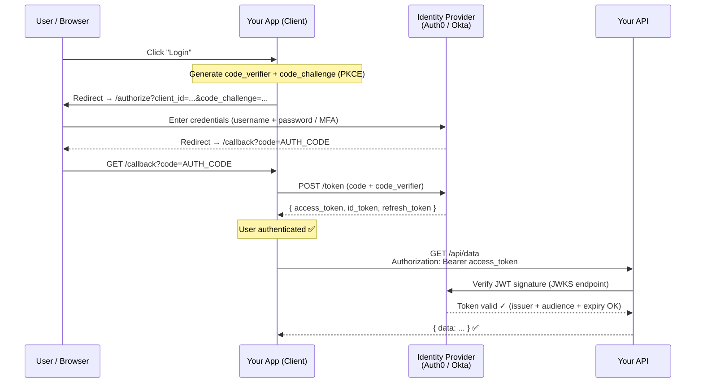
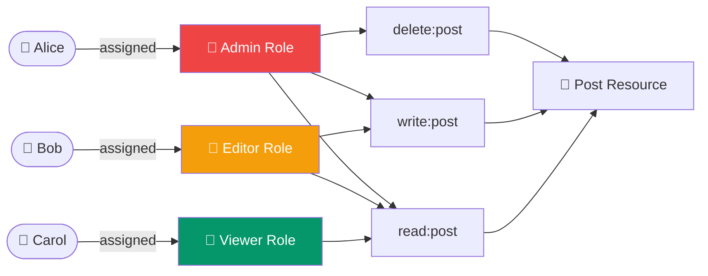
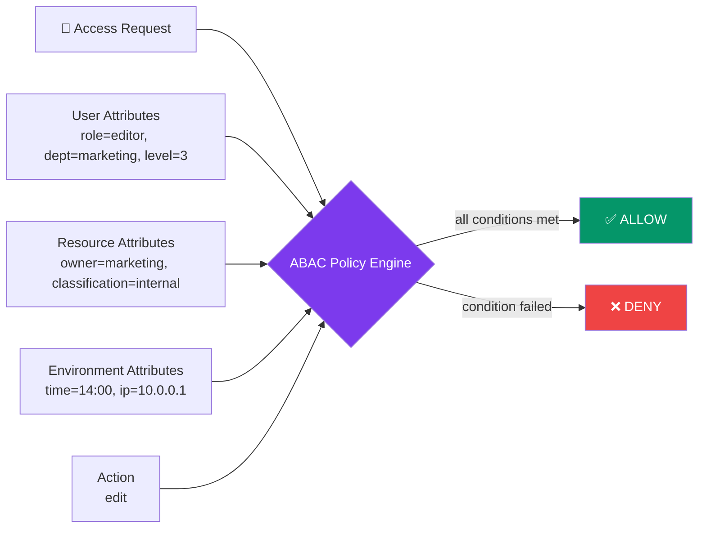

# Phase 2: Secure Coding & API Security - Authentication & Authorization

Welcome to Phase 2 of the Secure Coding & API Security tutorial. In this section, we will dive deep into identity management, access control mechanisms, and the industry standards used to protect modern APIs.

## 1. The Golden Rule: Never Roll Your Own Crypto (or Auth)

A fundamental principle in modern software engineering is: **Do not build your own authentication system from scratch.** 

### Why You Should Avoid Custom Auth:
* **Cryptography is Hard:** Securely hashing and storing passwords (using Argon2, bcrypt, or PBKDF2), preventing timing attacks, and managing salt generation are extremely complex and error-prone.
* **Edge Cases:** Implementing secure password resets, account lockouts, multi-factor authentication (MFA), and session invalidation involves numerous edge cases that are easy to get wrong.
* **Maintenance Burden:** Security standards evolve rapidly. Maintaining a custom auth system means you are responsible for patching every new vulnerability discovered.
* **Compliance:** Frameworks like SOC2, HIPAA, and GDPR often require strict audit logs, encryption standards, and access controls that are difficult to implement correctly in-house.

**The Solution:** Use established, battle-tested Identity Providers (IdPs) like Auth0, Okta, Firebase Auth, Keycloak (open-source), or AWS Cognito.

---

## 2. OAuth 2.0 & OpenID Connect (OIDC)

Modern applications rely on standard protocols to handle delegated access and identity verification.

### What is the Difference?
* **OAuth 2.0:** An **Authorization** framework. It allows an application to access resources on behalf of a user (e.g., "Allow this app to read my Google Contacts"). It does *not* provide identity information about the user.
* **OpenID Connect (OIDC):** An **Authentication** layer built on top of OAuth 2.0. It allows clients to verify the identity of the end-user based on the authentication performed by an Authorization Server.

### Core Token Types

| Token Type | Purpose | Format |
| :--- | :--- | :--- |
| **Access Token** | Grants the bearer access to specific APIs/resources. | Often a JWT (JSON Web Token) or an Opaque String. |
| **ID Token** | Provides identity information about the authenticated user (name, email, etc.). | Always a JWT. Intended to be read by the client. |
| **Refresh Token** | Used to obtain a new Access Token when the current one expires without requiring the user to log in again. | Opaque string. Highly sensitive and long-lived. |

### Common OAuth 2.0 Flows (Grant Types)

1. **Authorization Code Flow (with PKCE):** The standard for web apps, Single Page Applications (SPAs), and mobile apps. It uses a short-lived authorization code that is exchanged for tokens securely, preventing interception attacks (thanks to PKCE - Proof Key for Code Exchange).
2. **Client Credentials Flow:** Used for machine-to-machine (M2M) communication where there is no user involved (e.g., a backend service calling another backend service). The client authenticates using its own ID and secret.
3. *Implicit Flow & Resource Owner Password Credentials (ROPC):* **Deprecated and insecure.** Do not use these in modern applications.

#### Authorization Code Flow with PKCE (Step-by-Step)



### Scopes
Scopes are used to specify exactly what access privileges are being requested. For example, `read:users` or `write:orders`. They limit the blast radius if an access token is compromised.

---

## 3. Access Control: RBAC vs. ABAC

Once a user is authenticated, the API must determine if they are **authorized** to perform a specific action.

### Role-Based Access Control (RBAC)
Access is granted based on the user's role within the organization.
* **How it works:** A user is assigned a role (e.g., `Admin`, `Editor`, `Viewer`). Roles are mapped to permissions (e.g., `Admin` can `delete:post`).
* **Pros:** Simple to implement, easy to understand, fits most standard business applications.
* **Cons:** Can lead to "role explosion" as rules become more complex (e.g., `Admin_US`, `Admin_EU`, `Editor_US`).



### Attribute-Based Access Control (ABAC)
Access is granted based on attributes (characteristics) of the user, the resource, the action, and the environment.
* **How it works:** Policies evaluate attributes dynamically. (e.g., "Allow action `Edit` if `User.Department == Resource.Department` AND `Time >= 9AM` AND `Time <= 5PM`").
* **Pros:** Extremely granular and flexible. Can handle complex business rules without creating new roles.
* **Cons:** Complex to design, implement, and audit. Can introduce performance overhead.



---

## 4. Practical Example: Securing an Express API with OAuth 2.0 + JWT

Here is a practical example of how to secure a Node.js Express API using standard JWT access tokens issued by an external IdP (like Auth0).

### Step 1: Install Dependencies
```bash
npm install express express-oauth2-jwt-bearer
```

### Step 2: Implement the Authorization Middleware

We use the `express-oauth2-jwt-bearer` library. It automatically fetches the public keys (JWKS) from your IdP to cryptographically verify that the JWT signature is valid, unexpired, and issued by the trusted authority.

```javascript
// server.js
const express = require('express');
const { auth, requiredScopes } = require('express-oauth2-jwt-bearer');

const app = express();
app.use(express.json());

// 1. JWT Validation Middleware
// This checks that the token is signed correctly by your IdP and isn't expired.
const checkJwt = auth({
  audience: 'https://api.mycoolapp.com', // The API identifier in your IdP
  issuerBaseURL: 'https://my-tenant.us.auth0.com/', // Your IdP URL
  tokenSigningAlg: 'RS256'
});

// 2. Apply globally or to specific routes
// Any request to /api/private must have a valid Bearer token
app.get('/api/private', checkJwt, (req, res) => {
  // req.auth contains the decoded token payload
  res.json({
    message: 'Hello, Authenticated User!',
    userId: req.auth.payload.sub 
  });
});

// 3. RBAC / Scopes Middleware
// Ensure the token has the specific 'read:admin_data' scope
const checkScopes = requiredScopes('read:admin_data');

app.get('/api/admin', checkJwt, checkScopes, (req, res) => {
  res.json({
    message: 'Hello, Admin! You have the required scopes.'
  });
});

// 4. Error Handling for Auth Failures
app.use((err, req, res, next) => {
  if (err.name === 'UnauthorizedError') {
    return res.status(401).json({ error: 'Invalid or missing token' });
  }
  if (err.name === 'InsufficientScopeError') {
    return res.status(403).json({ error: 'Insufficient permissions' });
  }
  next(err);
});

const PORT = process.env.PORT || 3000;
app.listen(PORT, () => console.log(`Secure API running on port ${PORT}`));
```

### Best Practices Reflected Here:
1. **RS256 Asymmetric Signing:** The IdP signs the JWT with a private key, and our API verifies it with a public key downloaded from the IdP's JWKS endpoint. We don't share secrets between the IdP and the API.
2. **Audience (`aud`) Verification:** We ensure the token was minted specifically for *this* API, preventing token reuse across different services.
3. **Issuer (`iss`) Verification:** We ensure the token came from our trusted IdP.
4. **Scope Checking:** We enforce granular authorization at the route level.

## Summary

In Phase 2, we covered why custom authentication is a security anti-pattern and how adopting standard protocols like OAuth 2.0 and OpenID Connect simplifies and secures identity management. We contrasted Role-Based Access Control (RBAC) with Attribute-Based Access Control (ABAC), and implemented a robust, standard-compliant JWT validation layer in an Express API.
