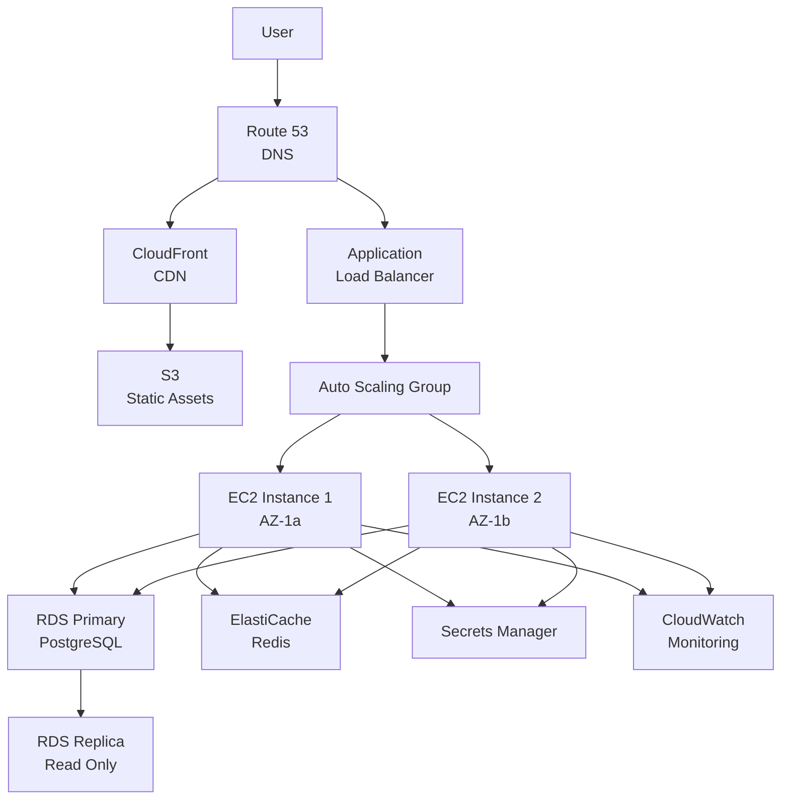
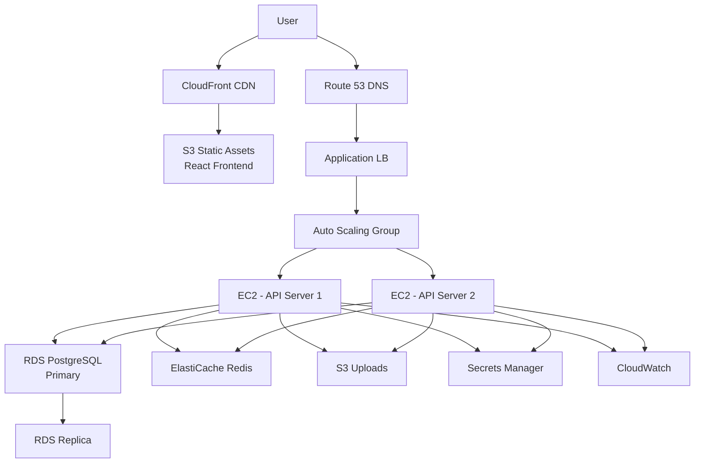

# AWS Deployment Guide

Complete guide to deploying applications on Amazon Web Services with best practices, security, and cost optimization.

## What You'll Learn

- Deploy applications on EC2 with Load Balancers and Auto Scaling
- Use ECS/Fargate for containerized applications
- Deploy serverless applications with Lambda
- Set up RDS PostgreSQL with backups and replicas
- Configure ElastiCache for Redis/Memcached
- Use S3 and CloudFront for static assets
- Manage DNS with Route 53
- Secure secrets with Secrets Manager
- Monitor with CloudWatch
- Optimize costs
- Deploy a complete full-stack application

## AWS Architecture Overview



## 1. EC2 Deployment with Load Balancing

### 1.1 Launch an EC2 Instance

**Using AWS Console:**

1. Navigate to EC2 Dashboard
2. Click "Launch Instance"
3. Choose Amazon Linux 2023 AMI
4. Select instance type (t3.micro for free tier)
5. Configure instance details
6. Add storage (8GB minimum)
7. Add tags: `Name: MyApp-Server`
8. Configure Security Group (allow HTTP, HTTPS, SSH)
9. Launch with key pair

**Using AWS CLI:**

```bash
# Create key pair
aws ec2 create-key-pair \
  --key-name myapp-key \
  --query 'KeyMaterial' \
  --output text > myapp-key.pem

chmod 400 myapp-key.pem

# Create security group
aws ec2 create-security-group \
  --group-name myapp-sg \
  --description "Security group for MyApp"

# Allow SSH, HTTP, HTTPS
aws ec2 authorize-security-group-ingress \
  --group-name myapp-sg \
  --protocol tcp \
  --port 22 \
  --cidr 0.0.0.0/0

aws ec2 authorize-security-group-ingress \
  --group-name myapp-sg \
  --protocol tcp \
  --port 80 \
  --cidr 0.0.0.0/0

aws ec2 authorize-security-group-ingress \
  --group-name myapp-sg \
  --protocol tcp \
  --port 443 \
  --cidr 0.0.0.0/0

# Launch instance
aws ec2 run-instances \
  --image-id ami-0c55b159cbfafe1f0 \
  --count 1 \
  --instance-type t3.micro \
  --key-name myapp-key \
  --security-groups myapp-sg \
  --tag-specifications 'ResourceType=instance,Tags=[{Key=Name,Value=MyApp-Server}]'
```

### 1.2 Deploy Application on EC2

**Connect to EC2:**

```bash
ssh -i myapp-key.pem ec2-user@<EC2-PUBLIC-IP>
```

**Install Node.js:**

```bash
# Update system
sudo yum update -y

# Install Node.js 20
curl -fsSL https://rpm.nodesource.com/setup_20.x | sudo bash -
sudo yum install -y nodejs

# Verify installation
node --version
npm --version
```

**Deploy Node.js Application:**

```bash
# Clone your application
git clone https://github.com/yourusername/yourapp.git
cd yourapp

# Install dependencies
npm install

# Install PM2 for process management
sudo npm install -g pm2

# Start application with PM2
pm2 start server.js --name myapp

# Configure PM2 to start on boot
pm2 startup
pm2 save

# Check status
pm2 status
```

**Install Nginx as Reverse Proxy:**

```bash
# Install Nginx
sudo yum install -y nginx

# Configure Nginx
sudo nano /etc/nginx/conf.d/myapp.conf
```

**Nginx Configuration (`/etc/nginx/conf.d/myapp.conf`):**

```nginx
server {
    listen 80;
    server_name example.com www.example.com;

    location / {
        proxy_pass http://localhost:3000;
        proxy_http_version 1.1;
        proxy_set_header Upgrade $http_upgrade;
        proxy_set_header Connection 'upgrade';
        proxy_set_header Host $host;
        proxy_set_header X-Real-IP $remote_addr;
        proxy_set_header X-Forwarded-For $proxy_add_x_forwarded_for;
        proxy_set_header X-Forwarded-Proto $scheme;
        proxy_cache_bypass $http_upgrade;
    }
}
```

```bash
# Start Nginx
sudo systemctl start nginx
sudo systemctl enable nginx

# Test Nginx configuration
sudo nginx -t
```

### 1.3 Application Load Balancer (ALB)

**Create Target Group:**

```bash
# Create target group
aws elbv2 create-target-group \
  --name myapp-targets \
  --protocol HTTP \
  --port 80 \
  --vpc-id vpc-xxxxxxxx \
  --health-check-path /health \
  --health-check-interval-seconds 30 \
  --health-check-timeout-seconds 5 \
  --healthy-threshold-count 2 \
  --unhealthy-threshold-count 3

# Register EC2 instance
aws elbv2 register-targets \
  --target-group-arn <TARGET-GROUP-ARN> \
  --targets Id=<INSTANCE-ID>
```

**Create Application Load Balancer:**

```bash
# Create ALB
aws elbv2 create-load-balancer \
  --name myapp-alb \
  --subnets subnet-xxxxxxxx subnet-yyyyyyyy \
  --security-groups sg-xxxxxxxx \
  --scheme internet-facing \
  --type application

# Create listener
aws elbv2 create-listener \
  --load-balancer-arn <ALB-ARN> \
  --protocol HTTP \
  --port 80 \
  --default-actions Type=forward,TargetGroupArn=<TARGET-GROUP-ARN>
```

### 1.4 Auto Scaling Group

**Create Launch Template:**

```bash
# Create launch template
aws ec2 create-launch-template \
  --launch-template-name myapp-template \
  --version-description "MyApp v1.0" \
  --launch-template-data '{
    "ImageId": "ami-0c55b159cbfafe1f0",
    "InstanceType": "t3.micro",
    "KeyName": "myapp-key",
    "SecurityGroupIds": ["sg-xxxxxxxx"],
    "UserData": "IyEvYmluL2Jhc2gKZWNobyAnSGVsbG8gV29ybGQn",
    "TagSpecifications": [{
      "ResourceType": "instance",
      "Tags": [{"Key": "Name", "Value": "MyApp-AutoScaled"}]
    }]
  }'
```

**User Data Script for Auto Scaling:**

```bash
#!/bin/bash
# Update system
yum update -y

# Install Node.js
curl -fsSL https://rpm.nodesource.com/setup_20.x | bash -
yum install -y nodejs git

# Clone and deploy application
cd /home/ec2-user
git clone https://github.com/yourusername/yourapp.git
cd yourapp
npm install

# Install and configure PM2
npm install -g pm2
pm2 start server.js --name myapp
pm2 startup
pm2 save

# Install and configure Nginx
yum install -y nginx
cat > /etc/nginx/conf.d/myapp.conf <<'EOF'
server {
    listen 80;
    location / {
        proxy_pass http://localhost:3000;
        proxy_set_header Host $host;
        proxy_set_header X-Real-IP $remote_addr;
    }
}
EOF
systemctl start nginx
systemctl enable nginx
```

**Create Auto Scaling Group:**

```bash
# Create auto scaling group
aws autoscaling create-auto-scaling-group \
  --auto-scaling-group-name myapp-asg \
  --launch-template LaunchTemplateName=myapp-template,Version='$Latest' \
  --min-size 2 \
  --max-size 10 \
  --desired-capacity 2 \
  --health-check-type ELB \
  --health-check-grace-period 300 \
  --vpc-zone-identifier "subnet-xxxxxxxx,subnet-yyyyyyyy" \
  --target-group-arns <TARGET-GROUP-ARN>

# Create scaling policies
aws autoscaling put-scaling-policy \
  --auto-scaling-group-name myapp-asg \
  --policy-name scale-up \
  --scaling-adjustment 1 \
  --adjustment-type ChangeInCapacity \
  --cooldown 300

aws autoscaling put-scaling-policy \
  --auto-scaling-group-name myapp-asg \
  --policy-name scale-down \
  --scaling-adjustment -1 \
  --adjustment-type ChangeInCapacity \
  --cooldown 300
```

## 2. ECS/Fargate Deployment

### 2.1 Create Docker Image

**Dockerfile:**

```dockerfile
FROM node:20-alpine

WORKDIR /app

# Copy package files
COPY package*.json ./

# Install dependencies
RUN npm ci --only=production

# Copy application code
COPY . .

# Expose port
EXPOSE 3000

# Health check
HEALTHCHECK --interval=30s --timeout=3s --start-period=40s --retries=3 \
  CMD node -e "require('http').get('http://localhost:3000/health', (r) => {process.exit(r.statusCode === 200 ? 0 : 1)})"

# Start application
CMD ["node", "server.js"]
```

**Build and Push to ECR:**

```bash
# Create ECR repository
aws ecr create-repository --repository-name myapp

# Get login credentials
aws ecr get-login-password --region us-east-1 | \
  docker login --username AWS --password-stdin <ACCOUNT-ID>.dkr.ecr.us-east-1.amazonaws.com

# Build image
docker build -t myapp .

# Tag image
docker tag myapp:latest <ACCOUNT-ID>.dkr.ecr.us-east-1.amazonaws.com/myapp:latest

# Push to ECR
docker push <ACCOUNT-ID>.dkr.ecr.us-east-1.amazonaws.com/myapp:latest
```

### 2.2 Create ECS Cluster

```bash
# Create ECS cluster
aws ecs create-cluster --cluster-name myapp-cluster

# Create task execution role
aws iam create-role \
  --role-name ecsTaskExecutionRole \
  --assume-role-policy-document '{
    "Version": "2012-10-17",
    "Statement": [{
      "Effect": "Allow",
      "Principal": {"Service": "ecs-tasks.amazonaws.com"},
      "Action": "sts:AssumeRole"
    }]
  }'

# Attach policies
aws iam attach-role-policy \
  --role-name ecsTaskExecutionRole \
  --policy-arn arn:aws:iam::aws:policy/service-role/AmazonECSTaskExecutionRolePolicy
```

### 2.3 Create Task Definition

**task-definition.json:**

```json
{
  "family": "myapp-task",
  "networkMode": "awsvpc",
  "requiresCompatibilities": ["FARGATE"],
  "cpu": "256",
  "memory": "512",
  "executionRoleArn": "arn:aws:iam::<ACCOUNT-ID>:role/ecsTaskExecutionRole",
  "containerDefinitions": [
    {
      "name": "myapp-container",
      "image": "<ACCOUNT-ID>.dkr.ecr.us-east-1.amazonaws.com/myapp:latest",
      "portMappings": [
        {
          "containerPort": 3000,
          "protocol": "tcp"
        }
      ],
      "essential": true,
      "environment": [
        {
          "name": "NODE_ENV",
          "value": "production"
        },
        {
          "name": "PORT",
          "value": "3000"
        }
      ],
      "secrets": [
        {
          "name": "DATABASE_URL",
          "valueFrom": "arn:aws:secretsmanager:us-east-1:<ACCOUNT-ID>:secret:myapp/database-url"
        }
      ],
      "logConfiguration": {
        "logDriver": "awslogs",
        "options": {
          "awslogs-group": "/ecs/myapp",
          "awslogs-region": "us-east-1",
          "awslogs-stream-prefix": "ecs"
        }
      },
      "healthCheck": {
        "command": ["CMD-SHELL", "wget --no-verbose --tries=1 --spider http://localhost:3000/health || exit 1"],
        "interval": 30,
        "timeout": 5,
        "retries": 3,
        "startPeriod": 60
      }
    }
  ]
}
```

```bash
# Register task definition
aws ecs register-task-definition --cli-input-json file://task-definition.json
```

### 2.4 Create ECS Service

```bash
# Create service
aws ecs create-service \
  --cluster myapp-cluster \
  --service-name myapp-service \
  --task-definition myapp-task \
  --desired-count 2 \
  --launch-type FARGATE \
  --network-configuration "awsvpcConfiguration={
    subnets=[subnet-xxxxxxxx,subnet-yyyyyyyy],
    securityGroups=[sg-xxxxxxxx],
    assignPublicIp=ENABLED
  }" \
  --load-balancers "targetGroupArn=<TARGET-GROUP-ARN>,containerName=myapp-container,containerPort=3000" \
  --health-check-grace-period-seconds 60

# Enable auto scaling
aws application-autoscaling register-scalable-target \
  --service-namespace ecs \
  --resource-id service/myapp-cluster/myapp-service \
  --scalable-dimension ecs:service:DesiredCount \
  --min-capacity 2 \
  --max-capacity 10

# Create scaling policy
aws application-autoscaling put-scaling-policy \
  --policy-name cpu-scaling \
  --service-namespace ecs \
  --resource-id service/myapp-cluster/myapp-service \
  --scalable-dimension ecs:service:DesiredCount \
  --policy-type TargetTrackingScaling \
  --target-tracking-scaling-policy-configuration '{
    "TargetValue": 70.0,
    "PredefinedMetricSpecification": {
      "PredefinedMetricType": "ECSServiceAverageCPUUtilization"
    },
    "ScaleInCooldown": 60,
    "ScaleOutCooldown": 60
  }'
```

## 3. Lambda Serverless Deployment

### 3.1 Lambda Function for API

**handler.js (Express with Serverless):**

```javascript
const serverless = require('serverless-http');
const express = require('express');
const app = express();

app.use(express.json());

app.get('/health', (req, res) => {
  res.json({ status: 'healthy' });
});

app.get('/api/users', async (req, res) => {
  // Your logic here
  res.json({ users: [] });
});

app.post('/api/users', async (req, res) => {
  // Your logic here
  res.json({ created: true });
});

// Export handler
module.exports.handler = serverless(app);
```

**package.json:**

```json
{
  "name": "myapp-lambda",
  "version": "1.0.0",
  "dependencies": {
    "express": "^4.18.2",
    "serverless-http": "^3.2.0"
  }
}
```

### 3.2 Deploy Lambda Function

```bash
# Install dependencies
npm install

# Create deployment package
zip -r function.zip .

# Create Lambda function
aws lambda create-function \
  --function-name myapp-api \
  --runtime nodejs20.x \
  --role arn:aws:iam::<ACCOUNT-ID>:role/lambda-execution-role \
  --handler handler.handler \
  --zip-file fileb://function.zip \
  --timeout 30 \
  --memory-size 256 \
  --environment Variables={NODE_ENV=production}

# Update function code
aws lambda update-function-code \
  --function-name myapp-api \
  --zip-file fileb://function.zip
```

### 3.3 API Gateway Integration

```bash
# Create REST API
aws apigateway create-rest-api \
  --name myapp-api \
  --description "MyApp API Gateway"

# Get root resource ID
aws apigateway get-resources --rest-api-id <API-ID>

# Create resource
aws apigateway create-resource \
  --rest-api-id <API-ID> \
  --parent-id <ROOT-RESOURCE-ID> \
  --path-part "{proxy+}"

# Create method
aws apigateway put-method \
  --rest-api-id <API-ID> \
  --resource-id <RESOURCE-ID> \
  --http-method ANY \
  --authorization-type NONE

# Set up Lambda integration
aws apigateway put-integration \
  --rest-api-id <API-ID> \
  --resource-id <RESOURCE-ID> \
  --http-method ANY \
  --type AWS_PROXY \
  --integration-http-method POST \
  --uri arn:aws:apigateway:us-east-1:lambda:path/2015-03-31/functions/arn:aws:lambda:us-east-1:<ACCOUNT-ID>:function:myapp-api/invocations

# Deploy API
aws apigateway create-deployment \
  --rest-api-id <API-ID> \
  --stage-name prod
```

## 4. RDS PostgreSQL Setup

### 4.1 Create RDS Instance

```bash
# Create DB subnet group
aws rds create-db-subnet-group \
  --db-subnet-group-name myapp-db-subnet \
  --db-subnet-group-description "MyApp DB Subnet Group" \
  --subnet-ids subnet-xxxxxxxx subnet-yyyyyyyy

# Create security group for RDS
aws ec2 create-security-group \
  --group-name myapp-db-sg \
  --description "Security group for RDS"

# Allow PostgreSQL from application security group
aws ec2 authorize-security-group-ingress \
  --group-name myapp-db-sg \
  --protocol tcp \
  --port 5432 \
  --source-group myapp-sg

# Create RDS instance
aws rds create-db-instance \
  --db-instance-identifier myapp-db \
  --db-instance-class db.t3.micro \
  --engine postgres \
  --engine-version 15.4 \
  --master-username dbadmin \
  --master-user-password YourSecurePassword123! \
  --allocated-storage 20 \
  --storage-type gp3 \
  --storage-encrypted \
  --vpc-security-group-ids sg-xxxxxxxx \
  --db-subnet-group-name myapp-db-subnet \
  --backup-retention-period 7 \
  --preferred-backup-window "03:00-04:00" \
  --preferred-maintenance-window "mon:04:00-mon:05:00" \
  --multi-az \
  --publicly-accessible false \
  --enable-cloudwatch-logs-exports '["postgresql"]' \
  --deletion-protection
```

### 4.2 Create Read Replica

```bash
# Create read replica
aws rds create-db-instance-read-replica \
  --db-instance-identifier myapp-db-replica \
  --source-db-instance-identifier myapp-db \
  --db-instance-class db.t3.micro \
  --publicly-accessible false \
  --availability-zone us-east-1b
```

### 4.3 Database Connection

**Node.js Connection:**

```javascript
const { Pool } = require('pg');
const AWS = require('aws-sdk');

// Get database credentials from Secrets Manager
async function getDatabaseCredentials() {
  const secretsManager = new AWS.SecretsManager();
  const secret = await secretsManager.getSecretValue({
    SecretId: 'myapp/database'
  }).promise();
  
  return JSON.parse(secret.SecretString);
}

// Create connection pool
async function createPool() {
  const credentials = await getDatabaseCredentials();
  
  return new Pool({
    host: credentials.host,
    port: 5432,
    database: credentials.database,
    user: credentials.username,
    password: credentials.password,
    ssl: {
      rejectUnauthorized: true,
      ca: credentials.ca_cert
    },
    max: 20,
    idleTimeoutMillis: 30000,
    connectionTimeoutMillis: 2000,
  });
}

// Read/Write pool (primary)
const writePool = createPool();

// Read-only pool (replica)
const readPool = new Pool({
  // Use read replica endpoint
  host: 'myapp-db-replica.xxxxxxxx.us-east-1.rds.amazonaws.com',
  // ... other config
});

module.exports = { writePool, readPool };
```

### 4.4 Automated Backups

```bash
# Modify backup settings
aws rds modify-db-instance \
  --db-instance-identifier myapp-db \
  --backup-retention-period 14 \
  --preferred-backup-window "03:00-04:00"

# Create manual snapshot
aws rds create-db-snapshot \
  --db-instance-identifier myapp-db \
  --db-snapshot-identifier myapp-db-snapshot-$(date +%Y%m%d)

# Copy snapshot to another region (disaster recovery)
aws rds copy-db-snapshot \
  --source-db-snapshot-identifier arn:aws:rds:us-east-1:<ACCOUNT-ID>:snapshot:myapp-db-snapshot \
  --target-db-snapshot-identifier myapp-db-snapshot-dr \
  --region us-west-2
```

## 5. ElastiCache Setup

### 5.1 Create Redis Cluster

```bash
# Create cache subnet group
aws elasticache create-cache-subnet-group \
  --cache-subnet-group-name myapp-cache-subnet \
  --cache-subnet-group-description "MyApp Cache Subnet Group" \
  --subnet-ids subnet-xxxxxxxx subnet-yyyyyyyy

# Create Redis cluster
aws elasticache create-replication-group \
  --replication-group-id myapp-redis \
  --replication-group-description "MyApp Redis Cluster" \
  --engine redis \
  --engine-version 7.0 \
  --cache-node-type cache.t3.micro \
  --num-cache-clusters 2 \
  --automatic-failover-enabled \
  --cache-subnet-group-name myapp-cache-subnet \
  --security-group-ids sg-xxxxxxxx \
  --at-rest-encryption-enabled \
  --transit-encryption-enabled \
  --snapshot-retention-limit 5 \
  --snapshot-window "03:00-05:00"
```

### 5.2 Redis Connection

**Node.js Redis Client:**

```javascript
const Redis = require('ioredis');
const AWS = require('aws-sdk');

async function createRedisClient() {
  // Get Redis password from Secrets Manager
  const secretsManager = new AWS.SecretsManager();
  const secret = await secretsManager.getSecretValue({
    SecretId: 'myapp/redis'
  }).promise();
  
  const { password } = JSON.parse(secret.SecretString);
  
  const redis = new Redis({
    host: 'myapp-redis.xxxxxx.use1.cache.amazonaws.com',
    port: 6379,
    password: password,
    tls: {},
    retryStrategy: (times) => {
      const delay = Math.min(times * 50, 2000);
      return delay;
    },
    maxRetriesPerRequest: 3,
  });
  
  redis.on('error', (err) => {
    console.error('Redis error:', err);
  });
  
  redis.on('connect', () => {
    console.log('Connected to Redis');
  });
  
  return redis;
}

// Usage example
async function cacheMiddleware(req, res, next) {
  const redis = await createRedisClient();
  const key = `cache:${req.originalUrl}`;
  
  try {
    const cached = await redis.get(key);
    if (cached) {
      return res.json(JSON.parse(cached));
    }
    
    // Store original send
    const originalSend = res.json.bind(res);
    res.json = (data) => {
      // Cache for 5 minutes
      redis.setex(key, 300, JSON.stringify(data));
      return originalSend(data);
    };
    
    next();
  } catch (error) {
    console.error('Cache error:', error);
    next();
  }
}

module.exports = { createRedisClient, cacheMiddleware };
```

## 6. S3 and CloudFront

### 6.1 Create S3 Bucket

```bash
# Create S3 bucket
aws s3 mb s3://myapp-static-assets

# Enable versioning
aws s3api put-bucket-versioning \
  --bucket myapp-static-assets \
  --versioning-configuration Status=Enabled

# Enable server-side encryption
aws s3api put-bucket-encryption \
  --bucket myapp-static-assets \
  --server-side-encryption-configuration '{
    "Rules": [{
      "ApplyServerSideEncryptionByDefault": {
        "SSEAlgorithm": "AES256"
      }
    }]
  }'

# Block public access (CloudFront will access via OAI)
aws s3api put-public-access-block \
  --bucket myapp-static-assets \
  --public-access-block-configuration \
    BlockPublicAcls=true,IgnorePublicAcls=true,BlockPublicPolicy=true,RestrictPublicBuckets=true

# Upload static files
aws s3 sync ./dist s3://myapp-static-assets/ \
  --cache-control "max-age=31536000, immutable" \
  --exclude "*.html" \
  --exclude "*.json"

# Upload HTML with shorter cache
aws s3 sync ./dist s3://myapp-static-assets/ \
  --cache-control "max-age=300, must-revalidate" \
  --exclude "*" \
  --include "*.html"
```

### 6.2 Create CloudFront Distribution

```bash
# Create Origin Access Identity
aws cloudfront create-cloud-front-origin-access-identity \
  --cloud-front-origin-access-identity-config \
    CallerReference=$(date +%s),Comment="MyApp OAI"

# Update S3 bucket policy
aws s3api put-bucket-policy \
  --bucket myapp-static-assets \
  --policy '{
    "Version": "2012-10-17",
    "Statement": [{
      "Sid": "CloudFrontOAI",
      "Effect": "Allow",
      "Principal": {
        "AWS": "arn:aws:iam::cloudfront:user/CloudFront Origin Access Identity <OAI-ID>"
      },
      "Action": "s3:GetObject",
      "Resource": "arn:aws:s3:::myapp-static-assets/*"
    }]
  }'
```

**CloudFront Distribution Config (distribution-config.json):**

```json
{
  "CallerReference": "myapp-cf-2026",
  "Aliases": {
    "Quantity": 1,
    "Items": ["cdn.example.com"]
  },
  "DefaultRootObject": "index.html",
  "Origins": {
    "Quantity": 1,
    "Items": [{
      "Id": "S3-myapp-static-assets",
      "DomainName": "myapp-static-assets.s3.amazonaws.com",
      "S3OriginConfig": {
        "OriginAccessIdentity": "origin-access-identity/cloudfront/<OAI-ID>"
      }
    }]
  },
  "DefaultCacheBehavior": {
    "TargetOriginId": "S3-myapp-static-assets",
    "ViewerProtocolPolicy": "redirect-to-https",
    "AllowedMethods": {
      "Quantity": 2,
      "Items": ["GET", "HEAD"],
      "CachedMethods": {
        "Quantity": 2,
        "Items": ["GET", "HEAD"]
      }
    },
    "Compress": true,
    "MinTTL": 0,
    "DefaultTTL": 86400,
    "MaxTTL": 31536000,
    "ForwardedValues": {
      "QueryString": false,
      "Cookies": {"Forward": "none"}
    }
  },
  "CustomErrorResponses": {
    "Quantity": 1,
    "Items": [{
      "ErrorCode": 404,
      "ResponsePagePath": "/index.html",
      "ResponseCode": "200",
      "ErrorCachingMinTTL": 300
    }]
  },
  "Comment": "MyApp Static Assets CDN",
  "Enabled": true,
  "ViewerCertificate": {
    "ACMCertificateArn": "arn:aws:acm:us-east-1:<ACCOUNT-ID>:certificate/xxxxxxxx",
    "SSLSupportMethod": "sni-only",
    "MinimumProtocolVersion": "TLSv1.2_2021"
  },
  "PriceClass": "PriceClass_100"
}
```

```bash
# Create distribution
aws cloudfront create-distribution --distribution-config file://distribution-config.json

# Invalidate cache
aws cloudfront create-invalidation \
  --distribution-id <DISTRIBUTION-ID> \
  --paths "/*"
```

## 7. Route 53 DNS

### 7.1 Create Hosted Zone

```bash
# Create hosted zone
aws route53 create-hosted-zone \
  --name example.com \
  --caller-reference $(date +%s)

# Get nameservers
aws route53 get-hosted-zone --id <HOSTED-ZONE-ID>
```

### 7.2 Create DNS Records

**records.json:**

```json
{
  "Changes": [
    {
      "Action": "CREATE",
      "ResourceRecordSet": {
        "Name": "example.com",
        "Type": "A",
        "AliasTarget": {
          "HostedZoneId": "Z2FDTNDATAQYW2",
          "DNSName": "d111111abcdef8.cloudfront.net",
          "EvaluateTargetHealth": false
        }
      }
    },
    {
      "Action": "CREATE",
      "ResourceRecordSet": {
        "Name": "www.example.com",
        "Type": "CNAME",
        "TTL": 300,
        "ResourceRecords": [{"Value": "example.com"}]
      }
    },
    {
      "Action": "CREATE",
      "ResourceRecordSet": {
        "Name": "api.example.com",
        "Type": "A",
        "AliasTarget": {
          "HostedZoneId": "<ALB-HOSTED-ZONE-ID>",
          "DNSName": "myapp-alb-123456789.us-east-1.elb.amazonaws.com",
          "EvaluateTargetHealth": true
        }
      }
    }
  ]
}
```

```bash
# Create records
aws route53 change-resource-record-sets \
  --hosted-zone-id <HOSTED-ZONE-ID> \
  --change-batch file://records.json
```

## 8. Secrets Manager

### 8.1 Store Secrets

```bash
# Create database secret
aws secretsmanager create-secret \
  --name myapp/database \
  --description "Database credentials" \
  --secret-string '{
    "username": "dbadmin",
    "password": "YourSecurePassword123!",
    "host": "myapp-db.xxxxxxxx.us-east-1.rds.amazonaws.com",
    "database": "myappdb",
    "port": 5432
  }'

# Create API keys
aws secretsmanager create-secret \
  --name myapp/api-keys \
  --secret-string '{
    "stripe_key": "sk_live_xxxxx",
    "jwt_secret": "your-jwt-secret-key"
  }'

# Rotate secret
aws secretsmanager rotate-secret \
  --secret-id myapp/database \
  --rotation-lambda-arn arn:aws:lambda:us-east-1:<ACCOUNT-ID>:function:SecretsManagerRotation
```

### 8.2 Access Secrets in Application

```javascript
const AWS = require('aws-sdk');
const secretsManager = new AWS.SecretsManager();

async function getSecret(secretName) {
  try {
    const data = await secretsManager.getSecretValue({
      SecretId: secretName
    }).promise();
    
    return JSON.parse(data.SecretString);
  } catch (error) {
    console.error(`Error retrieving secret ${secretName}:`, error);
    throw error;
  }
}

// Cache secrets
let cachedSecrets = {};

async function getCachedSecret(secretName, ttl = 3600000) {
  const now = Date.now();
  
  if (cachedSecrets[secretName] && 
      cachedSecrets[secretName].expiry > now) {
    return cachedSecrets[secretName].value;
  }
  
  const secret = await getSecret(secretName);
  cachedSecrets[secretName] = {
    value: secret,
    expiry: now + ttl
  };
  
  return secret;
}

module.exports = { getSecret, getCachedSecret };
```

## 9. CloudWatch Monitoring

### 9.1 Create CloudWatch Alarms

```bash
# CPU utilization alarm
aws cloudwatch put-metric-alarm \
  --alarm-name myapp-high-cpu \
  --alarm-description "Alert when CPU exceeds 80%" \
  --metric-name CPUUtilization \
  --namespace AWS/EC2 \
  --statistic Average \
  --period 300 \
  --threshold 80 \
  --comparison-operator GreaterThanThreshold \
  --evaluation-periods 2 \
  --alarm-actions arn:aws:sns:us-east-1:<ACCOUNT-ID>:myapp-alerts

# Application errors alarm
aws cloudwatch put-metric-alarm \
  --alarm-name myapp-high-errors \
  --metric-name 5XXError \
  --namespace AWS/ApplicationELB \
  --statistic Sum \
  --period 60 \
  --threshold 10 \
  --comparison-operator GreaterThanThreshold \
  --evaluation-periods 1 \
  --alarm-actions arn:aws:sns:us-east-1:<ACCOUNT-ID>:myapp-alerts

# Database connections alarm
aws cloudwatch put-metric-alarm \
  --alarm-name myapp-db-connections \
  --metric-name DatabaseConnections \
  --namespace AWS/RDS \
  --statistic Average \
  --period 300 \
  --threshold 80 \
  --comparison-operator GreaterThanThreshold \
  --evaluation-periods 2 \
  --alarm-actions arn:aws:sns:us-east-1:<ACCOUNT-ID>:myapp-alerts
```

### 9.2 Custom Metrics

```javascript
const AWS = require('aws-sdk');
const cloudwatch = new AWS.CloudWatch();

async function putMetric(metricName, value, unit = 'Count') {
  try {
    await cloudwatch.putMetricData({
      Namespace: 'MyApp',
      MetricData: [{
        MetricName: metricName,
        Value: value,
        Unit: unit,
        Timestamp: new Date(),
        Dimensions: [
          {
            Name: 'Environment',
            Value: process.env.NODE_ENV || 'production'
          }
        ]
      }]
    }).promise();
  } catch (error) {
    console.error('Error putting metric:', error);
  }
}

// Usage examples
app.post('/api/orders', async (req, res) => {
  try {
    const order = await createOrder(req.body);
    
    // Track custom metric
    await putMetric('OrdersCreated', 1);
    await putMetric('OrderValue', order.total, 'None');
    
    res.json(order);
  } catch (error) {
    await putMetric('OrderErrors', 1);
    res.status(500).json({ error: 'Failed to create order' });
  }
});

module.exports = { putMetric };
```

### 9.3 CloudWatch Logs

```javascript
const winston = require('winston');
const WinstonCloudWatch = require('winston-cloudwatch');

const logger = winston.createLogger({
  level: 'info',
  format: winston.format.json(),
  transports: [
    new winston.transports.Console({
      format: winston.format.simple()
    }),
    new WinstonCloudWatch({
      logGroupName: '/myapp/application',
      logStreamName: `${process.env.NODE_ENV}-${new Date().toISOString().split('T')[0]}`,
      awsRegion: 'us-east-1',
      jsonMessage: true
    })
  ]
});

// Usage
logger.info('User logged in', { userId: 123, email: 'user@example.com' });
logger.error('Database connection failed', { error: err.message });

module.exports = logger;
```

## 10. Cost Optimization Strategies

### 10.1 Use Reserved Instances

```bash
# Purchase reserved instance (1-year term, no upfront)
aws ec2 purchase-reserved-instances-offering \
  --reserved-instances-offering-id <OFFERING-ID> \
  --instance-count 2

# Purchase RDS reserved instance
aws rds purchase-reserved-db-instances-offering \
  --reserved-db-instances-offering-id <OFFERING-ID> \
  --db-instance-count 1
```

### 10.2 Use Spot Instances for Auto Scaling

```json
{
  "LaunchTemplateName": "myapp-spot-template",
  "LaunchTemplateData": {
    "ImageId": "ami-0c55b159cbfafe1f0",
    "InstanceType": "t3.micro",
    "InstanceMarketOptions": {
      "MarketType": "spot",
      "SpotOptions": {
        "MaxPrice": "0.0104",
        "SpotInstanceType": "one-time"
      }
    }
  }
}
```

### 10.3 Enable S3 Lifecycle Policies

```json
{
  "Rules": [{
    "Id": "MoveToIA",
    "Status": "Enabled",
    "Transitions": [{
      "Days": 30,
      "StorageClass": "STANDARD_IA"
    }, {
      "Days": 90,
      "StorageClass": "GLACIER"
    }],
    "NoncurrentVersionTransitions": [{
      "NoncurrentDays": 30,
      "StorageClass": "STANDARD_IA"
    }],
    "NoncurrentVersionExpiration": {
      "NoncurrentDays": 90
    }
  }]
}
```

```bash
aws s3api put-bucket-lifecycle-configuration \
  --bucket myapp-static-assets \
  --lifecycle-configuration file://lifecycle.json
```

### 10.4 Cost Monitoring

```bash
# Create budget
aws budgets create-budget \
  --account-id <ACCOUNT-ID> \
  --budget '{
    "BudgetName": "MyApp Monthly Budget",
    "BudgetLimit": {
      "Amount": "100",
      "Unit": "USD"
    },
    "TimeUnit": "MONTHLY",
    "BudgetType": "COST"
  }' \
  --notifications-with-subscribers '[{
    "Notification": {
      "NotificationType": "ACTUAL",
      "ComparisonOperator": "GREATER_THAN",
      "Threshold": 80
    },
    "Subscribers": [{
      "SubscriptionType": "EMAIL",
      "Address": "alerts@example.com"
    }]
  }]'
```

## 11. Security Best Practices

### 11.1 IAM Policies

**Least Privilege Policy Example:**

```json
{
  "Version": "2012-10-17",
  "Statement": [
    {
      "Sid": "S3ReadWrite",
      "Effect": "Allow",
      "Action": [
        "s3:GetObject",
        "s3:PutObject",
        "s3:DeleteObject"
      ],
      "Resource": "arn:aws:s3:::myapp-uploads/*"
    },
    {
      "Sid": "SecretsManagerRead",
      "Effect": "Allow",
      "Action": [
        "secretsmanager:GetSecretValue"
      ],
      "Resource": "arn:aws:secretsmanager:us-east-1:<ACCOUNT-ID>:secret:myapp/*"
    },
    {
      "Sid": "CloudWatchWrite",
      "Effect": "Allow",
      "Action": [
        "cloudwatch:PutMetricData",
        "logs:CreateLogGroup",
        "logs:CreateLogStream",
        "logs:PutLogEvents"
      ],
      "Resource": "*"
    }
  ]
}
```

### 11.2 VPC Configuration

```bash
# Create VPC
aws ec2 create-vpc --cidr-block 10.0.0.0/16

# Create public subnets
aws ec2 create-subnet \
  --vpc-id vpc-xxxxxxxx \
  --cidr-block 10.0.1.0/24 \
  --availability-zone us-east-1a

aws ec2 create-subnet \
  --vpc-id vpc-xxxxxxxx \
  --cidr-block 10.0.2.0/24 \
  --availability-zone us-east-1b

# Create private subnets
aws ec2 create-subnet \
  --vpc-id vpc-xxxxxxxx \
  --cidr-block 10.0.11.0/24 \
  --availability-zone us-east-1a

aws ec2 create-subnet \
  --vpc-id vpc-xxxxxxxx \
  --cidr-block 10.0.12.0/24 \
  --availability-zone us-east-1b

# Create internet gateway
aws ec2 create-internet-gateway
aws ec2 attach-internet-gateway \
  --vpc-id vpc-xxxxxxxx \
  --internet-gateway-id igw-xxxxxxxx

# Create NAT gateway
aws ec2 create-nat-gateway \
  --subnet-id subnet-xxxxxxxx \
  --allocation-id eipalloc-xxxxxxxx
```

## 12. Complete Example: Full-Stack Application

### Architecture



### Deployment Steps

**1. Set up infrastructure:**

```bash
# Create VPC, subnets, security groups
# Create RDS PostgreSQL
# Create ElastiCache Redis
# Create S3 buckets
# Create ALB and target group
# Create Auto Scaling Group
```

**2. Deploy backend API:**

```bash
# SSH to EC2
ssh -i myapp-key.pem ec2-user@<EC2-IP>

# Clone and setup
git clone https://github.com/yourusername/myapp-api.git
cd myapp-api
npm install
pm2 start server.js --name myapp-api
```

**3. Deploy frontend:**

```bash
# Build React app
npm run build

# Upload to S3
aws s3 sync build/ s3://myapp-static-assets/

# Invalidate CloudFront cache
aws cloudfront create-invalidation \
  --distribution-id <DIST-ID> \
  --paths "/*"
```

**4. Configure DNS:**

```bash
# Point domain to CloudFront (frontend)
# Point api.domain.com to ALB (backend)
```

## Cost Estimation

### Monthly Costs (Estimated)

| Service | Configuration | Monthly Cost |
|---------|--------------|--------------|
| **EC2** | 2x t3.micro (on-demand) | $15 |
| **RDS** | db.t3.micro + replica | $30 |
| **ElastiCache** | cache.t3.micro x2 | $24 |
| **ALB** | Standard load balancer | $20 |
| **S3** | 10GB storage, 100GB transfer | $3 |
| **CloudFront** | 100GB transfer | $8 |
| **Route 53** | 1 hosted zone | $0.50 |
| **Data Transfer** | Various | $10 |
| **Total** | | **~$110/month** |

### Cost Savings:

- **Reserved Instances (1-year)**: Save 30-40%
- **Spot Instances**: Save up to 90%
- **S3 Lifecycle Policies**: Save 50% on old data
- **CloudFront Compression**: Reduce transfer costs

## Practice Exercises

### Exercise 1: Deploy a Simple API
1. Create an EC2 instance
2. Deploy a Node.js Express API
3. Set up Nginx as reverse proxy
4. Configure SSL with Let's Encrypt

### Exercise 2: Containerize and Deploy
1. Create a Dockerfile for your app
2. Push image to ECR
3. Create ECS cluster and task definition
4. Deploy with Fargate

### Exercise 3: Set Up Database
1. Create RDS PostgreSQL instance
2. Configure security groups
3. Create read replica
4. Set up automated backups
5. Test failover

### Exercise 4: Implement Caching
1. Create ElastiCache Redis cluster
2. Implement caching in your API
3. Monitor cache hit rates
4. Configure cache eviction policies

### Exercise 5: Complete Deployment
1. Deploy full-stack app (React + API)
2. Set up CloudFront for frontend
3. Configure ALB for backend
4. Set up Route 53 DNS
5. Implement monitoring and alerts

## Next Steps

- [GCP Deployment Guide](./04_gcp_deployment.md)
- [Azure Deployment Guide](./05_azure_deployment.md)
- [Infrastructure as Code with Terraform](./06_terraform.md)
- [CI/CD Pipelines](./07_cicd.md)
- [Cost Optimization Deep Dive](./15_cost_optimization.md)

## Summary

You've learned how to:
- Deploy applications on EC2 with Auto Scaling
- Use ECS/Fargate for containerized apps
- Deploy serverless functions with Lambda
- Set up managed databases with RDS
- Implement caching with ElastiCache
- Serve static assets with S3 and CloudFront
- Configure DNS with Route 53
- Manage secrets securely
- Monitor with CloudWatch
- Optimize costs

**AWS provides a comprehensive set of services for deploying scalable, reliable applications!**
