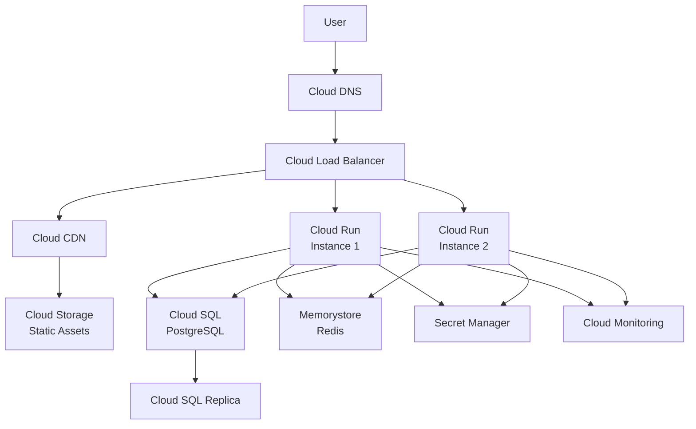
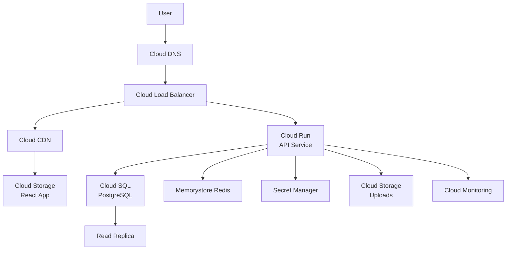

# GCP Deployment Guide

Complete guide to deploying applications on Google Cloud Platform with best practices, security, and cost optimization.

## What You'll Learn

- Deploy containerized apps with Cloud Run
- Use Cloud Functions for serverless
- Set up Cloud SQL PostgreSQL
- Configure Memorystore Redis
- Use Cloud Storage and CDN
- Set up Cloud Load Balancing
- Manage secrets with Secret Manager
- Monitor with Cloud Monitoring
- Optimize costs
- Deploy a complete full-stack application

## GCP Architecture Overview



## 1. Cloud Run Deployment

### 1.1 Install gcloud CLI

```bash
# Install gcloud CLI (Linux/macOS)
curl https://sdk.cloud.google.com | bash
exec -l $SHELL

# Initialize gcloud
gcloud init

# Set default project
gcloud config set project YOUR_PROJECT_ID

# Set default region
gcloud config set run/region us-central1

# Authenticate
gcloud auth login
```

### 1.2 Prepare Application

**Dockerfile:**

```dockerfile
FROM node:20-alpine

WORKDIR /app

# Copy package files
COPY package*.json ./

# Install dependencies
RUN npm ci --only=production

# Copy application code
COPY . .

# Create non-root user
RUN addgroup -g 1001 -S nodejs && \
    adduser -S nodejs -u 1001

# Change ownership
RUN chown -R nodejs:nodejs /app

# Switch to non-root user
USER nodejs

# Expose port (Cloud Run requires PORT env var)
EXPOSE 8080

# Health check
HEALTHCHECK --interval=30s --timeout=3s --start-period=40s --retries=3 \
  CMD node -e "require('http').get('http://localhost:8080/health', (r) => {process.exit(r.statusCode === 200 ? 0 : 1)})"

# Start application
CMD ["node", "server.js"]
```

**server.js (Express app):**

```javascript
const express = require('express');
const app = express();

// Cloud Run provides PORT via environment variable
const PORT = process.env.PORT || 8080;

app.use(express.json());

// Health check endpoint (required for Cloud Run)
app.get('/health', (req, res) => {
  res.json({ status: 'healthy', timestamp: new Date().toISOString() });
});

app.get('/api/users', async (req, res) => {
  // Your logic here
  res.json({ users: [] });
});

app.post('/api/users', async (req, res) => {
  // Your logic here
  res.json({ created: true });
});

// Error handler
app.use((err, req, res, next) => {
  console.error(err);
  res.status(500).json({ error: 'Internal server error' });
});

app.listen(PORT, () => {
  console.log(`Server running on port ${PORT}`);
});
```

### 1.3 Deploy to Cloud Run

**Method 1: Deploy from source (automatic build):**

```bash
# Deploy directly from source
gcloud run deploy myapp \
  --source . \
  --region us-central1 \
  --platform managed \
  --allow-unauthenticated \
  --min-instances 1 \
  --max-instances 10 \
  --memory 512Mi \
  --cpu 1 \
  --timeout 300 \
  --set-env-vars NODE_ENV=production,PORT=8080
```

**Method 2: Deploy from Container Registry:**

```bash
# Enable required APIs
gcloud services enable cloudbuild.googleapis.com
gcloud services enable run.googleapis.com
gcloud services enable containerregistry.googleapis.com

# Build and push to Container Registry
gcloud builds submit --tag gcr.io/YOUR_PROJECT_ID/myapp

# Deploy to Cloud Run
gcloud run deploy myapp \
  --image gcr.io/YOUR_PROJECT_ID/myapp \
  --region us-central1 \
  --platform managed \
  --allow-unauthenticated \
  --min-instances 1 \
  --max-instances 100 \
  --memory 512Mi \
  --cpu 1 \
  --concurrency 80 \
  --timeout 300 \
  --set-env-vars NODE_ENV=production
```

**Method 3: Deploy from Artifact Registry (recommended):**

```bash
# Enable Artifact Registry
gcloud services enable artifactregistry.googleapis.com

# Create repository
gcloud artifacts repositories create myapp-repo \
  --repository-format=docker \
  --location=us-central1 \
  --description="MyApp Docker repository"

# Configure Docker authentication
gcloud auth configure-docker us-central1-docker.pkg.dev

# Build and tag image
docker build -t us-central1-docker.pkg.dev/YOUR_PROJECT_ID/myapp-repo/myapp:latest .

# Push image
docker push us-central1-docker.pkg.dev/YOUR_PROJECT_ID/myapp-repo/myapp:latest

# Deploy to Cloud Run
gcloud run deploy myapp \
  --image us-central1-docker.pkg.dev/YOUR_PROJECT_ID/myapp-repo/myapp:latest \
  --region us-central1 \
  --platform managed \
  --allow-unauthenticated \
  --min-instances 2 \
  --max-instances 100 \
  --memory 1Gi \
  --cpu 2 \
  --concurrency 80 \
  --cpu-throttling \
  --session-affinity
```

### 1.4 Configure Auto Scaling

```bash
# Update service with auto-scaling settings
gcloud run services update myapp \
  --region us-central1 \
  --min-instances 2 \
  --max-instances 100 \
  --cpu-throttling \
  --concurrency 80

# Set CPU utilization target
gcloud run services update myapp \
  --region us-central1 \
  --cpu-utilization 70
```

### 1.5 Set Up Custom Domain

```bash
# Map custom domain
gcloud run domain-mappings create \
  --service myapp \
  --domain api.example.com \
  --region us-central1

# Get domain verification details
gcloud run domain-mappings describe \
  --domain api.example.com \
  --region us-central1
```

### 1.6 Configure VPC Connector (Private networking)

```bash
# Create VPC connector
gcloud compute networks vpc-access connectors create myapp-connector \
  --region us-central1 \
  --subnet myapp-subnet \
  --subnet-project YOUR_PROJECT_ID \
  --min-instances 2 \
  --max-instances 10 \
  --machine-type e2-micro

# Update Cloud Run service to use VPC connector
gcloud run services update myapp \
  --region us-central1 \
  --vpc-connector myapp-connector \
  --vpc-egress all-traffic
```

## 2. Cloud Functions

### 2.1 HTTP Function

**index.js:**

```javascript
const functions = require('@google-cloud/functions-framework');
const { SecretManagerServiceClient } = require('@google-cloud/secret-manager');

// HTTP function
functions.http('helloWorld', async (req, res) => {
  const name = req.query.name || req.body.name || 'World';
  
  res.json({
    message: `Hello ${name}!`,
    timestamp: new Date().toISOString()
  });
});

// Function with database connection
functions.http('apiHandler', async (req, res) => {
  const { Pool } = require('pg');
  const secretClient = new SecretManagerServiceClient();
  
  try {
    // Get database credentials from Secret Manager
    const [version] = await secretClient.accessSecretVersion({
      name: 'projects/YOUR_PROJECT_ID/secrets/database-url/versions/latest'
    });
    
    const databaseUrl = version.payload.data.toString();
    const pool = new Pool({ connectionString: databaseUrl });
    
    const result = await pool.query('SELECT NOW()');
    
    res.json({
      success: true,
      timestamp: result.rows[0].now
    });
  } catch (error) {
    console.error('Error:', error);
    res.status(500).json({ error: 'Internal server error' });
  }
});
```

**package.json:**

```json
{
  "name": "myapp-functions",
  "version": "1.0.0",
  "dependencies": {
    "@google-cloud/functions-framework": "^3.3.0",
    "@google-cloud/secret-manager": "^5.0.0",
    "pg": "^8.11.0"
  }
}
```

### 2.2 Deploy Cloud Function

```bash
# Deploy HTTP function
gcloud functions deploy myapp-api \
  --gen2 \
  --runtime nodejs20 \
  --region us-central1 \
  --source . \
  --entry-point apiHandler \
  --trigger-http \
  --allow-unauthenticated \
  --memory 256MB \
  --timeout 60s \
  --min-instances 1 \
  --max-instances 100 \
  --set-env-vars NODE_ENV=production

# Deploy with secrets
gcloud functions deploy myapp-api \
  --gen2 \
  --runtime nodejs20 \
  --region us-central1 \
  --source . \
  --entry-point apiHandler \
  --trigger-http \
  --allow-unauthenticated \
  --set-secrets 'DATABASE_URL=database-url:latest,API_KEY=api-key:latest'
```

### 2.3 Event-Driven Functions

**Pub/Sub Triggered:**

```javascript
const functions = require('@google-cloud/functions-framework');

functions.cloudEvent('processPubSubMessage', async (cloudEvent) => {
  const base64Data = cloudEvent.data.message.data;
  const dataString = Buffer.from(base64Data, 'base64').toString();
  const data = JSON.parse(dataString);
  
  console.log('Processing message:', data);
  
  // Process the message
  // ...
});
```

```bash
# Deploy Pub/Sub function
gcloud functions deploy process-messages \
  --gen2 \
  --runtime nodejs20 \
  --region us-central1 \
  --source . \
  --entry-point processPubSubMessage \
  --trigger-topic myapp-events
```

**Cloud Storage Triggered:**

```javascript
functions.cloudEvent('processUpload', async (cloudEvent) => {
  const file = cloudEvent.data;
  
  console.log(`File ${file.name} uploaded to ${file.bucket}`);
  
  // Process the file
  // ...
});
```

```bash
# Deploy Storage function
gcloud functions deploy process-uploads \
  --gen2 \
  --runtime nodejs20 \
  --region us-central1 \
  --source . \
  --entry-point processUpload \
  --trigger-bucket myapp-uploads
```

## 3. Cloud SQL PostgreSQL

### 3.1 Create Cloud SQL Instance

```bash
# Enable Cloud SQL Admin API
gcloud services enable sqladmin.googleapis.com

# Create PostgreSQL instance
gcloud sql instances create myapp-db \
  --database-version POSTGRES_15 \
  --tier db-f1-micro \
  --region us-central1 \
  --availability-type regional \
  --backup-start-time 03:00 \
  --enable-bin-log \
  --maintenance-window-day SUN \
  --maintenance-window-hour 4 \
  --storage-type SSD \
  --storage-size 10GB \
  --storage-auto-increase \
  --storage-auto-increase-limit 100GB

# Set root password
gcloud sql users set-password postgres \
  --instance myapp-db \
  --password YOUR_SECURE_PASSWORD

# Create application database
gcloud sql databases create myappdb \
  --instance myapp-db

# Create application user
gcloud sql users create appuser \
  --instance myapp-db \
  --password YOUR_APP_PASSWORD
```

### 3.2 Create Read Replica

```bash
# Create read replica
gcloud sql instances create myapp-db-replica \
  --master-instance-name myapp-db \
  --tier db-f1-micro \
  --region us-central1 \
  --availability-type zonal

# Promote replica (failover)
gcloud sql instances promote-replica myapp-db-replica
```

### 3.3 Configure Private IP

```bash
# Create private IP connection
gcloud sql instances patch myapp-db \
  --network projects/YOUR_PROJECT_ID/global/networks/default \
  --no-assign-ip

# Get private IP
gcloud sql instances describe myapp-db --format="value(ipAddresses.ipAddress)"
```

### 3.4 Connect from Cloud Run

**Using Cloud SQL Proxy (Recommended):**

```javascript
const { Pool } = require('pg');

// Cloud SQL connection using Unix socket
const pool = new Pool({
  user: process.env.DB_USER,
  password: process.env.DB_PASSWORD,
  database: process.env.DB_NAME,
  host: `/cloudsql/${process.env.INSTANCE_CONNECTION_NAME}`,
  max: 5,
  idleTimeoutMillis: 30000,
  connectionTimeoutMillis: 2000,
});

module.exports = pool;
```

**Deploy Cloud Run with Cloud SQL:**

```bash
gcloud run deploy myapp \
  --image gcr.io/YOUR_PROJECT_ID/myapp \
  --region us-central1 \
  --add-cloudsql-instances YOUR_PROJECT_ID:us-central1:myapp-db \
  --set-env-vars INSTANCE_CONNECTION_NAME=YOUR_PROJECT_ID:us-central1:myapp-db \
  --set-secrets DB_USER=db-user:latest,DB_PASSWORD=db-password:latest,DB_NAME=db-name:latest
```

### 3.5 Automated Backups

```bash
# Configure backup
gcloud sql instances patch myapp-db \
  --backup-start-time 03:00 \
  --retained-backups-count 7 \
  --retained-transaction-log-days 7

# Create on-demand backup
gcloud sql backups create \
  --instance myapp-db \
  --description "Manual backup $(date +%Y%m%d)"

# List backups
gcloud sql backups list --instance myapp-db

# Restore from backup
gcloud sql backups restore BACKUP_ID \
  --backup-instance myapp-db \
  --backup-id 1234567890123
```

### 3.6 Point-in-Time Recovery

```bash
# Clone instance to specific time
gcloud sql instances clone myapp-db myapp-db-clone \
  --point-in-time '2026-03-28T12:00:00.000Z'
```

## 4. Memorystore Redis

### 4.1 Create Redis Instance

```bash
# Enable Memorystore API
gcloud services enable redis.googleapis.com

# Create Redis instance
gcloud redis instances create myapp-redis \
  --size 1 \
  --region us-central1 \
  --tier standard \
  --redis-version redis_7_0 \
  --network default \
  --connect-mode private-service-access

# Get connection details
gcloud redis instances describe myapp-redis \
  --region us-central1 \
  --format="value(host,port)"
```

### 4.2 Configure High Availability

```bash
# Create Redis instance with HA
gcloud redis instances create myapp-redis-ha \
  --size 5 \
  --region us-central1 \
  --tier standard \
  --redis-version redis_7_0 \
  --replica-count 1 \
  --read-replicas-mode read-replicas-enabled
```

### 4.3 Connect from Application

**Node.js Redis Client:**

```javascript
const Redis = require('ioredis');

const redis = new Redis({
  host: process.env.REDIS_HOST,
  port: process.env.REDIS_PORT || 6379,
  retryStrategy: (times) => {
    const delay = Math.min(times * 50, 2000);
    return delay;
  },
  maxRetriesPerRequest: 3,
  enableReadyCheck: true,
  enableOfflineQueue: true,
});

redis.on('error', (err) => {
  console.error('Redis error:', err);
});

redis.on('connect', () => {
  console.log('Connected to Redis');
});

// Caching middleware
async function cacheMiddleware(req, res, next) {
  const key = `cache:${req.originalUrl}`;
  
  try {
    const cached = await redis.get(key);
    if (cached) {
      return res.json(JSON.parse(cached));
    }
    
    const originalSend = res.json.bind(res);
    res.json = (data) => {
      redis.setex(key, 300, JSON.stringify(data));
      return originalSend(data);
    };
    
    next();
  } catch (error) {
    console.error('Cache error:', error);
    next();
  }
}

module.exports = { redis, cacheMiddleware };
```

**Deploy with Redis:**

```bash
gcloud run deploy myapp \
  --image gcr.io/YOUR_PROJECT_ID/myapp \
  --region us-central1 \
  --vpc-connector myapp-connector \
  --set-env-vars REDIS_HOST=<REDIS-IP>,REDIS_PORT=6379
```

## 5. Cloud Storage and CDN

### 5.1 Create Storage Bucket

```bash
# Create bucket
gsutil mb -l us-central1 -c STANDARD gs://myapp-static-assets

# Enable versioning
gsutil versioning set on gs://myapp-static-assets

# Set lifecycle policy (auto-delete old versions)
cat > lifecycle.json <<EOF
{
  "lifecycle": {
    "rule": [
      {
        "action": {"type": "Delete"},
        "condition": {
          "numNewerVersions": 3
        }
      },
      {
        "action": {"type": "SetStorageClass", "storageClass": "NEARLINE"},
        "condition": {
          "age": 30,
          "matchesStorageClass": ["STANDARD"]
        }
      }
    ]
  }
}
EOF

gsutil lifecycle set lifecycle.json gs://myapp-static-assets

# Set CORS policy
cat > cors.json <<EOF
[
  {
    "origin": ["https://example.com"],
    "method": ["GET", "HEAD"],
    "responseHeader": ["Content-Type"],
    "maxAgeSeconds": 3600
  }
]
EOF

gsutil cors set cors.json gs://myapp-static-assets
```

### 5.2 Upload Files

```bash
# Upload files with cache control
gsutil -h "Cache-Control:public, max-age=31536000, immutable" \
  cp -r dist/static/* gs://myapp-static-assets/static/

# Upload HTML with shorter cache
gsutil -h "Cache-Control:public, max-age=300" \
  cp dist/index.html gs://myapp-static-assets/

# Set public read access
gsutil iam ch allUsers:objectViewer gs://myapp-static-assets

# Or make individual objects public
gsutil acl ch -u AllUsers:R gs://myapp-static-assets/index.html
```

### 5.3 Enable Cloud CDN

```bash
# Create backend bucket
gcloud compute backend-buckets create myapp-backend-bucket \
  --gcs-bucket-name myapp-static-assets \
  --enable-cdn \
  --cache-mode CACHE_ALL_STATIC

# Configure CDN cache settings
gcloud compute backend-buckets update myapp-backend-bucket \
  --cache-mode CACHE_ALL_STATIC \
  --default-ttl 3600 \
  --max-ttl 86400 \
  --client-ttl 3600

# Create URL map
gcloud compute url-maps create myapp-cdn \
  --default-backend-bucket myapp-backend-bucket

# Create SSL certificate
gcloud compute ssl-certificates create myapp-cert \
  --domains cdn.example.com

# Create HTTPS proxy
gcloud compute target-https-proxies create myapp-https-proxy \
  --url-map myapp-cdn \
  --ssl-certificates myapp-cert

# Create forwarding rule
gcloud compute forwarding-rules create myapp-https-forwarding \
  --global \
  --target-https-proxy myapp-https-proxy \
  --ports 443

# Invalidate CDN cache
gcloud compute url-maps invalidate-cdn-cache myapp-cdn \
  --path "/*"
```

### 5.4 Signed URLs (Private content)

```javascript
const { Storage } = require('@google-cloud/storage');
const storage = new Storage();

async function generateSignedUrl(bucketName, fileName, expiresIn = 3600) {
  const options = {
    version: 'v4',
    action: 'read',
    expires: Date.now() + expiresIn * 1000,
  };

  const [url] = await storage
    .bucket(bucketName)
    .file(fileName)
    .getSignedUrl(options);

  return url;
}

// Usage
app.get('/api/download/:fileId', async (req, res) => {
  const url = await generateSignedUrl('myapp-private-files', req.params.fileId);
  res.json({ downloadUrl: url });
});
```

## 6. Cloud Load Balancing

### 6.1 Create Load Balancer for Cloud Run

```bash
# Create serverless NEG (Network Endpoint Group)
gcloud compute network-endpoint-groups create myapp-neg \
  --region us-central1 \
  --network-endpoint-type serverless \
  --cloud-run-service myapp

# Create backend service
gcloud compute backend-services create myapp-backend \
  --global \
  --load-balancing-scheme EXTERNAL_MANAGED

# Add NEG to backend service
gcloud compute backend-services add-backend myapp-backend \
  --global \
  --network-endpoint-group myapp-neg \
  --network-endpoint-group-region us-central1

# Create URL map
gcloud compute url-maps create myapp-lb \
  --default-service myapp-backend

# Create managed SSL certificate
gcloud compute ssl-certificates create myapp-ssl \
  --domains api.example.com,www.example.com

# Create HTTPS proxy
gcloud compute target-https-proxies create myapp-https-proxy \
  --url-map myapp-lb \
  --ssl-certificates myapp-ssl

# Reserve static IP
gcloud compute addresses create myapp-ip --global

# Create forwarding rule
gcloud compute forwarding-rules create myapp-https-rule \
  --global \
  --target-https-proxy myapp-https-proxy \
  --address myapp-ip \
  --ports 443
```

### 6.2 Configure Path-Based Routing

```bash
# Create path matcher
gcloud compute url-maps add-path-matcher myapp-lb \
  --path-matcher-name myapp-paths \
  --default-service myapp-backend \
  --backend-service-path-rules "/api/*=myapp-api-backend,/static/*=myapp-static-backend"
```

## 7. Secret Manager

### 7.1 Create Secrets

```bash
# Enable Secret Manager API
gcloud services enable secretmanager.googleapis.com

# Create secret from file
echo -n "your-database-password" | gcloud secrets create db-password \
  --data-file=-

# Create secret from string
gcloud secrets create api-key \
  --data-file=- <<EOF
sk_live_xxxxxxxxxxxxxxxx
EOF

# Create secret with JSON
gcloud secrets create database-config \
  --data-file=- <<EOF
{
  "host": "10.1.2.3",
  "port": 5432,
  "database": "myappdb",
  "username": "appuser"
}
EOF

# Add new version
echo -n "new-password" | gcloud secrets versions add db-password \
  --data-file=-

# Grant access to Cloud Run service account
gcloud secrets add-iam-policy-binding db-password \
  --member serviceAccount:YOUR_SERVICE_ACCOUNT@YOUR_PROJECT_ID.iam.gserviceaccount.com \
  --role roles/secretmanager.secretAccessor
```

### 7.2 Access Secrets in Application

```javascript
const { SecretManagerServiceClient } = require('@google-cloud/secret-manager');
const client = new SecretManagerServiceClient();

async function accessSecret(secretName) {
  const name = `projects/${process.env.GCP_PROJECT}/secrets/${secretName}/versions/latest`;
  
  try {
    const [version] = await client.accessSecretVersion({ name });
    const payload = version.payload.data.toString();
    return payload;
  } catch (error) {
    console.error(`Error accessing secret ${secretName}:`, error);
    throw error;
  }
}

// Cache secrets
const secretCache = new Map();

async function getCachedSecret(secretName, ttl = 3600000) {
  const cached = secretCache.get(secretName);
  
  if (cached && cached.expiry > Date.now()) {
    return cached.value;
  }
  
  const value = await accessSecret(secretName);
  secretCache.set(secretName, {
    value,
    expiry: Date.now() + ttl
  });
  
  return value;
}

module.exports = { accessSecret, getCachedSecret };
```

**Deploy with Secrets:**

```bash
gcloud run deploy myapp \
  --image gcr.io/YOUR_PROJECT_ID/myapp \
  --region us-central1 \
  --set-secrets DATABASE_URL=database-url:latest,API_KEY=api-key:latest
```

## 8. Cloud Monitoring

### 8.1 Create Alerts

```bash
# Create notification channel
gcloud alpha monitoring channels create \
  --display-name "Email Alerts" \
  --type email \
  --channel-labels email_address=alerts@example.com

# Create alert policy for high CPU
gcloud alpha monitoring policies create \
  --notification-channels CHANNEL_ID \
  --display-name "High CPU Usage" \
  --condition-display-name "CPU > 80%" \
  --condition-threshold-value 0.8 \
  --condition-threshold-duration 300s \
  --condition-expression 'resource.type="cloud_run_revision" AND metric.type="run.googleapis.com/container/cpu/utilizations"'

# Create alert for error rate
gcloud alpha monitoring policies create \
  --notification-channels CHANNEL_ID \
  --display-name "High Error Rate" \
  --condition-display-name "Errors > 10/min" \
  --condition-threshold-value 10 \
  --condition-threshold-duration 60s \
  --condition-expression 'resource.type="cloud_run_revision" AND metric.type="run.googleapis.com/request_count" AND metric.label.response_code_class="5xx"'
```

### 8.2 Custom Metrics

```javascript
const { MetricServiceClient } = require('@google-cloud/monitoring');
const client = new MetricServiceClient();

async function writeMetric(metricType, value) {
  const projectId = process.env.GCP_PROJECT;
  const projectPath = client.projectPath(projectId);
  
  const dataPoint = {
    interval: {
      endTime: {
        seconds: Date.now() / 1000,
      },
    },
    value: {
      doubleValue: value,
    },
  };

  const timeSeriesData = {
    metric: {
      type: `custom.googleapis.com/${metricType}`,
    },
    resource: {
      type: 'global',
      labels: {
        project_id: projectId,
      },
    },
    points: [dataPoint],
  };

  const request = {
    name: projectPath,
    timeSeries: [timeSeriesData],
  };

  try {
    await client.createTimeSeries(request);
  } catch (error) {
    console.error('Error writing metric:', error);
  }
}

// Usage
app.post('/api/orders', async (req, res) => {
  try {
    const order = await createOrder(req.body);
    
    // Track custom metrics
    await writeMetric('orders_created', 1);
    await writeMetric('order_value', order.total);
    
    res.json(order);
  } catch (error) {
    await writeMetric('order_errors', 1);
    res.status(500).json({ error: 'Failed to create order' });
  }
});
```

### 8.3 Structured Logging

```javascript
const { Logging } = require('@google-cloud/logging');
const logging = new Logging();
const log = logging.log('myapp-log');

async function writeLog(severity, message, metadata = {}) {
  const entry = log.entry(
    {
      resource: {
        type: 'cloud_run_revision',
        labels: {
          service_name: 'myapp',
          revision_name: process.env.K_REVISION || 'unknown',
        },
      },
      severity,
    },
    {
      message,
      ...metadata,
      timestamp: new Date().toISOString(),
    }
  );

  try {
    await log.write(entry);
  } catch (error) {
    console.error('Error writing log:', error);
  }
}

// Express middleware for request logging
function requestLogger(req, res, next) {
  const start = Date.now();
  
  res.on('finish', () => {
    const duration = Date.now() - start;
    
    writeLog('INFO', 'HTTP Request', {
      method: req.method,
      path: req.path,
      statusCode: res.statusCode,
      duration,
      userAgent: req.get('user-agent'),
      ip: req.ip,
    });
  });
  
  next();
}

module.exports = { writeLog, requestLogger };
```

### 8.4 Application Performance Monitoring

```javascript
const { TraceAgent } = require('@google-cloud/trace-agent');
const { ProfilerAgent } = require('@google-cloud/profiler');

// Start trace agent
TraceAgent.start({
  projectId: process.env.GCP_PROJECT,
  serviceContext: {
    service: 'myapp',
    version: process.env.K_REVISION,
  },
});

// Start profiler
ProfilerAgent.start({
  projectId: process.env.GCP_PROJECT,
  serviceContext: {
    service: 'myapp',
    version: process.env.K_REVISION,
  },
});
```

## 9. Cost Optimization

### 9.1 Cloud Run Cost Optimization

```bash
# Use minimum instances strategically
gcloud run services update myapp \
  --region us-central1 \
  --min-instances 0  # Scale to zero when no traffic

# Set CPU allocation
gcloud run services update myapp \
  --region us-central1 \
  --cpu-throttling  # Only allocate CPU during request processing

# Optimize memory allocation
gcloud run services update myapp \
  --region us-central1 \
  --memory 512Mi  # Use only what you need

# Set concurrency
gcloud run services update myapp \
  --region us-central1 \
  --concurrency 80  # Handle more requests per container
```

### 9.2 Cloud SQL Cost Optimization

```bash
# Use automatic storage increase
gcloud sql instances patch myapp-db \
  --storage-auto-increase \
  --storage-auto-increase-limit 100GB

# Schedule downtime for development instances
gcloud sql instances patch myapp-dev-db \
  --maintenance-window-day SAT \
  --maintenance-window-hour 2

# Delete old backups
gcloud sql instances patch myapp-db \
  --retained-backups-count 7
```

### 9.3 Storage Cost Optimization

```bash
# Set storage class lifecycle
cat > lifecycle-policy.json <<EOF
{
  "lifecycle": {
    "rule": [
      {
        "action": {"type": "SetStorageClass", "storageClass": "NEARLINE"},
        "condition": {"age": 30}
      },
      {
        "action": {"type": "SetStorageClass", "storageClass": "COLDLINE"},
        "condition": {"age": 90}
      },
      {
        "action": {"type": "Delete"},
        "condition": {"age": 365}
      }
    ]
  }
}
EOF

gsutil lifecycle set lifecycle-policy.json gs://myapp-backups
```

### 9.4 Budget Alerts

```bash
# Create budget
gcloud billing budgets create \
  --billing-account BILLING_ACCOUNT_ID \
  --display-name "MyApp Monthly Budget" \
  --budget-amount 100 \
  --threshold-rule percent=50 \
  --threshold-rule percent=90 \
  --threshold-rule percent=100
```

## 10. Complete Example: Full-Stack Application

### Architecture



### Deployment Script

**deploy.sh:**

```bash
#!/bin/bash

PROJECT_ID="your-project-id"
REGION="us-central1"
APP_NAME="myapp"

# Enable APIs
gcloud services enable run.googleapis.com
gcloud services enable sqladmin.googleapis.com
gcloud services enable redis.googleapis.com
gcloud services enable secretmanager.googleapis.com

# Create Cloud SQL
gcloud sql instances create ${APP_NAME}-db \
  --database-version POSTGRES_15 \
  --tier db-f1-micro \
  --region ${REGION} \
  --availability-type regional

# Create database
gcloud sql databases create ${APP_NAME}db --instance ${APP_NAME}-db

# Create Redis
gcloud redis instances create ${APP_NAME}-redis \
  --size 1 \
  --region ${REGION} \
  --tier standard

# Create storage buckets
gsutil mb -l ${REGION} gs://${APP_NAME}-static
gsutil mb -l ${REGION} gs://${APP_NAME}-uploads

# Store secrets
echo -n "db-password" | gcloud secrets create db-password --data-file=-

# Build and deploy backend
gcloud builds submit --tag gcr.io/${PROJECT_ID}/${APP_NAME}-api ./api

gcloud run deploy ${APP_NAME}-api \
  --image gcr.io/${PROJECT_ID}/${APP_NAME}-api \
  --region ${REGION} \
  --platform managed \
  --allow-unauthenticated \
  --add-cloudsql-instances ${PROJECT_ID}:${REGION}:${APP_NAME}-db \
  --set-secrets DB_PASSWORD=db-password:latest

# Build and deploy frontend
cd frontend
npm run build
gsutil -m cp -r build/* gs://${APP_NAME}-static/

echo "Deployment complete!"
```

## Cost Estimation

### Monthly Costs (Estimated)

| Service | Configuration | Monthly Cost |
|---------|--------------|--------------|
| **Cloud Run** | 2M requests, 360k GB-sec | $10 |
| **Cloud SQL** | db-f1-micro + replica | $20 |
| **Memorystore** | 1GB Standard tier | $35 |
| **Cloud Storage** | 10GB storage, 100GB egress | $3 |
| **Cloud CDN** | 100GB cache egress | $5 |
| **Cloud DNS** | 1 million queries | $0.40 |
| **Load Balancer** | Forwarding rules + traffic | $20 |
| **Total** | | **~$93/month** |

### Cost Savings:

- **Cloud Run**: Scale to zero (pay only for usage)
- **Committed Use Discounts**: Save 57% on Cloud SQL/Memorystore
- **Cloud CDN**: Reduce egress costs
- **Storage Lifecycle**: Auto-move to cheaper tiers

## Practice Exercises

### Exercise 1: Deploy to Cloud Run
1. Create a simple Node.js API
2. Containerize with Docker
3. Deploy to Cloud Run
4. Set up auto-scaling
5. Configure custom domain

### Exercise 2: Set Up Database
1. Create Cloud SQL PostgreSQL instance
2. Configure private IP
3. Connect from Cloud Run
4. Set up automated backups
5. Create read replica

### Exercise 3: Implement Caching
1. Create Memorystore Redis instance
2. Connect via VPC connector
3. Implement caching middleware
4. Monitor cache hit rates

### Exercise 4: Deploy Static Site
1. Build React application
2. Upload to Cloud Storage
3. Enable Cloud CDN
4. Configure custom domain
5. Set up HTTPS

### Exercise 5: Complete Full-Stack App
1. Deploy API to Cloud Run
2. Set up Cloud SQL database
3. Configure Redis cache
4. Deploy frontend to Cloud Storage
5. Set up Cloud Load Balancer
6. Configure monitoring and alerts

## Next Steps

- [Azure Deployment Guide](./05_azure_deployment.md)
- [Infrastructure as Code with Terraform](./06_terraform.md)
- [CI/CD Pipelines](./07_cicd.md)
- [Multi-Cloud Comparison](./19_cloud_comparison.md)

## Summary

You've learned how to:
- Deploy containerized apps with Cloud Run
- Use Cloud Functions for serverless
- Set up Cloud SQL PostgreSQL
- Configure Memorystore Redis
- Use Cloud Storage and CDN
- Set up Cloud Load Balancing
- Manage secrets securely
- Monitor with Cloud Monitoring
- Optimize costs
- Deploy complete applications

**GCP provides powerful managed services for building scalable applications!**
