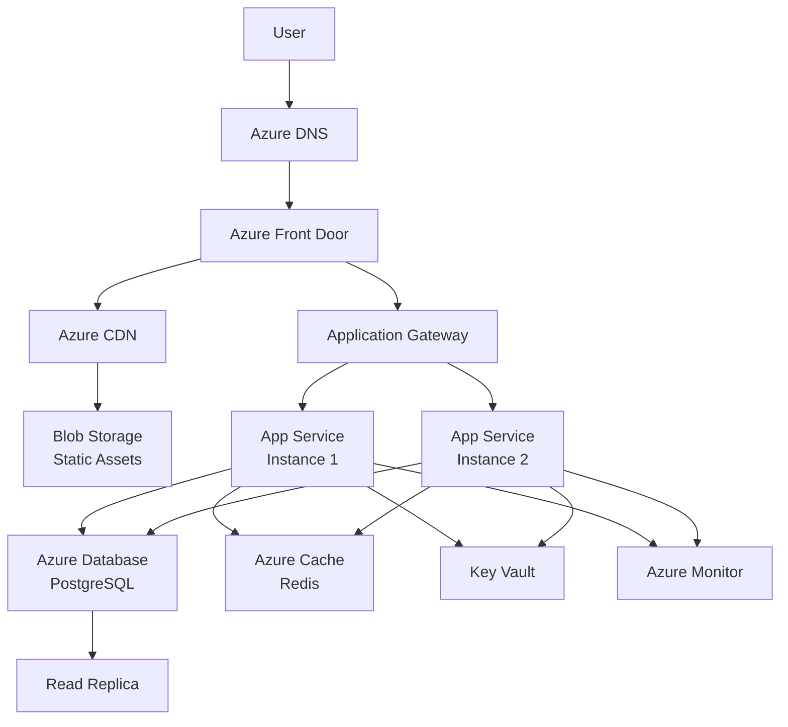
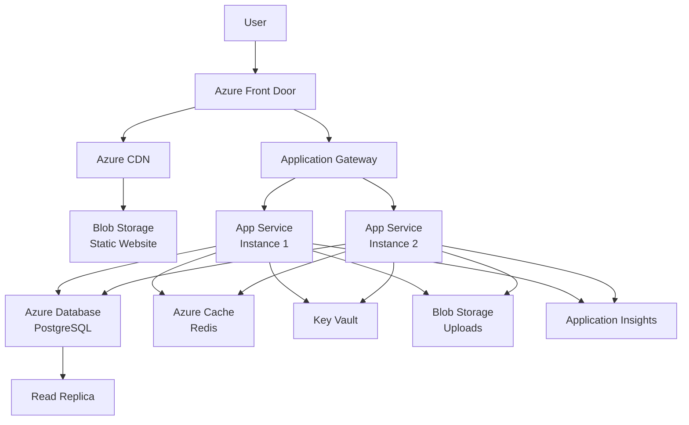

# Azure Deployment Guide

Complete guide to deploying applications on Microsoft Azure with best practices, security, and cost optimization.

## What You'll Learn

- Deploy apps with Azure App Service
- Use Azure Container Apps for containerized workloads
- Deploy serverless with Azure Functions
- Set up Azure Database for PostgreSQL
- Configure Azure Cache for Redis
- Use Azure Blob Storage and CDN
- Monitor with Azure Monitor
- Manage secrets with Key Vault
- Optimize costs
- Deploy a complete full-stack application

## Azure Architecture Overview



## 1. Azure App Service Deployment

### 1.1 Install Azure CLI

```bash
# Install Azure CLI (Windows)
winget install Microsoft.AzureCLI

# Install Azure CLI (macOS)
brew install azure-cli

# Install Azure CLI (Linux)
curl -sL https://aka.ms/InstallAzureCLIDeb | sudo bash

# Login to Azure
az login

# Set subscription
az account set --subscription "Your Subscription Name"

# Set default location
az config set defaults.location=eastus
```

### 1.2 Create Resource Group

```bash
# Create resource group
az group create \
  --name myapp-rg \
  --location eastus \
  --tags Environment=Production Application=MyApp
```

### 1.3 Deploy Node.js App to App Service

**Create App Service Plan:**

```bash
# Create App Service Plan (Linux)
az appservice plan create \
  --name myapp-plan \
  --resource-group myapp-rg \
  --sku P1V2 \
  --is-linux

# Create Web App
az webapp create \
  --name myapp-api \
  --resource-group myapp-rg \
  --plan myapp-plan \
  --runtime "NODE|20-lts"

# Configure always on
az webapp config set \
  --name myapp-api \
  --resource-group myapp-rg \
  --always-on true \
  --http20-enabled true \
  --min-tls-version 1.2
```

**Deploy from Local Git:**

```bash
# Configure deployment user
az webapp deployment user set \
  --user-name deployuser \
  --password YourPassword123!

# Configure local git
az webapp deployment source config-local-git \
  --name myapp-api \
  --resource-group myapp-rg

# Get git URL
GIT_URL=$(az webapp deployment source show \
  --name myapp-api \
  --resource-group myapp-rg \
  --query "repoUrl" --output tsv)

# Add Azure remote and push
git remote add azure $GIT_URL
git push azure main
```

**Deploy from GitHub:**

```bash
# Deploy from GitHub repository
az webapp deployment source config \
  --name myapp-api \
  --resource-group myapp-rg \
  --repo-url https://github.com/yourusername/yourapp \
  --branch main \
  --manual-integration

# Or use GitHub Actions (recommended)
az webapp deployment github-actions add \
  --name myapp-api \
  --resource-group myapp-rg \
  --repo yourusername/yourapp \
  --branch main \
  --runtime node \
  --runtime-version 20
```

**Deploy using ZIP:**

```bash
# Create deployment package
npm install
zip -r app.zip . -x "node_modules/*" ".git/*"

# Deploy ZIP
az webapp deploy \
  --name myapp-api \
  --resource-group myapp-rg \
  --src-path app.zip \
  --type zip
```

### 1.4 Configure App Settings

```bash
# Set environment variables
az webapp config appsettings set \
  --name myapp-api \
  --resource-group myapp-rg \
  --settings \
    NODE_ENV=production \
    PORT=8080 \
    DATABASE_HOST=myapp-db.postgres.database.azure.com \
    REDIS_HOST=myapp-redis.redis.cache.windows.net

# Reference Key Vault secrets
az webapp config appsettings set \
  --name myapp-api \
  --resource-group myapp-rg \
  --settings \
    DATABASE_PASSWORD="@Microsoft.KeyVault(SecretUri=https://myapp-kv.vault.azure.net/secrets/db-password/)" \
    API_KEY="@Microsoft.KeyVault(SecretUri=https://myapp-kv.vault.azure.net/secrets/api-key/)"
```

### 1.5 Configure Auto Scaling

```bash
# Enable autoscale
az monitor autoscale create \
  --resource-group myapp-rg \
  --resource myapp-plan \
  --resource-type Microsoft.Web/serverFarms \
  --name myapp-autoscale \
  --min-count 2 \
  --max-count 10 \
  --count 2

# Add CPU-based scale rule
az monitor autoscale rule create \
  --resource-group myapp-rg \
  --autoscale-name myapp-autoscale \
  --condition "Percentage CPU > 70 avg 5m" \
  --scale out 1

az monitor autoscale rule create \
  --resource-group myapp-rg \
  --autoscale-name myapp-autoscale \
  --condition "Percentage CPU < 30 avg 5m" \
  --scale in 1

# Add memory-based scale rule
az monitor autoscale rule create \
  --resource-group myapp-rg \
  --autoscale-name myapp-autoscale \
  --condition "Memory Percentage > 75 avg 5m" \
  --scale out 2
```

### 1.6 Configure Custom Domain and SSL

```bash
# Add custom domain
az webapp config hostname add \
  --webapp-name myapp-api \
  --resource-group myapp-rg \
  --hostname api.example.com

# Create managed SSL certificate (free)
az webapp config ssl create \
  --resource-group myapp-rg \
  --name myapp-api \
  --hostname api.example.com

# Or upload custom certificate
az webapp config ssl upload \
  --certificate-file certificate.pfx \
  --certificate-password YourPassword \
  --name myapp-api \
  --resource-group myapp-rg

# Bind SSL certificate
az webapp config ssl bind \
  --certificate-thumbprint THUMBPRINT \
  --ssl-type SNI \
  --name myapp-api \
  --resource-group myapp-rg

# Enforce HTTPS
az webapp update \
  --name myapp-api \
  --resource-group myapp-rg \
  --https-only true
```

## 2. Azure Container Apps

### 2.1 Create Container App Environment

```bash
# Install Container Apps extension
az extension add --name containerapp --upgrade

# Register namespaces
az provider register --namespace Microsoft.App
az provider register --namespace Microsoft.OperationalInsights

# Create Log Analytics workspace
az monitor log-analytics workspace create \
  --resource-group myapp-rg \
  --workspace-name myapp-logs

# Get workspace credentials
LOG_ANALYTICS_WORKSPACE_CLIENT_ID=$(az monitor log-analytics workspace show \
  --resource-group myapp-rg \
  --workspace-name myapp-logs \
  --query customerId --output tsv)

LOG_ANALYTICS_WORKSPACE_CLIENT_SECRET=$(az monitor log-analytics workspace get-shared-keys \
  --resource-group myapp-rg \
  --workspace-name myapp-logs \
  --query primarySharedKey --output tsv)

# Create Container Apps environment
az containerapp env create \
  --name myapp-env \
  --resource-group myapp-rg \
  --location eastus \
  --logs-workspace-id $LOG_ANALYTICS_WORKSPACE_CLIENT_ID \
  --logs-workspace-key $LOG_ANALYTICS_WORKSPACE_CLIENT_SECRET
```

### 2.2 Deploy Container App

**Dockerfile:**

```dockerfile
FROM node:20-alpine

WORKDIR /app

COPY package*.json ./
RUN npm ci --only=production

COPY . .

EXPOSE 8080

HEALTHCHECK --interval=30s --timeout=3s --start-period=40s --retries=3 \
  CMD node -e "require('http').get('http://localhost:8080/health', (r) => {process.exit(r.statusCode === 200 ? 0 : 1)})"

USER node

CMD ["node", "server.js"]
```

**Deploy from Container Registry:**

```bash
# Create Azure Container Registry
az acr create \
  --resource-group myapp-rg \
  --name myappregistry \
  --sku Basic \
  --admin-enabled true

# Login to ACR
az acr login --name myappregistry

# Build and push image
az acr build \
  --registry myappregistry \
  --image myapp:latest \
  --file Dockerfile .

# Create container app
az containerapp create \
  --name myapp \
  --resource-group myapp-rg \
  --environment myapp-env \
  --image myappregistry.azurecr.io/myapp:latest \
  --target-port 8080 \
  --ingress external \
  --registry-server myappregistry.azurecr.io \
  --registry-username myappregistry \
  --registry-password $(az acr credential show --name myappregistry --query "passwords[0].value" -o tsv) \
  --cpu 0.5 \
  --memory 1.0Gi \
  --min-replicas 2 \
  --max-replicas 10 \
  --env-vars \
    NODE_ENV=production \
    PORT=8080

# Update container app
az containerapp update \
  --name myapp \
  --resource-group myapp-rg \
  --image myappregistry.azurecr.io/myapp:v2
```

### 2.3 Configure Auto Scaling

```bash
# Configure HTTP scaling
az containerapp update \
  --name myapp \
  --resource-group myapp-rg \
  --min-replicas 2 \
  --max-replicas 20 \
  --scale-rule-name http-rule \
  --scale-rule-type http \
  --scale-rule-http-concurrency 100

# Configure CPU scaling
az containerapp update \
  --name myapp \
  --resource-group myapp-rg \
  --scale-rule-name cpu-rule \
  --scale-rule-type cpu \
  --scale-rule-metadata type=Utilization value=70

# Configure memory scaling
az containerapp update \
  --name myapp \
  --resource-group myapp-rg \
  --scale-rule-name memory-rule \
  --scale-rule-type memory \
  --scale-rule-metadata type=Utilization value=75
```

### 2.4 Configure Secrets

```bash
# Add secret
az containerapp secret set \
  --name myapp \
  --resource-group myapp-rg \
  --secrets \
    db-password=YourSecurePassword \
    api-key=sk_live_xxxxx

# Use secret in environment variables
az containerapp update \
  --name myapp \
  --resource-group myapp-rg \
  --set-env-vars \
    DATABASE_PASSWORD=secretref:db-password \
    API_KEY=secretref:api-key
```

## 3. Azure Functions

### 3.1 Create Function App

```bash
# Create storage account (required for Functions)
az storage account create \
  --name myappfunctions \
  --resource-group myapp-rg \
  --location eastus \
  --sku Standard_LRS

# Create Function App
az functionapp create \
  --resource-group myapp-rg \
  --consumption-plan-location eastus \
  --runtime node \
  --runtime-version 20 \
  --functions-version 4 \
  --name myapp-functions \
  --storage-account myappfunctions \
  --os-type Linux

# Configure app settings
az functionapp config appsettings set \
  --name myapp-functions \
  --resource-group myapp-rg \
  --settings \
    NODE_ENV=production \
    DATABASE_URL="@Microsoft.KeyVault(SecretUri=https://myapp-kv.vault.azure.net/secrets/database-url/)"
```

### 3.2 Create HTTP Function

**local.settings.json:**

```json
{
  "IsEncrypted": false,
  "Values": {
    "AzureWebJobsStorage": "",
    "FUNCTIONS_WORKER_RUNTIME": "node",
    "NODE_ENV": "development"
  }
}
```

**HttpTrigger/index.js:**

```javascript
const { app } = require('@azure/functions');

app.http('httpTrigger', {
  methods: ['GET', 'POST'],
  authLevel: 'anonymous',
  handler: async (request, context) => {
    context.log('HTTP trigger function processed a request.');
    
    const name = request.query.get('name') || await request.text() || 'World';
    
    return {
      status: 200,
      jsonBody: {
        message: `Hello, ${name}!`,
        timestamp: new Date().toISOString()
      }
    };
  }
});
```

**Database Function:**

```javascript
const { app } = require('@azure/functions');
const { Pool } = require('pg');

app.http('getUsers', {
  methods: ['GET'],
  authLevel: 'function',
  handler: async (request, context) => {
    const pool = new Pool({
      connectionString: process.env.DATABASE_URL,
      ssl: { rejectUnauthorized: false }
    });
    
    try {
      const result = await pool.query('SELECT * FROM users LIMIT 10');
      
      return {
        status: 200,
        jsonBody: {
          users: result.rows
        }
      };
    } catch (error) {
      context.log.error('Database error:', error);
      
      return {
        status: 500,
        jsonBody: {
          error: 'Internal server error'
        }
      };
    } finally {
      await pool.end();
    }
  }
});
```

### 3.3 Deploy Function App

```bash
# Install Azure Functions Core Tools
npm install -g azure-functions-core-tools@4

# Initialize function app
func init myapp-functions --worker-runtime node

# Create new function
cd myapp-functions
func new --name HttpTrigger --template "HTTP trigger"

# Test locally
func start

# Deploy to Azure
func azure functionapp publish myapp-functions

# Get function URL
az functionapp function show \
  --name myapp-functions \
  --resource-group myapp-rg \
  --function-name HttpTrigger \
  --query "invokeUrlTemplate" --output tsv
```

### 3.4 Event-Driven Functions

**Queue Trigger:**

```javascript
const { app } = require('@azure/functions');

app.storageQueue('processQueue', {
  queueName: 'myapp-queue',
  connection: 'AzureWebJobsStorage',
  handler: async (queueItem, context) => {
    context.log('Processing queue item:', queueItem);
    
    // Process the message
    const data = JSON.parse(queueItem);
    
    // Your processing logic here
  }
});
```

**Blob Trigger:**

```javascript
const { app } = require('@azure/functions');

app.storageBlob('processUpload', {
  path: 'uploads/{name}',
  connection: 'AzureWebJobsStorage',
  handler: async (blob, context) => {
    context.log('Processing blob:', context.triggerMetadata.name);
    context.log('Blob size:', blob.length);
    
    // Process the file
  }
});
```

**Timer Trigger:**

```javascript
const { app } = require('@azure/functions');

app.timer('scheduledTask', {
  schedule: '0 */5 * * * *', // Every 5 minutes
  handler: async (myTimer, context) => {
    context.log('Timer trigger function executed at:', new Date().toISOString());
    
    // Your scheduled task logic
  }
});
```

## 4. Azure Database for PostgreSQL

### 4.1 Create PostgreSQL Server

```bash
# Create PostgreSQL flexible server
az postgres flexible-server create \
  --name myapp-db \
  --resource-group myapp-rg \
  --location eastus \
  --admin-user dbadmin \
  --admin-password YourSecurePassword123! \
  --sku-name Standard_B1ms \
  --tier Burstable \
  --storage-size 32 \
  --version 15 \
  --high-availability Enabled \
  --zone 1 \
  --standby-zone 2 \
  --backup-retention 7 \
  --geo-redundant-backup Enabled

# Create database
az postgres flexible-server db create \
  --resource-group myapp-rg \
  --server-name myapp-db \
  --database-name myappdb
```

### 4.2 Configure Firewall Rules

```bash
# Allow Azure services
az postgres flexible-server firewall-rule create \
  --resource-group myapp-rg \
  --name myapp-db \
  --rule-name AllowAzureServices \
  --start-ip-address 0.0.0.0 \
  --end-ip-address 0.0.0.0

# Allow specific IP
az postgres flexible-server firewall-rule create \
  --resource-group myapp-rg \
  --name myapp-db \
  --rule-name AllowMyIP \
  --start-ip-address 203.0.113.1 \
  --end-ip-address 203.0.113.1

# List firewall rules
az postgres flexible-server firewall-rule list \
  --resource-group myapp-rg \
  --name myapp-db --output table
```

### 4.3 Configure Private Endpoint

```bash
# Create virtual network
az network vnet create \
  --resource-group myapp-rg \
  --name myapp-vnet \
  --address-prefix 10.0.0.0/16 \
  --subnet-name db-subnet \
  --subnet-prefix 10.0.1.0/24

# Create private endpoint
az network private-endpoint create \
  --resource-group myapp-rg \
  --name myapp-db-endpoint \
  --vnet-name myapp-vnet \
  --subnet db-subnet \
  --private-connection-resource-id $(az postgres flexible-server show --resource-group myapp-rg --name myapp-db --query id -o tsv) \
  --group-id postgresqlServer \
  --connection-name myapp-db-connection

# Configure private DNS
az network private-dns zone create \
  --resource-group myapp-rg \
  --name privatelink.postgres.database.azure.com

az network private-dns link vnet create \
  --resource-group myapp-rg \
  --zone-name privatelink.postgres.database.azure.com \
  --name myapp-dns-link \
  --virtual-network myapp-vnet \
  --registration-enabled false

az network private-endpoint dns-zone-group create \
  --resource-group myapp-rg \
  --endpoint-name myapp-db-endpoint \
  --name myapp-zonegroup \
  --private-dns-zone privatelink.postgres.database.azure.com \
  --zone-name postgres
```

### 4.4 Connect from Application

**Node.js Connection:**

```javascript
const { Pool } = require('pg');

const pool = new Pool({
  host: process.env.DATABASE_HOST,
  port: 5432,
  database: process.env.DATABASE_NAME,
  user: process.env.DATABASE_USER,
  password: process.env.DATABASE_PASSWORD,
  ssl: {
    rejectUnauthorized: false
  },
  max: 20,
  idleTimeoutMillis: 30000,
  connectionTimeoutMillis: 2000,
});

pool.on('error', (err) => {
  console.error('Unexpected database error:', err);
});

module.exports = pool;
```

### 4.5 Create Read Replica

```bash
# Create read replica
az postgres flexible-server replica create \
  --replica-name myapp-db-replica \
  --resource-group myapp-rg \
  --source-server myapp-db \
  --location eastus2

# Promote replica (failover)
az postgres flexible-server replica stop-replication \
  --resource-group myapp-rg \
  --name myapp-db-replica
```

### 4.6 Automated Backups

```bash
# Configure backup retention
az postgres flexible-server update \
  --resource-group myapp-rg \
  --name myapp-db \
  --backup-retention 14 \
  --geo-redundant-backup Enabled

# List backups
az postgres flexible-server backup list \
  --resource-group myapp-rg \
  --name myapp-db

# Restore to point in time
az postgres flexible-server restore \
  --resource-group myapp-rg \
  --name myapp-db-restored \
  --source-server myapp-db \
  --restore-time "2026-03-28T12:00:00Z"
```

## 5. Azure Cache for Redis

### 5.1 Create Redis Cache

```bash
# Create Redis cache
az redis create \
  --resource-group myapp-rg \
  --name myapp-redis \
  --location eastus \
  --sku Standard \
  --vm-size c1 \
  --enable-non-ssl-port false \
  --minimum-tls-version 1.2

# Get connection details
az redis show \
  --resource-group myapp-rg \
  --name myapp-redis \
  --query [hostName,sslPort] --output tsv

# Get access keys
az redis list-keys \
  --resource-group myapp-rg \
  --name myapp-redis
```

### 5.2 Configure Premium Features

```bash
# Create Premium tier with clustering
az redis create \
  --resource-group myapp-rg \
  --name myapp-redis-premium \
  --location eastus \
  --sku Premium \
  --vm-size p1 \
  --shard-count 2 \
  --enable-non-ssl-port false

# Configure data persistence
az redis patch-schedule set \
  --resource-group myapp-rg \
  --name myapp-redis-premium \
  --schedule-entries '[{"dayOfWeek":"Sunday","startHourUtc":3,"maintenanceWindow":"PT5H"}]'
```

### 5.3 Connect from Application

```javascript
const Redis = require('ioredis');

const redis = new Redis({
  host: process.env.REDIS_HOST,
  port: 6380,
  password: process.env.REDIS_KEY,
  tls: {
    servername: process.env.REDIS_HOST
  },
  retryStrategy: (times) => {
    const delay = Math.min(times * 50, 2000);
    return delay;
  },
  maxRetriesPerRequest: 3,
});

redis.on('error', (err) => {
  console.error('Redis error:', err);
});

redis.on('connect', () => {
  console.log('Connected to Redis');
});

// Caching middleware
async function cacheMiddleware(req, res, next) {
  const key = `cache:${req.originalUrl}`;
  
  try {
    const cached = await redis.get(key);
    if (cached) {
      return res.json(JSON.parse(cached));
    }
    
    const originalSend = res.json.bind(res);
    res.json = (data) => {
      redis.setex(key, 300, JSON.stringify(data));
      return originalSend(data);
    };
    
    next();
  } catch (error) {
    console.error('Cache error:', error);
    next();
  }
}

module.exports = { redis, cacheMiddleware };
```

## 6. Azure Blob Storage and CDN

### 6.1 Create Storage Account

```bash
# Create storage account
az storage account create \
  --name myappstatic \
  --resource-group myapp-rg \
  --location eastus \
  --sku Standard_LRS \
  --kind StorageV2 \
  --access-tier Hot \
  --https-only true \
  --min-tls-version TLS1_2

# Get storage account key
STORAGE_KEY=$(az storage account keys list \
  --resource-group myapp-rg \
  --account-name myappstatic \
  --query '[0].value' --output tsv)

# Create blob container
az storage container create \
  --name static \
  --account-name myappstatic \
  --account-key $STORAGE_KEY \
  --public-access blob

# Enable static website hosting
az storage blob service-properties update \
  --account-name myappstatic \
  --static-website \
  --index-document index.html \
  --404-document 404.html
```

### 6.2 Upload Files

```bash
# Upload files
az storage blob upload-batch \
  --destination '$web' \
  --source ./dist \
  --account-name myappstatic \
  --account-key $STORAGE_KEY \
  --content-cache-control "max-age=31536000, immutable" \
  --pattern "*.js" \
  --pattern "*.css"

# Upload HTML with shorter cache
az storage blob upload-batch \
  --destination '$web' \
  --source ./dist \
  --account-name myappstatic \
  --account-key $STORAGE_KEY \
  --content-cache-control "max-age=300" \
  --pattern "*.html"

# Get static website URL
az storage account show \
  --name myappstatic \
  --resource-group myapp-rg \
  --query "primaryEndpoints.web" --output tsv
```

### 6.3 Configure CDN

```bash
# Create CDN profile
az cdn profile create \
  --resource-group myapp-rg \
  --name myapp-cdn \
  --sku Standard_Microsoft \
  --location eastus

# Create CDN endpoint
az cdn endpoint create \
  --resource-group myapp-rg \
  --profile-name myapp-cdn \
  --name myapp-cdn-endpoint \
  --origin myappstatic.z13.web.core.windows.net \
  --origin-host-header myappstatic.z13.web.core.windows.net \
  --enable-compression true \
  --query-string-caching-behavior IgnoreQueryString

# Configure custom domain
az cdn custom-domain create \
  --resource-group myapp-rg \
  --endpoint-name myapp-cdn-endpoint \
  --profile-name myapp-cdn \
  --name myapp-custom-domain \
  --hostname cdn.example.com

# Enable HTTPS
az cdn custom-domain enable-https \
  --resource-group myapp-rg \
  --profile-name myapp-cdn \
  --endpoint-name myapp-cdn-endpoint \
  --name myapp-custom-domain

# Purge CDN cache
az cdn endpoint purge \
  --resource-group myapp-rg \
  --profile-name myapp-cdn \
  --name myapp-cdn-endpoint \
  --content-paths '/*'
```

### 6.4 Configure Lifecycle Management

```bash
# Create lifecycle policy
az storage account management-policy create \
  --account-name myappstatic \
  --resource-group myapp-rg \
  --policy '{
    "rules": [
      {
        "enabled": true,
        "name": "MoveToAr chive",
        "type": "Lifecycle",
        "definition": {
          "actions": {
            "baseBlob": {
              "tierToCool": {
                "daysAfterModificationGreaterThan": 30
              },
              "tierToArchive": {
                "daysAfterModificationGreaterThan": 90
              },
              "delete": {
                "daysAfterModificationGreaterThan": 365
              }
            }
          },
          "filters": {
            "blobTypes": ["blockBlob"]
          }
        }
      }
    ]
  }'
```

## 7. Azure Key Vault

### 7.1 Create Key Vault

```bash
# Create Key Vault
az keyvault create \
  --name myapp-kv \
  --resource-group myapp-rg \
  --location eastus \
  --enable-soft-delete true \
  --retention-days 90 \
  --enable-purge-protection true \
  --enable-rbac-authorization false

# Set access policy for yourself
az keyvault set-policy \
  --name myapp-kv \
  --resource-group myapp-rg \
  --upn user@example.com \
  --secret-permissions get list set delete
```

### 7.2 Store Secrets

```bash
# Create secret
az keyvault secret set \
  --vault-name myapp-kv \
  --name db-password \
  --value "YourSecurePassword123!"

# Create secret from file
az keyvault secret set \
  --vault-name myapp-kv \
  --name api-config \
  --file config.json

# List secrets
az keyvault secret list \
  --vault-name myapp-kv --output table

# Get secret
az keyvault secret show \
  --vault-name myapp-kv \
  --name db-password \
  --query value --output tsv

# Update secret
az keyvault secret set \
  --vault-name myapp-kv \
  --name db-password \
  --value "NewSecurePassword456!"

# Delete secret
az keyvault secret delete \
  --vault-name myapp-kv \
  --name old-secret
```

### 7.3 Grant Access to App Service

```bash
# Enable managed identity for App Service
az webapp identity assign \
  --name myapp-api \
  --resource-group myapp-rg

# Get managed identity principal ID
PRINCIPAL_ID=$(az webapp identity show \
  --name myapp-api \
  --resource-group myapp-rg \
  --query principalId --output tsv)

# Grant Key Vault access
az keyvault set-policy \
  --name myapp-kv \
  --resource-group myapp-rg \
  --object-id $PRINCIPAL_ID \
  --secret-permissions get list
```

### 7.4 Access Secrets in Application

```javascript
const { DefaultAzureCredential } = require('@azure/identity');
const { SecretClient } = require('@azure/keyvault-secrets');

const credential = new DefaultAzureCredential();
const vaultUrl = `https://${process.env.KEY_VAULT_NAME}.vault.azure.net`;
const client = new SecretClient(vaultUrl, credential);

async function getSecret(secretName) {
  try {
    const secret = await client.getSecret(secretName);
    return secret.value;
  } catch (error) {
    console.error(`Error retrieving secret ${secretName}:`, error);
    throw error;
  }
}

// Cache secrets
const secretCache = new Map();

async function getCachedSecret(secretName, ttl = 3600000) {
  const cached = secretCache.get(secretName);
  
  if (cached && cached.expiry > Date.now()) {
    return cached.value;
  }
  
  const value = await getSecret(secretName);
  secretCache.set(secretName, {
    value,
    expiry: Date.now() + ttl
  });
  
  return value;
}

module.exports = { getSecret, getCachedSecret };
```

## 8. Azure Monitor

### 8.1 Create Action Group

```bash
# Create action group for email alerts
az monitor action-group create \
  --resource-group myapp-rg \
  --name myapp-alerts \
  --short-name MyAppAlert \
  --email-receiver \
    name=AdminEmail \
    email-address=admin@example.com \
    use-common-alert-schema=true
```

### 8.2 Create Alert Rules

```bash
# CPU alert
az monitor metrics alert create \
  --name high-cpu \
  --resource-group myapp-rg \
  --scopes /subscriptions/SUBSCRIPTION_ID/resourceGroups/myapp-rg/providers/Microsoft.Web/sites/myapp-api \
  --condition "avg Percentage CPU > 80" \
  --window-size 5m \
  --evaluation-frequency 1m \
  --action myapp-alerts \
  --description "Alert when CPU exceeds 80%"

# Memory alert
az monitor metrics alert create \
  --name high-memory \
  --resource-group myapp-rg \
  --scopes /subscriptions/SUBSCRIPTION_ID/resourceGroups/myapp-rg/providers/Microsoft.Web/sites/myapp-api \
  --condition "avg MemoryPercentage > 75" \
  --window-size 5m \
  --evaluation-frequency 1m \
  --action myapp-alerts

# HTTP 5xx errors alert
az monitor metrics alert create \
  --name high-errors \
  --resource-group myapp-rg \
  --scopes /subscriptions/SUBSCRIPTION_ID/resourceGroups/myapp-rg/providers/Microsoft.Web/sites/myapp-api \
  --condition "total Http5xx > 10" \
  --window-size 5m \
  --evaluation-frequency 1m \
  --action myapp-alerts
```

### 8.3 Application Insights

```bash
# Create Application Insights
az monitor app-insights component create \
  --app myapp-insights \
  --location eastus \
  --resource-group myapp-rg \
  --application-type web

# Get instrumentation key
INSTRUMENTATION_KEY=$(az monitor app-insights component show \
  --app myapp-insights \
  --resource-group myapp-rg \
  --query instrumentationKey --output tsv)

# Configure App Service
az webapp config appsettings set \
  --name myapp-api \
  --resource-group myapp-rg \
  --settings \
    APPINSIGHTS_INSTRUMENTATIONKEY=$INSTRUMENTATION_KEY \
    ApplicationInsightsAgent_EXTENSION_VERSION=~3
```

**Node.js Application Insights:**

```javascript
const appInsights = require('applicationinsights');

appInsights.setup(process.env.APPINSIGHTS_INSTRUMENTATIONKEY)
  .setAutoDependencyCorrelation(true)
  .setAutoCollectRequests(true)
  .setAutoCollectPerformance(true, true)
  .setAutoCollectExceptions(true)
  .setAutoCollectDependencies(true)
  .setAutoCollectConsole(true)
  .setUseDiskRetryCaching(true)
  .setSendLiveMetrics(true)
  .start();

const client = appInsights.defaultClient;

// Track custom event
client.trackEvent({
  name: 'OrderCreated',
  properties: {
    orderId: order.id,
    amount: order.total
  }
});

// Track custom metric
client.trackMetric({
  name: 'OrderValue',
  value: order.total
});

// Track dependency
client.trackDependency({
  target: 'https://api.example.com',
  name: 'GET /users',
  data: '/users',
  duration: 120,
  resultCode: 200,
  success: true,
  dependencyTypeName: 'HTTP'
});

module.exports = client;
```

### 8.4 Log Queries

```bash
# Query Application Insights logs
az monitor app-insights query \
  --app myapp-insights \
  --resource-group myapp-rg \
  --analytics-query '
    requests
    | where timestamp > ago(1h)
    | summarize count() by resultCode
  '

# Query performance
az monitor app-insights query \
  --app myapp-insights \
  --resource-group myapp-rg \
  --analytics-query '
    requests
    | where timestamp > ago(24h)
    | summarize avg(duration), percentile(duration, 95) by bin(timestamp, 1h)
  '
```

## 9. Cost Optimization

### 9.1 Use App Service Reserved Instances

```bash
# Purchase 1-year reserved capacity (30% savings)
az reservations reservation-order purchase \
  --reservation-order-id ORDER_ID \
  --sku Standard_P1V2 \
  --location eastus \
  --quantity 2 \
  --term P1Y

# Purchase 3-year reserved capacity (50% savings)
az reservations reservation-order purchase \
  --reservation-order-id ORDER_ID \
  --sku Standard_P1V2 \
  --location eastus \
  --quantity 2 \
  --term P3Y
```

### 9.2 Configure Auto-Shutdown

```bash
# Enable auto-shutdown for dev environments
az webapp config set \
  --name myapp-dev \
  --resource-group myapp-rg \
  --always-on false

# Create automation account for shutdown
az automation account create \
  --resource-group myapp-rg \
  --name myapp-automation \
  --location eastus \
  --sku Free
```

### 9.3 Use Spot Instances (Container Apps)

```bash
# Deploy with spot pricing (significant savings)
az containerapp create \
  --name myapp-spot \
  --resource-group myapp-rg \
  --environment myapp-env \
  --image myappregistry.azurecr.io/myapp:latest \
  --target-port 8080 \
  --ingress external \
  --min-replicas 0 \
  --max-replicas 10 \
  --cpu 0.5 \
  --memory 1.0Gi \
  --workload-profile-name "spot-profile"
```

### 9.4 Storage Cost Optimization

```bash
# Set storage tier policies
az storage account management-policy create \
  --account-name myappstatic \
  --resource-group myapp-rg \
  --policy '{
    "rules": [
      {
        "enabled": true,
        "name": "OptimizeStorage",
        "type": "Lifecycle",
        "definition": {
          "actions": {
            "baseBlob": {
              "tierToCool": {"daysAfterModificationGreaterThan": 30},
              "tierToArchive": {"daysAfterModificationGreaterThan": 90},
              "delete": {"daysAfterModificationGreaterThan": 365}
            }
          },
          "filters": {"blobTypes": ["blockBlob"]}
        }
      }
    ]
  }'
```

### 9.5 Cost Alerts

```bash
# Create budget
az consumption budget create \
  --amount 100 \
  --budget-name myapp-budget \
  --category Cost \
  --time-grain Monthly \
  --time-period start-date=2026-03-01 \
  --resource-group myapp-rg

# Create budget alert
az consumption budget create-notification \
  --budget-name myapp-budget \
  --resource-group myapp-rg \
  --notification-key Alert1 \
  --threshold 80 \
  --operator GreaterThan \
  --contact-emails admin@example.com
```

## 10. Complete Example: Full-Stack Application

### Architecture



### Deployment Script

**deploy.sh:**

```bash
#!/bin/bash

RG="myapp-rg"
LOCATION="eastus"
APP_NAME="myapp"

# Create resource group
az group create --name $RG --location $LOCATION

# Create App Service Plan
az appservice plan create \
  --name ${APP_NAME}-plan \
  --resource-group $RG \
  --sku P1V2 \
  --is-linux

# Create Web App
az webapp create \
  --name ${APP_NAME}-api \
  --resource-group $RG \
  --plan ${APP_NAME}-plan \
  --runtime "NODE|20-lts"

# Create PostgreSQL
az postgres flexible-server create \
  --name ${APP_NAME}-db \
  --resource-group $RG \
  --location $LOCATION \
  --admin-user dbadmin \
  --admin-password SecurePass123! \
  --sku-name Standard_B1ms \
  --tier Burstable \
  --version 15 \
  --high-availability Enabled

# Create Redis
az redis create \
  --resource-group $RG \
  --name ${APP_NAME}-redis \
  --location $LOCATION \
  --sku Standard \
  --vm-size c1

# Create Storage Account
az storage account create \
  --name ${APP_NAME}static \
  --resource-group $RG \
  --location $LOCATION \
  --sku Standard_LRS \
  --kind StorageV2

# Enable static website
az storage blob service-properties update \
  --account-name ${APP_NAME}static \
  --static-website \
  --index-document index.html

# Create Key Vault
az keyvault create \
  --name ${APP_NAME}-kv \
  --resource-group $RG \
  --location $LOCATION

# Store secrets
az keyvault secret set \
  --vault-name ${APP_NAME}-kv \
  --name db-password \
  --value "SecurePass123!"

# Create Application Insights
az monitor app-insights component create \
  --app ${APP_NAME}-insights \
  --location $LOCATION \
  --resource-group $RG \
  --application-type web

echo "Deployment complete!"
```

## Cost Estimation

### Monthly Costs (Estimated)

| Service | Configuration | Monthly Cost |
|---------|--------------|--------------|
| **App Service** | P1V2 (1 instance) | $73 |
| **PostgreSQL** | Standard_B1ms + HA | $45 |
| **Redis** | Standard C1 | $36 |
| **Blob Storage** | 10GB + 100GB egress | $4 |
| **CDN** | 100GB egress | $8 |
| **Application Insights** | 5GB data | $12 |
| **Key Vault** | 10k operations | $1 |
| **Total** | | **~$179/month** |

### Cost Savings:

- **Reserved Instances (1-year)**: Save 30-40%
- **Reserved Instances (3-year)**: Save up to 50%
- **Dev/Test Pricing**: Save up to 55% for non-production
- **Azure Hybrid Benefit**: Save up to 40% with existing licenses

## Practice Exercises

### Exercise 1: Deploy to App Service
1. Create a Node.js API
2. Deploy to App Service
3. Configure auto-scaling
4. Set up custom domain with SSL

### Exercise 2: Containerize with Container Apps
1. Create Dockerfile
2. Push to Azure Container Registry
3. Deploy to Container Apps
4. Configure auto-scaling

### Exercise 3: Set Up Database
1. Create Azure Database for PostgreSQL
2. Configure firewall rules
3. Create read replica
4. Set up automated backups

### Exercise 4: Implement Caching
1. Create Azure Cache for Redis
2. Connect from App Service
3. Implement caching middleware
4. Monitor cache metrics

### Exercise 5: Deploy Static Site
1. Build React application
2. Upload to Blob Storage
3. Enable CDN
4. Configure custom domain

### Exercise 6: Complete Full-Stack App
1. Deploy API to App Service
2. Set up PostgreSQL database
3. Configure Redis cache
4. Deploy frontend to Blob Storage
5. Set up Application Insights
6. Configure alerts

## Next Steps

- [Infrastructure as Code with Terraform](./06_terraform.md)
- [CI/CD Pipelines](./07_cicd.md)
- [Multi-Cloud Comparison](./19_cloud_comparison.md)
- [Cost Optimization Deep Dive](./15_cost_optimization.md)

## Summary

You've learned how to:
- Deploy apps with App Service and Container Apps
- Use Azure Functions for serverless
- Set up Azure Database for PostgreSQL
- Configure Azure Cache for Redis
- Use Blob Storage and CDN
- Manage secrets with Key Vault
- Monitor with Application Insights
- Optimize costs
- Deploy complete applications

**Azure provides a comprehensive platform for building enterprise-grade applications!**
