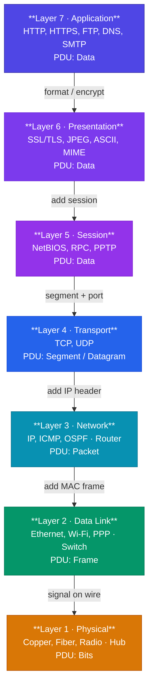
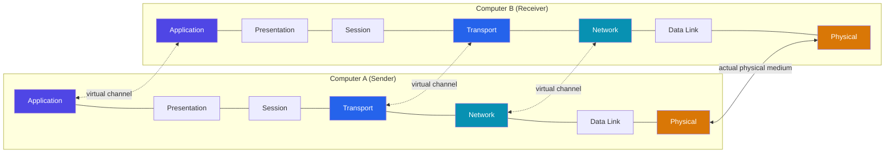

# OSI Model

## What You'll Learn

- The 7 layers of the OSI reference model
- Function and responsibilities of each layer
- Data encapsulation and PDUs (Protocol Data Units)
- How layers interact and communicate
- Real-world protocols at each layer

## What is the OSI Model?

The **OSI (Open Systems Interconnection) Model** is a conceptual framework that standardizes the functions of a communication system into seven distinct layers. Developed by the International Organization for Standardization (ISO) in 1984, it helps understand and design network architectures.

### Why Do We Need the OSI Model?

```
Benefits:
✓ Standardization - Common language for networking
✓ Modularity - Each layer can be developed independently
✓ Troubleshooting - Isolate problems to specific layers
✓ Interoperability - Different vendors can work together
✓ Education - Systematic way to learn networking
```

## The 7 Layers of OSI Model



### Mnemonic to Remember:

**Top to Bottom**: "All People Seem To Need Data Processing"  
**Bottom to Top**: "Please Do Not Throw Sausage Pizza Away"

## Layer 1: Physical Layer

### Responsibility
Transmission of raw bit streams over a physical medium.

### Functions
- Converts data into electrical, optical, or radio signals
- Defines physical characteristics (cables, connectors, voltages)
- Transmission mode (simplex, half-duplex, full-duplex)
- Bit rate control

### Hardware
- Cables (Ethernet, Fiber optic)
- Hubs
- Repeaters
- Network adapters (physical part)
- Connectors (RJ45, fiber connectors)

### Examples
```
Physical Media:
- Copper wire (Ethernet cables)
- Fiber optic cables
- Radio waves (Wi-Fi)
- Infrared

Specifications:
- Cable length limits
- Connector types
- Voltage levels
- Signal frequencies
```

### PDU (Protocol Data Unit): **Bits**

## Layer 2: Data Link Layer

### Responsibility
Reliable transfer of data frames between two directly connected nodes.

### Functions
- **Framing**: Encapsulates packets into frames
- **Physical addressing**: MAC (Media Access Control) addresses
- **Error detection**: CRC (Cyclic Redundancy Check)
- **Flow control**: Prevents overwhelming receiver
- **Access control**: Manages access to shared medium

### Sublayers
```
Data Link Layer
├── LLC (Logical Link Control)
│   └── Flow control, error control
└── MAC (Media Access Control)
    └── Physical addressing, access control
```

### Hardware
- Switches
- Bridges
- Network Interface Cards (NICs)
- Wireless Access Points

### Protocols/Technologies
- Ethernet (IEEE 802.3)
- Wi-Fi (IEEE 802.11)
- PPP (Point-to-Point Protocol)
- ARP (Address Resolution Protocol)

### Examples
```
Ethernet Frame:

[Preamble|Dest MAC|Src MAC|Type|Data|FCS]

MAC Address: 00:1A:2B:3C:4D:5E
- 48-bit hexadecimal address
- First 24 bits: Manufacturer ID
- Last 24 bits: Device ID
```

### PDU: **Frames**

## Layer 3: Network Layer

### Responsibility
Routing packets across multiple networks from source to destination.

### Functions
- **Logical addressing**: IP addresses
- **Routing**: Path determination
- **Packet forwarding**: Moving packets between networks
- **Fragmentation**: Breaking large packets into smaller ones
- **Congestion control**: Managing network traffic

### Hardware
- Routers
- Layer 3 Switches

### Protocols
- **IP (Internet Protocol)**: IPv4, IPv6
- **ICMP**: Error messages and diagnostics (ping, traceroute)
- **IGMP**: Multicast group management
- **Routing Protocols**: RIP, OSPF, BGP

### Examples
```
IPv4 Packet Header:

[Version|Header Length|Type of Service|Total Length]
[Identification|Flags|Fragment Offset]
[TTL|Protocol|Header Checksum]
[Source IP Address]
[Destination IP Address]
[Options|Padding]
[Data...]

Example IP Address: 192.168.1.100
```

### PDU: **Packets**

## Layer 4: Transport Layer

### Responsibility
End-to-end communication, reliability, and error recovery.

### Functions
- **Segmentation**: Breaking data into segments
- **Reassembly**: Reconstructing data at destination
- **Port addressing**: Identifying applications
- **Connection control**: Connection-oriented (TCP) or connectionless (UDP)
- **Flow control**: Managing data transmission rate
- **Error control**: Detecting and correcting errors

### Protocols

#### TCP (Transmission Control Protocol)
```
Characteristics:
- Connection-oriented (3-way handshake)
- Reliable delivery (acknowledgments)
- Ordered delivery
- Flow control
- Congestion control
- Slower but reliable

Use cases: Web browsing, email, file transfer
```

#### UDP (User Datagram Protocol)
```
Characteristics:
- Connectionless
- No reliability guarantees
- No ordering
- Minimal overhead
- Faster but less reliable

Use cases: Video streaming, online gaming, DNS queries
```

### Port Numbers
```
Well-Known Ports (0-1023):
- 20/21: FTP
- 22: SSH
- 80: HTTP
- 443: HTTPS
- 53: DNS
- 25: SMTP

Registered Ports (1024-49151):
- 3306: MySQL
- 5432: PostgreSQL
- 8080: HTTP Alternate

Dynamic Ports (49152-65535):
- Temporary client ports
```

### PDU: **Segments** (TCP) or **Datagrams** (UDP)

## Layer 5: Session Layer

### Responsibility
Establishes, manages, and terminates sessions between applications.

### Functions
- **Session establishment**: Setting up communication
- **Session maintenance**: Keeping connection alive
- **Session termination**: Closing connection properly
- **Synchronization**: Checkpoints for data recovery
- **Dialog control**: Managing turn-taking (simplex, half-duplex, full-duplex)

### Protocols/Technologies
- NetBIOS
- RPC (Remote Procedure Call)
- PPTP (Point-to-Point Tunneling Protocol)
- Session management in TLS/SSL

### Examples
```
Session Management:

[Client] ---- Session Establishment ----> [Server]
         <--- Session Acknowledged -----
         ---- Data Transfer (bidirectional) ----
         ---- Session Termination ----->
         <--- Confirmation -----------

Synchronization Points:
Time: 0s    [Data1] [Data2] [CHECKPOINT] [Data3] [Data4]
If failure occurs at Data4, resume from CHECKPOINT
```

### PDU: **Data**

## Layer 6: Presentation Layer

### Responsibility
Data translation, encryption, and compression.

### Functions
- **Translation**: Converting between data formats
- **Encryption/Decryption**: Securing data
- **Compression/Decompression**: Reducing data size
- **Character encoding**: ASCII, Unicode, EBCDIC

### Technologies
- **Encryption**: SSL/TLS, encryption algorithms (AES, RSA)
- **Compression**: JPEG, MPEG, GIF
- **Encoding**: ASCII, Unicode (UTF-8), MIME
- **Serialization**: JSON, XML, Protocol Buffers

### Examples
```
Data Format Conversion:

Application uses: Unicode
Network requires: ASCII

Presentation Layer translates between formats

Encryption Example:
Plain text: "Hello World"
           ↓ (Encrypt)
Cipher text: "x9k#mP2@qL1"
           ↓ (Network)
Cipher text: "x9k#mP2@qL1"
           ↓ (Decrypt)
Plain text: "Hello World"
```

### PDU: **Data**

## Layer 7: Application Layer

### Responsibility
Network services directly to user applications.

### Functions
- **Network virtual terminal**: Remote login
- **File transfer and management**: FTP, TFTP
- **Email services**: SMTP, POP3, IMAP
- **Directory services**: DNS, LDAP
- **Web browsing**: HTTP, HTTPS

### Protocols
```
Common Application Layer Protocols:

Web:
- HTTP (80), HTTPS (443)
- WebSocket (80/443)

Email:
- SMTP (25) - Sending
- POP3 (110) - Receiving
- IMAP (143) - Receiving

File Transfer:
- FTP (20/21)
- SFTP (22)
- TFTP (69)

Other:
- DNS (53)
- DHCP (67/68)
- SSH (22)
- Telnet (23)
```

### Examples
```
HTTP Request:

GET /index.html HTTP/1.1
Host: www.example.com
User-Agent: Mozilla/5.0
Accept: text/html

DNS Query:
User types: www.google.com
DNS resolves to: 142.250.185.46
```

### PDU: **Data/Messages**

## Data Encapsulation Process

### Sending Data (Top to Bottom)

```
Layer 7 (Application)
    | Data
    ↓
Layer 6 (Presentation)
    | Data (formatted/encrypted)
    ↓
Layer 5 (Session)
    | Data (session info added)
    ↓
Layer 4 (Transport)
    | Segment = [TCP/UDP Header | Data]
    ↓
Layer 3 (Network)
    | Packet = [IP Header | Segment]
    ↓
Layer 2 (Data Link)
    | Frame = [Frame Header | Packet | Frame Trailer]
    ↓
Layer 1 (Physical)
    | Bits (1010110...)
    ↓
Physical Medium
```

### Receiving Data (Bottom to Top)

Each layer removes its header (de-encapsulation) and passes data up.

```
Physical Medium
    ↓
Layer 1: Converts bits to frame
    ↓
Layer 2: Checks destination MAC, removes frame header
    ↓
Layer 3: Checks destination IP, removes IP header
    ↓
Layer 4: Checks port, reassembles segments, removes TCP/UDP header
    ↓
Layer 5: Manages session
    ↓
Layer 6: Decrypts/decompresses data
    ↓
Layer 7: Presents data to application
```

## Layer Communication

### Peer-to-Peer Communication

Each layer communicates with its corresponding layer on the other device via virtual channels, while only the Physical layer uses the actual medium.



## OSI Model Summary Table

| Layer | Name | PDU | Function | Protocols | Devices |
|-------|------|-----|----------|-----------|---------|
| 7 | Application | Data | User interface | HTTP, FTP, SMTP, DNS | - |
| 6 | Presentation | Data | Data formatting | SSL/TLS, JPEG, ASCII | - |
| 5 | Session | Data | Session management | NetBIOS, RPC | - |
| 4 | Transport | Segment/Datagram | End-to-end delivery | TCP, UDP | - |
| 3 | Network | Packet | Routing | IP, ICMP, OSPF | Router |
| 2 | Data Link | Frame | Node-to-node delivery | Ethernet, Wi-Fi, PPP | Switch, Bridge |
| 1 | Physical | Bits | Physical transmission | Ethernet, USB, DSL | Hub, Repeater |

## Real-World Example: Sending an Email

Let's trace an email through the OSI layers:

```
Sending: alice@company.com → bob@example.com

Layer 7 (Application):
- User writes email in email client
- SMTP protocol used to send
- Data: Email message

Layer 6 (Presentation):
- Converts to MIME format
- Encrypts with TLS if secure
- Data: Formatted email

Layer 5 (Session):
- Establishes session with mail server
- Maintains connection
- Data: Email in session

Layer 4 (Transport):
- Breaks email into TCP segments
- Adds source/destination ports (SMTP port 25)
- Data: [TCP Header | Email Segment]

Layer 3 (Network):
- Adds source/destination IP addresses
- Determines route to mail server
- Data: [IP Header | TCP Segment]

Layer 2 (Data Link):
- Adds source/destination MAC addresses
- Creates Ethernet frame
- Data: [Ethernet Header | IP Packet | FCS]

Layer 1 (Physical):
- Converts to electrical signals
- Transmits over physical medium
- Data: 101010110...
```

## Troubleshooting with OSI Model

### Bottom-Up Approach

```
Issue: Can't access website

Layer 1: Is cable plugged in? Link lights on?
    ↓ OK
Layer 2: Is MAC address correct? Switch functioning?
    ↓ OK
Layer 3: Can you ping the router? IP address correct?
    ↓ OK
Layer 4: Is the port open? Firewall blocking?
    ↓ OK
Layer 5-7: Is the application configured correctly? DNS resolving?
```

## Exercises

### Beginner
1. List all 7 OSI layers from bottom to top with one-sentence descriptions
2. Identify which layer each device operates at:
   - Hub
   - Switch
   - Router
3. What is the PDU at each layer?

### Intermediate
4. Trace a web request (HTTP GET) through all 7 layers, describing what happens at each layer
5. Which layers are "media layers" (1-3) and which are "host layers" (4-7)? Explain the difference
6. Match protocols to their OSI layer:
   - TCP, IP, HTTP, Ethernet, DNS, ARP

### Advanced
7. Design an encapsulation diagram showing headers added at each layer for an HTTPS request
8. Explain how troubleshooting differs when approaching from Layer 1 vs Layer 7
9. Research and explain why the Session and Presentation layers are often not explicitly implemented in modern protocols

## Key Takeaways

- The OSI model has 7 layers, each with specific responsibilities
- Encapsulation adds headers as data moves down the stack
- De-encapsulation removes headers as data moves up the stack
- Each layer communicates with its peer layer on another device
- Understanding OSI helps troubleshoot network issues systematically
- Modern protocols don't always strictly follow OSI (e.g., TCP/IP model)

## Next Steps

Continue to [TCP/IP Model](./03_tcp_ip_model.md) to learn about the practical implementation of network layering.

---

[← Previous: Introduction to Networks](./01_introduction_to_networks.md) | [Next: TCP/IP Model →](./03_tcp_ip_model.md)
