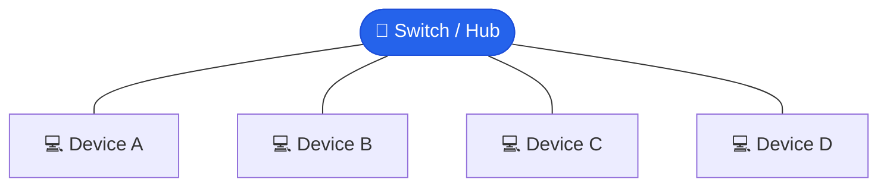
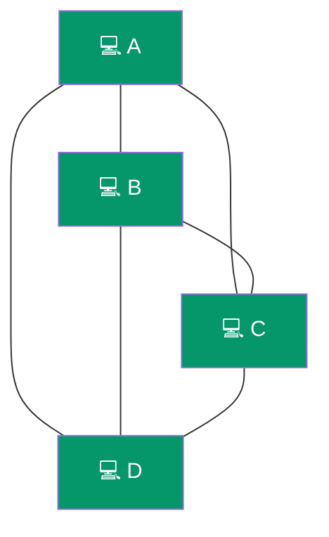

# Network Topologies and Architectures

## What You'll Learn

- The difference between physical and logical topologies
- Common network topologies: star, bus, ring, mesh, tree, hybrid
- Advantages and disadvantages of each topology
- Client-server vs peer-to-peer architecture
- How to choose the right topology for different scenarios
- Network design considerations for real-world deployments

## What is a Network Topology?

A **network topology** defines the arrangement of nodes (devices) and connections (links) in a network. It determines how data flows, how devices communicate, and how the network handles failures.

```
Topology affects:
- Performance     (speed, latency, bandwidth utilization)
- Reliability     (fault tolerance, redundancy)
- Scalability     (ease of adding new devices)
- Cost            (cabling, equipment, maintenance)
- Troubleshooting (ease of isolating problems)
```

## Physical vs Logical Topology

| Aspect | Physical Topology | Logical Topology |
|--------|-------------------|------------------|
| Definition | How devices are physically wired/connected | How data actually flows through the network |
| Focus | Cables, ports, physical layout | Data paths, protocols, communication patterns |
| Example | Star wiring to a switch | Ethernet broadcast behavior |
| Can differ? | Yes — physical and logical topologies can be different |

```
Example: A network may be physically wired as a STAR
         (all cables go to a central switch)
         but logically function as a BUS
         (data is broadcast to all ports on a hub)

Physical Layout:            Logical Data Flow:
      [A]                   [A]---[B]---[C]---[D]
       |                    (shared bus behavior)
  [B]--[Hub]--[C]
       |
      [D]
```

## Star Topology

The **most common** topology in modern LANs. All devices connect to a central node (switch or hub).



### Advantages

- **Easy to install and manage**: Add/remove devices without disrupting others
- **Easy troubleshooting**: Faulty device or cable affects only one connection
- **Centralized control**: Switch manages all traffic intelligently
- **Good performance**: Dedicated connection per device (with switches)
- **Scalable**: Add more ports or cascade switches

### Disadvantages

- **Single point of failure**: If the central switch fails, the entire network goes down
- **Cable cost**: Each device needs its own cable to the switch
- **Limited by central device**: Performance depends on switch capacity
- **Cable length limits**: Each cable run must reach the central device

### Use Cases

- Office LANs
- Home networks
- School computer labs
- Small to medium businesses

## Bus Topology

All devices connect to a single shared communication line (backbone cable). Data travels in both directions along the bus.

```
   |------|------|------|------|
   |      |      |      |      |
 [Dev A][Dev B][Dev C][Dev D]  |
   |                           |
   +--- Backbone Cable --------+
   |                           |
Terminator                 Terminator

- Data travels along the backbone
- All devices see all data
- Terminators prevent signal reflection
```

### Advantages

- **Low cost**: Minimal cabling required (single backbone)
- **Easy to set up**: Simple for small, temporary networks
- **Good for small networks**: Works well with few devices

### Disadvantages

- **Collision prone**: Only one device can transmit at a time
- **Difficult troubleshooting**: Hard to isolate faults on the backbone
- **Single point of failure**: If the backbone cable breaks, the entire network goes down
- **Performance degrades**: More devices = more collisions = slower network
- **Limited scalability**: Not suitable for large networks
- **Security concern**: All devices can see all traffic

### Use Cases

- Legacy networks (10BASE2, 10BASE5 Ethernet)
- Small temporary networks
- Lab environments for learning

## Ring Topology

Each device connects to exactly two other devices, forming a circular path. Data travels in one direction (unidirectional) or both directions (bidirectional).


### Token Ring

```
Token Passing Mechanism:

1. Empty token circulates: [TOKEN] → A → B → C → D → A
2. Device A wants to send: A captures token, attaches data
3. Data frame circulates: [A's DATA] → B → C → D
4. Destination D receives data, marks as received
5. Frame returns to A, A releases token
6. Empty token circulates again

Advantage: No collisions (only token holder can transmit)
```

### Advantages

- **No collisions**: Token passing ensures orderly access
- **Equal access**: Every device gets a fair chance to transmit
- **Predictable performance**: Deterministic data transfer
- **Works well under heavy load**: Better than bus under high traffic

### Disadvantages

- **Single point of failure**: One broken device/link can break the ring
- **Difficult to add/remove devices**: Requires breaking the ring temporarily
- **Slow troubleshooting**: Must trace the entire ring to find faults
- **Latency**: Data may need to pass through multiple devices
- **Mostly obsolete**: Replaced by star topology with switches

### Use Cases

- Legacy Token Ring networks (IBM)
- Some fiber optic networks (FDDI, SONET rings)
- Industrial control systems

## Mesh Topology

Every device connects to every other device (full mesh) or a subset of devices (partial mesh). Provides maximum redundancy.

### Full Mesh

Every device has a direct connection to every other device. Number of connections = n(n-1)/2 — so 4 devices = 6 connections, 10 devices = 45 connections.



### Partial Mesh

```
Partial Mesh (selective connections):

    [A] --------- [B]
    |               |
    |               |
    |               |
    [D] --------- [C]
          |
          |
         [E]

Not every device connects to every other device.
Critical paths have redundancy; less critical ones don't.
Balances redundancy with cost.
```

### Advantages

- **High redundancy**: Multiple paths between devices
- **Fault tolerant**: Network survives individual link/device failures
- **No traffic bottleneck**: Multiple simultaneous paths for data
- **Reliable**: Data can be rerouted if a path fails

### Disadvantages

- **Expensive**: Large number of cables and ports required
- **Complex**: Difficult to install, configure, and manage
- **Impractical at scale**: Full mesh becomes unmanageable with many devices
- **High cabling cost**: Especially for full mesh

### Use Cases

- **Full mesh**: WAN backbone connections, critical infrastructure, data center interconnects
- **Partial mesh**: Enterprise networks, ISP backbone, military networks

## Tree (Hierarchical) Topology

A combination of star topologies connected in a hierarchy. Common in larger organizations with multiple departments.

```
                    [Core Switch]
                   /             \
                  /               \
     [Distribution          [Distribution
      Switch 1]              Switch 2]
       /    \                  /    \
      /      \                /      \
 [Access  [Access       [Access  [Access
  Sw 1]    Sw 2]         Sw 3]    Sw 4]
  /|\       /|\           /|\       /|\
 / | \     / | \         / | \     / | \
[PCs]    [PCs]         [PCs]    [PCs]

Three-tier architecture:
1. Core Layer       - High-speed backbone
2. Distribution Layer - Policy, filtering, routing
3. Access Layer      - End-user connectivity
```

### Advantages

- **Scalable**: Easy to add branches (departments, floors)
- **Hierarchical management**: Different levels handle different functions
- **Structured**: Clear organizational layout
- **Fault isolation**: Problems in one branch don't affect others

### Disadvantages

- **Root dependency**: Failure at higher levels affects all downstream devices
- **Complex cabling**: More cables as hierarchy grows
- **Higher cost**: More switches and infrastructure
- **Backbone bottleneck**: Upper-level links carry aggregate traffic

### Use Cases

- Large office buildings
- University campuses
- Enterprise networks with multiple departments

## Hybrid Topology

Combines two or more different topologies to leverage their advantages while minimizing disadvantages.

```
Example: Star-Mesh Hybrid

  [Branch A - Star]     [Branch B - Star]
        |                      |
   [Switch A]             [Switch B]
        |                      |
        +--------[Mesh]--------+
        |       Backbone       |
   [Switch C]             [Switch D]
        |                      |
  [Branch C - Star]     [Branch D - Star]

Star topology at the access layer (simplicity)
Mesh topology at the core (redundancy)
```

### Advantages

- **Flexible**: Tailored to specific needs
- **Scalable**: Can grow in different ways per section
- **Reliable**: Mix redundancy where needed
- **Practical**: Reflects real-world network designs

### Disadvantages

- **Complex design**: Requires careful planning
- **Higher cost**: May need different equipment types
- **Harder troubleshooting**: Multiple topology types to understand
- **Documentation critical**: Must maintain clear network diagrams

### Use Cases

- Most real-world enterprise networks
- ISP networks
- Data center networks
- Campus networks

## Topology Comparison Table

| Topology | Cost | Scalability | Fault Tolerance | Performance | Complexity |
|----------|------|-------------|-----------------|-------------|------------|
| Star | Medium | High | Medium (central switch) | High | Low |
| Bus | Low | Low | Low | Low (collisions) | Low |
| Ring | Medium | Low | Low (single break) | Medium | Medium |
| Full Mesh | Very High | Low | Very High | Very High | Very High |
| Partial Mesh | High | Medium | High | High | High |
| Tree | Medium-High | High | Medium | Medium-High | Medium |
| Hybrid | Varies | High | High | High | High |

## Client-Server Architecture

A centralized model where servers provide resources and services, and clients consume them.

```
                    +------------+
                    |   Server   |
                    | (Database, |
                    |  Files,    |
                    |  Apps)     |
                    +-----+------+
                          |
             +------------+------------+
             |            |            |
        +----+----+  +----+----+  +----+----+
        | Client  |  | Client  |  | Client  |
        |  (PC)   |  | (Phone) |  | (Tablet)|
        +---------+  +---------+  +---------+

Clients REQUEST --> Server RESPONDS
```

### Characteristics

| Aspect | Detail |
|--------|--------|
| Control | Centralized at server |
| Security | Managed centrally, easier to enforce policies |
| Scalability | Add more clients easily; server scaling requires planning |
| Cost | Higher initial cost (dedicated server hardware) |
| Reliability | Server failure affects all clients |
| Management | Centralized backups, updates, user management |

### Examples

- Web browsing (browser = client, web server = server)
- Email (Outlook/Gmail = client, mail server = server)
- Online banking
- Enterprise applications (ERP, CRM)
- Cloud services (AWS, Azure, GCP)

## Peer-to-Peer (P2P) Architecture

A decentralized model where every node acts as both client and server.

```
    [Peer A] <-------> [Peer B]
       ^    \         /    ^
       |      \     /      |
       |        \ /        |
       |        / \        |
       |      /     \      |
       v    /         \    v
    [Peer D] <-------> [Peer C]

Every peer can:
- Share files (act as server)
- Download files (act as client)
- Route requests to other peers
```

### Characteristics

| Aspect | Detail |
|--------|--------|
| Control | Distributed across all peers |
| Security | Harder to enforce; each peer manages its own security |
| Scalability | Naturally scalable; each new peer adds resources |
| Cost | Lower (no dedicated server needed) |
| Reliability | No single point of failure |
| Management | Decentralized; harder to maintain consistency |

### Examples

- BitTorrent (file sharing)
- Blockchain networks (Bitcoin, Ethereum)
- Skype (older versions)
- LAN file sharing (Windows workgroups)

## Client-Server vs Peer-to-Peer

| Feature | Client-Server | Peer-to-Peer |
|---------|--------------|--------------|
| Architecture | Centralized | Decentralized |
| Cost | Higher (server hardware) | Lower |
| Security | Easier to manage | Harder to enforce |
| Scalability | Server bottleneck | Naturally scalable |
| Reliability | Single point of failure | No single point of failure |
| Performance | Depends on server capacity | Depends on peer availability |
| Management | Centralized, easier | Distributed, harder |
| Data Consistency | Easy to maintain | Difficult to maintain |
| Best For | Enterprises, web services | File sharing, blockchain |

## Network Design Considerations

When designing a network, consider these factors:

### 1. Scale and Growth

```
Questions to ask:
- How many devices now? In 1 year? In 5 years?
- How many locations/buildings?
- Expected traffic growth?

Small office (5-20 devices):
  Single switch, star topology

Medium office (20-200 devices):
  Multiple switches, tree topology, VLANs

Large enterprise (200+ devices):
  Hierarchical design, partial mesh core, redundancy
```

### 2. Redundancy Requirements

```
No Redundancy:          Single Redundancy:       Full Redundancy:
[A]---[Switch]---[B]    [A]---[Sw1]---[B]        [A]---[Sw1]---[B]
                              |                         |    X    |
                        [A]---[Sw2]---[B]        [A]---[Sw2]---[B]
                        (standby)                 (active-active)

Cost: $              Cost: $$               Cost: $$$
Uptime: 99%          Uptime: 99.9%          Uptime: 99.99%
```

### 3. Performance Requirements

```
Low bandwidth needs:        High bandwidth needs:
- Email, web browsing       - Video streaming
- 100 Mbps sufficient       - Database replication
                            - 1-10 Gbps required

Latency-sensitive:          Latency-tolerant:
- VoIP, video conferencing  - Email, file backup
- < 50ms required           - Seconds acceptable
```

### 4. Budget

| Budget Level | Recommended Approach |
|-------------|---------------------|
| Minimal | Star with unmanaged switches |
| Moderate | Star/tree with managed switches, basic redundancy |
| Enterprise | Hierarchical with partial mesh core, full redundancy |

### 5. Security

```
Security considerations per topology:
- Bus: All devices see all traffic (poor security)
- Star: Switch isolates traffic between ports (better)
- Mesh: Multiple paths may need securing (complex)

Additional measures:
- VLANs for network segmentation
- Firewalls at network boundaries
- Access control on switch ports
- Encryption for sensitive data
```

## Exercises

### Beginner
1. Draw a star topology with 6 devices and a central switch
2. Name the topology where all devices connect to a single backbone cable
3. List 3 advantages and 3 disadvantages of star topology
4. Which topology is most commonly used in modern office LANs? Why?

### Intermediate
5. A company has 3 branch offices, each with 30 PCs. Design a network topology that provides:
   - Local connectivity within each branch (star)
   - Redundant connections between branches (mesh)
   - Draw the diagram and explain your choices
6. Compare full mesh vs partial mesh for a network of 8 devices:
   - How many connections does full mesh require?
   - Suggest which connections to keep in partial mesh and justify
7. Explain with a diagram how a physical star topology can behave as a logical bus
8. A hospital network requires 99.99% uptime. Which topology would you recommend for the core network and why?

### Advanced
9. Design a three-tier hierarchical network for a university campus with:
   - 4 buildings, each with 3 floors
   - 50 devices per floor
   - Redundant core connections
   - Draw the complete topology diagram
10. Research and compare Spine-Leaf topology (used in modern data centers) with the traditional three-tier hierarchical design. What are the advantages?
11. A startup is choosing between client-server and P2P architecture for a video streaming application. Analyze the trade-offs and make a recommendation with justification
12. Calculate the total number of connections needed for full mesh topologies with 5, 10, 20, and 50 devices. At what point does full mesh become impractical? What alternatives exist?

## Key Takeaways

- Physical topology describes cabling; logical topology describes data flow
- Star topology is the most widely used in modern LANs due to simplicity and manageability
- Bus and ring topologies are mostly legacy but important to understand
- Mesh provides the highest redundancy but at the greatest cost
- Most real-world networks use hybrid topologies combining different approaches
- Client-server architecture centralizes control; P2P distributes it
- Network design must balance cost, performance, redundancy, scalability, and security
- The three-tier hierarchical model (core, distribution, access) is standard for enterprise networks

## Next Steps

Continue to [Network Devices](./05_network_devices.md) to learn about the hardware that makes these topologies work.

---

[← Previous: TCP/IP Model](./03_tcp_ip_model.md) | [Next: Network Devices →](./05_network_devices.md)
