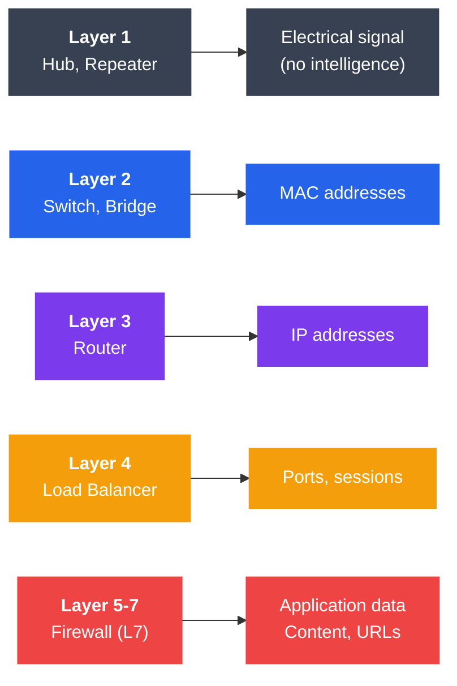
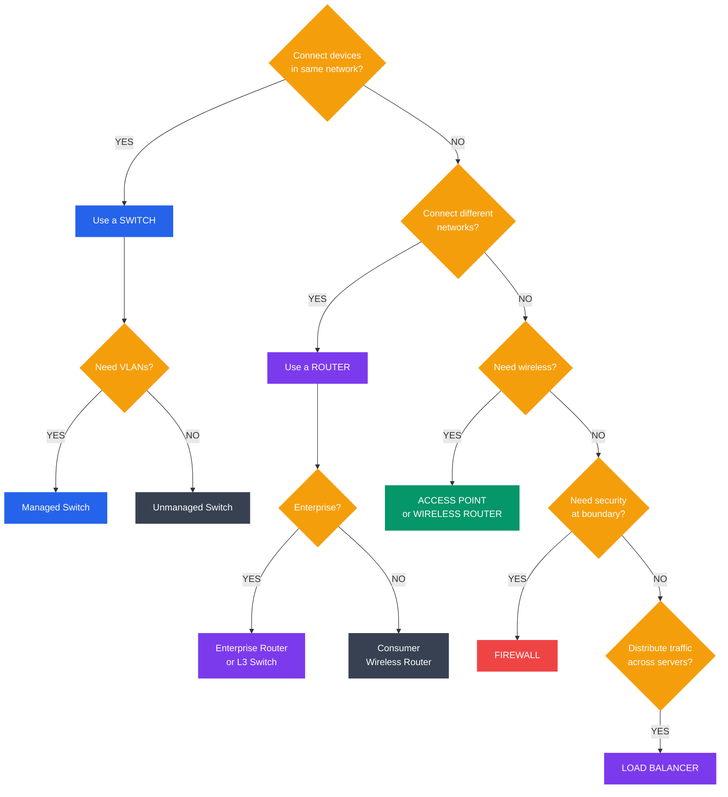

# Network Devices

## What You'll Learn

- The function and operation of core network devices (hubs, switches, routers)
- How switches use MAC address tables and VLANs
- How routers use routing tables and perform NAT
- Supporting devices: bridges, gateways, modems, access points
- Network security devices: firewalls and load balancers
- When to use each device and how they work at different OSI layers

## Overview of Network Devices

Network devices operate at specific layers of the OSI model. Understanding which layer a device operates at tells you what information it uses to make forwarding decisions.



```
OSI Layer         Device              Decision Based On
+-----------+     +-----------+       +-------------------+
| Layer 7   |     | Firewall  |       | Application data  |
| Layer 6   |     | (L7)      |       | Content, URLs     |
| Layer 5   |     |           |       |                   |
+-----------+     +-----------+       +-------------------+
| Layer 4   |     | Load      |       | Ports, sessions   |
|           |     | Balancer  |       |                   |
+-----------+     +-----------+       +-------------------+
| Layer 3   |     | Router    |       | IP addresses      |
+-----------+     +-----------+       +-------------------+
| Layer 2   |     | Switch    |       | MAC addresses     |
|           |     | Bridge    |       |                   |
+-----------+     +-----------+       +-------------------+
| Layer 1   |     | Hub       |       | Electrical signal |
|           |     | Repeater  |       | (no intelligence) |
+-----------+     +-----------+       +-------------------+
```

## Hub (Layer 1)

A hub is the simplest network device. It receives data on one port and broadcasts it to **all other ports**, regardless of the intended destination. Hubs operate at the Physical Layer and have no intelligence.

### How a Hub Works

```
Device A sends a frame to Device C:

[A]  [B]  [C]  [D]
 |    |    |    |
 +----+----+----+
      [HUB]

Step 1: A sends frame into hub on port 1
Step 2: Hub copies the electrical signal to ALL other ports
Step 3: B, C, and D all receive the frame
Step 4: Only C processes it (matching MAC); B and D discard it

Problem: Wastes bandwidth, creates collisions
```

### Collision Domain

```
With a Hub (single collision domain):

[A]--+
     |
[B]--[HUB]   If A and B transmit simultaneously = COLLISION
     |
[C]--+

All devices share one collision domain.
Only one device can transmit at a time (CSMA/CD).
```

### Characteristics

| Feature | Detail |
|---------|--------|
| OSI Layer | Layer 1 (Physical) |
| Intelligence | None — just repeats signals |
| Addressing | No addressing awareness |
| Collision Domain | Single (all ports share one) |
| Broadcast Domain | Single |
| Speed | Shared among all ports |
| Cost | Very low |
| Status | Obsolete — replaced by switches |

## Switch (Layer 2)

A switch is an intelligent device that learns which devices are on which ports and forwards frames only to the intended destination. It operates at the Data Link Layer using MAC addresses.

### How a Switch Works

```
Device A sends a frame to Device C:

[A]  [B]  [C]  [D]
 |    |    |    |
 +----+----+----+
     [SWITCH]

Step 1: A sends frame with destination MAC of C
Step 2: Switch checks its MAC address table
Step 3: Switch finds C is on port 3
Step 4: Switch forwards frame ONLY to port 3

Result: B and D never see the traffic (efficient!)
```

### MAC Address Table (CAM Table)

```
The switch learns MAC addresses by examining source MAC of incoming frames:

Frame arrives on Port 1 from MAC AA:AA:AA:AA:AA:AA
  → Switch records: Port 1 = AA:AA:AA:AA:AA:AA

MAC Address Table:
+------+---------------------+---------+
| Port | MAC Address          | VLAN    |
+------+---------------------+---------+
|  1   | AA:AA:AA:AA:AA:AA   | 10      |
|  2   | BB:BB:BB:BB:BB:BB   | 10      |
|  3   | CC:CC:CC:CC:CC:CC   | 20      |
|  4   | DD:DD:DD:DD:DD:DD   | 20      |
+------+---------------------+---------+

If destination MAC is unknown → switch FLOODS to all ports (except source)
If destination MAC is known  → switch FORWARDS to specific port
```

### VLANs (Virtual LANs)

VLANs logically segment a single physical switch into multiple isolated networks.

```
Without VLANs:                    With VLANs:
All devices on one network        Logically separated networks

[A][B][C][D][E][F]                VLAN 10 (Sales):  [A][B][C]
 | | | | | |                      VLAN 20 (Eng):    [D][E][F]
 +-+-+-+-+-+-+
    [SWITCH]                      Same physical switch, but:
                                  - A,B,C can't see D,E,F
All devices can                   - Separate broadcast domains
communicate freely                - Improved security

Trunk Port (carries multiple VLANs between switches):
[Switch 1] ===== Trunk (VLAN 10,20) ===== [Switch 2]
```

### Characteristics

| Feature | Detail |
|---------|--------|
| OSI Layer | Layer 2 (Data Link) |
| Intelligence | MAC address learning and forwarding |
| Addressing | MAC addresses |
| Collision Domain | One per port (each port is its own domain) |
| Broadcast Domain | One per VLAN |
| Speed | Dedicated bandwidth per port |
| Cost | Moderate |
| Status | Core device in modern LANs |

### Managed vs Unmanaged Switches

| Feature | Unmanaged | Managed |
|---------|-----------|---------|
| Configuration | None (plug and play) | Full configuration via CLI/GUI |
| VLANs | No | Yes |
| Monitoring | No | SNMP, port mirroring, logging |
| Security | Basic | Port security, ACLs, 802.1X |
| Cost | Low | Higher |
| Use Case | Home, small office | Enterprise networks |

## Router (Layer 3)

A router connects different networks and forwards packets based on IP addresses. It operates at the Network Layer and makes intelligent routing decisions.

### How a Router Works

```
Network A                                Network B
(192.168.1.0/24)                        (10.0.0.0/24)

[PC1]  [PC2]                            [Server1]  [Server2]
  |      |                                  |           |
  +------+                                  +-----------+
     |                                           |
  [Switch]                                    [Switch]
     |                                           |
     +--- Port 1 [ROUTER] Port 2 ---------------+
          192.168.1.1      10.0.0.1

Step 1: PC1 (192.168.1.10) sends packet to Server1 (10.0.0.5)
Step 2: Packet arrives at router on Port 1
Step 3: Router checks routing table for 10.0.0.5
Step 4: Routing table says 10.0.0.0/24 is on Port 2
Step 5: Router forwards packet out Port 2 to Server1
```

### Routing Table

```
$ ip route show   (or 'route print' on Windows)

Destination        Gateway         Interface    Metric
192.168.1.0/24     0.0.0.0         eth0         0      (directly connected)
10.0.0.0/24        0.0.0.0         eth1         0      (directly connected)
172.16.0.0/16      10.0.0.2        eth1         10     (via next-hop router)
0.0.0.0/0          203.0.113.1     eth2         100    (default route)

How routing decisions work:
1. Check for longest prefix match (most specific route)
2. If no specific route found, use default route (0.0.0.0/0)
3. If no default route, drop packet and send ICMP unreachable
```

### NAT (Network Address Translation)

NAT allows multiple devices on a private network to share a single public IP address.

```
Private Network              NAT Router              Internet

[PC1: 192.168.1.10] --+
                       |
[PC2: 192.168.1.20] --[Router]--- Public IP: 203.0.113.5 ---[Web Server]
                       |
[PC3: 192.168.1.30] --+

NAT Translation Table:
+-------------------+--------+-------------------+--------+
| Internal IP       | Int Port| External IP       | Ext Port|
+-------------------+--------+-------------------+--------+
| 192.168.1.10      | 50001  | 203.0.113.5       | 50001  |
| 192.168.1.20      | 50002  | 203.0.113.5       | 50002  |
| 192.168.1.30      | 50003  | 203.0.113.5       | 50003  |
+-------------------+--------+-------------------+--------+

Outgoing: Private IP → translated to Public IP
Incoming: Public IP  → translated back to Private IP
```

### Characteristics

| Feature | Detail |
|---------|--------|
| OSI Layer | Layer 3 (Network) |
| Intelligence | IP routing, path selection |
| Addressing | IP addresses |
| Collision Domain | Separates collision domains |
| Broadcast Domain | Separates broadcast domains |
| Features | NAT, ACLs, DHCP, firewall, QoS |
| Cost | Higher than switches |
| Use Case | Connecting different networks |

## Bridge (Layer 2)

A bridge connects two network segments and filters traffic based on MAC addresses. Bridges are the predecessors to switches.

```
Segment A           Bridge           Segment B
[A1]  [A2]      +----------+       [B1]  [B2]
  |     |       |          |         |     |
  +-----+-------+ Port   Port +-----+-----+
                | 1      2    |
                +----------+

- Bridge learns which MACs are on which segment
- Only forwards frames between segments when necessary
- Reduces collision domain (each segment is separate)
```

### Bridge vs Switch

| Feature | Bridge | Switch |
|---------|--------|--------|
| Ports | 2-4 typically | 8, 24, 48 or more |
| Processing | Software-based | Hardware-based (ASICs) |
| Speed | Slower | Much faster |
| Cost | Lower | Moderate |
| Status | Obsolete | Standard |

## Gateway

A gateway translates between different network protocols or architectures. It can operate at any OSI layer.

```
Network A (TCP/IP)        Gateway         Network B (SNA)
[PC] ----[Router]----[  Gateway  ]----[Mainframe]

The gateway translates:
- Protocol formats
- Data encoding
- Address schemes
- Communication methods

Common examples:
- Email gateway (SMTP to X.400)
- VoIP gateway (analog phone to IP)
- IoT gateway (Zigbee/BLE to TCP/IP)
- API gateway (REST to internal services)
```

## Modem (Modulator-Demodulator)

A modem converts digital signals to analog and vice versa, enabling data transmission over telephone lines, cable systems, or other analog media.

```
Digital Signal       Modem        Analog Signal       Modem        Digital Signal
(Computer)       (Modulation)    (Phone/Cable)    (Demodulation)    (Computer)

[PC] → 10110 → [Modem] → ∿∿∿∿∿ → [Phone Line] → ∿∿∿∿∿ → [Modem] → 10110 → [PC]

Types of Modems:
+------------+------------------+------------------+
| Type       | Medium           | Speed            |
+------------+------------------+------------------+
| Dial-up    | Phone line       | Up to 56 Kbps    |
| DSL        | Phone line       | 1-100 Mbps       |
| Cable      | Coaxial cable    | 10-1000 Mbps     |
| Fiber      | Fiber optic      | 100 Mbps-10 Gbps |
| Cellular   | Radio waves      | 1-1000 Mbps      |
+------------+------------------+------------------+
```

## Wireless Access Point (Layer 2)

An access point (AP) provides wireless connectivity, acting as a bridge between wireless devices and the wired network.

```
Wired Network          Access Point          Wireless Devices

[Router]               +------+              [Laptop]
   |                   |  AP  |)))))))       [Phone]
[Switch]----Ethernet---| (Wi-Fi|)))))))      [Tablet]
   |                   | Radio)|)))))))      [IoT Device]
[Server]               +------+

Access Point Functions:
- Broadcasts SSID (network name)
- Authenticates wireless clients (WPA2/WPA3)
- Converts wireless frames to wired Ethernet frames
- Manages wireless channels to reduce interference
- Supports multiple SSIDs (guest, corporate, IoT)
```

### AP vs Wireless Router

| Feature | Access Point | Wireless Router |
|---------|-------------|-----------------|
| Function | Wi-Fi bridge only | Router + Switch + AP combined |
| NAT | No | Yes |
| DHCP | No (usually) | Yes |
| Routing | No | Yes |
| Use Case | Enterprise (extend existing network) | Home/small office (all-in-one) |

## Firewall

A firewall monitors and controls network traffic based on security rules. Firewalls can operate at multiple OSI layers.

```
Trusted Network         Firewall          Untrusted Network
(Internal LAN)                             (Internet)

[PCs]                 +----------+
[Servers] ----[Switch]| FIREWALL |----[Router]----[Internet]
[Printers]            +----------+

Firewall examines traffic and applies rules:

Rule  Action  Source         Dest          Port    Protocol
1     ALLOW   Internal      Any           80,443  TCP    (web)
2     ALLOW   Internal      Any           53      UDP    (DNS)
3     ALLOW   Any           Mail Server   25      TCP    (email)
4     DENY    Any           Internal      23      TCP    (block telnet)
5     DENY    Any           Any           Any     Any    (default deny)

Rules are processed top-to-bottom; first match wins.
```

### Types of Firewalls

| Type | OSI Layer | Inspects | Performance |
|------|-----------|----------|-------------|
| Packet Filter | Layer 3-4 | IP addresses, ports | Very fast |
| Stateful | Layer 3-4 | Connection state + packets | Fast |
| Application (Proxy) | Layer 7 | Application data, content | Slower |
| Next-Gen (NGFW) | Layer 3-7 | Deep packet inspection, IDS/IPS | Moderate |

## Load Balancer

A load balancer distributes incoming network traffic across multiple servers to ensure availability and performance.

```
                        Load Balancer
Clients                 +----------+           Servers
                        |          |
[Client 1] ----+        |  Health  |        +---- [Server 1] (Active)
               |        |  Checks  |        |
[Client 2] ----[Router]-|  Traffic |--------+---- [Server 2] (Active)
               |        |  Distrib.|        |
[Client 3] ----+        |          |        +---- [Server 3] (Active)
                        +----------+

Load Balancing Algorithms:
1. Round Robin:      S1 → S2 → S3 → S1 → S2 → S3 ...
2. Least Connections: Send to server with fewest active connections
3. IP Hash:          Same client IP always goes to same server
4. Weighted:         Distribute based on server capacity weights
5. Health-Based:     Only send to healthy servers
```

### Layer 4 vs Layer 7 Load Balancing

| Feature | Layer 4 (Transport) | Layer 7 (Application) |
|---------|--------------------|-----------------------|
| Decision Based On | IP + port | URL, headers, cookies, content |
| Speed | Faster | Slower (more inspection) |
| Intelligence | Limited | Content-aware routing |
| SSL Termination | No (typically) | Yes |
| Use Case | Generic TCP/UDP balancing | HTTP routing, API gateways |
| Example | Balance all traffic to port 80 | Route /api to backend, /static to CDN |

## Layer 2 vs Layer 3 Device Comparison

| Feature | Layer 2 (Switch) | Layer 3 (Router) |
|---------|-----------------|------------------|
| Operates On | MAC addresses | IP addresses |
| Broadcast Domain | Single (per VLAN) | Separates broadcast domains |
| Speed | Wire speed (hardware) | Slightly slower (routing decisions) |
| Routing | No (within same network) | Yes (between networks) |
| VLANs | Can create VLANs | Can route between VLANs |
| NAT | No | Yes |
| Cost | Lower | Higher |
| Use Case | Within a LAN | Between LANs / to internet |

### Layer 3 Switches

Modern Layer 3 switches combine switching and routing in a single device.

```
Traditional Setup:               Layer 3 Switch:
[VLAN 10]--[Switch]--[Router]--[Switch]--[VLAN 20]

     Becomes:

[VLAN 10]--[Layer 3 Switch]--[VLAN 20]

Benefits:
- Faster inter-VLAN routing (hardware-based)
- Fewer devices to manage
- Lower latency
- Cost effective for large networks
```

## When to Use What Device



```
Decision Flow:

Need to connect devices in same network?
├── YES → Use a SWITCH
│         └── Need VLANs or management? → Managed Switch
│         └── Just basic connectivity?   → Unmanaged Switch
│
Need to connect different networks?
├── YES → Use a ROUTER
│         └── Home/small office?  → Consumer wireless router
│         └── Enterprise?         → Enterprise router or L3 switch
│
Need wireless connectivity?
├── YES → Enterprise: ACCESS POINT + existing switch/router
│         Home: WIRELESS ROUTER (all-in-one)
│
Need internet access?
├── YES → MODEM (ISP-provided or purchased)
│         └── Usually combined with router for home use
│
Need security at network boundary?
├── YES → FIREWALL
│         └── Small business: UTM (Unified Threat Management)
│         └── Enterprise: Next-Gen Firewall (NGFW)
│
Need to distribute traffic across servers?
├── YES → LOAD BALANCER
          └── Simple TCP: Layer 4 LB
          └── HTTP/content-aware: Layer 7 LB
```

## Practical Example: Small Office Network

```
[Internet]
    |
[ISP Modem]  (Layer 1 - signal conversion)
    |
[Firewall/Router]  (Layer 3 - routing, NAT, security)
    |
    +--[Managed Switch]  (Layer 2 - VLAN, MAC forwarding)
    |       |
    |       +--[AP1]  (Layer 2 - wireless bridge)
    |       |    |))) [Laptops, Phones]
    |       |
    |       +--[Workstation 1] (VLAN 10 - Staff)
    |       +--[Workstation 2] (VLAN 10 - Staff)
    |       +--[Printer]       (VLAN 10 - Staff)
    |       |
    |       +--[Server 1]     (VLAN 20 - Servers)
    |       +--[Server 2]     (VLAN 20 - Servers)
    |
    +--[AP2]  (VLAN 30 - Guest Wi-Fi)
         |))) [Guest devices]
```

## Exercises

### Beginner
1. What OSI layer does each device operate at: hub, switch, router?
2. Explain why a switch is preferred over a hub in modern networks
3. What is the purpose of a MAC address table in a switch?
4. Describe the difference between a collision domain and a broadcast domain

### Intermediate
5. A switch has 4 devices connected. Device A sends a frame to Device C:
   - If the switch has never seen Device C's MAC address, what happens?
   - If the switch knows Device C is on port 3, what happens?
   - Draw the traffic flow for both scenarios
6. Explain how NAT works with a diagram showing:
   - 3 private devices accessing the same web server
   - The NAT translation table entries
   - What the web server sees as the source address
7. Design a VLAN configuration for a company with these departments: Sales (10 PCs), Engineering (15 PCs), Management (5 PCs). Explain your VLAN IDs and why you separated them
8. Compare a Layer 2 switch and a Layer 3 switch. When would you choose one over the other?

### Advanced
9. A company has 200 employees across 3 floors. Design the complete network including:
   - Device selection for each floor and the server room
   - VLAN plan with inter-VLAN routing
   - Firewall placement and basic rule set
   - Redundancy for critical components
   - Draw the network diagram
10. Explain the security implications of each device type. How can an attacker exploit: (a) a hub, (b) an unmanaged switch, (c) a router with default credentials?
11. Research and compare hardware firewalls vs software firewalls vs cloud-based firewalls (e.g., AWS Security Groups). When is each appropriate?
12. Design a load-balanced web application architecture that handles 10,000 concurrent users. Include: load balancer type, number of servers, health check strategy, and failover mechanism

## Key Takeaways

- Hubs broadcast everything (Layer 1) — obsolete and replaced by switches
- Switches forward frames intelligently using MAC address tables (Layer 2)
- Routers connect different networks using IP routing tables (Layer 3)
- VLANs on switches logically segment a network without additional hardware
- NAT on routers allows private networks to share a single public IP
- Firewalls enforce security policies by filtering traffic based on rules
- Load balancers distribute traffic across servers for availability and performance
- Layer 3 switches combine switching and routing for faster inter-VLAN communication
- Device selection depends on network size, security needs, budget, and performance requirements

## Next Steps

Continue to [Data Transmission and Encoding](./06_data_transmission.md) to learn how data is physically transmitted across network media.

---

[← Previous: Network Topologies](./04_network_topologies.md) | [Next: Data Transmission →](./06_data_transmission.md)
