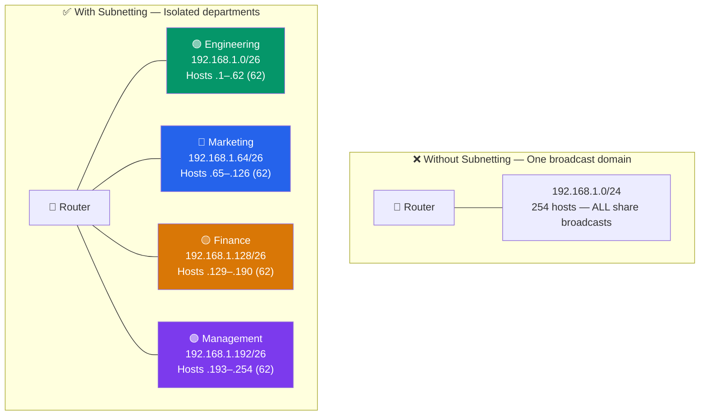

# Subnetting and CIDR

## What You'll Learn

- What subnetting is and why organizations divide networks into subnets
- How subnet masks work and how to interpret them
- CIDR notation and how it replaced classful addressing
- Step-by-step process for calculating network address, broadcast address, and host ranges
- How to solve subnetting problems systematically
- Variable Length Subnet Masks (VLSM) for efficient IP allocation
- Practical subnetting exercises with full solutions

## What is Subnetting?

**Subnetting** is the practice of dividing a single, large network into two or more smaller logical networks (subnets). Each subnet operates as an independent network within the larger address space.



### Why Subnet?

| Reason | Explanation |
|--------|-------------|
| **Reduced broadcast traffic** | Broadcasts stay within the subnet instead of flooding the entire network |
| **Improved security** | Subnets can be isolated with firewall rules and ACLs |
| **Easier management** | Smaller networks are simpler to monitor and troubleshoot |
| **Efficient IP usage** | Allocate only the addresses each department needs |
| **Performance** | Less congestion from reduced broadcast domains |

## Subnet Masks Explained

A **subnet mask** is a 32-bit number that separates the network portion of an IP address from the host portion. Bits set to `1` represent the network; bits set to `0` represent the host.

```
Common Subnet Masks:

Mask                Binary                              CIDR   Hosts
255.0.0.0           11111111.00000000.00000000.00000000  /8     16,777,214
255.255.0.0         11111111.11111111.00000000.00000000  /16    65,534
255.255.255.0       11111111.11111111.11111111.00000000  /24    254
255.255.255.128     11111111.11111111.11111111.10000000  /25    126
255.255.255.192     11111111.11111111.11111111.11000000  /26    62
255.255.255.224     11111111.11111111.11111111.11100000  /27    30
255.255.255.240     11111111.11111111.11111111.11110000  /28    14
255.255.255.248     11111111.11111111.11111111.11111000  /29    6
255.255.255.252     11111111.11111111.11111111.11111100  /30    2
```

### The Subnet Mask Rule

Subnet masks are always a **contiguous block of 1s followed by a contiguous block of 0s**. You will never see a valid mask like `255.255.0.255` because that would have a `0` gap in the middle.

## CIDR Notation

**CIDR** (Classless Inter-Domain Routing) replaced classful addressing in 1993. Instead of fixed class boundaries, CIDR uses a **prefix length** to specify how many bits are in the network portion.

```
Classful (old):     192.168.1.0   with mask 255.255.255.0
CIDR (modern):      192.168.1.0/24

The /24 means:      24 bits for network, 8 bits for hosts
                    11111111.11111111.11111111 | 00000000
                    ^^^^^^^^^^^^^^^^^^^^^^^^     ^^^^^^^^
                    Network (24 bits)            Host (8 bits)
```

### Why CIDR Matters

| Feature | Classful | CIDR |
|---------|----------|------|
| Network sizes | Only /8, /16, /24 | Any prefix from /0 to /32 |
| Flexibility | Must use entire class block | Allocate exactly what's needed |
| Routing table size | Larger (many routes) | Smaller (route aggregation/supernetting) |
| Address waste | Significant | Minimal |

## Calculating Network Details: Step-by-Step

Given an IP address and prefix length, here is how to determine every key detail about the subnet.

### Step-by-Step Method

**Given**: `192.168.1.130/26`

**Step 1: Determine the subnet mask**

```
/26 = 26 ones followed by 6 zeros
11111111.11111111.11111111.11000000
= 255.255.255.192
```

**Step 2: Find the block size (magic number)**

```
Block size = 256 - value of the interesting octet
Interesting octet = the last non-255 octet in the mask

Mask: 255.255.255.192
Interesting octet value: 192
Block size = 256 - 192 = 64
```

**Step 3: Find the network address**

```
Subnets start at multiples of the block size in the interesting octet:
0, 64, 128, 192

130 falls between 128 and 192, so:
Network address = 192.168.1.128
```

**Step 4: Find the broadcast address**

```
Broadcast = next network address - 1
Next network: 192.168.1.192
Broadcast:    192.168.1.191
```

**Step 5: Determine usable host range**

```
First host:  192.168.1.129  (network + 1)
Last host:   192.168.1.190  (broadcast - 1)
Total hosts: 2^6 - 2 = 62 usable hosts
```

**Summary**:

```
Given:             192.168.1.130/26
Subnet Mask:       255.255.255.192
Network Address:   192.168.1.128
Broadcast Address: 192.168.1.191
First Usable Host: 192.168.1.129
Last Usable Host:  192.168.1.190
Total Usable:      62 hosts
```

## Complete Subnetting Reference Table

| CIDR | Mask | Block Size | Usable Hosts | Subnets (from /24) |
|------|------|------------|--------------|---------------------|
| /24 | 255.255.255.0 | 256 | 254 | 1 |
| /25 | 255.255.255.128 | 128 | 126 | 2 |
| /26 | 255.255.255.192 | 64 | 62 | 4 |
| /27 | 255.255.255.224 | 32 | 30 | 8 |
| /28 | 255.255.255.240 | 16 | 14 | 16 |
| /29 | 255.255.255.248 | 8 | 6 | 32 |
| /30 | 255.255.255.252 | 4 | 2 | 64 |
| /31 | 255.255.255.254 | 2 | 2* | 128 |
| /32 | 255.255.255.255 | 1 | 1* | 256 |

> **/31** is a special case (RFC 3021) used for point-to-point links with no broadcast address. **/32** identifies a single host.

## Worked Examples

### Example 1: Subnet a /24 into Four Equal Subnets

**Goal**: Divide `10.0.0.0/24` into 4 subnets.

```
4 subnets requires 2 extra network bits (2^2 = 4)
New prefix: /24 + 2 = /26
Block size: 256 - 192 = 64

Subnet 1:  10.0.0.0/26    Hosts: 10.0.0.1   - 10.0.0.62    (62 hosts)
Subnet 2:  10.0.0.64/26   Hosts: 10.0.0.65  - 10.0.0.126   (62 hosts)
Subnet 3:  10.0.0.128/26  Hosts: 10.0.0.129 - 10.0.0.190   (62 hosts)
Subnet 4:  10.0.0.192/26  Hosts: 10.0.0.193 - 10.0.0.254   (62 hosts)
```

### Example 2: How Many Hosts in a /20?

```
/20 means 20 network bits, 12 host bits
Usable hosts = 2^12 - 2 = 4094

Mask: 255.255.240.0
      11111111.11111111.11110000.00000000
```

### Example 3: Real-World Office Subnet Design

```
Company has 192.168.10.0/24 and needs:
  - Engineering:  50 hosts
  - Sales:        20 hosts
  - Management:   10 hosts
  - Server VLAN:   5 hosts

Allocation (using VLSM for efficiency):

  Engineering:   192.168.10.0/26   (62 usable)  -- fits 50
  Sales:         192.168.10.64/27  (30 usable)  -- fits 20
  Management:    192.168.10.96/28  (14 usable)  -- fits 10
  Server VLAN:   192.168.10.112/29 ( 6 usable)  -- fits 5
  Remaining:     192.168.10.120 - 192.168.10.255 (available for growth)
```

## Variable Length Subnet Masks (VLSM)

**VLSM** allows you to use different subnet mask lengths within the same address space. This avoids wasting addresses by matching subnet sizes to actual needs.

```
Without VLSM (fixed /26 for all):
  4 subnets x 62 hosts each = 248 allocatable addresses
  But needs are: 50 + 20 + 10 + 5 = 85 hosts
  Wasted: 248 - 85 = 163 addresses

With VLSM (variable masks):
  /26 (62) + /27 (30) + /28 (14) + /29 (6) = 112 allocatable
  Wasted: 112 - 85 = 27 addresses (much better!)
```

### VLSM Rules

1. **Allocate largest subnets first** to maintain contiguous blocks
2. Subnets must **not overlap**
3. Each subnet must start on a valid **block boundary**
4. Always verify the next subnet starts after the previous one ends

### VLSM Step-by-Step

**Given**: `172.16.0.0/24`, create subnets for 100, 50, 25, and 2 hosts.

```
Step 1: Sort by size (largest first)
  100 hosts --> needs /25 (126 usable)
   50 hosts --> needs /26 (62 usable)
   25 hosts --> needs /27 (30 usable)
    2 hosts --> needs /30 (2 usable)

Step 2: Allocate sequentially
  172.16.0.0/25    (0 - 127)     100 hosts subnet
  172.16.0.128/26  (128 - 191)    50 hosts subnet
  172.16.0.192/27  (192 - 223)    25 hosts subnet
  172.16.0.224/30  (224 - 227)     2 hosts subnet (point-to-point link)

Step 3: Verify no overlaps
  Subnet 1 ends at .127, Subnet 2 starts at .128  OK
  Subnet 2 ends at .191, Subnet 3 starts at .192  OK
  Subnet 3 ends at .223, Subnet 4 starts at .224  OK
```

## Supernetting (Route Aggregation)

The opposite of subnetting -- combining multiple smaller networks into one larger route summary.

```
Before aggregation (4 routing table entries):
  192.168.0.0/24
  192.168.1.0/24
  192.168.2.0/24
  192.168.3.0/24

After aggregation (1 routing table entry):
  192.168.0.0/22   (covers .0.0 through .3.255)

This reduces routing table size and improves router performance.
```

## Quick-Reference Cheat Sheet

```
Prefix   Hosts    Block    Mask
/30      2        4        255.255.255.252    Point-to-point
/29      6        8        255.255.255.248    Tiny subnet
/28      14       16       255.255.255.240    Small office
/27      30       32       255.255.255.224    Department
/26      62       64       255.255.255.192    Floor/wing
/25      126      128      255.255.255.128    Building
/24      254      256      255.255.255.0      Standard LAN
/23      510      512      255.255.254.0      Large LAN
/22      1022     1024     255.255.252.0      Campus
/16      65534    65536    255.255.0.0        Enterprise
/8       16M+     16M+     255.0.0.0          Major network

Formula: Usable hosts = 2^(32 - prefix) - 2
```

## Exercises

### Beginner

1. What is the subnet mask for `/27`? How many usable hosts does it provide?

2. Given `10.1.1.50/24`, find:
   - Network address
   - Broadcast address
   - First and last usable host

3. How many subnets and hosts per subnet do you get when subnetting a `/24` into `/28` subnets?

### Intermediate

4. Given `172.16.50.130/21`, calculate:
   - Subnet mask in dotted decimal
   - Network address
   - Broadcast address
   - Usable host range
   - Total number of usable hosts

5. A company has `10.10.0.0/16` and needs 60 subnets. What prefix length should they use? How many hosts will each subnet support?

6. Design a VLSM addressing scheme for `192.168.5.0/24` with these departments:
   - HR: 25 hosts
   - IT: 50 hosts
   - Sales: 12 hosts
   - WAN links: 3 point-to-point links (2 hosts each)

### Advanced

7. An ISP has been allocated `200.100.0.0/22`. They need to assign /28 subnets to customers. How many customers can they serve? List the first 5 and last 2 subnet ranges.

8. Given these four routes, determine the supernet (aggregate route) that covers them all:
   - `10.1.0.0/24`
   - `10.1.1.0/24`
   - `10.1.2.0/24`
   - `10.1.3.0/24`

9. You manage a network `172.20.0.0/16` and must create a plan that supports: one /19 subnet, two /21 subnets, four /23 subnets, and eight /25 subnets. Show the complete allocation table with no overlaps.

### Solutions to Selected Problems

**Problem 4 Solution** (`172.16.50.130/21`):

```
/21 mask: 255.255.248.0
Binary mask: 11111111.11111111.11111000.00000000

Block size in 3rd octet: 256 - 248 = 8
50 falls in range 48-55 (48 is 6x8)

Network address:   172.16.48.0
Broadcast address: 172.16.55.255
First usable:      172.16.48.1
Last usable:       172.16.55.254
Total usable:      2^11 - 2 = 2046 hosts
```

## Key Takeaways

- Subnetting divides a large network into smaller, manageable segments
- The subnet mask determines the boundary between network and host bits
- CIDR notation (`/24`) replaces classful addressing for flexible allocation
- **Block size = 256 - mask value** is the key to quick subnetting calculations
- VLSM allows different-sized subnets within the same address block, reducing waste
- Supernetting (route aggregation) combines multiple routes into one summary route
- Usable hosts = 2^(host bits) - 2 (subtract network and broadcast addresses)

---

[← Previous: IP Addressing](./01_ip_addressing.md) | [Back to Network Layer](./README.md) | [Next: IPv4 vs IPv6 →](./03_ipv4_vs_ipv6.md)
