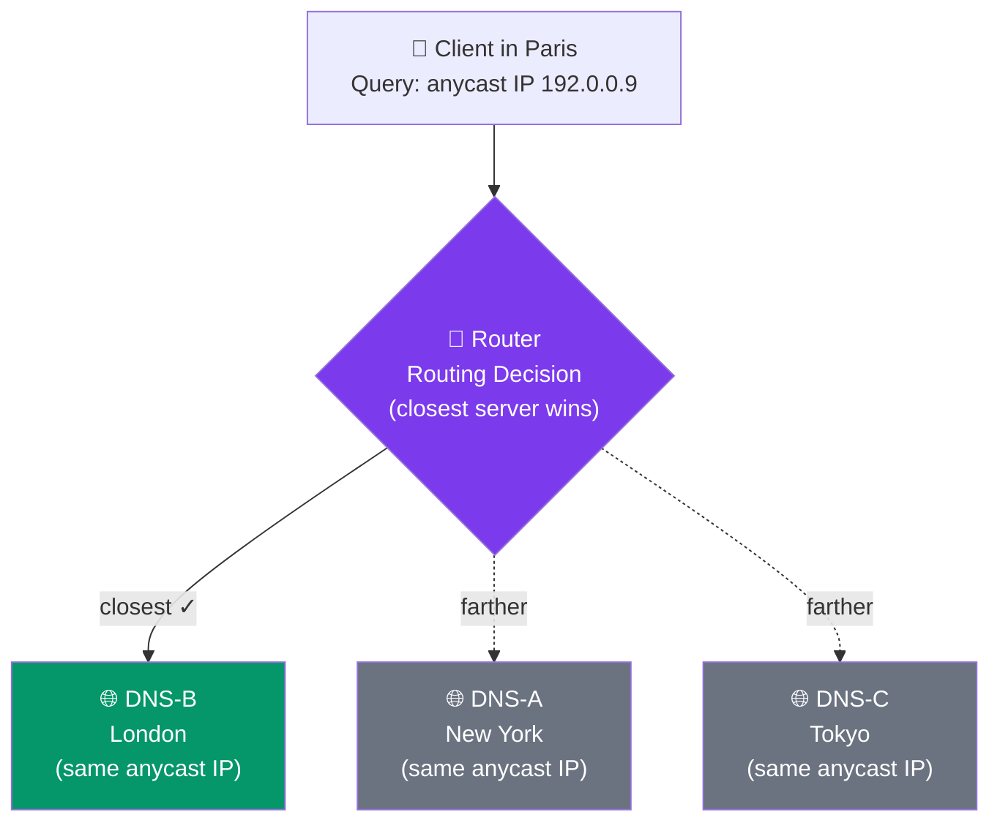
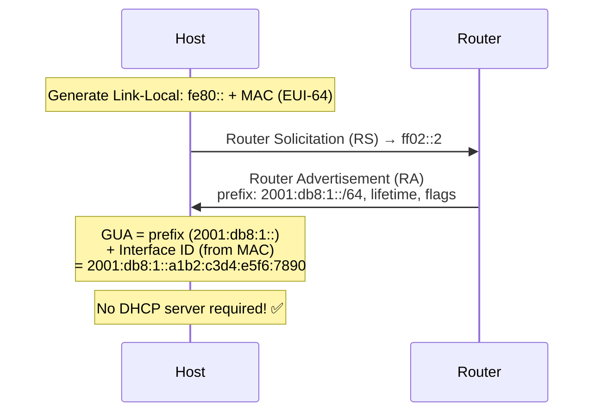
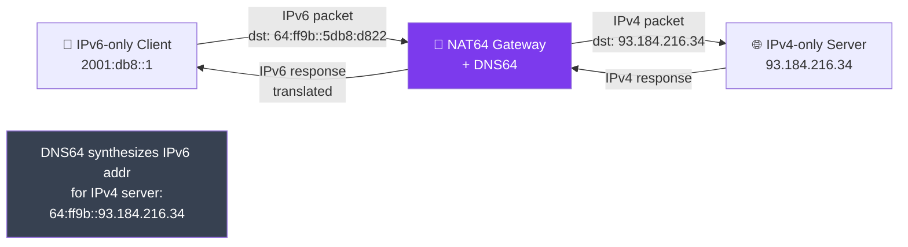

# IPv4 vs IPv6

## What You'll Learn

- Why IPv4 addresses are running out and what drove the creation of IPv6
- The structure and format of IPv6 addresses (128-bit, hexadecimal)
- IPv6 address types: unicast, multicast, and anycast
- A detailed comparison of IPv4 and IPv6 headers, addressing, and features
- Transition mechanisms for moving from IPv4 to IPv6 (dual stack, tunneling, NAT64)
- IPv6 address shortening and expansion rules

## The IPv4 Exhaustion Problem

IPv4 uses **32-bit addresses**, providing approximately **4.3 billion** unique addresses. That seemed like plenty in the 1980s, but:

```
IPv4 Address Space Timeline:

  1981: IPv4 defined (RFC 791)         ~4.3 billion addresses
  1990s: Internet boom begins          Addresses depleting rapidly
  1998: IPv6 defined (RFC 2460)        Solution designed
  2011: IANA exhausts top-level pool   Last /8 blocks allocated to RIRs
  2015-2019: Regional exhaustion       Asia-Pacific, Europe, Americas run out
  2020s: IPv4 addresses traded         Market price ~$40-50 per address

  Devices in 2025: ~30+ billion connected devices worldwide
  IPv4 capacity:   ~4.3 billion addresses
  Gap:             Enormous
```

**Stopgap measures** like NAT and private addressing helped, but they add complexity and break end-to-end connectivity. IPv6 is the real solution.

## IPv6 Address Format

IPv6 uses **128-bit addresses**, written as eight groups of four hexadecimal digits separated by colons.

```
Full IPv6 Address:

  2001:0db8:85a3:0000:0000:8a2e:0370:7334

  |    |    |    |    |    |    |    |    |
  Group1  Group2  Group3  Group4  Group5  Group6  Group7  Group8
  (16b)   (16b)   (16b)   (16b)   (16b)   (16b)   (16b)   (16b)

  Total: 16 bits x 8 groups = 128 bits
```

### Address Space Comparison

```
IPv4:   2^32  =                       4,294,967,296 addresses
IPv6:   2^128 = 340,282,366,920,938,463,463,374,607,431,768,211,456 addresses

That is approximately 340 undecillion (3.4 x 10^38) addresses.

To put it in perspective:
  - Enough for ~6.7 x 10^23 addresses per square meter of Earth's surface
  - Every grain of sand on Earth could have billions of addresses
```

## IPv6 Address Shortening Rules

Writing full IPv6 addresses is cumbersome. Two rules simplify them:

### Rule 1: Remove Leading Zeros in Each Group

```
Full:        2001:0db8:0000:0042:0000:0000:0000:0001
Shortened:   2001: db8:   0:  42:   0:   0:   0:   1
Result:      2001:db8:0:42:0:0:0:1
```

### Rule 2: Replace ONE Consecutive Group of All-Zero Groups with ::

```
Before:      2001:db8:0:42:0:0:0:1
After:       2001:db8:0:42::1

The :: replaces the longest run of consecutive zero groups.
```

### Important Restrictions

- You can only use `::` **once** per address (otherwise it becomes ambiguous)
- Choose the **longest** run of zeros; if tied, use the **leftmost**

```
Examples:

  Full:       2001:0db8:0000:0000:0000:0000:0000:0001
  Shortened:  2001:db8::1

  Full:       fe80:0000:0000:0000:0000:0000:0000:0001
  Shortened:  fe80::1

  Full:       0000:0000:0000:0000:0000:0000:0000:0001  (loopback)
  Shortened:  ::1

  Full:       0000:0000:0000:0000:0000:0000:0000:0000  (unspecified)
  Shortened:  ::
```

### Expanding a Shortened Address

To expand `2001:db8::42:1`, count existing groups and fill the gap with zeros:

```
2001:db8::42:1 has 4 groups visible (2001, db8, 42, 1)
IPv6 needs 8 groups, so :: represents 4 groups of 0000

Expanded: 2001:0db8:0000:0000:0000:0000:0042:0001
```

## IPv6 Address Types

IPv6 has three main address types (no broadcast -- multicast replaces it):

### 1. Unicast

Identifies a **single interface**. Packets sent to a unicast address go to exactly one destination.

```
Types of Unicast Addresses:

  Global Unicast (GUA):     2000::/3         Public, routable (like IPv4 public)
  Link-Local:               fe80::/10        Auto-configured, single link only
  Unique Local (ULA):       fc00::/7         Private, not routable (like RFC 1918)
  Loopback:                 ::1              Same as 127.0.0.1 in IPv4
  Unspecified:              ::               Same as 0.0.0.0 in IPv4
```

### 2. Multicast

Identifies a **group of interfaces**. A packet sent to a multicast address is delivered to all members of the group.

```
Multicast Address Range:    ff00::/8

Common Multicast Addresses:
  ff02::1    All nodes on local link        (like 255.255.255.255)
  ff02::2    All routers on local link
  ff02::1:ff All solicited-node multicast   (used by NDP)
```

### 3. Anycast

Identifies a **group of interfaces**, but a packet is delivered to only the **nearest** member (by routing metric). Used for load balancing and redundancy.



## IPv4 vs IPv6 Comparison

### Header Comparison

```
IPv4 Header (20-60 bytes, variable):           IPv6 Header (40 bytes, fixed):
+-------+------+-------------+------+          +-------+--------+------+------+
|Version| IHL  |  TOS/DSCP   |Length|          |Version|Traffic | Flow Label   |
+-------+------+-------------+------+          +-------+--------+------+------+
| Identification  |Flags|Frag Offset|          | Payload Length  |NextHdr| Hop |
+-----------------+-----+----------+          +-----------------+-------+-----+
| TTL   |Protocol|Header Checksum  |          |                               |
+-------+--------+-----------------+          |       Source Address           |
|       Source Address              |          |         (128 bits)            |
+-----------------------------------+          |                               |
|     Destination Address           |          +-------------------------------+
+-----------------------------------+          |                               |
|      Options (if any)             |          |     Destination Address       |
+-----------------------------------+          |         (128 bits)            |
                                               |                               |
                                               +-------------------------------+

IPv4: 13+ fields, variable length, has checksum
IPv6:  8 fields, fixed length, no checksum (handled by upper layers)
```

### Feature-by-Feature Comparison

| Feature | IPv4 | IPv6 |
|---------|------|------|
| **Address size** | 32 bits | 128 bits |
| **Address count** | ~4.3 billion | ~3.4 x 10^38 |
| **Notation** | Dotted decimal (192.168.1.1) | Colon hexadecimal (2001:db8::1) |
| **Header size** | 20-60 bytes (variable) | 40 bytes (fixed) |
| **Header checksum** | Yes | No (faster processing) |
| **Fragmentation** | Routers and sender | Sender only (Path MTU Discovery) |
| **Broadcast** | Yes | No (replaced by multicast) |
| **ARP** | Yes (Address Resolution Protocol) | No (replaced by NDP) |
| **Auto-configuration** | DHCP required | SLAAC built-in + optional DHCPv6 |
| **IPSec** | Optional | Mandatory in specification |
| **NAT** | Widely used | Not needed (enough addresses) |
| **QoS** | TOS field (limited) | Flow Label field (improved) |
| **Mobile support** | Limited (Mobile IP) | Built-in (Mobile IPv6) |

### Auto-Configuration: SLAAC

IPv6 introduced **SLAAC** (Stateless Address Auto-Configuration), allowing hosts to automatically generate their own address without a DHCP server.



## Transition Mechanisms

The internet cannot switch from IPv4 to IPv6 overnight. Several transition strategies allow both to coexist.

### 1. Dual Stack

Run **both IPv4 and IPv6** simultaneously on the same device and network.

```
Dual Stack Host:

  +-------------------+
  |   Application     |
  +-------------------+
  |    TCP / UDP       |
  +---+----------+----+
  |IPv4|         |IPv6|
  +----+         +----+
  |   Network Interface|
  +-------------------+

  - Host has both an IPv4 and IPv6 address
  - Chooses protocol based on destination
  - Most common transition method today
```

**Pros**: Straightforward, full compatibility
**Cons**: Must maintain two protocol stacks, two sets of routing

### 2. Tunneling (6in4, 6to4, Teredo)

Encapsulate **IPv6 packets inside IPv4 packets** to traverse IPv4-only networks.

```
Tunneling:

  [IPv6 Host] --> [Tunnel Endpoint A] ====IPv4 Network==== [Tunnel Endpoint B] --> [IPv6 Host]

  Packet structure in the tunnel:
  +------------------+------------------+------------------+
  |   IPv4 Header    |   IPv6 Header    |     Payload      |
  +------------------+------------------+------------------+
  (outer)             (inner, encapsulated)
```

**Pros**: Works over existing IPv4 infrastructure
**Cons**: Overhead, potential security issues, debugging complexity

### 3. NAT64 / DNS64

Translates between IPv6 and IPv4, allowing IPv6-only hosts to reach IPv4-only servers.



**Pros**: IPv6-only clients can reach IPv4 content
**Cons**: Complexity, some protocols break, stateful translation

### Transition Comparison

| Method | Complexity | Use Case | Limitation |
|--------|------------|----------|------------|
| Dual Stack | Low | General-purpose, most common today | Requires IPv4 addresses |
| Tunneling | Medium | Connecting IPv6 islands over IPv4 | Overhead, MTU issues |
| NAT64/DNS64 | High | IPv6-only networks reaching IPv4 | Breaks some apps, stateful |

## IPv6 in Practice

### Checking IPv6 on Your System

```bash
# Linux
$ ip -6 addr show
2: eth0: <BROADCAST,MULTICAST,UP>
    inet6 2001:db8:1::100/64 scope global
    inet6 fe80::1a2b:3c4d:5e6f/64 scope link

# Windows
> ipconfig
Ethernet adapter:
   IPv6 Address. . . . . . . : 2001:db8:1::100
   Link-local IPv6 Address . : fe80::1a2b:3c4d:5e6f%12

# macOS
$ ifconfig en0 | grep inet6
inet6 fe80::1a2b:3c4d:5e6f%en0 prefixlen 64 scopeid 0x4
inet6 2001:db8:1::100 prefixlen 64
```

### Testing IPv6 Connectivity

```bash
# Ping using IPv6 (note: ping6 on some systems)
$ ping -6 google.com
$ ping6 ::1               # Loopback

# Traceroute via IPv6
$ traceroute -6 google.com
$ traceroute6 google.com   # Some Linux systems

# Curl with IPv6
$ curl -6 http://ipv6.google.com
```

## Exercises

### Beginner

1. Shorten the following IPv6 addresses:
   - `2001:0db8:0000:0000:0000:0000:0000:0001`
   - `fe80:0000:0000:0000:02aa:00ff:fe28:9c5a`
   - `0000:0000:0000:0000:0000:0000:0000:0000`

2. Expand the following shortened IPv6 addresses:
   - `::1`
   - `2001:db8::42`
   - `fe80::1`

3. For each address, identify whether it is unicast, multicast, or anycast:
   - `ff02::1`
   - `2001:db8::1`
   - `fe80::1`

### Intermediate

4. Explain why IPv6 eliminated the header checksum. What layer handles error detection instead?

5. A network administrator is migrating a small office from IPv4 to IPv6. The office has 50 devices. Which transition mechanism would you recommend and why?

6. Compare how address resolution works in IPv4 (ARP) versus IPv6 (NDP/Neighbor Solicitation). What advantage does the IPv6 approach have?

### Advanced

7. Research the current state of IPv6 adoption worldwide. Which countries lead in adoption? What percentage of Google's traffic is IPv6? What are the main barriers to full adoption?

8. Design an IPv6 addressing plan for a company with 3 branch offices. The ISP assigns `2001:db8:abcd::/48`. Allocate a /64 to each department (Engineering, Sales, Management, IT) in each branch. Show the full plan.

9. Explain the security implications of transitioning from IPv4 with NAT to IPv6 with globally routable addresses. How should firewall policies change?

## Key Takeaways

- IPv4's 4.3 billion addresses are exhausted; IPv6 provides 3.4 x 10^38 addresses
- IPv6 addresses are 128 bits written in colon-separated hexadecimal groups
- Two shortening rules: drop leading zeros, replace the longest zero-group run with `::`
- IPv6 removes broadcast (replaced by multicast), ARP (replaced by NDP), and header checksum
- SLAAC allows IPv6 hosts to auto-configure without DHCP
- Dual stack is the most common transition mechanism; tunneling and NAT64 handle edge cases
- IPSec support is mandatory in the IPv6 specification, improving baseline security

---

[← Previous: Subnetting and CIDR](./02_subnetting_and_cidr.md) | [Back to Network Layer](./README.md) | [Next: Routing Fundamentals →](./04_routing_fundamentals.md)
