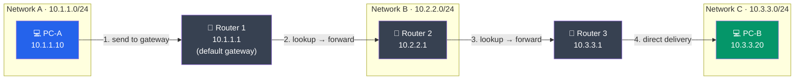

# Routing Fundamentals

## What You'll Learn

- What routing is and the role of routers in packet delivery
- The difference between static and dynamic routing
- How to read and interpret a routing table
- What a default gateway is and why every host needs one
- Hop counts, metrics, and how routers choose the best path
- Direct delivery vs indirect delivery
- How to view and manipulate routes on Linux and Windows

## What is Routing?

**Routing** is the process of selecting a path for network traffic across one or more networks. A **router** examines the destination IP address of each incoming packet and determines where to forward it next.



### Key Concepts

| Term | Definition |
|------|------------|
| **Routing** | Choosing the best path to forward a packet toward its destination |
| **Forwarding** | The actual act of moving the packet from an input interface to an output interface |
| **Router** | A device that connects multiple networks and routes traffic between them |
| **Routing table** | A data structure in the router listing known networks and how to reach them |
| **Next hop** | The IP address of the next router along the path to the destination |

## Direct vs Indirect Delivery

When a router receives a packet, it makes a fundamental decision:

### Direct Delivery

The destination is on a **directly connected network**. The router delivers the packet straight to the host.

```
Direct Delivery:

  [Host A] ---> [Router] ---> [Host B]
  10.1.1.10    10.1.1.1      10.1.1.20

  Both hosts are on 10.1.1.0/24.
  Router sees destination 10.1.1.20 is on its own interface.
  Delivers directly using Layer 2 (MAC address).
```

### Indirect Delivery

The destination is on a **remote network**. The router forwards the packet to the next router (next hop) along the path.

```
Indirect Delivery:

  [Host A] ---> [Router 1] ---> [Router 2] ---> [Host B]
  10.1.1.10    10.1.1.1        10.2.2.1         10.2.2.20

  Host A is on 10.1.1.0/24, Host B is on 10.2.2.0/24.
  Router 1 does not have Host B on a directly connected network.
  Router 1 forwards to Router 2 (next hop) for indirect delivery.
  Router 2 delivers directly to Host B.
```

## The Default Gateway

The **default gateway** is the router IP address that a host uses when the destination is not on its local network. It is the "way out" to the rest of the network.

```
Host Configuration:

  IP Address:      192.168.1.100
  Subnet Mask:     255.255.255.0
  Default Gateway: 192.168.1.1      <-- the local router

  When the host wants to reach:
    192.168.1.50  --> Same network, deliver directly (ARP for MAC)
    8.8.8.8       --> Different network, send to default gateway (192.168.1.1)
```

### How a Host Decides

```
Destination: 8.8.8.8

Step 1: Apply subnet mask to MY address and DESTINATION address
  My IP AND mask:    192.168.1.100 AND 255.255.255.0 = 192.168.1.0
  Dest IP AND mask:  8.8.8.8       AND 255.255.255.0 = 8.8.8.0

Step 2: Compare network addresses
  192.168.1.0  !=  8.8.8.0   -->  Different network!

Step 3: Send to default gateway (192.168.1.1)
```

## Routing Tables

A **routing table** is a database in every router (and host) that maps destination networks to next hops and output interfaces.

### Routing Table Components

| Column | Meaning |
|--------|---------|
| **Destination** | The target network (or host) |
| **Netmask/Prefix** | The subnet mask for the destination |
| **Gateway/Next Hop** | IP of the next router (or 0.0.0.0 for direct) |
| **Interface** | The local interface to send the packet out of |
| **Metric** | Cost or preference for this route (lower is better) |

### Reading a Linux Routing Table

```bash
$ ip route show
default via 192.168.1.1 dev eth0 proto dhcp metric 100
10.0.0.0/8 via 10.1.1.1 dev eth1 metric 200
192.168.1.0/24 dev eth0 proto kernel scope link src 192.168.1.100
172.16.0.0/16 via 192.168.1.254 dev eth0 metric 50
```

Breaking down each line:

```
default via 192.168.1.1 dev eth0 proto dhcp metric 100
  |       |                |       |           |
  |       Next hop         |       Source      Cost
  Default route            Interface
  (matches everything)     (send out eth0)

192.168.1.0/24 dev eth0 proto kernel scope link src 192.168.1.100
  |              |                          |
  Destination    Interface                  My IP on this network
  (directly connected -- no next hop needed)
```

### Reading a Windows Routing Table

```cmd
> route print
===========================================================================
Active Routes:
Network Destination    Netmask          Gateway       Interface    Metric
          0.0.0.0      0.0.0.0      192.168.1.1    192.168.1.100     25
       10.0.0.0      255.0.0.0       10.1.1.1       10.1.1.100     30
     192.168.1.0    255.255.255.0    On-link      192.168.1.100    281
     192.168.1.100  255.255.255.255  On-link      192.168.1.100    281
   192.168.1.255    255.255.255.255  On-link      192.168.1.100    281
===========================================================================
```

> **"On-link"** means the network is directly connected -- no gateway is needed.

## Static vs Dynamic Routing

### Static Routing

Routes are **manually configured** by an administrator. They do not change unless manually updated.

```bash
# Linux: Add a static route
$ sudo ip route add 10.20.0.0/16 via 192.168.1.254 dev eth0

# Windows: Add a static route
> route add 10.20.0.0 mask 255.255.0.0 192.168.1.254

# Linux: Delete a static route
$ sudo ip route del 10.20.0.0/16

# Linux: Add a default route
$ sudo ip route add default via 192.168.1.1 dev eth0
```

### Dynamic Routing

Routes are **automatically learned** from other routers using routing protocols (RIP, OSPF, BGP).

```
Dynamic Routing:

  [Router A]  <--routing updates-->  [Router B]  <--routing updates-->  [Router C]
     |                                  |                                  |
  10.1.0.0/16                       10.2.0.0/16                       10.3.0.0/16

  Routers exchange information about the networks they know.
  If a link fails, routers automatically recalculate paths.
```

### Comparison

| Feature | Static Routing | Dynamic Routing |
|---------|---------------|-----------------|
| **Configuration** | Manual | Automatic via protocols |
| **Scalability** | Poor (impractical for large networks) | Excellent |
| **Convergence** | No auto-recovery | Adapts to topology changes |
| **CPU/Memory** | Minimal | Higher (protocol overhead) |
| **Security** | More secure (no protocol to exploit) | Routing protocols can be attacked |
| **Best for** | Small networks, stub networks, default routes | Medium to large networks, redundant paths |

## Hop Count and Metrics

### Hop Count

Each router a packet passes through is one **hop**. Hop count is the simplest routing metric.

```
Path from A to D:

  [A] ---> [R1] ---> [R2] ---> [R3] ---> [D]
       hop 1     hop 2     hop 3

  Hop count = 3

  Alternative path:
  [A] ---> [R4] ---> [D]
       hop 1     hop 2

  Hop count = 2  (preferred by hop-count metrics)
```

### Routing Metrics

Different routing protocols use different metrics to determine the "best" path:

| Metric | Description | Used By |
|--------|-------------|---------|
| **Hop count** | Number of routers traversed | RIP |
| **Bandwidth** | Link capacity (higher is better) | EIGRP, OSPF (as cost) |
| **Delay** | Time to traverse the link | EIGRP |
| **Cost** | Arbitrary value, often inverse of bandwidth | OSPF |
| **Reliability** | Error rate of the link | EIGRP |
| **Load** | Current traffic utilization | EIGRP |

### Longest Prefix Match

When multiple routes match a destination, the router selects the one with the **longest prefix** (most specific match):

```
Routing Table:
  10.0.0.0/8       via Router A
  10.1.0.0/16      via Router B
  10.1.1.0/24      via Router C

Destination: 10.1.1.50

  10.0.0.0/8     matches (8-bit match)
  10.1.0.0/16    matches (16-bit match)
  10.1.1.0/24    matches (24-bit match)   <-- WINNER (longest match)

Packet is forwarded via Router C.
```

## Route Command Examples

### Linux

```bash
# View the routing table
$ ip route show
$ route -n                    # Legacy command, numeric output

# Add a route to a specific network
$ sudo ip route add 172.16.0.0/12 via 10.0.0.1 dev eth0

# Add a default route
$ sudo ip route add default via 192.168.1.1

# Delete a route
$ sudo ip route del 172.16.0.0/12

# Replace an existing route
$ sudo ip route replace 172.16.0.0/12 via 10.0.0.2 dev eth0

# Show route for a specific destination
$ ip route get 8.8.8.8
8.8.8.8 via 192.168.1.1 dev eth0 src 192.168.1.100
```

### Windows

```cmd
REM View the routing table
> route print

REM Add a persistent static route
> route -p add 172.16.0.0 mask 255.240.0.0 10.0.0.1

REM Delete a route
> route delete 172.16.0.0

REM Show route for a specific destination
> route print 172.16.*

REM Modify an existing route
> route change 172.16.0.0 mask 255.240.0.0 10.0.0.2
```

### macOS

```bash
# View routing table
$ netstat -rn

# Add a route
$ sudo route add -net 172.16.0.0/12 10.0.0.1

# Delete a route
$ sudo route delete -net 172.16.0.0/12

# Show route to destination
$ route get 8.8.8.8
```

## How a Router Processes a Packet

```
Packet Arrives at Router:

  +--------------------------------------------------+
  | 1. Receive packet on incoming interface           |
  +--------------------------------------------------+
               |
               v
  +--------------------------------------------------+
  | 2. Decrement TTL (Time to Live) by 1              |
  |    If TTL = 0, drop packet, send ICMP Time        |
  |    Exceeded back to source                        |
  +--------------------------------------------------+
               |
               v
  +--------------------------------------------------+
  | 3. Look up destination IP in routing table        |
  |    Use longest prefix match                       |
  +--------------------------------------------------+
               |
               v
  +--------------------------------------------------+
  | 4. Determine next hop and output interface        |
  +--------------------------------------------------+
               |
               v
  +--------------------------------------------------+
  | 5. Rewrite Layer 2 header (new src/dst MAC)       |
  |    Recalculate checksums                          |
  +--------------------------------------------------+
               |
               v
  +--------------------------------------------------+
  | 6. Forward packet out the output interface        |
  +--------------------------------------------------+
```

> **Important**: Routers do NOT modify the source or destination IP addresses (unless performing NAT). They only change the Layer 2 (MAC) header at each hop.

## Exercises

### Beginner

1. What is the difference between routing and forwarding?

2. Given this routing table, where is a packet destined for `10.5.1.20` forwarded?
   ```
   Destination       Gateway        Interface
   10.0.0.0/8        192.168.1.254  eth0
   10.5.0.0/16       172.16.0.1     eth1
   10.5.1.0/24       172.16.0.5     eth2
   default           192.168.1.1    eth0
   ```

3. A host has IP `192.168.1.50/24` and default gateway `192.168.1.1`. For each destination, will the host deliver directly or via the gateway?
   - `192.168.1.100`
   - `10.0.0.1`
   - `192.168.1.1`
   - `8.8.8.8`

### Intermediate

4. Explain why a packet's TTL is decremented at each hop. What happens if it reaches zero? What problem does this prevent?

5. On a Linux machine, use `ip route get` to determine the path to the following destinations, and explain each output line:
   ```bash
   ip route get 127.0.0.1
   ip route get 8.8.8.8
   ip route get 192.168.1.1
   ```

6. A network has two paths to destination `10.20.0.0/16`:
   - Path A: 3 hops, each link is 100 Mbps
   - Path B: 2 hops, each link is 10 Mbps
   Which path would RIP choose? Which would OSPF choose? Explain why.

### Advanced

7. Design a static routing configuration for this topology. List the `ip route add` commands for each router:
   ```
   [LAN-A: 192.168.1.0/24] --- [R1] --- [R2] --- [LAN-B: 192.168.2.0/24]
                                 |
                                [R3]
                                 |
                            [LAN-C: 192.168.3.0/24]
   ```
   R1-R2 link: 10.0.12.0/30, R1-R3 link: 10.0.13.0/30

8. Explain the "counting to infinity" problem in distance-vector routing. How do split horizon and route poisoning help mitigate it?

9. Research and explain how routing works differently in Software-Defined Networking (SDN) compared to traditional distributed routing.

## Key Takeaways

- Routing is the process of selecting the best path for packets across networks
- Direct delivery occurs when the destination is on a locally connected network; otherwise, indirect delivery via next hops is used
- Every host needs a default gateway to reach networks beyond its own
- Routing tables map destination networks to next hops and output interfaces
- The **longest prefix match** rule determines which route wins when multiple entries match
- Static routes are manually configured; dynamic routes are learned via routing protocols
- Routers decrement the TTL at each hop to prevent infinite loops
- The `ip route` (Linux) and `route` (Windows) commands let you view and manage routes

---

[← Previous: IPv4 vs IPv6](./03_ipv4_vs_ipv6.md) | [Back to Network Layer](./README.md) | [Next: Routing Protocols →](./05_routing_protocols.md)
