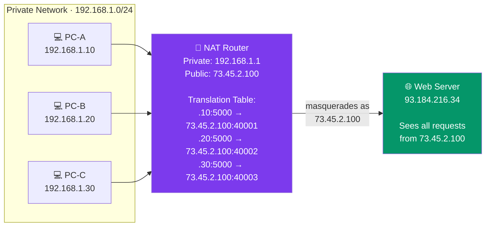

# NAT and Port Forwarding

## What You'll Learn

- What NAT is and why it was created to extend the life of IPv4
- The three types of NAT: Static NAT, Dynamic NAT, and PAT/NAPT
- How NAT works internally using translation tables
- What port forwarding is and how to configure it
- NAT traversal challenges and how protocols work around them
- Security implications of NAT (what it protects and what it does not)
- Practical port forwarding configuration examples

## What is NAT?

**NAT** (Network Address Translation) is a technique that modifies IP address information in packet headers as they pass through a router or firewall. It allows devices with **private IP addresses** to communicate with the **public internet** using a shared public IP address.



### Why NAT Exists

| Problem | How NAT Solves It |
|---------|-------------------|
| IPv4 address exhaustion | Multiple devices share one public IP |
| Cost | Organizations need fewer public IPs from their ISP |
| Security | Internal structure is hidden from the internet |
| Flexibility | Internal addressing can be redesigned without ISP coordination |

## Types of NAT

### 1. Static NAT (One-to-One)

Maps **one private IP** to **one public IP** permanently. The mapping never changes.

```
Static NAT Table:

  Private IP        <-->    Public IP
  ──────────────────────────────────────
  192.168.1.10      <-->    73.45.2.101
  192.168.1.20      <-->    73.45.2.102
  192.168.1.30      <-->    73.45.2.103

  Every internal host gets its own dedicated public IP.
  Connections work in BOTH directions (inbound and outbound).
```

**Use case**: Servers that need to be accessible from the internet (web servers, mail servers).

**Drawback**: Requires one public IP per internal host -- does not save addresses.

### 2. Dynamic NAT (Many-to-Pool)

Maps private IPs to public IPs from a **pool** on a first-come, first-served basis. Mappings are temporary.

```
Dynamic NAT:

  Pool of Public IPs: 73.45.2.101 - 73.45.2.110 (10 addresses)
  Internal hosts: 50 devices on 192.168.1.0/24

  When PC-A (192.168.1.10) initiates a connection:
    Router assigns 73.45.2.101 from the pool

  When PC-B (192.168.1.20) initiates a connection:
    Router assigns 73.45.2.102 from the pool

  If all 10 public IPs are in use, PC-K must WAIT.
  Mappings expire after a timeout period.
```

**Use case**: Organizations with more internal hosts than public IPs, where not all hosts need simultaneous access.

**Drawback**: If the pool is exhausted, new connections are blocked.

### 3. PAT / NAPT (Many-to-One)

**PAT** (Port Address Translation), also called **NAPT** (Network Address Port Translation) or **NAT overload**, maps many private IPs to a **single public IP** by using different **port numbers** to distinguish connections.

This is what your home router does.

```
PAT Translation Table:

  Internal                     External (on router's public IP)
  ─────────────────────────────────────────────────────────────
  192.168.1.10:45123    <-->   73.45.2.100:10001
  192.168.1.10:45124    <-->   73.45.2.100:10002
  192.168.1.20:52000    <-->   73.45.2.100:10003
  192.168.1.30:60100    <-->   73.45.2.100:10004

  All connections share 73.45.2.100 but use unique port numbers.
  Supports ~65,000 simultaneous connections per public IP.
```

**Use case**: Home networks, small businesses -- the vast majority of NAT deployments.

### NAT Type Comparison

| Feature | Static NAT | Dynamic NAT | PAT/NAPT |
|---------|-----------|-------------|----------|
| Mapping | 1 private : 1 public | Many : pool | Many : 1 |
| Address savings | None | Moderate | Maximum |
| Inbound connections | Yes (always mapped) | No (temporary maps) | No (requires port forwarding) |
| Typical use | Servers | Medium offices | Home/small networks |
| Scalability | Poor | Medium | Excellent |

## How NAT Works: Packet Flow

### Outbound (Private to Public)

```
Step-by-step PAT for an outbound web request:

  1. PC-A (192.168.1.10) sends a packet:
     Src: 192.168.1.10:45123  Dst: 93.184.216.34:80

  2. NAT Router receives on inside interface:
     Creates translation table entry:
       Inside:  192.168.1.10:45123
       Outside: 73.45.2.100:10001

     Rewrites packet:
     Src: 73.45.2.100:10001   Dst: 93.184.216.34:80

  3. Packet travels across the internet to the web server.

  4. Web server responds:
     Src: 93.184.216.34:80    Dst: 73.45.2.100:10001

  5. NAT Router receives response, looks up table:
     Port 10001 maps to 192.168.1.10:45123

     Rewrites packet:
     Src: 93.184.216.34:80    Dst: 192.168.1.10:45123

  6. PC-A receives the response.
```

### NAT Translation Table

```
NAT Router Translation Table:

  Protocol  Inside Local        Inside Global       Outside Global      Timeout
  ────────────────────────────────────────────────────────────────────────────────
  TCP       192.168.1.10:45123  73.45.2.100:10001   93.184.216.34:80    300s
  TCP       192.168.1.10:45124  73.45.2.100:10002   93.184.216.34:443   300s
  TCP       192.168.1.20:52000  73.45.2.100:10003   142.250.80.46:443   300s
  UDP       192.168.1.30:60100  73.45.2.100:10004   8.8.8.8:53          60s

  Terms:
    Inside Local  = Private IP + port (what internal host sees)
    Inside Global = Public IP + port (what the internet sees)
    Outside Global = Destination server IP + port
```

## Port Forwarding

**Port forwarding** (also called **destination NAT** or **DNAT**) configures the NAT router to forward incoming connections on a specific port to a specific internal host.

Without port forwarding, inbound connections to your public IP are dropped because the router has no translation entry. Port forwarding creates a permanent mapping.

```
Port Forwarding:

  Internet                    NAT Router               Internal Network
                              73.45.2.100

  External client             Port 80 --> 192.168.1.10:80   [Web Server]
  connects to                 Port 22 --> 192.168.1.20:22   [SSH Server]
  73.45.2.100:80              Port 25565 --> 192.168.1.30:25565 [Game Server]
                              Port 443 --> 192.168.1.10:443  [Web Server]

  The router knows which internal host should receive each
  inbound connection based on the destination port number.
```

### Port Forwarding vs Port Translation

You can also change the port number during forwarding:

```
Port Translation:

  External:  73.45.2.100:8080  -->  Internal: 192.168.1.10:80

  A client connects to port 8080 on the public IP,
  but the internal server receives it on port 80.
```

### Configuring Port Forwarding

#### Linux (iptables)

```bash
# Enable IP forwarding
$ sudo sysctl -w net.ipv4.ip_forward=1

# Forward port 80 to internal web server
$ sudo iptables -t nat -A PREROUTING \
    -i eth0 -p tcp --dport 80 \
    -j DNAT --to-destination 192.168.1.10:80

# Allow the forwarded traffic through
$ sudo iptables -A FORWARD \
    -p tcp -d 192.168.1.10 --dport 80 \
    -j ACCEPT

# Masquerade outbound traffic (PAT)
$ sudo iptables -t nat -A POSTROUTING \
    -o eth0 -j MASQUERADE
```

#### Linux (nftables -- modern replacement)

```bash
# Forward port 22 to internal SSH server
$ sudo nft add rule ip nat prerouting \
    iif eth0 tcp dport 22 \
    dnat to 192.168.1.20:22
```

#### Windows (netsh)

```cmd
REM Forward port 8080 to internal host port 80
> netsh interface portproxy add v4tov4 ^
    listenport=8080 listenaddress=0.0.0.0 ^
    connectport=80 connectaddress=192.168.1.10

REM List existing port forwarding rules
> netsh interface portproxy show all

REM Remove a forwarding rule
> netsh interface portproxy delete v4tov4 ^
    listenport=8080 listenaddress=0.0.0.0
```

#### Home Router (Typical Web Interface)

```
Most home routers have a port forwarding page:

  Service Name:     Web Server
  External Port:    80
  Internal IP:      192.168.1.10
  Internal Port:    80
  Protocol:         TCP
  Enabled:          Yes

  Service Name:     Minecraft
  External Port:    25565
  Internal IP:      192.168.1.30
  Internal Port:    25565
  Protocol:         TCP
  Enabled:          Yes
```

## NAT Traversal Challenges

NAT creates problems for protocols and applications that need **inbound connections** or embed IP addresses in their payload.

### Protocols Broken by NAT

| Protocol/Application | Problem |
|---------------------|---------|
| **FTP (active mode)** | Server tries to connect back to client's private IP |
| **SIP/VoIP** | IP addresses embedded in SIP headers don't match after NAT |
| **IPSec** | NAT modifies headers, breaking authentication |
| **Peer-to-peer** | Both peers are behind NAT; neither can initiate a connection |
| **Online gaming** | Players behind NAT can't host or join directly |

### NAT Traversal Solutions

```
1. STUN (Session Traversal Utilities for NAT):
   Client discovers its public IP and port by querying a STUN server.
   Works for many NAT types but not symmetric NAT.

   [Client] ---> [STUN Server]
   "What IP/port do you see me as?"
   <--- "You appear as 73.45.2.100:10001"

2. TURN (Traversal Using Relays around NAT):
   A relay server forwards all traffic between peers.
   Works always, but adds latency and server cost.

   [Peer A] <---> [TURN Relay] <---> [Peer B]

3. ICE (Interactive Connectivity Establishment):
   Tries STUN first (direct), falls back to TURN (relayed).
   Used by WebRTC, VoIP applications.

4. UPnP / NAT-PMP:
   Application automatically requests port forwarding from the router.
   Security concern: any application can open ports.
```

### Hole Punching

A technique for establishing direct peer-to-peer connections through NAT:

```
UDP Hole Punching:

  Both peers register with a rendezvous server (STUN-like).
  Server tells each peer the other's public IP:port.

  [Peer A: 73.1.1.1:5000] --- outbound UDP ---> [Peer B: 82.2.2.2:6000]
  [Peer B: 82.2.2.2:6000] --- outbound UDP ---> [Peer A: 73.1.1.1:5000]

  Both NAT routers create translation entries for the outbound packets.
  Subsequent packets in both directions pass through because
  the NAT routers see them as part of established "conversations."
```

## NAT and Security

### What NAT Provides

| Security Benefit | Explanation |
|-----------------|-------------|
| Hides internal topology | External hosts cannot see or directly address internal IPs |
| Blocks unsolicited inbound | No translation entry = packet dropped |
| Reduces attack surface | Only forwarded ports are exposed |

### What NAT Does NOT Provide

| Misconception | Reality |
|--------------|---------|
| "NAT is a firewall" | NAT is address translation, not packet inspection. A real firewall examines content and enforces policies |
| "NAT prevents malware" | Outbound connections from infected hosts pass through NAT freely |
| "NAT replaces security" | NAT does not inspect payloads, detect intrusions, or enforce access policies |

```
NAT vs Firewall:

  NAT:      "I don't have a translation entry for this inbound packet. Drop it."
             (Side effect: blocks unsolicited connections)

  Firewall: "This packet matches a rule that says DENY. Drop it. Log it."
             (Intentional security enforcement with inspection and policies)
```

### Best Practice

Use NAT **and** a stateful firewall. NAT handles address translation; the firewall handles security policy enforcement.

## NAT in IPv6

IPv6 was designed to eliminate NAT by providing enough addresses for every device to have a globally routable address. However:

- **NPTv6** (Network Prefix Translation for IPv6) exists for specific use cases like multi-homing
- IPv6 relies on firewalls (not NAT) for security
- The end-to-end principle is restored: every device can be directly addressed

```
IPv4 World:                        IPv6 World:
  Private IP --> NAT --> Public      Global IPv6 --> Firewall --> Internet
  End-to-end broken                  End-to-end preserved
  NAT as pseudo-security             Firewall as explicit security
```

## Exercises

### Beginner

1. Explain the difference between Static NAT, Dynamic NAT, and PAT. Which type does your home router most likely use?

2. Given this NAT table, what source address does the web server see for each internal host's request?
   ```
   Internal              External
   192.168.1.10:50001    73.45.2.100:10001
   192.168.1.20:50002    73.45.2.100:10002
   192.168.1.30:50003    73.45.2.100:10003
   ```

3. Why can't an external host initiate a connection to `192.168.1.10` directly (without port forwarding)?

### Intermediate

4. You host a web server on `192.168.1.50:80` behind a NAT router with public IP `203.0.113.5`. Write the port forwarding rule (in iptables syntax) to make it accessible from the internet.

5. Explain why FTP active mode fails through NAT but passive mode works. What role does the FTP ALG (Application Layer Gateway) play?

6. A company has 500 employees behind a single PAT public IP. Approximately how many simultaneous TCP connections can they support? What limits this number?

### Advanced

7. Explain how WebRTC uses ICE, STUN, and TURN to establish peer-to-peer connections between two users who are both behind NAT. Draw the message flow.

8. Debate: "NAT is a security feature." Present arguments for and against this claim. What are the risks of relying on NAT as your only protection?

9. Research Carrier-Grade NAT (CGN/CGNAT, RFC 6598). How does it differ from traditional NAT? What is the `100.64.0.0/10` address range? What problems does CGNAT cause for end users (e.g., port forwarding, IP reputation, logging)?

## Key Takeaways

- NAT translates private IP addresses to public IP addresses, allowing many devices to share one public IP
- PAT (Port Address Translation) is the most common form -- it distinguishes connections by port number
- Port forwarding creates permanent mappings so external clients can reach internal servers
- NAT breaks end-to-end connectivity; protocols like STUN, TURN, and ICE work around this
- NAT provides some incidental security by blocking unsolicited inbound connections, but it is not a substitute for a firewall
- IPv6 was designed to eliminate NAT by giving every device a globally unique address
- Home routers typically perform PAT, mapping the entire household to a single ISP-assigned public IP

---

[← Previous: ICMP and Diagnostics](./06_icmp_and_diagnostics.md) | [Back to Network Layer](./README.md) | [Next: Transport Layer →](../03_transport_layer/)
