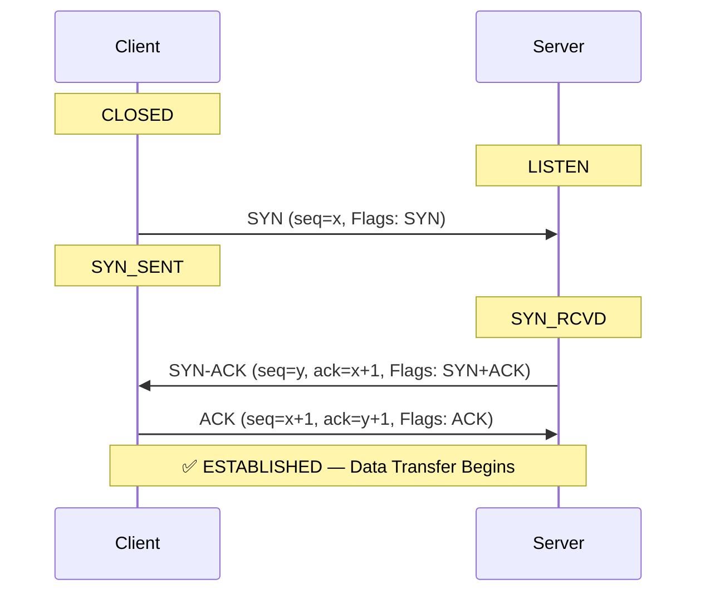
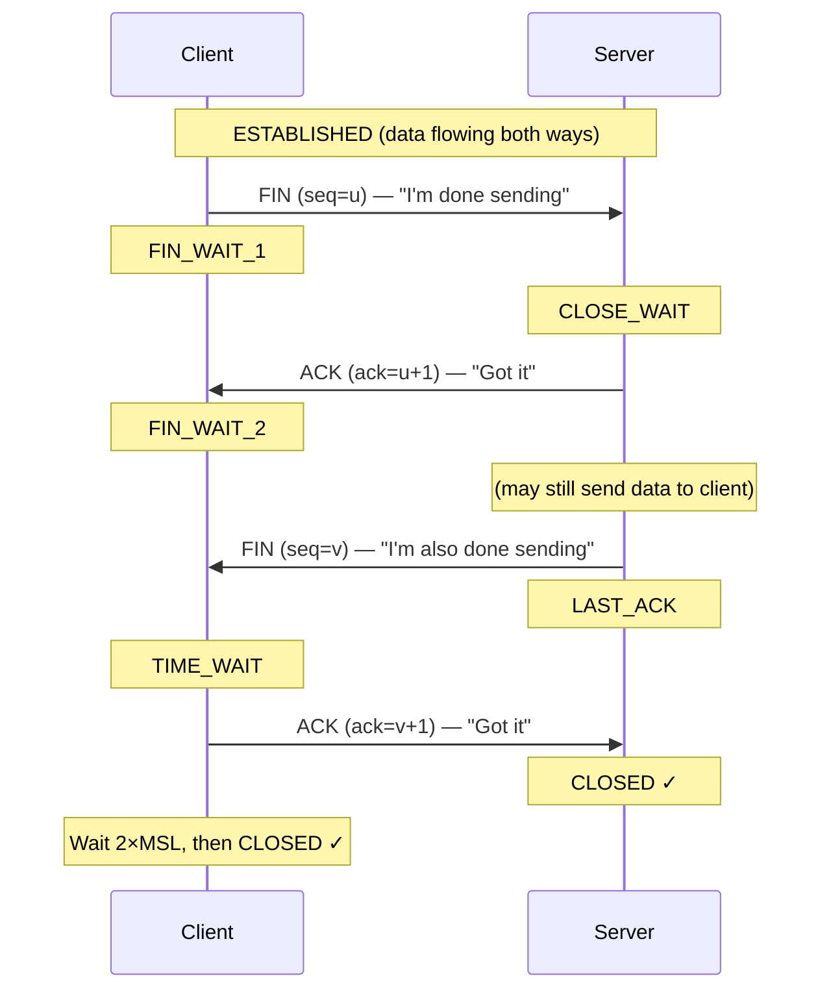
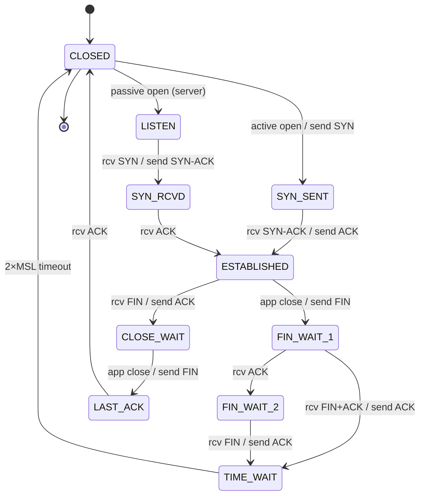

# TCP Deep Dive

TCP (Transmission Control Protocol) is the workhorse of the internet. It provides reliable, ordered, byte-stream delivery over an unreliable network. This tutorial dissects TCP internals -- from segment structure and connection management to retransmission strategies and real-world analysis.

---

## What You'll Learn

- TCP segment header fields and their purposes
- The three-way handshake and four-way connection teardown
- TCP state machine transitions
- How sequence numbers and acknowledgments enable reliability
- Window sizing, TCP options, and retransmission behavior
- How to analyze TCP traffic with Wireshark

---

## TCP Segment Structure

Every TCP segment contains a header (20-60 bytes) followed by optional data. Understanding each field is essential for debugging and protocol design.

```
 0                   1                   2                   3
 0 1 2 3 4 5 6 7 8 9 0 1 2 3 4 5 6 7 8 9 0 1 2 3 4 5 6 7 8 9 0 1
+-+-+-+-+-+-+-+-+-+-+-+-+-+-+-+-+-+-+-+-+-+-+-+-+-+-+-+-+-+-+-+-+
|          Source Port          |       Destination Port        |
+-+-+-+-+-+-+-+-+-+-+-+-+-+-+-+-+-+-+-+-+-+-+-+-+-+-+-+-+-+-+-+-+
|                        Sequence Number                       |
+-+-+-+-+-+-+-+-+-+-+-+-+-+-+-+-+-+-+-+-+-+-+-+-+-+-+-+-+-+-+-+-+
|                    Acknowledgment Number                     |
+-+-+-+-+-+-+-+-+-+-+-+-+-+-+-+-+-+-+-+-+-+-+-+-+-+-+-+-+-+-+-+-+
|  Data |       |C|E|U|A|P|R|S|F|                              |
| Offset| Rsrvd |W|C|R|C|S|S|Y|I|         Window Size          |
|       |       |R|E|G|K|H|T|N|N|                              |
+-+-+-+-+-+-+-+-+-+-+-+-+-+-+-+-+-+-+-+-+-+-+-+-+-+-+-+-+-+-+-+-+
|           Checksum            |         Urgent Pointer        |
+-+-+-+-+-+-+-+-+-+-+-+-+-+-+-+-+-+-+-+-+-+-+-+-+-+-+-+-+-+-+-+-+
|                    Options (variable length)                  |
+-+-+-+-+-+-+-+-+-+-+-+-+-+-+-+-+-+-+-+-+-+-+-+-+-+-+-+-+-+-+-+-+
|                             Data                             |
+-+-+-+-+-+-+-+-+-+-+-+-+-+-+-+-+-+-+-+-+-+-+-+-+-+-+-+-+-+-+-+-+
```

### Header Fields Explained

| Field | Size | Purpose |
|-------|------|---------|
| Source Port | 16 bits | Sender's port number |
| Destination Port | 16 bits | Receiver's port number |
| Sequence Number | 32 bits | Byte position of first data byte in this segment |
| Acknowledgment Number | 32 bits | Next byte the sender expects to receive |
| Data Offset | 4 bits | Header length in 32-bit words (min 5 = 20 bytes) |
| Reserved | 4 bits | Reserved for future use, must be zero |
| Flags (8 bits) | 1 bit each | CWR, ECE, URG, ACK, PSH, RST, SYN, FIN |
| Window Size | 16 bits | Receiver's available buffer space (bytes) |
| Checksum | 16 bits | Error detection over header + data + pseudo-header |
| Urgent Pointer | 16 bits | Offset to end of urgent data (if URG flag set) |
| Options | Variable | MSS, window scaling, timestamps, SACK, etc. |

### TCP Flags

| Flag | Name | Purpose |
|------|------|---------|
| SYN | Synchronize | Initiate connection, synchronize sequence numbers |
| ACK | Acknowledge | Acknowledgment number field is valid |
| FIN | Finish | Sender has finished sending data |
| RST | Reset | Abort the connection immediately |
| PSH | Push | Push data to application immediately (don't buffer) |
| URG | Urgent | Urgent pointer field is valid |
| ECE | ECN-Echo | Congestion experienced (ECN) |
| CWR | Congestion Window Reduced | Sender reduced congestion window |

---

## Three-Way Handshake

TCP establishes a connection using a three-way handshake. This synchronizes sequence numbers and negotiates options before data transfer begins.



### Why Three Steps?

1. **SYN**: Client tells server its initial sequence number (ISN)
2. **SYN-ACK**: Server acknowledges client's ISN and sends its own ISN
3. **ACK**: Client acknowledges server's ISN

Both sides must agree on each other's starting sequence number. A two-way handshake would not confirm that the server's ISN was received by the client.

### Initial Sequence Number (ISN)

The ISN is **not** zero. It is chosen pseudo-randomly to:
- Prevent segments from old connections being accepted by new ones
- Provide a basic defense against spoofing attacks (though not cryptographically secure)

---

## Four-Way Termination

TCP connections are **full-duplex** -- each direction is closed independently.



### Half-Close

Since each direction is independent, one side can finish sending (FIN) while still receiving data. This is called a **half-close**. It is used in protocols like HTTP/1.0 where the client sends a request and then signals it has no more data, but the server continues sending the response.

---

## TCP State Machine

TCP endpoints transition through a series of states during the lifetime of a connection.



### Key States

| State | Description |
|-------|-------------|
| CLOSED | No connection exists |
| LISTEN | Server waiting for incoming connections |
| SYN_SENT | Client sent SYN, awaiting SYN-ACK |
| SYN_RCVD | Server received SYN, sent SYN-ACK, awaiting ACK |
| ESTABLISHED | Connection open, data transfer in progress |
| FIN_WAIT_1 | Sent FIN, awaiting ACK |
| FIN_WAIT_2 | FIN acknowledged, awaiting peer's FIN |
| CLOSE_WAIT | Received FIN, application not yet closed |
| LAST_ACK | Sent FIN (after receiving FIN), awaiting final ACK |
| TIME_WAIT | Waiting 2*MSL before fully closing (ensures last ACK arrived) |

### TIME_WAIT (2*MSL)

MSL = Maximum Segment Lifetime (typically 30-120 seconds). TIME_WAIT serves two purposes:
1. Ensures the final ACK reaches the peer (if lost, peer retransmits FIN)
2. Allows old duplicate segments to expire before a new connection reuses the same port

---

## Sequence Numbers and Acknowledgments

TCP numbers every **byte** of data, not every segment.

```
Sender transmits 3 segments, 500 bytes each:

Segment 1: seq=1000, 500 bytes  (bytes 1000-1499)
Segment 2: seq=1500, 500 bytes  (bytes 1500-1999)
Segment 3: seq=2000, 500 bytes  (bytes 2000-2499)

Receiver acknowledges:
ACK=1500  --> "I've received up to byte 1499, send byte 1500 next"
ACK=2000  --> "I've received up to byte 1999, send byte 2000 next"
ACK=2500  --> "I've received up to byte 2499, send byte 2500 next"
```

### Cumulative Acknowledgments

TCP uses **cumulative ACKs**: an ACK number of N means "I have received all bytes up to N-1." If segment 2 is lost but segment 3 arrives, the receiver still sends ACK=1500 (it cannot acknowledge segment 3 without segment 2).

---

## TCP Window Size

The **window size** field (16 bits) tells the sender how many bytes the receiver is willing to accept. This implements **flow control**.

```
Receiver advertises window = 4000 bytes

  Sender buffer:
  [===sent, acked===|===sent, unacked===|===can send===|===cannot send===]
        ^                    ^                ^                ^
     base            next_seq_num        base + window     beyond window

  |<---- already acked ---->|<-- in flight -->|<-- allowed -->|<-- blocked -->|
```

With the **Window Scale** option, the effective window can be up to 2^30 bytes (about 1 GB).

---

## TCP Options

Options are negotiated during the handshake (SYN and SYN-ACK segments).

| Option | Size | Description |
|--------|------|-------------|
| MSS (Max Segment Size) | 4 bytes | Largest segment the sender will accept (avoids fragmentation) |
| Window Scale | 3 bytes | Multiplier for window size (shift count 0-14) |
| Timestamps | 10 bytes | Used for RTT measurement and PAWS (Protection Against Wrapped Sequences) |
| SACK Permitted | 2 bytes | Indicates support for Selective Acknowledgment |
| SACK Blocks | Variable | Specifies non-contiguous blocks of received data |
| No-Operation (NOP) | 1 byte | Padding for alignment |

### MSS Negotiation Example

```
Client SYN:   MSS=1460 (Ethernet MTU 1500 - 20 IP - 20 TCP)
Server SYN-ACK: MSS=1400 (might be behind VPN with smaller MTU)
Result: Both sides use MSS=1400 (the smaller value)
```

---

## Retransmission and Timeouts

TCP retransmits segments that are not acknowledged within a timeout period.

### Retransmission Timeout (RTO)

The RTO is computed dynamically based on measured Round-Trip Time (RTT):

```
SampleRTT    = time between sending segment and receiving ACK
EstimatedRTT = (1 - a) * EstimatedRTT + a * SampleRTT     (a = 0.125)
DevRTT       = (1 - b) * DevRTT + b * |SampleRTT - EstimatedRTT|  (b = 0.25)
RTO          = EstimatedRTT + 4 * DevRTT
```

### Fast Retransmit

Instead of waiting for the timeout, TCP retransmits after receiving **3 duplicate ACKs** (4 ACKs for the same sequence number total). This indicates a segment was likely lost, not just delayed.

```
  Sender                             Receiver
    |--- Seg 1 (seq=100) ---------->|  ACK=200
    |--- Seg 2 (seq=200) --X  lost  |
    |--- Seg 3 (seq=300) ---------->|  ACK=200 (dup 1)
    |--- Seg 4 (seq=400) ---------->|  ACK=200 (dup 2)
    |--- Seg 5 (seq=500) ---------->|  ACK=200 (dup 3)
    |                                |
    |  3 dup ACKs --> FAST RETRANSMIT|
    |--- Seg 2 (seq=200) ---------->|  ACK=600 (cumulative)
```

---

## TCP Keepalive

When a TCP connection is idle (no data flowing), either side can send **keepalive probes** to verify the connection is still alive.

- Default keepalive interval: 2 hours (7200 seconds) on most systems
- After that, probes are sent every 75 seconds
- Connection is dropped after a configurable number of failed probes

```python
import socket

sock = socket.socket(socket.AF_INET, socket.SOCK_STREAM)
sock.setsockopt(socket.SOL_SOCKET, socket.SO_KEEPALIVE, 1)

# Linux-specific options:
sock.setsockopt(socket.IPPROTO_TCP, socket.TCP_KEEPIDLE, 60)   # Start after 60s idle
sock.setsockopt(socket.IPPROTO_TCP, socket.TCP_KEEPINTVL, 10)  # Probe every 10s
sock.setsockopt(socket.IPPROTO_TCP, socket.TCP_KEEPCNT, 5)     # Drop after 5 failures
```

---

## Wireshark TCP Analysis Example

Wireshark is the standard tool for inspecting TCP traffic. Here is what a typical three-way handshake looks like in a capture:

```
No.  Time     Source         Dest           Protocol  Info
1    0.000    192.168.1.10   93.184.216.34  TCP       50234 -> 80 [SYN] Seq=0 Win=65535 Len=0 MSS=1460 WS=256
2    0.025    93.184.216.34  192.168.1.10   TCP       80 -> 50234 [SYN, ACK] Seq=0 Ack=1 Win=65535 Len=0 MSS=1460 WS=128
3    0.025    192.168.1.10   93.184.216.34  TCP       50234 -> 80 [ACK] Seq=1 Ack=1 Win=65535 Len=0
4    0.026    192.168.1.10   93.184.216.34  HTTP      GET / HTTP/1.1
5    0.051    93.184.216.34  192.168.1.10   TCP       80 -> 50234 [ACK] Seq=1 Ack=75 Win=65535 Len=0
6    0.052    93.184.216.34  192.168.1.10   HTTP      HTTP/1.1 200 OK (text/html)
7    0.052    192.168.1.10   93.184.216.34  TCP       50234 -> 80 [ACK] Seq=75 Ack=1257 Win=65535 Len=0
```

### Useful Wireshark Filters for TCP

```
tcp.port == 80                    # Traffic on port 80
tcp.flags.syn == 1                # SYN packets (connection attempts)
tcp.flags.rst == 1                # RST packets (connection resets)
tcp.analysis.retransmission       # Retransmitted segments
tcp.analysis.duplicate_ack        # Duplicate ACKs
tcp.analysis.zero_window          # Zero window (receiver buffer full)
tcp.stream eq 5                   # Follow a specific TCP stream
```

### Common Wireshark TCP Indicators

| Indicator | Meaning |
|-----------|---------|
| `[TCP Retransmission]` | Segment was resent (original likely lost) |
| `[TCP Dup ACK]` | Duplicate acknowledgment (gap in received data) |
| `[TCP Zero Window]` | Receiver's buffer is full |
| `[TCP Window Update]` | Receiver has freed buffer space |
| `[TCP Keep-Alive]` | Keepalive probe segment |
| `[TCP RST]` | Connection abruptly reset |
| `[TCP Out-Of-Order]` | Segment arrived out of sequence |

---

## Exercises

### Beginner

1. Draw the three-way handshake for a connection where the client's ISN is 1000 and the server's ISN is 5000. Label all sequence and acknowledgment numbers.
2. What is the minimum TCP header size? What is the maximum? Why do they differ?
3. Explain why TCP uses byte-oriented sequence numbers instead of segment-oriented numbers.

### Intermediate

4. A TCP connection is in FIN_WAIT_2 state. What event must occur for it to transition to TIME_WAIT? What happens if this event never occurs?
5. Given EstimatedRTT = 100ms and DevRTT = 15ms, calculate the RTO. If the next SampleRTT is 130ms, compute the new EstimatedRTT and DevRTT.
6. Explain the difference between a fast retransmit and a timeout-based retransmit. Under what conditions would each occur?

### Advanced

7. A server receives thousands of connections per second. Explain why TIME_WAIT can become a problem and describe strategies to mitigate it (e.g., `SO_REUSEADDR`, `tcp_tw_reuse`).
8. Using Wireshark (or tcpdump), capture the TCP handshake for an HTTP request to any website. Identify the ISNs, MSS values, and window scale factors. Calculate the effective window size for each side.

---

## Key Takeaways

- The TCP header is at least 20 bytes, with fields for ports, sequence/ack numbers, flags, window size, and checksum
- The **three-way handshake** (SYN, SYN-ACK, ACK) synchronizes sequence numbers before data transfer
- **Four-way termination** closes each direction independently, with TIME_WAIT ensuring clean shutdown
- TCP uses **cumulative acknowledgments** and **sequence numbers** to track every byte of data
- **Fast retransmit** (3 duplicate ACKs) recovers from loss faster than waiting for timeout
- TCP options like **MSS**, **Window Scale**, and **SACK** are critical for modern high-speed networks
- **Wireshark** is indispensable for debugging TCP behavior in production

---

## Navigation

- **Previous**: [Transport Layer Overview](./01_transport_layer_overview.md)
- **Next**: [UDP and Use Cases](./03_udp_and_use_cases.md)
- **Section Home**: [Transport Layer](./README.md)
