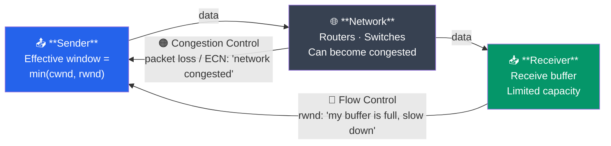
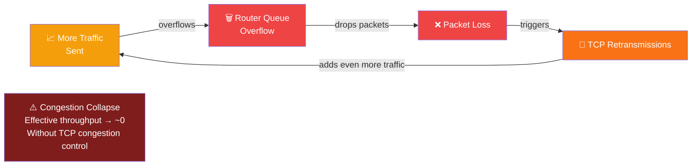
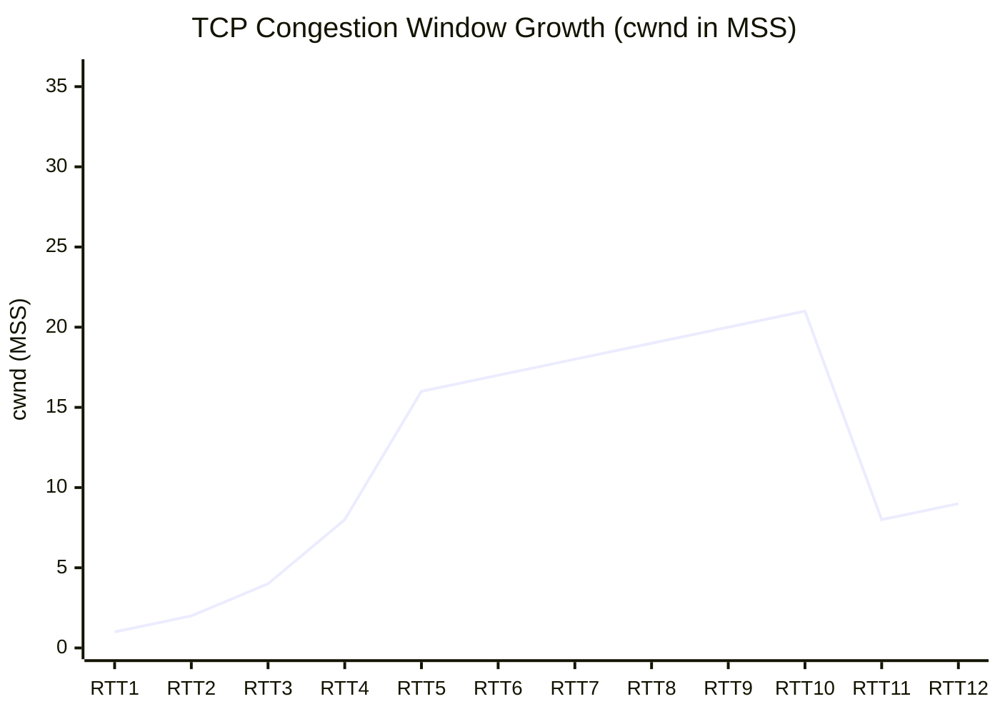

# Flow Control and Congestion Control

Flow control and congestion control are two distinct mechanisms that regulate how fast a TCP sender transmits data. Flow control prevents the sender from overwhelming the **receiver**. Congestion control prevents the sender from overwhelming the **network**. Together, they keep data flowing efficiently without causing buffer overflows or network collapse.

---

## What You'll Learn

- The difference between flow control and congestion control
- How the sliding window protocol implements flow control
- TCP congestion control phases: slow start and congestion avoidance
- The AIMD algorithm and why it works
- Differences between TCP Reno, Tahoe, and CUBIC
- Congestion window (cwnd) vs receiver window (rwnd)
- ECN (Explicit Congestion Notification) and how it avoids packet loss
- Real-world performance implications

---

## Flow Control vs Congestion Control

These two mechanisms solve different problems but both affect the sender's transmission rate.



| Aspect | Flow Control | Congestion Control |
|--------|-------------|-------------------|
| Problem | Receiver buffer overflow | Network congestion / router queue overflow |
| Scope | End-to-end (sender-receiver) | Network-wide |
| Mechanism | Receiver window (rwnd) | Congestion window (cwnd) |
| Signal | Receiver advertises window size | Packet loss or ECN marks |
| Controlled by | Receiver | Sender (with network feedback) |

**The sender's effective window is**: `effective_window = min(cwnd, rwnd)`

---

## Flow Control: Sliding Window Protocol

The receiver advertises how much buffer space it has available via the **Window Size** field in TCP headers. The sender must not have more unacknowledged bytes in flight than this window allows.

### How It Works

```
Receiver buffer capacity: 4000 bytes
Data already buffered:    1500 bytes
Available space:          2500 bytes

Receiver sends:  ACK with Window = 2500

Sender sees Window = 2500:
  "I can send up to 2500 more bytes before I must wait for ACKs"
```

### Sliding Window Visualization

```
Sender's view of the byte stream:

  Byte position: 1    2    3    4    5    6    7    8    9   10   11   12
                [ACK][ACK][ACK][SENT][SENT][SEND][SEND][====BLOCKED====]
                                                       ^
                 |<-- acked -->|<- in flight ->|<-ok ->|<-- cannot send-->|
                                                       |
                                                  base + window

  As ACKs arrive, the window "slides" forward:

  Before ACK:   [ACK][ACK][ACK][SENT][SENT][SEND][SEND][BLOCKED][BLOCKED]
  After ACK 4:  [   ][ACK][ACK][ACK ][SENT][SENT][SEND][SEND   ][BLOCKED]
                       ^-- window slides right -->
```

### Zero Window

When the receiver's buffer is completely full, it advertises **Window = 0**. The sender stops transmitting and starts a **persist timer**, periodically sending 1-byte **window probe** segments to check if the window has opened.

```
  Sender                              Receiver
    |                                     |
    |<-- ACK, Window=0 ------------------|  Buffer full!
    |                                     |
    |   (sender stops sending)            |
    |   (persist timer starts)            |
    |                                     |
    |-- Window Probe (1 byte) ---------->|  "Is your buffer free yet?"
    |<-- ACK, Window=0 ------------------|  "Not yet"
    |                                     |
    |   (wait, try again)                 |
    |                                     |
    |-- Window Probe (1 byte) ---------->|
    |<-- ACK, Window=4000 ---------------|  "Buffer cleared!"
    |                                     |
    |-- Data (up to 4000 bytes) -------->|  Resume sending
```

---

## Congestion Control: The Big Picture

Network congestion occurs when too many sources send too much data too fast for the network to handle. Routers' queues overflow, packets are dropped, and retransmissions make things worse.

### Congestion Collapse

Without congestion control, a positive feedback loop can develop:



TCP congestion control prevents this by having each sender independently limit its sending rate based on perceived network conditions.

---

## Slow Start

When a TCP connection begins (or recovers from a timeout), the sender doesn't know the network's capacity. **Slow start** probes for available bandwidth by starting small and growing exponentially.

```
Initial cwnd = 1 MSS (typically 1460 bytes)
ssthresh = 65535 bytes (initial slow start threshold)

Round 1: cwnd = 1 MSS  --> send 1 segment  --> 1 ACK received
Round 2: cwnd = 2 MSS  --> send 2 segments --> 2 ACKs received
Round 3: cwnd = 4 MSS  --> send 4 segments --> 4 ACKs received
Round 4: cwnd = 8 MSS  --> send 8 segments --> 8 ACKs received
Round 5: cwnd = 16 MSS --> send 16 segments

cwnd doubles every RTT (exponential growth)
```



> **Phases**: RTT 1–5 = Slow Start (exponential). RTT 6–10 = Congestion Avoidance (linear, +1 MSS/RTT). RTT 11 = packet loss detected → ssthresh = cwnd/2, cwnd reset. RTT 12 = recovery.

Slow start continues until:
1. `cwnd >= ssthresh` --> switch to congestion avoidance
2. Packet loss detected --> react based on loss type
3. 3 duplicate ACKs --> fast recovery (TCP Reno)

---

## Congestion Avoidance

Once `cwnd` reaches `ssthresh`, growth becomes **linear** (additive increase) to gently probe for more capacity without overshooting.

```
Congestion Avoidance:
  For each RTT with all ACKs received:
    cwnd = cwnd + 1 MSS  (linear growth, not exponential)

  cwnd
  (MSS)
    |
 24 |                                              *  *
    |                                          *
 20 |                                      *
    |                                  *
 16 |                    ssthresh  *
    |                          *  <-- switch from exponential
 12 |                      *        to linear growth
    |                  *
  8 |              *
    |          *
  4 |      *
    |  *
  1 |*
    +--+--+--+--+--+--+--+--+--+--+--+--+--> RTT
    |<- Slow Start ->|<- Congestion Avoidance ->|
```

---

## AIMD (Additive Increase, Multiplicative Decrease)

AIMD is the fundamental algorithm behind TCP congestion control.

- **Additive Increase**: Increase cwnd by 1 MSS per RTT (gentle probing)
- **Multiplicative Decrease**: On loss, cut cwnd in half (aggressive pullback)

```
  cwnd
    |
    |          /\          /\          /\
    |         /  \        /  \        /  \
    |        /    \      /    \      /    \
    |       /      \    /      \    /      \
    |      /        \  /        \  /        \
    |     /    loss  \/    loss  \/    loss   \
    |    /            |          |             \
    |   /             |          |              \
    |  /              |          |               \
    +--+--+--+--+--+--+--+--+--+--+--+--+--+--+--> Time
    
    Sawtooth pattern: linear increase, multiplicative decrease
```

### Why AIMD Works

- **Additive increase** slowly probes for available bandwidth
- **Multiplicative decrease** quickly backs off when congestion is detected
- Over time, all TCP flows converge to a **fair share** of bandwidth
- The sawtooth pattern oscillates around the optimal sending rate

---

## TCP Tahoe vs TCP Reno vs TCP CUBIC

### TCP Tahoe (1988)

The original congestion control algorithm:

- **On timeout**: Set `ssthresh = cwnd/2`, reset `cwnd = 1 MSS`, enter slow start
- **On 3 dup ACKs**: Same as timeout (treat as severe loss)
- Problem: Always resets to 1 MSS, very slow recovery

### TCP Reno (1990)

Adds **fast recovery** to Tahoe:

- **On timeout**: Same as Tahoe (`ssthresh = cwnd/2`, `cwnd = 1`, slow start)
- **On 3 dup ACKs**: `ssthresh = cwnd/2`, `cwnd = cwnd/2` (not 1!), enter fast recovery
- Fast recovery avoids the expensive slow start phase for non-timeout losses

### TCP CUBIC (2008, Linux default)

Designed for high-bandwidth, high-latency networks (long fat networks):

- Uses a **cubic function** instead of linear increase
- Aggressively probes bandwidth far from the last loss point
- Gently probes near the last loss point (where congestion likely is)
- Default in Linux since kernel 2.6.19

```
  cwnd
    |
    |                CUBIC                    Reno
    |
    |              ___----*                   /
    |          __--       |                  /
    |        _-           |                 /
    |      _/             |loss            /
    |    _/               |              /
    |  _/                 |            /
    | /                   v          /
    |/    aggressive   ________    / slow
    |     far from    |        | /  linear
    |     loss point  | gentle |/   increase
    |                 | near   |
    |                 | loss   |
    +--+--+--+--+--+--+--+--+--+--+--+--+--> Time
```

### Comparison Table

| Feature | Tahoe | Reno | CUBIC |
|---------|-------|------|-------|
| Year | 1988 | 1990 | 2008 |
| On timeout | cwnd=1, slow start | cwnd=1, slow start | cwnd=1, slow start |
| On 3 dup ACKs | cwnd=1, slow start | cwnd/2, fast recovery | Cubic function |
| Growth function | Linear (AIMD) | Linear (AIMD) | Cubic polynomial |
| High-BDP networks | Poor | Moderate | Good |
| Fairness | Fair | Fair | Fair (improved) |
| Default in Linux | No | No | Yes (since 2.6.19) |

---

## Congestion Window (cwnd) vs Receiver Window (rwnd)

```
  +----------+                                    +----------+
  |  Sender  |                                    | Receiver |
  |          |        Network capacity            |          |
  |  cwnd    |<===============================>   |  rwnd    |
  | (sender  |   Bottleneck bandwidth * RTT       | (buffer  |
  |  side)   |                                    |  space)  |
  +----------+                                    +----------+

  Effective sending window = min(cwnd, rwnd)

  Case 1: cwnd=10KB, rwnd=50KB --> send at 10KB (network is bottleneck)
  Case 2: cwnd=50KB, rwnd=10KB --> send at 10KB (receiver is bottleneck)
  Case 3: cwnd=30KB, rwnd=30KB --> send at 30KB (both equally limiting)
```

### Bandwidth-Delay Product (BDP)

The BDP represents the maximum amount of data that can be "in flight" in the network:

```
BDP = Bandwidth x RTT

Example:
  Bandwidth = 100 Mbps = 12.5 MB/s
  RTT = 50 ms = 0.05 s
  BDP = 12.5 MB/s x 0.05 s = 625 KB

  To fully utilize this link:
    cwnd and rwnd must both be >= 625 KB
    
  With default 16-bit window (max 65535 bytes):
    Only 65 KB / 625 KB = 10.4% utilization!
    
  Window Scale option is essential for high-BDP networks.
```

---

## ECN (Explicit Congestion Notification)

Traditional congestion detection relies on **packet loss**, which is a destructive signal. ECN allows routers to signal congestion **before** dropping packets.

### How ECN Works

```
  Sender                Router               Receiver
    |                     |                     |
    |-- IP packet ------->|                     |
    |   ECT=1 (capable)   |                     |
    |                     |                     |
    |   Router queue      |                     |
    |   getting full:     |                     |
    |   Mark CE bit       |                     |
    |   (don't drop!)     |                     |
    |                     |-- IP packet ------->|
    |                     |   CE=1 (congested)  |
    |                     |                     |
    |<---------- TCP ACK with ECE flag ---------|
    |           "I received a CE-marked packet" |
    |                                           |
    |  Sender reduces cwnd                      |
    |  Sets CWR flag in next segment            |
    |-- Data + CWR ----->|--------------------->|
    |  "I've reduced my rate"                   |
```

### ECN Benefits

- No packets need to be dropped to signal congestion
- Lower latency (no retransmission delay)
- Better for real-time and interactive applications
- Especially valuable in data center networks (DCTCP)

### ECN IP Header Bits

| ECN Field | Meaning |
|-----------|---------|
| `00` | Not ECN-Capable (Non-ECT) |
| `01` | ECN-Capable Transport (ECT(1)) |
| `10` | ECN-Capable Transport (ECT(0)) |
| `11` | Congestion Experienced (CE) |

---

## Window Growth and Shrink: Complete Example

```
  cwnd
  (MSS)
    |
 32 |                          *
    |                        * |
 28 |                      *   |
    |                    *     |  3 dup ACKs (Reno)
 24 |                  *       |  ssthresh = 32/2 = 16
    |                *         |  cwnd = 16 (halved)
 20 |              *           |
    |            *             |         *  *  *
 16 |  ssthresh*               +------*
    |        *                        *
 12 |      *                        *
    |    *                        *     Congestion
  8 |  *                        *       Avoidance
    | *                       *         (linear)
  4 |*                      *
    |*                    *
  2 |*  Slow Start      *
  1 |*  (exponential)  *
    +--+--+--+--+--+--+--+--+--+--+--+--+--+--+--> RTT
    1  2  3  4  5  6  7  8  9  10 11 12 13 14 15

    Phase 1: Slow start (cwnd doubles each RTT until ssthresh)
    Phase 2: Congestion avoidance (cwnd += 1 MSS per RTT)
    Event:   3 dup ACKs at cwnd=32
    Phase 3: Fast recovery (cwnd halved to 16, new ssthresh=16)
    Phase 4: Congestion avoidance again (linear from 16)
```

---

## Real-World Performance Impact

### Scenario: Downloading a Large File

```
Network: 100 Mbps link, 50ms RTT

Without congestion control:
  All senders blast at full rate --> router queue overflow
  --> massive packet loss --> retransmissions --> congestion collapse
  --> effective throughput: near 0

With congestion control:
  Senders probe carefully, share bandwidth fairly
  --> each of 10 senders gets ~10 Mbps
  --> stable, predictable performance
```

### Impact of RTT on Throughput

```
TCP throughput (simplified, without loss):

  Throughput ~ cwnd / RTT

  Same cwnd = 64 KB:
    RTT = 10ms  --> 6.4 MB/s = 51.2 Mbps
    RTT = 100ms --> 640 KB/s = 5.12 Mbps
    RTT = 200ms --> 320 KB/s = 2.56 Mbps

  Higher RTT = slower congestion window growth = lower throughput
  This is why CDNs place servers close to users (lower RTT).
```

### Tuning Tips

| Parameter | Linux sysctl | Purpose |
|-----------|-------------|---------|
| Congestion algorithm | `net.ipv4.tcp_congestion_control` | Set to cubic, bbr, reno |
| Max receive buffer | `net.core.rmem_max` | Maximum rwnd |
| Max send buffer | `net.core.wmem_max` | Maximum send buffer |
| TCP buffer auto-tuning | `net.ipv4.tcp_moderate_rcvbuf` | Auto-adjust buffer sizes |
| ECN | `net.ipv4.tcp_ecn` | Enable ECN (0=off, 1=on, 2=server only) |

```bash
# Check current congestion control algorithm
sysctl net.ipv4.tcp_congestion_control

# Switch to BBR (Google's congestion control)
sudo sysctl -w net.ipv4.tcp_congestion_control=bbr

# List available algorithms
sysctl net.ipv4.tcp_available_congestion_control
```

---

## Exercises

### Beginner

1. Explain the difference between flow control and congestion control in one sentence each.
2. What happens when a receiver advertises a window size of 0?
3. In slow start, if the initial cwnd is 1 MSS, what is the cwnd after 5 RTTs (assuming no loss)?

### Intermediate

4. A TCP Reno connection has `cwnd = 20 MSS` and `ssthresh = 30 MSS`. It experiences 3 duplicate ACKs. What are the new values of `cwnd` and `ssthresh`? What phase does the connection enter?
5. Calculate the BDP for a 1 Gbps link with 20ms RTT. What window size is needed to fully utilize this link? Would the default 16-bit window field be sufficient?
6. Explain why AIMD converges to fairness when two flows share a bottleneck link. Consider starting from an unfair allocation.

### Advanced

7. Compare TCP CUBIC and Google's BBR congestion control. How does BBR differ fundamentally in its approach to detecting available bandwidth? What are the trade-offs?
8. A data center has 10 Gbps links with sub-millisecond RTTs. Explain why traditional TCP congestion control (Reno/CUBIC) performs poorly in this environment and how DCTCP (Data Center TCP) with ECN addresses these issues.

---

## Key Takeaways

- **Flow control** (rwnd) prevents receiver buffer overflow; **congestion control** (cwnd) prevents network overload
- The sender's effective window is `min(cwnd, rwnd)`
- **Slow start** grows cwnd exponentially to quickly find available bandwidth
- **Congestion avoidance** grows cwnd linearly to gently probe beyond the current rate
- **AIMD** ensures stability and fairness: additive increase probes, multiplicative decrease reacts
- **TCP CUBIC** (Linux default) uses a cubic function for better performance on high-BDP networks
- **ECN** signals congestion without dropping packets, reducing latency and retransmissions
- Understanding these mechanisms is essential for diagnosing performance issues and tuning network applications

---

## Navigation

- **Previous**: [Port Numbers and Sockets](./04_ports_and_sockets.md)
- **Next**: [Reliable Data Transfer](./06_reliable_data_transfer.md)
- **Section Home**: [Transport Layer](./README.md)
