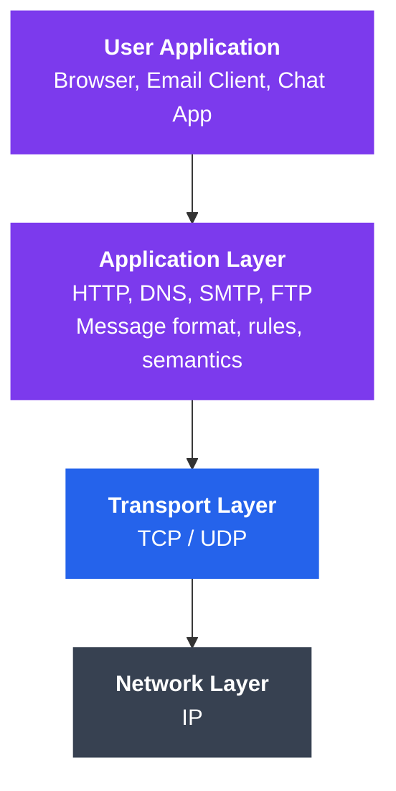
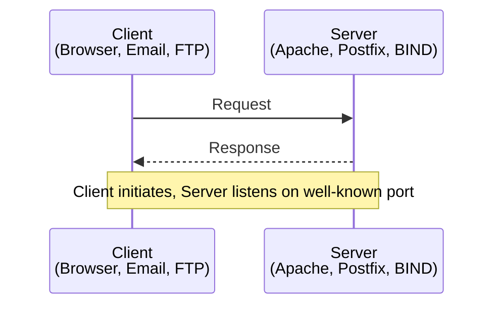

# Application Layer Protocols Overview

The application layer sits at the top of the network stack. It is where software — browsers, email clients, chat apps — interacts with the network. Every time you load a web page, send a message, or stream a video, application layer protocols define how that data is structured, requested, and delivered.

---

## What You'll Learn

- The role and responsibilities of the application layer
- How the client-server model works at the application level
- Major application layer protocols and their purposes
- How applications choose between TCP and UDP
- Application architecture patterns: client-server, P2P, and hybrid
- API and interface concepts that bridge applications and the network

---

## 1. Role of the Application Layer

The application layer provides **network services directly to end-user applications**. It does not refer to applications themselves, but to the protocols and interfaces they use.



```
┌───────────────────────────────────────────────┐
│           USER APPLICATION                     │
│   (Browser, Email Client, Chat App)            │
├───────────────────────────────────────────────┤
│         APPLICATION LAYER                      │
│   Protocols: HTTP, DNS, SMTP, FTP, etc.        │
│   Responsibilities:                            │
│     - Define message format & syntax           │
│     - Define communication rules               │
│     - Define meaning of data fields            │
│     - Define when/how to send messages         │
├───────────────────────────────────────────────┤
│         TRANSPORT LAYER (TCP / UDP)            │
├───────────────────────────────────────────────┤
│         NETWORK LAYER (IP)                     │
└───────────────────────────────────────────────┘
```

**Key responsibilities:**

| Responsibility | Description |
|----------------|-------------|
| Message syntax | Format and structure of messages (headers, body) |
| Message semantics | Meaning of each field and value |
| Timing rules | When to send, how long to wait, sequencing |
| Error reporting | Application-level error codes (e.g., HTTP 404) |
| Service discovery | Finding the right server (via DNS, etc.) |

---

## 2. Client-Server Model

The dominant pattern in networked applications. One side initiates (client), the other responds (server).



```
    ┌──────────┐                    ┌──────────┐
    │  CLIENT  │  --- Request --->  │  SERVER  │
    │          │  <-- Response ---  │          │
    │ Initiates│                    │ Listens  │
    │ Requests │                    │ on Port  │
    └──────────┘                    └──────────┘

    Examples:                       Examples:
    - Web browser                   - Apache/Nginx (HTTP)
    - Email client                  - Postfix (SMTP)
    - FTP client                    - BIND (DNS)
```

**Client characteristics:**
- Initiates communication
- May be intermittently connected
- Typically has a dynamic IP address
- Does not communicate directly with other clients

**Server characteristics:**
- Always on and listening
- Has a permanent, well-known address (IP or domain)
- Serves multiple clients concurrently
- Scales horizontally via replication or load balancing

---

## 3. Common Application Layer Protocols

| Protocol | Full Name | Port(s) | Transport | Purpose |
|----------|-----------|---------|-----------|---------|
| HTTP | HyperText Transfer Protocol | 80 | TCP | Web page transfer |
| HTTPS | HTTP Secure | 443 | TCP+TLS | Encrypted web transfer |
| DNS | Domain Name System | 53 | UDP/TCP | Name-to-IP resolution |
| SMTP | Simple Mail Transfer Protocol | 25, 587 | TCP | Sending email |
| POP3 | Post Office Protocol v3 | 110, 995 | TCP | Downloading email |
| IMAP | Internet Message Access Protocol | 143, 993 | TCP | Syncing email |
| FTP | File Transfer Protocol | 20, 21 | TCP | File transfer |
| SSH | Secure Shell | 22 | TCP | Remote terminal access |
| SFTP | SSH File Transfer Protocol | 22 | TCP | Secure file transfer |
| DHCP | Dynamic Host Config Protocol | 67, 68 | UDP | IP address assignment |
| SNMP | Simple Network Mgmt Protocol | 161, 162 | UDP | Network monitoring |
| NTP | Network Time Protocol | 123 | UDP | Time synchronization |
| RDP | Remote Desktop Protocol | 3389 | TCP/UDP | Remote desktop |
| MQTT | Message Queuing Telemetry Transport | 1883 | TCP | IoT messaging |

---

## 4. How Applications Use the Transport Layer

Applications must choose between TCP and UDP depending on their needs.

```
  Application Need             Transport Choice
  ─────────────────────        ─────────────────
  Reliable delivery        --> TCP
  Order matters            --> TCP
  Connection setup OK      --> TCP
  Low latency critical     --> UDP
  Loss-tolerant            --> UDP
  Broadcast/multicast      --> UDP
  Both (e.g., DNS)         --> UDP first, TCP fallback
```

**TCP-based protocols** (reliability required):
- HTTP/HTTPS — web pages must arrive complete
- SMTP/IMAP/POP3 — emails must not lose content
- FTP — files must transfer without corruption
- SSH — remote commands must be reliable

**UDP-based protocols** (speed over reliability):
- DNS — small queries, fast responses (falls back to TCP for large replies)
- DHCP — broadcast-based address discovery
- SNMP — periodic status reports, loss tolerable
- NTP — time sync, stale data is worse than lost data
- RTP — real-time audio/video, retransmission too slow

**Hybrid approaches:**
- DNS uses UDP for standard queries, TCP for zone transfers and large responses
- HTTP/3 uses QUIC (over UDP) for speed with built-in reliability

---

## 5. Application Architecture Patterns

### 5.1 Client-Server

```
        ┌────────┐
   ┌────│ Server │────┐
   │    └────────┘    │
   │         │        │
   v         v        v
┌──────┐ ┌──────┐ ┌──────┐
│Client│ │Client│ │Client│
└──────┘ └──────┘ └──────┘
```

- Centralized control and management
- Server is a single point of failure (mitigated by redundancy)
- Easy to secure and update
- **Examples:** Web, email, databases

### 5.2 Peer-to-Peer (P2P)

```
┌──────┐ <───> ┌──────┐
│Peer A│       │Peer B│
└──┬───┘       └───┬──┘
   │               │
   │   ┌──────┐    │
   └──>│Peer C│<───┘
       └──────┘
```

- No dedicated server; every node is both client and server
- Highly scalable — capacity grows with users
- Difficult to manage and secure
- **Examples:** BitTorrent, IPFS, early Skype

### 5.3 Hybrid

```
┌────────────┐
│ Central    │  (Index / coordination)
│ Server     │
└─────┬──────┘
      │ lookup
┌─────┴──────┐
│            │
v            v
┌──────┐  ┌──────┐
│Peer A│<>│Peer B│  (Direct data transfer)
└──────┘  └──────┘
```

- Central server for discovery/coordination
- Direct peer communication for data exchange
- Combines benefits of both models
- **Examples:** Skype (modern), Spotify (partial), blockchain networks

### Comparison Table

| Feature | Client-Server | P2P | Hybrid |
|---------|--------------|-----|--------|
| Scalability | Limited by server | Grows with peers | Moderate |
| Reliability | Single point of failure | No single point | Balanced |
| Management | Easy (centralized) | Hard (distributed) | Moderate |
| Security | Easier to enforce | Difficult | Moderate |
| Cost | High server costs | Low infrastructure | Moderate |
| Examples | Web, email | BitTorrent | Modern Skype |

---

## 6. API and Interface Concepts

Applications access network services through well-defined interfaces.

### Socket API

The **socket** is the fundamental interface between the application layer and the transport layer.

```
┌─────────────────────┐
│     Application     │
│    (your code)      │
├─────────────────────┤
│    Socket API       │  <-- Interface boundary
│  socket()           │
│  bind()             │
│  listen() / connect()│
│  send() / recv()    │
│  close()            │
├─────────────────────┤
│   Transport Layer   │
│   (TCP / UDP)       │
└─────────────────────┘
```

A socket is identified by: `(IP Address, Port Number, Protocol)`

### Socket Example (Python)

```python
# TCP Server
import socket

server = socket.socket(socket.AF_INET, socket.SOCK_STREAM)
server.bind(('0.0.0.0', 8080))
server.listen(5)

conn, addr = server.accept()
data = conn.recv(1024)
conn.send(b'Hello from server')
conn.close()
```

```python
# TCP Client
import socket

client = socket.socket(socket.AF_INET, socket.SOCK_STREAM)
client.connect(('127.0.0.1', 8080))
client.send(b'Hello from client')
response = client.recv(1024)
client.close()
```

### Higher-Level APIs

Most developers work with higher-level abstractions:

| Level | Example | What It Hides |
|-------|---------|---------------|
| Raw Sockets | `socket.socket()` | Nothing — full control |
| HTTP Library | `requests.get()` | TCP, DNS, connection mgmt |
| Web Framework | `@app.get("/")` | HTTP parsing, routing |
| SDK/Client | `s3.put_object()` | HTTP, auth, retries, serialization |

---

## 7. Protocol Design Principles

Well-designed application protocols share common traits:

1. **Simplicity** — Easy to implement and debug (HTTP is text-based)
2. **Extensibility** — New features without breaking old ones (HTTP headers)
3. **Interoperability** — Defined by open standards (RFCs)
4. **Statelessness** — Each request is independent when possible (HTTP)
5. **Error Handling** — Clear error codes and messages (HTTP status codes)

---

## Exercises

### Beginner
1. List five application layer protocols and their default port numbers from memory.
2. Explain in your own words the difference between a client and a server.
3. Using `netstat` or `ss`, identify which application layer protocols are active on your machine right now.

### Intermediate
4. Write a simple TCP echo server and client in Python. The server should return any message the client sends, converted to uppercase.
5. For each of these applications, explain whether you would use TCP or UDP and why: (a) online banking, (b) live video streaming, (c) file backup service, (d) DNS lookup, (e) multiplayer game state updates.
6. Design a simple text-based protocol for a to-do list application. Define the message format for: adding a task, listing tasks, completing a task, and deleting a task.

### Advanced
7. Compare the trade-offs of client-server vs P2P for a file-sharing system that must handle 10 million users. Consider bandwidth costs, reliability, and legal implications.
8. Implement a simple HTTP server from scratch using only the `socket` module (no `http` library). It should respond to GET requests with a static HTML page.
9. Research and explain how multiplayer game protocols differ from web protocols. Why do many games use a custom protocol over UDP rather than HTTP over TCP?

---

## Key Takeaways

- The application layer provides protocols that user-facing software relies on to communicate over the network.
- Client-server is the dominant model; P2P and hybrid architectures serve specific use cases.
- The choice of TCP vs UDP at the transport layer depends on whether the application values reliability or speed.
- Sockets are the fundamental API that connects application code to the network stack.
- Well-designed protocols are simple, extensible, and interoperable.

---

## Navigation

- **Next**: [HTTP and HTTPS](./02_http_and_https.md)
- **Section Home**: [Application Layer](./README.md)
- **Previous Section**: [Transport Layer](../03_transport_layer/)
