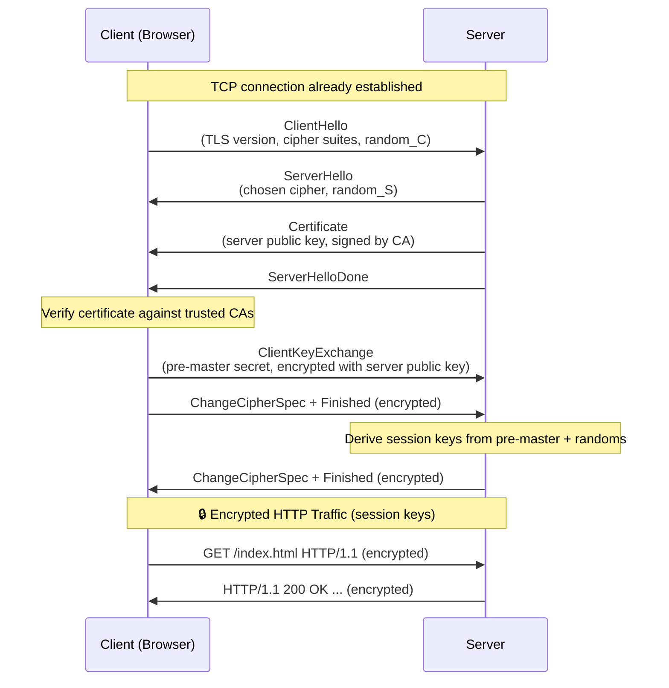

# HTTP and HTTPS

HTTP (HyperText Transfer Protocol) is the foundation of data exchange on the web. Every web page, API call, and image download uses HTTP. HTTPS adds encryption via TLS to secure that communication. This tutorial covers the protocol's evolution, message format, methods, status codes, security, and modern improvements.

---

## What You'll Learn

- The evolution of HTTP from 1.0 to 3.0
- HTTP request and response message format
- HTTP methods and when to use each
- Status code categories with common examples
- Important HTTP headers and their roles
- How HTTPS and TLS secure communication
- HTTP/2 and HTTP/3 performance features
- Practical usage with curl
- How cookies and sessions work

---

## 1. HTTP History

| Version | Year | Key Features |
|---------|------|-------------|
| HTTP/0.9 | 1991 | GET only, no headers, HTML only |
| HTTP/1.0 | 1996 | Headers, status codes, Content-Type, POST |
| HTTP/1.1 | 1997 | Persistent connections, chunked transfer, Host header |
| HTTP/2 | 2015 | Binary framing, multiplexing, header compression, server push |
| HTTP/3 | 2022 | QUIC (UDP-based), zero-RTT, improved loss recovery |

```mermaid
flowchart LR
    subgraph H10["HTTP/1.0 — 1996"]
        direction TB
        c10["Each request\nopens a new TCP\nconnection"]
        c10a["Request 1 → TCP → close"]
        c10b["Request 2 → TCP → close"]
    end

    subgraph H11["HTTP/1.1 — 1997"]
        direction TB
        c11["Persistent connection\nRequests are serial\n(head-of-line blocking)"]
        c11a["Req 1 → Req 2 → Req 3\n(one TCP conn)"]
    end

    subgraph H2["HTTP/2 — 2015"]
        direction TB
        c2["Binary framing\nMultiplexed streams\nHeader compression"]
        c2a["S1 + S2 + S3 in parallel\n(one TCP conn)"]
    end

    subgraph H3["HTTP/3 — 2022"]
        direction TB
        c3["QUIC over UDP\n0-RTT resumption\nNo TCP head-of-line"]
        c3a["S1 + S2 + S3 in parallel\n(one QUIC conn)"]
    end

    H10 --> H11 --> H2 --> H3

    style H10 fill:#6b7280,color:#fff
    style H11 fill:#2563eb,color:#fff
    style H2 fill:#7c3aed,color:#fff
    style H3 fill:#059669,color:#fff
```



---

## 2. HTTP Request/Response Format

### Request

```
METHOD /path HTTP/version\r\n
Header-Name: Header-Value\r\n
Header-Name: Header-Value\r\n
\r\n
[Optional Body]
```

**Example:**

```http
GET /api/users?page=1 HTTP/1.1
Host: example.com
Accept: application/json
Authorization: Bearer eyJhbGciOi...
User-Agent: curl/7.88.0
```

### Response

```
HTTP/version StatusCode ReasonPhrase\r\n
Header-Name: Header-Value\r\n
\r\n
[Body]
```

**Example:**

```http
HTTP/1.1 200 OK
Content-Type: application/json
Content-Length: 82
Cache-Control: max-age=3600

{"users": [{"id": 1, "name": "Alice"}, {"id": 2, "name": "Bob"}]}
```

---

## 3. HTTP Methods

| Method | Purpose | Idempotent | Safe | Has Body |
|--------|---------|------------|------|----------|
| GET | Retrieve a resource | Yes | Yes | No |
| POST | Create a resource / submit data | No | No | Yes |
| PUT | Replace a resource entirely | Yes | No | Yes |
| PATCH | Partially update a resource | No | No | Yes |
| DELETE | Remove a resource | Yes | No | Optional |
| HEAD | GET without response body | Yes | Yes | No |
| OPTIONS | Discover supported methods | Yes | Yes | No |

- **Idempotent**: Same request repeated produces the same result.
- **Safe**: Does not modify server state.

```bash
# GET - retrieve data
curl -X GET https://api.example.com/users/1

# POST - create data
curl -X POST https://api.example.com/users \
  -H "Content-Type: application/json" \
  -d '{"name": "Alice", "email": "alice@example.com"}'

# PUT - replace data
curl -X PUT https://api.example.com/users/1 \
  -H "Content-Type: application/json" \
  -d '{"name": "Alice", "email": "alice@new.com"}'

# DELETE - remove data
curl -X DELETE https://api.example.com/users/1
```

---

## 4. Status Codes

### Categories

| Range | Category | Meaning |
|-------|----------|---------|
| 1xx | Informational | Request received, continuing |
| 2xx | Success | Request successfully processed |
| 3xx | Redirection | Further action needed |
| 4xx | Client Error | Bad request from client |
| 5xx | Server Error | Server failed to fulfill valid request |

### Common Status Codes

```
 2xx SUCCESS             3xx REDIRECTION
 ───────────             ───────────────
 200 OK                  301 Moved Permanently
 201 Created             302 Found (Temporary)
 204 No Content          304 Not Modified
                         307 Temporary Redirect
 4xx CLIENT ERROR        308 Permanent Redirect
 ────────────────
 400 Bad Request         5xx SERVER ERROR
 401 Unauthorized        ───────────────
 403 Forbidden           500 Internal Server Error
 404 Not Found           502 Bad Gateway
 405 Method Not Allowed  503 Service Unavailable
 409 Conflict            504 Gateway Timeout
 429 Too Many Requests
```

---

## 5. HTTP Headers

### Request Headers

| Header | Purpose | Example |
|--------|---------|---------|
| Host | Target server (required in HTTP/1.1) | `Host: example.com` |
| Accept | Desired response format | `Accept: application/json` |
| Authorization | Authentication credentials | `Authorization: Bearer <token>` |
| Content-Type | Body format | `Content-Type: application/json` |
| User-Agent | Client software info | `User-Agent: Mozilla/5.0...` |
| Cookie | Session/tracking cookies | `Cookie: session=abc123` |
| Cache-Control | Caching directives | `Cache-Control: no-cache` |

### Response Headers

| Header | Purpose | Example |
|--------|---------|---------|
| Content-Type | Body format | `Content-Type: text/html` |
| Content-Length | Body size in bytes | `Content-Length: 1024` |
| Set-Cookie | Store cookie on client | `Set-Cookie: id=abc; HttpOnly` |
| Cache-Control | Caching rules | `Cache-Control: max-age=3600` |
| Location | Redirect target | `Location: /new-page` |
| Access-Control-Allow-Origin | CORS policy | `Access-Control-Allow-Origin: *` |
| ETag | Resource version identifier | `ETag: "33a64df5"` |

---

## 6. HTTPS and TLS Handshake

HTTPS = HTTP + TLS (Transport Layer Security). All HTTP data is encrypted before being sent over TCP.



**TLS 1.3 improvements:**
- Handshake reduced from 2 round trips to 1
- Removed insecure cipher suites (RC4, 3DES, SHA-1)
- Supports 0-RTT resumption for repeat connections

```bash
# Check TLS certificate details
curl -vI https://example.com 2>&1 | grep -E "SSL|subject|issuer|expire"

# Force TLS 1.3
curl --tlsv1.3 https://example.com
```

---

## 7. HTTP/2 Features

HTTP/2 solves HTTP/1.1's **head-of-line blocking** problem.

```
HTTP/1.1 (serial on one connection):
  ┌──────┐┌──────┐┌──────┐
  │ Req1 ││ Req2 ││ Req3 │  (each waits for previous)
  └──────┘└──────┘└──────┘
  ════════════════════════> time

HTTP/2 (multiplexed streams):
  ┌──────┐
  │Req 1 │─────────────────
  ├──────┤
  │Req 2 │───────────      (all in parallel)
  ├──────┤
  │Req 3 │─────
  └──────┘
  ════════════════════════> time
```

| Feature | Benefit |
|---------|---------|
| Binary framing | Efficient parsing, less error-prone |
| Multiplexing | Multiple requests on single connection |
| Header compression (HPACK) | Reduces overhead for repeated headers |
| Server push | Server sends resources before client asks |
| Stream prioritization | Important resources first |

---

## 8. HTTP/3 and QUIC

HTTP/3 replaces TCP with **QUIC** — a transport protocol built on UDP.

```
HTTP/1.1, HTTP/2:          HTTP/3:
┌───────────┐              ┌───────────┐
│   HTTP    │              │   HTTP    │
├───────────┤              ├───────────┤
│   TLS     │              │   QUIC    │ (includes TLS 1.3)
├───────────┤              ├───────────┤
│   TCP     │              │   UDP     │
└───────────┘              └───────────┘
```

**Why QUIC?**
- No head-of-line blocking at transport level (independent streams)
- Faster connection setup (0-RTT or 1-RTT)
- Built-in encryption (TLS 1.3 integrated)
- Connection migration (survives IP address changes — mobile networks)

---

## 9. Cookies and Sessions

HTTP is **stateless** — each request is independent. Cookies add state.

```
1. Client sends login request
   POST /login  { user: "alice", pass: "..." }

2. Server responds with Set-Cookie
   HTTP/1.1 200 OK
   Set-Cookie: session_id=abc123; HttpOnly; Secure; Path=/

3. Client includes cookie in subsequent requests
   GET /dashboard
   Cookie: session_id=abc123

4. Server looks up session_id to identify the user
```

**Cookie attributes:**

| Attribute | Purpose |
|-----------|---------|
| `HttpOnly` | Not accessible via JavaScript (XSS protection) |
| `Secure` | Only sent over HTTPS |
| `SameSite` | Controls cross-site sending (CSRF protection) |
| `Max-Age` | Expiry time in seconds |
| `Path` | URL path scope |
| `Domain` | Domain scope |

---

## 10. Practical curl Examples

```bash
# View full request/response headers
curl -v https://example.com

# Send JSON POST request
curl -X POST https://api.example.com/data \
  -H "Content-Type: application/json" \
  -d '{"key": "value"}'

# Follow redirects
curl -L http://example.com

# Show only response headers
curl -I https://example.com

# Download a file
curl -O https://example.com/file.zip

# Send with cookies
curl -b "session=abc123" https://example.com/dashboard

# Check HTTP/2 support
curl --http2 -I https://example.com

# Measure timing
curl -o /dev/null -s -w "DNS: %{time_namelookup}s\nConnect: %{time_connect}s\nTTFB: %{time_starttransfer}s\nTotal: %{time_total}s\n" https://example.com
```

---

## Exercises

### Beginner
1. Use `curl -v` to fetch a website and identify the HTTP version, status code, and three response headers.
2. Explain the difference between HTTP 301 and 302 redirects.
3. What is the difference between a `GET` and a `POST` request? When would you use each?

### Intermediate
4. Use `curl` to time the DNS lookup, TCP connect, and TTFB for three different websites. Compare the results.
5. Explain the TLS 1.3 handshake. How does it differ from TLS 1.2 in terms of round trips?
6. Write a Python script using the `http.server` module that returns different status codes based on the URL path (e.g., `/ok` returns 200, `/notfound` returns 404, `/error` returns 500).

### Advanced
7. Set up a local server and compare performance between HTTP/1.1 and HTTP/2 when loading a page with 50 small resources. Measure total load time.
8. Explain how HTTP/3's QUIC protocol eliminates head-of-line blocking that exists even in HTTP/2 (hint: think about TCP packet loss affecting all streams).
9. Implement a simple session system using cookies. Create a login endpoint that sets a cookie and a protected endpoint that reads and validates it.

---

## Key Takeaways

- HTTP is a text-based request-response protocol; HTTPS adds TLS encryption.
- HTTP methods have specific semantics — use them correctly (GET for reads, POST for creation, etc.).
- Status codes communicate outcomes clearly; learn the common ones.
- HTTP/2 introduced multiplexing and header compression; HTTP/3 moves to QUIC over UDP.
- Cookies are the primary mechanism for maintaining state in HTTP.
- TLS 1.3 is faster and more secure than previous versions.

---

## Navigation

- **Previous**: [Application Protocols Overview](./01_application_protocols_overview.md)
- **Next**: [DNS - Domain Name System](./03_dns.md)
- **Section Home**: [Application Layer](./README.md)
