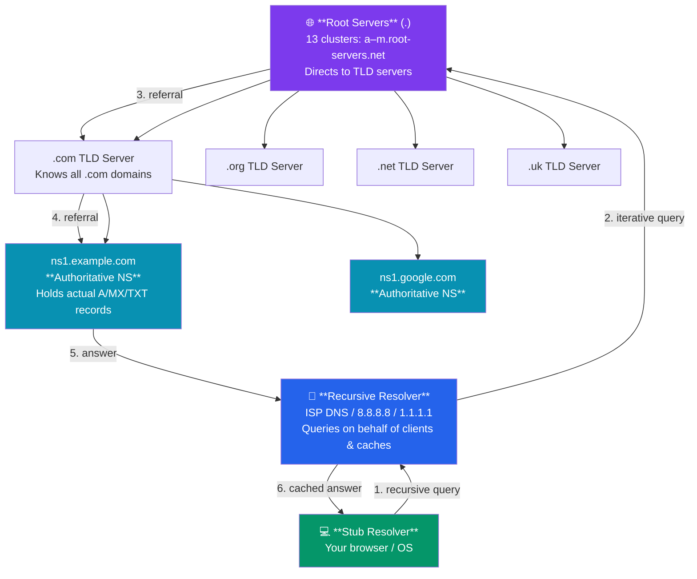
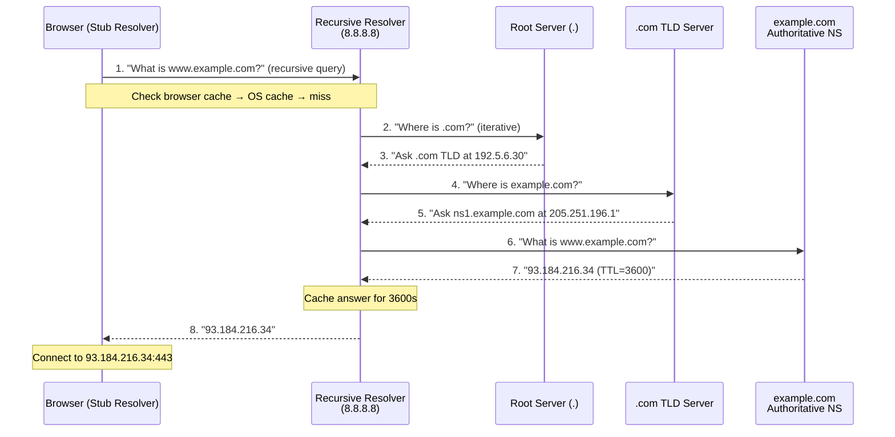

# DNS — Domain Name System

DNS is the internet's directory service. It translates human-readable domain names like `example.com` into machine-readable IP addresses like `93.184.216.34`. Without DNS, you would have to memorize IP addresses for every website. This tutorial covers how DNS works, its hierarchy, record types, resolution process, and security.

---

## What You'll Learn

- Why DNS exists and what problem it solves
- The DNS hierarchy: root servers, TLDs, authoritative servers, resolvers
- Common DNS record types and their uses
- Step-by-step DNS resolution process
- Recursive vs iterative queries
- DNS caching and TTL
- Practical tools: nslookup, dig, host
- DNS security: DNSSEC, DoH, DoT
- Common DNS issues and troubleshooting

---

## 1. What Is DNS and Why We Need It

IP addresses are how machines find each other. Humans prefer names. DNS bridges this gap.

```
  Human:    "I want to visit example.com"
               │
               v
  DNS:     example.com  ──>  93.184.216.34
               │
               v
  Browser:  Connects to 93.184.216.34:443
```

**Without DNS:**
- Users would type `93.184.216.34` instead of `example.com`
- Server IP changes would break all bookmarks
- No way to host multiple services on the same IP by name

**DNS provides:**
- Human-friendly naming
- Abstraction from IP addresses (servers can change IPs without users noticing)
- Load distribution (one name can resolve to multiple IPs)
- Email routing (MX records)
- Service discovery (SRV records)

---

## 2. DNS Hierarchy

DNS is a **distributed, hierarchical** database. No single server holds all records.



**Components:**

| Component | Role | Example |
|-----------|------|---------|
| Root servers | Direct queries to TLD servers | `.` (13 clusters, globally distributed) |
| TLD servers | Manage top-level domains | `.com`, `.org`, `.uk`, `.io` |
| Authoritative servers | Hold actual DNS records for a domain | `ns1.example.com` |
| Recursive resolver | Queries on behalf of clients, caches results | ISP DNS, `8.8.8.8`, `1.1.1.1` |
| Stub resolver | Client-side component that contacts recursive resolver | Your OS DNS client |

---

## 3. DNS Record Types

| Type | Name | Purpose | Example |
|------|------|---------|---------|
| A | Address | Maps name to IPv4 address | `example.com → 93.184.216.34` |
| AAAA | IPv6 Address | Maps name to IPv6 address | `example.com → 2606:2800:220:1:...` |
| CNAME | Canonical Name | Alias pointing to another name | `www.example.com → example.com` |
| MX | Mail Exchange | Mail server for the domain | `example.com → mail.example.com (pri 10)` |
| NS | Name Server | Authoritative servers for domain | `example.com → ns1.example.com` |
| TXT | Text | Arbitrary text (SPF, verification) | `"v=spf1 include:_spf.google.com ~all"` |
| SOA | Start of Authority | Primary NS, admin email, serial | Zone metadata |
| PTR | Pointer | Reverse lookup (IP to name) | `34.216.184.93.in-addr.arpa → example.com` |
| SRV | Service | Service location (host, port) | `_sip._tcp.example.com → sip.example.com:5060` |
| CAA | Cert Authority Auth | Which CAs can issue certs | `example.com → letsencrypt.org` |

---

## 4. DNS Resolution Process

When you type `www.example.com` in your browser:



**Steps:**
1. Browser checks its cache, then OS cache, then asks recursive resolver
2. Recursive resolver queries root server: "Where is `.com`?"
3. Root server responds with `.com` TLD server addresses
4. Resolver queries `.com` TLD: "Where is `example.com`?"
5. TLD responds with `example.com` authoritative server addresses
6. Resolver queries authoritative server: "What is `www.example.com`?"
7. Authoritative server responds with the IP address
8. Resolver returns the answer to the browser and caches it

---

## 5. Recursive vs Iterative Queries

| Aspect | Recursive | Iterative |
|--------|-----------|-----------|
| Who does the work | Resolver does all lookups | Client follows referrals itself |
| Client complexity | Simple (one query) | Complex (multiple queries) |
| Used by | Clients → Recursive resolver | Resolver → Authoritative servers |
| Caching benefit | Resolver caches for all clients | Each client caches independently |

```
Recursive (client → resolver):      Iterative (resolver → servers):
Client: "Give me the answer"        Resolver: "Where is example.com?"
Resolver: "Here it is: 1.2.3.4"     Root: "I don't know, ask .com TLD"
                                     Resolver: "Where is example.com?"
                                     TLD: "I don't know, ask ns1.example.com"
```

---

## 6. DNS Caching and TTL

Every DNS response includes a **TTL (Time To Live)** — how long the answer can be cached.

```
  Query: example.com
  Response: 93.184.216.34, TTL=3600 (1 hour)

  ┌─────────────────────────────────────────────┐
  │ Cache Timeline                              │
  │                                             │
  │  t=0     Record cached                      │
  │  t=1800  Record still valid (30 min left)   │
  │  t=3600  Record expires, must re-query      │
  └─────────────────────────────────────────────┘
```

**Caching layers:**
1. **Browser cache** — Chrome, Firefox maintain their own DNS cache
2. **OS cache** — systemd-resolved, Windows DNS Client
3. **Recursive resolver cache** — ISP or public resolver (8.8.8.8)
4. **CDN/Proxy cache** — Edge servers cache resolutions

```bash
# View Windows DNS cache
ipconfig /displaydns

# Clear Windows DNS cache
ipconfig /flushdns

# View Linux DNS cache (systemd-resolved)
resolvectl statistics

# Clear Linux DNS cache
sudo systemd-resolve --flush-caches
```

---

## 7. DNS Tools

### nslookup

```bash
# Basic lookup
nslookup example.com

# Query specific record type
nslookup -type=MX example.com

# Use specific DNS server
nslookup example.com 8.8.8.8
```

### dig (Domain Information Groper)

```bash
# Standard query
dig example.com

# Query specific record type
dig example.com MX

# Short output (just the answer)
dig +short example.com

# Trace the full resolution path
dig +trace example.com

# Query specific nameserver
dig @8.8.8.8 example.com

# Reverse DNS lookup
dig -x 93.184.216.34

# Query all record types
dig example.com ANY
```

### host

```bash
# Simple lookup
host example.com

# Reverse lookup
host 93.184.216.34

# Query MX records
host -t MX example.com
```

---

## 8. DNS Security

### Threats

| Threat | Description |
|--------|-------------|
| DNS Spoofing/Poisoning | Attacker injects fake DNS responses into cache |
| DNS Hijacking | Redirecting queries to a malicious resolver |
| DNS Tunneling | Encoding data in DNS queries to bypass firewalls |
| DDoS via DNS | Amplification attacks using open resolvers |

### DNSSEC (DNS Security Extensions)

Adds **cryptographic signatures** to DNS responses to verify authenticity.

```
  Without DNSSEC:
  Resolver asks: "What is example.com?"
  Response: "1.2.3.4"  (no proof this is genuine)

  With DNSSEC:
  Resolver asks: "What is example.com?"
  Response: "1.2.3.4" + RRSIG (digital signature)
  Resolver verifies signature using DNSKEY records
```

### DNS over HTTPS (DoH) / DNS over TLS (DoT)

| Feature | Traditional DNS | DoH | DoT |
|---------|----------------|-----|-----|
| Encryption | None | HTTPS (port 443) | TLS (port 853) |
| Privacy | ISP can see queries | Queries hidden in HTTPS | Queries encrypted |
| Blocking | Easy to filter | Hard to distinguish from web traffic | Filterable by port |
| Port | 53 | 443 | 853 |

```bash
# DNS over HTTPS with curl
curl -s -H "accept: application/dns-json" \
  "https://cloudflare-dns.com/dns-query?name=example.com&type=A"
```

---

## 9. Common DNS Issues and Troubleshooting

| Symptom | Possible Cause | Fix |
|---------|---------------|-----|
| "DNS_PROBE_FINISHED_NXDOMAIN" | Domain doesn't exist or DNS misconfigured | Check domain spelling, try different DNS server |
| Slow page loads | DNS resolution slow | Switch to faster resolver (1.1.1.1, 8.8.8.8) |
| Intermittent failures | DNS cache corruption | Flush DNS cache |
| Wrong IP returned | Stale cache or DNS poisoning | Flush cache, check with multiple resolvers |
| Email not delivered | Missing/wrong MX records | Verify MX records with `dig domain.com MX` |

**Troubleshooting workflow:**

```bash
# 1. Check if DNS resolves at all
nslookup example.com

# 2. Try a different DNS server
nslookup example.com 8.8.8.8

# 3. Trace the full resolution path
dig +trace example.com

# 4. Check specific record types
dig example.com A
dig example.com AAAA
dig example.com MX
dig example.com NS

# 5. Check reverse DNS
dig -x <IP_ADDRESS>

# 6. Flush local cache and retry
ipconfig /flushdns          # Windows
sudo systemd-resolve --flush-caches  # Linux
```

---

## Exercises

### Beginner
1. Use `nslookup` to find the IP addresses of three websites. Compare the results when using `8.8.8.8` vs `1.1.1.1` as the resolver.
2. Explain the difference between an A record and a CNAME record. Give an example of when you would use each.
3. What is TTL in DNS? Why is a very short TTL (e.g., 60 seconds) useful during a server migration?

### Intermediate
4. Use `dig +trace example.com` to see the full resolution path. Identify the root server, TLD server, and authoritative server in the output.
5. You own `myapp.com`. Write the DNS records needed to:
   - Point `myapp.com` to `1.2.3.4`
   - Point `www.myapp.com` to `myapp.com`
   - Route email to `mail.myapp.com` with priority 10
   - Verify domain ownership with a TXT record
6. Explain why DNS primarily uses UDP but sometimes falls back to TCP.

### Advanced
7. Research and explain a real-world DNS poisoning attack. How would DNSSEC have prevented it?
8. Set up a local DNS resolver using `dnsmasq` or `unbound`. Configure it to cache results and forward to upstream resolvers. Measure the performance improvement.
9. Explain how DNS-based load balancing works. What are its limitations compared to hardware/software load balancers?

---

## Key Takeaways

- DNS is a distributed hierarchical system that maps domain names to IP addresses.
- Resolution follows a chain: stub resolver → recursive resolver → root → TLD → authoritative.
- DNS records serve different purposes: A for IPs, MX for mail, CNAME for aliases, TXT for metadata.
- Caching at multiple levels (browser, OS, resolver) improves performance; TTL controls freshness.
- DNSSEC adds authentication; DoH/DoT add encryption to DNS queries.
- `dig`, `nslookup`, and `host` are essential tools for DNS troubleshooting.

---

## Navigation

- **Previous**: [HTTP and HTTPS](./02_http_and_https.md)
- **Next**: [Email Protocols](./04_email_protocols.md)
- **Section Home**: [Application Layer](./README.md)
