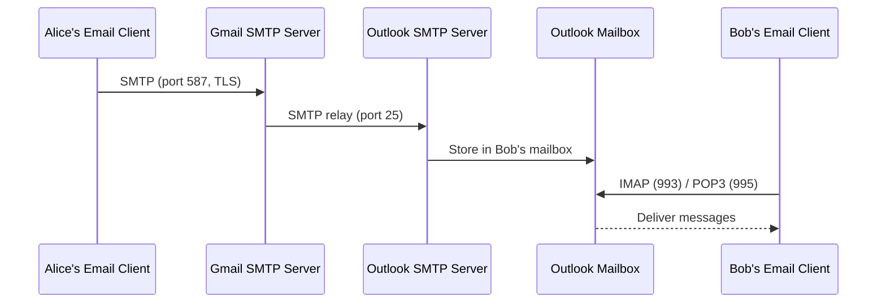
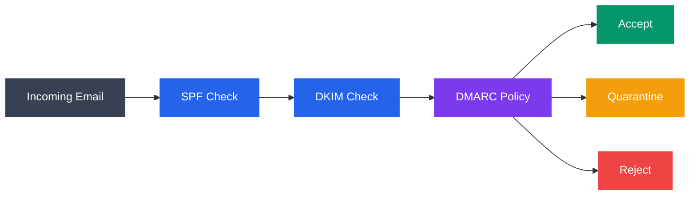

# Email Protocols — SMTP, POP3, IMAP

Email is one of the oldest and most widely used internet applications. Behind every email you send or receive, multiple protocols work together: SMTP for sending, POP3 or IMAP for retrieving. This tutorial explains how email works end-to-end, the role of each protocol, message format, and security mechanisms.

---

## What You'll Learn

- How email works from sender to recipient
- SMTP: how messages are sent and relayed
- POP3: downloading messages to a single device
- IMAP: syncing messages across multiple devices
- POP3 vs IMAP — when to use each
- Email message format and MIME
- Email authentication: SPF, DKIM, DMARC
- Basics of spam filtering

---

## 1. How Email Works End-to-End



```
  alice@gmail.com  sends email to  bob@outlook.com

  ┌─────────┐    SMTP     ┌──────────┐    SMTP     ┌──────────┐
  │ Alice's  │───────────>│  Gmail   │───────────>│ Outlook  │
  │ Email    │  (port 587) │  SMTP    │  (port 25)  │  SMTP    │
  │ Client   │            │  Server  │            │  Server  │
  └─────────┘            └──────────┘            └────┬─────┘
                                                      │
                                                      │ Stored in
                                                      │ Bob's mailbox
                                                      v
  ┌─────────┐  IMAP/POP3  ┌──────────┐
  │ Bob's   │<────────────│ Outlook  │
  │ Email   │ (port 993/  │ Mailbox  │
  │ Client  │  port 995)  │ Server   │
  └─────────┘            └──────────┘
```

**Key steps:**
1. Alice composes email in her client (Thunderbird, Gmail web, etc.)
2. Client submits message to Gmail's SMTP server (port 587 with TLS)
3. Gmail's SMTP server looks up MX record for `outlook.com`
4. Gmail relays the message to Outlook's SMTP server (port 25)
5. Outlook stores the message in Bob's mailbox
6. Bob's client retrieves the message via IMAP (port 993) or POP3 (port 995)

---

## 2. SMTP — Simple Mail Transfer Protocol

SMTP handles **sending and relaying** email. It is a text-based push protocol.

**Ports:**
- **25** — Server-to-server relay (original, often blocked by ISPs)
- **587** — Client-to-server submission (with STARTTLS)
- **465** — Client-to-server with implicit TLS (re-standardized)

### SMTP Conversation

```
Client                              Server
  │                                    │
  │                  220 smtp.gmail.com ESMTP ready
  │                                    │
  │── EHLO client.example.com ───────>│
  │                  250-smtp.gmail.com Hello
  │                  250-STARTTLS
  │                  250 AUTH LOGIN PLAIN
  │                                    │
  │── STARTTLS ──────────────────────>│
  │                  220 Ready to start TLS
  │     (TLS handshake occurs)         │
  │                                    │
  │── AUTH LOGIN ────────────────────>│
  │                  334 (base64 prompt)
  │── (base64 username) ────────────>│
  │                  334 (base64 prompt)
  │── (base64 password) ────────────>│
  │                  235 Authentication successful
  │                                    │
  │── MAIL FROM:<alice@gmail.com> ───>│
  │                  250 OK
  │                                    │
  │── RCPT TO:<bob@outlook.com> ────>│
  │                  250 OK
  │                                    │
  │── DATA ──────────────────────────>│
  │                  354 Start mail input
  │── Subject: Hello Bob              │
  │── From: alice@gmail.com           │
  │── To: bob@outlook.com             │
  │──                                  │
  │── Hi Bob, how are you?            │
  │── .  (single dot = end of data)   │
  │                  250 OK: queued
  │                                    │
  │── QUIT ──────────────────────────>│
  │                  221 Bye
```

### Testing SMTP with Telnet

```bash
# Connect to SMTP server (unencrypted, for testing only)
telnet smtp.example.com 25

# Or use openssl for TLS connection
openssl s_client -starttls smtp -connect smtp.gmail.com:587
```

---

## 3. POP3 — Post Office Protocol Version 3

POP3 **downloads** messages from the server to the client. By default, messages are deleted from the server after download.

**Ports:**
- **110** — Unencrypted
- **995** — POP3 over TLS (POP3S)

### POP3 Session

```
Client                              Server
  │                                    │
  │              +OK POP3 server ready │
  │                                    │
  │── USER bob ──────────────────────>│
  │              +OK                   │
  │                                    │
  │── PASS secret123 ────────────────>│
  │              +OK Logged in         │
  │                                    │
  │── STAT ──────────────────────────>│
  │              +OK 3 12500           │
  │              (3 messages, 12500 bytes)
  │                                    │
  │── LIST ──────────────────────────>│
  │              +OK                   │
  │              1 4200                │
  │              2 3800                │
  │              3 4500                │
  │              .                     │
  │                                    │
  │── RETR 1 ────────────────────────>│
  │              +OK 4200 octets       │
  │              (full message content)│
  │              .                     │
  │                                    │
  │── DELE 1 ────────────────────────>│
  │              +OK Deleted           │
  │                                    │
  │── QUIT ──────────────────────────>│
  │              +OK Bye               │
```

---

## 4. IMAP — Internet Message Access Protocol

IMAP **synchronizes** messages between the server and client. Messages stay on the server. Multiple devices see the same mailbox state.

**Ports:**
- **143** — Unencrypted (with STARTTLS)
- **993** — IMAP over TLS (IMAPS)

### IMAP Session

```
Client                              Server
  │                                    │
  │         * OK IMAP server ready     │
  │                                    │
  │── a1 LOGIN bob secret123 ───────>│
  │         a1 OK Logged in            │
  │                                    │
  │── a2 SELECT INBOX ──────────────>│
  │         * 47 EXISTS                │
  │         * 2 RECENT                 │
  │         * FLAGS (\Seen \Answered   │
  │                  \Flagged \Draft)  │
  │         a2 OK [READ-WRITE] SELECT │
  │                                    │
  │── a3 FETCH 47 (ENVELOPE BODY[]) ─>│
  │         * 47 FETCH (ENVELOPE ...   │
  │                     BODY[] ...)    │
  │         a3 OK FETCH completed      │
  │                                    │
  │── a4 STORE 47 +FLAGS (\Seen) ───>│
  │         * 47 FETCH (FLAGS (\Seen)) │
  │         a4 OK STORE completed      │
  │                                    │
  │── a5 LOGOUT ────────────────────>│
  │         * BYE Server logging out   │
  │         a5 OK LOGOUT completed     │
```

---

## 5. POP3 vs IMAP Comparison

| Feature | POP3 | IMAP |
|---------|------|------|
| Messages stored on | Client (downloaded) | Server (synced) |
| Multi-device access | Poor (each device downloads separately) | Excellent (all devices see same state) |
| Offline access | Full (downloaded locally) | Limited (cached subset) |
| Server storage | Low (messages removed) | High (messages retained) |
| Bandwidth | High initial download, then low | Lower per-session, but ongoing |
| Folder management | Not supported | Full folder support |
| Search | Local only | Server-side search |
| Ideal for | Single device, limited server space | Multiple devices, webmail |
| Complexity | Simple | More complex |

```
POP3 Model:                          IMAP Model:
┌────────┐   download   ┌──────┐    ┌────────┐   sync   ┌──────┐
│ Server │──────────────>│ PC   │    │ Server │<────────>│ PC   │
│        │  (delete)     └──────┘    │        │          └──────┘
│ empty  │                           │ master │
└────────┘                           │ copy   │<────────>┌──────┐
                                     │        │   sync   │Phone │
                                     └────────┘          └──────┘
```

---

## 6. Email Headers and MIME Format

### Email Headers

```
From: Alice Smith <alice@gmail.com>
To: Bob Jones <bob@outlook.com>
Cc: carol@example.com
Subject: Meeting Tomorrow
Date: Mon, 10 Feb 2026 09:30:00 -0500
Message-ID: <abc123@gmail.com>
MIME-Version: 1.0
Content-Type: multipart/mixed; boundary="----=_Part_123"
X-Mailer: Thunderbird 115.0
```

**Key headers:**

| Header | Purpose |
|--------|---------|
| From | Sender address (can be spoofed without authentication) |
| To / Cc / Bcc | Recipients |
| Subject | Message subject line |
| Date | When the message was sent |
| Message-ID | Unique identifier for this message |
| Reply-To | Address for replies (if different from From) |
| Received | Added by each server that handles the message (trace route) |
| Content-Type | MIME type of the body |

### MIME — Multipurpose Internet Mail Extensions

MIME extends email beyond plain ASCII text to support attachments, HTML, and Unicode.

```
Content-Type: multipart/mixed; boundary="----=_Part_123"

------=_Part_123
Content-Type: text/plain; charset="UTF-8"

Hello Bob, please find the report attached.

------=_Part_123
Content-Type: application/pdf; name="report.pdf"
Content-Disposition: attachment; filename="report.pdf"
Content-Transfer-Encoding: base64

JVBERi0xLjQKJeLjz9MK... (base64 encoded file)

------=_Part_123--
```

**Common MIME types in email:**

| Type | Description |
|------|-------------|
| `text/plain` | Plain text body |
| `text/html` | HTML formatted body |
| `multipart/mixed` | Multiple content parts (text + attachments) |
| `multipart/alternative` | Same content in different formats (plain + HTML) |
| `application/pdf` | PDF attachment |
| `image/jpeg` | JPEG image attachment |

---

## 7. Email Security — SPF, DKIM, DMARC

Email was designed without authentication. Spoofing the `From` header is trivial. Three mechanisms were added to combat this:

### SPF (Sender Policy Framework)

Specifies which mail servers are authorized to send email for a domain.

```
DNS TXT Record:
example.com.  IN  TXT  "v=spf1 include:_spf.google.com ip4:1.2.3.4 -all"

Meaning: Only Google's servers and IP 1.2.3.4 can send mail for example.com.
         Reject all others (-all).
```

### DKIM (DomainKeys Identified Mail)

Adds a **digital signature** to the email header, verified via a DNS public key.

```
Sending Server:
  1. Hashes email headers + body
  2. Signs hash with private key
  3. Adds DKIM-Signature header

Receiving Server:
  1. Reads DKIM-Signature header (selector, domain)
  2. Looks up public key via DNS: selector._domainkey.example.com
  3. Verifies signature against message content
  4. If valid → message is authentic and unmodified
```

### DMARC (Domain-based Message Authentication, Reporting, and Conformance)

Tells receivers what to do when SPF and DKIM checks fail.

```
DNS TXT Record:
_dmarc.example.com.  IN  TXT  "v=DMARC1; p=reject; rua=mailto:reports@example.com"

 p=none     → do nothing (monitor mode)
 p=quarantine → send to spam folder
 p=reject   → reject the message
```



```
  Incoming Email
       │
       v
  ┌─────────┐    Pass?    ┌─────────┐    Pass?    ┌──────────┐
  │ SPF     │───────────>│  DKIM   │───────────>│  DMARC   │
  │ Check   │            │  Check  │            │  Policy  │
  └─────────┘            └─────────┘            └──────────┘
                                                      │
                                          ┌───────────┼───────────┐
                                          v           v           v
                                        Accept    Quarantine    Reject
```

---

## 8. Spam Filtering Basics

Modern spam filters use multiple techniques:

| Technique | How It Works |
|-----------|-------------|
| SPF/DKIM/DMARC | Reject unauthenticated senders |
| Blacklists (RBLs) | Check sender IP against known spam sources |
| Content filtering | Scan for spam keywords, suspicious URLs |
| Bayesian filtering | Machine learning trained on spam/ham examples |
| Rate limiting | Throttle senders sending too many messages |
| Greylisting | Temporarily reject first attempt (spammers rarely retry) |
| Reputation scoring | Track sender domain/IP reputation over time |

```bash
# Check if an IP is blacklisted (Linux)
dig +short 4.3.2.1.zen.spamhaus.org
# Non-empty response = listed

# Check SPF record
dig TXT example.com | grep spf

# Check DKIM record
dig TXT selector._domainkey.example.com

# Check DMARC record
dig TXT _dmarc.example.com
```

---

## 9. Email Protocol Ports Summary

| Protocol | Unencrypted | With TLS | Usage |
|----------|------------|----------|-------|
| SMTP (relay) | 25 | STARTTLS on 25 | Server-to-server |
| SMTP (submit) | 587 | STARTTLS on 587 | Client-to-server |
| SMTP (implicit TLS) | — | 465 | Client-to-server |
| POP3 | 110 | 995 (POP3S) | Client retrieval |
| IMAP | 143 | 993 (IMAPS) | Client sync |

---

## Exercises

### Beginner
1. Describe the journey of an email from `alice@gmail.com` to `bob@yahoo.com`. Name every protocol involved.
2. What is the difference between POP3 and IMAP? Which would you recommend for someone who checks email on both a phone and a laptop?
3. Use `dig TXT gmail.com` to find Gmail's SPF record. What servers are authorized to send mail for gmail.com?

### Intermediate
4. Use `openssl s_client` to connect to an SMTP server on port 587 with STARTTLS. Send a test email manually using SMTP commands (EHLO, MAIL FROM, RCPT TO, DATA).
5. Look up the MX records for three domains. Explain what happens if the highest-priority mail server is down.
6. Explain the MIME structure of an email that contains: a plain text body, an HTML version of the same body, and a PDF attachment.

### Advanced
7. Set up SPF, DKIM, and DMARC records for a test domain. Send a test email and verify the authentication results in the received email headers.
8. Explain how email forwarding can break SPF and DKIM. What is ARC (Authenticated Received Chain) and how does it address this?
9. Design a basic spam filter decision tree that uses SPF, DKIM, sender reputation, and content analysis. Define the decision points and actions at each stage.

---

## Key Takeaways

- Email uses SMTP for sending/relaying and POP3 or IMAP for retrieval.
- IMAP is preferred for multi-device access; POP3 is simpler for single-device use.
- MIME extends email to support HTML, attachments, and non-ASCII text.
- SPF, DKIM, and DMARC together provide sender authentication and protect against spoofing.
- Always use encrypted ports (587/STARTTLS, 993, 995) — never send credentials in plaintext.

---

## Navigation

- **Previous**: [DNS - Domain Name System](./03_dns.md)
- **Next**: [FTP and File Transfer](./05_ftp_and_file_transfer.md)
- **Section Home**: [Application Layer](./README.md)
