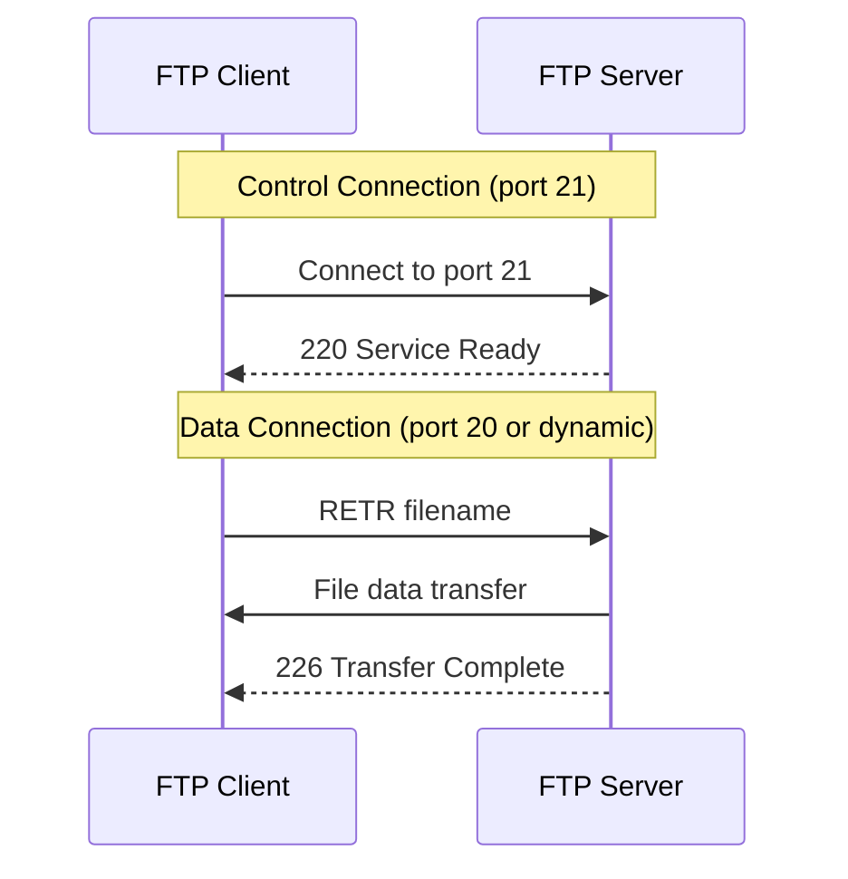
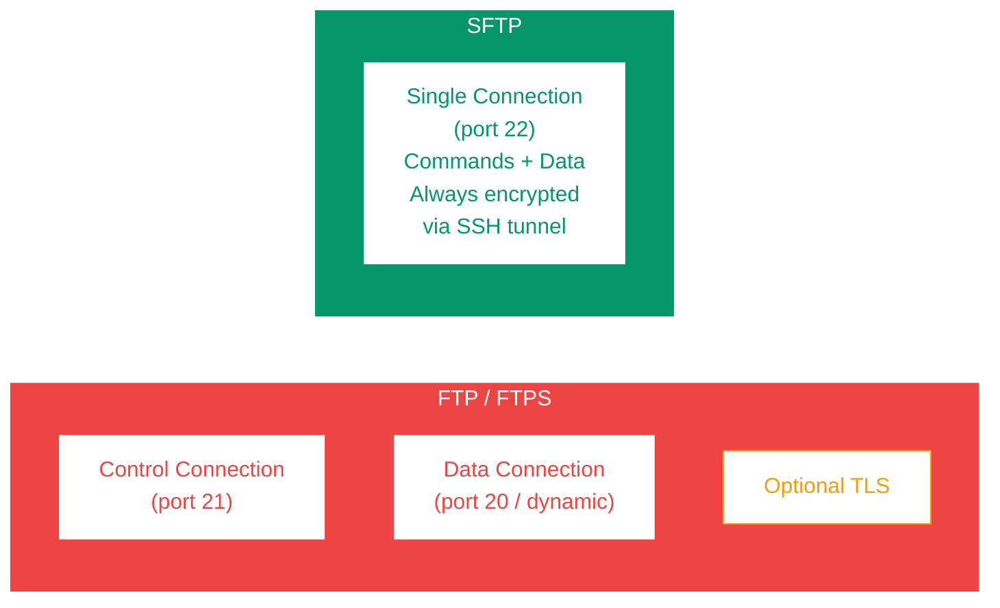

# FTP and File Transfer

Transferring files between systems is a core network operation. FTP was one of the earliest protocols designed for this purpose, but modern alternatives like SFTP and SCP offer better security. This tutorial covers how each protocol works, their differences, and when to use each.

---

## What You'll Learn

- How FTP works: active vs passive mode
- Common FTP commands
- FTPS (FTP over TLS) and how it secures FTP
- SFTP (SSH File Transfer Protocol) and how it differs from FTP
- SCP (Secure Copy Protocol)
- When to use each file transfer protocol
- rsync for efficient file synchronization
- Practical command-line examples

---

## 1. FTP — File Transfer Protocol

FTP is a client-server protocol for transferring files. It uses **two separate connections**: one for commands (control) and one for data.



```
  ┌──────────┐                         ┌──────────┐
  │  FTP     │   Control Connection    │  FTP     │
  │  Client  │──────(port 21)────────>│  Server  │
  │          │                         │          │
  │          │   Data Connection       │          │
  │          │<─────(port 20*)────────│          │
  └──────────┘                         └──────────┘

  * Port 20 in active mode; random port in passive mode
```

**Control connection (port 21):** Carries commands (LIST, RETR, STOR) and responses. Stays open for the entire session.

**Data connection (port 20 or dynamic):** Carries actual file data and directory listings. Opened and closed for each transfer.

### Active vs Passive Mode

**Active mode:** The server connects back to the client for data transfer.

```
Active Mode:
  Client                          Server
  ──────                          ──────
  1. Connect to port 21 ────────> (control)
  2. PORT 192,168,1,5,40,1 ─────> (client says "connect to me
                                    on port 10241")
  3.               <───────────── Server connects FROM port 20
                                   TO client port 10241 (data)

  Problem: Client firewalls often block incoming connections!
```

**Passive mode:** The client initiates both connections. Works better with firewalls/NAT.

```
Passive Mode:
  Client                          Server
  ──────                          ──────
  1. Connect to port 21 ────────> (control)
  2. PASV ──────────────────────> (client says "give me a port")
  3.               <───────────── 227 Entering Passive Mode
                                   (192,168,1,10,195,80)
                                   → port = 195*256+80 = 50000
  4. Connect to port 50000 ─────> (data - client initiates)

  Works through firewalls and NAT.
```

| Feature | Active Mode | Passive Mode |
|---------|-------------|--------------|
| Data initiator | Server → Client | Client → Server |
| Client firewall | Often blocked | Works through firewalls |
| Server firewall | Simple (port 20 outbound) | Must allow range of ports |
| NAT compatible | No (server can't reach private IP) | Yes |
| Default in modern clients | No | Yes |

---

## 2. FTP Commands

### Control Commands

| Command | Purpose | Example |
|---------|---------|---------|
| USER | Send username | `USER alice` |
| PASS | Send password | `PASS secret123` |
| LIST | List directory contents | `LIST /public` |
| CWD | Change working directory | `CWD /uploads` |
| PWD | Print working directory | `PWD` |
| MKD | Create directory | `MKD /newdir` |
| RMD | Remove directory | `RMD /olddir` |
| RETR | Download (retrieve) a file | `RETR report.pdf` |
| STOR | Upload (store) a file | `STOR data.csv` |
| DELE | Delete a file | `DELE old.txt` |
| RNFR/RNTO | Rename a file | `RNFR old.txt` → `RNTO new.txt` |
| TYPE | Set transfer mode | `TYPE I` (binary), `TYPE A` (ASCII) |
| PASV | Enter passive mode | `PASV` |
| PORT | Specify client data port | `PORT 192,168,1,5,40,1` |
| QUIT | End session | `QUIT` |

### FTP Response Codes

| Code | Meaning |
|------|---------|
| 200 | Command OK |
| 220 | Service ready |
| 226 | Transfer complete |
| 230 | User logged in |
| 331 | Username OK, need password |
| 425 | Can't open data connection |
| 426 | Connection closed, transfer aborted |
| 530 | Not logged in |
| 550 | File not found / permission denied |

---

## 3. FTPS — FTP over TLS

FTPS adds TLS encryption to standard FTP. Two variants exist:

```
Explicit FTPS (port 21):            Implicit FTPS (port 990):
  Client connects to port 21          Client connects to port 990
  Sends AUTH TLS command               TLS handshake begins immediately
  TLS handshake occurs                 No unencrypted phase
  Then normal FTP over TLS             Then normal FTP over TLS
```

| Aspect | Explicit FTPS | Implicit FTPS |
|--------|---------------|---------------|
| Port | 21 (same as FTP) | 990 |
| Backward compatible | Yes (can fall back to plain FTP) | No |
| TLS initiation | Client sends `AUTH TLS` | Automatic on connect |
| Recommended | Yes (more flexible) | Legacy |

```bash
# Connect with explicit FTPS using curl
curl --ftp-ssl ftp://ftp.example.com/file.txt -u user:pass

# Connect with lftp (explicit TLS)
lftp -e "set ftp:ssl-allow yes" -u user,pass ftp.example.com
```

---

## 4. SFTP — SSH File Transfer Protocol

SFTP is **not FTP over SSH**. It is a completely different protocol that runs over an SSH connection. It uses a single encrypted connection (port 22).



```
FTP/FTPS:                           SFTP:
┌────────────────────┐              ┌────────────────────┐
│ Control (port 21)  │              │ Single Connection  │
├────────────────────┤              │    (port 22)       │
│ Data (port 20/     │              │ Commands + Data    │
│       dynamic)     │              │ All encrypted      │
├────────────────────┤              │ via SSH tunnel     │
│ Optional TLS       │              └────────────────────┘
└────────────────────┘
  Two connections                    One connection
  TLS optional (FTP)                 Always encrypted
  or added (FTPS)
```

### SFTP Commands

```bash
# Connect
sftp user@server.example.com

# Navigate
sftp> pwd                   # Remote working directory
sftp> lpwd                  # Local working directory
sftp> ls                    # List remote files
sftp> lls                   # List local files
sftp> cd /remote/path       # Change remote directory
sftp> lcd /local/path       # Change local directory

# Transfer files
sftp> get remote_file.txt             # Download
sftp> get -r remote_directory/        # Download directory recursively
sftp> put local_file.txt              # Upload
sftp> put -r local_directory/         # Upload directory recursively

# File operations
sftp> mkdir new_directory
sftp> rm unwanted_file.txt
sftp> rename old.txt new.txt

# Exit
sftp> quit
```

---

## 5. SCP — Secure Copy Protocol

SCP uses SSH for secure file copying. It is simpler than SFTP — designed for one-off file transfers rather than interactive sessions.

```bash
# Copy local file to remote server
scp file.txt user@server:/remote/path/

# Copy remote file to local machine
scp user@server:/remote/path/file.txt ./local/

# Copy directory recursively
scp -r local_dir/ user@server:/remote/path/

# Copy between two remote servers
scp user1@server1:/file.txt user2@server2:/path/

# Use specific SSH port
scp -P 2222 file.txt user@server:/path/

# Preserve timestamps and permissions
scp -p file.txt user@server:/path/

# Limit bandwidth (in Kbit/s)
scp -l 1000 large_file.zip user@server:/path/
```

**Note:** SCP is considered deprecated in favor of SFTP. OpenSSH 9.0+ uses SFTP internally when you run `scp`.

---

## 6. Protocol Comparison

| Feature | FTP | FTPS | SFTP | SCP |
|---------|-----|------|------|-----|
| Port(s) | 21 + 20/dynamic | 21 (or 990) + dynamic | 22 | 22 |
| Encryption | None | TLS | SSH | SSH |
| Connections | 2 (control + data) | 2 (control + data) | 1 | 1 |
| Authentication | Username/password | Username/password + cert | SSH keys or password | SSH keys or password |
| Firewall friendly | No (active mode) | No (data ports) | Yes (single port) | Yes (single port) |
| Resume transfers | Yes | Yes | Yes | No |
| Directory listing | Yes | Yes | Yes | No |
| Interactive session | Yes | Yes | Yes | No (single command) |
| Speed | Fast (no encryption) | Moderate | Moderate | Fast (minimal overhead) |
| Modern recommendation | Avoid | Use if FTP required | Preferred | Simple transfers |

```
  Security Spectrum:
  
  FTP ──────── FTPS ──────── SFTP/SCP
  (none)       (TLS added)   (SSH-based)
  
  Least secure              Most secure
  Most firewall issues      Fewest firewall issues
```

---

## 7. rsync — Efficient File Synchronization

rsync transfers only the **differences** between source and destination, making it highly efficient for synchronization and backups.

```
Full Copy (scp):                   Incremental Sync (rsync):
┌──────────────────┐               ┌──────────────────┐
│ File A (100 MB)  │  100 MB       │ File A (100 MB)  │  0 MB (unchanged)
│ File B (50 MB)   │  50 MB        │ File B (50 MB)   │  2 MB (only changes)
│ File C (200 MB)  │  200 MB       │ File C (new)     │  200 MB
├──────────────────┤               ├──────────────────┤
│ Total: 350 MB    │               │ Total: 202 MB    │
└──────────────────┘               └──────────────────┘
```

### rsync Usage

```bash
# Basic local sync
rsync -av source/ destination/

# Sync to remote server (uses SSH)
rsync -avz local_dir/ user@server:/remote/dir/

# Sync from remote server
rsync -avz user@server:/remote/dir/ local_dir/

# Delete files in destination that don't exist in source
rsync -av --delete source/ destination/

# Dry run (show what would happen without doing it)
rsync -avn source/ destination/

# Exclude files
rsync -av --exclude='*.log' --exclude='.git/' source/ dest/

# Limit bandwidth (KBytes/sec)
rsync -avz --bwlimit=1000 source/ user@server:/dest/

# Show progress
rsync -av --progress source/ destination/
```

**Common flags:**

| Flag | Purpose |
|------|---------|
| `-a` | Archive mode (recursive, preserves permissions, times, etc.) |
| `-v` | Verbose output |
| `-z` | Compress data during transfer |
| `-n` | Dry run (simulate only) |
| `--delete` | Remove extraneous files from destination |
| `--progress` | Show transfer progress |
| `--exclude` | Skip matching files |
| `-e ssh` | Specify SSH as transport (default) |

---

## 8. Practical Workflow Examples

### Deploying a Website

```bash
# Sync website files to server, delete removed files
rsync -avz --delete \
  --exclude='.git/' \
  --exclude='node_modules/' \
  ./build/ user@webserver:/var/www/html/
```

### Automated Backup

```bash
# Daily backup with date-stamped log
rsync -avz --log-file="/var/log/backup_$(date +%Y%m%d).log" \
  /important/data/ user@backup-server:/backups/daily/
```

### Downloading Files from a Server

```bash
# Download with SFTP (interactive)
sftp user@server
sftp> cd /data/reports
sftp> get -r 2026-reports/
sftp> quit

# Download with SCP (one command)
scp -r user@server:/data/reports/2026-reports/ ./local-reports/

# Download with rsync (resume-capable, only changes)
rsync -avz --partial user@server:/data/reports/ ./local-reports/
```

---

## Exercises

### Beginner
1. Explain the difference between FTP active mode and passive mode. Why is passive mode preferred?
2. What are the two connections FTP uses? What is each one for?
3. Use `sftp` to connect to a server, list files, download one file, and upload another.

### Intermediate
4. Compare FTP, FTPS, SFTP, and SCP. For each of these scenarios, which protocol would you choose and why?
   - (a) Transferring files to a legacy system that only supports FTP
   - (b) Automated daily backup of a database dump
   - (c) One-time transfer of a large file to a colleague's server
   - (d) Syncing a website deployment folder
5. Write an rsync command that synchronizes a local project directory to a remote server, excluding `.git/`, `node_modules/`, and `*.log` files, while showing progress and compressing data.
6. Explain why SCP is being deprecated in favor of SFTP. What limitations does SCP have?

### Advanced
7. Set up an SFTP-only user on a Linux server using `sshd_config` with a chroot jail. The user should only be able to access their home directory via SFTP, with no shell access.
8. Implement a Python script that uses the `paramiko` library to connect via SFTP, list files in a remote directory, and download any files modified in the last 24 hours.
9. Design a backup strategy for a multi-server environment using rsync. Consider: incremental backups, bandwidth limits, failure recovery, and integrity verification.

---

## Key Takeaways

- FTP uses two connections (control + data) and has active/passive modes; passive works better with firewalls.
- FTPS adds TLS to FTP but still has firewall complexity due to multiple connections.
- SFTP uses a single SSH connection (port 22) and is the recommended protocol for secure file transfer.
- SCP is simple for one-off copies but is being deprecated in favor of SFTP.
- rsync is the best tool for synchronization — it transfers only differences, saving bandwidth and time.
- Always prefer encrypted protocols (SFTP, SCP, rsync over SSH) over unencrypted FTP.

---

## Navigation

- **Previous**: [Email Protocols](./04_email_protocols.md)
- **Next**: [WebSockets and Real-time Communication](./06_websockets.md)
- **Section Home**: [Application Layer](./README.md)
