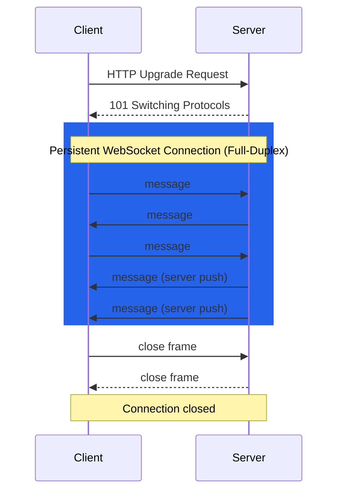
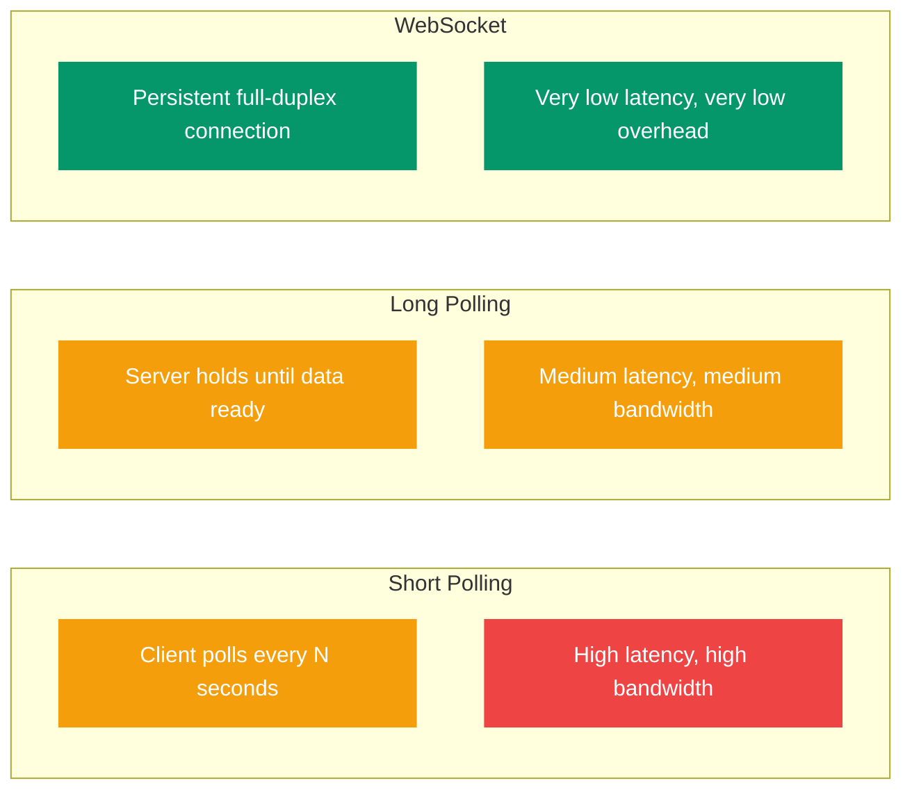

# WebSockets and Real-time Communication

HTTP follows a request-response model: the client asks, the server answers. But many modern applications need the server to push data to the client in real time — chat messages, live scores, stock tickers, multiplayer game state. WebSockets provide a persistent, bidirectional communication channel over a single TCP connection.

---

## What You'll Learn

- Why HTTP is insufficient for real-time communication
- How WebSockets work and the upgrade handshake
- WebSocket vs HTTP comparison
- WebSocket frame structure and message types
- Server-Sent Events (SSE) as an alternative
- Long polling, short polling, and their trade-offs
- Real-world use cases for real-time protocols
- Practical WebSocket examples in JavaScript and Python

---

## 1. Limitations of HTTP for Real-time

```
HTTP Request-Response (Half-Duplex):

Client                           Server
  │── GET /updates ──────────────>│
  │<── Response (data) ──────────│   Connection closes or idles
  │                               │
  │   (Client must ask again)     │
  │── GET /updates ──────────────>│
  │<── Response (data) ──────────│
  │                               │

  Problems:
  - Client doesn't know WHEN new data exists
  - Constant polling wastes bandwidth
  - Latency = polling interval
  - HTTP headers add overhead to every request (~200-800 bytes)
```

**The core problem:** HTTP is client-initiated. The server cannot spontaneously send data to the client without being asked first.

---

## 2. What Are WebSockets

WebSockets provide **full-duplex communication** over a single, long-lived TCP connection. Either side can send data at any time.



```
WebSocket (Full-Duplex):

Client                           Server
  │── HTTP Upgrade Request ─────>│
  │<── 101 Switching Protocols ──│   Handshake complete
  │                               │
  │<═══════ Persistent ════════>│   Single TCP connection
  │         Connection           │
  │                               │
  │── message ──────────────────>│   Client sends anytime
  │<── message ──────────────────│   Server sends anytime
  │── message ──────────────────>│
  │<── message ──────────────────│
  │<── message ──────────────────│   Server pushes without request
  │                               │
  │── close frame ──────────────>│
  │<── close frame ──────────────│   Clean shutdown
```

**Key properties:**
- Starts as HTTP, upgrades to WebSocket
- Persistent connection — no reconnection overhead
- Full-duplex — both sides send independently
- Low overhead — minimal framing (2-14 bytes vs hundreds for HTTP headers)
- Works on ports 80 (ws://) and 443 (wss://)

---

## 3. WebSocket Handshake

The connection starts with an HTTP `Upgrade` request:

### Client Request

```http
GET /chat HTTP/1.1
Host: server.example.com
Upgrade: websocket
Connection: Upgrade
Sec-WebSocket-Key: dGhlIHNhbXBsZSBub25jZQ==
Sec-WebSocket-Version: 13
Origin: http://example.com
```

### Server Response

```http
HTTP/1.1 101 Switching Protocols
Upgrade: websocket
Connection: Upgrade
Sec-WebSocket-Accept: s3pPLMBiTxaQ9kYGzzhZRbK+xOo=
```

```
  ┌──────────┐                          ┌──────────┐
  │  Client  │                          │  Server  │
  └────┬─────┘                          └────┬─────┘
       │                                     │
       │── GET /chat HTTP/1.1 ──────────────>│  HTTP Request
       │   Upgrade: websocket                │  with upgrade
       │   Sec-WebSocket-Key: xxx            │
       │                                     │
       │<── 101 Switching Protocols ─────────│  Server agrees
       │    Sec-WebSocket-Accept: yyy        │
       │                                     │
       │<═══════ WebSocket frames ═════════>│  Now speaking
       │         (binary protocol)           │  WebSocket
       │                                     │
```

The `Sec-WebSocket-Accept` value is computed from the client's key:
`Base64(SHA1(Sec-WebSocket-Key + "258EAFA5-E914-47DA-95CA-C5AB0DC85B11"))`

---

## 4. WebSocket vs HTTP

| Feature | HTTP | WebSocket |
|---------|------|-----------|
| Communication | Request-response (half-duplex) | Full-duplex |
| Connection | Short-lived (or keep-alive) | Long-lived persistent |
| Overhead per message | Headers (~200-800 bytes) | Frame header (2-14 bytes) |
| Server push | Not native (requires polling/SSE) | Native |
| Protocol | Text-based | Binary framing |
| State | Stateless | Stateful (connection maintained) |
| Caching | Yes (browser, CDN) | No |
| Load balancing | Simple (any request to any server) | Sticky sessions needed |
| Ideal for | Document retrieval, APIs | Real-time bidirectional data |

---

## 5. WebSocket Frames

After the handshake, data is sent in **frames**:

```
  0                   1                   2                   3
  0 1 2 3 4 5 6 7 8 9 0 1 2 3 4 5 6 7 8 9 0 1 2 3 4 5 6 7 8 9 0 1
 +-+-+-+-+-------+-+-------------+-------------------------------+
 |F|R|R|R| opcode|M| Payload len |    Extended payload length    |
 |I|S|S|S|  (4)  |A|     (7)     |           (16/64)             |
 |N|V|V|V|       |S|             |   (if payload len==126/127)   |
 | |1|2|3|       |K|             |                               |
 +-+-+-+-+-------+-+-------------+-------------------------------+
 |     Masking-key (if MASK=1)   |          Payload Data         |
 +-------------------------------+-------------------------------+
```

**Opcodes (message types):**

| Opcode | Type | Description |
|--------|------|-------------|
| 0x0 | Continuation | Part of a multi-frame message |
| 0x1 | Text | UTF-8 text data |
| 0x2 | Binary | Binary data |
| 0x8 | Close | Connection close |
| 0x9 | Ping | Heartbeat check |
| 0xA | Pong | Heartbeat response |

- **Client-to-server** frames must be masked (XOR with masking key)
- **Server-to-client** frames are unmasked
- Messages can be split across multiple frames (FIN bit = 0 for continuation)

---

## 6. Server-Sent Events (SSE)

SSE is a simpler alternative when you only need **server-to-client** push (not bidirectional).

```
SSE (Unidirectional):

Client                           Server
  │── GET /events ──────────────>│
  │<── Content-Type: text/       │
  │    event-stream              │
  │<── data: message 1           │
  │<── data: message 2           │   Server pushes data
  │<── data: message 3           │   Client cannot send
  │         ...                  │
```

### SSE Format

```
HTTP/1.1 200 OK
Content-Type: text/event-stream
Cache-Control: no-cache
Connection: keep-alive

event: message
data: {"user": "Alice", "text": "Hello!"}
id: 1

event: message
data: {"user": "Bob", "text": "Hi Alice!"}
id: 2

event: notification
data: {"type": "join", "user": "Carol"}
id: 3
```

### SSE vs WebSocket

| Feature | SSE | WebSocket |
|---------|-----|-----------|
| Direction | Server → Client only | Bidirectional |
| Protocol | HTTP | WebSocket (upgraded from HTTP) |
| Reconnection | Built-in auto-reconnect | Must implement manually |
| Data format | Text only (UTF-8) | Text and binary |
| Browser support | All modern (no IE) | All modern |
| Complexity | Simple | More complex |
| Best for | News feeds, notifications | Chat, gaming, collaboration |

---

## 7. Polling Approaches Compared



```
Short Polling:
  Client ──req──> Server        Every N seconds, client asks.
  Client <──res── Server        Wastes bandwidth when no updates.
  (wait N seconds)
  Client ──req──> Server
  Client <──res── Server

Long Polling:
  Client ──req──> Server        Server holds request open until
  (server waits for data...)     data is available or timeout.
  Client <──res── Server        Client immediately reconnects.
  Client ──req──> Server
  (server waits...)
  Client <──res── Server

WebSocket:
  Client ═══════ Server         Persistent connection.
  Client <──msg── Server        Server pushes instantly.
  Client ──msg──> Server        Client sends instantly.
  Client <──msg── Server        Minimal overhead.
```

| Approach | Latency | Bandwidth | Complexity | Bidirectional |
|----------|---------|-----------|------------|---------------|
| Short polling | High (polling interval) | High (constant requests) | Low | No |
| Long polling | Medium (near real-time) | Medium | Medium | No (simulated) |
| SSE | Low | Low | Low | No |
| WebSocket | Very low | Very low | High | Yes |

---

## 8. Use Cases

| Use Case | Best Protocol | Why |
|----------|---------------|-----|
| Chat applications | WebSocket | Bidirectional, low latency |
| Live sports scores | SSE | Server pushes only, simple |
| Stock tickers | WebSocket | High-frequency updates |
| Multiplayer gaming | WebSocket | Real-time state sync |
| Live dashboards | SSE or WebSocket | Depends on interactivity |
| Collaborative editing | WebSocket | Bidirectional conflict resolution |
| Push notifications | SSE | Server-initiated |
| IoT sensor data | WebSocket or MQTT | Persistent connection, low overhead |

---

## 9. WebSocket Example — JavaScript

### Client (Browser)

```javascript
// Connect to WebSocket server
const ws = new WebSocket('wss://server.example.com/chat');

// Connection opened
ws.addEventListener('open', () => {
  console.log('Connected to server');
  ws.send(JSON.stringify({ type: 'join', user: 'Alice' }));
});

// Receive messages
ws.addEventListener('message', (event) => {
  const data = JSON.parse(event.data);
  console.log(`${data.user}: ${data.text}`);
});

// Handle errors
ws.addEventListener('error', (error) => {
  console.error('WebSocket error:', error);
});

// Connection closed
ws.addEventListener('close', (event) => {
  console.log(`Disconnected: code=${event.code} reason=${event.reason}`);
  // Implement reconnection logic here
});

// Send a message
function sendMessage(text) {
  if (ws.readyState === WebSocket.OPEN) {
    ws.send(JSON.stringify({ type: 'message', user: 'Alice', text }));
  }
}
```

### SSE Client (Browser)

```javascript
const source = new EventSource('/api/events');

source.addEventListener('message', (event) => {
  const data = JSON.parse(event.data);
  console.log('Received:', data);
});

source.addEventListener('notification', (event) => {
  const data = JSON.parse(event.data);
  console.log('Notification:', data);
});

source.addEventListener('error', () => {
  console.log('SSE connection error, will auto-reconnect');
});
```

---

## 10. WebSocket Example — Python

### Server (using `websockets` library)

```python
import asyncio
import websockets
import json

connected_clients = set()

async def handler(websocket):
    connected_clients.add(websocket)
    try:
        async for raw_message in websocket:
            message = json.loads(raw_message)
            print(f"Received: {message}")

            # Broadcast to all connected clients
            broadcast = json.dumps({
                "user": message.get("user", "anonymous"),
                "text": message.get("text", ""),
            })
            for client in connected_clients:
                if client != websocket:
                    await client.send(broadcast)
    finally:
        connected_clients.discard(websocket)

async def main():
    async with websockets.serve(handler, "localhost", 8765):
        print("WebSocket server running on ws://localhost:8765")
        await asyncio.Future()  # Run forever

asyncio.run(main())
```

### Client (Python)

```python
import asyncio
import websockets
import json

async def chat_client():
    uri = "ws://localhost:8765"
    async with websockets.connect(uri) as ws:
        # Send a message
        await ws.send(json.dumps({
            "user": "Bob",
            "text": "Hello from Python!"
        }))

        # Receive messages
        async for message in ws:
            data = json.loads(message)
            print(f"{data['user']}: {data['text']}")

asyncio.run(chat_client())
```

---

## Exercises

### Beginner
1. Explain why HTTP request-response is insufficient for a live chat application.
2. What is the difference between short polling and long polling? Draw a timeline for each showing three messages from the server.
3. When would you use SSE instead of WebSockets? Give two specific examples.

### Intermediate
4. Write a JavaScript WebSocket client that connects to `wss://echo.websocket.org`, sends a message, and logs the echoed response.
5. Implement a Python WebSocket server that maintains a list of connected clients and broadcasts the current user count whenever someone connects or disconnects.
6. Compare the bandwidth usage of short polling (every 2 seconds) vs WebSocket for a chat application that averages 10 messages per minute. Assume HTTP headers are 500 bytes and WebSocket frame overhead is 6 bytes.

### Advanced
7. Build a simple real-time collaborative text area: a WebSocket server that broadcasts text changes to all connected clients, and an HTML client that displays the shared text.
8. Implement reconnection logic with exponential backoff for a WebSocket client. Handle: initial connection failure, connection drop, and server-initiated close.
9. Design a scalable WebSocket architecture for 100,000 concurrent users. Consider: load balancing (sticky sessions vs shared state), horizontal scaling, message ordering, and connection state management.

---

## Key Takeaways

- WebSockets provide full-duplex, persistent communication — ideal for real-time applications.
- The connection starts as HTTP and upgrades to WebSocket via the 101 Switching Protocols handshake.
- WebSocket frame overhead is minimal (2-14 bytes) compared to HTTP headers (hundreds of bytes).
- SSE is a simpler alternative when you only need server-to-client push.
- Choose the right tool: short polling for simplicity, long polling for compatibility, SSE for unidirectional push, WebSocket for full real-time interaction.
- WebSocket connections are stateful — scaling requires sticky sessions or shared state.

---

## Navigation

- **Previous**: [FTP and File Transfer](./05_ftp_and_file_transfer.md)
- **Next**: [REST APIs and Web Services](./07_rest_apis.md)
- **Section Home**: [Application Layer](./README.md)
