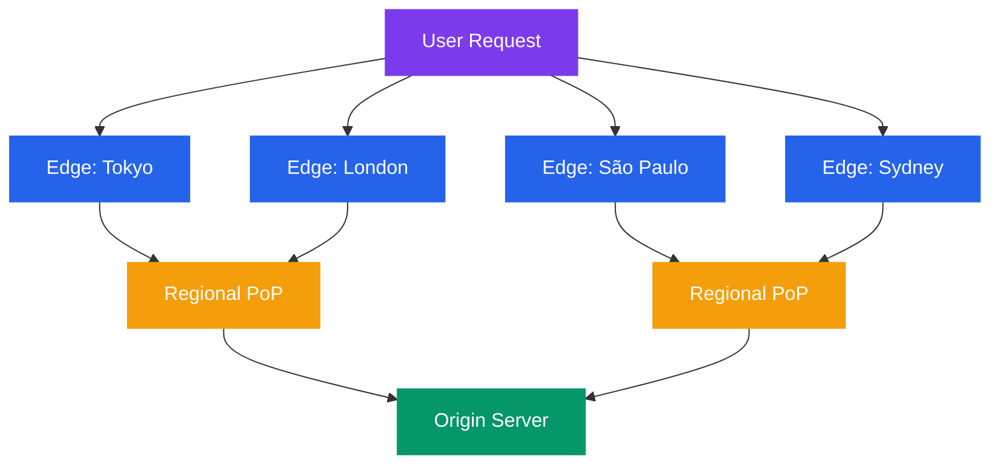
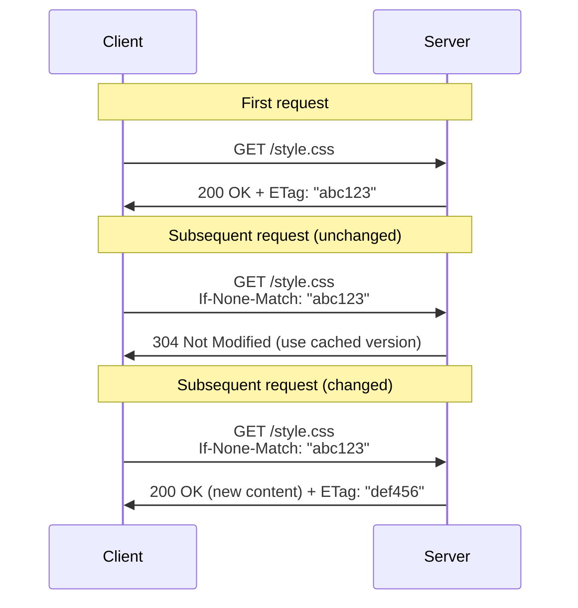

# Network Performance and Optimization

A well-designed protocol is only half the story — performance determines the user experience. This tutorial covers the techniques used to make web applications fast: CDNs, caching, compression, connection management, and measurement tools.

---

## What You'll Learn

- How CDNs (Content Delivery Networks) work and why they matter
- Caching strategies at the browser, proxy, and CDN levels
- HTTP/2 and HTTP/3 performance advantages
- Compression algorithms: gzip and Brotli
- Connection pooling and keep-alive
- DNS optimization techniques
- How to measure network performance (latency, TTFB, throughput)
- Load testing tools and methodologies
- Best practices for network optimization

---

## 1. CDN — Content Delivery Networks

A CDN is a geographically distributed network of servers that cache and serve content close to end users.

```
Without CDN:
  User (Tokyo) ─────── 12,000 km ──────> Origin Server (New York)
  Latency: ~150ms round trip

With CDN:
  User (Tokyo) ──── 50 km ───> CDN Edge (Tokyo) ──cache hit──> Response
  Latency: ~5ms round trip

  If cache miss:
  User (Tokyo) ──> CDN Edge (Tokyo) ──> Origin (New York) ──> CDN caches ──> User
```

### How CDNs Work



```
  ┌────────────────────────────────────────────────────┐
  │                    CDN Network                      │
  │                                                    │
  │  ┌──────┐    ┌──────┐    ┌──────┐    ┌──────┐    │
  │  │Edge  │    │Edge  │    │Edge  │    │Edge  │    │
  │  │Tokyo │    │London│    │São   │    │Sydney│    │
  │  │      │    │      │    │Paulo │    │      │    │
  │  └──┬───┘    └──┬───┘    └──┬───┘    └──┬───┘    │
  │     │           │           │           │        │
  │     └─────────┬─┴───────────┴─┬─────────┘        │
  │               │               │                   │
  │          ┌────┴────┐    ┌─────┴────┐              │
  │          │Regional │    │Regional  │              │
  │          │PoP      │    │PoP       │              │
  │          └────┬────┘    └─────┬────┘              │
  │               └───────┬───────┘                   │
  │                       │                           │
  │                 ┌─────┴─────┐                     │
  │                 │  Origin   │                     │
  │                 │  Server   │                     │
  │                 └───────────┘                     │
  └────────────────────────────────────────────────────┘
```

**What CDNs cache:**
- Static assets: images, CSS, JavaScript, fonts
- Video and audio files
- API responses (with appropriate cache headers)
- Entire HTML pages (for static sites)

**CDN benefits:**

| Benefit | Impact |
|---------|--------|
| Lower latency | Content served from nearby edge |
| Reduced origin load | Most requests never hit origin |
| DDoS protection | Distributed network absorbs attacks |
| High availability | Failover across edge locations |
| SSL/TLS termination | Edge handles encryption, reducing origin work |

---

## 2. Caching Strategies

### Cache Layers

```
  Request Flow with Caching:

  Browser ──> Browser Cache ──> CDN/Proxy Cache ──> Origin Server
              (local disk)      (edge server)       (application)

  Cache Hit at any layer = faster response, no origin traffic
```

### HTTP Cache Headers

```
  Cache-Control Directives:

  ┌─────────────────────────────────────────────────────────┐
  │ Response from server:                                   │
  │                                                         │
  │ Cache-Control: public, max-age=3600                     │
  │   → Anyone can cache, valid for 1 hour                  │
  │                                                         │
  │ Cache-Control: private, max-age=600                     │
  │   → Only browser can cache, valid for 10 minutes        │
  │                                                         │
  │ Cache-Control: no-cache                                 │
  │   → Must revalidate with server before using cache      │
  │                                                         │
  │ Cache-Control: no-store                                 │
  │   → Never cache (sensitive data)                        │
  │                                                         │
  │ Cache-Control: public, max-age=31536000, immutable      │
  │   → Cache for 1 year, never revalidate (versioned file) │
  └─────────────────────────────────────────────────────────┘
```

### Cache Validation (Conditional Requests)



```
First request:
  Client ── GET /style.css ──────────────────> Server
  Client <── 200 OK ──────────────────────── Server
              ETag: "abc123"
              Last-Modified: Mon, 10 Feb 2026

Subsequent request:
  Client ── GET /style.css ──────────────────> Server
             If-None-Match: "abc123"
             If-Modified-Since: Mon, 10 Feb 2026

  If unchanged:
  Client <── 304 Not Modified ───────────── Server
              (no body — use cached version)

  If changed:
  Client <── 200 OK (new content) ─────────── Server
              ETag: "def456"
```

### Caching Strategy by Resource Type

| Resource | Strategy | Cache-Control | Example |
|----------|----------|---------------|---------|
| Versioned assets | Long-term immutable | `max-age=31536000, immutable` | `style.a1b2c3.css` |
| HTML pages | Short or no cache | `no-cache` or `max-age=300` | `index.html` |
| API responses | Varies | `private, max-age=60` | `/api/user/profile` |
| Images | Long-term | `public, max-age=86400` | `logo.png` |
| Sensitive data | No store | `no-store` | `/api/bank/balance` |

---

## 3. HTTP/2 and HTTP/3 Performance

### HTTP/2 Gains

```
HTTP/1.1 Problems:              HTTP/2 Solutions:
─────────────────               ─────────────────
Head-of-line blocking      →    Multiplexed streams
  (requests queue behind         (all requests in parallel)
   each other)

Redundant headers          →    HPACK header compression
  (same headers repeated         (delta encoding, Huffman)
   every request)

No server initiative       →    Server push
  (server waits for              (server sends predicted
   client to ask)                 resources proactively)
```

**Measurable impact:**

| Metric | HTTP/1.1 | HTTP/2 | Improvement |
|--------|----------|--------|-------------|
| Concurrent streams | 6 (per domain) | 100+ (per connection) | ~16x |
| Header overhead | ~800 bytes/request | ~20 bytes (compressed) | ~40x |
| Connection count | 6-8 per domain | 1 per domain | 6-8x reduction |
| Page load (many resources) | Baseline | 20-50% faster | Significant |

### HTTP/3 (QUIC) Gains

```
TCP Problem: One lost packet blocks ALL streams

  Stream 1: ████░░░░  (blocked waiting for retransmit)
  Stream 2: ████░░░░  (blocked)
  Stream 3: ████░░░░  (blocked)
                ^
           Lost packet affects everything

QUIC Solution: Streams are independent

  Stream 1: ████░░░░  (waiting for its own retransmit)
  Stream 2: ████████  (unaffected, continues)
  Stream 3: ████████  (unaffected, continues)
```

| Feature | HTTP/2 (TCP) | HTTP/3 (QUIC) |
|---------|-------------|---------------|
| Transport | TCP | UDP (QUIC) |
| Connection setup | TCP + TLS (2-3 RTTs) | 1 RTT (0-RTT for repeat) |
| Stream independence | No (TCP HOL blocking) | Yes (per-stream recovery) |
| Connection migration | No (tied to IP:port) | Yes (connection ID based) |
| Packet loss impact | All streams stall | Only affected stream stalls |

---

## 4. Compression

### gzip vs Brotli

```
  Original File: 100 KB JavaScript

  gzip:    ~30 KB  (70% reduction)
  Brotli:  ~25 KB  (75% reduction)

  Compression Level Trade-off:
  ──────────────────────────────
  Low:   Fast compression,   larger files  (good for dynamic content)
  High:  Slow compression,   smaller files (good for static assets)
```

| Feature | gzip | Brotli |
|---------|------|--------|
| Compression ratio | Good | 15-25% better than gzip |
| Compression speed | Fast | Slower (at high levels) |
| Decompression speed | Fast | Fast |
| Browser support | Universal | All modern browsers |
| Best for | Dynamic content, compatibility | Static assets, modern browsers |
| Content-Encoding header | `gzip` | `br` |

```bash
# Check what compression a server supports
curl -H "Accept-Encoding: gzip, br" -I https://example.com

# Response will include:
# Content-Encoding: br   (or gzip)

# Compare compressed sizes
curl -s -o /dev/null -w "Size: %{size_download}\n" \
  -H "Accept-Encoding: identity" https://example.com

curl -s -o /dev/null -w "Size: %{size_download}\n" \
  -H "Accept-Encoding: gzip" https://example.com

curl -s -o /dev/null -w "Size: %{size_download}\n" \
  -H "Accept-Encoding: br" https://example.com
```

**What to compress:**
- Text-based files: HTML, CSS, JavaScript, JSON, XML, SVG
- **Do not** compress: images (JPEG, PNG, WebP), video, already-compressed archives

---

## 5. Connection Pooling and Keep-Alive

### HTTP/1.0 vs HTTP/1.1 Connections

```
HTTP/1.0 (no keep-alive):
  ┌───┐  ┌───┐  ┌───┐
  │TCP│  │TCP│  │TCP│     3 TCP handshakes
  │ + │  │ + │  │ + │     3 TLS handshakes (if HTTPS)
  │TLS│  │TLS│  │TLS│     High overhead
  │Req│  │Req│  │Req│
  └───┘  └───┘  └───┘

HTTP/1.1 (keep-alive, default):
  ┌──────────────────┐
  │TCP + TLS         │    1 TCP handshake
  │Req1  Req2  Req3  │    1 TLS handshake
  └──────────────────┘    Requests reuse connection
```

### Connection Pool Architecture

```
  Application Server
  ┌──────────────────────────────────┐
  │         Connection Pool          │
  │  ┌──────┐ ┌──────┐ ┌──────┐    │
  │  │Conn 1│ │Conn 2│ │Conn 3│    │    Pre-established
  │  │(idle) │ │(busy)│ │(idle) │    │    connections
  │  └──┬───┘ └──┬───┘ └──┬───┘    │
  │     │        │        │        │
  │  Request comes in:              │
  │  1. Check for idle connection   │
  │  2. If available, reuse it      │
  │  3. If not, create new (up to max) │
  │  4. If at max, wait in queue    │
  └──────────────────────────────────┘
         │        │        │
         v        v        v
  ┌──────────────────────────────────┐
  │     Database / External Service  │
  └──────────────────────────────────┘
```

---

## 6. DNS Optimization

```
  DNS Lookup Time:
  ┌──────────────────────────────────────────┐
  │ First visit:   DNS lookup = 20-120ms     │
  │ Cached:        DNS lookup = 0ms          │
  │ Prefetched:    DNS lookup = 0ms (done    │
  │                ahead of time)            │
  └──────────────────────────────────────────┘
```

### DNS Optimization Techniques

| Technique | How It Works | Implementation |
|-----------|-------------|----------------|
| DNS Prefetch | Browser resolves DNS before user clicks link | `<link rel="dns-prefetch" href="//cdn.example.com">` |
| Preconnect | DNS + TCP + TLS handshake ahead of time | `<link rel="preconnect" href="https://cdn.example.com">` |
| Reduce DNS lookups | Fewer unique domains = fewer lookups | Consolidate assets on fewer domains |
| Lower TTL during migration | Faster DNS propagation when changing servers | Set TTL to 300s before migration |
| Use fast resolvers | Public DNS resolvers are often faster than ISP | `1.1.1.1` (Cloudflare), `8.8.8.8` (Google) |

```html
<!-- In <head> of your HTML -->
<link rel="dns-prefetch" href="//fonts.googleapis.com">
<link rel="dns-prefetch" href="//cdn.example.com">
<link rel="preconnect" href="https://api.example.com" crossorigin>
```

---

## 7. Measuring Performance

### Key Metrics

```
  Timeline of a Web Request:

  DNS    TCP    TLS    Request   Response   Render
  ├──────┼──────┼──────┼─────────┼──────────┤
  │      │      │      │         │          │
  t=0   t=20   t=40   t=50     t=80      t=200
  (ms)

  DNS Lookup Time:     20ms
  TCP Connect Time:    20ms (t=20 to t=40)
  TLS Handshake:       10ms (t=40 to t=50)
  TTFB:                80ms (Time To First Byte, t=0 to t=80)
  Content Download:    varies
  Total Load Time:     200ms
```

| Metric | What It Measures | Good Target |
|--------|-----------------|-------------|
| DNS Lookup | Name resolution time | < 20ms |
| TCP Connect | Connection establishment | < 50ms |
| TTFB | Time to first byte of response | < 200ms |
| FCP | First Contentful Paint | < 1.8s |
| LCP | Largest Contentful Paint | < 2.5s |
| TTI | Time to Interactive | < 3.8s |
| Throughput | Data transfer rate | Depends on use case |

### Measuring with curl

```bash
# Detailed timing breakdown
curl -o /dev/null -s -w "\
DNS Lookup:    %{time_namelookup}s\n\
TCP Connect:   %{time_connect}s\n\
TLS Handshake: %{time_appconnect}s\n\
TTFB:          %{time_starttransfer}s\n\
Total Time:    %{time_total}s\n\
Download Size: %{size_download} bytes\n\
Speed:         %{speed_download} bytes/sec\n" \
https://example.com

# Example output:
# DNS Lookup:    0.012s
# TCP Connect:   0.035s
# TLS Handshake: 0.078s
# TTFB:          0.120s
# Total Time:    0.145s
# Download Size: 1256 bytes
# Speed:         8662 bytes/sec
```

---

## 8. Load Testing Tools

| Tool | Type | Language | Best For |
|------|------|----------|----------|
| `ab` (ApacheBench) | CLI | C | Quick HTTP benchmarks |
| `wrk` | CLI | C/Lua | High-performance HTTP benchmarks |
| `k6` | CLI + scripting | Go/JS | Complex load test scenarios |
| `hey` | CLI | Go | Simple HTTP load testing |
| `locust` | Web UI + scripting | Python | User behavior simulation |
| `JMeter` | GUI | Java | Enterprise-grade testing |

### ab (ApacheBench)

```bash
# 1000 requests, 10 concurrent
ab -n 1000 -c 10 https://example.com/

# Key output metrics:
# Requests per second:    523.45 [#/sec]
# Time per request:       19.1 [ms] (mean)
# Transfer rate:          1234.56 [Kbytes/sec]
```

### wrk

```bash
# 30 seconds, 12 threads, 400 connections
wrk -t12 -c400 -d30s https://example.com/

# Output:
# Requests/sec:  15234.12
# Latency:       avg 26.3ms, max 1.2s
# Transfer/sec:  12.34MB
```

### k6

```javascript
// load_test.js
import http from 'k6/http';
import { check, sleep } from 'k6';

export const options = {
  stages: [
    { duration: '30s', target: 20 },   // Ramp up to 20 users
    { duration: '1m',  target: 20 },   // Stay at 20 users
    { duration: '10s', target: 0 },    // Ramp down
  ],
};

export default function () {
  const res = http.get('https://api.example.com/users');
  check(res, {
    'status is 200': (r) => r.status === 200,
    'response time < 500ms': (r) => r.timings.duration < 500,
  });
  sleep(1);
}
```

```bash
k6 run load_test.js
```

---

## 9. Network Optimization Best Practices

### Checklist

```
  ┌─────────────────────────────────────────────────────┐
  │           OPTIMIZATION CHECKLIST                     │
  │                                                     │
  │  [ ] Enable compression (Brotli + gzip fallback)    │
  │  [ ] Use a CDN for static assets                    │
  │  [ ] Set appropriate Cache-Control headers           │
  │  [ ] Use versioned filenames for long-term caching   │
  │  [ ] Enable HTTP/2 (or HTTP/3)                       │
  │  [ ] Minimize DNS lookups (fewer domains)            │
  │  [ ] Add dns-prefetch and preconnect hints           │
  │  [ ] Enable keep-alive connections                   │
  │  [ ] Minimize redirects                              │
  │  [ ] Use connection pooling for backend services     │
  │  [ ] Optimize images (WebP/AVIF, responsive sizes)   │
  │  [ ] Minify CSS and JavaScript                       │
  │  [ ] Lazy load below-the-fold resources              │
  │  [ ] Monitor TTFB and LCP continuously               │
  └─────────────────────────────────────────────────────┘
```

### Optimization Impact Estimates

| Optimization | Typical Impact | Effort |
|-------------|---------------|--------|
| CDN | 40-70% latency reduction | Low |
| Compression (Brotli) | 60-75% smaller transfers | Low |
| HTTP/2 | 20-50% faster page loads | Low |
| Browser caching | 80-100% faster repeat visits | Low |
| Image optimization | 30-50% smaller pages | Medium |
| Connection pooling | 10-30% faster backend calls | Medium |
| DNS prefetch | 20-120ms saved per domain | Low |
| Minification | 10-30% smaller JS/CSS | Low |

---

## Exercises

### Beginner
1. Explain how a CDN reduces latency. Why is physical distance important for network performance?
2. What is the difference between `Cache-Control: no-cache` and `Cache-Control: no-store`?
3. Use `curl` with the timing format string from section 7 to measure the performance of three different websites. Compare DNS, TTFB, and total times.

### Intermediate
4. Design a caching strategy for an e-commerce website. Specify Cache-Control headers for: product images, the home page HTML, API responses for product prices, and user session data.
5. Compare the compressed sizes of a CSS file using gzip and Brotli. Use command-line tools to compress a file with both and compare the output sizes.
6. Explain why HTTP/2 multiplexing improves performance for pages with many small resources (e.g., icons, thumbnails) but has less impact for pages with a few large resources.

### Advanced
7. Set up a load test using k6 or wrk against a test application. Start with 10 concurrent users and increase to 500. Graph the relationship between concurrency, latency, and error rate. Identify the breaking point.
8. Implement a caching layer for a REST API using Redis. Include: cache invalidation on data updates, TTL-based expiry, and cache-aside pattern. Measure the performance improvement.
9. Design a CDN architecture for a video streaming service that serves users globally. Consider: cache tiers, origin shielding, cache eviction policies, and content pre-warming strategies.

---

## Key Takeaways

- CDNs reduce latency by serving content from geographically close edge servers.
- Proper Cache-Control headers prevent unnecessary network requests and reduce server load.
- Compression (Brotli > gzip) dramatically reduces transfer sizes for text-based assets.
- HTTP/2 multiplexing eliminates connection limits; HTTP/3 (QUIC) eliminates transport-level head-of-line blocking.
- Connection pooling and keep-alive reduce the overhead of establishing new connections.
- DNS prefetching and preconnect hints eliminate DNS/connection latency before it occurs.
- Measure before optimizing: use curl timing, load testing tools, and real-user monitoring to identify bottlenecks.

---

## Navigation

- **Previous**: [REST APIs and Web Services](./07_rest_apis.md)
- **Section Home**: [Application Layer](./README.md)
- **Next Section**: [Network Security](../05_network_security/)
