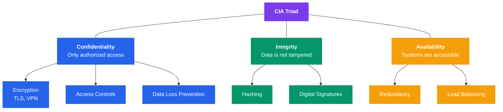
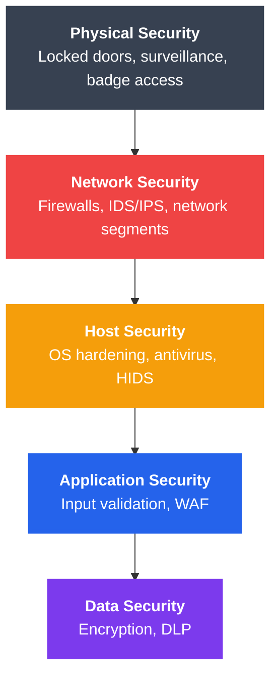

# Network Security Fundamentals

## What You'll Learn

- The CIA triad and why it matters for every security decision
- Major categories of security threats and how they work
- Defense in depth strategy and layered security architecture
- The AAA framework (Authentication, Authorization, Accounting)
- How security policies and risk assessments guide protection efforts
- Where security controls fit in the network stack

---

## 1. The CIA Triad

The CIA triad is the foundation of all information security. Every security control exists to protect one or more of these properties.



```
                ┌──────────────────┐
                │ Confidentiality  │
                │  (Only authorized│
                │   access)        │
                └────────┬─────────┘
                         │
            ┌────────────┼────────────┐
            │            │            │
            ▼            ▼            ▼
     ┌──────────┐  ┌──────────┐  ┌──────────┐
     │Encryption│  │  Access  │  │Data Loss │
     │  TLS,VPN │  │ Controls │  │Prevention│
     └──────────┘  └──────────┘  └──────────┘

       ┌──────────────┐     ┌──────────────┐
       │  Integrity   │     │ Availability │
       │ (Data is not │     │ (Systems are │
       │  tampered)   │     │  accessible) │
       └──────────────┘     └──────────────┘
```

| Property | Goal | Threats | Controls |
|----------|------|---------|----------|
| **Confidentiality** | Prevent unauthorized disclosure | Eavesdropping, data breaches | Encryption, access controls |
| **Integrity** | Prevent unauthorized modification | Tampering, MITM attacks | Hashing, digital signatures |
| **Availability** | Ensure systems are accessible | DDoS, hardware failure | Redundancy, load balancing |

### Real-World Example

When you log in to your bank:
- **Confidentiality** — TLS encrypts your session so no one can read your data
- **Integrity** — HMAC ensures no one modified the data in transit
- **Availability** — Redundant servers ensure the site is up when you need it

---

## 2. Security Threats Overview

### Threat Categories

```
Security Threats
├── Malware
│   ├── Virus         — Attaches to programs, requires execution
│   ├── Worm          — Self-replicating, spreads over networks
│   ├── Trojan        — Disguised as legitimate software
│   ├── Ransomware    — Encrypts data, demands payment
│   └── Spyware       — Monitors user activity silently
├── Network Attacks
│   ├── DDoS          — Floods target with traffic
│   ├── MITM          — Intercepts communication between parties
│   ├── ARP Spoofing  — Redirects local network traffic
│   └── DNS Poisoning — Redirects domain lookups
├── Social Engineering
│   ├── Phishing      — Fraudulent emails/sites
│   ├── Spear Phishing— Targeted phishing
│   ├── Pretexting    — Fabricated scenario for info
│   └── Baiting       — Malware via physical media
└── Application Attacks
    ├── SQL Injection  — Manipulates database queries
    ├── XSS            — Injects scripts into web pages
    └── Buffer Overflow— Overwrites memory boundaries
```

### Threat Actor Types

| Actor | Motivation | Sophistication | Example |
|-------|-----------|----------------|---------|
| Script Kiddies | Fun, notoriety | Low | Using downloaded exploit tools |
| Hacktivists | Political/social cause | Medium | Website defacement |
| Cybercriminals | Financial gain | Medium–High | Ransomware operations |
| Nation-States | Espionage, disruption | Very High | Infrastructure attacks |
| Insiders | Revenge, profit | Varies | Data theft by employees |

---

## 3. Defense in Depth

Defense in depth means applying multiple layers of security so that if one layer fails, others still protect the system.



```
┌──────────────────────────────────────────────────┐
│                 Physical Security                │
│  Locked doors, surveillance, badge access        │
│  ┌──────────────────────────────────────────┐    │
│  │            Network Security              │    │
│  │  Firewalls, IDS/IPS, network segments    │    │
│  │  ┌──────────────────────────────────┐    │    │
│  │  │         Host Security            │    │    │
│  │  │  OS hardening, antivirus, HIDS   │    │    │
│  │  │  ┌──────────────────────────┐    │    │    │
│  │  │  │   Application Security   │    │    │    │
│  │  │  │  Input validation, WAF   │    │    │    │
│  │  │  │  ┌──────────────────┐    │    │    │    │
│  │  │  │  │   Data Security  │    │    │    │    │
│  │  │  │  │  Encryption, DLP │    │    │    │    │
│  │  │  │  └──────────────────┘    │    │    │    │
│  │  │  └──────────────────────────┘    │    │    │
│  │  └──────────────────────────────────┘    │    │
│  └──────────────────────────────────────────┘    │
└──────────────────────────────────────────────────┘
```

**Key principle**: No single security control is sufficient. Attackers only need to find one weakness; defenders must protect every layer.

---

## 4. Authentication, Authorization, and Accounting (AAA)

```
┌──────────┐    ┌───────────────┐    ┌────────────┐    ┌────────────┐
│   User   │───>│Authentication │───>│Authorization│───>│ Accounting │
│ (Request)│    │ "Who are you?"│    │"What can you│    │"What did   │
└──────────┘    │               │    │  access?"   │    │ you do?"   │
                └───────────────┘    └────────────┘    └────────────┘
```

### Authentication (AuthN)

Verifying identity. "Who are you?"

| Factor | Type | Example |
|--------|------|---------|
| Something you **know** | Knowledge | Password, PIN |
| Something you **have** | Possession | Smart card, phone (TOTP) |
| Something you **are** | Inherence | Fingerprint, face scan |

**Multi-Factor Authentication (MFA)** combines two or more factors.

### Authorization (AuthZ)

Determining permissions. "What are you allowed to do?"

- **RBAC** (Role-Based Access Control) — Permissions assigned to roles
- **ABAC** (Attribute-Based Access Control) — Policies based on attributes
- **ACLs** (Access Control Lists) — Per-resource permission lists

### Accounting

Tracking actions for audit and forensics. "What did you do?"

- Login/logout timestamps
- Resources accessed
- Commands executed
- Data transferred

---

## 5. Security Policies and Frameworks

### Security Policy Types

| Policy | Purpose |
|--------|---------|
| **Acceptable Use Policy (AUP)** | Rules for using company resources |
| **Password Policy** | Complexity, rotation, reuse rules |
| **Incident Response Policy** | Steps when a breach occurs |
| **Data Classification Policy** | How to label and handle data |
| **Remote Access Policy** | Rules for VPN, remote work |

### Common Frameworks

| Framework | Focus | Used By |
|-----------|-------|---------|
| NIST CSF | Risk management | US government, private sector |
| ISO 27001 | Information security management | Global organizations |
| CIS Controls | Prioritized security actions | IT teams of all sizes |
| MITRE ATT&CK | Adversary tactics and techniques | Threat intelligence |

---

## 6. Risk Assessment Basics

Risk assessment identifies what could go wrong and how to prioritize defenses.

```
Risk = Threat × Vulnerability × Impact

   ┌────────────┐     ┌───────────────┐     ┌──────────┐
   │   Threat   │  ×  │ Vulnerability │  ×  │  Impact  │  = Risk
   │ (attacker, │     │ (unpatched    │     │ (data    │
   │  malware)  │     │  software)    │     │  loss)   │
   └────────────┘     └───────────────┘     └──────────┘
```

### Risk Response Strategies

| Strategy | Action | Example |
|----------|--------|---------|
| **Mitigate** | Reduce risk with controls | Install firewall |
| **Accept** | Acknowledge and do nothing | Low-impact, low-probability risk |
| **Transfer** | Shift risk to third party | Cyber insurance |
| **Avoid** | Eliminate the risky activity | Discontinue vulnerable service |

---

## 7. Security Layers in Network Architecture

Each layer of the OSI/TCP model has its own security mechanisms:

| Layer | Security Controls | Protocols/Tools |
|-------|-------------------|-----------------|
| Application (7) | WAF, input validation, AuthN | HTTPS, OAuth, SAML |
| Transport (4) | Encryption, session integrity | TLS 1.3, DTLS |
| Network (3) | Packet filtering, tunneling | IPSec, firewall ACLs |
| Data Link (2) | Port security, authentication | 802.1X, MACsec |
| Physical (1) | Access controls, shielding | Locks, cameras, cable mgmt |

### Example: Securing a Web Application

```
User ──── [HTTPS/TLS] ────> Load Balancer
                                │
                          [WAF Rules]
                                │
                           Web Server ──── [Firewall] ──── Database
                                │                            │
                          [App Auth]                   [Encryption
                                                        at Rest]
```

---

## Exercises

### Beginner

1. For each scenario, identify which part of the CIA triad is violated:
   - A hacker reads your emails without permission
   - An attacker changes a bank transfer amount in transit
   - A DDoS attack takes a website offline for 6 hours
2. List three examples of "something you know," "something you have," and "something you are" for authentication.
3. Name the defense-in-depth layer where each control belongs: antivirus, firewall, door lock, TLS, input validation.

### Intermediate

4. You discover an unpatched web server running an old version of Apache. Walk through the risk assessment: identify the threat, vulnerability, potential impact, and recommend a response strategy.
5. Design a simple security policy for a small company with 20 employees covering: password requirements, acceptable use, and incident response steps.
6. Explain why defense in depth is necessary even if you have a "perfect" firewall.

### Advanced

7. Compare NIST CSF and ISO 27001. When would you choose one over the other?
8. Design a security architecture for a three-tier web application (frontend, API, database) identifying controls at every layer.
9. An insider threat actor has valid credentials. Which CIA triad property is hardest to protect in this scenario, and what controls would you implement?

---

## Key Takeaways

- The **CIA triad** (Confidentiality, Integrity, Availability) guides every security decision
- Threats come from many sources — malware, network attacks, social engineering, insiders
- **Defense in depth** layers multiple controls so no single failure is catastrophic
- **AAA** (Authentication, Authorization, Accounting) is the backbone of access control
- **Risk assessment** helps prioritize where to invest security resources
- Security is implemented at **every layer** of the network stack, not just one

---

## Navigation

- [→ Next: Cryptography Basics](./02_cryptography_basics.md)
- [↑ Back to Network Security](./README.md)
- [↑ Back to Computer Networks](../README.md)
