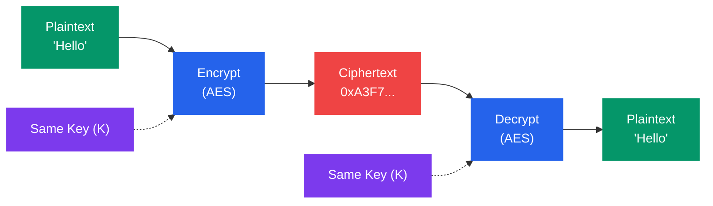
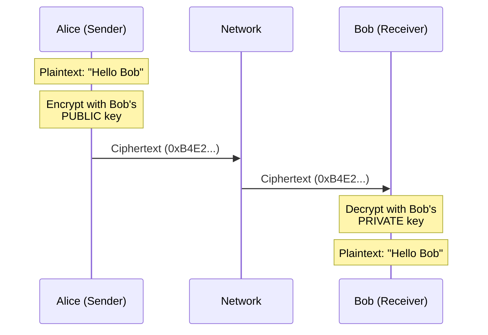

# Cryptography Basics

## What You'll Learn

- How symmetric encryption works and when to use it (AES, DES, 3DES)
- How asymmetric encryption enables secure key exchange (RSA, ECC, Diffie-Hellman)
- Hash functions and their role in data integrity (SHA-256, MD5)
- Digital signatures and how they prove authenticity
- Public Key Infrastructure (PKI) fundamentals
- Practical cryptography with `openssl` commands

---

## 1. Why Cryptography?

Cryptography transforms readable data (plaintext) into unreadable data (ciphertext) so that only authorized parties can access it.

```
Plaintext ──── [ Encryption ] ──── Ciphertext ──── [ Decryption ] ──── Plaintext
                    │                                    │
                   Key                                  Key
```

Cryptography provides:
- **Confidentiality** — Only intended recipients can read the data
- **Integrity** — Detect if data was modified
- **Authentication** — Verify identity of the sender
- **Non-repudiation** — Sender cannot deny sending

---

## 2. Symmetric Encryption

Both sender and receiver use the **same key** to encrypt and decrypt.



```
       Same Key (K)              Same Key (K)
           │                         │
           ▼                         ▼
Plaintext ──> [ Encrypt ] ──> Ciphertext ──> [ Decrypt ] ──> Plaintext
  "Hello"        AES           0xA3F7...        AES          "Hello"
```

### Common Symmetric Algorithms

| Algorithm | Key Size | Block Size | Status |
|-----------|----------|------------|--------|
| DES | 56 bits | 64 bits | **Broken** — do not use |
| 3DES | 168 bits | 64 bits | **Deprecated** — legacy only |
| AES-128 | 128 bits | 128 bits | **Secure** — widely used |
| AES-256 | 256 bits | 128 bits | **Secure** — government grade |
| ChaCha20 | 256 bits | Stream | **Secure** — fast in software |

### AES Block Cipher Modes

| Mode | Name | Use Case |
|------|------|----------|
| ECB | Electronic Codebook | **Never use** — identical blocks produce identical ciphertext |
| CBC | Cipher Block Chaining | Legacy applications, needs IV |
| CTR | Counter | Parallelizable, streaming |
| GCM | Galois/Counter Mode | **Preferred** — authenticated encryption |

### Practical Example: AES Encryption with OpenSSL

```bash
# Encrypt a file with AES-256-CBC
openssl enc -aes-256-cbc -salt -in secret.txt -out secret.enc -pass pass:MyPassword

# Decrypt the file
openssl enc -aes-256-cbc -d -in secret.enc -out decrypted.txt -pass pass:MyPassword

# AES-256-GCM (preferred for authenticated encryption)
openssl enc -aes-256-gcm -in secret.txt -out secret.enc -pass pass:MyPassword
```

**Strengths**: Fast, efficient for large data.
**Weakness**: How do you securely share the key?

---

## 3. Asymmetric Encryption

Uses a **key pair**: a public key (shared openly) and a private key (kept secret).



```
    Alice (Sender)                              Bob (Receiver)
    ┌─────────────┐                             ┌─────────────┐
    │  Plaintext   │                             │  Ciphertext  │
    │  "Hello Bob" │                             │  0xB4E2...   │
    └──────┬──────┘                             └──────┬──────┘
           │                                           │
           ▼                                           ▼
   [ Encrypt with    ]   ──── Network ────>   [ Decrypt with    ]
   [ Bob's PUBLIC key]                        [ Bob's PRIVATE key]
           │                                           │
           ▼                                           ▼
    ┌─────────────┐                             ┌─────────────┐
    │  Ciphertext  │                             │  Plaintext   │
    │  0xB4E2...   │                             │  "Hello Bob" │
    └─────────────┘                             └─────────────┘
```

### Common Asymmetric Algorithms

| Algorithm | Key Size | Use Case | Notes |
|-----------|----------|----------|-------|
| RSA | 2048–4096 bits | Encryption, signatures | Widely deployed, slower |
| ECC | 256–384 bits | Signatures, key exchange | Smaller keys, same security |
| Diffie-Hellman | 2048+ bits | Key exchange only | Cannot encrypt directly |
| Ed25519 | 256 bits | Signatures | Fast, modern, used by SSH |

### RSA Key Generation with OpenSSL

```bash
# Generate a 2048-bit RSA private key
openssl genrsa -out private.pem 2048

# Extract the public key
openssl rsa -in private.pem -pubout -out public.pem

# Encrypt with public key
openssl rsautl -encrypt -pubin -inkey public.pem -in message.txt -out encrypted.bin

# Decrypt with private key
openssl rsautl -decrypt -inkey private.pem -in encrypted.bin -out decrypted.txt
```

### ECC Key Generation

```bash
# Generate an ECC private key (P-256 curve)
openssl ecparam -genkey -name prime256v1 -out ec_private.pem

# Extract the public key
openssl ec -in ec_private.pem -pubout -out ec_public.pem
```

---

## 4. Symmetric vs Asymmetric Comparison

| Feature | Symmetric | Asymmetric |
|---------|-----------|------------|
| Keys | One shared key | Public + private key pair |
| Speed | **Fast** | Slow (100–1000x slower) |
| Key distribution | Hard (must share securely) | **Easy** (public key is open) |
| Key sizes | 128–256 bits | 2048–4096 bits (RSA) |
| Use case | Bulk data encryption | Key exchange, signatures |
| Examples | AES, ChaCha20 | RSA, ECC, DH |
| Scalability | O(n²) keys for n users | O(n) key pairs |

### How They Work Together (Hybrid Encryption)

In practice, asymmetric encryption secures the exchange of a symmetric key, which then encrypts the data.

```
1. Bob sends his PUBLIC key to Alice
2. Alice generates a random AES key (session key)
3. Alice encrypts the AES key with Bob's PUBLIC key
4. Alice sends the encrypted AES key to Bob
5. Bob decrypts the AES key with his PRIVATE key
6. Both use the AES key to encrypt/decrypt data
```

This is exactly how TLS works.

---

## 5. Hash Functions

A hash function takes input of any size and produces a fixed-size output (digest). It is a **one-way function** — you cannot reverse it.

```
Input (any size)         Hash Function         Output (fixed size)
"Hello World"    ──────>   SHA-256    ──────>  a591a6d40bf420404a011733cfb7b190
                                               d62c65bf0bcda32b57b277d9ad9f146e
```

### Properties of Cryptographic Hash Functions

| Property | Description |
|----------|-------------|
| **Deterministic** | Same input always produces same output |
| **Fixed output** | Output length is constant regardless of input |
| **One-way** | Cannot derive input from output |
| **Avalanche effect** | Small input change = completely different output |
| **Collision resistant** | Hard to find two inputs with same output |

### Common Hash Algorithms

| Algorithm | Output Size | Status |
|-----------|-------------|--------|
| MD5 | 128 bits | **Broken** — collisions found |
| SHA-1 | 160 bits | **Deprecated** — collisions demonstrated |
| SHA-256 | 256 bits | **Secure** — widely used |
| SHA-3 | 256/512 bits | **Secure** — alternative design |
| BLAKE2 | 256/512 bits | **Secure** — very fast |

### Practical Hashing with OpenSSL

```bash
# SHA-256 hash of a file
openssl dgst -sha256 myfile.txt

# SHA-256 hash of a string
echo -n "Hello World" | openssl dgst -sha256

# MD5 (for checksum comparison only — NOT security)
openssl dgst -md5 myfile.txt

# Verify file integrity
sha256sum downloaded_file.iso
# Compare with published hash
```

### Use Cases

- **Password storage** — Store hash, not plaintext (use bcrypt/argon2 with salt)
- **File integrity** — Verify downloads match published checksums
- **Digital signatures** — Sign the hash, not the entire document
- **Blockchain** — Each block contains hash of previous block

---

## 6. Digital Signatures

Digital signatures prove that a message was sent by a specific sender and was not modified. They combine **hashing** and **asymmetric encryption**.

```
Signing (Sender - Alice):                  Verifying (Receiver - Bob):

  Document                                   Document    Signature
     │                                          │            │
     ▼                                          ▼            ▼
  [ Hash ]                                   [ Hash ]   [ Decrypt with  ]
     │                                          │       [ Alice's PUBLIC ]
     ▼                                          │       [ key            ]
   Digest                                       ▼            │
     │                                        Digest         ▼
     ▼                                          │         Digest
  [ Encrypt with  ]                             │            │
  [ Alice's PRIVATE]                            └──── Compare ────┐
  [ key            ]                                              │
     │                                                  Match? ── YES = Valid
     ▼                                                         ── NO  = Invalid
  Signature
```

### Creating and Verifying Signatures

```bash
# Sign a file
openssl dgst -sha256 -sign private.pem -out signature.bin document.txt

# Verify the signature
openssl dgst -sha256 -verify public.pem -signature signature.bin document.txt
# Output: "Verified OK" or "Verification Failure"
```

---

## 7. Key Exchange: Diffie-Hellman

Diffie-Hellman allows two parties to agree on a shared secret over an insecure channel without ever transmitting the secret itself.

```
     Alice                                    Bob
       │                                       │
  Pick private a                          Pick private b
  Compute A = g^a mod p                   Compute B = g^b mod p
       │                                       │
       ├────────── Send A ────────────────────>│
       │<───────── Send B ─────────────────────┤
       │                                       │
  Compute: B^a mod p                      Compute: A^b mod p
  = g^(ab) mod p                          = g^(ab) mod p
       │                                       │
       └──── Same shared secret! ──────────────┘
```

An eavesdropper sees A, B, g, and p but cannot compute the shared secret (the Discrete Logarithm Problem).

---

## 8. Public Key Infrastructure (PKI)

PKI is the framework for managing public keys and digital certificates.

```
                    ┌──────────────────┐
                    │  Root CA         │   (Self-signed, offline)
                    │  Issues certs to │
                    │  Intermediate CAs│
                    └────────┬─────────┘
                             │
               ┌─────────────┼─────────────┐
               ▼                            ▼
    ┌─────────────────┐          ┌─────────────────┐
    │ Intermediate CA │          │ Intermediate CA │
    │ Issues certs to │          │                 │
    │ end entities    │          │                 │
    └────────┬────────┘          └────────┬────────┘
             │                            │
        ┌────┴────┐                  ┌────┴────┐
        ▼         ▼                  ▼         ▼
    Server     Server            Server     Server
    Cert       Cert              Cert       Cert
```

### PKI Components

| Component | Role |
|-----------|------|
| **Certificate Authority (CA)** | Issues and signs certificates |
| **Registration Authority (RA)** | Verifies identity before CA issues cert |
| **Certificate** | Binds a public key to an identity |
| **CRL** | Certificate Revocation List — lists revoked certs |
| **OCSP** | Online Certificate Status Protocol — real-time revocation check |

---

## Exercises

### Beginner

1. Encrypt and decrypt a text file using AES-256-CBC with `openssl`. Verify the decrypted content matches the original.
2. Generate SHA-256 hashes of two similar strings (e.g., "hello" and "Hello"). Observe the avalanche effect.
3. Explain why you would never use ECB mode for encryption (hint: look up the "ECB penguin").

### Intermediate

4. Generate an RSA key pair, encrypt a message with the public key, and decrypt it with the private key. Document each step.
5. Create a digital signature for a file and verify it. Then modify the file slightly and try to verify again — what happens?
6. Explain why websites use hybrid encryption (asymmetric + symmetric) instead of only asymmetric encryption.

### Advanced

7. Implement a simplified Diffie-Hellman key exchange using small numbers (p=23, g=5) by hand. Show all computations.
8. Compare the security of RSA-2048, RSA-4096, and ECC P-256 in terms of equivalent security strength, key size, and performance.
9. Research and explain why MD5 and SHA-1 are considered broken. What type of attack was used to demonstrate their weakness?

---

## Key Takeaways

- **Symmetric encryption** (AES) is fast and used for bulk data; the challenge is key distribution
- **Asymmetric encryption** (RSA, ECC) solves key distribution but is much slower
- **Hybrid encryption** combines both — asymmetric for key exchange, symmetric for data
- **Hash functions** (SHA-256) provide data integrity and are one-way
- **Digital signatures** combine hashing + asymmetric crypto for authentication and non-repudiation
- **Diffie-Hellman** enables secure key agreement over insecure channels
- **PKI** provides the trust infrastructure for managing public keys at scale

---

## Navigation

- [← Previous: Security Fundamentals](./01_security_fundamentals.md)
- [→ Next: SSL/TLS and Certificates](./03_ssl_tls_certificates.md)
- [↑ Back to Network Security](./README.md)
