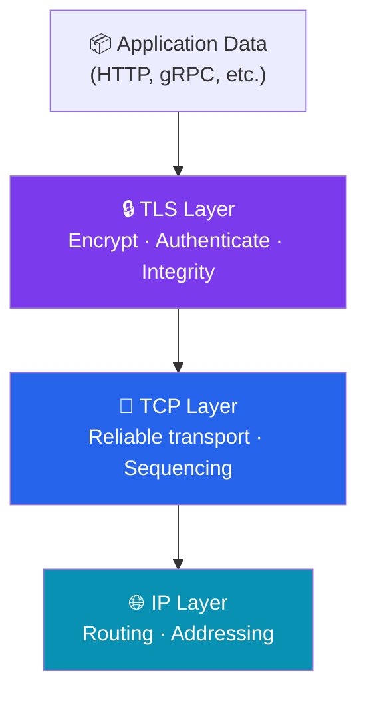
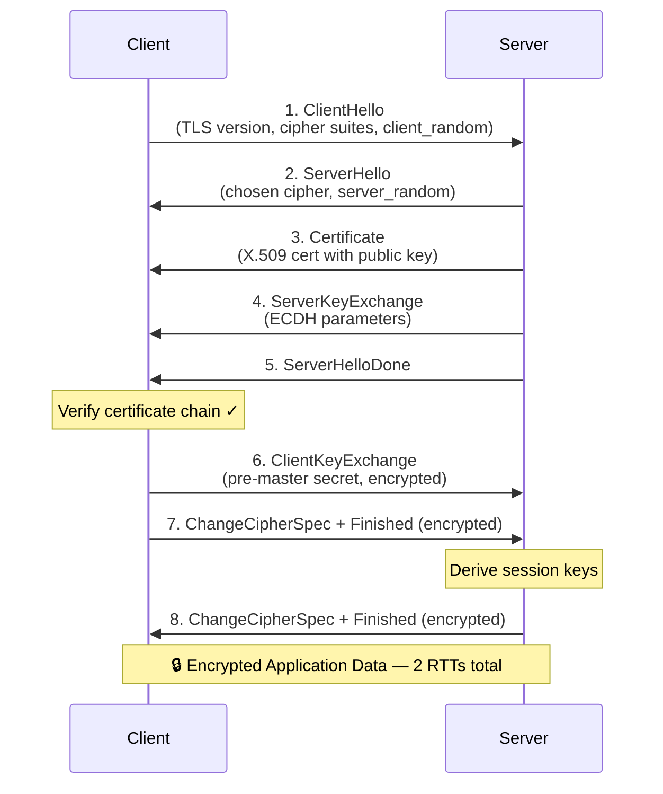
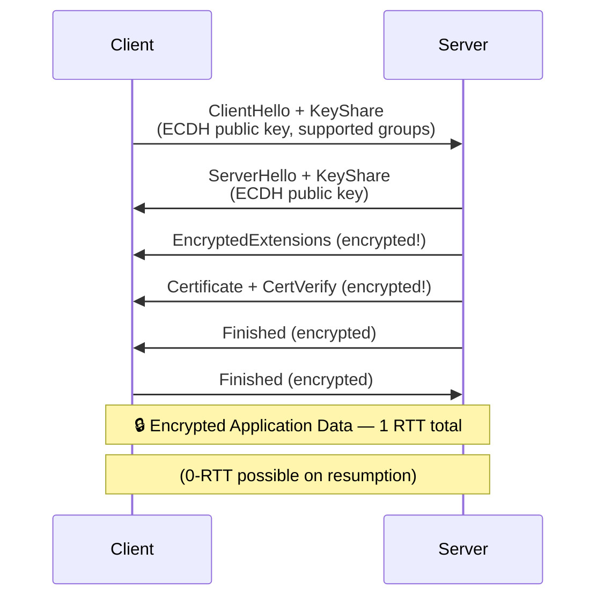
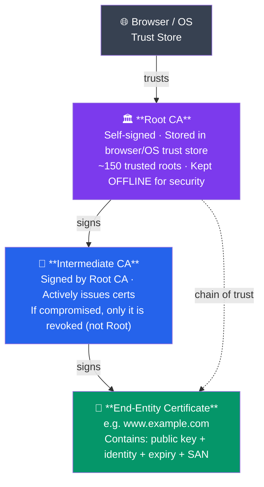
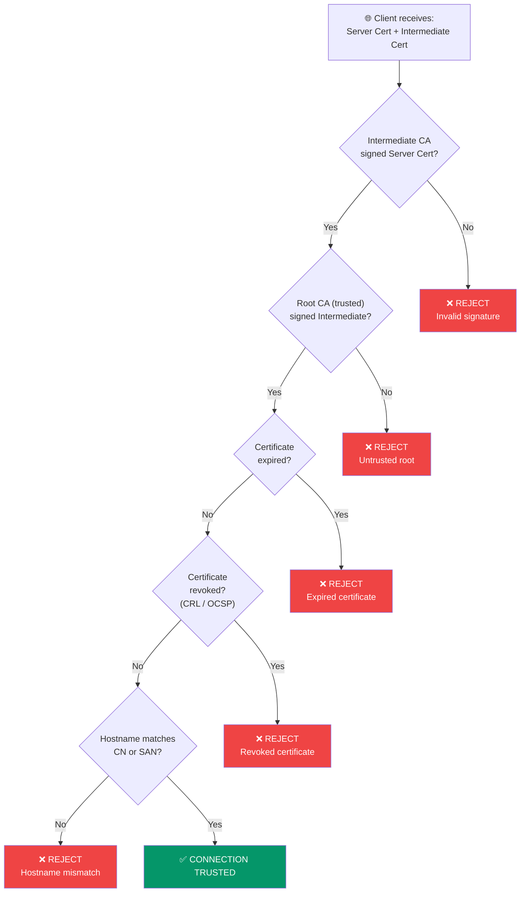

# SSL/TLS and Certificates

## What You'll Learn

- The evolution from SSL to TLS 1.3 and why it matters
- How the TLS handshake works step-by-step
- Certificate Authority hierarchies and chains of trust
- X.509 certificate structure and key fields
- Self-signed vs CA-signed certificates and when to use each
- Let's Encrypt, ACME protocol, and automated certificate management
- Practical `openssl` commands for certificate operations
- Mutual TLS (mTLS) for service-to-service authentication
- Common TLS errors and how to troubleshoot them

---

## 1. What is SSL/TLS?

SSL (Secure Sockets Layer) and TLS (Transport Layer Security) are cryptographic protocols that provide encrypted communication over a network. TLS is the successor to SSL.



### Protocol Evolution

| Protocol | Year | Status | Notes |
|----------|------|--------|-------|
| SSL 2.0 | 1995 | **Insecure** | Fundamentally flawed |
| SSL 3.0 | 1996 | **Insecure** | POODLE attack (2014) |
| TLS 1.0 | 1999 | **Deprecated** | BEAST attack vulnerability |
| TLS 1.1 | 2006 | **Deprecated** | Removed by browsers in 2020 |
| TLS 1.2 | 2008 | **Secure** | Widely used, supports AEAD |
| TLS 1.3 | 2018 | **Recommended** | Faster, more secure, fewer round trips |

---

## 2. TLS 1.2 Handshake (Step by Step)



**Total: 2 round trips before data flows.**

### TLS 1.3 Handshake (Faster)

TLS 1.3 reduces the handshake to **1 round trip** (and supports 0-RTT resumption):



### Key TLS 1.3 Improvements

- Removed insecure algorithms (RSA key exchange, RC4, SHA-1, etc.)
- Forward secrecy is **mandatory** (ephemeral Diffie-Hellman only)
- Faster connection setup (1-RTT, optional 0-RTT)
- Encrypted more of the handshake (hides certificate from eavesdroppers)

---

## 3. Certificate Authority (CA) Hierarchy



**Why intermediate CAs?** If a Root CA's private key is compromised, the entire trust chain collapses. By keeping Root CAs offline and using intermediates for daily operations, the risk is reduced.

---

## 4. X.509 Certificate Structure

```bash
# View certificate details
openssl x509 -in certificate.pem -text -noout
```

Key fields in an X.509 certificate:

| Field | Description | Example |
|-------|-------------|---------|
| **Version** | X.509 version (usually v3) | `Version: 3` |
| **Serial Number** | Unique ID from CA | `0x0A1B2C3D` |
| **Issuer** | CA that signed the cert | `CN=Let's Encrypt Authority X3` |
| **Subject** | Entity the cert identifies | `CN=www.example.com` |
| **Validity** | Not Before / Not After dates | `Not After: Jan 1 2026` |
| **Public Key** | Subject's public key | RSA 2048-bit |
| **Signature Algorithm** | Algorithm CA used to sign | `sha256WithRSAEncryption` |
| **SAN** | Subject Alternative Names | `DNS:example.com, DNS:*.example.com` |
| **Key Usage** | Permitted operations | Digital Signature, Key Encipherment |

---

## 5. Certificate Chain Verification

When a client connects, it verifies the entire chain:



---

## 6. Self-Signed vs CA-Signed Certificates

| Feature | Self-Signed | CA-Signed |
|---------|-------------|-----------|
| Issuer | The entity itself | Trusted Certificate Authority |
| Browser trust | **No** — shows warning | **Yes** — no warning |
| Cost | Free | Free (Let's Encrypt) or paid |
| Use case | Development, internal services | Production websites |
| Validation | None | Domain, Organization, or Extended |

### Creating a Self-Signed Certificate

```bash
# Generate private key and self-signed certificate (valid 365 days)
openssl req -x509 -newkey rsa:2048 -keyout key.pem -out cert.pem \
  -days 365 -nodes -subj "/CN=localhost"

# View the certificate
openssl x509 -in cert.pem -text -noout
```

### Creating a Certificate Signing Request (CSR)

```bash
# Generate private key
openssl genrsa -out server.key 2048

# Generate CSR
openssl req -new -key server.key -out server.csr \
  -subj "/C=US/ST=California/L=SF/O=MyOrg/CN=www.example.com"

# View CSR contents
openssl req -in server.csr -text -noout

# Submit server.csr to your CA for signing
```

---

## 7. Let's Encrypt and ACME Protocol

Let's Encrypt is a free, automated CA that uses the ACME (Automatic Certificate Management Environment) protocol.

```
                                    Let's Encrypt
Your Server                         ACME Server
    │                                    │
    │── 1. Request certificate ────────>│
    │   (for www.example.com)            │
    │                                    │
    │<── 2. Challenge ──────────────────│
    │   ("Place this file at             │
    │    /.well-known/acme-challenge/X") │
    │                                    │
    │── 3. Challenge response ─────────>│
    │   (file served at the URL)         │
    │                                    │
    │   4. ACME server verifies ────────│
    │      (fetches the URL)             │
    │                                    │
    │<── 5. Certificate issued ─────────│
    │   (valid for 90 days)              │
    │                                    │
```

```bash
# Using certbot (Let's Encrypt client)
# Install certbot
sudo apt install certbot python3-certbot-nginx

# Obtain certificate (Nginx)
sudo certbot --nginx -d www.example.com -d example.com

# Renew all certificates
sudo certbot renew

# Test renewal (dry run)
sudo certbot renew --dry-run
```

---

## 8. Mutual TLS (mTLS)

Standard TLS: only the **server** presents a certificate. Mutual TLS: **both** client and server present certificates.

```
Standard TLS:
Client ────────> Server presents cert ────────> Client verifies server

Mutual TLS (mTLS):
Client ────────> Server presents cert ────────> Client verifies server
Server ────────> Client presents cert ────────> Server verifies client
```

**Use cases**: Microservice-to-microservice communication, API authentication, zero-trust networks.

```bash
# Generate client certificate
openssl req -x509 -newkey rsa:2048 -keyout client-key.pem \
  -out client-cert.pem -days 365 -nodes -subj "/CN=my-service"

# Test mTLS connection with curl
curl --cert client-cert.pem --key client-key.pem \
  --cacert ca-cert.pem https://api.internal.example.com/data
```

---

## 9. Common TLS Errors and Troubleshooting

| Error | Cause | Fix |
|-------|-------|-----|
| `certificate has expired` | Cert past its Not After date | Renew the certificate |
| `unable to verify the first certificate` | Missing intermediate cert | Include full chain in server config |
| `hostname mismatch` | CN/SAN doesn't match URL | Reissue cert with correct domain |
| `self-signed certificate` | Not trusted by client | Use CA-signed cert or add to trust store |
| `certificate revoked` | CA revoked the cert (compromised) | Reissue a new certificate |
| `no common cipher suites` | Client and server have no overlap | Update TLS config, enable modern ciphers |

### Debugging Commands

```bash
# Test TLS connection and view certificate
openssl s_client -connect www.example.com:443 -servername www.example.com

# Show full certificate chain
openssl s_client -connect www.example.com:443 -showcerts

# Check certificate expiration
openssl s_client -connect www.example.com:443 2>/dev/null | \
  openssl x509 -noout -dates

# Test specific TLS version
openssl s_client -connect www.example.com:443 -tls1_3

# Verify certificate against CA bundle
openssl verify -CAfile ca-bundle.crt server-cert.pem

# Check what cipher suites a server supports
nmap --script ssl-enum-ciphers -p 443 www.example.com
```

---

## 10. TLS Configuration Best Practices

```
Recommended TLS Configuration (2024+):
─────────────────────────────────────
Protocol:    TLS 1.2 and TLS 1.3 only
Key Exchange: ECDHE (forward secrecy)
Cipher:      AES-256-GCM, ChaCha20-Poly1305
Certificate: RSA 2048+ or ECC P-256
Hash:        SHA-256 or SHA-384
HSTS:        Strict-Transport-Security header
OCSP:        Stapling enabled
```

---

## Exercises

### Beginner

1. Use `openssl s_client` to connect to `google.com:443` and identify: the TLS version, cipher suite, and certificate issuer.
2. Create a self-signed certificate for `localhost` and view its fields with `openssl x509 -text`.
3. Explain the difference between SSL and TLS. Why should you never use SSL 3.0?

### Intermediate

4. Generate a CSR for a domain you own (or a fake domain). List all the fields you would include and explain why each matters.
5. Draw the full certificate chain for a website of your choice (use `openssl s_client -showcerts`). Identify the Root CA, Intermediate CA, and end-entity certificate.
6. Set up a local HTTPS server (using Node.js, Python, or Nginx) with a self-signed certificate. Test it with `curl --insecure` and then with `curl --cacert`.

### Advanced

7. Compare TLS 1.2 and TLS 1.3 handshakes in detail. How does TLS 1.3 achieve 1-RTT? What is 0-RTT and what are its security risks?
8. Set up mTLS between two services. Generate CA, server, and client certificates. Demonstrate that connections without client certificates are rejected.
9. A user reports `ERR_CERT_AUTHORITY_INVALID` in their browser. Walk through the complete troubleshooting process, including all `openssl` commands you would run.

---

## Key Takeaways

- **TLS 1.3** is the current standard — faster (1-RTT) and more secure than TLS 1.2
- The TLS handshake negotiates encryption parameters and verifies server identity
- **Certificate chains** establish trust from end-entity cert through intermediates to a trusted root
- **Let's Encrypt** provides free, automated certificates via the ACME protocol
- **mTLS** adds client certificate verification for service-to-service authentication
- Always include the **full certificate chain** in your server configuration
- Use `openssl s_client` and `openssl x509` as your primary debugging tools

---

## Navigation

- [← Previous: Cryptography Basics](./02_cryptography_basics.md)
- [→ Next: Firewalls and Network Defense](./04_firewalls.md)
- [↑ Back to Network Security](./README.md)
