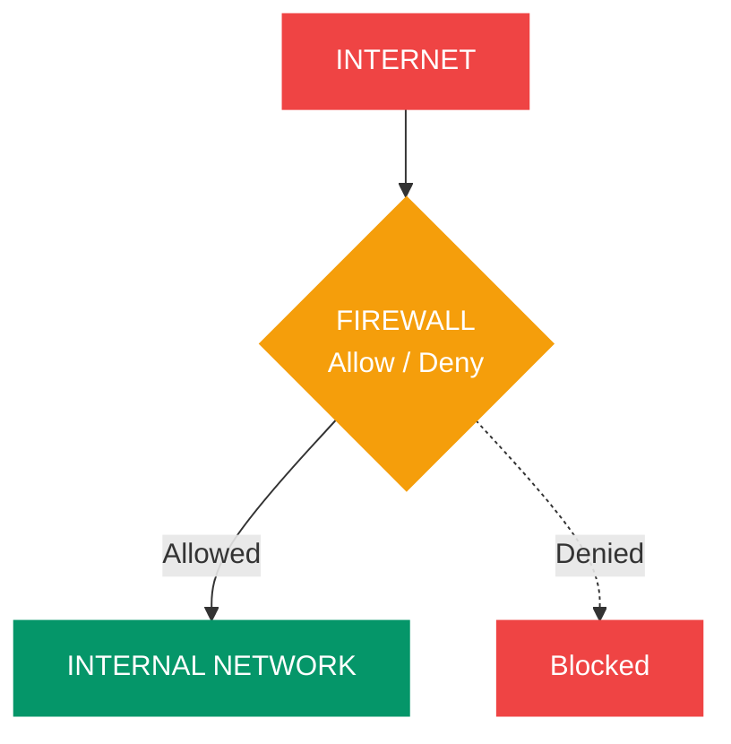
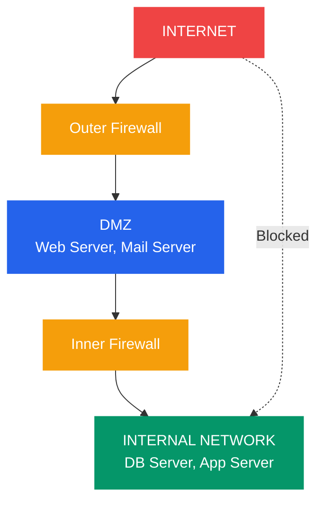

# Firewalls and Network Defense

## What You'll Learn

- What a firewall is and why every network needs one
- Firewall types: packet filtering, stateful, application-layer, and NGFW
- How to write firewall rules (allow/deny, inbound/outbound)
- Linux firewall management with `iptables` and `nftables`
- Windows Firewall basics
- Network zones and DMZ architecture
- Access Control Lists (ACLs) for traffic filtering
- Web Application Firewalls (WAF) and their role
- Intrusion Detection vs Intrusion Prevention Systems (IDS/IPS)

---

## 1. What is a Firewall?

A firewall is a network security device (hardware or software) that monitors and controls incoming and outgoing traffic based on predefined rules.



```
                    INTERNET
                       │
                       ▼
              ┌────────────────┐
              │    FIREWALL    │  ← Inspects every packet
              │  Allow / Deny  │     against rule set
              └────────┬───────┘
                       │
                       ▼
              ┌────────────────┐
              │ INTERNAL       │
              │ NETWORK        │
              └────────────────┘
```

**Without a firewall**: Every service on every machine is exposed to the internet.
**With a firewall**: Only explicitly allowed traffic passes through.

---

## 2. Firewall Types

### Comparison Table

| Type | Inspects | OSI Layer | Speed | Security | Example |
|------|----------|-----------|-------|----------|---------|
| Packet Filtering | Headers (IP, port) | 3–4 | **Fast** | Basic | Early iptables |
| Stateful Inspection | Headers + connection state | 3–4 | Fast | Good | iptables (conntrack) |
| Application Layer | Full payload | 7 | Slower | **Strong** | Squid proxy, WAF |
| NGFW | All + deep packet inspection | 3–7 | Moderate | **Strongest** | Palo Alto, Fortinet |

### Packet Filtering Firewall

Examines each packet independently based on source/destination IP, port, and protocol.

```
Rule #  Action  Protocol  Src IP         Dst IP         Dst Port
─────  ──────  ────────  ────────────   ────────────   ────────
1      ALLOW   TCP       Any            10.0.0.5       443
2      ALLOW   TCP       Any            10.0.0.5       80
3      DENY    TCP       Any            10.0.0.5       22
4      DENY    ALL       Any            Any            Any      ← Default deny
```

**Limitation**: No awareness of connection state — cannot tell if a packet is part of an established connection.

### Stateful Inspection Firewall

Tracks the state of active connections and makes decisions based on context.

```
Connection State Table:
─────────────────────────────────────────────────────────
Src IP         Src Port  Dst IP        Dst Port  State
─────────────────────────────────────────────────────────
192.168.1.10   52340     93.184.216.34   443    ESTABLISHED
192.168.1.10   52341     8.8.8.8          53    NEW
192.168.1.15   48820     172.217.0.46    443    ESTABLISHED
```

A reply packet to an ESTABLISHED connection is automatically allowed, even without an explicit inbound rule.

### Application Layer Firewall

Inspects the actual content of network traffic (HTTP headers, SQL queries, etc.).

### Next-Generation Firewall (NGFW)

Combines stateful inspection with deep packet inspection (DPI), IPS, application awareness, and threat intelligence feeds.

---

## 3. Firewall Rules: Inbound and Outbound

```
INBOUND (Ingress):                    OUTBOUND (Egress):
Internet → Firewall → Internal        Internal → Firewall → Internet

┌──────────┐  ALLOW 443  ┌────────┐   ┌────────┐  ALLOW 443  ┌──────────┐
│ Internet │────────────>│Internal│   │Internal│────────────>│ Internet │
└──────────┘  DENY  *    └────────┘   └────────┘  DENY  *    └──────────┘
```

### Rule Processing Order

Rules are evaluated **top to bottom**. First match wins.

```
Rule 1: ALLOW TCP dst-port 443  ← HTTPS traffic allowed
Rule 2: ALLOW TCP dst-port 80   ← HTTP traffic allowed
Rule 3: ALLOW TCP dst-port 22 from 10.0.0.0/8  ← SSH from internal only
Rule 4: DENY ALL                ← Everything else blocked (default deny)
```

**Best practice**: Default deny — block everything, then explicitly allow what is needed.

---

## 4. iptables Basics (Linux)

`iptables` is the traditional Linux firewall tool that uses chains and tables to process packets.

### Chains

```
                    INCOMING PACKET
                          │
                          ▼
                   ┌─────────────┐
                   │  PREROUTING │  (NAT, mangle)
                   └──────┬──────┘
                          │
               ┌──────────┼──────────┐
               │ For this  │ Forward  │
               │  host?    │ to other │
               ▼           │  host    ▼
        ┌──────────┐       │   ┌──────────┐
        │  INPUT   │       │   │ FORWARD  │
        └────┬─────┘       │   └────┬─────┘
             │             │        │
             ▼             │        ▼
        Local Process      │   ┌──────────┐
             │             │   │POSTROUTING│
             ▼             │   └──────────┘
        ┌──────────┐       │
        │  OUTPUT  │       │
        └────┬─────┘       │
             │             │
             ▼             │
        ┌──────────┐       │
        │POSTROUTING│◄─────┘
        └──────────┘
```

### Common iptables Commands

```bash
# View current rules
sudo iptables -L -n -v

# Allow incoming SSH (port 22)
sudo iptables -A INPUT -p tcp --dport 22 -j ACCEPT

# Allow incoming HTTPS (port 443)
sudo iptables -A INPUT -p tcp --dport 443 -j ACCEPT

# Allow established/related connections (stateful)
sudo iptables -A INPUT -m conntrack --ctstate ESTABLISHED,RELATED -j ACCEPT

# Allow loopback traffic
sudo iptables -A INPUT -i lo -j ACCEPT

# Drop all other incoming traffic (default deny)
sudo iptables -A INPUT -j DROP

# Allow outgoing traffic
sudo iptables -A OUTPUT -j ACCEPT

# Block a specific IP
sudo iptables -A INPUT -s 203.0.113.50 -j DROP

# Delete a rule (by line number)
sudo iptables -D INPUT 3

# Save rules (persist across reboot)
sudo iptables-save > /etc/iptables/rules.v4

# Flush all rules (careful!)
sudo iptables -F
```

### nftables (Modern Replacement)

`nftables` replaces `iptables` with a cleaner syntax:

```bash
# Create a table and chain
sudo nft add table inet filter
sudo nft add chain inet filter input { type filter hook input priority 0 \; policy drop \; }

# Allow SSH and HTTPS
sudo nft add rule inet filter input tcp dport { 22, 443 } accept

# Allow established connections
sudo nft add rule inet filter input ct state established,related accept

# List rules
sudo nft list ruleset
```

---

## 5. Windows Firewall

```powershell
# View firewall status
Get-NetFirewallProfile | Format-Table Name, Enabled

# Allow inbound HTTPS
New-NetFirewallRule -DisplayName "Allow HTTPS" -Direction Inbound `
  -Protocol TCP -LocalPort 443 -Action Allow

# Block an IP address
New-NetFirewallRule -DisplayName "Block Attacker" -Direction Inbound `
  -RemoteAddress 203.0.113.50 -Action Block

# List all firewall rules
Get-NetFirewallRule | Where-Object { $_.Enabled -eq 'True' } |
  Format-Table DisplayName, Direction, Action

# Export/import rules
netsh advfirewall export "C:\firewall-backup.wfw"
netsh advfirewall import "C:\firewall-backup.wfw"
```

---

## 6. Network Zones and DMZ

A DMZ (Demilitarized Zone) is a network segment that sits between the public internet and the private internal network.



```
                      INTERNET
                         │
                         ▼
                ┌────────────────┐
                │ Outer Firewall │
                └────────┬───────┘
                         │
              ┌──────────┴──────────┐
              │        DMZ          │
              │  ┌──────┐ ┌──────┐ │
              │  │ Web  │ │ Mail │ │
              │  │Server│ │Server│ │
              │  └──────┘ └──────┘ │
              └──────────┬──────────┘
                         │
                ┌────────────────┐
                │ Inner Firewall │
                └────────┬───────┘
                         │
              ┌──────────┴──────────┐
              │   INTERNAL NETWORK  │
              │  ┌──────┐ ┌──────┐ │
              │  │  DB  │ │ App  │ │
              │  │Server│ │Server│ │
              │  └──────┘ └──────┘ │
              └─────────────────────┘
```

| Zone | Access | Hosts |
|------|--------|-------|
| **External** | Untrusted (internet) | Public users |
| **DMZ** | Semi-trusted | Web servers, mail, DNS |
| **Internal** | Trusted | Databases, internal apps |

**Rules**: Internet can reach DMZ. DMZ can reach internal (limited ports). Internal can reach DMZ and internet. Internet **cannot** reach internal directly.

---

## 7. Access Control Lists (ACLs)

ACLs are ordered lists of rules applied to router interfaces to filter traffic.

```
Router Interface ACL:
──────────────────────────────────────────────────────────────────
Seq  Action  Protocol  Source          Destination     Port
──────────────────────────────────────────────────────────────────
10   permit  tcp       192.168.1.0/24  any             80
20   permit  tcp       192.168.1.0/24  any             443
30   permit  udp       192.168.1.0/24  8.8.8.8         53
40   permit  tcp       10.0.0.5/32     192.168.1.0/24  22
50   deny    ip        any             any             any
──────────────────────────────────────────────────────────────────
```

**Standard ACLs**: Filter by source IP only (placed close to destination).
**Extended ACLs**: Filter by source IP, destination IP, protocol, and port (placed close to source).

---

## 8. Web Application Firewall (WAF)

A WAF operates at Layer 7 and protects web applications from application-layer attacks.

```
Client ──── HTTP Request ────> WAF ────> Web Server
                                │
                          ┌─────┴─────┐
                          │ Inspect:  │
                          │ - SQL inj │
                          │ - XSS     │
                          │ - CSRF    │
                          │ - Path    │
                          │   traversal│
                          └───────────┘
                          Block or Allow
```

| Feature | Network Firewall | WAF |
|---------|-----------------|-----|
| Layer | 3–4 | 7 |
| Inspects | IP, TCP, UDP headers | HTTP requests/responses |
| Blocks | IP addresses, ports | SQL injection, XSS, etc. |
| Examples | iptables, pfSense | AWS WAF, ModSecurity, Cloudflare |

### Example WAF Rule (ModSecurity)

```
# Block SQL injection attempts
SecRule ARGS "@detectSQLi" \
  "id:1001,phase:2,deny,status:403,msg:'SQL Injection Detected'"

# Block requests with suspicious User-Agent
SecRule REQUEST_HEADERS:User-Agent "sqlmap|nikto|nmap" \
  "id:1002,phase:1,deny,status:403,msg:'Scanner Detected'"
```

---

## 9. IDS vs IPS

| Feature | IDS (Detection) | IPS (Prevention) |
|---------|-----------------|-------------------|
| Mode | Passive (monitor) | Inline (block) |
| Action | Alert only | Alert + block |
| Placement | Mirror/span port | Inline with traffic |
| Latency | None added | Slight increase |
| Risk | Misses get through | False positives block legitimate traffic |
| Example | Snort (IDS mode), Zeek | Snort (IPS mode), Suricata |

```
IDS (Passive):
Traffic ─────────────────> Destination
              │
              └──copy──> IDS ──> Alert!

IPS (Inline):
Traffic ──────> IPS ──────> Destination
                 │
            Block or Allow
```

### Example Snort Rule

```
# Detect SSH brute force (more than 5 attempts in 60 seconds)
alert tcp any any -> $HOME_NET 22 \
  (msg:"SSH Brute Force Attempt"; \
   flow:to_server,established; \
   threshold:type threshold, track by_src, count 5, seconds 60; \
   sid:1000001; rev:1;)
```

---

## Exercises

### Beginner

1. Write iptables rules to: (a) allow HTTP and HTTPS inbound, (b) allow SSH from `10.0.0.0/8` only, (c) drop everything else.
2. Explain the difference between a stateful and stateless firewall. Give a scenario where stateless would fail.
3. Draw a network diagram with a DMZ containing a web server. Label which zones can communicate with which.

### Intermediate

4. Configure a complete iptables ruleset for a web server that also needs outbound access to a database on port 5432 at `10.0.1.50`. Include stateful rules.
5. Explain why you would place a WAF in front of a web application even if you already have a network firewall. Give three attack types a network firewall cannot detect.
6. Compare IDS and IPS. In what scenario would you choose IDS over IPS?

### Advanced

7. Design a multi-zone network architecture for an e-commerce application with: public website, admin portal, payment processing, and database. Specify firewall rules between each zone.
8. Write Snort rules to detect: (a) a port scan, (b) an HTTP request containing `/etc/passwd`, (c) DNS queries to a known malicious domain.
9. Research and explain how a Next-Generation Firewall (NGFW) differs from a traditional stateful firewall. What capabilities does application awareness provide?

---

## Key Takeaways

- Firewalls are the **first line of defense** — always use default deny
- **Stateful firewalls** track connections and are more secure than simple packet filters
- **iptables/nftables** (Linux) and Windows Firewall provide host-level protection
- **DMZ architecture** isolates public-facing servers from internal networks
- **WAFs** protect against application-layer attacks (SQLi, XSS) that network firewalls miss
- **IDS** detects threats passively; **IPS** actively blocks them inline
- Layer your defenses: network firewall + WAF + IDS/IPS + host firewall

---

## Navigation

- [← Previous: SSL/TLS and Certificates](./03_ssl_tls_certificates.md)
- [→ Next: VPN and Secure Tunneling](./05_vpn_tunneling.md)
- [↑ Back to Network Security](./README.md)
