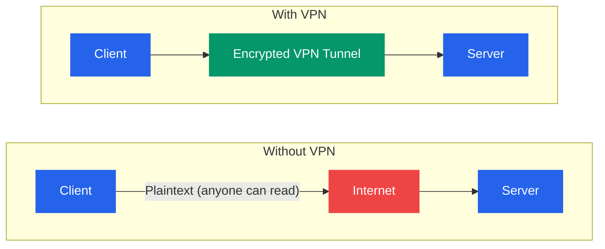
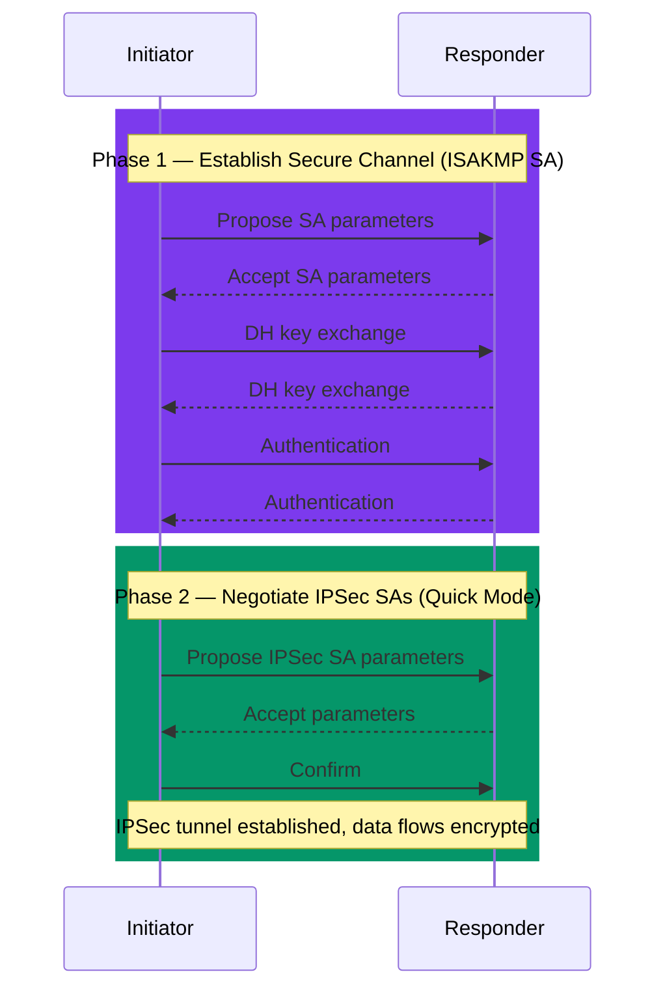

# VPN and Secure Tunneling

## What You'll Learn

- What a VPN is and why organizations use them
- VPN types: site-to-site, remote access, and client-to-site
- Major VPN protocols: OpenVPN, WireGuard, IPSec, L2TP, PPTP
- IPSec architecture in detail (AH, ESP, IKE phases)
- Split tunnel vs full tunnel and when to use each
- SSL/TLS VPN for browser-based remote access
- How to set up a basic WireGuard VPN
- Security considerations for VPN deployments

---

## 1. What is a VPN?

A Virtual Private Network (VPN) creates an encrypted tunnel over a public network, making it appear as if the connected devices are on the same private network.



```
Without VPN:
┌────────┐                                    ┌────────┐
│ Client │ ── Plaintext ── [Internet] ── ──>  │ Server │
└────────┘   (anyone can read)                └────────┘

With VPN:
┌────────┐     ┌──────────────────────────┐   ┌────────┐
│ Client │ ──> │ Encrypted VPN Tunnel     │──>│ Server │
└────────┘     │ [Internet — unreadable]  │   └────────┘
               └──────────────────────────┘
```

### Why Use a VPN?

| Use Case | Description |
|----------|-------------|
| **Remote access** | Employees connect to corporate network from home |
| **Site-to-site** | Connect two office networks over the internet |
| **Privacy** | Encrypt traffic from ISP and local network snooping |
| **Bypass geo-restrictions** | Access content restricted to specific regions |
| **Secure Wi-Fi** | Protect data on untrusted public Wi-Fi networks |

---

## 2. VPN Types

```
Site-to-Site VPN:
┌──────────┐     ┌────────────────────┐     ┌──────────┐
│ Office A │     │  Encrypted Tunnel  │     │ Office B │
│ Network  │◄───►│  over Internet     │◄───►│ Network  │
│10.1.0.0  │     └────────────────────┘     │10.2.0.0  │
└──────────┘                                └──────────┘
   Router A  ◄═══════════════════════════►  Router B

Remote Access VPN:
┌──────────┐     ┌────────────────────┐     ┌──────────┐
│  Remote  │     │  Encrypted Tunnel  │     │ Corporate│
│  User    │◄───►│  over Internet     │◄───►│ Network  │
│(Laptop)  │     └────────────────────┘     │          │
└──────────┘                                └──────────┘
  VPN Client ◄══════════════════════════►  VPN Gateway
```

| Type | Endpoints | Typical Use |
|------|-----------|-------------|
| **Site-to-Site** | Two routers/gateways | Connecting branch offices |
| **Remote Access** | Client software to gateway | Work from home |
| **Client-to-Site** | Individual device to network | Mobile/remote workers |
| **Client-to-Client** | Peer-to-peer | Mesh networking (e.g., Tailscale) |

---

## 3. VPN Protocol Comparison

| Protocol | Encryption | Speed | Security | Port | Status |
|----------|-----------|-------|----------|------|--------|
| **PPTP** | MPPE (128-bit) | Fast | **Broken** | TCP 1723 | Do not use |
| **L2TP/IPSec** | AES via IPSec | Moderate | Good | UDP 500, 4500 | Legacy |
| **IPSec (IKEv2)** | AES-256 | Fast | **Strong** | UDP 500, 4500 | Recommended |
| **OpenVPN** | AES-256-GCM | Moderate | **Strong** | UDP 1194 or TCP 443 | Widely used |
| **WireGuard** | ChaCha20-Poly1305 | **Fastest** | **Strong** | UDP 51820 | Modern, recommended |
| **SSL/TLS VPN** | TLS 1.2/1.3 | Moderate | Strong | TCP 443 | Browser-based access |

---

## 4. IPSec in Detail

IPSec (Internet Protocol Security) operates at Layer 3 and provides encryption and authentication for IP packets.

### IPSec Components

```
IPSec Framework
├── AH (Authentication Header)
│   └── Integrity + Authentication (no encryption)
├── ESP (Encapsulating Security Payload)
│   └── Encryption + Integrity + Authentication
└── IKE (Internet Key Exchange)
    ├── Phase 1: Establish secure channel (ISAKMP SA)
    └── Phase 2: Negotiate IPSec SAs for data transfer
```

### AH vs ESP

| Feature | AH | ESP |
|---------|-----|-----|
| Authentication | Yes | Yes |
| Integrity | Yes | Yes |
| Encryption | **No** | **Yes** |
| NAT compatible | **No** (protects IP header) | Yes (with NAT-T) |
| Protocol number | 51 | 50 |
| Use case | Rare (integrity only) | Standard (encryption + integrity) |

### IPSec Modes

```
Transport Mode (host-to-host):
┌──────────┬────────────────────────────────────┐
│ IP Header│  ESP Header │ Payload (encrypted) │ ESP Trailer │
│(original)│             │                     │             │
└──────────┴────────────────────────────────────┘
Only the payload is encrypted. Original IP header is preserved.

Tunnel Mode (gateway-to-gateway):
┌──────────┬──────────────────────────────────────────────┐
│New IP Hdr│ ESP Header │ Original IP Hdr + Payload (all encrypted) │ ESP Trailer│
└──────────┴──────────────────────────────────────────────┘
The entire original packet is encrypted and wrapped in a new IP header.
```

### IKE (Internet Key Exchange) Phases



```
Phase 1 (Main Mode or Aggressive Mode):
──────────────────────────────────────
Goal: Establish a secure, authenticated channel (ISAKMP SA)

Initiator                              Responder
    │── Propose SA parameters ────────>│
    │<── Accept SA parameters ─────────│
    │── DH key exchange ──────────────>│
    │<── DH key exchange ──────────────│
    │── Authentication ────────────────>│
    │<── Authentication ───────────────│
    Result: Encrypted, authenticated channel

Phase 2 (Quick Mode):
──────────────────────
Goal: Negotiate IPSec SAs for actual data encryption

    │── Propose IPSec SA parameters ──>│
    │<── Accept parameters ────────────│
    │── Confirm ───────────────────────>│
    Result: IPSec tunnel established, data flows encrypted
```

---

## 5. Split Tunnel vs Full Tunnel

```
Full Tunnel:
┌──────────┐                          ┌──────────────┐
│  Client  │══ALL TRAFFIC════════════>│  VPN Gateway │──> Internet
│          │  (including browsing)     │              │──> Corporate
└──────────┘                          └──────────────┘

Split Tunnel:
┌──────────┐══Corporate traffic══════>┌──────────────┐──> Corporate
│  Client  │                          │  VPN Gateway │
│          │──Internet traffic──────────────────────────> Internet
└──────────┘  (direct, no VPN)                         (directly)
```

| Feature | Full Tunnel | Split Tunnel |
|---------|-------------|--------------|
| All traffic encrypted | **Yes** | Only corporate traffic |
| Internet speed | Slower (routed through VPN) | **Faster** (direct) |
| Security | **Higher** (all traffic inspected) | Lower (internet traffic unmonitored) |
| Bandwidth on VPN | Higher | **Lower** |
| Access to local devices | May break (printers, etc.) | **Works** normally |
| Use case | High-security environments | General remote work |

---

## 6. SSL/TLS VPN

Unlike IPSec VPNs that work at Layer 3, SSL/TLS VPNs work at the application layer and are accessible through a web browser.

```
                    Browser
                      │
                 HTTPS (TLS)
                      │
                      ▼
              ┌───────────────┐
              │  SSL VPN      │
              │  Gateway      │
              │               │
              │ Presents web  │
              │ portal with   │
              │ internal apps │
              └───────┬───────┘
                      │
              ┌───────┴───────┐
              │  Internal     │
              │  Resources    │
              └───────────────┘
```

**Advantages**: No client software needed, works through NAT/firewalls (port 443), granular access control.
**Disadvantages**: Limited to supported applications, not a full network-layer tunnel.

---

## 7. OpenVPN

OpenVPN is an open-source VPN that uses the OpenSSL library for encryption.

```bash
# Server configuration (/etc/openvpn/server.conf)
port 1194
proto udp
dev tun
ca ca.crt
cert server.crt
key server.key
dh dh2048.pem
server 10.8.0.0 255.255.255.0
push "redirect-gateway def1"
push "dhcp-option DNS 8.8.8.8"
cipher AES-256-GCM
auth SHA256
keepalive 10 120
persist-key
persist-tun
```

```bash
# Client configuration
client
dev tun
proto udp
remote vpn.example.com 1194
resolv-retry infinite
nobind
ca ca.crt
cert client.crt
key client.key
cipher AES-256-GCM
auth SHA256
verb 3
```

---

## 8. WireGuard Setup

WireGuard is a modern, lightweight VPN protocol with a minimal codebase (~4,000 lines vs OpenVPN's ~100,000).

### Architecture

```
┌──────────────────┐          ┌──────────────────┐
│ Peer A (Client)  │          │ Peer B (Server)  │
│                  │          │                  │
│ Private Key: aaa │          │ Private Key: bbb │
│ Public Key:  AAA │◄════════►│ Public Key:  BBB │
│ Address: 10.0.0.2│  UDP     │ Address: 10.0.0.1│
│ Listen Port: any │  51820   │ Listen Port:51820│
└──────────────────┘          └──────────────────┘
```

### Server Setup

```bash
# Install WireGuard
sudo apt install wireguard

# Generate server keys
wg genkey | tee server_private.key | wg pubkey > server_public.key

# Server config (/etc/wireguard/wg0.conf)
cat <<EOF > /etc/wireguard/wg0.conf
[Interface]
Address = 10.0.0.1/24
ListenPort = 51820
PrivateKey = $(cat server_private.key)
PostUp = iptables -A FORWARD -i wg0 -j ACCEPT; iptables -t nat -A POSTROUTING -o eth0 -j MASQUERADE
PostDown = iptables -D FORWARD -i wg0 -j ACCEPT; iptables -t nat -D POSTROUTING -o eth0 -j MASQUERADE

[Peer]
PublicKey = <client_public_key>
AllowedIPs = 10.0.0.2/32
EOF

# Start WireGuard
sudo wg-quick up wg0

# Check status
sudo wg show
```

### Client Setup

```bash
# Generate client keys
wg genkey | tee client_private.key | wg pubkey > client_public.key

# Client config (/etc/wireguard/wg0.conf)
cat <<EOF > /etc/wireguard/wg0.conf
[Interface]
Address = 10.0.0.2/24
PrivateKey = $(cat client_private.key)
DNS = 8.8.8.8

[Peer]
PublicKey = <server_public_key>
Endpoint = vpn.example.com:51820
AllowedIPs = 0.0.0.0/0       # Full tunnel (all traffic)
# AllowedIPs = 10.0.0.0/24   # Split tunnel (VPN subnet only)
PersistentKeepalive = 25
EOF

# Connect
sudo wg-quick up wg0
```

---

## 9. VPN Security Considerations

| Risk | Description | Mitigation |
|------|-------------|------------|
| **Credential theft** | Attacker steals VPN credentials | Use MFA, certificate-based auth |
| **Split tunnel leaks** | Traffic bypasses VPN unencrypted | Use full tunnel for sensitive work |
| **DNS leaks** | DNS queries go outside the tunnel | Force DNS through VPN tunnel |
| **VPN server compromise** | Attacker controls the VPN gateway | Harden server, monitor logs |
| **Outdated protocol** | Using PPTP or weak ciphers | Use WireGuard or IKEv2 |
| **Kill switch absent** | Traffic flows unencrypted if VPN drops | Enable kill switch in client |
| **Log policies** | VPN provider logs user activity | Review provider's logging policy |

### DNS Leak Test

```bash
# Check if DNS is leaking outside the VPN
# While connected to VPN:
nslookup example.com

# The DNS server in the response should be your VPN's DNS,
# not your ISP's DNS. If it's your ISP, you have a DNS leak.

# Linux: force DNS through VPN
resolvectl dns wg0 10.0.0.1
```

---

## Exercises

### Beginner

1. Explain the difference between a site-to-site VPN and a remote access VPN. Give a real-world scenario for each.
2. Why is PPTP considered insecure? What should you use instead?
3. Describe what happens when you enable "full tunnel" mode on a VPN client. What are the tradeoffs?

### Intermediate

4. Compare OpenVPN and WireGuard across five criteria: performance, codebase size, ease of setup, encryption, and audit status.
5. Explain IPSec tunnel mode vs transport mode with diagrams. When would you use each?
6. Set up a WireGuard VPN between two Linux machines (can be VMs). Verify connectivity by pinging through the tunnel.

### Advanced

7. Walk through the complete IKE Phase 1 and Phase 2 negotiation. What happens at each step and what cryptographic parameters are agreed upon?
8. Design a VPN architecture for a company with 3 offices and 200 remote workers. Specify the VPN type, protocol, authentication method, and split/full tunnel choice for each use case.
9. You suspect a DNS leak in your VPN setup. Describe the complete process to detect it, diagnose the cause, and fix it on both Linux and Windows.

---

## Key Takeaways

- A **VPN** creates an encrypted tunnel over untrusted networks for privacy and secure access
- **WireGuard** and **IKEv2** are the modern recommended protocols — avoid PPTP
- **IPSec** provides robust Layer 3 encryption with AH (auth only) and ESP (auth + encryption)
- **Full tunnel** routes all traffic through VPN (more secure); **split tunnel** only routes targeted traffic (better performance)
- **SSL/TLS VPNs** provide browser-based access without client software
- Always consider **DNS leaks**, **kill switches**, and **MFA** when deploying VPNs
- WireGuard's minimal codebase (~4K lines) makes it easier to audit than OpenVPN (~100K lines)

---

## Navigation

- [← Previous: Firewalls and Network Defense](./04_firewalls.md)
- [→ Next: Common Attacks and Defense](./06_attacks_and_defense.md)
- [↑ Back to Network Security](./README.md)
