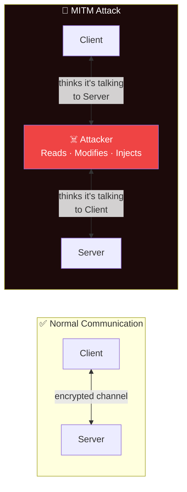
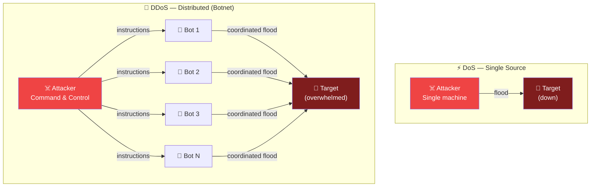

# Common Network Attacks and Defense

## What You'll Learn

- How Man-in-the-Middle (MITM) attacks work and how to prevent them
- DDoS/DoS attack types and mitigation strategies
- DNS attacks: spoofing, poisoning, and tunneling
- ARP spoofing and Layer 2 attacks
- How port scanning and reconnaissance work
- Phishing and social engineering techniques
- Defense strategies for each attack type
- Using Wireshark for attack detection
- Incident response basics

---

## 1. Man-in-the-Middle (MITM) Attacks

An attacker secretly intercepts and potentially alters communication between two parties who believe they are communicating directly.



### MITM Attack Variants

| Variant | How It Works | Layer |
|---------|-------------|-------|
| ARP Spoofing | Poison ARP cache to redirect LAN traffic | 2 |
| DNS Spoofing | Return fake DNS responses | 7 |
| SSL Stripping | Downgrade HTTPS to HTTP transparently | 7 |
| Wi-Fi Evil Twin | Fake access point mimics legitimate one | 1–2 |
| BGP Hijacking | Advertise false routes to redirect traffic | 3 |

### Defense Against MITM

| Defense | What It Protects |
|---------|-----------------|
| **TLS/HTTPS** | Encrypts data, verifies server identity |
| **HSTS** | Forces HTTPS, prevents SSL stripping |
| **Certificate pinning** | Only trusts specific certificates |
| **DNSSEC** | Authenticates DNS responses |
| **802.1X** | Authenticates devices on the network |
| **VPN** | Encrypts all traffic through a tunnel |

---

## 2. DDoS and DoS Attacks

A Denial-of-Service (DoS) attack overwhelms a target so legitimate users cannot access it. A Distributed DoS (DDoS) uses many sources.



### DDoS Attack Types

| Attack | Layer | Method | Amplification |
|--------|-------|--------|---------------|
| **SYN Flood** | 4 | Send millions of SYN packets, never complete handshake | None |
| **UDP Flood** | 4 | Overwhelm with random UDP packets | Low |
| **DNS Amplification** | 7 | Small query to open resolvers, large response to victim | **28–54x** |
| **NTP Amplification** | 7 | Monlist request to NTP servers | **556x** |
| **HTTP Flood** | 7 | Legitimate-looking HTTP requests | None |
| **Slowloris** | 7 | Keep connections open with partial headers | None |

### SYN Flood Explained

```
Normal TCP Handshake:            SYN Flood:
Client ── SYN ──> Server         Attacker ── SYN (spoofed src) ──> Server
Client <── SYN-ACK ── Server     Server allocates resources, waits...
Client ── ACK ──> Server         Server ── SYN-ACK ──> Spoofed IP (no reply)
   (Connection established)      Server ── SYN-ACK ──> Spoofed IP (no reply)
                                 ... thousands of half-open connections
                                 Server: OUT OF RESOURCES
```

### DDoS Defense

```bash
# Linux: Enable SYN cookies (mitigate SYN flood)
echo 1 > /proc/sys/net/ipv4/tcp_syncookies

# Limit connection rate with iptables
iptables -A INPUT -p tcp --syn -m limit --limit 1/s --limit-burst 3 -j ACCEPT
iptables -A INPUT -p tcp --syn -j DROP

# Limit connections per IP
iptables -A INPUT -p tcp --dport 80 -m connlimit --connlimit-above 50 -j DROP
```

| Defense | Description |
|---------|-------------|
| **Rate limiting** | Cap requests per IP/second |
| **SYN cookies** | Avoid allocating resources until handshake completes |
| **CDN/DDoS protection** | Cloudflare, AWS Shield absorb traffic |
| **Blackhole routing** | Drop all traffic to attacked IP (last resort) |
| **Anycast** | Distribute traffic across multiple data centers |
| **Traffic scrubbing** | Filter malicious traffic at upstream provider |

---

## 3. DNS Attacks

### DNS Spoofing / Cache Poisoning

An attacker injects fraudulent DNS records into a resolver's cache, redirecting users to malicious sites.

```
Normal DNS:
User ──> "example.com?" ──> DNS Resolver ──> 93.184.216.34 (correct)

DNS Poisoning:
Attacker injects fake record into DNS cache

User ──> "example.com?" ──> DNS Resolver ──> 192.0.2.1 (attacker's server)
                              │
                        Cache poisoned:
                        example.com → 192.0.2.1
```

### DNS Tunneling

Encodes data in DNS queries/responses to exfiltrate data or bypass firewalls.

```
Compromised Host                              Attacker's DNS Server
     │                                              │
     │── DNS Query: data123.evil.com ──────────────>│
     │<── DNS Response: encoded-command ────────────│
     │                                              │
     │  Data hidden inside DNS protocol             │
     │  Bypasses firewalls that allow DNS (port 53) │
```

### DNS Defense

| Defense | Purpose |
|---------|---------|
| **DNSSEC** | Cryptographically signs DNS records to prevent tampering |
| **DNS over HTTPS (DoH)** | Encrypts DNS queries in HTTPS |
| **DNS over TLS (DoT)** | Encrypts DNS queries in TLS |
| **Monitor DNS traffic** | Detect anomalous query patterns (tunneling) |
| **Use trusted resolvers** | 1.1.1.1 (Cloudflare), 8.8.8.8 (Google) |

---

## 4. ARP Spoofing / Poisoning

ARP (Address Resolution Protocol) maps IP addresses to MAC addresses on a local network. ARP spoofing sends fake ARP replies to associate the attacker's MAC with another host's IP.

```
Normal ARP:
PC-A: "Who has 10.0.0.1?" (broadcast)
Router: "10.0.0.1 is at MAC-R" (reply)
PC-A's ARP cache: 10.0.0.1 → MAC-R ✓

ARP Spoofing:
Attacker sends: "10.0.0.1 is at MAC-ATTACKER" (unsolicited)
PC-A's ARP cache: 10.0.0.1 → MAC-ATTACKER ✗

Result:
PC-A ──traffic──> Attacker ──forward──> Router
                     │
                  Captures all
                  traffic from PC-A
```

### ARP Spoofing Detection and Defense

```bash
# Detect ARP spoofing with arp-scan
sudo arp-scan --localnet
# Look for duplicate IPs with different MACs

# Wireshark filter for ARP anomalies
# Display filter:
arp.duplicate-address-detected
```

| Defense | Description |
|---------|-------------|
| **Dynamic ARP Inspection (DAI)** | Switch validates ARP packets against DHCP snooping DB |
| **Static ARP entries** | Manually set critical entries (gateway) |
| **802.1X** | Authenticate devices before network access |
| **VPN** | Encrypt traffic so interception is useless |
| **ARP watch tools** | `arpwatch`, `XArp` to detect changes |

---

## 5. Port Scanning and Reconnaissance

Attackers scan target networks to discover open ports, running services, and potential vulnerabilities.

### Nmap Scan Types

```bash
# TCP SYN scan (stealth — most common)
nmap -sS 192.168.1.0/24

# TCP connect scan (full handshake — more detectable)
nmap -sT 192.168.1.1

# UDP scan
nmap -sU 192.168.1.1

# Service version detection
nmap -sV 192.168.1.1

# OS detection
nmap -O 192.168.1.1

# Aggressive scan (OS + version + scripts + traceroute)
nmap -A 192.168.1.1

# Scan specific ports
nmap -p 22,80,443,3306 192.168.1.1

# Scan all 65535 ports
nmap -p- 192.168.1.1
```

### Reconnaissance Defense

| Defense | Description |
|---------|-------------|
| **Firewall rules** | Block unnecessary inbound ports |
| **Port knocking** | Open ports only after a secret sequence of connections |
| **IDS/IPS** | Detect and block scan patterns |
| **Disable unused services** | Fewer open ports = smaller attack surface |
| **Rate limiting** | Slow down rapid connection attempts |
| **Honeypots** | Fake services to detect and study attackers |

---

## 6. Phishing and Social Engineering

Social engineering exploits human psychology rather than technical vulnerabilities.

```
Phishing Attack Flow:
─────────────────────
1. Attacker creates fake login page (looks like real bank)
2. Sends email: "Your account is compromised! Click here"
3. User clicks link → enters credentials on fake page
4. Attacker captures credentials
5. Attacker uses real credentials on actual bank site

Spear Phishing:
─────────────────
Targeted at specific individual, uses personal information.
"Hi John, the Q3 report you requested is attached."
→ Attachment contains malware
```

| Type | Target | Sophistication |
|------|--------|---------------|
| **Phishing** | Mass audience | Low |
| **Spear phishing** | Specific individual | Medium |
| **Whaling** | Executives (CEO, CFO) | High |
| **Vishing** | Voice calls | Medium |
| **Smishing** | SMS messages | Low–Medium |

### Phishing Defense

- Email filtering and anti-spam gateways
- User security awareness training (most effective)
- MFA (limits damage even if credentials are stolen)
- DMARC, DKIM, SPF for email authentication
- URL filtering and link scanning
- Report phishing button in email clients

---

## 7. Wireshark for Attack Detection

### Useful Wireshark Filters

```
# Detect ARP spoofing (duplicate IP-MAC mappings)
arp.duplicate-address-detected

# Detect SYN flood (many SYN packets, no ACKs)
tcp.flags.syn == 1 && tcp.flags.ack == 0

# Detect port scan (many SYN to different ports from one IP)
tcp.flags.syn == 1 && ip.src == 192.168.1.100

# Detect DNS queries to suspicious domains
dns.qry.name contains "evil"

# Detect cleartext passwords (FTP, Telnet, HTTP Basic)
ftp.request.command == "PASS"
http.authorization

# Detect ICMP flood
icmp && ip.src == 10.0.0.50

# Filter for failed TLS handshakes
tls.alert_message
```

### Capturing Traffic for Analysis

```bash
# Capture with tcpdump (save for Wireshark analysis)
sudo tcpdump -i eth0 -w capture.pcap

# Capture only port 80 traffic
sudo tcpdump -i eth0 port 80 -w http_traffic.pcap

# Capture ARP traffic
sudo tcpdump -i eth0 arp -w arp_traffic.pcap

# Read capture file
tcpdump -r capture.pcap -n
```

---

## 8. Incident Response Basics

When a security incident occurs, follow a structured response process.

```
┌────────────┐   ┌────────────┐   ┌────────────┐   ┌────────────┐
│ 1. Prepare │──>│ 2. Identify│──>│ 3. Contain │──>│4. Eradicate│
│            │   │            │   │            │   │            │
│ IR plan,   │   │ Detect the │   │ Stop the   │   │ Remove the │
│ team, tools│   │ incident   │   │ spread     │   │ threat     │
└────────────┘   └────────────┘   └────────────┘   └────────────┘
                                                          │
                                                          ▼
                                  ┌────────────┐   ┌────────────┐
                                  │ 6. Lessons │◄──│ 5. Recover │
                                  │   Learned  │   │            │
                                  │            │   │ Restore    │
                                  │ Improve    │   │ systems    │
                                  │ defenses   │   │            │
                                  └────────────┘   └────────────┘
```

### NIST Incident Response Phases

| Phase | Actions |
|-------|---------|
| **1. Preparation** | Build IR team, document procedures, deploy monitoring tools |
| **2. Identification** | Detect anomaly, classify severity, document timeline |
| **3. Containment** | Isolate affected systems, block attacker IPs, preserve evidence |
| **4. Eradication** | Remove malware, patch vulnerabilities, reset compromised credentials |
| **5. Recovery** | Restore from clean backups, monitor closely, validate fixes |
| **6. Lessons Learned** | Post-incident review, update IR plan, improve defenses |

### Evidence Preservation

```bash
# Capture volatile data first (order of volatility)
# 1. Memory (RAM)
dd if=/dev/mem of=/evidence/memory.img bs=1M

# 2. Network connections
netstat -tulnp > /evidence/connections.txt
ss -tulnp > /evidence/sockets.txt

# 3. Running processes
ps aux > /evidence/processes.txt

# 4. System logs
cp /var/log/auth.log /evidence/
cp /var/log/syslog /evidence/

# 5. Disk image (last — modifying disk least)
dd if=/dev/sda of=/evidence/disk.img bs=4M
```

---

## 9. Attack and Defense Summary

| Attack | Layer | Detection | Primary Defense |
|--------|-------|-----------|-----------------|
| MITM | 2–7 | Unexpected cert warnings, ARP anomalies | TLS, HSTS, DNSSEC |
| SYN Flood | 4 | Half-open connections spike | SYN cookies, rate limiting |
| DNS Poisoning | 7 | Incorrect DNS responses | DNSSEC, DoH/DoT |
| ARP Spoofing | 2 | Duplicate MAC-IP mappings | DAI, static ARP, 802.1X |
| Port Scan | 3–4 | Many SYN to different ports | Firewall, IDS, port knocking |
| Phishing | 7+ | User reports, email analysis | Training, MFA, DMARC |
| DDoS | 3–7 | Traffic volume spike | CDN, scrubbing, rate limit |
| DNS Tunneling | 7 | Unusual DNS query patterns | DNS monitoring, filtering |

---

## Exercises

### Beginner

1. Explain how a SYN flood attack works. Why does the server run out of resources?
2. What is the difference between DoS and DDoS? Why is DDoS harder to defend against?
3. List three signs that might indicate a phishing email. How would you verify if an email is legitimate?

### Intermediate

4. Set up Wireshark and capture traffic on your local network. Write filters to identify: (a) all DNS queries, (b) all HTTP traffic, (c) all TCP SYN packets.
5. Explain how ARP spoofing enables a MITM attack on a local network. What Layer 2 security features prevent this?
6. You receive an alert that a server is receiving 10,000 SYN packets per second from various IPs. Walk through your incident response steps.

### Advanced

7. Use `nmap` to scan a target machine (your own lab VM). Identify all open ports, service versions, and OS. Then harden the machine by closing unnecessary ports and re-scan to verify.
8. Design a comprehensive defense strategy for a web application against: MITM, DDoS, SQL injection, phishing, and DNS attacks. Specify tools and configurations for each layer.
9. Research a real-world DDoS attack (e.g., Dyn DNS attack of 2016 or AWS Shield case study). Analyze the attack vector, impact, and how it was mitigated.

---

## Key Takeaways

- **MITM attacks** intercept communications — TLS and HSTS are the primary defenses
- **DDoS attacks** overwhelm resources — rate limiting, CDN, and traffic scrubbing are essential
- **DNS attacks** redirect users — DNSSEC and encrypted DNS (DoH/DoT) prevent tampering
- **ARP spoofing** is a local network threat — Dynamic ARP Inspection and 802.1X mitigate it
- **Phishing** exploits people, not technology — user training + MFA is the best defense
- **Wireshark** and **tcpdump** are essential tools for detecting and analyzing attacks
- **Incident response** follows a structured lifecycle: Prepare → Identify → Contain → Eradicate → Recover → Learn

---

## Navigation

- [← Previous: VPN and Secure Tunneling](./05_vpn_tunneling.md)
- [→ Next: Security Best Practices](./07_security_best_practices.md)
- [↑ Back to Network Security](./README.md)
