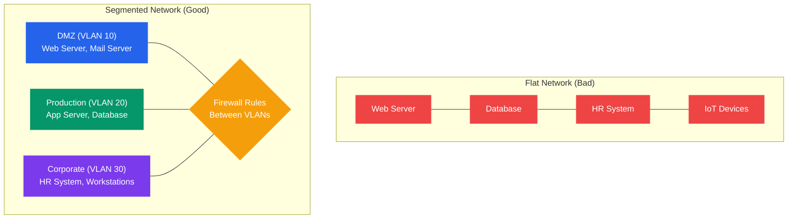
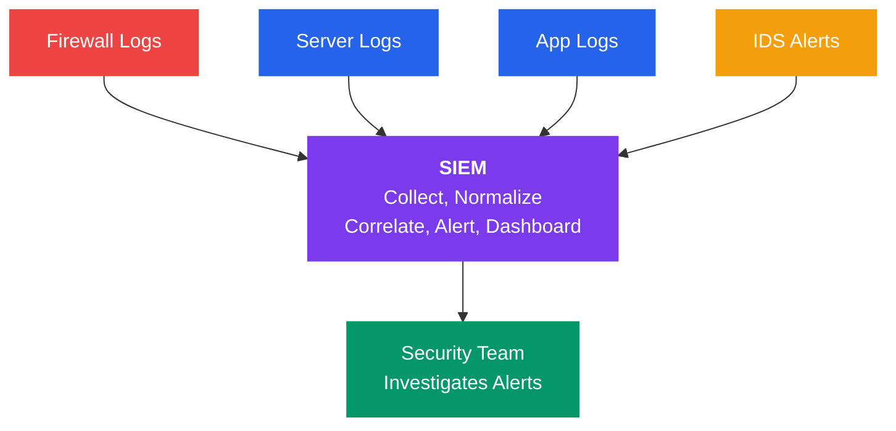

# Network Security Best Practices

## What You'll Learn

- How network segmentation and VLANs reduce attack surface
- Zero Trust Architecture principles and implementation
- The principle of least privilege and how to apply it
- Why patching and updates are critical and how to manage them
- Logging, monitoring, and SIEM for threat detection
- Password policies and multi-factor authentication (MFA)
- Secure configuration guidelines for servers and networks
- Penetration testing methodology and scope
- Security audit checklists for networks
- Compliance frameworks: PCI DSS, SOC 2, ISO 27001

---

## 1. Network Segmentation and VLANs

Segmentation divides a network into isolated zones to limit the blast radius of a breach.



```
Flat Network (Bad):
┌─────────────────────────────────────────────────────┐
│ All devices on one network                          │
│ Web Server ── Database ── HR System ── IoT Devices  │
│ If one is compromised, attacker can reach everything│
└─────────────────────────────────────────────────────┘

Segmented Network (Good):
┌───────────────┐  ┌───────────────┐  ┌───────────────┐
│  DMZ (VLAN 10)│  │Production     │  │Corporate      │
│               │  │(VLAN 20)      │  │(VLAN 30)      │
│  Web Server   │  │  App Server   │  │  HR System    │
│  Mail Server  │  │  Database     │  │  Workstations │
└───────┬───────┘  └───────┬───────┘  └───────┬───────┘
        │                  │                  │
        └──────── Firewall rules between VLANs ────────┘
                  (inter-VLAN routing controlled)
```

### VLAN Security Best Practices

| Practice | Why |
|----------|-----|
| Separate VLANs for different functions | Limits lateral movement |
| Firewall between VLANs | Controls inter-VLAN traffic |
| Dedicated management VLAN | Protects network device access |
| Disable unused switch ports | Prevents unauthorized physical access |
| Use 802.1Q trunking with allowed VLAN lists | Prevents VLAN hopping |
| Never use VLAN 1 for production | It is the default and often targeted |

### Microsegmentation

Goes beyond VLANs — applies security policies per workload or application, not just per network segment. Common in cloud and containerized environments.

```
Traditional Segmentation:         Microsegmentation:
┌────────────────────┐            ┌────────────────────┐
│      VLAN 20       │            │  ┌──┐  ┌──┐  ┌──┐ │
│ App1  App2  App3   │            │  │A1│  │A2│  │A3│ │
│ (all can talk to   │            │  │  │  │  │  │  │ │
│  each other)       │            │  └┬─┘  └┬─┘  └┬─┘ │
└────────────────────┘            │   │     │     │   │
                                  │ Individual policies│
                                  │ per workload       │
                                  └────────────────────┘
```

---

## 2. Zero Trust Architecture

**Core principle**: "Never trust, always verify." No user or device is trusted by default, even inside the network perimeter.

```
Traditional (Castle-and-Moat):         Zero Trust:
                                       
  ┌──────────────────┐                 Every access request is:
  │  Trusted Inside  │                 ┌─────────────────────┐
  │  ┌────────────┐  │                 │ 1. Verify identity  │
  │  │ Free access│  │                 │ 2. Check device     │
  │  │ once inside│  │                 │ 3. Least privilege  │
  │  └────────────┘  │                 │ 4. Encrypt always   │
  └────────┬─────────┘                 │ 5. Log everything   │
      Firewall                         │ 6. Assume breach    │
      (perimeter)                      └─────────────────────┘
           │                           Applied to EVERY request,
       Internet                        internal or external
```

### Zero Trust Pillars

| Pillar | Implementation |
|--------|---------------|
| **Identity** | Strong authentication (MFA), SSO, identity providers |
| **Devices** | Device health checks, endpoint detection (EDR) |
| **Network** | Microsegmentation, encrypted communications |
| **Applications** | Application-level access controls, API security |
| **Data** | Classification, encryption at rest and in transit |
| **Visibility** | Continuous monitoring, SIEM, analytics |

### Zero Trust Implementation Steps

1. Identify sensitive data and assets ("protect surface")
2. Map transaction flows (how data moves)
3. Build a Zero Trust architecture around the protect surface
4. Create Zero Trust policies (who, what, when, where, why, how)
5. Monitor and maintain continuously

---

## 3. Principle of Least Privilege

Users and systems should have only the minimum permissions needed to perform their function.

```
Over-Privileged (Bad):                Least Privilege (Good):
┌─────────────────────┐              ┌─────────────────────┐
│ Developer Account   │              │ Developer Account   │
│ ✓ Read code repo    │              │ ✓ Read code repo    │
│ ✓ Deploy to prod    │              │ ✓ Push to dev branch│
│ ✓ Access customer DB│              │ ✗ Deploy to prod    │
│ ✓ Modify firewall   │              │ ✗ Access customer DB│
│ ✓ Admin on all VMs  │              │ ✗ Modify firewall   │
└─────────────────────┘              └─────────────────────┘
```

### Applying Least Privilege

| Area | Implementation |
|------|---------------|
| **User accounts** | Role-based access, no shared accounts |
| **Service accounts** | Dedicated per-service, minimal permissions |
| **Database access** | Read-only where writes aren't needed |
| **Firewall rules** | Allow only specific ports and IPs required |
| **File permissions** | `chmod 600` for sensitive files, not `777` |
| **API keys** | Scoped to specific operations, rotated regularly |
| **Admin access** | Just-in-time (JIT) elevation, not permanent admin |

```bash
# Linux: Restrict file permissions
chmod 600 /etc/ssl/private/server.key    # Owner read/write only
chmod 644 /etc/ssl/certs/server.crt      # Owner write, everyone read
chown root:root /etc/ssl/private/server.key

# SSH: Disable root login
# In /etc/ssh/sshd_config:
# PermitRootLogin no
# AllowUsers deployer admin

# Database: Create limited-privilege user
# CREATE USER 'app_readonly'@'10.0.1.%' IDENTIFIED BY 'password';
# GRANT SELECT ON mydb.* TO 'app_readonly'@'10.0.1.%';
```

---

## 4. Regular Patching and Updates

Unpatched systems are the most common entry point for attackers.

```
Vulnerability Lifecycle:
                                            ┌──────────────┐
Vulnerability ── Discovered ── Disclosed ──>│ Patch Released│
  exists           │              │         └──────┬───────┘
                   │              │                │
                   ▼              ▼                ▼
              Exploit         CVE assigned    You must apply
              developed       (public)        the patch NOW
                   │
                   ▼
              Used in attacks
              (0-day if before patch)
```

### Patch Management Strategy

| Step | Action |
|------|--------|
| **1. Inventory** | Know every system, OS, and application version |
| **2. Categorize** | Classify by criticality (critical, high, medium, low) |
| **3. Test** | Apply patches to staging environment first |
| **4. Deploy** | Roll out to production with a rollback plan |
| **5. Verify** | Confirm patches applied, no regressions |
| **6. Document** | Record what was patched, when, by whom |

```bash
# Linux: Check for available updates
sudo apt update && apt list --upgradable    # Debian/Ubuntu
sudo yum check-update                       # RHEL/CentOS

# Apply security updates only
sudo apt-get upgrade --only-upgrade -y
sudo yum update --security -y

# Windows: Check update status (PowerShell)
Get-WindowsUpdate                           # Requires PSWindowsUpdate module
```

---

## 5. Logging and Monitoring (SIEM)

### What to Log

| Source | Critical Events |
|--------|----------------|
| **Firewalls** | Blocked connections, rule changes |
| **Servers** | Login attempts, privilege escalation, errors |
| **Applications** | Authentication events, API access, errors |
| **Network devices** | Configuration changes, interface up/down |
| **Databases** | Query patterns, failed logins, schema changes |
| **Endpoints** | Malware alerts, USB insertions, process execution |

### SIEM (Security Information and Event Management)



```
┌────────┐ ┌────────┐ ┌────────┐ ┌────────┐
│Firewall│ │ Server │ │  App   │ │  IDS   │
│  Logs  │ │  Logs  │ │  Logs  │ │ Alerts │
└───┬────┘ └───┬────┘ └───┬────┘ └───┬────┘
    │          │          │          │
    └──────────┴──────────┴──────────┘
                    │
                    ▼
           ┌────────────────┐
           │     SIEM       │
           │                │
           │ • Collect      │
           │ • Normalize    │
           │ • Correlate    │
           │ • Alert        │
           │ • Dashboard    │
           └────────┬───────┘
                    │
                    ▼
           ┌────────────────┐
           │ Security Team  │
           │ investigates   │
           │ alerts         │
           └────────────────┘
```

| SIEM Solution | Type | Notes |
|---------------|------|-------|
| Splunk | Commercial | Industry standard, powerful query language |
| Elastic SIEM | Open source | Built on Elasticsearch |
| Microsoft Sentinel | Cloud | Azure-native SIEM |
| Wazuh | Open source | Free, strong endpoint detection |
| Graylog | Open source | Log management with alerting |

---

## 6. Password Policies and MFA

### Password Policy Guidelines

| Requirement | NIST 800-63B Recommendation |
|-------------|----------------------------|
| Minimum length | **8 characters** (12+ preferred) |
| Maximum length | At least 64 characters |
| Complexity rules | **Not recommended** (don't force symbols) |
| Password rotation | **Not recommended** unless compromised |
| Breached password check | **Required** — check against known breaches |
| Password managers | **Encouraged** |
| SMS-based 2FA | **Discouraged** (SIM swap risk) |

### Multi-Factor Authentication (MFA)

```
Password Only:                    With MFA:
┌──────────┐                     ┌──────────┐
│ Password │──> Access Granted   │ Password │──┐
└──────────┘                     └──────────┘  │
                                               ├──> Access Granted
                                 ┌──────────┐  │
                                 │ 2nd Factor│──┘
                                 │(TOTP/Key) │
                                 └──────────┘
```

| MFA Method | Security Level | User Experience |
|------------|---------------|-----------------|
| SMS code | Low (SIM swap risk) | Easy |
| TOTP app (Google Auth) | **Medium** | Easy |
| Push notification (Duo) | **Medium** | Very easy |
| Hardware key (YubiKey) | **High** | Moderate |
| Passkeys/WebAuthn | **High** | Easy (biometric) |

---

## 7. Secure Configuration Guidelines

### Server Hardening Checklist

```bash
# 1. Remove unnecessary services
sudo systemctl disable --now cups bluetooth avahi-daemon

# 2. Configure SSH securely
# /etc/ssh/sshd_config:
# PermitRootLogin no
# PasswordAuthentication no       # Use key-based auth only
# MaxAuthTries 3
# AllowUsers deployer admin
# Protocol 2

# 3. Set file permissions
chmod 700 ~/.ssh
chmod 600 ~/.ssh/authorized_keys
chmod 600 /etc/shadow

# 4. Enable automatic security updates
sudo apt install unattended-upgrades
sudo dpkg-reconfigure unattended-upgrades

# 5. Configure fail2ban (block brute force)
sudo apt install fail2ban
# /etc/fail2ban/jail.local:
# [sshd]
# enabled = true
# maxretry = 3
# bantime = 3600

# 6. Disable IPv6 if not needed
# /etc/sysctl.conf:
# net.ipv6.conf.all.disable_ipv6 = 1
```

### CIS Benchmarks Summary

| Category | Key Recommendations |
|----------|-------------------|
| **OS** | Disable unused services, configure audit logging |
| **Network** | Disable IP forwarding (non-routers), enable TCP SYN cookies |
| **Authentication** | Enforce password policy, configure account lockout |
| **Logging** | Enable syslog, retain logs 90+ days, protect log files |
| **File system** | Set `noexec` on `/tmp`, restrict world-writable files |

---

## 8. Penetration Testing Overview

Penetration testing simulates real attacks to find vulnerabilities before attackers do.

```
Penetration Testing Phases:
─────────────────────────────────────────────────────────────────
1. Planning     2. Reconnaissance   3. Scanning    4. Exploitation
   & Scoping       (OSINT, DNS)      (Nmap, Nessus)  (Gain access)
      │                │                  │               │
      ▼                ▼                  ▼               ▼
 Define scope     Gather info        Find vulns      Exploit vulns
 Rules of         about target       Open ports      Prove impact
 engagement                          Services
      │                                                   │
      │                                                   ▼
      │              6. Reporting    5. Post-Exploitation
      │              ◄─────────────    (Pivot, escalate,
      │              Document           exfiltrate)
      └──────────────findings
                     with evidence
```

### Pen Test Types

| Type | Knowledge | Simulates |
|------|-----------|-----------|
| **Black box** | No prior knowledge | External attacker |
| **White box** | Full access (source code, architecture) | Insider threat, thorough audit |
| **Gray box** | Partial knowledge (credentials, some docs) | Compromised user account |

### Common Pen Test Tools

| Tool | Purpose |
|------|---------|
| **Nmap** | Network scanning, port discovery |
| **Burp Suite** | Web application testing |
| **Metasploit** | Exploit framework |
| **Nessus / OpenVAS** | Vulnerability scanning |
| **Hashcat / John** | Password cracking |
| **Wireshark** | Traffic analysis |
| **SQLMap** | SQL injection testing |

---

## 9. Security Audit Checklist

### Network Security Audit

| # | Check | Status |
|---|-------|--------|
| 1 | All systems inventoried and classified | ☐ |
| 2 | Firewalls configured with default deny | ☐ |
| 3 | Unused ports and services disabled | ☐ |
| 4 | Network segmented (VLANs, DMZ) | ☐ |
| 5 | TLS 1.2+ enforced, SSL/TLS 1.0–1.1 disabled | ☐ |
| 6 | VPN with strong encryption for remote access | ☐ |
| 7 | IDS/IPS deployed and tuned | ☐ |
| 8 | DNS uses DNSSEC or encrypted DNS | ☐ |
| 9 | Wireless uses WPA3 or WPA2-Enterprise | ☐ |
| 10 | 802.1X for network access control | ☐ |
| 11 | Centralized logging (SIEM) configured | ☐ |
| 12 | Log retention meets compliance requirements | ☐ |
| 13 | MFA enabled for all admin and remote access | ☐ |
| 14 | Password policy follows NIST guidelines | ☐ |
| 15 | Patches applied within 30 days (critical: 48 hrs) | ☐ |
| 16 | Backups tested and encrypted | ☐ |
| 17 | Incident response plan documented and tested | ☐ |
| 18 | Penetration test conducted within last 12 months | ☐ |
| 19 | Vendor/third-party access reviewed | ☐ |
| 20 | Employee security training completed | ☐ |

---

## 10. Compliance Frameworks

| Framework | Full Name | Focus | Who Needs It |
|-----------|-----------|-------|--------------|
| **PCI DSS** | Payment Card Industry Data Security Standard | Credit card data protection | Anyone processing card payments |
| **SOC 2** | Service Organization Control 2 | Trust services criteria | SaaS companies, service providers |
| **ISO 27001** | Information Security Management System | Comprehensive InfoSec | Global organizations |
| **HIPAA** | Health Insurance Portability and Accountability Act | Healthcare data | US healthcare organizations |
| **GDPR** | General Data Protection Regulation | Personal data privacy | Any org handling EU citizen data |
| **NIST CSF** | Cybersecurity Framework | Risk management | US federal agencies, voluntary |

### PCI DSS Key Requirements (Summary)

| # | Requirement |
|---|-------------|
| 1 | Install and maintain a firewall |
| 2 | Do not use vendor-supplied default passwords |
| 3 | Protect stored cardholder data (encryption) |
| 4 | Encrypt transmission of cardholder data |
| 5 | Use and regularly update anti-virus |
| 6 | Develop and maintain secure systems |
| 7 | Restrict access by business need-to-know |
| 8 | Assign unique ID to each person with access |
| 9 | Restrict physical access to cardholder data |
| 10 | Track and monitor all access to resources |
| 11 | Regularly test security systems |
| 12 | Maintain an information security policy |

---

## Exercises

### Beginner

1. List five things you would check in a basic security audit of a small office network.
2. Explain the difference between RBAC (Role-Based Access Control) and least privilege. How do they work together?
3. Why does NIST no longer recommend forcing regular password changes? What should organizations do instead?

### Intermediate

4. Design a VLAN architecture for a mid-size company with these departments: Engineering, HR, Finance, Guest Wi-Fi, and Servers. Define which VLANs can communicate with which.
5. You are implementing Zero Trust for a company with 500 employees. Describe the first five steps you would take and what tools you would deploy.
6. Compare SOC 2 and ISO 27001. When would a company pursue one vs the other?

### Advanced

7. Plan a penetration test for a web-based SaaS product. Define the scope, rules of engagement, testing methodology, and deliverables.
8. Design a complete SIEM deployment plan: data sources, log formats, correlation rules, alert thresholds, and incident response integration.
9. A company processes credit card payments and serves EU customers. Which compliance frameworks apply? Create a mapping of overlapping requirements between PCI DSS, GDPR, and SOC 2.

---

## Key Takeaways

- **Network segmentation** limits lateral movement — VLANs, microsegmentation, and DMZ
- **Zero Trust** assumes breach and verifies every access request regardless of location
- **Least privilege** ensures users and services have only the permissions they need
- **Patching** is critical — unpatched systems are the #1 attack vector
- **SIEM** centralizes logs for correlation, alerting, and forensics
- **MFA** dramatically reduces credential-based attacks — hardware keys are strongest
- **Penetration testing** validates your defenses against real-world attack techniques
- **Compliance** (PCI DSS, SOC 2, ISO 27001) provides structured security requirements

---

## Navigation

- [← Previous: Common Attacks and Defense](./06_attacks_and_defense.md)
- [↑ Back to Network Security](./README.md)
- [↑ Back to Computer Networks](../README.md)
