# Database Sharding — Deep Dive

> **Series:** Advanced DBMS Notes
> **Chapter:** 01 — Sharding
> **Level:** Intermediate to Advanced
> **Prerequisites:** Basic SQL, indexes, replication concepts

---

## 🗺️ Table of Contents

1. [What Is Sharding?](#-what-is-sharding)
2. [Why Do You Need Sharding?](#-why-do-you-need-sharding)
3. [Sharding Strategies](#-sharding-strategies)
   - Range-Based
   - Hash-Based
   - Directory-Based
   - Consistent Hashing
4. [Choosing the Shard Key](#-choosing-the-shard-key)
5. [Cross-Shard Queries](#-cross-shard-queries)
6. [Cross-Shard Transactions](#-cross-shard-transactions)
7. [Resharding](#-resharding)
8. [Production Tools — Vitess & Citus](#-production-tools--vitess--citus)
9. [Global Tables and Reference Tables](#-global-tables-and-reference-tables)
10. [Shard Enumeration](#-shard-enumeration)
11. [When to Use / When NOT to Use](#-when-to-use--when-not-to-use)
12. [Key Takeaways](#-key-takeaways)

---

## 🔍 What Is Sharding?

**Real-world analogy:** Imagine a city library with 10 million books. One librarian cannot manage all of them, one room cannot hold them all, and finding a single book takes forever. So the library splits books across 10 branches — fiction in Branch A, science in Branch B, history in Branch C. Each branch is independent. You go to the right branch, get your book fast.

**Sharding = doing exactly that for your database.**

Sharding is **horizontal partitioning** — splitting rows of a table across multiple independent database **instances** (called shards). Each shard holds a subset of the data. Unlike vertical partitioning (splitting columns), sharding splits rows.

```
Without Sharding:               With Sharding:

┌──────────────┐               ┌──────────┐ ┌──────────┐ ┌──────────┐
│  One Giant   │               │  Shard 0 │ │  Shard 1 │ │  Shard 2 │
│  Database    │  ─────────►   │ Users    │ │ Users    │ │ Users    │
│  100 million │               │ 1-33M    │ │ 33M-66M  │ │ 66M-100M │
│  users       │               └──────────┘ └──────────┘ └──────────┘
└──────────────┘               (different machines, different disks)
```

Each shard is a complete, standalone database with its own CPU, RAM, disk, and connections. They do NOT share storage.

### Sharding vs. Replication — The Key Difference

| Feature | Replication | Sharding |
|---|---|---|
| Purpose | Fault tolerance, read scaling | Write scaling, storage scaling |
| Data | Full copy on each node | Subset on each node |
| Total data stored | N × original | ~1× original (split) |
| Handles | High read QPS | High write QPS, huge data volume |
| Complexity | Low-Medium | High |

> **In practice:** Production systems use BOTH — each shard is replicated for fault tolerance.

---

## 🚨 Why Do You Need Sharding?

**Real-world analogy:** A restaurant with one chef can serve 50 people. When 500 people show up, adding a bigger oven (vertical scaling) helps — but only to a point. Eventually, you open more restaurant locations (horizontal scaling = sharding).

A single database server hits physical limits:

| Limit | Typical ceiling |
|---|---|
| Disk storage | 64 TB (practical) |
| Write throughput | ~10,000–50,000 writes/sec |
| Connections | ~5,000–10,000 concurrent |
| RAM for working set | 1–4 TB |

When your dataset is 100 TB, or you receive 1 million queries per second (QPS), **no single machine can handle it**. You shard.

### Real numbers from big systems

- **Facebook (2008):** Sharded MySQL into thousands of shards to serve 100M+ users
- **YouTube:** Built Vitess to shard MySQL at planet scale
- **Pinterest:** Moved to sharded MySQL when they hit 10TB of data in 2012
- **Discord:** Sharded PostgreSQL to handle billions of messages

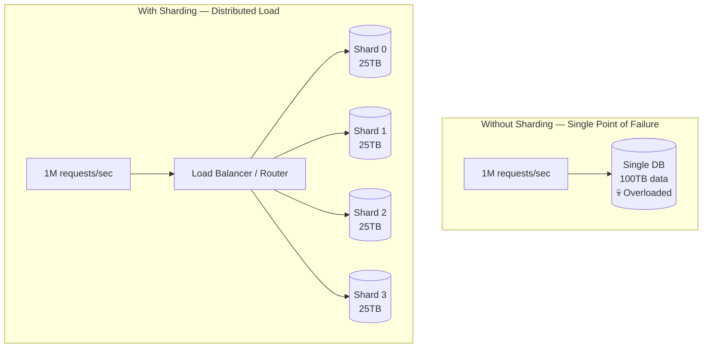

---

## 🗂️ Sharding Strategies

### 1. Range-Based Sharding

**Real-world analogy:** An encyclopedia — Volume A-F on shelf 1, G-M on shelf 2, N-Z on shelf 3. Books are split by the starting letter range.

You pick a column (e.g., `user_id` or `created_at`) and assign ranges to shards.

```
user_id 1       – 10,000,000  → Shard 0
user_id 10,000,001 – 20,000,000  → Shard 1
user_id 20,000,001 – 30,000,000  → Shard 2
```

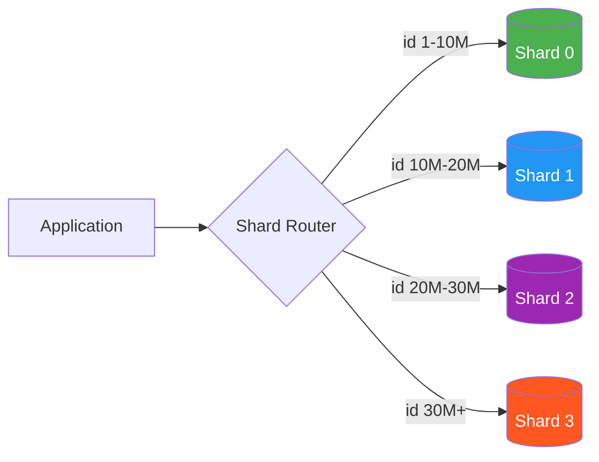

**Implementation example (Python pseudocode):**

```python
SHARD_RANGES = [
    (1,        10_000_000, "shard_0_host"),
    (10_000_001, 20_000_000, "shard_1_host"),
    (20_000_001, 30_000_000, "shard_2_host"),
    (30_000_001, float('inf'), "shard_3_host"),
]

def get_shard(user_id: int) -> str:
    for low, high, host in SHARD_RANGES:
        if low <= user_id <= high:
            return host
    raise ValueError(f"No shard found for user_id={user_id}")

# Usage
host = get_shard(15_000_000)  # → "shard_1_host"
```

**Pros:**
- Range queries are fast — all data for `id 1–1000` lives in one shard, no scatter-gather
- Easy to understand and debug
- Good for time-series data (logs, events by date)

**Cons:**
- **Hot spot problem** — new users always go to the last shard. Shard 3 gets hammered, Shard 0 sits idle
- Uneven data distribution if data is not uniformly distributed
- Adding a new shard requires config changes

---

### 2. Hash-Based Sharding

**Real-world analogy:** A post office sorts letters by the last digit of the zip code. Zip ends in 0 → counter 0, ends in 1 → counter 1. Every counter gets roughly equal traffic.

You hash the shard key and take a modulo:

```
shard_number = hash(user_id) % number_of_shards
```

```mermaid
graph LR
    App[Application] --> Router{Hash Router\nhash&#40;id&#41; % 4}
    Router -->|hash % 4 = 0| S0[(Shard 0)]
    Router -->|hash % 4 = 1| S1[(Shard 1)]
    Router -->|hash % 4 = 2| S2[(Shard 2)]
    Router -->|hash % 4 = 3| S3[(Shard 3)]
```

**Implementation example:**

```python
import hashlib

NUM_SHARDS = 4
SHARD_HOSTS = {
    0: "shard_0_host",
    1: "shard_1_host",
    2: "shard_2_host",
    3: "shard_3_host",
}

def get_shard(user_id: int) -> str:
    # Use consistent hash function (not Python's built-in hash — it's non-deterministic)
    hash_val = int(hashlib.md5(str(user_id).encode()).hexdigest(), 16)
    shard_num = hash_val % NUM_SHARDS
    return SHARD_HOSTS[shard_num]

# Usage
host = get_shard(42)  # Deterministic — always same shard for same id
```

**Pros:**
- Even data distribution — no hot spots
- Simple to implement
- Deterministic routing — no lookup needed

**Cons:**
- **Rebalancing pain** — if you change `N` (add/remove a shard), nearly all data needs to move. With 4 shards → 5 shards, ~80% of data is now on the wrong shard
- Range queries are terrible — `user_id BETWEEN 1 AND 1000` hits all shards
- Fixed number of shards must be planned upfront

---

### 3. Directory-Based Sharding

**Real-world analogy:** A hotel concierge keeps a notebook: "Room 101 → Building A, Room 200 → Building B." Every new guest is assigned a room by the concierge who updates the notebook.

A separate **lookup service** (directory) maps each key to a shard. The router asks the directory: "Where does user_id 42 live?" — and the directory responds.

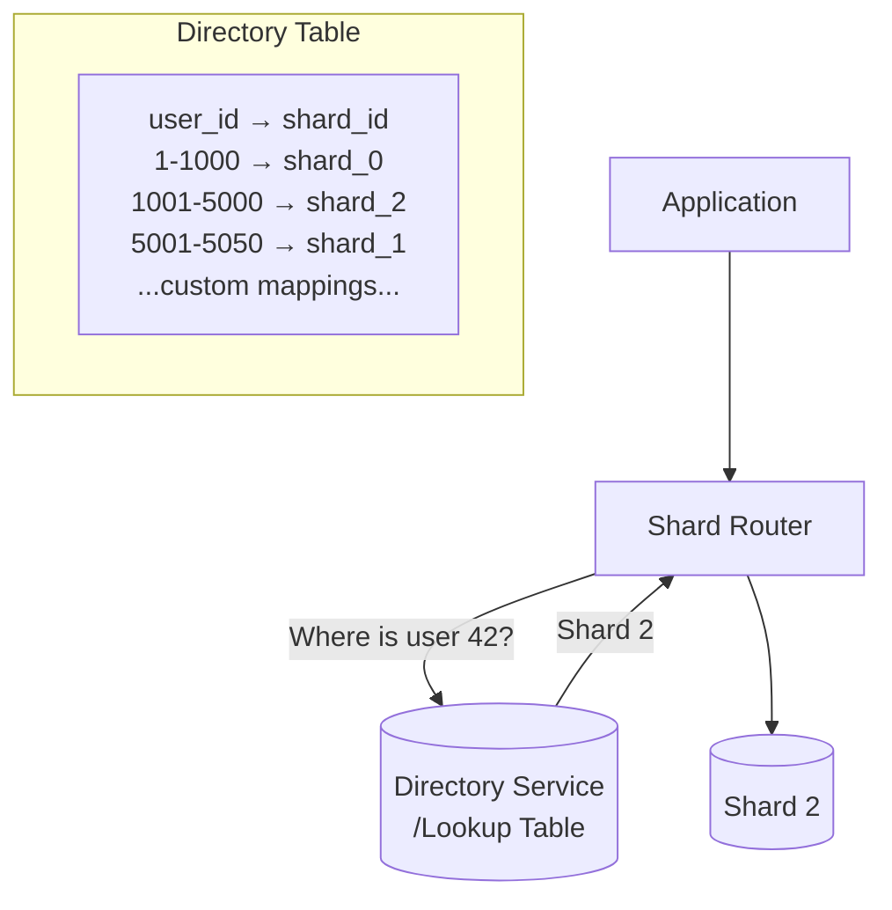

**Implementation example:**

```python
# Directory stored in Redis or a small metadata DB
import redis

class DirectoryShardRouter:
    def __init__(self):
        self.dir = redis.Redis(host="directory-host")
        self.shard_hosts = {
            "shard_0": "db-host-0",
            "shard_1": "db-host-1",
            "shard_2": "db-host-2",
        }

    def get_shard(self, user_id: int) -> str:
        shard_id = self.dir.get(f"user:{user_id}")
        if shard_id:
            return self.shard_hosts[shard_id.decode()]
        # Assign new user to least-loaded shard
        shard_id = self._assign_shard(user_id)
        return self.shard_hosts[shard_id]

    def _assign_shard(self, user_id: int) -> str:
        shard_id = "shard_0"  # simplified: pick least-loaded
        self.dir.set(f"user:{user_id}", shard_id)
        return shard_id
```

**Pros:**
- Maximum flexibility — move individual keys between shards anytime
- No rebalancing problem — just update the directory
- Can handle uneven data naturally

**Cons:**
- **Single point of failure** — if the directory goes down, nothing works
- Extra network hop for every query (latency)
- Directory can become a bottleneck at scale (cache it aggressively)

---

### 4. Consistent Hashing

**Real-world analogy:** Imagine a clock face (0 to 360 degrees). Each database server is placed at a position on the clock. Each data key is also hashed to a position on the clock. The data goes to the first server clockwise from its position. When you add a new server, only the data between the new server and its predecessor moves — everything else stays put.

This elegantly solves the rebalancing problem of simple hash-based sharding.

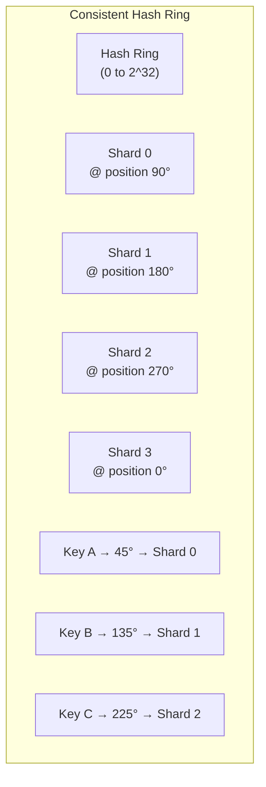

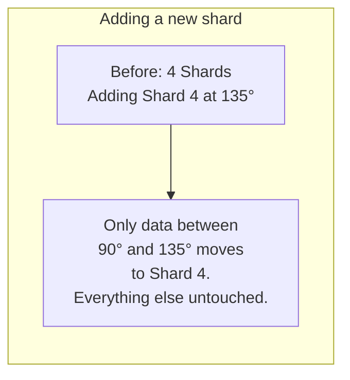

**Implementation example (simplified):**

```python
import hashlib
import bisect

class ConsistentHashRing:
    def __init__(self, replicas=150):
        # replicas = virtual nodes per shard (for even distribution)
        self.replicas = replicas
        self.ring = {}       # position -> shard_host
        self.sorted_keys = []  # sorted positions

    def _hash(self, key: str) -> int:
        return int(hashlib.md5(key.encode()).hexdigest(), 16)

    def add_shard(self, shard_host: str):
        for i in range(self.replicas):
            virtual_node_key = f"{shard_host}:vnode:{i}"
            position = self._hash(virtual_node_key)
            self.ring[position] = shard_host
            bisect.insort(self.sorted_keys, position)

    def remove_shard(self, shard_host: str):
        for i in range(self.replicas):
            virtual_node_key = f"{shard_host}:vnode:{i}"
            position = self._hash(virtual_node_key)
            del self.ring[position]
            self.sorted_keys.remove(position)

    def get_shard(self, key: str) -> str:
        if not self.ring:
            raise Exception("No shards available")
        position = self._hash(key)
        # Find first shard clockwise from this position
        idx = bisect.bisect(self.sorted_keys, position)
        if idx == len(self.sorted_keys):
            idx = 0  # wrap around
        return self.ring[self.sorted_keys[idx]]

# Usage
ring = ConsistentHashRing(replicas=150)
ring.add_shard("db-host-0")
ring.add_shard("db-host-1")
ring.add_shard("db-host-2")

shard = ring.get_shard("user:42")   # → consistent answer
shard = ring.get_shard("user:9999") # → consistent answer

# Add a new shard — only ~25% of data moves (with 4 shards → 5)
ring.add_shard("db-host-3")
```

**Why virtual nodes?** Without them, servers may land unevenly on the ring. With 150 virtual nodes per shard, each shard handles roughly equal load regardless of where physical nodes land.

| Property | Simple Hash | Consistent Hash |
|---|---|---|
| Adding 1 shard (N→N+1) | ~(N-1)/N keys move | ~1/N keys move |
| Removing 1 shard | ~(N-1)/N keys move | ~1/N keys move |
| Even distribution | Good | Good (with virtual nodes) |
| Implementation complexity | Low | Medium |
| Range queries | Poor | Poor |

---

## 🔑 Choosing the Shard Key

**This is the single most important decision in sharding. Get it wrong, and you live with the consequences forever.**

**Real-world analogy:** A filing cabinet sharded by first letter of surname. If 30% of your customers are named Smith, Shah, or Singh — the "S" drawer overflows while "Q" is nearly empty. A bad shard key creates hot shards.

### Rules for a Good Shard Key

**1. High Cardinality** — enough distinct values to spread data across shards.
- BAD: `country` (only 195 countries, US has 40% of traffic)
- GOOD: `user_id` (millions of distinct values)

**2. Even Distribution** — no one shard should get most of the data or traffic.
- BAD: `created_at` for a social network (today's date gets all writes)
- GOOD: `user_id` hash distributes writes evenly

**3. Query Alignment** — most of your queries should filter BY the shard key to avoid cross-shard queries.
- If 90% of queries are `WHERE user_id = X`, shard by `user_id`
- If 90% of queries are `WHERE tenant_id = X`, shard by `tenant_id`

**4. Co-locate Related Data** — data you JOIN together should live in the same shard.
- Shard users AND their orders by `user_id` → `SELECT * FROM orders WHERE user_id = 42` hits one shard
- If users are sharded by `user_id` but orders by `order_id` → every user's orders are scattered

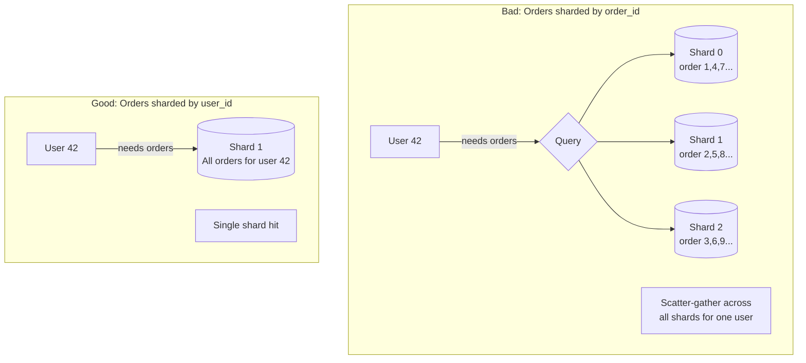

### Shard Key Anti-Patterns

```
❌ Auto-increment integer as shard key with range sharding
   → All new writes go to the last shard (hot shard)

❌ Timestamp as shard key  
   → "Today" shard is on fire; old shards are cold

❌ Low-cardinality column (status, country, gender)
   → Too few shards possible; hot spots guaranteed

❌ Shard key that changes
   → User changes their username → has to move to different shard → complex migration

✅ UUID or hashed user_id
✅ Composite key: (tenant_id, entity_id)
✅ A column you always filter by and that has high cardinality
```

---

## 🔗 Cross-Shard Queries

**Real-world analogy:** You work in a company where personnel files are split across 10 offices by last name. Your boss asks: "List every employee who joined after 2020 sorted by salary." You have to call all 10 offices, get their lists, combine them, then sort. This is cross-shard scatter-gather.

Cross-shard queries are the **biggest operational pain** of sharding.

### The Problem: JOINs Across Shards

```sql
-- Simple query — shard key present — hits ONE shard ✅
SELECT * FROM orders WHERE user_id = 42;

-- Cross-shard query — no shard key — hits ALL shards ❌
SELECT * FROM orders WHERE amount > 1000 ORDER BY created_at;

-- Cross-shard JOIN — users on user_id shard, products on product_id shard ❌
SELECT u.name, p.title
FROM users u
JOIN orders o ON u.id = o.user_id
JOIN products p ON o.product_id = p.id
WHERE u.country = 'IN';
```

### How Applications Handle Cross-Shard Queries

**Pattern 1: Scatter-Gather**

The router sends the query to ALL shards in parallel, collects results, merges and sorts them in application memory.

```python
import asyncio
import aiohttp

async def scatter_gather_query(sql: str, shards: list[str]) -> list[dict]:
    """Send the same query to all shards, merge results."""
    async def query_shard(shard_host: str) -> list[dict]:
        # Connect to shard, run query, return rows
        async with aiohttp.ClientSession() as session:
            async with session.post(f"http://{shard_host}/query",
                                    json={"sql": sql}) as r:
                return await r.json()

    # Run on all shards in parallel
    results = await asyncio.gather(*[query_shard(s) for s in shards])

    # Merge and sort (application-level aggregation)
    all_rows = [row for shard_rows in results for row in shard_rows]
    all_rows.sort(key=lambda r: r["created_at"], reverse=True)
    return all_rows

# Usage
rows = await scatter_gather_query(
    "SELECT * FROM orders WHERE amount > 1000",
    shards=["db-0", "db-1", "db-2", "db-3"]
)
```

**Pattern 2: Denormalization — Avoid the JOIN**

Instead of joining across shards, store the data you need together.

```sql
-- Instead of:
-- orders JOIN products → cross-shard

-- Denormalize: store product name IN the orders table
CREATE TABLE orders (
    id         BIGINT PRIMARY KEY,
    user_id    BIGINT,           -- shard key
    product_id BIGINT,
    product_name VARCHAR(255),   -- denormalized copy
    product_sku  VARCHAR(50),    -- denormalized copy
    amount     DECIMAL(10,2),
    created_at TIMESTAMP
);
-- Now one shard has everything you need for an order
```

**Pattern 3: Global Aggregation Table**

For analytics, write aggregated data to a separate non-sharded reporting database.

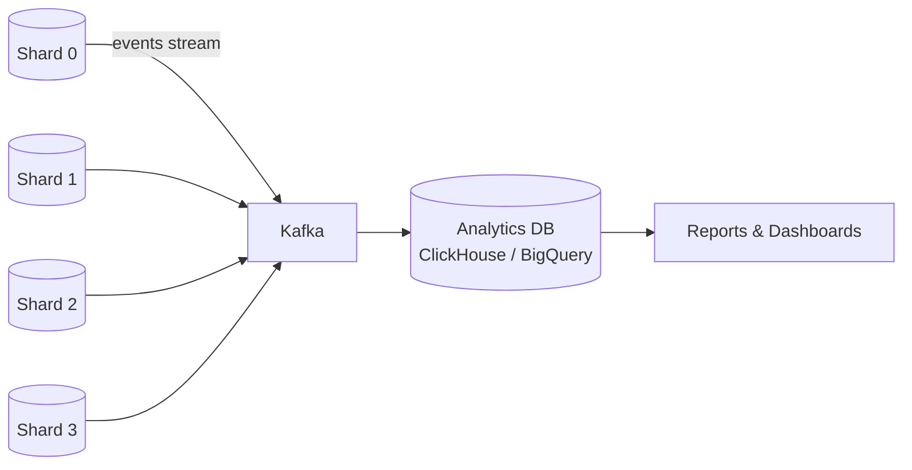

---

## 🔄 Cross-Shard Transactions

**Real-world analogy:** Transferring money between two banks — Bank A must debit, Bank B must credit. If Bank A debits but the network goes down before Bank B credits, money disappears. Both steps must succeed or both must fail.

Cross-shard transactions need distributed coordination. Two main approaches:

### Two-Phase Commit (2PC)

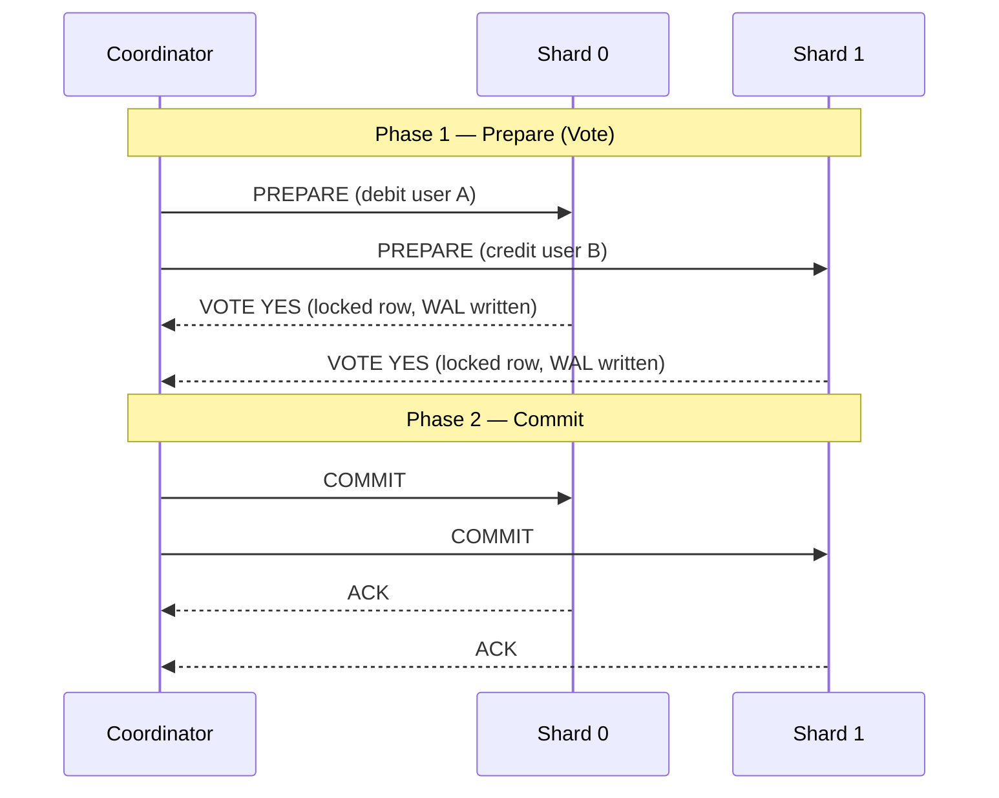

**Problems with 2PC:**
- If coordinator crashes after PREPARE but before COMMIT → shards are locked forever (blocking protocol)
- High latency — 2 round trips minimum
- Not suitable for high-throughput systems

### Saga Pattern

Break the transaction into a sequence of local transactions. Each step publishes an event. If a step fails, compensating transactions undo previous steps.

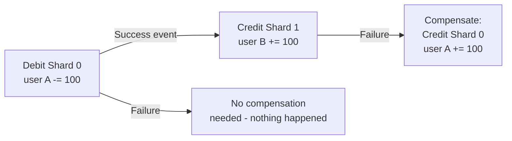

```python
# Saga choreography example
class TransferSaga:
    def execute(self, from_user: int, to_user: int, amount: float):
        # Step 1: Debit source (Shard 0)
        shard0 = get_shard(from_user)
        success = shard0.execute(
            "UPDATE accounts SET balance = balance - %s WHERE user_id = %s AND balance >= %s",
            (amount, from_user, amount)
        )
        if not success:
            raise InsufficientFundsError()

        # Step 2: Credit destination (Shard 1)
        shard1 = get_shard(to_user)
        try:
            shard1.execute(
                "UPDATE accounts SET balance = balance + %s WHERE user_id = %s",
                (amount, to_user)
            )
        except Exception:
            # Compensate: refund the source
            shard0.execute(
                "UPDATE accounts SET balance = balance + %s WHERE user_id = %s",
                (amount, from_user)
            )
            raise
```

| Approach | Consistency | Availability | Latency | Complexity |
|---|---|---|---|---|
| 2PC | Strong (ACID) | Low (blocking) | High | Medium |
| Saga | Eventual | High | Low | High |
| Avoid cross-shard txns | N/A | N/A | N/A | Best design choice |

> **Best practice:** Design your shard key so that transactions happen within one shard. Cross-shard transactions are an emergency measure, not a design goal.

---

## 📈 Resharding

**Real-world analogy:** Your startup begins with 4 pizza shops. Five years later, demand triples. You need to open 8 shops and redistribute deliveries so no shop is overwhelmed. Moving all operations while shops are still serving customers — without closing — is the challenge.

**Resharding** = splitting a shard that has grown too large into two (or more) smaller shards. Done live, without downtime, this is called **online resharding**.

### The Dual-Write Approach (Online Resharding)

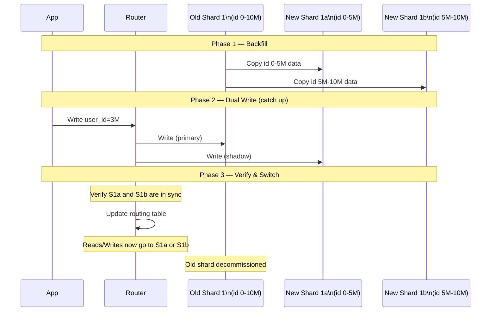

**Step-by-step process:**

```
1. Start backfill: Copy data from Shard 1 to new Shard 1a (id 0-5M) and Shard 1b (id 5M-10M)
2. Enable dual-write: New writes go to BOTH old and new shards
3. Monitor replication lag: Wait until new shards are caught up
4. Verify checksums: New shards have the same data as old shard
5. Switch reads: Route reads to new shards (can do gradually, e.g., 1% → 10% → 100%)
6. Switch writes: Route all writes to new shards
7. Decommission old shard
```

---

## 🛠️ Production Tools — Vitess & Citus

### Vitess (MySQL Sharding — YouTube's Solution)

YouTube built Vitess in 2010 because they needed to shard MySQL without rewriting their entire application. Vitess sits between your app and MySQL, making a sharded cluster look like a single MySQL server.

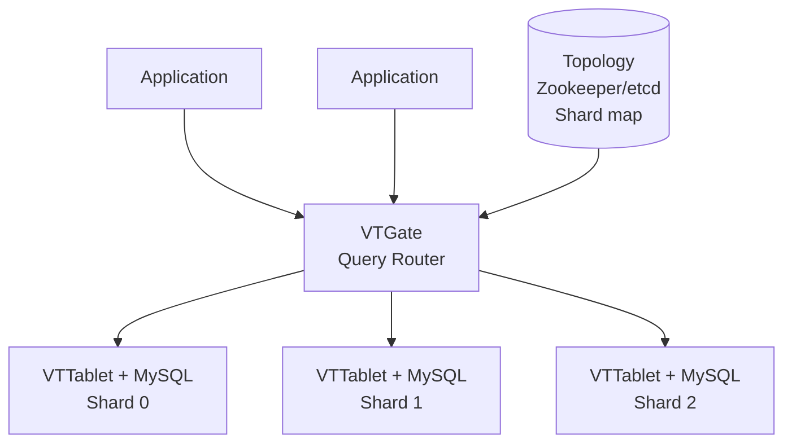

**Key Vitess features:**
- **VTGate:** Smart proxy — parses SQL, routes to correct shard, scatter-gathers when needed
- **VSchema:** You define which column is the shard key; Vitess handles routing
- **Online schema changes:** Alter tables across all shards without locking
- **Connection pooling:** Thousands of app connections → dozens of MySQL connections per shard
- **Resharding built-in:** `MoveTables` and `Reshard` commands handle online resharding

```yaml
# VSchema — tell Vitess how to shard the 'orders' table
{
  "sharded": true,
  "vindexes": {
    "hash": {
      "type": "hash"
    }
  },
  "tables": {
    "orders": {
      "column_vindexes": [
        {
          "column": "user_id",
          "name": "hash"
        }
      ]
    }
  }
}
```

### Citus (PostgreSQL Sharding)

Citus is a PostgreSQL extension that turns a single Postgres node into a distributed database. It feels like normal Postgres — you write standard SQL.

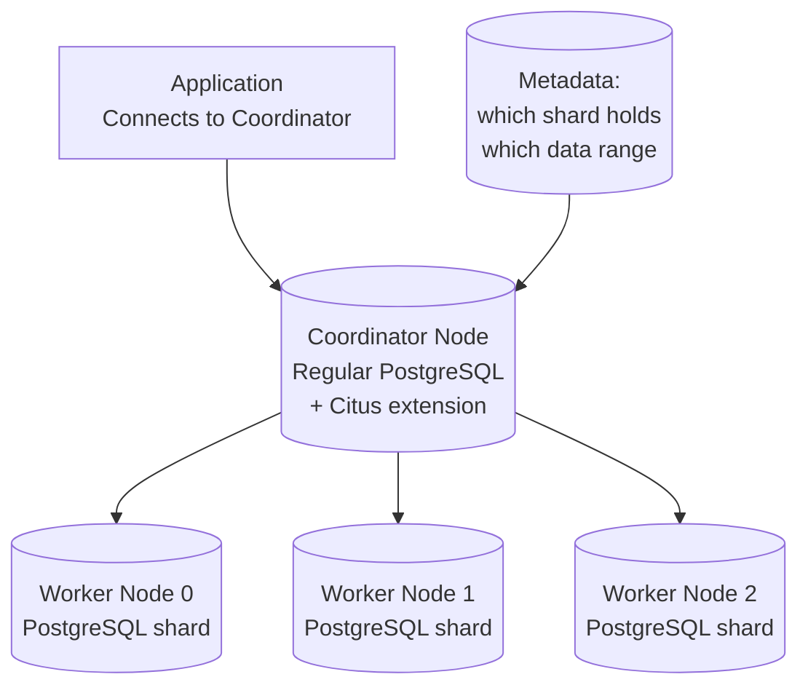

```sql
-- Normal PostgreSQL — just add one function call to shard it
CREATE TABLE orders (
    id         BIGSERIAL,
    user_id    BIGINT NOT NULL,
    amount     DECIMAL(10,2),
    created_at TIMESTAMPTZ DEFAULT NOW()
);

-- This one line distributes the table across all workers
SELECT create_distributed_table('orders', 'user_id');

-- Now query normally — Citus routes it automatically
SELECT SUM(amount) FROM orders WHERE user_id = 42;
-- ^ Hits only one worker shard

SELECT SUM(amount) FROM orders WHERE created_at > '2024-01-01';
-- ^ Scatter-gathers across all workers, parallel execution
```

| Feature | Vitess | Citus |
|---|---|---|
| Base database | MySQL | PostgreSQL |
| Shard transparency | Full (MySQL wire protocol) | Full (PG wire protocol) |
| Online resharding | Yes (built-in) | Yes (rebalancer) |
| Cross-shard JOINs | Partial | Yes (pushed down to workers) |
| Multi-tenant support | Yes | Yes (schema-based sharding) |
| Adoption | YouTube, Slack, GitHub | Postgres companies, SaaS |

---

## 🌍 Global Tables and Reference Tables

**Real-world analogy:** Every restaurant branch has its own kitchen (shards), but the main menu (reference data) is printed once and given to all branches. You do not shard the menu.

Some tables are small, read-heavy, and needed by all shards — like `countries`, `currencies`, `product_categories`. Sharding these creates cross-shard JOIN hell.

**Reference Tables** = replicated in full to EVERY shard.

```sql
-- In Citus: mark small, read-mostly tables as reference tables
CREATE TABLE countries (
    code CHAR(2) PRIMARY KEY,
    name VARCHAR(100)
);

SELECT create_reference_table('countries');
-- Citus copies this table to EVERY worker shard
-- Now JOIN with countries never crosses shard boundaries

SELECT o.id, c.name as country
FROM orders o                -- distributed table
JOIN countries c ON o.country_code = c.code   -- reference table, local on same shard
WHERE o.user_id = 42;
-- This JOIN is entirely local — no cross-shard communication needed!
```

**When to use reference tables:**
- Table has < 1 million rows
- Table is read far more than it is written
- Table is joined frequently with sharded tables
- Examples: `currencies`, `countries`, `product_categories`, `config`, `feature_flags`

---

## 🔢 Shard Enumeration

Shard enumeration means **having a fixed, known list of shards** that can be iterated for operations that must touch all shards.

```python
# Shard registry — maintained in config or service discovery
SHARD_REGISTRY = {
    0: {"host": "db-shard-0.internal", "port": 5432, "range": (0, 25_000_000)},
    1: {"host": "db-shard-1.internal", "port": 5432, "range": (25_000_001, 50_000_000)},
    2: {"host": "db-shard-2.internal", "port": 5432, "range": (50_000_001, 75_000_000)},
    3: {"host": "db-shard-3.internal", "port": 5432, "range": (75_000_001, float('inf'))},
}

def enumerate_all_shards():
    """Iterate all shards — used for cross-shard aggregations."""
    return [info for _, info in sorted(SHARD_REGISTRY.items())]

# Scatter-gather using shard enumeration
def global_count(table: str, condition: str) -> int:
    total = 0
    for shard in enumerate_all_shards():
        conn = connect(shard["host"], shard["port"])
        count = conn.execute(f"SELECT COUNT(*) FROM {table} WHERE {condition}").scalar()
        total += count
    return total

# Scheduled jobs must iterate all shards
def cleanup_expired_sessions():
    for shard in enumerate_all_shards():
        conn = connect(shard["host"], shard["port"])
        conn.execute("DELETE FROM sessions WHERE expires_at < NOW()")
```

**Shard enumeration is used for:**
- Background jobs that process all data (cleanup, migration, backfill)
- Global aggregations (total user count, total revenue)
- Schema migrations (run `ALTER TABLE` on each shard in sequence)
- Health checks and monitoring

---

## ✅ When to Use / When NOT to Use

### When to Use Sharding

| Situation | Reasoning |
|---|---|
| Dataset exceeds ~5 TB on a single server | Storage limit reached |
| Write QPS > 50,000 and growing | Single writer bottleneck |
| You have a natural, high-cardinality shard key | Easy partitioning |
| Queries consistently filter by the same column | Good shard key candidate |
| You need geographic data isolation (GDPR, latency) | Shard by region |
| Multi-tenant SaaS (each tenant = isolated shard) | Clean isolation |

### When NOT to Use Sharding

| Situation | Better Alternative |
|---|---|
| Data fits in < 1 TB | Vertical scaling + read replicas |
| Mostly read-heavy workload | Read replicas + caching (Redis) |
| Many cross-entity JOINs that cannot be eliminated | OLAP database (Snowflake, BigQuery) |
| You are a startup with < 1M users | Premature optimization — do not shard yet |
| Team lacks distributed systems expertise | Managed DB (Aurora, Cloud Spanner) |
| Ad-hoc analytics queries on all data | Separate analytics DB (ClickHouse) |

> **Rule of thumb:** Do not shard until you have exhausted — in order:
> 1. Query optimization and indexes
> 2. Connection pooling (PgBouncer, ProxySQL)
> 3. Read replicas
> 4. Caching layer (Redis, Memcached)
> 5. Vertical scaling (bigger machine)
> 6. **Then** consider sharding

---

## 📊 Strategy Comparison Table

| Strategy | Distribution | Range Queries | Rebalancing | Hot Spots | Complexity |
|---|---|---|---|---|---|
| Range-Based | Uneven (risk) | Excellent | Easy | High risk | Low |
| Hash-Based | Even | Poor | Very hard | Low | Low |
| Directory-Based | Flexible | Depends | Easy | Manageable | Medium |
| Consistent Hashing | Even | Poor | Easy | Low | Medium |

---

## 🧠 Key Takeaways

1. **Sharding = horizontal partitioning across multiple independent DB instances.** Each shard owns a subset of rows. Unlike replication, total data stored is ~1× (not N×).

2. **You probably do not need sharding yet.** Exhaust indexes, caching, read replicas, and vertical scaling first. Sharding adds enormous operational complexity.

3. **The shard key decision is irreversible (or extremely painful to reverse).** Choose a key with high cardinality, even distribution, and alignment with your most frequent queries.

4. **Hot shards are the silent killer.** Range-based sharding on auto-increment IDs or timestamps concentrates all new writes on one shard. Use hash-based or consistent hashing when write distribution matters.

5. **Consistent hashing solves the rebalancing problem.** When adding/removing shards, only ~1/N keys move instead of ~(N-1)/N.

6. **Cross-shard JOINs and transactions are painful.** Design your schema so that 90%+ of operations are single-shard. Use denormalization, co-location, and reference tables to avoid scatter-gather.

7. **Two-Phase Commit gives strong consistency but poor availability.** Sagas give high availability with eventual consistency. The best option is designing to avoid cross-shard transactions entirely.

8. **Resharding online requires dual-write + backfill + gradual cutover.** Plan for it from day one — leaving room in your shard key space helps (start with more logical shards than physical).

9. **Vitess (MySQL) and Citus (PostgreSQL) solve most problems for you.** They handle routing, resharding, connection pooling, and cross-shard queries at the infrastructure level so your application sees one database.

10. **Reference tables prevent cross-shard JOIN pain for small, static datasets.** Replicate lookup tables to every shard so JOINs are always local.

---

*Next Chapter → [02 - Distributed Transactions & Consensus (2PC, Paxos, Raft)](./02-distributed-transactions.md)*
