# Database Sharding — Deep Dive

> **Series:** Advanced DBMS Notes
> **Chapter:** 01 — Sharding
> **Level:** Intermediate to Advanced
> **Prerequisites:** Basic SQL, indexes, replication concepts

---

## 🗺️ Table of Contents

1. [What Is Sharding?](#-what-is-sharding)
2. [Why Do You Need Sharding?](#-why-do-you-need-sharding)
3. [Sharding Strategies](#-sharding-strategies)
   - Range-Based
   - Hash-Based
   - Directory-Based
   - Consistent Hashing
4. [Choosing the Shard Key](#-choosing-the-shard-key)
5. [Cross-Shard Queries](#-cross-shard-queries)
6. [Cross-Shard Transactions](#-cross-shard-transactions)
7. [Resharding](#-resharding)
8. [Production Tools — Vitess & Citus](#-production-tools--vitess--citus)
9. [Global Tables and Reference Tables](#-global-tables-and-reference-tables)
10. [Shard Enumeration](#-shard-enumeration)
11. [When to Use / When NOT to Use](#-when-to-use--when-not-to-use)
12. [Key Takeaways](#-key-takeaways)

---

## 🔍 What Is Sharding?

**Real-world analogy:** Socho ek city library hai jisme 1 crore books hain. Ek akela librarian sab kuch manage nahi kar sakta, ek room mein sab books fit nahi hoti, aur ek book dhoondhne mein hi ghanta lag jaata hai. Toh library kya karti hai? Books ko 10 branches mein baant deti hai — fiction Branch A mein, science Branch B mein, history Branch C mein. Har branch independent hai. Tumhe pata hai kis branch jaana hai, book turant mil jaati hai.

**Sharding bilkul yehi karta hai tumhare database ke saath.**

Sharding hai **horizontal partitioning** — matlab ek table ki rows ko multiple independent database **instances** (jinhe shards kehte hain) mein baant dena. Har shard data ka ek subset hold karta hai. Vertical partitioning (jisme columns baante jaate hain) se alag — sharding rows ko split karta hai.

```
Without Sharding:               With Sharding:

┌──────────────┐               ┌──────────┐ ┌──────────┐ ┌──────────┐
│  One Giant   │               │  Shard 0 │ │  Shard 1 │ │  Shard 2 │
│  Database    │  ─────────►   │ Users    │ │ Users    │ │ Users    │
│  100 million │               │ 1-33M    │ │ 33M-66M  │ │ 66M-100M │
│  users       │               └──────────┘ └──────────┘ └──────────┘
└──────────────┘               (different machines, different disks)
```

Har shard apne aap mein ek complete, standalone database hai — apna CPU, apna RAM, apna disk, apne connections. Woh storage share nahi karte.

### Sharding vs. Replication — Asli Farak Kya Hai?

**Kya hota hai?** Log aksar sharding aur replication mein confuse ho jaate hain. Dono scaling ke liye use hote hain, lekin bilkul different problems solve karte hain.

| Feature | Replication | Sharding |
|---|---|---|
| Purpose | Fault tolerance, read scaling | Write scaling, storage scaling |
| Data | Har node pe full copy | Har node pe subset |
| Total data stored | N × original | ~1× original (split) |
| Handles | High read QPS | High write QPS, huge data volume |
| Complexity | Low-Medium | High |

> **In practice:** Production systems dono use karte hain — har shard ko fault tolerance ke liye replicate bhi kiya jaata hai.

---

## 🚨 Why Do You Need Sharding?

**Real-world analogy:** Ek restaurant jaha ek chef 50 logo ko serve kar sakta hai. Jab 500 log aa jaayein, toh bada oven laga dena (vertical scaling) kaam aata hai — but sirf ek limit tak. Eventually tumhe naye restaurant locations kholne padte hain (horizontal scaling = sharding).

Ek single database server ki bhi physical limits hoti hain:

| Limit | Typical ceiling |
|---|---|
| Disk storage | 64 TB (practical) |
| Write throughput | ~10,000–50,000 writes/sec |
| Connections | ~5,000–10,000 concurrent |
| RAM for working set | 1–4 TB |

Jab tumhara dataset 100 TB ho jaaye, ya tumhe 1 million queries per second (QPS) milne lagein, **koi bhi single machine yeh handle nahi kar sakti**. Tab sharding karni padti hai.

### Big Systems Ke Real Numbers

- **Facebook (2008):** MySQL ko hazaaron shards mein baanta, 10 crore+ users serve karne ke liye
- **YouTube:** Vitess banaya taaki MySQL ko planet scale pe shard kar sakein
- **Pinterest:** 2012 mein 10TB data pe pahuchte hi sharded MySQL pe shift ho gaye
- **Discord:** Arabon messages handle karne ke liye PostgreSQL ko shard kiya

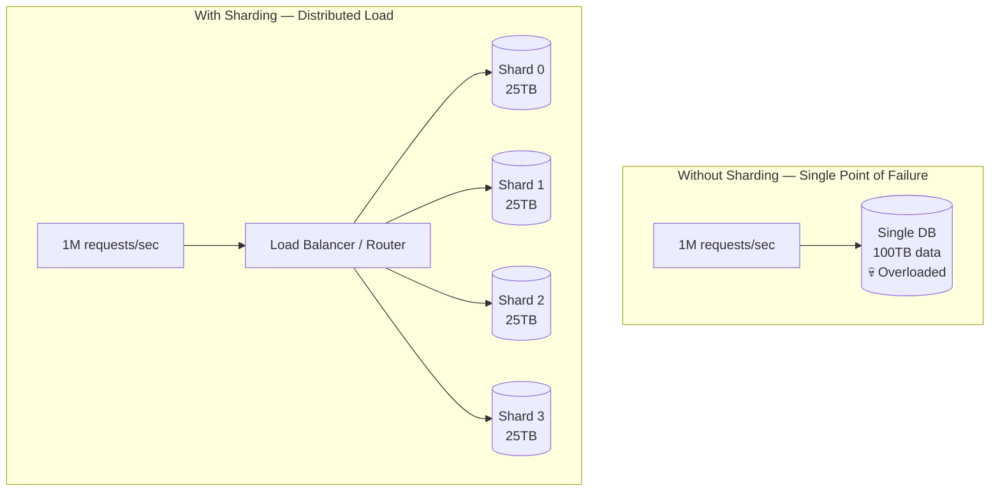

---

## 🗂️ Sharding Strategies

### 1. Range-Based Sharding

**Real-world analogy:** Ek encyclopedia socho — Volume A-F shelf 1 pe, G-M shelf 2 pe, N-Z shelf 3 pe. Books ko unke starting letter ke range se split kiya gaya hai.

Tum ek column pick karte ho (jaise `user_id` ya `created_at`) aur shards ko ranges assign kar dete ho.

```
user_id 1       – 10,000,000  → Shard 0
user_id 10,000,001 – 20,000,000  → Shard 1
user_id 20,000,001 – 30,000,000  → Shard 2
```

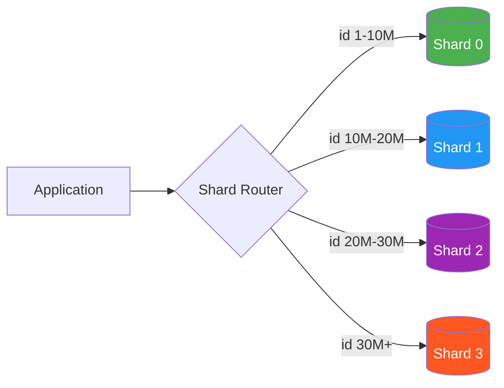

**Implementation example (Python pseudocode):**

```python
SHARD_RANGES = [
    (1,        10_000_000, "shard_0_host"),
    (10_000_001, 20_000_000, "shard_1_host"),
    (20_000_001, 30_000_000, "shard_2_host"),
    (30_000_001, float('inf'), "shard_3_host"),
]

def get_shard(user_id: int) -> str:
    for low, high, host in SHARD_RANGES:
        if low <= user_id <= high:
            return host
    raise ValueError(f"No shard found for user_id={user_id}")

# Usage
host = get_shard(15_000_000)  # → "shard_1_host"
```

**Pros:**
- Range queries fast hoti hain — `id 1–1000` ka saara data ek hi shard mein rehta hai, scatter-gather ki zaroorat nahi
- Samajhna aur debug karna easy hai
- Time-series data (logs, events by date) ke liye badhiya

**Cons:**
- **Hot spot problem** — naye users hamesha last shard mein jaate hain. Shard 3 hamesha overload, Shard 0 khali baitha rehta hai
- Agar data uniformly distributed nahi hai, toh distribution uneven ho jaata hai
- Naya shard add karne ke liye config changes karne padte hain

---

### 2. Hash-Based Sharding

**Real-world analogy:** Ek post office letters ko zip code ke last digit se sort karta hai. Zip 0 pe end hoti hai → counter 0, 1 pe end hoti hai → counter 1. Har counter ko roughly equal traffic milta hai.

Tum shard key ko hash karte ho aur modulo lete ho:

```
shard_number = hash(user_id) % number_of_shards
```

```mermaid
graph LR
    App[Application] --> Router{Hash Router\nhash&#40;id&#41; % 4}
    Router -->|hash % 4 = 0| S0[(Shard 0)]
    Router -->|hash % 4 = 1| S1[(Shard 1)]
    Router -->|hash % 4 = 2| S2[(Shard 2)]
    Router -->|hash % 4 = 3| S3[(Shard 3)]
```

**Implementation example:**

```python
import hashlib

NUM_SHARDS = 4
SHARD_HOSTS = {
    0: "shard_0_host",
    1: "shard_1_host",
    2: "shard_2_host",
    3: "shard_3_host",
}

def get_shard(user_id: int) -> str:
    # Use consistent hash function (not Python's built-in hash — it's non-deterministic)
    hash_val = int(hashlib.md5(str(user_id).encode()).hexdigest(), 16)
    shard_num = hash_val % NUM_SHARDS
    return SHARD_HOSTS[shard_num]

# Usage
host = get_shard(42)  # Deterministic — always same shard for same id
```

**Pros:**
- Even data distribution — koi hot spots nahi
- Implement karna simple hai
- Deterministic routing — koi lookup ki zaroorat nahi

**Cons:**
- **Rebalancing pain** — agar `N` change karo (shard add/remove karo), toh almost saara data move karna padta hai. 4 shards se 5 shards karne pe, ~80% data galat shard pe pahuch jaata hai
- Range queries bekaar hain — `user_id BETWEEN 1 AND 1000` sab shards ko hit karta hai
- Shards ki fixed number pehle se plan karni padti hai

---

### 3. Directory-Based Sharding

**Real-world analogy:** Ek hotel ka concierge ek notebook maintain karta hai: "Room 101 → Building A, Room 200 → Building B." Har naye guest ko concierge room assign karta hai aur notebook update karta rehta hai.

Ek separate **lookup service** (directory) har key ko ek shard se map karti hai. Router directory se poochta hai: "user_id 42 kaha rehta hai?" — aur directory jawab deti hai.

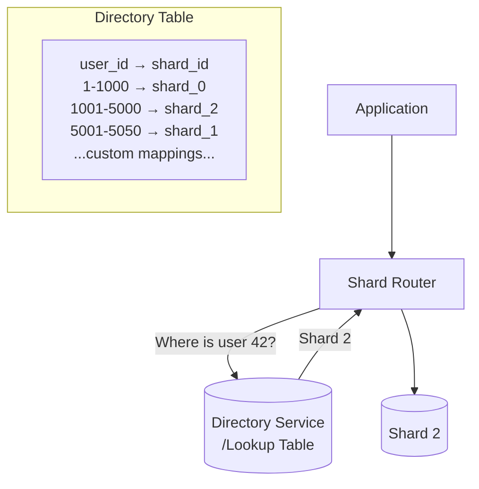

**Implementation example:**

```python
# Directory stored in Redis or a small metadata DB
import redis

class DirectoryShardRouter:
    def __init__(self):
        self.dir = redis.Redis(host="directory-host")
        self.shard_hosts = {
            "shard_0": "db-host-0",
            "shard_1": "db-host-1",
            "shard_2": "db-host-2",
        }

    def get_shard(self, user_id: int) -> str:
        shard_id = self.dir.get(f"user:{user_id}")
        if shard_id:
            return self.shard_hosts[shard_id.decode()]
        # Assign new user to least-loaded shard
        shard_id = self._assign_shard(user_id)
        return self.shard_hosts[shard_id]

    def _assign_shard(self, user_id: int) -> str:
        shard_id = "shard_0"  # simplified: pick least-loaded
        self.dir.set(f"user:{user_id}", shard_id)
        return shard_id
```

**Pros:**
- Maximum flexibility — kabhi bhi individual keys ko ek shard se doosre shard mein move kar sakte ho
- Rebalancing ka koi jhanjhat nahi — bas directory update karo
- Uneven data ko naturally handle kar leta hai

**Cons:**
- **Single point of failure** — agar directory down ho gayi, toh kuch bhi kaam nahi karega
- Har query ke liye extra network hop (latency badhti hai)
- Directory scale pe bottleneck ban sakti hai (isliye ise aggressively cache karo)

---

### 4. Consistent Hashing

**Real-world analogy:** Ek clock face socho (0 se 360 degrees tak). Har database server clock pe ek position pe rakha hai. Har data key bhi hash ho ke clock pe ek position pe aati hai. Data us position se clockwise pehle jo bhi server milta hai, usme jaata hai. Jab tum naya server add karte ho, sirf naye server aur uske predecessor ke beech ka data move hota hai — baaki sab jaisa tha waisa hi rehta hai.

Yeh simple hash-based sharding ki rebalancing problem ko elegantly solve karta hai.

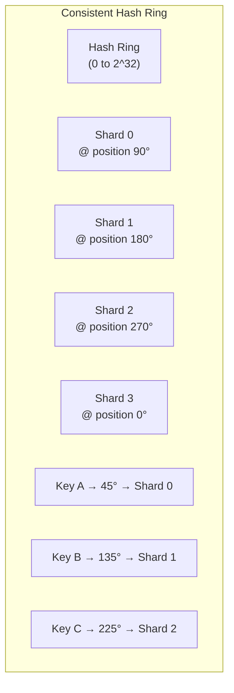

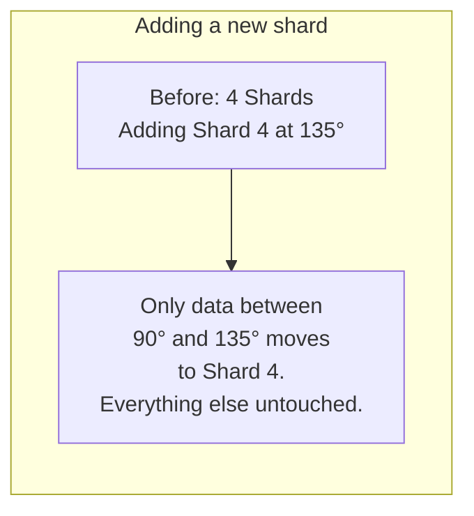

**Implementation example (simplified):**

```python
import hashlib
import bisect

class ConsistentHashRing:
    def __init__(self, replicas=150):
        # replicas = virtual nodes per shard (for even distribution)
        self.replicas = replicas
        self.ring = {}       # position -> shard_host
        self.sorted_keys = []  # sorted positions

    def _hash(self, key: str) -> int:
        return int(hashlib.md5(key.encode()).hexdigest(), 16)

    def add_shard(self, shard_host: str):
        for i in range(self.replicas):
            virtual_node_key = f"{shard_host}:vnode:{i}"
            position = self._hash(virtual_node_key)
            self.ring[position] = shard_host
            bisect.insort(self.sorted_keys, position)

    def remove_shard(self, shard_host: str):
        for i in range(self.replicas):
            virtual_node_key = f"{shard_host}:vnode:{i}"
            position = self._hash(virtual_node_key)
            del self.ring[position]
            self.sorted_keys.remove(position)

    def get_shard(self, key: str) -> str:
        if not self.ring:
            raise Exception("No shards available")
        position = self._hash(key)
        # Find first shard clockwise from this position
        idx = bisect.bisect(self.sorted_keys, position)
        if idx == len(self.sorted_keys):
            idx = 0  # wrap around
        return self.ring[self.sorted_keys[idx]]

# Usage
ring = ConsistentHashRing(replicas=150)
ring.add_shard("db-host-0")
ring.add_shard("db-host-1")
ring.add_shard("db-host-2")

shard = ring.get_shard("user:42")   # → consistent answer
shard = ring.get_shard("user:9999") # → consistent answer

# Add a new shard — only ~25% of data moves (with 4 shards → 5)
ring.add_shard("db-host-3")
```

**Virtual nodes kyun zaruri hain?** Inke bina, servers ring pe unevenly land ho sakte hain. 150 virtual nodes per shard ke saath, har shard ko roughly equal load milta hai — chahe physical nodes kahin bhi land hon.

| Property | Simple Hash | Consistent Hash |
|---|---|---|
| Adding 1 shard (N→N+1) | ~(N-1)/N keys move | ~1/N keys move |
| Removing 1 shard | ~(N-1)/N keys move | ~1/N keys move |
| Even distribution | Good | Good (with virtual nodes) |
| Implementation complexity | Low | Medium |
| Range queries | Poor | Poor |

---

## 🔑 Choosing the Shard Key

**Yeh sharding ka sabse important decision hai. Isme galti ki, toh uska result poori zindagi bhugatna padega.**

**Real-world analogy:** Ek filing cabinet jo surname ke first letter se shard kiya gaya hai. Agar tumhare 30% customers ka naam Smith, Shah, ya Singh hai — toh "S" drawer overflow ho jaata hai jabki "Q" almost khaali rehta hai. Ek bad shard key hot shards create karti hai.

### Ek Achhi Shard Key Ke Rules

**1. High Cardinality** — itni distinct values honi chahiye ki data shards mein achhe se spread ho sake.
- BAD: `country` (sirf 195 countries, US ka hi 40% traffic hai)
- GOOD: `user_id` (millions distinct values)

**2. Even Distribution** — kisi bhi ek shard ko sabse zyada data ya traffic nahi milna chahiye.
- BAD: `created_at` ek social network ke liye (aaj ki date pe saare writes chale jaate hain)
- GOOD: `user_id` ka hash writes ko evenly distribute karta hai

**3. Query Alignment** — tumhari zyadatar queries shard key se filter honi chahiye, taaki cross-shard queries avoid ho sakein.
- Agar 90% queries `WHERE user_id = X` hain, toh `user_id` se shard karo
- Agar 90% queries `WHERE tenant_id = X` hain, toh `tenant_id` se shard karo

**4. Co-locate Related Data** — jo data tum JOIN karte ho, wo ek hi shard mein rehna chahiye.
- Users aur unke orders dono ko `user_id` se shard karo → `SELECT * FROM orders WHERE user_id = 42` sirf ek shard hit karta hai
- Agar users `user_id` se shard hain lekin orders `order_id` se, toh har user ke orders scattered ho jaayenge

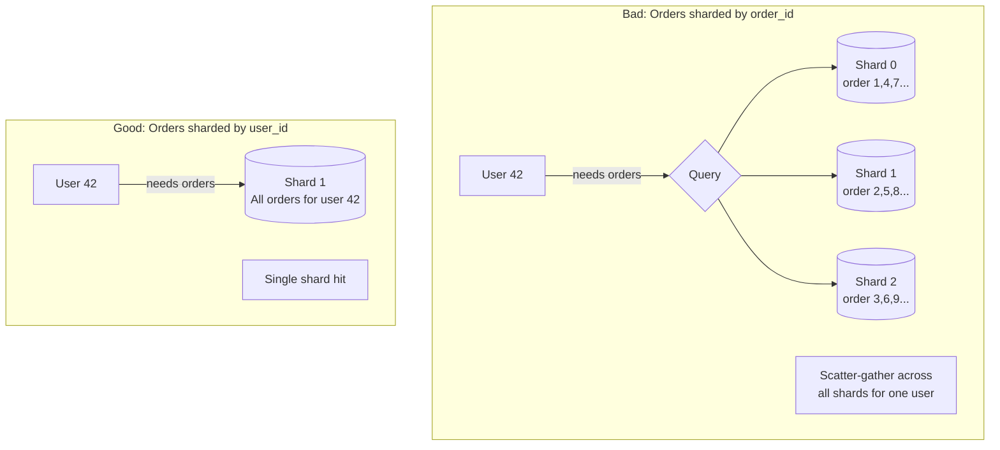

### Shard Key Anti-Patterns

```
❌ Auto-increment integer as shard key with range sharding
   → Saare naye writes last shard mein jaate hain (hot shard)

❌ Timestamp as shard key  
   → "Aaj" wala shard aag mein jal raha hai; purane shards thande baithe hain

❌ Low-cardinality column (status, country, gender)
   → Bahut kam shards possible; hot spots guaranteed

❌ Shard key jo change ho jaaye
   → User apna username change kare → dusre shard mein move karna pade → complex migration

✅ UUID ya hashed user_id
✅ Composite key: (tenant_id, entity_id)
✅ Woh column jise tum hamesha filter karte ho aur jiski cardinality high hai
```

---

## 🔗 Cross-Shard Queries

**Real-world analogy:** Tum ek company mein kaam karte ho jaha personnel files 10 offices mein last name ke hisaab se baati hui hain. Boss poochta hai: "2020 ke baad join karne wale sab employees ki list salary ke hisaab se sorted chahiye." Tumhe 10 offices ko call karna padega, unki lists lena padega, combine karna padega, phir sort karna padega. Yehi hai cross-shard scatter-gather.

Cross-shard queries sharding ka **sabse bada operational dard** hain.

### Problem: Shards Ke Across JOINs

```sql
-- Simple query — shard key present — hits ONE shard ✅
SELECT * FROM orders WHERE user_id = 42;

-- Cross-shard query — no shard key — hits ALL shards ❌
SELECT * FROM orders WHERE amount > 1000 ORDER BY created_at;

-- Cross-shard JOIN — users on user_id shard, products on product_id shard ❌
SELECT u.name, p.title
FROM users u
JOIN orders o ON u.id = o.user_id
JOIN products p ON o.product_id = p.id
WHERE u.country = 'IN';
```

### Applications Cross-Shard Queries Kaise Handle Karte Hain

**Pattern 1: Scatter-Gather**

Router same query ko saare shards mein parallel bhej deta hai, results collect karta hai, aur application memory mein merge/sort karta hai.

```python
import asyncio
import aiohttp

async def scatter_gather_query(sql: str, shards: list[str]) -> list[dict]:
    """Send the same query to all shards, merge results."""
    async def query_shard(shard_host: str) -> list[dict]:
        # Connect to shard, run query, return rows
        async with aiohttp.ClientSession() as session:
            async with session.post(f"http://{shard_host}/query",
                                    json={"sql": sql}) as r:
                return await r.json()

    # Run on all shards in parallel
    results = await asyncio.gather(*[query_shard(s) for s in shards])

    # Merge and sort (application-level aggregation)
    all_rows = [row for shard_rows in results for row in shard_rows]
    all_rows.sort(key=lambda r: r["created_at"], reverse=True)
    return all_rows

# Usage
rows = await scatter_gather_query(
    "SELECT * FROM orders WHERE amount > 1000",
    shards=["db-0", "db-1", "db-2", "db-3"]
)
```

**Pattern 2: Denormalization — JOIN Ko Avoid Karo**

Cross-shard JOIN karne ke bajaye, jo data chahiye usse saath mein hi store kar do.

```sql
-- Instead of:
-- orders JOIN products → cross-shard

-- Denormalize: store product name IN the orders table
CREATE TABLE orders (
    id         BIGINT PRIMARY KEY,
    user_id    BIGINT,           -- shard key
    product_id BIGINT,
    product_name VARCHAR(255),   -- denormalized copy
    product_sku  VARCHAR(50),    -- denormalized copy
    amount     DECIMAL(10,2),
    created_at TIMESTAMP
);
-- Now one shard has everything you need for an order
```

**Pattern 3: Global Aggregation Table**

Analytics ke liye, aggregated data ko ek separate non-sharded reporting database mein likho.

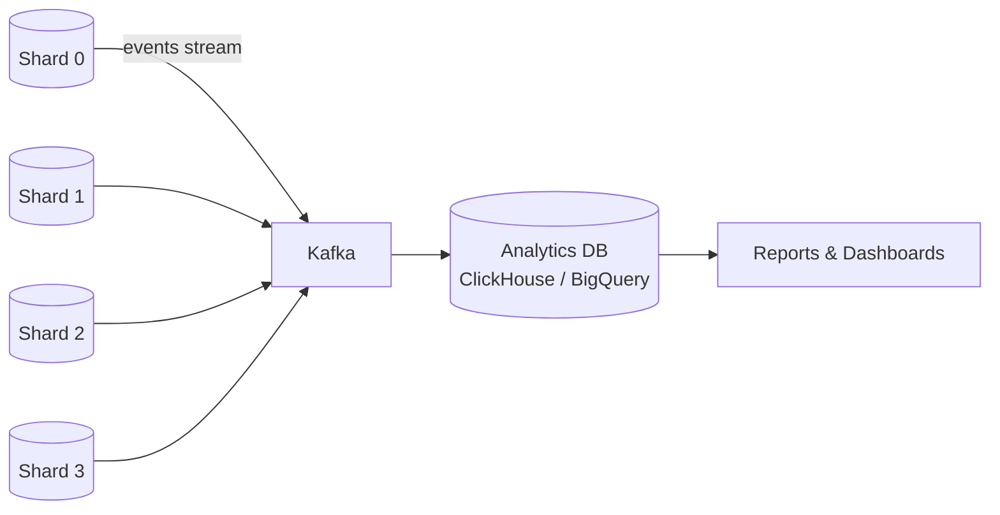

---

## 🔄 Cross-Shard Transactions

**Real-world analogy:** Do banks ke beech paise transfer karna — Bank A ko debit karna hai, Bank B ko credit. Agar Bank A debit kar de lekin Bank B credit karne se pehle network down ho jaaye, toh paise gayab ho jaate hain. Dono steps ya toh success hone chahiye, ya dono fail.

Cross-shard transactions ko distributed coordination chahiye hoti hai. Do main approaches hain:

### Two-Phase Commit (2PC)

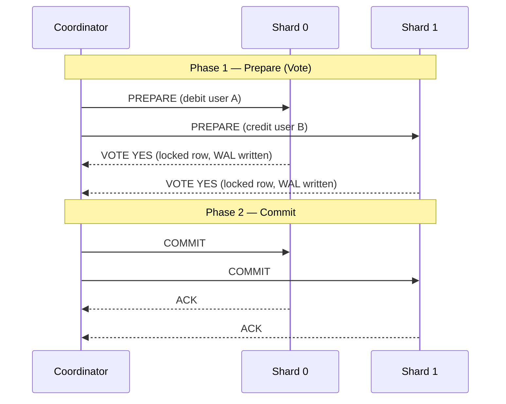

**2PC ke problems:**
- Agar coordinator PREPARE ke baad, COMMIT se pehle crash ho jaaye → shards hamesha ke liye lock ho jaate hain (blocking protocol)
- High latency — minimum 2 round trips lagti hain
- High-throughput systems ke liye suitable nahi

### Saga Pattern

Transaction ko chhoti-chhoti local transactions ki sequence mein todo. Har step ek event publish karta hai. Agar koi step fail ho jaaye, toh compensating transactions pichhle steps ko undo kar dete hain.

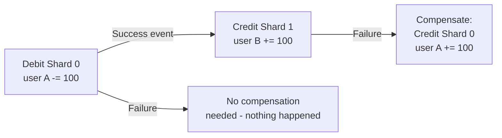

```python
# Saga choreography example
class TransferSaga:
    def execute(self, from_user: int, to_user: int, amount: float):
        # Step 1: Debit source (Shard 0)
        shard0 = get_shard(from_user)
        success = shard0.execute(
            "UPDATE accounts SET balance = balance - %s WHERE user_id = %s AND balance >= %s",
            (amount, from_user, amount)
        )
        if not success:
            raise InsufficientFundsError()

        # Step 2: Credit destination (Shard 1)
        shard1 = get_shard(to_user)
        try:
            shard1.execute(
                "UPDATE accounts SET balance = balance + %s WHERE user_id = %s",
                (amount, to_user)
            )
        except Exception:
            # Compensate: refund the source
            shard0.execute(
                "UPDATE accounts SET balance = balance + %s WHERE user_id = %s",
                (amount, from_user)
            )
            raise
```

| Approach | Consistency | Availability | Latency | Complexity |
|---|---|---|---|---|
| 2PC | Strong (ACID) | Low (blocking) | High | Medium |
| Saga | Eventual | High | Low | High |
| Avoid cross-shard txns | N/A | N/A | N/A | Best design choice |

> **Best practice:** Apni shard key aise design karo ki transactions ek hi shard ke andar ho jaayein. Cross-shard transactions ek emergency measure honi chahiye, design goal nahi.

---

## 📈 Resharding

**Real-world analogy:** Tumhara startup 4 pizza shops se shuru hota hai. Paanch saal baad demand triple ho jaati hai. Tumhe 8 shops kholni padti hain aur deliveries redistribute karni padti hain taaki koi bhi shop overwhelm na ho. Poori operation ko chalu rakhte hue — bina band kiye — move karna hi asli challenge hai.

**Resharding** matlab — ek shard jo bahut bada ho gaya hai, usse do (ya zyada) chhote shards mein split karna. Yeh live, bina downtime ke kiya jaaye, toh isse **online resharding** kehte hain.

### Dual-Write Approach (Online Resharding)

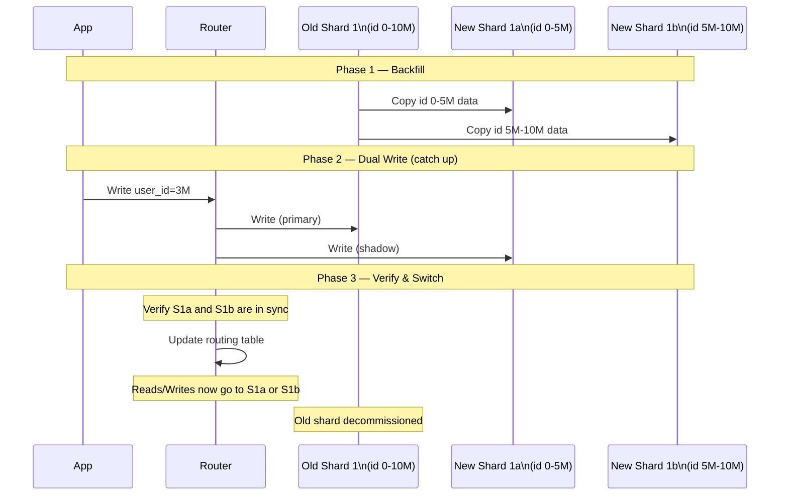

**Step-by-step process:**

```
1. Backfill shuru karo: Shard 1 se new Shard 1a (id 0-5M) aur Shard 1b (id 5M-10M) mein data copy karo
2. Dual-write enable karo: Naye writes OLD aur NEW dono shards mein jaayein
3. Replication lag monitor karo: Wait karo jab tak naye shards catch up na ho jaayein
4. Checksums verify karo: Naye shards mein bhi wohi data hai jo old shard mein tha
5. Reads switch karo: Reads ko naye shards pe route karo (gradually kar sakte ho, jaise 1% → 10% → 100%)
6. Writes switch karo: Saare writes naye shards pe route karo
7. Old shard decommission karo
```

---

## 🛠️ Production Tools — Vitess & Citus

### Vitess (MySQL Sharding — YouTube Ka Solution)

YouTube ne 2010 mein Vitess banaya kyunki unhe MySQL ko shard karna tha bina poori application rewrite kiye. Vitess tumhari app aur MySQL ke beech baith jaata hai, aur poore sharded cluster ko ek single MySQL server jaisa dikhata hai.

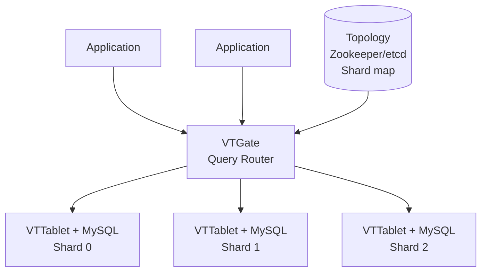

**Vitess ke key features:**
- **VTGate:** Smart proxy — SQL parse karta hai, sahi shard pe route karta hai, zaroorat pe scatter-gather karta hai
- **VSchema:** Tum define karte ho ki kaunsa column shard key hai; routing Vitess sambhal leta hai
- **Online schema changes:** Saare shards pe `ALTER TABLE` bina locking ke chala do
- **Connection pooling:** Hazaaron app connections → per shard sirf dus-bees MySQL connections
- **Built-in resharding:** `MoveTables` aur `Reshard` commands online resharding sambhal lete hain

```yaml
# VSchema — tell Vitess how to shard the 'orders' table
{
  "sharded": true,
  "vindexes": {
    "hash": {
      "type": "hash"
    }
  },
  "tables": {
    "orders": {
      "column_vindexes": [
        {
          "column": "user_id",
          "name": "hash"
        }
      ]
    }
  }
}
```

### Citus (PostgreSQL Sharding)

Citus ek PostgreSQL extension hai jo ek single Postgres node ko distributed database mein badal deta hai. Yeh normal Postgres jaisa hi feel hota hai — tum standard SQL hi likhte ho.

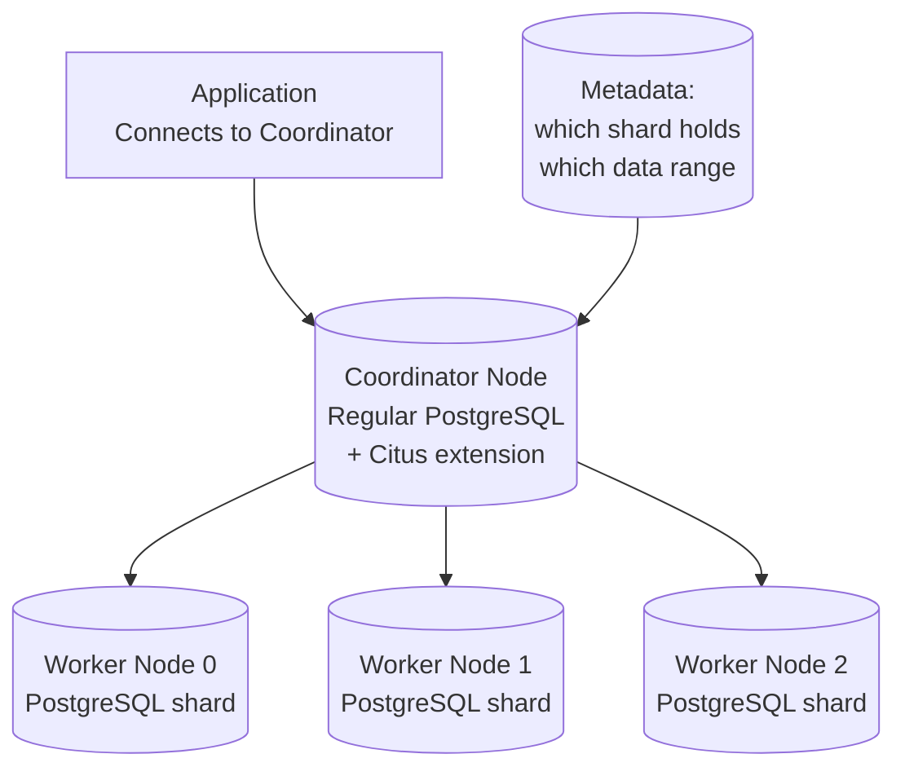

```sql
-- Normal PostgreSQL — just add one function call to shard it
CREATE TABLE orders (
    id         BIGSERIAL,
    user_id    BIGINT NOT NULL,
    amount     DECIMAL(10,2),
    created_at TIMESTAMPTZ DEFAULT NOW()
);

-- This one line distributes the table across all workers
SELECT create_distributed_table('orders', 'user_id');

-- Now query normally — Citus routes it automatically
SELECT SUM(amount) FROM orders WHERE user_id = 42;
-- ^ Hits only one worker shard

SELECT SUM(amount) FROM orders WHERE created_at > '2024-01-01';
-- ^ Scatter-gathers across all workers, parallel execution
```

| Feature | Vitess | Citus |
|---|---|---|
| Base database | MySQL | PostgreSQL |
| Shard transparency | Full (MySQL wire protocol) | Full (PG wire protocol) |
| Online resharding | Yes (built-in) | Yes (rebalancer) |
| Cross-shard JOINs | Partial | Yes (pushed down to workers) |
| Multi-tenant support | Yes | Yes (schema-based sharding) |
| Adoption | YouTube, Slack, GitHub | Postgres companies, SaaS |

---

## 🌍 Global Tables and Reference Tables

**Real-world analogy:** Har restaurant branch ki apni kitchen hoti hai (shards), lekin main menu (reference data) ek hi baar print hota hai aur sab branches ko diya jaata hai. Tum menu ko shard nahi karte.

Kuch tables chhoti hoti hain, read-heavy hoti hain, aur saare shards ko chahiye hoti hain — jaise `countries`, `currencies`, `product_categories`. Inhe shard karna cross-shard JOIN ka narak bana deta hai.

**Reference Tables** — inhe HAR shard mein pura replicate kar diya jaata hai.

```sql
-- In Citus: mark small, read-mostly tables as reference tables
CREATE TABLE countries (
    code CHAR(2) PRIMARY KEY,
    name VARCHAR(100)
);

SELECT create_reference_table('countries');
-- Citus copies this table to EVERY worker shard
-- Now JOIN with countries never crosses shard boundaries

SELECT o.id, c.name as country
FROM orders o                -- distributed table
JOIN countries c ON o.country_code = c.code   -- reference table, local on same shard
WHERE o.user_id = 42;
-- This JOIN is entirely local — no cross-shard communication needed!
```

**Reference tables kab use karein:**
- Table mein < 10 lakh rows hon
- Table likhne se zyada padhi jaati ho
- Table ka JOIN sharded tables ke saath frequently hota ho
- Examples: `currencies`, `countries`, `product_categories`, `config`, `feature_flags`

---

## 🔢 Shard Enumeration

Shard enumeration matlab — shards ki ek **fixed, known list** rakhna, jise un operations ke liye iterate kiya ja sake jinhe saare shards touch karne padte hain.

```python
# Shard registry — maintained in config or service discovery
SHARD_REGISTRY = {
    0: {"host": "db-shard-0.internal", "port": 5432, "range": (0, 25_000_000)},
    1: {"host": "db-shard-1.internal", "port": 5432, "range": (25_000_001, 50_000_000)},
    2: {"host": "db-shard-2.internal", "port": 5432, "range": (50_000_001, 75_000_000)},
    3: {"host": "db-shard-3.internal", "port": 5432, "range": (75_000_001, float('inf'))},
}

def enumerate_all_shards():
    """Iterate all shards — used for cross-shard aggregations."""
    return [info for _, info in sorted(SHARD_REGISTRY.items())]

# Scatter-gather using shard enumeration
def global_count(table: str, condition: str) -> int:
    total = 0
    for shard in enumerate_all_shards():
        conn = connect(shard["host"], shard["port"])
        count = conn.execute(f"SELECT COUNT(*) FROM {table} WHERE {condition}").scalar()
        total += count
    return total

# Scheduled jobs must iterate all shards
def cleanup_expired_sessions():
    for shard in enumerate_all_shards():
        conn = connect(shard["host"], shard["port"])
        conn.execute("DELETE FROM sessions WHERE expires_at < NOW()")
```

**Shard enumeration kaha use hoti hai:**
- Background jobs jo saara data process karte hain (cleanup, migration, backfill)
- Global aggregations (total user count, total revenue)
- Schema migrations (har shard pe sequence mein `ALTER TABLE` chalana)
- Health checks aur monitoring

---

## ✅ When to Use / When NOT to Use

### Sharding Kab Use Karein

| Situation | Reasoning |
|---|---|
| Dataset ek single server pe ~5 TB se zyada ho gaya | Storage limit reach ho gayi |
| Write QPS > 50,000 aur badhta ja raha hai | Single writer bottleneck |
| Tumhare paas natural, high-cardinality shard key hai | Partitioning easy ho jaati hai |
| Queries consistently same column se filter hoti hain | Achhi shard key candidate |
| Geographic data isolation chahiye (GDPR, latency) | Region se shard karo |
| Multi-tenant SaaS (har tenant = isolated shard) | Clean isolation |

### Sharding Kab NAHI Use Karein

| Situation | Better Alternative |
|---|---|
| Data < 1 TB mein fit ho jaata hai | Vertical scaling + read replicas |
| Zyadatar read-heavy workload | Read replicas + caching (Redis) |
| Bahut saare cross-entity JOINs jo eliminate nahi ho sakte | OLAP database (Snowflake, BigQuery) |
| Tum ek startup ho with < 10 lakh users | Premature optimization — abhi mat shard karo |
| Team ke paas distributed systems expertise nahi hai | Managed DB (Aurora, Cloud Spanner) |
| Ad-hoc analytics queries saare data pe | Separate analytics DB (ClickHouse) |

> **Rule of thumb:** Sharding tab tak mat karo jab tak yeh sab order mein khatam na kar liye ho:
> 1. Query optimization aur indexes
> 2. Connection pooling (PgBouncer, ProxySQL)
> 3. Read replicas
> 4. Caching layer (Redis, Memcached)
> 5. Vertical scaling (bada machine)
> 6. **Tab jaake** sharding consider karo

---

## 📊 Strategy Comparison Table

| Strategy | Distribution | Range Queries | Rebalancing | Hot Spots | Complexity |
|---|---|---|---|---|---|
| Range-Based | Uneven (risk) | Excellent | Easy | High risk | Low |
| Hash-Based | Even | Poor | Very hard | Low | Low |
| Directory-Based | Flexible | Depends | Easy | Manageable | Medium |
| Consistent Hashing | Even | Poor | Easy | Low | Medium |

---

## 🧠 Key Takeaways

1. **Sharding = horizontal partitioning across multiple independent DB instances.** Har shard rows ka ek subset own karta hai. Replication ke ulat, total data stored ~1× hota hai (N× nahi).

2. **Tumhe shayad abhi sharding ki zaroorat nahi hai.** Pehle indexes, caching, read replicas, aur vertical scaling exhaust karo. Sharding operational complexity bahut badha deta hai.

3. **Shard key ka decision irreversible hai (ya reverse karna extremely painful hai).** High cardinality, even distribution, aur apni most frequent queries se alignment wali key choose karo.

4. **Hot shards silent killer hain.** Auto-increment IDs ya timestamps pe range-based sharding saare naye writes ek shard pe concentrate kar deta hai. Jab write distribution matter karta hai, tab hash-based ya consistent hashing use karo.

5. **Consistent hashing rebalancing problem solve karta hai.** Shards add/remove karne pe, ~(N-1)/N ke bajaye sirf ~1/N keys move hoti hain.

6. **Cross-shard JOINs aur transactions painful hote hain.** Apna schema aise design karo ki 90%+ operations single-shard hon. Scatter-gather avoid karne ke liye denormalization, co-location, aur reference tables use karo.

7. **Two-Phase Commit strong consistency deta hai lekin poor availability.** Sagas high availability dete hain eventual consistency ke saath. Best option hai cross-shard transactions ko design se hi avoid karna.

8. **Online resharding ke liye dual-write + backfill + gradual cutover chahiye.** Day one se hi iske liye plan karo — shard key space mein zyada room rakhna madad karta hai (physical shards se zyada logical shards se shuru karo).

9. **Vitess (MySQL) aur Citus (PostgreSQL) zyadatar problems tumhare liye solve kar dete hain.** Routing, resharding, connection pooling, aur cross-shard queries infrastructure level pe handle kar dete hain, taaki tumhari application ko sirf ek database dikhe.

10. **Reference tables chhote, static datasets ke liye cross-shard JOIN ka dard bachate hain.** Lookup tables ko har shard mein replicate karo taaki JOINs hamesha local rahein.

---

*Next Chapter → [02 - Distributed Transactions & Consensus (2PC, Paxos, Raft)](./02-distributed-transactions.md)*
