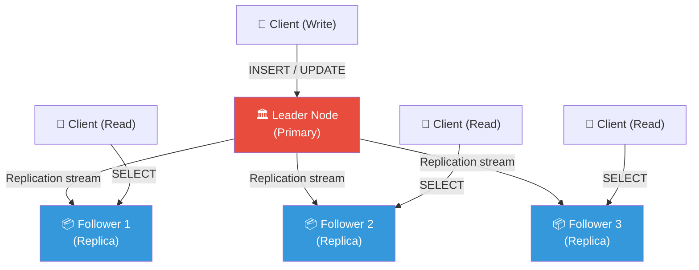
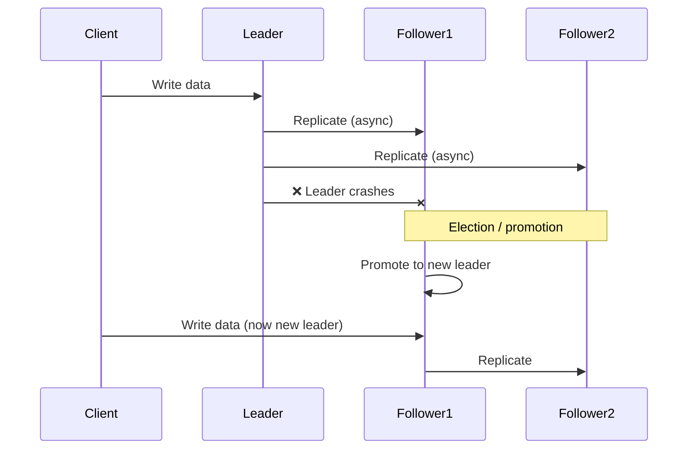
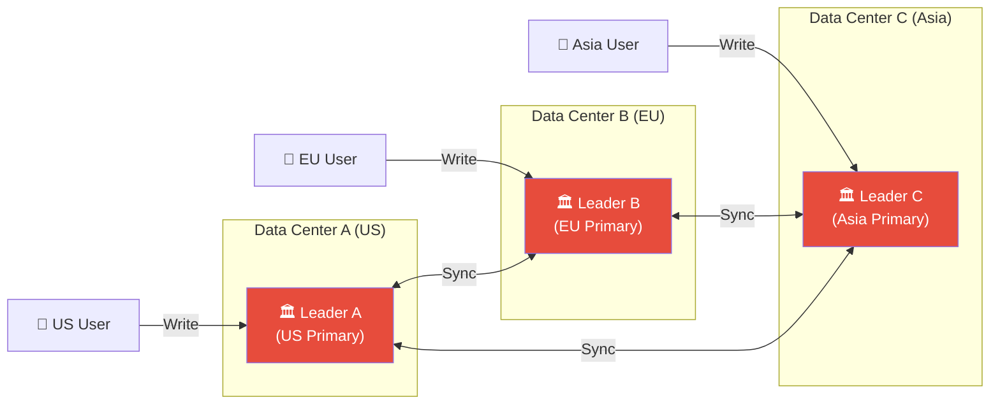
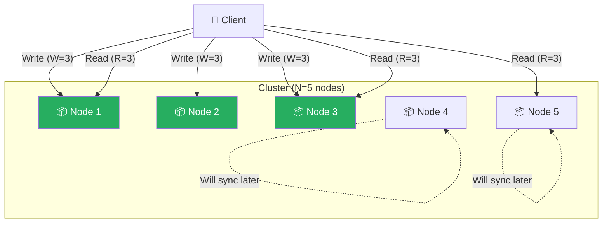
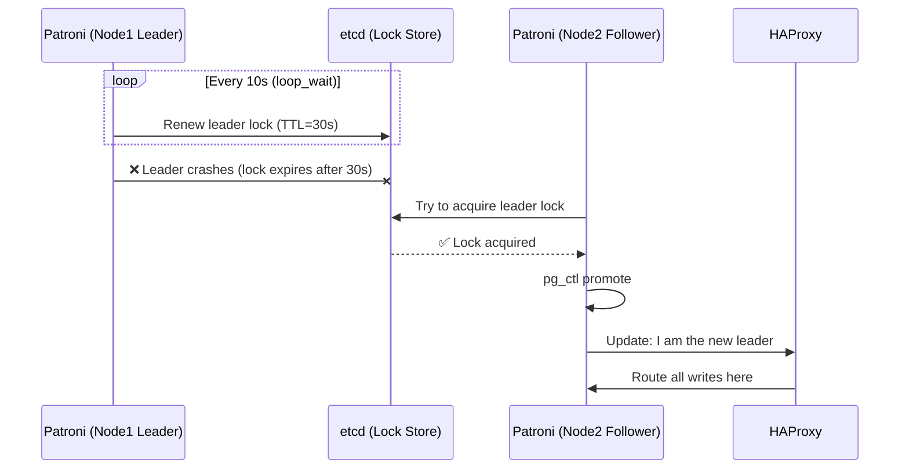
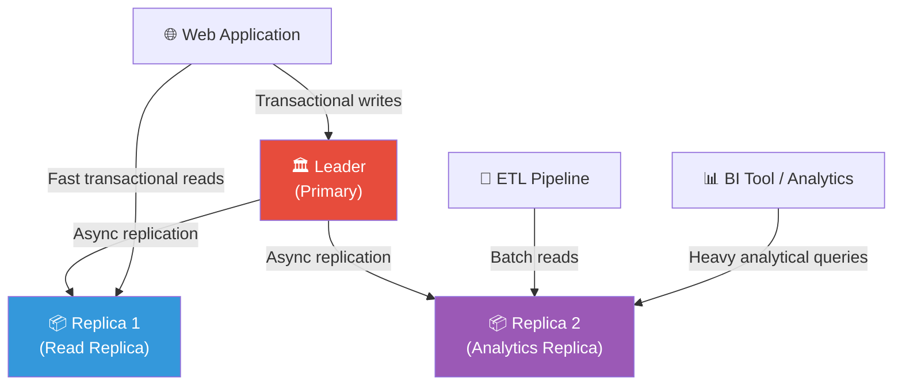

# Chapter 02 — Database Replication Strategies

> **Level:** Advanced DBMS | **Pre-req:** Basic SQL, transactions, CAP theorem basics

---

## 📋 Table of Contents

1. [What is Replication and Why Does it Exist?](#what-is-replication)
2. [Single-Leader Replication (Master-Slave)](#single-leader-replication)
3. [Multi-Leader Replication](#multi-leader-replication)
4. [Leaderless Replication (Dynamo-Style)](#leaderless-replication)
5. [Replication Lag — The Fundamental Problem](#replication-lag)
6. [Replication Methods: How Data Actually Travels](#replication-methods)
7. [Real-World Tools: Patroni and PgBouncer](#real-world-tools)
8. [Read Replicas for Analytics](#read-replicas-for-analytics)
9. [Comparison Tables](#comparison-tables)
10. [Key Takeaways](#key-takeaways)

---

## 🌍 What is Replication and Why Does it Exist? {#what-is-replication}

**Analogy:** Imagine a famous book. The original author has one handwritten manuscript. If that manuscript burns, the story is gone forever. Smart publishers make many printed copies — stored in libraries around the world. If one library burns down, the story survives. Readers can also borrow from their nearest library instead of travelling to the original.

**Database replication** is the same idea. It means keeping **copies of your data on multiple machines** (called **replicas** or **nodes**).

### Why do we replicate?

| Goal | Problem Solved | Real Example |
|------|----------------|--------------|
| **High Availability** | If one server dies, another takes over | Netflix stays online when an AWS region fails |
| **Read Scaling** | Spread read queries across many nodes | Instagram serving billions of photo reads |
| **Disaster Recovery** | Geographic backup if a data center burns | Banks with backup sites in different cities |
| **Low Latency** | Serve data from a node close to the user | Spotify serving users from EU/US/Asia replicas |

### The core challenge

The hard part is not copying data. The hard part is **keeping copies in sync** when data keeps changing. Every strategy in this chapter is a different answer to: *"How do we handle writes on multiple machines?"*

---

## 🏛️ Single-Leader Replication (Master-Slave) {#single-leader-replication}

**Analogy:** A newspaper office. One editor-in-chief (the **leader**) approves all changes to the newspaper. Printing presses around the country (the **followers**) receive copies and print them. No printing press can add its own articles — only the editor-in-chief can do that.

This is the most common replication model. Also called **master-slave** or **primary-replica** replication.

### How it works

1. All **writes** (INSERT, UPDATE, DELETE) go to the **leader node only**.
2. The leader logs these changes and sends them to **followers** (asynchronously or synchronously).
3. **Reads** can be served by followers (but may be slightly stale — we cover this in replication lag).
4. If the leader dies, one follower is **promoted** to become the new leader.



### Synchronous vs Asynchronous replication

**Synchronous:** The leader waits for at least one follower to confirm it received the write before telling the client "success."
- Pro: No data loss if leader dies.
- Con: Slow — one slow follower blocks all writes.

**Asynchronous:** The leader writes to its own log and immediately tells the client "success." Followers catch up later.
- Pro: Fast writes.
- Con: If the leader dies before followers catch up, recent writes are lost.

Most real systems use **semi-synchronous**: one follower is sync, the rest are async. PostgreSQL calls this `synchronous_standby_names`.

### Failover: what happens when the leader dies?



**Steps in automatic failover:**
1. Detect leader is dead (timeout-based heartbeats).
2. Pick the follower with the most up-to-date data.
3. Promote it to leader.
4. Tell all other followers to sync from the new leader.
5. Update config / DNS / load balancer.

**Danger:** If the old leader comes back alive, you now have two nodes thinking they are leader — a **split-brain** scenario. Tools like Patroni (covered later) handle this safely.

### When to use Single-Leader

**Use it when:**
- You need simple setup and well-understood failure modes.
- Most of your traffic is reads (read replicas help enormously).
- You can tolerate a short downtime window during failover (seconds to minutes).
- Examples: PostgreSQL, MySQL, most traditional databases.

**Do NOT use it when:**
- You need writes from multiple geographic regions simultaneously (latency to single leader is too high).
- You need zero-downtime write availability — a single leader is a single point of failure for writes.

---

## 🌐 Multi-Leader Replication {#multi-leader-replication}

**Analogy:** Google Docs. You and your colleague can both type in the same document at the same time, even if one of you is in Tokyo and the other in New York. Both edits are accepted. But what happens if you both edit the same sentence simultaneously? That is the conflict problem.

In multi-leader replication, **any leader node can accept writes**. Changes then flow to all other leaders.



### The conflict problem

Both Leader A and Leader B accept a write to the same row at the same time. Now they disagree. Who wins?

**Example conflict:**
```
Leader A: UPDATE users SET email = 'alice@gmail.com' WHERE id = 1;
Leader B: UPDATE users SET email = 'alice@yahoo.com' WHERE id = 1;
-- Both succeed locally. Now what?
```

### Conflict resolution strategies

#### 1. Last Write Wins (LWW)

Each write gets a timestamp. The write with the later timestamp wins.

```
alice@gmail.com  — timestamp: 10:00:01.123
alice@yahoo.com  — timestamp: 10:00:01.456  ← This wins
```

**Problem:** Clocks on different machines are never perfectly synced (clock skew). A write that happened "later" in real life might have an earlier timestamp. You **will** silently lose data.

**Use LWW only when:** Data loss is acceptable (like caches or session data). Cassandra uses LWW by default.

#### 2. CRDTs (Conflict-free Replicated Data Types)

**Analogy:** A vote counter. Two people can add votes independently. When you merge, you just add them together. There is no conflict because the data structure is designed to merge automatically.

CRDTs are special data structures where all concurrent updates can be merged **without any conflict**:

| CRDT Type | Example | Merge Rule |
|-----------|---------|------------|
| **G-Counter** | Page views | Always add, never subtract |
| **OR-Set** | Shopping cart items | Merge sets, track tombstones for deletes |
| **LWW-Register** | Single value | Last write wins (but with vector clocks, not wall-clock) |
| **MV-Register** | Text field | Keep all concurrent values, show conflict to user |

```python
# Conceptual G-Counter CRDT
class GCounter:
    def __init__(self, node_id, num_nodes):
        self.node_id = node_id
        self.counts = [0] * num_nodes  # one slot per node

    def increment(self):
        self.counts[self.node_id] += 1  # only write to own slot

    def value(self):
        return sum(self.counts)  # total is sum of all slots

    def merge(self, other):
        # take max of each slot — safe to merge any two replicas
        self.counts = [max(a, b) for a, b in zip(self.counts, other.counts)]

# Node 0 increments 3 times, Node 1 increments 2 times
n0 = GCounter(node_id=0, num_nodes=2)
n1 = GCounter(node_id=1, num_nodes=2)
n0.increment(); n0.increment(); n0.increment()  # counts = [3, 0]
n1.increment(); n1.increment()                  # counts = [0, 2]

# Merge: no conflict, result is always 5
n0.merge(n1)
print(n0.value())  # 5 — always correct, no matter order of merges
```

#### 3. Application-Level Conflict Resolution

Your application code decides the winner. The database sends all conflicting versions to your app, and your logic picks one.

```python
def resolve_conflict(versions):
    # Example: for a user profile, pick the most complete version
    return max(versions, key=lambda v: len([f for f in v.values() if f]))
```

Used by: CouchDB (exposes conflicts to application).

### When to use Multi-Leader

**Use it when:**
- Users are spread across the globe and you cannot afford the latency of writing to a single region.
- You need write availability even if a data center goes down.
- Your data types can be modeled as CRDTs or you can write solid conflict resolution logic.

**Do NOT use it when:**
- You need strong consistency (e.g., bank account balances — you cannot have two ledgers disagreeing).
- Your team is small — conflict resolution bugs are subtle and dangerous.
- Most of your data has conflicts that cannot be automatically resolved.

---

## 🌀 Leaderless Replication (Dynamo-Style) {#leaderless-replication}

**Analogy:** A town hall vote. There is no single mayor who makes all decisions. Instead, any citizen can propose a new rule. But for the rule to pass, a **majority** of citizens must agree (quorum). If you get enough votes, the change is accepted.

This is how **Amazon Dynamo**, **Apache Cassandra**, and **Riak** work. There is no designated leader. Any node can accept reads and writes.



### Quorum reads and writes

The key parameters are:
- **N** = total number of replicas
- **W** = number of nodes that must confirm a write
- **R** = number of nodes you must read from

**The rule for consistency: `W + R > N`**

If W + R > N, there must be **at least one overlap** — at least one node you read from must have seen the latest write. This guarantees you get fresh data.

```
Example: N=5, W=3, R=3
W + R = 6 > 5 ✅  → Consistent reads

Example: N=5, W=2, R=2
W + R = 4 < 5 ✅  → May read stale data (but faster)
```

```python
# Pseudocode for a leaderless write
def write(key, value, N=5, W=3):
    nodes = get_replica_nodes(key, count=N)
    acks = 0
    for node in nodes:
        success = node.write(key, value, timestamp=now())
        if success:
            acks += 1
    if acks >= W:
        return "SUCCESS"  # quorum reached
    else:
        return "ERROR: not enough nodes responded"

# Pseudocode for a leaderless read with conflict resolution
def read(key, N=5, R=3):
    nodes = get_replica_nodes(key, count=N)
    responses = [node.read(key) for node in nodes[:R]]
    # Pick value with highest version number (vector clock)
    return max(responses, key=lambda r: r.version)
```

### Sloppy Quorum and Hinted Handoff

**Problem:** What if some of the N designated nodes for a key are unreachable (network partition)?

**Analogy:** Your regular doctor is on vacation. You go to a substitute doctor who is not on your usual team. They treat you and write notes saying "pass this to Dr. Smith when she's back."

**Sloppy Quorum:** Accept writes on any W healthy nodes, even if they are not the normal replicas for that key.

**Hinted Handoff:** The substitute node stores the write with a "hint" — "this data belongs to Node 3, forward it when Node 3 comes back."

```
Normal replicas for key "user:123" → Nodes 1, 2, 3
Node 3 is down → Write goes to Node 4 with hint: "forward to Node 3"
Node 3 comes back → Node 4 sends the hinted data to Node 3
```

This increases **availability** but means `W + R > N` no longer guarantees you read the latest write — you might be reading from the substitute nodes.

### Anti-entropy and Read Repair

Nodes must eventually sync up. Two mechanisms:

**Read Repair:** When you read from R nodes and one returns stale data, the client notices the discrepancy and writes the fresh value back to the stale node.

**Anti-entropy:** A background process constantly compares nodes (using Merkle trees to find differences efficiently) and copies missing data.

### When to use Leaderless

**Use it when:**
- You need extreme availability (no single point of failure for writes).
- You can tolerate eventual consistency (social media likes, IoT sensor data, shopping carts).
- You need to survive multiple node failures gracefully.

**Do NOT use it when:**
- You need strong consistency (financial transactions — you cannot have split quorum on a bank balance).
- Your team is not experienced with tuning N/W/R values — wrong tuning silently causes data loss.
- You have complex relational data with foreign keys and constraints.

---

## ⏱️ Replication Lag — The Fundamental Problem {#replication-lag}

**Analogy:** You update your Twitter profile picture. You refresh your own profile and still see the old picture. You refresh again and see the new one. This happened because different page loads hit different replicas, and not all replicas had caught up yet.

**Replication lag** is the delay between a write hitting the leader and that write appearing on followers. In async replication, this lag is always non-zero.

### Why lag exists

```
Time: 0ms  → Client writes to leader
Time: 2ms  → Leader writes to its WAL
Time: 5ms  → Leader sends change to Follower 1
Time: 8ms  → Follower 1 applies the change
-- Lag = 8ms in this case
-- But under load, lag can be seconds or even minutes
```

### Problem 1: Read-Your-Writes Consistency

After you write something, you should always see your own write. But if your read goes to a stale follower, you might not.

**Solution strategies:**
1. After a write, **always read from the leader** for a short window (e.g., 1 minute).
2. The client tracks its **last write timestamp**. Any follower serving a read must have data up to at least that timestamp; otherwise route to leader.
3. **Sticky sessions:** Route a user's reads to the same replica consistently.

```python
# Example: Read-your-writes using write timestamp
def update_profile(user_id, new_bio):
    leader.write(f"UPDATE users SET bio='{new_bio}' WHERE id={user_id}")
    last_write_ts = time.time()
    session.set("last_write_ts", last_write_ts)

def get_profile(user_id):
    required_ts = session.get("last_write_ts", 0)
    replica = pick_replica()
    if replica.replication_lag_ts < required_ts:
        # Replica hasn't caught up yet — go to leader
        return leader.read(f"SELECT * FROM users WHERE id={user_id}")
    return replica.read(f"SELECT * FROM users WHERE id={user_id}")
```

### Problem 2: Monotonic Reads

**Analogy:** You read a social media post with 10 comments. You refresh and now see 8 comments. That is disorienting — data seems to go backward in time.

**Monotonic reads** guarantee that if you read a value at time T, you will never read an older version of that value later.

**Solution:** Pin each user to a specific replica. All reads for that user go to the same follower. If that follower is down, pick another one (but accept you might show stale data for a moment).

### Problem 3: Consistent Prefix Reads

**Analogy:** You see the answer to a question before you see the question itself, because they were written to different shards and replicated at different speeds.

**Solution:** Ensure causally related writes go to the same partition, or use **vector clocks** to track causality.

---

## 🔧 Replication Methods: How Data Actually Travels {#replication-methods}

### Method 1: Statement-Based Replication

The leader logs every **SQL statement** it executed and sends those statements to followers, which re-execute them.

```sql
-- Leader executes and ships this statement:
UPDATE orders SET status = 'shipped' WHERE created_at < NOW();
```

**The fatal flaw:** `NOW()` on the follower runs at a different time than on the leader. You get different results.

Other dangers:
- `RAND()`, `UUID()` — different values on each node.
- Auto-increment columns — same row gets different IDs.
- Triggers and stored procedures may behave differently.

**Verdict:** Fragile. MySQL used this early on and had many bugs. Mostly abandoned now.

### Method 2: WAL Shipping (Write-Ahead Log)

**Analogy:** Instead of sending instructions ("paint the wall blue"), you send a photo of the finished wall byte-for-byte.

Every database writes changes to a **WAL** (Write-Ahead Log) before applying them. With WAL shipping, the exact log bytes are sent to replicas, which replay them.

```
Leader WAL:
  LSN 100: BEGIN
  LSN 101: UPDATE page 42 offset 512 bytes: old=0x00, new=0xFF
  LSN 102: COMMIT
  
→ Follower receives exact bytes, replays exactly the same disk change
```

**Pro:** No ambiguity. Byte-for-byte identical result.  
**Con:** The WAL format is deeply tied to the **storage engine version**. You cannot replicate from PostgreSQL 15 to PostgreSQL 16 using WAL shipping if the format changed. Zero-downtime upgrades become hard.

**Used by:** PostgreSQL streaming replication (its primary replication mechanism).

### Method 3: Logical Replication (Row-Based)

**Analogy:** Instead of sending the raw paint strokes, you send a description: "Row 42 in the users table, column email changed from 'old@x.com' to 'new@x.com'."

The leader sends **logical changes** — which row changed, which columns, old value, new value — instead of raw WAL bytes.

```
Logical replication message:
{
  "type": "UPDATE",
  "relation": "public.users",
  "old_tuple": {"id": 42, "email": "old@x.com"},
  "new_tuple": {"id": 42, "email": "new@x.com"}
}
```

**Pros:**
- Can replicate between **different PostgreSQL versions** (cross-version upgrade path).
- Can replicate to **different databases entirely** (PostgreSQL to Kafka to ElasticSearch).
- Can replicate **specific tables only**, not the whole database.
- The format is stable and documented.

**Cons:**
- Slightly more CPU overhead to decode.
- Replicating schema changes (DDL) is trickier.

**Used by:** PostgreSQL logical replication, Debezium (CDC), pglogical.

### Quick Comparison

| Method | Pros | Cons | Use When |
|--------|------|------|----------|
| **Statement-based** | Simple, small log size | Fragile with non-deterministic functions | Never for production |
| **WAL Shipping** | Exact copy, reliable | Version-locked, opaque format | Same-version PostgreSQL HA |
| **Logical** | Cross-version, flexible, subscribable | More overhead, DDL complexity | Upgrades, CDC, cross-system sync |

---

## 🛠️ Real-World Tools: Patroni and PgBouncer {#real-world-tools}

### Patroni — PostgreSQL High Availability

**Analogy:** Patroni is the "election manager" for your PostgreSQL cluster. It watches your nodes, notices when the leader dies, runs a safe election, and promotes a new leader — all automatically.

Patroni uses **etcd, Consul, or ZooKeeper** as a distributed configuration store (the "ballot box") to prevent split-brain.

```yaml
# patroni.yml — basic configuration
scope: my-postgres-cluster
namespace: /db/
name: node1

restapi:
  listen: 0.0.0.0:8008
  connect_address: 192.168.1.10:8008

etcd:
  host: 192.168.1.100:2379

bootstrap:
  dcs:
    ttl: 30                    # leader lock expires after 30s
    loop_wait: 10              # check interval
    retry_timeout: 10
    maximum_lag_on_failover: 1048576  # 1MB max lag for promotion

  pg_hba:
    - host replication replicator 0.0.0.0/0 md5

postgresql:
  listen: 0.0.0.0:5432
  connect_address: 192.168.1.10:5432
  data_dir: /var/lib/postgresql/data
  authentication:
    replication:
      username: replicator
      password: rep-pass
    superuser:
      username: postgres
      password: super-pass
```

**Patroni failover flow:**



**Checking cluster status:**
```bash
patronictl -c /etc/patroni.yml list

# Output:
# + Cluster: my-postgres-cluster ----+----+-----------+
# | Member | Host           | Role    | State   | Lag |
# +--------+----------------+---------+---------+-----+
# | node1  | 192.168.1.10   | Replica | running | 0   |
# | node2  | 192.168.1.11   | Leader  | running |     |
# | node3  | 192.168.1.12   | Replica | running | 2   |
# +--------+----------------+---------+---------+-----+

# Manual switchover (zero-downtime planned maintenance)
patronictl -c /etc/patroni.yml switchover my-postgres-cluster --master node2 --candidate node1
```

### PgBouncer — Connection Pooling

**Analogy:** A PostgreSQL connection is like a hotel room. Each client needs their own room. But hotel rooms are expensive. A concierge (PgBouncer) lets 1000 guests share 20 rooms — because most guests are not in their room at any given moment.

PostgreSQL spawns a **process per connection** (forked). Each connection uses ~5-10MB of RAM and some CPU. At 1000 concurrent connections, that is 5-10GB just for connection overhead.

PgBouncer sits between your app and PostgreSQL, maintaining a **small pool** of real connections and multiplexing thousands of app connections onto them.

```
App connections: 1000 clients
                     ↓
              [PgBouncer]
         pool_size=50 real connections
                     ↓
           [PostgreSQL server]
```

```ini
# pgbouncer.ini
[databases]
mydb = host=127.0.0.1 port=5432 dbname=mydb

[pgbouncer]
listen_port = 6432
listen_addr = 0.0.0.0
auth_type = md5
auth_file = /etc/pgbouncer/userlist.txt

# Pool mode: transaction (most common for web apps)
# session = one real connection per client session (like no pooling)
# transaction = real connection held only during a transaction
# statement = real connection held only for one statement
pool_mode = transaction

max_client_conn = 10000   # app can open 10000 connections to PgBouncer
default_pool_size = 50    # only 50 real PostgreSQL connections

server_idle_timeout = 600
client_idle_timeout = 0
```

**With a replication setup (reads to replicas, writes to leader):**
```ini
[databases]
# Writes go to leader
mydb_write = host=leader.db.internal port=5432 dbname=mydb

# Reads go to load-balanced replicas
mydb_read = host=replica-lb.db.internal port=5432 dbname=mydb
```

Your app then connects to `mydb_write` for writes and `mydb_read` for reads.

---

## 📊 Read Replicas for Analytics {#read-replicas-for-analytics}

**Analogy:** A busy restaurant kitchen. All orders go through the head chef (leader). But for nutritional analysis reports, you do not need the head chef — a kitchen assistant (read replica) can pull together that data without blocking new orders.

Heavy analytics queries (full table scans, aggregations over millions of rows, long-running reports) can **cripple** your primary database, blocking normal traffic.

### Pattern: Offload analytics to a dedicated replica



### PostgreSQL: creating a read replica

```bash
# On the replica server — clone the primary
pg_basebackup -h primary-host -U replicator -D /var/lib/postgresql/data -P -R
# -R automatically creates standby.signal and postgresql.auto.conf with primary_conninfo

# The replica starts up in standby mode, continuously applying WAL from primary
systemctl start postgresql
```

```sql
-- Check replication lag on primary
SELECT
    client_addr,
    state,
    sent_lsn,
    write_lsn,
    flush_lsn,
    replay_lsn,
    (sent_lsn - replay_lsn) AS replication_lag_bytes,
    write_lag,
    flush_lag,
    replay_lag
FROM pg_stat_replication;
```

### Tips for analytics replicas

1. **Set `hot_standby_feedback = on`** on the analytics replica — tells the primary not to vacuum rows that the analytics query might still need (prevents `canceling statement due to conflict with recovery` errors).

2. **Use `max_standby_streaming_delay`** to give long queries time to finish before the replica applies conflicting WAL.

3. **Consider a slightly larger `work_mem`** on the analytics replica — sorting and aggregating big datasets benefits from more memory.

```sql
-- On analytics replica: temporarily allow higher work_mem for a session
SET work_mem = '512MB';

-- Now run your big report
SELECT
    DATE_TRUNC('month', created_at) AS month,
    COUNT(*) AS orders,
    SUM(total_amount) AS revenue
FROM orders
GROUP BY 1
ORDER BY 1;
```

---

## 📊 Comparison Tables {#comparison-tables}

### Replication Architecture Comparison

| Dimension | Single-Leader | Multi-Leader | Leaderless |
|-----------|--------------|--------------|------------|
| **Write scalability** | Limited (one node) | High (any leader) | Very high (any node) |
| **Read scalability** | High (many replicas) | High | High |
| **Consistency** | Strong (sync) / Eventual (async) | Eventual | Tunable (W+R>N) |
| **Conflict handling** | No conflicts | Complex (LWW/CRDT) | Read repair |
| **Failover** | Automatic (Patroni etc.) | Continuous (no single point) | Automatic |
| **Complexity** | Low | High | Medium-High |
| **Examples** | PostgreSQL, MySQL | CouchDB, multi-DC MySQL | Cassandra, DynamoDB, Riak |

### Consistency Guarantees Comparison

| Guarantee | Description | Provided By |
|-----------|-------------|-------------|
| **Read-your-writes** | You see your own writes | Sticky routing to leader |
| **Monotonic reads** | Never read older data after newer | Pin user to one replica |
| **Consistent prefix** | Never see out-of-order writes | Same partition for related writes |
| **Strong consistency** | Every read sees the latest write | Sync replication + quorum |
| **Eventual consistency** | All replicas converge eventually | Async replication (all models) |

### Replication Method Comparison

| Method | Data Loss Risk | Cross-version | Size | Use Case |
|--------|---------------|---------------|------|----------|
| Statement-based | High (non-determinism) | Yes | Small | Avoid |
| WAL Shipping | None | No | Medium | Same-version HA |
| Logical | Low | Yes | Medium | Upgrades, CDC |

---

## 🔑 Key Takeaways {#key-takeaways}

**1. Replication solves three problems:** high availability (survive node death), read scaling (spread read load), and disaster recovery (geographic redundancy). Pick your strategy based on which problem is most important.

**2. Single-leader is the safe default.** It is simple, well-understood, and handles most production workloads. PostgreSQL with Patroni is a battle-tested choice for 99% of applications.

**3. Multi-leader is powerful but dangerous.** Conflict resolution bugs are subtle and can silently corrupt data. Only use it if your write latency requirements truly demand multi-region writes.

**4. Leaderless (Dynamo-style) gives you tunable trade-offs.** With W+R>N you get consistency. Below that threshold, you get speed. Cassandra and DynamoDB use this model — excellent for high-throughput, eventual-consistency workloads.

**5. Async replication always has lag.** This is not a bug — it is the price of performance. But you must account for read-your-writes consistency and monotonic reads in your application code. Ignoring lag causes confusing user-facing bugs.

**6. Know your replication method:**
- Statement-based: avoid.
- WAL shipping: great for same-version standby.
- Logical replication: use for upgrades, CDC pipelines, cross-system sync.

**7. W + R > N is the quorum rule.** For any leaderless or quorum-based system, this formula tells you whether your read is guaranteed to overlap with your latest write.

**8. PgBouncer is almost always necessary in production.** PostgreSQL's per-connection process model does not scale to thousands of app connections. PgBouncer in `transaction` pool mode is the standard solution.

**9. Read replicas are free analytics infrastructure.** You are already paying for replication — route your heavy BI queries to a dedicated replica and protect your primary from analytical load.

**10. Patroni + etcd is the gold standard for PostgreSQL HA.** It handles split-brain safely (via distributed lock), automatic failover, and provides a REST API and CLI for cluster management.

---

> **Further Reading:**
> - *Designing Data-Intensive Applications* by Martin Kleppmann (Chapters 5-6) — the definitive resource on this topic
> - PostgreSQL docs: [Streaming Replication](https://www.postgresql.org/docs/current/warm-standby.html), [Logical Replication](https://www.postgresql.org/docs/current/logical-replication.html)
> - [Patroni documentation](https://patroni.readthedocs.io/)
> - Amazon Dynamo paper (2007) — foundational paper for leaderless replication
> - [CRDTs explained](https://crdt.tech/) — interactive visualizations of conflict-free data types
