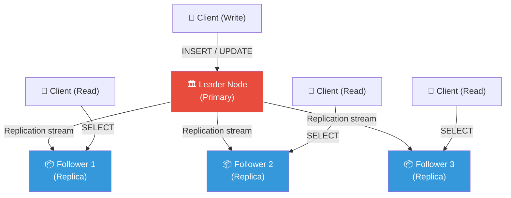
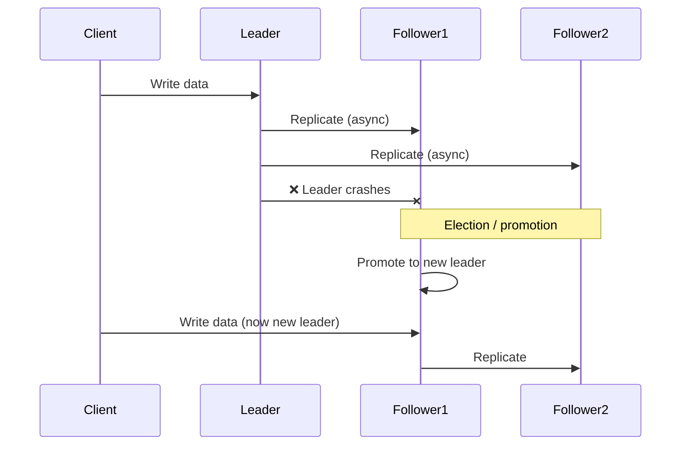
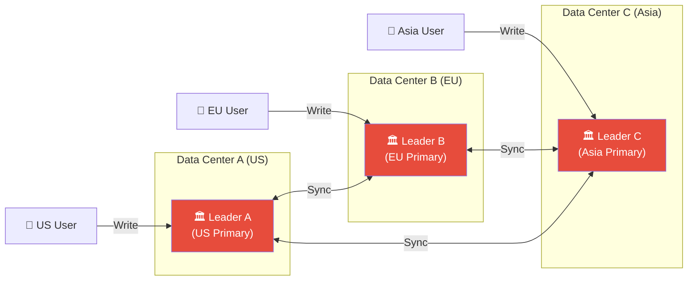
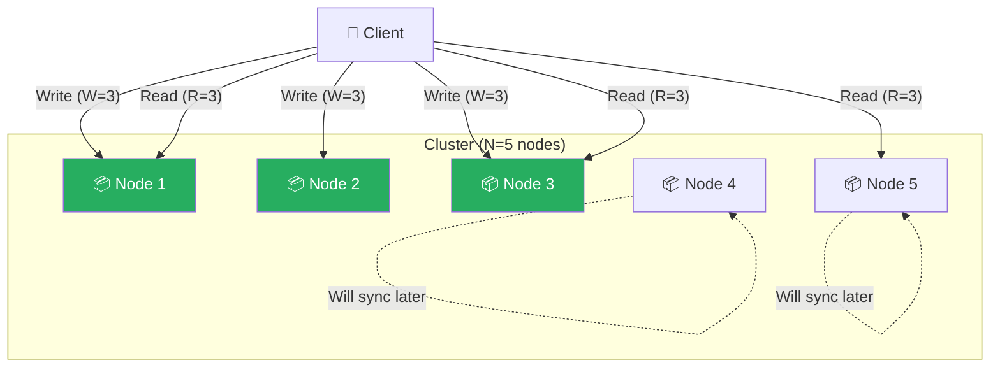
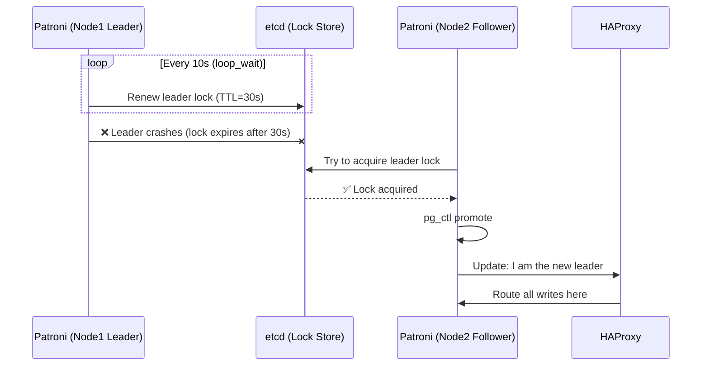
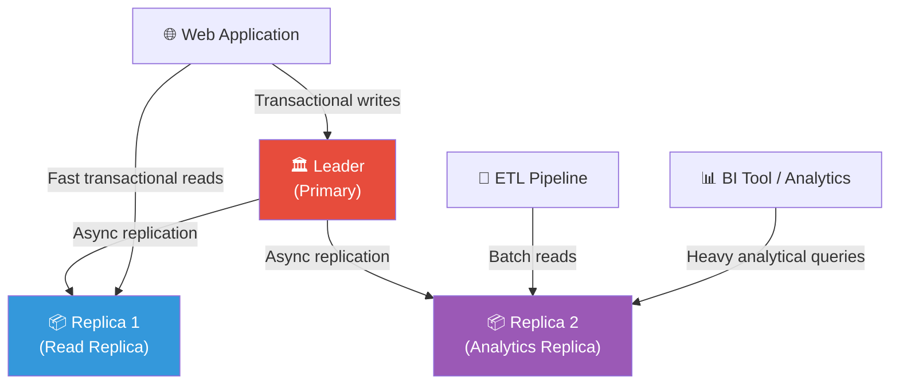

# Chapter 02 — Database Replication Strategies

> **Level:** Advanced DBMS | **Pre-req:** Basic SQL, transactions, CAP theorem basics

---

## 📋 Table of Contents

1. [What is Replication and Why Does it Exist?](#what-is-replication)
2. [Single-Leader Replication (Master-Slave)](#single-leader-replication)
3. [Multi-Leader Replication](#multi-leader-replication)
4. [Leaderless Replication (Dynamo-Style)](#leaderless-replication)
5. [Replication Lag — The Fundamental Problem](#replication-lag)
6. [Replication Methods: How Data Actually Travels](#replication-methods)
7. [Real-World Tools: Patroni and PgBouncer](#real-world-tools)
8. [Read Replicas for Analytics](#read-replicas-for-analytics)
9. [Comparison Tables](#comparison-tables)
10. [Key Takeaways](#key-takeaways)

---

## 🌍 What is Replication and Why Does it Exist? {#what-is-replication}

**Analogy:** Socho ek famous kitaab hai. Original author ke paas sirf ek handwritten manuscript hai. Agar wo manuscript jal jaaye, toh story hamesha ke liye gayab. Smart publishers isliye kaafi saari printed copies bana ke duniya bhar ki libraries mein rakh dete hain. Ek library jal bhi jaaye, toh baaki jagah story zinda rehti hai. Aur readers apni nearest library se hi kitaab utha sakte hain, original tak jaane ki zaroorat nahi.

**Database replication** bhi bilkul yehi concept hai. Iska matlab hai **apna data multiple machines pe copy karke rakhna** (inhe **replicas** ya **nodes** kehte hain).

### Replication kyun karte hain?

| Goal | Kaunsa Problem Solve Hota Hai | Real Example |
|------|----------------|--------------|
| **High Availability** | Ek server mar jaaye toh doosra sambhal le | Netflix chalta rehta hai jab AWS ka ek region down ho jaaye |
| **Read Scaling** | Read queries ko kaafi saare nodes pe baant do | Instagram jo billions photo reads serve karta hai |
| **Disaster Recovery** | Data center jal jaaye toh geographic backup ho | Banks jinke different cities mein backup sites hote hain |
| **Low Latency** | User ke paas wale node se data serve karo | Spotify jo EU/US/Asia replicas se users ko serve karta hai |

### Asli challenge kya hai?

Data copy karna mushkil nahi hai. Mushkil hai copies ko **sync mein rakhna** jab data hardam badalta rehta hai. Is chapter ki har strategy ek hi sawaal ka alag jawab hai: *"Multiple machines pe writes kaise handle karein?"*

---

## 🏛️ Single-Leader Replication (Master-Slave) {#single-leader-replication}

**Analogy:** Ek newspaper office socho. Ek editor-in-chief (yaani **leader**) hi newspaper mein saare changes approve karta hai. Desh bhar ki printing presses (yaani **followers**) copies receive karke print karti hain. Koi bhi printing press apna khud ka article add nahi kar sakti — sirf editor-in-chief hi kar sakta hai.

Ye sabse common replication model hai. Isse **master-slave** ya **primary-replica** replication bhi kehte hain.

### Ye kaam kaise karta hai

1. Saare **writes** (INSERT, UPDATE, DELETE) sirf **leader node** pe hi jaate hain.
2. Leader in changes ko log karta hai aur **followers** ko bhejta hai (async ya sync).
3. **Reads** followers se serve ho sakte hain (lekin thoda stale ho sakte hain — ye replication lag section mein cover karenge).
4. Agar leader mar jaaye, toh ek follower ko naya leader **promote** kar diya jaata hai.



### Synchronous vs Asynchronous replication

**Synchronous:** Leader tab tak wait karta hai jab tak kam se kam ek follower confirm na kar de ki usne write receive kar liya, tabhi client ko "success" bolta hai.
- Pro: Leader mar jaaye toh bhi data loss nahi hota.
- Con: Slow hai — ek slow follower saare writes ko block kar sakta hai.

**Asynchronous:** Leader apne khud ke log mein likh ke turant client ko "success" bol deta hai. Followers baad mein catch up karte hain.
- Pro: Writes fast hote hain.
- Con: Agar followers catch up karne se pehle hi leader mar jaaye, toh recent writes lost ho jaate hain.

Real systems mostly **semi-synchronous** use karte hain: ek follower sync hota hai, baaki sab async. PostgreSQL isse `synchronous_standby_names` kehta hai.

### Failover: leader marne pe kya hota hai?



**Automatic failover ke steps:**
1. Detect karo ki leader mar gaya (timeout-based heartbeats se).
2. Sabse up-to-date data wale follower ko pick karo.
3. Usko leader promote karo.
4. Baaki saare followers ko naye leader se sync karne bolo.
5. Config / DNS / load balancer update karo.

**Khatra:** Agar purana leader wapis zinda ho jaaye, toh ab do nodes khud ko leader samajhne lagenge — isse **split-brain** scenario kehte hain. Patroni jaise tools (aage cover karenge) isse safely handle karte hain.

### Single-Leader kab use karein

**Use karo jab:**
- Simple setup chahiye aur failure modes well-understood ho.
- Zyaadatar traffic reads ka hai (read replicas bahut help karte hain).
- Failover ke waqt thoda downtime (seconds se minutes) tolerate kar sakte ho.
- Examples: PostgreSQL, MySQL, zyaadatar traditional databases.

**Use MAT karo jab:**
- Multiple geographic regions se ek saath writes chahiye (single leader tak latency bahut zyaada ho jaayegi).
- Zero-downtime write availability chahiye — single leader writes ke liye single point of failure hai.

---

## 🌐 Multi-Leader Replication {#multi-leader-replication}

**Analogy:** Google Docs socho. Tum aur tumhara colleague ek hi document mein ek saath type kar sakte ho, chahe ek Tokyo mein ho aur doosra New York mein. Dono ke edits accept ho jaate hain. Lekin agar dono ek hi sentence ek saath edit kar de toh? Wahi conflict problem hai.

Multi-leader replication mein **koi bhi leader node writes accept kar sakta hai**. Changes fir baaki saare leaders tak pahunchte hain.



### Conflict wala problem

Leader A aur Leader B, dono ek hi row pe ek hi time pe write accept kar lete hain. Ab dono ka data alag hai. Jeetega kaun?

**Example conflict:**
```
Leader A: UPDATE users SET email = 'alice@gmail.com' WHERE id = 1;
Leader B: UPDATE users SET email = 'alice@yahoo.com' WHERE id = 1;
-- Dono locally succeed ho gaye. Ab kya?
```

### Conflict resolve karne ki strategies

#### 1. Last Write Wins (LWW)

Har write ko ek timestamp milta hai. Jiska timestamp baad ka hota hai, wo jeet jaata hai.

```
alice@gmail.com  — timestamp: 10:00:01.123
alice@yahoo.com  — timestamp: 10:00:01.456  ← Ye jeetega
```

**Problem:** Alag-alag machines ke clocks kabhi perfectly sync nahi hote (clock skew). Jo write real life mein "baad mein" hua, uska timestamp pehle ka bhi ho sakta hai. Isse tum **chupke se data loss** kar baithoge.

**LWW sirf tab use karo jab:** Data loss chalta ho (jaise caches ya session data). Cassandra by default LWW use karta hai.

#### 2. CRDTs (Conflict-free Replicated Data Types)

**Analogy:** Ek vote counter socho. Do log independently votes add kar sakte hain. Merge karte waqt bas dono ke numbers add ho jaate hain. Koi conflict hi nahi hota kyunki data structure hi merge hone ke liye design kiya gaya hai.

CRDTs special data structures hain jahan saare concurrent updates **bina kisi conflict ke** merge ho jaate hain:

| CRDT Type | Example | Merge Rule |
|-----------|---------|------------|
| **G-Counter** | Page views | Hamesha add karo, kabhi subtract nahi |
| **OR-Set** | Shopping cart items | Sets merge karo, deletes ke liye tombstones track karo |
| **LWW-Register** | Single value | Last write wins (lekin wall-clock nahi, vector clocks se) |
| **MV-Register** | Text field | Saare concurrent values rakho, user ko conflict dikhao |

```python
# Conceptual G-Counter CRDT
class GCounter:
    def __init__(self, node_id, num_nodes):
        self.node_id = node_id
        self.counts = [0] * num_nodes  # one slot per node

    def increment(self):
        self.counts[self.node_id] += 1  # only write to own slot

    def value(self):
        return sum(self.counts)  # total is sum of all slots

    def merge(self, other):
        # take max of each slot — safe to merge any two replicas
        self.counts = [max(a, b) for a, b in zip(self.counts, other.counts)]

# Node 0 increments 3 times, Node 1 increments 2 times
n0 = GCounter(node_id=0, num_nodes=2)
n1 = GCounter(node_id=1, num_nodes=2)
n0.increment(); n0.increment(); n0.increment()  # counts = [3, 0]
n1.increment(); n1.increment()                  # counts = [0, 2]

# Merge: no conflict, result is always 5
n0.merge(n1)
print(n0.value())  # 5 — always correct, no matter order of merges
```

#### 3. Application-Level Conflict Resolution

Tumhara application code khud decide karta hai winner kaun hoga. Database saare conflicting versions tumhare app ko bhej deta hai, aur tumhara logic ek chunta hai.

```python
def resolve_conflict(versions):
    # Example: for a user profile, pick the most complete version
    return max(versions, key=lambda v: len([f for f in v.values() if f]))
```

Use hota hai: CouchDB mein (jo conflicts application ko expose karta hai).

### Multi-Leader kab use karein

**Use karo jab:**
- Users duniya bhar mein faile hain aur single region ko write karne ki latency afford nahi kar sakte.
- Ek data center down ho jaaye tab bhi write availability chahiye.
- Tumhara data CRDTs se model ho sakta hai ya tum solid conflict resolution logic likh sakte ho.

**Use MAT karo jab:**
- Strong consistency chahiye (jaise bank account balances — do ledgers disagree nahi kar sakte).
- Team chhoti hai — conflict resolution bugs subtle aur dangerous hote hain.
- Zyaadatar data ke conflicts automatically resolve nahi ho sakte.

---

## 🌀 Leaderless Replication (Dynamo-Style) {#leaderless-replication}

**Analogy:** Ek town hall vote socho. Koi ek mayor nahi hai jo saare decisions leta ho. Iske bajaye, koi bhi citizen naya rule propose kar sakta hai. Lekin rule paas hone ke liye **majority** citizens ka agree karna zaruri hai (quorum). Agar enough votes mil gaye, change accept ho jaata hai.

Isi tarah **Amazon Dynamo**, **Apache Cassandra**, aur **Riak** kaam karte hain. Koi designated leader hota hi nahi. Koi bhi node reads aur writes accept kar sakta hai.



### Quorum reads aur writes

Key parameters ye hain:
- **N** = total replicas ki sankhya
- **W** = kitne nodes ko write confirm karna zaruri hai
- **R** = kitne nodes se read karna zaruri hai

**Consistency ka rule: `W + R > N`**

Agar W + R > N ho, toh guarantee milta hai ki kam se kam **ek overlap** hoga — matlab jin nodes se tum read kar rahe ho, unme se kam se kam ek ne latest write dekha hoga. Isse fresh data milna guaranteed hai.

```
Example: N=5, W=3, R=3
W + R = 6 > 5 ✅  → Consistent reads
Example: N=5, W=2, R=2
W + R = 4 < 5 ✅  → Stale data mil sakta hai (lekin fast hai)
```

```python
# Pseudocode for a leaderless write
def write(key, value, N=5, W=3):
    nodes = get_replica_nodes(key, count=N)
    acks = 0
    for node in nodes:
        success = node.write(key, value, timestamp=now())
        if success:
            acks += 1
    if acks >= W:
        return "SUCCESS"  # quorum reached
    else:
        return "ERROR: not enough nodes responded"

# Pseudocode for a leaderless read with conflict resolution
def read(key, N=5, R=3):
    nodes = get_replica_nodes(key, count=N)
    responses = [node.read(key) for node in nodes[:R]]
    # Pick value with highest version number (vector clock)
    return max(responses, key=lambda r: r.version)
```

### Sloppy Quorum aur Hinted Handoff

**Problem:** Agar kisi key ke liye designated N nodes mein se kuch unreachable ho jaayein (network partition ki wajah se) toh?

**Analogy:** Tumhara regular doctor vacation pe hai. Tum ek substitute doctor ke paas jaate ho jo tumhari usual team mein nahi hai. Wo treat karke notes likhta hai: "Dr. Smith wapis aaye toh usko pass kar dena."

**Sloppy Quorum:** Kisi bhi healthy W nodes pe writes accept kar lo, chahe wo us key ke normal replicas na hon.

**Hinted Handoff:** Substitute node write ko ek "hint" ke saath store karta hai — "ye data Node 3 ka hai, wo wapis aaye toh forward kar dena."

```
Normal replicas for key "user:123" → Nodes 1, 2, 3
Node 3 down hai → Write Node 4 pe jaata hai hint ke saath: "forward to Node 3"
Node 3 wapis aata hai → Node 4 hinted data Node 3 ko bhej deta hai
```

Isse **availability** badh jaati hai, lekin ab `W + R > N` ye guarantee nahi deta ki tumhe latest write mil hi jaayega — ho sakta hai tum substitute nodes se read kar rahe ho.

### Anti-entropy aur Read Repair

Nodes ko eventually sync hona hi padta hai. Do mechanisms hote hain:

**Read Repair:** Jab tum R nodes se read karte ho aur ek node stale data return kare, client ye discrepancy notice karke fresh value stale node pe wapis likh deta hai.

**Anti-entropy:** Ek background process constantly nodes ko compare karta rehta hai (Merkle trees use karke efficiently differences dhundhta hai) aur missing data copy kar deta hai.

### Leaderless kab use karein

**Use karo jab:**
- Extreme availability chahiye (writes ke liye koi single point of failure na ho).
- Eventual consistency tolerate ho sakti hai (social media likes, IoT sensor data, shopping carts).
- Multiple node failures graceful tarike se survive karne hain.

**Use MAT karo jab:**
- Strong consistency chahiye (financial transactions — bank balance pe split quorum nahi chal sakta).
- Team ko N/W/R values tune karne ka experience nahi hai — galat tuning chupke se data loss karta hai.
- Complex relational data hai jisme foreign keys aur constraints hain.

---

## ⏱️ Replication Lag — The Fundamental Problem {#replication-lag}

**Analogy:** Tumne apni Twitter profile picture update ki. Apni hi profile refresh karo toh purani picture dikhti hai. Fir se refresh karo toh nayi dikh jaati hai. Aisa isliye hua kyunki alag-alag page loads alag replicas pe hit hue, aur sab replicas abhi tak catch up nahi hue the.

**Replication lag** us delay ko kehte hain jo leader pe write hone aur followers pe wo write dikhne ke beech hota hai. Async replication mein ye lag hamesha non-zero hota hai.

### Lag kyun hota hai

```
Time: 0ms  → Client writes to leader
Time: 2ms  → Leader writes to its WAL
Time: 5ms  → Leader sends change to Follower 1
Time: 8ms  → Follower 1 applies the change
-- Is case mein Lag = 8ms
-- Lekin load ke under, lag seconds ya minutes tak bhi ja sakta hai
```

### Problem 1: Read-Your-Writes Consistency

Kuch write karne ke baad, tumhe apna khud ka write dikhna hi chahiye. Lekin agar tumhara read kisi stale follower pe chala jaaye, toh nahi dikhega.

**Solution strategies:**
1. Write ke baad, thodi der (jaise 1 minute) tak **hamesha leader se read** karo.
2. Client apna **last write timestamp** track kare. Jo follower read serve kar raha hai, uska data kam se kam us timestamp tak hona chahiye; warna leader pe route karo.
3. **Sticky sessions:** Ek user ke saare reads consistently ek hi replica pe route karo.

```python
# Example: Read-your-writes using write timestamp
def update_profile(user_id, new_bio):
    leader.write(f"UPDATE users SET bio='{new_bio}' WHERE id={user_id}")
    last_write_ts = time.time()
    session.set("last_write_ts", last_write_ts)

def get_profile(user_id):
    required_ts = session.get("last_write_ts", 0)
    replica = pick_replica()
    if replica.replication_lag_ts < required_ts:
        # Replica hasn't caught up yet — go to leader
        return leader.read(f"SELECT * FROM users WHERE id={user_id}")
    return replica.read(f"SELECT * FROM users WHERE id={user_id}")
```

### Problem 2: Monotonic Reads

**Analogy:** Tum ek social media post padhte ho jisme 10 comments hain. Refresh karte ho aur ab 8 comments dikhte hain. Ye confusing hai — jaise data time mein peeche chala gaya ho.

**Monotonic reads** ye guarantee dete hain ki agar tumne time T pe koi value padhi, toh baad mein us value ka usse purana version kabhi nahi padhoge.

**Solution:** Har user ko ek specific replica se pin kar do. Us user ke saare reads usi follower pe jaayein. Wo follower down ho jaaye toh doosra pick karo (lekin thodi der stale data dikhne ka risk accept karo).

### Problem 3: Consistent Prefix Reads

**Analogy:** Tum kisi sawaal ka jawab, sawaal se pehle dekh lete ho — kyunki dono alag-alag shards pe likhe gaye the aur alag speed se replicate hue.

**Solution:** Causally related writes ko ek hi partition pe bhejo, ya causality track karne ke liye **vector clocks** use karo.

---

## 🔧 Replication Methods: How Data Actually Travels {#replication-methods}

### Method 1: Statement-Based Replication

Leader jo bhi **SQL statement** execute karta hai wo log karta hai aur followers ko bhej deta hai, jo usse dobara execute karte hain.

```sql
-- Leader executes and ships this statement:
UPDATE orders SET status = 'shipped' WHERE created_at < NOW();
```

**Sabse badi khaamiyaan:** `NOW()` follower pe leader se alag time pe run hoga. Result alag aa jaayega.

Aur bhi khatre:
- `RAND()`, `UUID()` — har node pe alag values.
- Auto-increment columns — same row ko alag-alag IDs mil jaayenge.
- Triggers aur stored procedures ka behaviour alag ho sakta hai.

**Verdict:** Fragile hai. MySQL ne shuru mein ye use kiya tha aur bahut bugs aaye. Ab mostly abandon kar diya gaya hai.

### Method 2: WAL Shipping (Write-Ahead Log)

**Analogy:** Instructions bhejne ki jagah ("wall ko blue paint karo"), tum finished wall ka photo byte-for-byte bhej dete ho.

Har database changes ko apply karne se pehle ek **WAL** (Write-Ahead Log) mein likhta hai. WAL shipping mein, exact log bytes replicas ko bheje jaate hain, jo unhe replay karte hain.

```
Leader WAL:
  LSN 100: BEGIN
  LSN 101: UPDATE page 42 offset 512 bytes: old=0x00, new=0xFF
  LSN 102: COMMIT
  
→ Follower receives exact bytes, replays exactly the same disk change
```

**Pro:** Koi ambiguity nahi. Byte-for-byte identical result.
**Con:** WAL format **storage engine version** se deeply tied hai. Agar format badla ho toh PostgreSQL 15 se 16 tak WAL shipping se replicate nahi kar sakte. Zero-downtime upgrades mushkil ho jaate hain.

**Use hota hai:** PostgreSQL streaming replication (iska primary replication mechanism).

### Method 3: Logical Replication (Row-Based)

**Analogy:** Raw paint strokes bhejne ki jagah, tum ek description bhejte ho: "users table ki row 42, column email 'old@x.com' se 'new@x.com' ho gaya."

Leader raw WAL bytes ke bajaye **logical changes** bhejta hai — kaunsi row change hui, kaunse columns, purani value, nayi value.

```
Logical replication message:
{
  "type": "UPDATE",
  "relation": "public.users",
  "old_tuple": {"id": 42, "email": "old@x.com"},
  "new_tuple": {"id": 42, "email": "new@x.com"}
}
```

**Pros:**
- **Different PostgreSQL versions** ke beech replicate kar sakte ho (cross-version upgrade path).
- **Bilkul alag databases** tak bhi replicate kar sakte ho (PostgreSQL se Kafka se ElasticSearch).
- **Sirf specific tables** replicate kar sakte ho, poora database nahi.
- Format stable aur documented hai.

**Cons:**
- Decode karne mein thoda zyaada CPU overhead.
- Schema changes (DDL) replicate karna trickier hai.

**Use hota hai:** PostgreSQL logical replication, Debezium (CDC), pglogical.

### Quick Comparison

| Method | Pros | Cons | Use When |
|--------|------|------|----------|
| **Statement-based** | Simple, chhota log size | Non-deterministic functions ke saath fragile | Production mein kabhi nahi |
| **WAL Shipping** | Exact copy, reliable | Version-locked, opaque format | Same-version PostgreSQL HA |
| **Logical** | Cross-version, flexible, subscribable | Zyaada overhead, DDL complexity | Upgrades, CDC, cross-system sync |

---

## 🛠️ Real-World Tools: Patroni and PgBouncer {#real-world-tools}

### Patroni — PostgreSQL High Availability

**Analogy:** Patroni tumhare PostgreSQL cluster ka "election manager" hai. Ye nodes ko watch karta rehta hai, leader marne pe notice kar leta hai, safe election chalata hai, aur automatically naye leader ko promote kar deta hai.

Patroni **etcd, Consul, ya ZooKeeper** ko distributed configuration store ("ballot box") ki tarah use karta hai taaki split-brain na ho.

```yaml
# patroni.yml — basic configuration
scope: my-postgres-cluster
namespace: /db/
name: node1

restapi:
  listen: 0.0.0.0:8008
  connect_address: 192.168.1.10:8008

etcd:
  host: 192.168.1.100:2379

bootstrap:
  dcs:
    ttl: 30                    # leader lock expires after 30s
    loop_wait: 10              # check interval
    retry_timeout: 10
    maximum_lag_on_failover: 1048576  # 1MB max lag for promotion

  pg_hba:
    - host replication replicator 0.0.0.0/0 md5

postgresql:
  listen: 0.0.0.0:5432
  connect_address: 192.168.1.10:5432
  data_dir: /var/lib/postgresql/data
  authentication:
    replication:
      username: replicator
      password: rep-pass
    superuser:
      username: postgres
      password: super-pass
```

**Patroni failover flow:**



**Cluster status check karna:**
```bash
patronictl -c /etc/patroni.yml list

# Output:
# + Cluster: my-postgres-cluster ----+----+-----------+
# | Member | Host           | Role    | State   | Lag |
# +--------+----------------+---------+---------+-----+
# | node1  | 192.168.1.10   | Replica | running | 0   |
# | node2  | 192.168.1.11   | Leader  | running |     |
# | node3  | 192.168.1.12   | Replica | running | 2   |
# +--------+----------------+---------+---------+-----+

# Manual switchover (zero-downtime planned maintenance)
patronictl -c /etc/patroni.yml switchover my-postgres-cluster --master node2 --candidate node1
```

### PgBouncer — Connection Pooling

**Analogy:** PostgreSQL connection ek hotel room jaisa hai. Har client ko apna khud ka room chahiye. Lekin hotel rooms mehenge hote hain. Ek concierge (PgBouncer) 1000 guests ko sirf 20 rooms share karwa deta hai — kyunki zyaadatar guests kisi bhi waqt apne room mein nahi hote.

PostgreSQL har connection ke liye ek **process spawn** karta hai (forked). Har connection ~5-10MB RAM aur kuch CPU use karta hai. 1000 concurrent connections pe, sirf connection overhead ke liye 5-10GB lag jaata hai.

PgBouncer tumhari app aur PostgreSQL ke beech baithta hai, real connections ka ek **chhota pool** maintain karta hai aur hazaaron app connections ko unpe multiplex kar deta hai.

```
App connections: 1000 clients
                     ↓
              [PgBouncer]
         pool_size=50 real connections
                     ↓
           [PostgreSQL server]
```

```ini
# pgbouncer.ini
[databases]
mydb = host=127.0.0.1 port=5432 dbname=mydb

[pgbouncer]
listen_port = 6432
listen_addr = 0.0.0.0
auth_type = md5
auth_file = /etc/pgbouncer/userlist.txt

# Pool mode: transaction (most common for web apps)
# session = one real connection per client session (like no pooling)
# transaction = real connection held only during a transaction
# statement = real connection held only for one statement
pool_mode = transaction

max_client_conn = 10000   # app can open 10000 connections to PgBouncer
default_pool_size = 50    # only 50 real PostgreSQL connections

server_idle_timeout = 600
client_idle_timeout = 0
```

**Replication setup ke saath (reads replicas ko, writes leader ko):**
```ini
[databases]
# Writes go to leader
mydb_write = host=leader.db.internal port=5432 dbname=mydb

# Reads go to load-balanced replicas
mydb_read = host=replica-lb.db.internal port=5432 dbname=mydb
```

Tumhari app phir writes ke liye `mydb_write` aur reads ke liye `mydb_read` se connect karti hai.

---

## 📊 Read Replicas for Analytics {#read-replicas-for-analytics}

**Analogy:** Ek busy restaurant kitchen socho. Saare orders head chef (leader) se hi guzarte hain. Lekin nutritional analysis report ke liye tumhe head chef ki zaroorat nahi — ek kitchen assistant (read replica) naye orders ko block kiye bina wo data nikaal sakta hai.

Heavy analytics queries (full table scans, millions rows pe aggregations, long-running reports) tumhare primary database ko **crawl** kar sakti hain, normal traffic ko block karte hue.

### Pattern: Analytics ko dedicated replica pe offload karo



### PostgreSQL: read replica banana

```bash
# On the replica server — clone the primary
pg_basebackup -h primary-host -U replicator -D /var/lib/postgresql/data -P -R
# -R automatically creates standby.signal and postgresql.auto.conf with primary_conninfo

# The replica starts up in standby mode, continuously applying WAL from primary
systemctl start postgresql
```

```sql
-- Check replication lag on primary
SELECT
    client_addr,
    state,
    sent_lsn,
    write_lsn,
    flush_lsn,
    replay_lsn,
    (sent_lsn - replay_lsn) AS replication_lag_bytes,
    write_lag,
    flush_lag,
    replay_lag
FROM pg_stat_replication;
```

### Analytics replicas ke liye tips

1. **`hot_standby_feedback = on`** analytics replica pe set karo — ye primary ko batata hai ki jin rows ki analytics query ko abhi bhi zaroorat ho sakti hai unhe vacuum na kare (isse `canceling statement due to conflict with recovery` errors nahi aate).

2. **`max_standby_streaming_delay`** use karo — taaki conflicting WAL apply karne se pehle long queries ko finish hone ka time mil jaaye.

3. Analytics replica pe **thoda bada `work_mem`** rakhna consider karo — bade datasets sort/aggregate karne mein zyaada memory se fayda milta hai.

```sql
-- On analytics replica: temporarily allow higher work_mem for a session
SET work_mem = '512MB';

-- Now run your big report
SELECT
    DATE_TRUNC('month', created_at) AS month,
    COUNT(*) AS orders,
    SUM(total_amount) AS revenue
FROM orders
GROUP BY 1
ORDER BY 1;
```

---

## 📊 Comparison Tables {#comparison-tables}

### Replication Architecture Comparison

| Dimension | Single-Leader | Multi-Leader | Leaderless |
|-----------|--------------|--------------|------------|
| **Write scalability** | Limited (ek node) | High (koi bhi leader) | Very high (koi bhi node) |
| **Read scalability** | High (kaafi replicas) | High | High |
| **Consistency** | Strong (sync) / Eventual (async) | Eventual | Tunable (W+R>N) |
| **Conflict handling** | Koi conflict nahi | Complex (LWW/CRDT) | Read repair |
| **Failover** | Automatic (Patroni etc.) | Continuous (koi single point nahi) | Automatic |
| **Complexity** | Low | High | Medium-High |
| **Examples** | PostgreSQL, MySQL | CouchDB, multi-DC MySQL | Cassandra, DynamoDB, Riak |

### Consistency Guarantees Comparison

| Guarantee | Description | Kaun Deta Hai |
|-----------|-------------|-------------|
| **Read-your-writes** | Apna khud ka write dikhta hai | Sticky routing to leader |
| **Monotonic reads** | Nayi data ke baad kabhi purani nahi dikhti | Pin user to one replica |
| **Consistent prefix** | Writes kabhi out-of-order nahi dikhte | Same partition for related writes |
| **Strong consistency** | Har read latest write dekhta hai | Sync replication + quorum |
| **Eventual consistency** | Saare replicas eventually converge ho jaate hain | Async replication (all models) |

### Replication Method Comparison

| Method | Data Loss Risk | Cross-version | Size | Use Case |
|--------|---------------|---------------|------|----------|
| Statement-based | High (non-determinism) | Yes | Small | Avoid karo |
| WAL Shipping | None | No | Medium | Same-version HA |
| Logical | Low | Yes | Medium | Upgrades, CDC |

---

## 🔑 Key Takeaways {#key-takeaways}

- **Replication teen problems solve karta hai:** high availability (node marne pe survive), read scaling (read load baantna), aur disaster recovery (geographic redundancy). Jo problem sabse zaroori ho, uske hisaab se strategy chuno.
- **Single-leader safe default hai.** Simple hai, well-understood hai, aur zyaadatar production workloads handle kar leta hai. Patroni ke saath PostgreSQL 99% applications ke liye battle-tested choice hai.
- **Multi-leader powerful hai lekin risky bhi.** Conflict resolution bugs subtle hote hain aur chupke se data corrupt kar sakte hain. Isse tabhi use karo jab write latency requirements sach mein multi-region writes maangte hon.
- **Leaderless (Dynamo-style) tunable trade-offs deta hai.** W+R>N se consistency milti hai. Uss threshold ke neeche, speed milti hai. Cassandra aur DynamoDB isi model pe chalte hain — high-throughput, eventual-consistency workloads ke liye badhiya.
- **Async replication mein hamesha lag hota hai.** Ye bug nahi hai — performance ki keemat hai. Lekin apne application code mein read-your-writes consistency aur monotonic reads ka dhyan rakhna zaruri hai. Lag ignore karoge toh confusing user-facing bugs aayenge.
- **Apna replication method jaano:**
  - Statement-based: avoid karo.
  - WAL shipping: same-version standby ke liye great.
  - Logical replication: upgrades, CDC pipelines, cross-system sync ke liye use karo.
- **W + R > N quorum ka rule hai.** Kisi bhi leaderless ya quorum-based system ke liye, ye formula batata hai ki tumhara read latest write ke saath overlap guaranteed hai ya nahi.
- **PgBouncer production mein almost hamesha zaruri hota hai.** PostgreSQL ka per-connection process model hazaaron app connections tak scale nahi karta. `transaction` pool mode mein PgBouncer standard solution hai.
- **Read replicas free analytics infrastructure hain.** Tum already replication ke liye pay kar rahe ho — apni heavy BI queries dedicated replica pe route karo aur apne primary ko analytical load se bachao.
- **PostgreSQL HA ke liye Patroni + etcd gold standard hai.** Ye split-brain ko safely handle karta hai (distributed lock ke zariye), automatic failover deta hai, aur cluster management ke liye REST API aur CLI provide karta hai.

---

> **Further Reading:**
> - *Designing Data-Intensive Applications* by Martin Kleppmann (Chapters 5-6) — is topic ka definitive resource
> - PostgreSQL docs: [Streaming Replication](https://www.postgresql.org/docs/current/warm-standby.html), [Logical Replication](https://www.postgresql.org/docs/current/logical-replication.html)
> - [Patroni documentation](https://patroni.readthedocs.io/)
> - Amazon Dynamo paper (2007) — leaderless replication ka foundational paper
> - [CRDTs explained](https://crdt.tech/) — conflict-free data types ke interactive visualizations
