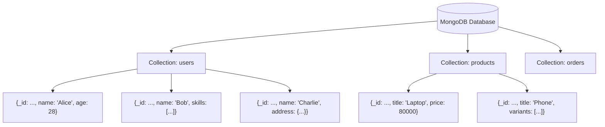
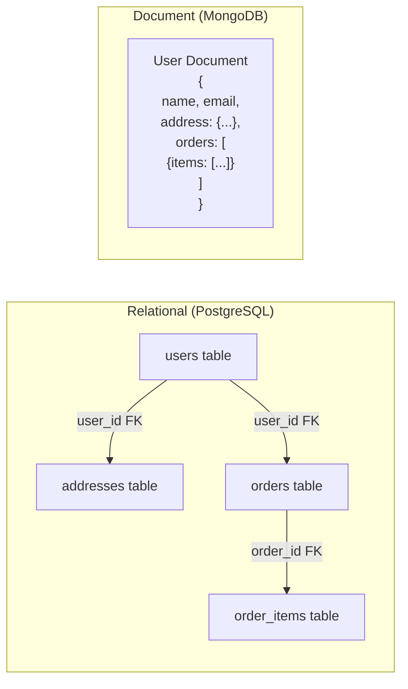
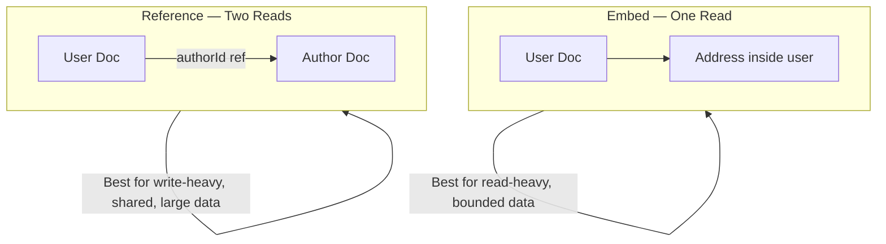
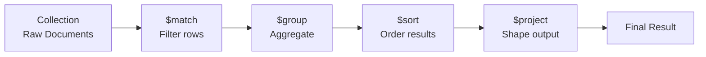
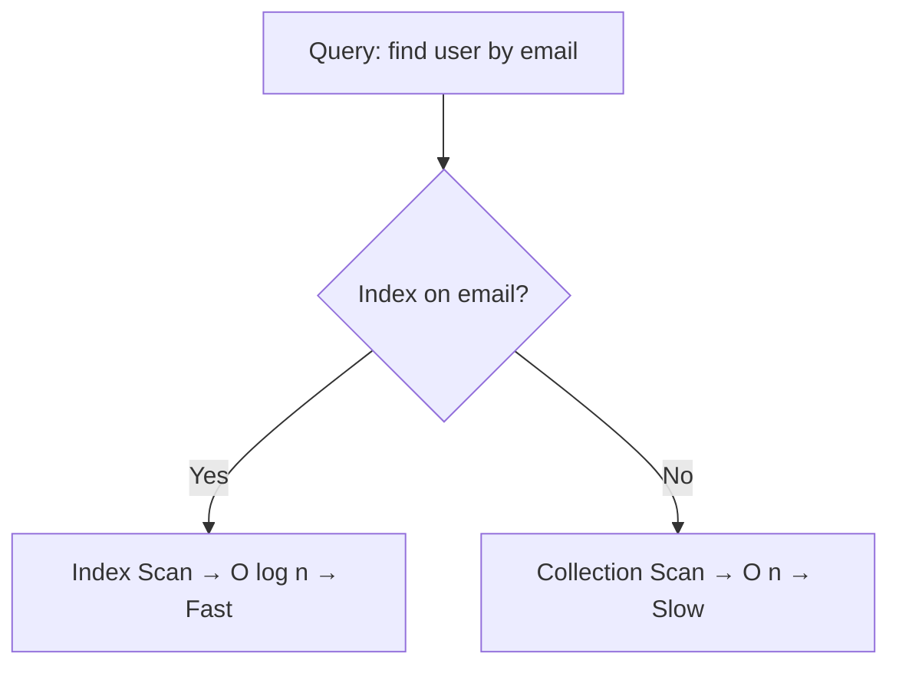
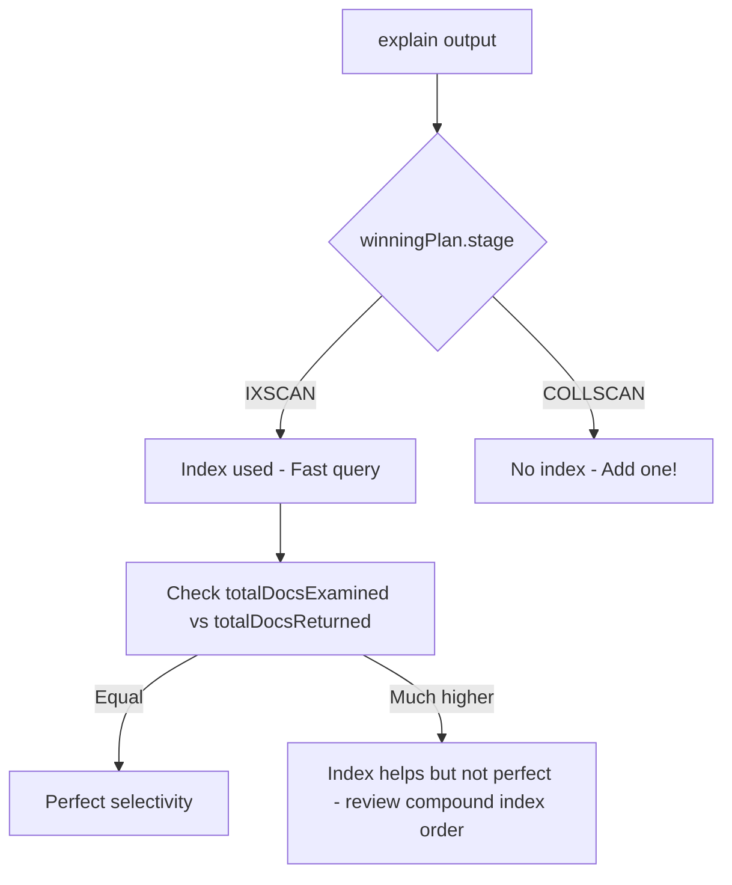
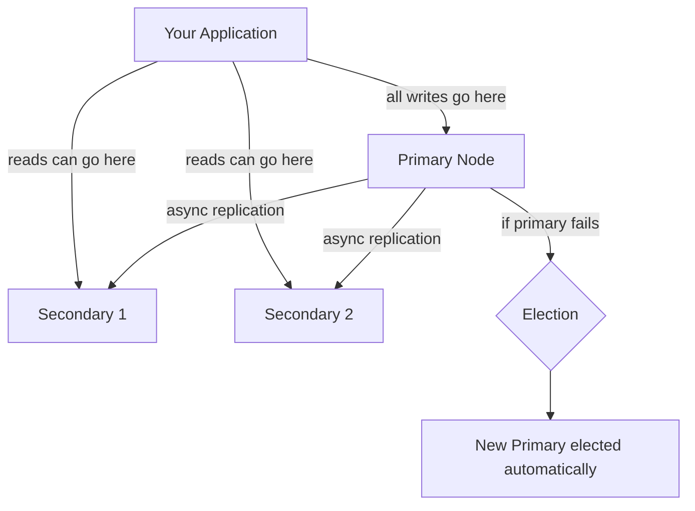
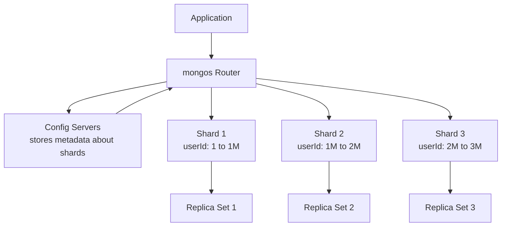
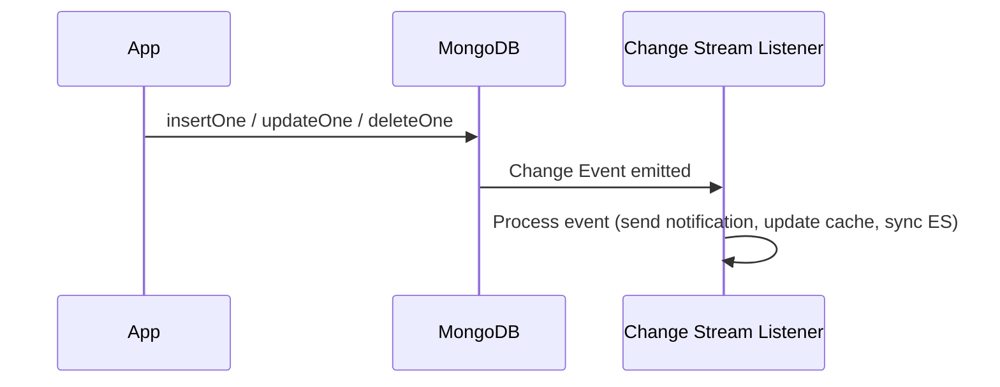
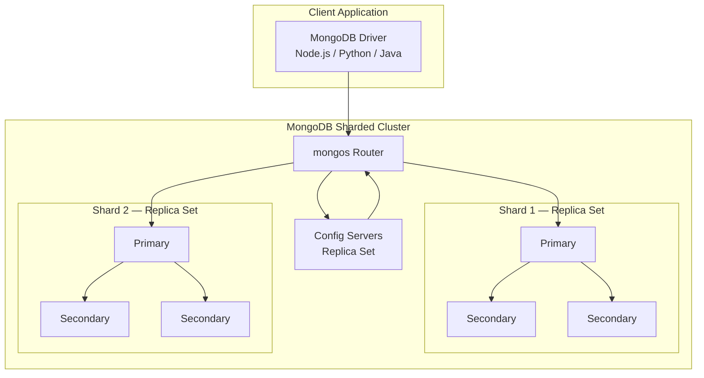

# MongoDB — NoSQL Document Database Deep Dive

> "Agar relational database ek strict spreadsheet hai, toh MongoDB ek sticky-notes ka drawer hai — har note alag dikh sakta hai, aur yehi toh iska point hai."

---

## 🗂️ MongoDB Hai Kya?

Socho tum ek library chala rahe ho. Traditional library (relational DB) mein har book ka card ek hi format follow karta hai: Title, Author, Year, Pages. Bas itna hi, na kam na zyada. Lekin real books toh messy hoti hain — kisi ki multiple authors hain, kisi mein series info hai, kisi mein audiobook links hain, kisi mein pages hi nahi hain (magazines). Isko handle karne ke liye tumhe paanch alag card types aur ek rule book chahiye hoga unko join karne ke liye.

MongoDB ek **document database** hai. Rows aur tables ki jagah, yeh **documents** store karta hai — self-contained JSON jaisi data blobs. Har document ka apna shape ho sakta hai. Database level pe koi shared schema force nahi hota.

### BSON Format Kya Hai?

MongoDB actually plain JSON store nahi karta. Yeh **BSON** (Binary JSON) store karta hai — ek binary-encoded superset of JSON jo extra data types add karta hai:

| Type | JSON | BSON adds |
|---|---|---|
| String | "hello" | same |
| Number | 42 | Int32, Int64, Double, Decimal128 |
| Date | "2024-01-01" (string hack) | native Date type |
| Binary | not supported | BinData |
| ObjectId | not supported | 12-byte unique ID |
| Regex | not supported | native regex |

Har document ko automatic `_id` field milta hai — ek 12-byte **ObjectId** jo timestamp, machine ID, process ID, aur ek counter encode karta hai. Yeh poori duniya mein unique hota hai bina kisi coordination ke — Zomato order ID jaisa, jo kabhi clash nahi karta.

```json
{
  "_id": ObjectId("64f1a2b3c4d5e6f7a8b9c0d1"),
  "name": "Siddesh Pansare",
  "email": "siddesh@example.com",
  "age": 22,
  "skills": ["Python", "MongoDB", "React"],
  "address": {
    "city": "Pune",
    "pin": "411001"
  },
  "createdAt": ISODate("2024-01-15T10:30:00Z")
}
```

Dekho: nested objects, arrays, mixed types — sab ek hi document mein. Koi joins ki zaroorat nahi.

---

## 🏗️ Collections Aur Documents



- **Database** — ek godown (warehouse) jaisa
- **Collection** — us godown ka ek rack (SQL table jaisa hi, loosely)
- **Document** — rack pe rakha ek box (SQL row jaisa, loosely)

Sabse badi baat: rack pe rakha har box ekdum alag shape ka ho sakta hai.

---

## ⚖️ MongoDB vs PostgreSQL — Kab Kya Choose Karo

Aise socho: PostgreSQL ek structured filing cabinet hai jisme labeled folders hain. MongoDB ek smart backpack hai — tum cheezein daalte jao, fast dhundh lo, aur jab chaho reorganize kar lo.

| Dimension | MongoDB | PostgreSQL |
|---|---|---|
| Schema | Flexible (schema-optional) | Strict (schema-required) |
| Data shape | Documents (nested, arrays) | Tables (flat rows) |
| Joins | Limited (use $lookup ya embed) | Native, powerful JOIN |
| Transactions | Supported (4.0+, multi-doc) | Battle-tested, full ACID |
| Scaling | Horizontal sharding built-in | Vertical first, sharding harder |
| Query language | MQL (MongoDB Query Language) | SQL |
| Best for | Variable schema, nested data, scale | Complex relations, strict integrity |
| Real-time changes | Change Streams built-in | Logical replication / triggers |

### MongoDB Use Karo Jab:

- Tumhara data shape baar-baar change hota hai (product catalogs jinke attributes alag-alag hain)
- Tumhare paas deeply nested ya hierarchical data hai (user profiles, API se aane wala JSON)
- Tumhe kayi servers pe horizontally scale karna hai
- Tum fast iterate kar rahe ho aur har sprint mein migrations afford nahi kar sakte
- Tumhe DB changes se real-time event streaming chahiye

### MongoDB Use MAT Karo Jab:

- Tumhe daily complex multi-table transactions chahiye (banking, payroll)
- Tumhara data highly relational aur normalized hai (ERP, accounting)
- Tumhari team already SQL jaanti hai aur data rows mein cleanly fit hota hai
- Tumhe strong schema enforcement ek safety net ki tarah chahiye

---

## 📐 Document Model vs Relational Model



Relational world mein tum data ko normalize karke alag tables mein daalte ho aur JOIN karte ho. MongoDB mein tum aksar related data ko ek hi document ke andar **embed** kar dete ho. Ek read, saara data mil gaya.

---

## 🧱 Data Modeling: Embedding vs Referencing

Yeh MongoDB ka sabse important design decision hai. Isko galat kiya toh tumhara app slow ho jayega ya data inconsistent ho jayega.

### Embedding Pattern (Denormalize)

Socho ek user profile jisme unke addresses bhi hain. Tum kabhi kisi ka address dhundhne ke liye alag drawer nahi khologe — woh unki file pe hi likha hota hai.

```javascript
// Embedded: address user document ke andar hi rehta hai
{
  "_id": ObjectId("..."),
  "name": "Alice",
  "addresses": [
    { "type": "home", "city": "Mumbai", "pin": "400001" },
    { "type": "work", "city": "Pune",   "pin": "411001" }
  ]
}
```

**Embedding kab use karo:**
- Jab embedded data hamesha parent ke saath hi read hota hai
- Jab embedded array bounded aur chhota ho (< 100 items)
- Jab data write se zyada read hota ho (read-heavy)
- Jab relationship "owned by" wala ho (address ek user ka hi hota hai)

### Referencing Pattern (Normalize)

Socho library books aur unke authors. Ek author kayi books likhta hai. Har book document ke andar poora author info store karna wasteful hoga aur inconsistent bhi — author ki bio change karo toh hazaron records update karne padenge.

```javascript
// Author document
{
  "_id": ObjectId("auth001"),
  "name": "Robert C. Martin",
  "bio": "Software engineer and author..."
}

// Book document — author ko ID se reference karta hai
{
  "_id": ObjectId("book001"),
  "title": "Clean Code",
  "authorId": ObjectId("auth001"),   // reference
  "year": 2008
}
```

**Referencing kab use karo:**
- Jab referenced data bada ho aur baar-baar change hota ho
- Jab kayi documents same data ko reference karte hain (write-heavy updates)
- Jab array unbounded grow ho sakta ho (jaise viral post ke saare comments)
- Jab relationship many-to-many ho



---

## 🛠️ CRUD Operations

### Insert

```javascript
// Ek document insert karo
db.users.insertOne({
  name: "Siddesh",
  email: "sid@example.com",
  age: 22,
  skills: ["Python", "MongoDB"]
});

// Ek saath kayi documents insert karo
db.users.insertMany([
  { name: "Alice", age: 25 },
  { name: "Bob",   age: 30 }
]);
```

### Read (Find)

```javascript
// Saare users dhundo
db.users.find({});

// Filter ke saath find — 21 se zyada age wale users
db.users.find({ age: { $gt: 21 } });

// Ek document dhundo
db.users.findOne({ email: "sid@example.com" });

// Projection — sirf name aur email return karo, _id exclude karo
db.users.find(
  { age: { $gt: 21 } },
  { name: 1, email: 1, _id: 0 }
);
```

### Update

```javascript
// $set — specific fields update karta hai (poora doc replace NAHI karta)
db.users.updateOne(
  { email: "sid@example.com" },
  { $set: { age: 23, city: "Pune" } }
);

// $push — array mein item add karo
db.users.updateOne(
  { email: "sid@example.com" },
  { $push: { skills: "Docker" } }
);

// $pull — array se item remove karo
db.users.updateOne(
  { email: "sid@example.com" },
  { $pull: { skills: "Python" } }
);

// $inc — numeric field increment karo
db.products.updateOne(
  { _id: ObjectId("...") },
  { $inc: { stock: -1 } }   // stock ko 1 se decrement karo
);

// updateMany — jitne bhi docs match karein sab update karo
db.users.updateMany(
  { age: { $lt: 18 } },
  { $set: { category: "minor" } }
);
```

### Delete

```javascript
// Ek matching document delete karo
db.users.deleteOne({ email: "sid@example.com" });

// Saare matching documents delete karo
db.users.deleteMany({ age: { $lt: 13 } });
```

---

## 🔍 Query Operators

MongoDB query operators tumhe filter object ke andar complex conditions likhne dete hain.

```javascript
// Comparison operators
db.products.find({ price: { $gt: 1000 } });         // greater than
db.products.find({ price: { $gte: 500, $lte: 2000 } }); // range
db.products.find({ category: { $in: ["phone", "tablet"] } }); // list mein hai
db.products.find({ category: { $nin: ["laptop"] } }); // list mein nahi hai
db.products.find({ discount: { $exists: true } });   // field exist karni chahiye

// Logical operators
db.users.find({
  $and: [
    { age: { $gte: 18 } },
    { age: { $lte: 30 } }
  ]
});

db.users.find({
  $or: [
    { city: "Mumbai" },
    { city: "Pune" }
  ]
});

// Regex operator — "S" se start hone wale naam wale users dhundo
db.users.find({ name: { $regex: /^S/i } });

// $elemMatch — un documents ko match karo jinke array mein koi ek element saari conditions satisfy kare
// Woh orders dhundo jinke items mein koi item quantity > 5 AND price < 100 ho
db.orders.find({
  items: {
    $elemMatch: { quantity: { $gt: 5 }, price: { $lt: 100 } }
  }
});
```

---

## 🔄 Aggregation Pipeline

Aggregation pipeline MongoDB ka analytics superpower hai. Isko ek assembly line samjho — tumhare documents ek end se enter hote hain, kayi stages se pass hote hain (har stage data ko transform karta hai), aur dusre end se processed results ban ke nikalte hain.



### Core Pipeline Stages

```javascript
// Example: Har category ka sales report, sirf un products ke liye jo Rs 500 se zyada hain
db.products.aggregate([

  // Stage 1: Filter — SQL WHERE jaisa
  { $match: { price: { $gt: 500 } } },

  // Stage 2: Group — SQL GROUP BY + aggregate functions jaisa
  {
    $group: {
      _id: "$category",              // is field ke basis pe group karo
      totalSales: { $sum: "$sales" },
      avgPrice:   { $avg: "$price" },
      count:      { $sum: 1 }
    }
  },

  // Stage 3: Sort — SQL ORDER BY jaisa
  { $sort: { totalSales: -1 } },    // -1 = descending

  // Stage 4: Limit — top 5
  { $limit: 5 },

  // Stage 5: Project — output ko reshape karo, SQL SELECT jaisa
  {
    $project: {
      category:   "$_id",
      totalSales: 1,
      avgPrice:   { $round: ["$avgPrice", 2] },
      _id: 0
    }
  }
]);
```

### $lookup — MongoDB Ka JOIN

```javascript
// orders ko users collection ke saath join karo
db.orders.aggregate([
  {
    $lookup: {
      from: "users",           // doosri collection
      localField: "userId",    // orders mein ka field
      foreignField: "_id",     // users mein ka field
      as: "userInfo"           // output array field ka naam
    }
  },
  // $unwind $lookup se bane array ko flatten karta hai
  { $unwind: "$userInfo" },
  {
    $project: {
      orderId: "$_id",
      total: 1,
      userName: "$userInfo.name",
      userEmail: "$userInfo.email"
    }
  }
]);
```

### $unwind

`$unwind` ek array field ko deconstruct karta hai — array ke har element ke liye ek separate document ban jaata hai. Socho ek order jisme 3 items hain, woh pipeline mein 3 alag documents ban jaata hai.

```javascript
// Original: { _id: 1, items: ["A", "B", "C"] }
// $unwind ke baad: { _id: 1, items: "A" }
//                  { _id: 1, items: "B" }
//                  { _id: 1, items: "C" }

db.orders.aggregate([
  { $unwind: "$items" },
  { $group: { _id: "$items.productId", totalQty: { $sum: "$items.qty" } } }
]);
```

---

## ⚡ Indexes

Bina index ke MongoDB collection ka har document scan karta hai (**collection scan**) — jaise ek word dhundhne ke liye poori book ka har page padhna. Index book ke index page jaisa hota hai: seedha sahi page pe le jaata hai.



### Index Types

```javascript
// Single field index
db.users.createIndex({ email: 1 });  // 1 = ascending, -1 = descending

// Compound index — jab query multiple fields pe filter karti ho
// Rule: order matter karta hai! Equality fields pehle, phir range fields, phir sort fields
db.products.createIndex({ category: 1, price: -1 });

// Text index — full-text search ke liye
db.articles.createIndex({ title: "text", body: "text" });
// Ab tum search kar sakte ho:
db.articles.find({ $text: { $search: "mongodb indexing" } });

// Geospatial index — location queries ke liye
db.stores.createIndex({ location: "2dsphere" });
// Ek point ke 5km ke andar wale stores dhundo:
db.stores.find({
  location: {
    $near: {
      $geometry: { type: "Point", coordinates: [73.85, 18.52] },
      $maxDistance: 5000
    }
  }
});

// Partial index — sirf un documents ko index karo jo ek filter match karte hain
// Space bachata hai aur specific queries fast karta hai
db.users.createIndex(
  { email: 1 },
  { partialFilterExpression: { active: true } }
);

// Sparse index — sirf un documents ko index karo jinme field exist karti ho
// Optional fields ke liye useful
db.users.createIndex({ phoneNumber: 1 }, { sparse: true });

// Unique index — uniqueness enforce karo
db.users.createIndex({ email: 1 }, { unique: true });
```

### explain() — Query Analysis

`explain()` tumhari query ka X-ray machine hai. Yeh exactly dikhata hai ki MongoDB query ko kaise execute karta hai.

```javascript
// Execution plan lo
db.users.find({ email: "sid@example.com" }).explain("executionStats");

// Output mein yeh cheezein check karo:
// winningPlan.stage: "IXSCAN" = good (index scan), "COLLSCAN" = bad (full scan)
// executionStats.totalDocsExamined: ideally totalDocsReturned ke barabar hona chahiye
// executionStats.executionTimeMillis: kitna time laga
```



---

## ☁️ MongoDB Atlas — Managed Cloud

MongoDB Atlas MongoDB ka cloud-hosted version hai. Isko "MongoDB as a Service" samjho — tum painful setup, backups, patching, aur hardware management skip kar dete ho. Bilkul waise hi jaise tum khud restaurant chalane ke bajaye Zomato pe order karte ho — infra ki tension khatam.

Key Atlas features:

| Feature | Kya karta hai |
|---|---|
| Global Clusters | Data ko regions mein distribute karta hai, worldwide low-latency reads ke liye |
| Atlas Search | Lucene-powered full-text search, MongoDB mein integrated |
| Atlas Charts | Tumhare data ke liye built-in dashboards |
| Atlas Triggers | DB events pe serverless functions run karta hai |
| Atlas Data API | Bina driver ke HTTP se MongoDB access karo |
| Backups | Automated point-in-time backups |
| Performance Advisor | Automatically indexes suggest karta hai |

Atlas tiers: Free (M0, shared), Dedicated (M10+), Serverless (pay per operation).

---

## 🔁 Replica Sets — High Availability

Socho ek company jiska poora customer data ek hi server pe hai. Agar woh server crash ho gaya, poora business ruk jayega. **Replica set** MongoDB ka solution hai — yeh tumhare data ki teen (ya usse zyada) copies alag-alag servers pe rakhta hai.



Yeh kaise kaam karta hai:

1. **Primary** — saare writes yahin aate hain. Inko **oplog** (operation log) mein log kiya jaata hai
2. **Secondaries** — primary ke oplog se continuously replicate karte rehte hain
3. **Automatic failover** — agar primary mar jaaye, secondaries ek election karte hain aur koi ek naya primary ban jaata hai (usually 10-30 seconds mein)
4. **Read preferences** — tum driver ko configure kar sakte ho ki secondaries se reads le, taaki read load spread ho jaaye

```javascript
// Connection string mein replica set specify karo
mongodb://host1:27017,host2:27017,host3:27017/?replicaSet=myReplicaSet

// Read preference options
// primary (default), primaryPreferred, secondary, secondaryPreferred, nearest
```

Replica sets tumhe deti hain: **availability** (node fail hone pe bhi chalta rehta hai), **durability** (data kayi machines pe hai), aur **read scaling** (reads ko secondaries pe route kar sakte ho).

---

## 📦 Sharding — Horizontal Scaling

Replica set har node pe same data rakhta hai — yeh failures handle karta hai, lekin massive data volume nahi. **Sharding** data ko multiple machines mein split karta hai, har machine total data ka ek **shard** rakhti hai.

Real-world analogy: Ek hi bada post office saara mail handle karne ke bajaye, tum PIN code se split kar dete ho — "4" se start hone wale PIN codes post office A jaate hain, "5" se start hone wale B mein, waise hi.



### Components

- **mongos** — router. Tumhara app sirf mongos se baat karta hai; ise pata hota hai konsa data konse shard pe hai
- **Config Servers** — ek replica set jo cluster metadata store karta hai (data ka konsa chunk konse shard pe hai)
- **Shards** — har shard khud ek replica set hota hai (data + HA dono)

### Shard Key Selection — Sabse Important Decision

Shard key decide karta hai ki MongoDB data ko shards mein kaise distribute karega. Galat shard key **hot spots** create karta hai — ek shard pe saara traffic aa jaata hai jabki baaki idle baithe rehte hain.

```javascript
// Database pe sharding enable karo
sh.enableSharding("mydb");

// users collection ko userId se shard karo (hashed for even distribution)
sh.shardCollection("mydb.users", { userId: "hashed" });

// orders ko customerId + createdAt se shard karo (range-based — time-series queries ke liye achha)
sh.shardCollection("mydb.orders", { customerId: 1, createdAt: 1 });
```

| Shard Key Type | Kaise kaam karta hai | Kis liye achha hai |
|---|---|---|
| Range-based | Close key values wale documents same shard pe jaate hain | Range queries, sorted reads |
| Hashed | Key ka hash decide karta hai konsa shard | Even write distribution, random access |
| Zone-based | Key ranges ko explicitly shards se map karo | Geographic data locality |

**Bad shard key ke signs:** monotonically increasing key (jaise timestamp) ke saath range sharding — saare new inserts ek hi shard pe jaate hain. Timestamps ke liye hashed sharding use karo.

---

## 🔐 Transactions — Multi-Document ACID

MongoDB 4.0 se pehle, har single document operation atomic tha lekin multi-document operations nahi the. MongoDB 4.0 ne **multi-document ACID transactions** introduce kiye, SQL transactions jaisa hi.

```javascript
// Session start karo
const session = db.getMongo().startSession();

try {
  session.startTransaction({
    readConcern: { level: "snapshot" },
    writeConcern: { w: "majority" }
  });

  const users = session.getDatabase("mydb").users;
  const accounts = session.getDatabase("mydb").accounts;

  // Alice se Bob ko Rs 1000 transfer karo
  accounts.updateOne(
    { userId: "alice" },
    { $inc: { balance: -1000 } },
    { session }
  );

  accounts.updateOne(
    { userId: "bob" },
    { $inc: { balance: 1000 } },
    { session }
  );

  // Commit — dono updates hote hain ya koi bhi nahi
  await session.commitTransaction();
  console.log("Transfer successful");

} catch (error) {
  // Abort — is transaction ke saare changes rollback ho jaate hain
  await session.abortTransaction();
  console.error("Transfer failed, rolled back:", error);

} finally {
  session.endSession();
}
```

Transactions ke important points:
- Yeh multiple documents AUR multiple collections ke across kaam karte hain
- Inko replica set (ya sharded cluster) chahiye hota hai
- Yeh performance overhead laate hain — sirf zaroorat pe hi use karo
- Transactions short rakho — long-running transactions lock contention create karte hain
- Zyadatar use cases ke liye, related data ko ek document mein embed karo aur single-document atomicity pe rely karo (jo free aur fast hai)

---

## 📡 Change Streams — Real-Time Event Notifications

Change Streams tumhare application ko ek collection (ya poori database) **watch** karne dete hain aur data change hote hi instantly react karne dete hain — jaise tum apne database ka ek live news feed subscribe kar rahe ho.



```javascript
// Ek collection ko kisi bhi change ke liye watch karo
const changeStream = db.orders.watch();

changeStream.on("change", (change) => {
  console.log("Change detected:", change.operationType);
  // operationType: "insert", "update", "delete", "replace"

  if (change.operationType === "insert") {
    const newOrder = change.fullDocument;
    sendEmailConfirmation(newOrder);
  }

  if (change.operationType === "update") {
    const updatedFields = change.updateDescription.updatedFields;
    if (updatedFields.status === "shipped") {
      sendShippingNotification(change.documentKey._id);
    }
  }
});

// Filter pipeline ke saath watch karo — sirf high-value orders ki fikar karo
const pipeline = [
  { $match: {
      operationType: "insert",
      "fullDocument.total": { $gt: 10000 }
  }}
];

const filteredStream = db.orders.watch(pipeline, { fullDocument: "updateLookup" });
```

Change Streams **oplog** (operations log) pe built hote hain — wahi mechanism jo replica set replication use karta hai. Yeh resumable hote hain — agar tumhara listener crash ho jaaye, tum ek **resume token** se resume kar sakte ho, koi event miss nahi hota.

**Change Streams ke use cases:**
- Order ship hone pe push notification bhejna
- Data change hone pe cache invalidate karna
- MongoDB data ko Elasticsearch mein sync karna full-text search ke liye
- Audit logs
- Real-time dashboards

---

## 📊 Complete Architecture Overview



---

## 🚀 Real-World Example: E-Commerce Product Catalog

Ek product catalog MongoDB ka sweet spot hai — products ke attributes bilkul alag-alag hote hain (ek shirt ke size/color hote hain, laptop ke RAM/CPU, book ke ISBN/author).

```javascript
// Clothing product
{
  "_id": ObjectId("..."),
  "type": "clothing",
  "name": "Premium Cotton T-Shirt",
  "brand": "FabIndia",
  "price": 799,
  "attributes": {
    "sizes": ["S", "M", "L", "XL"],
    "colors": ["white", "navy", "grey"],
    "material": "100% cotton"
  },
  "inventory": [
    { "sku": "shirt-S-white", "stock": 45 },
    { "sku": "shirt-M-navy",  "stock": 12 }
  ],
  "tags": ["casual", "summer", "cotton"],
  "ratings": { "avg": 4.3, "count": 128 }
}

// Electronics product — bilkul alag shape, same collection
{
  "_id": ObjectId("..."),
  "type": "electronics",
  "name": "Laptop Pro 15",
  "brand": "Dell",
  "price": 75000,
  "attributes": {
    "ram": "16GB",
    "storage": "512GB SSD",
    "processor": "Intel i7-12th Gen",
    "display": "15.6 inch FHD",
    "battery": "86WHr"
  },
  "warranty": { "years": 1, "type": "carry-in" },
  "tags": ["laptop", "business", "gaming-capable"]
}
```

PostgreSQL mein tumhe iske liye EAV (Entity-Attribute-Value) table ya JSONB column chahiye hota — dono hi clunky hain. MongoDB isko naturally handle kar leta hai.

> [!tip]
> Jaise Flipkart ya Amazon pe alag-alag category ke products ka listing page dekho — shirt ke filters alag hain, laptop ke alag. Backend mein yeh sab ek hi "products" collection mein reh sakte hain, bina kisi rigid schema ke.

---

## 📋 Key Takeaways

| Concept | Core idea |
|---|---|
| Document model | Self-contained JSON jaisi BSON documents, schema-flexible |
| BSON | Extra types wali Binary JSON: ObjectId, Date, Int64, BinData |
| Embedding vs Referencing | Read-heavy/bounded ke liye Embed; write-heavy/shared/large ke liye Reference |
| CRUD | insertOne/Many, find/findOne, updateOne with $set/$push/$pull, deleteOne |
| Query operators | $gt/$lt/$in/$regex/$elemMatch/$exists/$and/$or |
| Aggregation pipeline | $match → $group → $sort → $project → $lookup → $unwind |
| Indexes | Single, compound, text, geospatial, partial, sparse — explain() se verify karo |
| Atlas | Managed cloud MongoDB with Search, Triggers, Charts, Backups |
| Replica sets | Primary + Secondaries with automatic failover, HA ke liye |
| Sharding | Shard key se horizontal scale — even write distribution ke liye hashed use karo |
| Transactions | 4.0 se multi-document ACID — sparingly use karo, single-doc atomicity ko prefer karo |
| Change Streams | Real-time oplog-based event streaming, resume token se resumable |

> Golden rule of MongoDB: **apna schema queries ke around design karo, data ke around nahi**. Pehle yeh jaano ki tum kya sabse zyada read karoge, aur documents ko waise model karo ki woh read ek hi trip mein satisfy ho jaaye.
