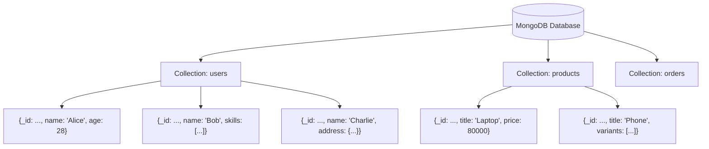
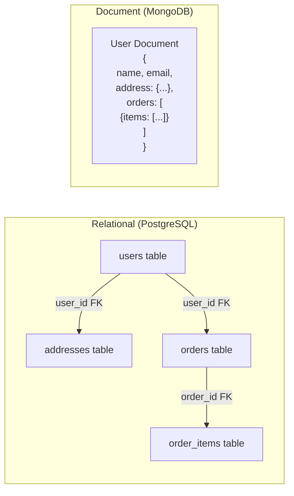
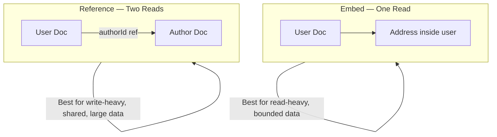
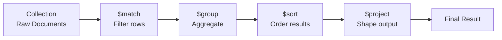
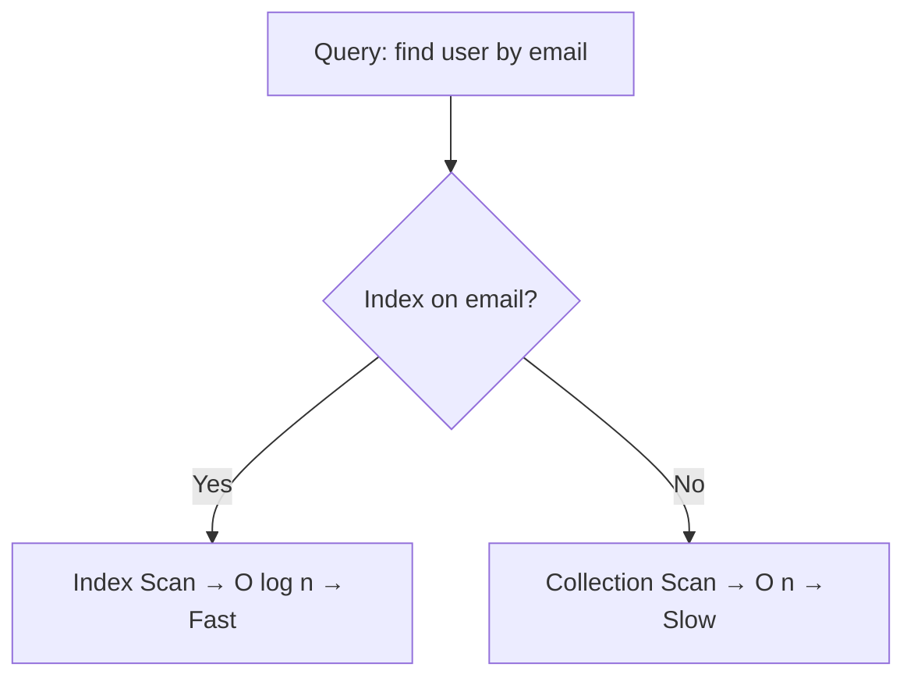
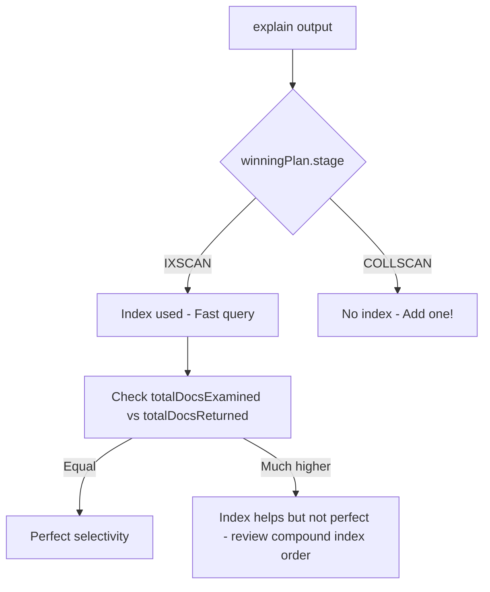
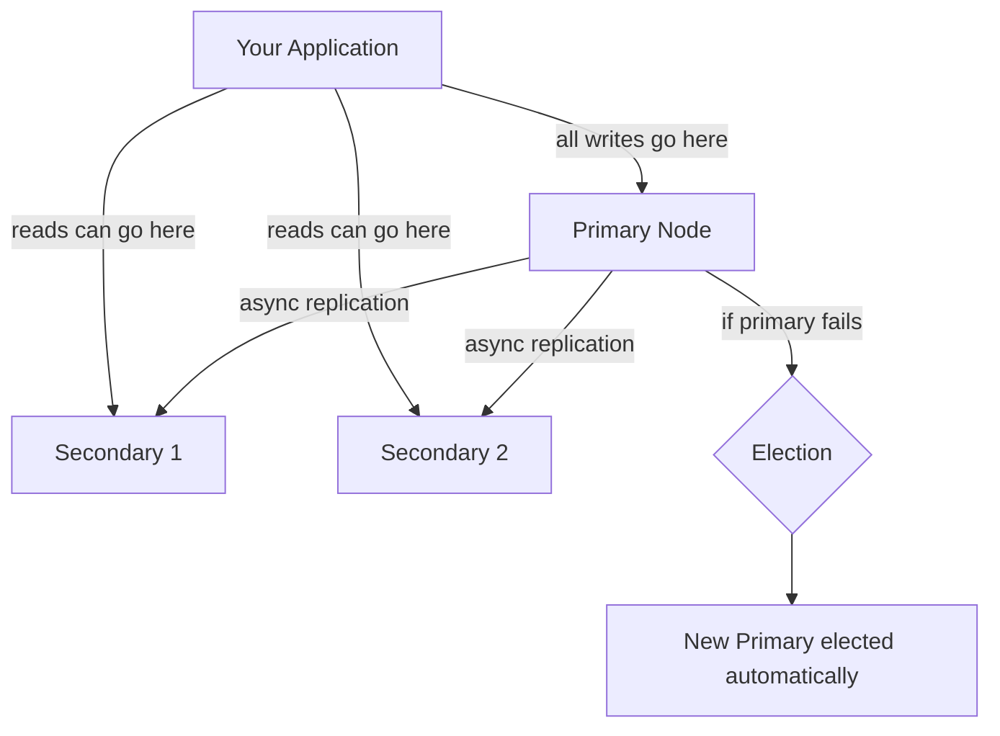
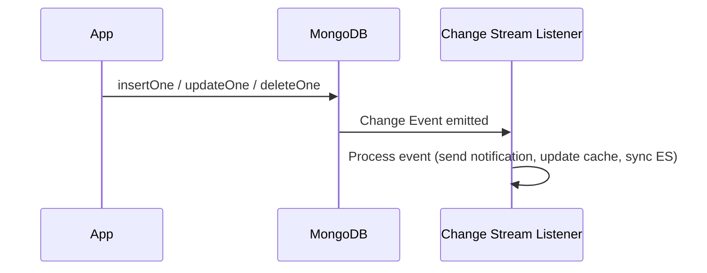
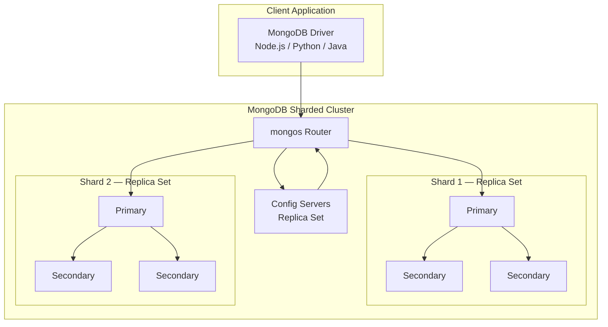

# MongoDB — NoSQL Document Database Deep Dive

> "If a relational database is a rigid spreadsheet, MongoDB is a drawer full of sticky notes — each note can look completely different, and that is exactly the point."

---

## 🗂️ What is MongoDB?

Imagine you are running a library. In a traditional library (relational DB), every book must have the exact same card format: Title, Author, Year, Pages. No more, no less. But real books are messy — some have multiple authors, some have series info, some have audiobook links, some have zero pages (magazines). You would need five different card types and a rule book to join them together.

MongoDB is a **document database**. Instead of rows in tables, it stores **documents** — self-contained JSON-like blobs of data. Each document can have its own shape. No shared schema enforced at the database level.

### The BSON Format

MongoDB does not actually store plain JSON. It stores **BSON** (Binary JSON) — a binary-encoded superset of JSON that adds extra data types:

| Type | JSON | BSON adds |
|---|---|---|
| String | "hello" | same |
| Number | 42 | Int32, Int64, Double, Decimal128 |
| Date | "2024-01-01" (string hack) | native Date type |
| Binary | not supported | BinData |
| ObjectId | not supported | 12-byte unique ID |
| Regex | not supported | native regex |

Every document gets an automatic `_id` field — a 12-byte **ObjectId** that encodes timestamp, machine ID, process ID, and a counter. It is unique across the planet without coordination.

```json
{
  "_id": ObjectId("64f1a2b3c4d5e6f7a8b9c0d1"),
  "name": "Siddesh Pansare",
  "email": "siddesh@example.com",
  "age": 22,
  "skills": ["Python", "MongoDB", "React"],
  "address": {
    "city": "Pune",
    "pin": "411001"
  },
  "createdAt": ISODate("2024-01-15T10:30:00Z")
}
```

Notice: nested objects, arrays, mixed types — all in one document. No joins needed.

---

## 🏗️ Collections and Documents



- **Database** — like a warehouse
- **Collection** — like a shelf in that warehouse (loosely equivalent to a SQL table)
- **Document** — like a box on that shelf (loosely equivalent to a SQL row)

The key difference: every box on the shelf can be a completely different shape.

---

## ⚖️ MongoDB vs PostgreSQL — When to Choose What

Think of it this way: PostgreSQL is a structured filing cabinet with labeled folders. MongoDB is a smart backpack — you shove things in, find them fast, and reorganize freely.

| Dimension | MongoDB | PostgreSQL |
|---|---|---|
| Schema | Flexible (schema-optional) | Strict (schema-required) |
| Data shape | Documents (nested, arrays) | Tables (flat rows) |
| Joins | Limited (use $lookup or embed) | Native, powerful JOIN |
| Transactions | Supported (4.0+, multi-doc) | Battle-tested, full ACID |
| Scaling | Horizontal sharding built-in | Vertical first, sharding harder |
| Query language | MQL (MongoDB Query Language) | SQL |
| Best for | Variable schema, nested data, scale | Complex relations, strict integrity |
| Real-time changes | Change Streams built-in | Logical replication / triggers |

### Use MongoDB when:

- Your data shape changes frequently (product catalogs with varying attributes)
- You have deeply nested or hierarchical data (user profiles, JSON from APIs)
- You need to scale horizontally across many servers
- You are iterating fast and cannot afford migrations every sprint
- You need real-time event streaming from DB changes

### Do NOT use MongoDB when:

- You need complex multi-table transactions daily (banking, payroll)
- Your data is highly relational and normalized (ERP, accounting)
- Your team already knows SQL and the data fits rows cleanly
- You need strong schema enforcement as a safety net

---

## 📐 Document Model vs Relational Model



In the relational world, you normalize data into separate tables and JOIN them. In MongoDB, you often **embed** related data inside a single document. One read, all the data you need.

---

## 🧱 Data Modeling: Embedding vs Referencing

This is the most important design decision in MongoDB. Get it wrong and your app becomes slow or inconsistent.

### The Embedding Pattern (Denormalize)

Think of a user profile that includes their addresses. You would never open a separate drawer to find someone's address — it is written right on their file.

```javascript
// Embedded: address lives inside the user document
{
  "_id": ObjectId("..."),
  "name": "Alice",
  "addresses": [
    { "type": "home", "city": "Mumbai", "pin": "400001" },
    { "type": "work", "city": "Pune",   "pin": "411001" }
  ]
}
```

**Use embedding when:**
- The embedded data is always read together with the parent
- The embedded array is bounded and small (< 100 items)
- Data is read much more often than written (read-heavy)
- The relationship is "owned by" (address belongs to one user)

### The Referencing Pattern (Normalize)

Think of library books and their authors. An author writes many books. Storing the full author info inside every book document would be wasteful and inconsistent — change the author's bio and you update thousands of records.

```javascript
// Author document
{
  "_id": ObjectId("auth001"),
  "name": "Robert C. Martin",
  "bio": "Software engineer and author..."
}

// Book document — references author by ID
{
  "_id": ObjectId("book001"),
  "title": "Clean Code",
  "authorId": ObjectId("auth001"),   // reference
  "year": 2008
}
```

**Use referencing when:**
- The referenced data is large and changes frequently
- Many documents reference the same data (write-heavy updates)
- The array could grow without bound (e.g., all comments on a viral post)
- The relationship is many-to-many



---

## 🛠️ CRUD Operations

### Insert

```javascript
// Insert one document
db.users.insertOne({
  name: "Siddesh",
  email: "sid@example.com",
  age: 22,
  skills: ["Python", "MongoDB"]
});

// Insert many documents at once
db.users.insertMany([
  { name: "Alice", age: 25 },
  { name: "Bob",   age: 30 }
]);
```

### Read (Find)

```javascript
// Find all users
db.users.find({});

// Find with filter — users older than 21
db.users.find({ age: { $gt: 21 } });

// Find one document
db.users.findOne({ email: "sid@example.com" });

// Projection — only return name and email, exclude _id
db.users.find(
  { age: { $gt: 21 } },
  { name: 1, email: 1, _id: 0 }
);
```

### Update

```javascript
// $set — update specific fields (does NOT replace the whole doc)
db.users.updateOne(
  { email: "sid@example.com" },
  { $set: { age: 23, city: "Pune" } }
);

// $push — add item to an array
db.users.updateOne(
  { email: "sid@example.com" },
  { $push: { skills: "Docker" } }
);

// $pull — remove item from an array
db.users.updateOne(
  { email: "sid@example.com" },
  { $pull: { skills: "Python" } }
);

// $inc — increment a numeric field
db.products.updateOne(
  { _id: ObjectId("...") },
  { $inc: { stock: -1 } }   // decrement stock by 1
);

// updateMany — update all matching docs
db.users.updateMany(
  { age: { $lt: 18 } },
  { $set: { category: "minor" } }
);
```

### Delete

```javascript
// Delete one matching document
db.users.deleteOne({ email: "sid@example.com" });

// Delete all matching documents
db.users.deleteMany({ age: { $lt: 13 } });
```

---

## 🔍 Query Operators

MongoDB query operators let you express complex conditions inside the filter object.

```javascript
// Comparison operators
db.products.find({ price: { $gt: 1000 } });         // greater than
db.products.find({ price: { $gte: 500, $lte: 2000 } }); // range
db.products.find({ category: { $in: ["phone", "tablet"] } }); // in list
db.products.find({ category: { $nin: ["laptop"] } }); // not in list
db.products.find({ discount: { $exists: true } });   // field must exist

// Logical operators
db.users.find({
  $and: [
    { age: { $gte: 18 } },
    { age: { $lte: 30 } }
  ]
});

db.users.find({
  $or: [
    { city: "Mumbai" },
    { city: "Pune" }
  ]
});

// Regex operator — find users whose name starts with "S"
db.users.find({ name: { $regex: /^S/i } });

// $elemMatch — match documents where at least one array element meets ALL conditions
// Find orders that have an item with quantity > 5 AND price < 100
db.orders.find({
  items: {
    $elemMatch: { quantity: { $gt: 5 }, price: { $lt: 100 } }
  }
});
```

---

## 🔄 Aggregation Pipeline

The aggregation pipeline is MongoDB's superpower for analytics. Think of it as an assembly line — your documents enter one end, pass through multiple stages (each stage transforms the data), and come out the other end as processed results.



### Core Pipeline Stages

```javascript
// Example: Sales report per category, only for products > Rs 500
db.products.aggregate([

  // Stage 1: Filter — like SQL WHERE
  { $match: { price: { $gt: 500 } } },

  // Stage 2: Group — like SQL GROUP BY + aggregate functions
  {
    $group: {
      _id: "$category",              // group by this field
      totalSales: { $sum: "$sales" },
      avgPrice:   { $avg: "$price" },
      count:      { $sum: 1 }
    }
  },

  // Stage 3: Sort — like SQL ORDER BY
  { $sort: { totalSales: -1 } },    // -1 = descending

  // Stage 4: Limit — top 5
  { $limit: 5 },

  // Stage 5: Project — reshape the output, like SQL SELECT
  {
    $project: {
      category:   "$_id",
      totalSales: 1,
      avgPrice:   { $round: ["$avgPrice", 2] },
      _id: 0
    }
  }
]);
```

### $lookup — The JOIN of MongoDB

```javascript
// Join orders with users collection
db.orders.aggregate([
  {
    $lookup: {
      from: "users",           // the other collection
      localField: "userId",    // field in orders
      foreignField: "_id",     // field in users
      as: "userInfo"           // output array field name
    }
  },
  // $unwind flattens the array created by $lookup
  { $unwind: "$userInfo" },
  {
    $project: {
      orderId: "$_id",
      total: 1,
      userName: "$userInfo.name",
      userEmail: "$userInfo.email"
    }
  }
]);
```

### $unwind

`$unwind` deconstructs an array field — one document per array element. Imagine a single order with 3 items becoming 3 separate documents in the pipeline.

```javascript
// Original: { _id: 1, items: ["A", "B", "C"] }
// After $unwind: { _id: 1, items: "A" }
//                { _id: 1, items: "B" }
//                { _id: 1, items: "C" }

db.orders.aggregate([
  { $unwind: "$items" },
  { $group: { _id: "$items.productId", totalQty: { $sum: "$items.qty" } } }
]);
```

---

## ⚡ Indexes

Without indexes, MongoDB scans every document in a collection (a **collection scan**) — like reading every page of a book to find one word. An index is like the book's index: it points directly to the right page.



### Types of Indexes

```javascript
// Single field index
db.users.createIndex({ email: 1 });  // 1 = ascending, -1 = descending

// Compound index — for queries that filter on multiple fields
// Rule: order matters! Put equality fields first, then range fields, then sort fields
db.products.createIndex({ category: 1, price: -1 });

// Text index — for full-text search
db.articles.createIndex({ title: "text", body: "text" });
// Now you can search:
db.articles.find({ $text: { $search: "mongodb indexing" } });

// Geospatial index — for location queries
db.stores.createIndex({ location: "2dsphere" });
// Find stores within 5km of a point:
db.stores.find({
  location: {
    $near: {
      $geometry: { type: "Point", coordinates: [73.85, 18.52] },
      $maxDistance: 5000
    }
  }
});

// Partial index — index only documents that match a filter
// Saves space and speeds up specific queries
db.users.createIndex(
  { email: 1 },
  { partialFilterExpression: { active: true } }
);

// Sparse index — only index documents where the field exists
// Useful for optional fields
db.users.createIndex({ phoneNumber: 1 }, { sparse: true });

// Unique index — enforce uniqueness
db.users.createIndex({ email: 1 }, { unique: true });
```

### explain() — Query Analysis

`explain()` is your X-ray machine for queries. It shows exactly how MongoDB executes a query.

```javascript
// Get the execution plan
db.users.find({ email: "sid@example.com" }).explain("executionStats");

// Key things to look for in the output:
// winningPlan.stage: "IXSCAN" = good (index scan), "COLLSCAN" = bad (full scan)
// executionStats.totalDocsExamined: should equal totalDocsReturned ideally
// executionStats.executionTimeMillis: how long it took
```



---

## ☁️ MongoDB Atlas — Managed Cloud

MongoDB Atlas is the cloud-hosted version of MongoDB. Think of it as "MongoDB as a Service" — you skip the painful setup, backups, patching, and hardware management.

Key Atlas features:

| Feature | What it does |
|---|---|
| Global Clusters | Distribute data across regions for low-latency reads worldwide |
| Atlas Search | Full-text search powered by Lucene, integrated into MongoDB |
| Atlas Charts | Built-in dashboards for your data |
| Atlas Triggers | Run serverless functions on DB events |
| Atlas Data API | Access MongoDB over HTTP without a driver |
| Backups | Automated point-in-time backups |
| Performance Advisor | Automatically suggests indexes |

Atlas tiers: Free (M0, shared), Dedicated (M10+), Serverless (pay per operation).

---

## 🔁 Replica Sets — High Availability

Imagine a company with one server storing all customer data. If that server crashes, the entire business stops. A **replica set** is MongoDB's solution — it keeps three (or more) copies of your data across different servers.



How it works:

1. **Primary** — receives all writes. Logs them in the **oplog** (operation log)
2. **Secondaries** — constantly replicate from the primary's oplog
3. **Automatic failover** — if the primary dies, secondaries hold an election and one becomes the new primary (usually within 10-30 seconds)
4. **Read preferences** — you can configure the driver to read from secondaries to spread read load

```javascript
// In your connection string, specify replica set
mongodb://host1:27017,host2:27017,host3:27017/?replicaSet=myReplicaSet

// Read preference options
// primary (default), primaryPreferred, secondary, secondaryPreferred, nearest
```

Replica sets give you: **availability** (survives node failure), **durability** (data on multiple machines), and **read scaling** (route reads to secondaries).

---

## 📦 Sharding — Horizontal Scaling

A replica set keeps the same data on every node — it handles failures but not massive data volume. **Sharding** splits data across multiple machines, each holding a **shard** of the total data.

Real-world analogy: Instead of one giant post office handling all mail, you split by ZIP code — PIN codes starting with 4 go to post office A, starting with 5 go to B, etc.

```mermaid
graph TD
    APP[Application] --> MG[mongos Router]
    MG --> CS[Config Servers<br/>stores metadata about shards]
    CS --> MG

    MG --> SH1[Shard 1<br/>userId: 1 to 1M]
    MG --> SH2[Shard 2<br/>userId: 1M to 2M]
    MG --> SH3[Shard 3<br/>userId: 2M to 3M]

    SH1 --> R1[Replica Set 1]
    SH2 --> R2[Replica Set 2]
    SH3 --> R3[Replica Set 3]
```



### Components

- **mongos** — the router. Your app talks only to mongos; it knows which shard has which data
- **Config Servers** — a replica set storing the cluster metadata (which chunk of data lives on which shard)
- **Shards** — each shard is itself a replica set (data + HA)

### Shard Key Selection — The Most Important Decision

The shard key determines how MongoDB distributes data across shards. A bad shard key creates **hot spots** — one shard gets all the traffic while others sit idle.

```javascript
// Enable sharding on a database
sh.enableSharding("mydb");

// Shard the users collection by userId (hashed for even distribution)
sh.shardCollection("mydb.users", { userId: "hashed" });

// Shard orders by customerId + createdAt (range-based — good for time-series queries)
sh.shardCollection("mydb.orders", { customerId: 1, createdAt: 1 });
```

| Shard Key Type | How it works | Good for |
|---|---|---|
| Range-based | Documents with close key values go to same shard | Range queries, sorted reads |
| Hashed | Hash of the key determines shard | Even write distribution, random access |
| Zone-based | Explicitly map key ranges to shards | Geographic data locality |

**Bad shard key signs:** monotonically increasing key (like timestamp) with range sharding — all new inserts go to one shard. Use hashed sharding for timestamps.

---

## 🔐 Transactions — Multi-Document ACID

Before MongoDB 4.0, each document operation was atomic but multi-document operations were not. MongoDB 4.0 introduced **multi-document ACID transactions**, similar to SQL transactions.

```javascript
// Start a session
const session = db.getMongo().startSession();

try {
  session.startTransaction({
    readConcern: { level: "snapshot" },
    writeConcern: { w: "majority" }
  });

  const users = session.getDatabase("mydb").users;
  const accounts = session.getDatabase("mydb").accounts;

  // Transfer Rs 1000 from Alice to Bob
  accounts.updateOne(
    { userId: "alice" },
    { $inc: { balance: -1000 } },
    { session }
  );

  accounts.updateOne(
    { userId: "bob" },
    { $inc: { balance: 1000 } },
    { session }
  );

  // Commit — both updates happen or neither does
  await session.commitTransaction();
  console.log("Transfer successful");

} catch (error) {
  // Abort — rolls back all changes in this transaction
  await session.abortTransaction();
  console.error("Transfer failed, rolled back:", error);

} finally {
  session.endSession();
}
```

Important notes on transactions:
- They work across multiple documents AND multiple collections
- They require a replica set (or sharded cluster)
- They carry performance overhead — use them only when needed
- Keep transactions short — long-running transactions cause lock contention
- For most use cases, embed related data in one document and rely on single-document atomicity (which is free and fast)

---

## 📡 Change Streams — Real-Time Event Notifications

Change Streams let your application **watch** a collection (or entire database) and react instantly when data changes — like subscribing to a live news feed of your database.



```javascript
// Watch a collection for any changes
const changeStream = db.orders.watch();

changeStream.on("change", (change) => {
  console.log("Change detected:", change.operationType);
  // operationType: "insert", "update", "delete", "replace"

  if (change.operationType === "insert") {
    const newOrder = change.fullDocument;
    sendEmailConfirmation(newOrder);
  }

  if (change.operationType === "update") {
    const updatedFields = change.updateDescription.updatedFields;
    if (updatedFields.status === "shipped") {
      sendShippingNotification(change.documentKey._id);
    }
  }
});

// Watch with a filter pipeline — only care about high-value orders
const pipeline = [
  { $match: {
      operationType: "insert",
      "fullDocument.total": { $gt: 10000 }
  }}
];

const filteredStream = db.orders.watch(pipeline, { fullDocument: "updateLookup" });
```

Change Streams are built on the **oplog** (operations log) — the same mechanism used by replica set replication. They are resumable — if your listener crashes, you can resume from a **resume token** so no events are missed.

**Use cases for Change Streams:**
- Push notifications when an order ships
- Invalidate cache when data changes
- Sync MongoDB data to Elasticsearch for full-text search
- Audit logs
- Real-time dashboards

---

## 📊 Complete Architecture Overview



---

## 🚀 Real-World Example: E-Commerce Product Catalog

A product catalog is MongoDB's sweet spot — products have wildly different attributes (a shirt has size/color, a laptop has RAM/CPU, a book has ISBN/author).

```javascript
// Clothing product
{
  "_id": ObjectId("..."),
  "type": "clothing",
  "name": "Premium Cotton T-Shirt",
  "brand": "FabIndia",
  "price": 799,
  "attributes": {
    "sizes": ["S", "M", "L", "XL"],
    "colors": ["white", "navy", "grey"],
    "material": "100% cotton"
  },
  "inventory": [
    { "sku": "shirt-S-white", "stock": 45 },
    { "sku": "shirt-M-navy",  "stock": 12 }
  ],
  "tags": ["casual", "summer", "cotton"],
  "ratings": { "avg": 4.3, "count": 128 }
}

// Electronics product — completely different shape, same collection
{
  "_id": ObjectId("..."),
  "type": "electronics",
  "name": "Laptop Pro 15",
  "brand": "Dell",
  "price": 75000,
  "attributes": {
    "ram": "16GB",
    "storage": "512GB SSD",
    "processor": "Intel i7-12th Gen",
    "display": "15.6 inch FHD",
    "battery": "86WHr"
  },
  "warranty": { "years": 1, "type": "carry-in" },
  "tags": ["laptop", "business", "gaming-capable"]
}
```

In PostgreSQL you would need an EAV (Entity-Attribute-Value) table or JSONB column — both are clunky. MongoDB handles this naturally.

---

## 📋 Key Takeaways

| Concept | Core idea |
|---|---|
| Document model | Self-contained JSON-like BSON documents, schema-flexible |
| BSON | Binary JSON with extra types: ObjectId, Date, Int64, BinData |
| Embedding vs Referencing | Embed for read-heavy/bounded; Reference for write-heavy/shared/large |
| CRUD | insertOne/Many, find/findOne, updateOne with $set/$push/$pull, deleteOne |
| Query operators | $gt/$lt/$in/$regex/$elemMatch/$exists/$and/$or |
| Aggregation pipeline | $match → $group → $sort → $project → $lookup → $unwind |
| Indexes | Single, compound, text, geospatial, partial, sparse — use explain() to verify |
| Atlas | Managed cloud MongoDB with Search, Triggers, Charts, Backups |
| Replica sets | Primary + Secondaries with automatic failover for HA |
| Sharding | Horizontal scale via shard key — hashed for even write distribution |
| Transactions | Multi-document ACID since 4.0 — use sparingly, prefer single-doc atomicity |
| Change Streams | Real-time oplog-based event streaming, resumable via resume token |

> The golden rule of MongoDB: **design your schema around your queries, not around your data**. Know what you will read most, and model your documents so that read satisfies in one trip.
