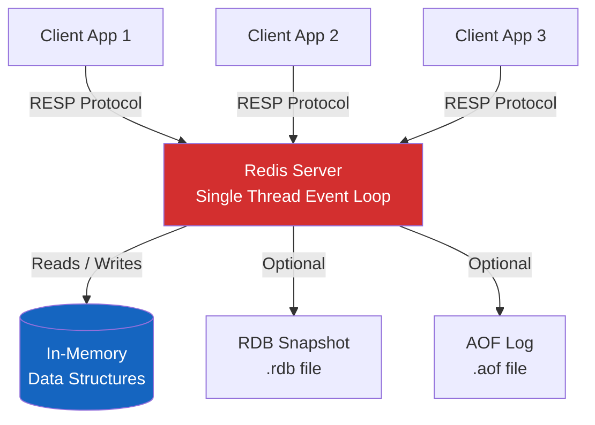
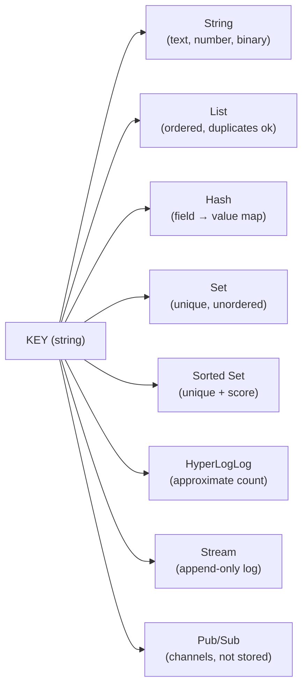
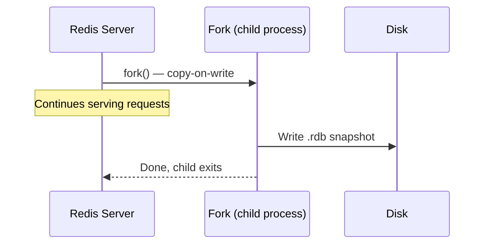
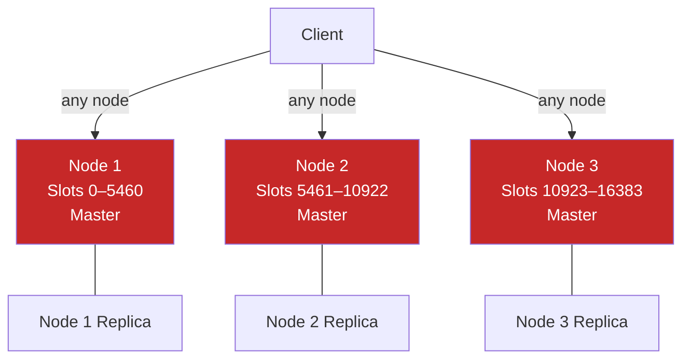
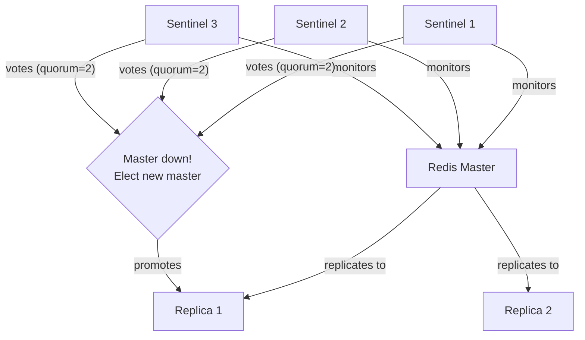
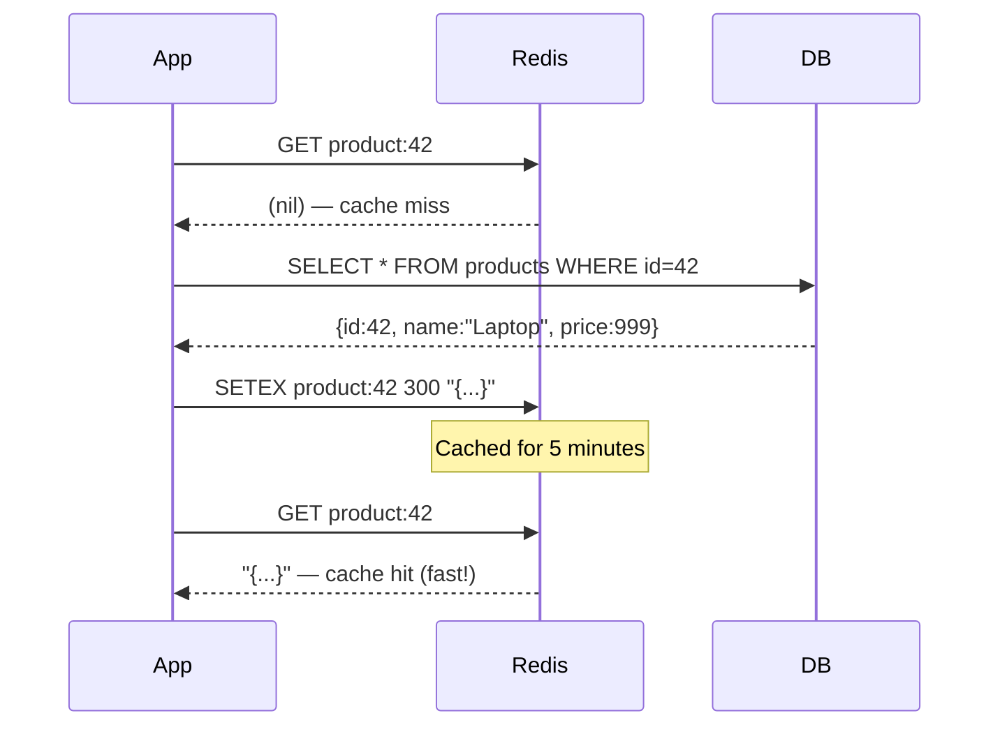

# Redis — In-Memory Data Structure Store Deep Dive

> "Redis is not just a cache. It is a data structure server that happens to live in memory."

---

## 🔥 What Is Redis?

Imagine your office has two storage systems:
- A **filing cabinet in the basement** — holds everything, but you have to walk down, search, and come back up. That is your disk-based database (PostgreSQL, MySQL).
- A **whiteboard on your desk** — you can read and write in milliseconds. That is Redis.

Redis stands for **RE**mote **DI**ctionary **S**erver. It stores all data in RAM (your computer's working memory), which makes it blindingly fast. We are talking about **100,000+ operations per second** on a single machine.

### Key facts

| Property | Value |
|---|---|
| Storage | In-memory (RAM), optional persistence to disk |
| Data model | Key-value, but values can be rich data structures |
| Throughput | 100,000–1,000,000+ ops/sec |
| Latency | Sub-millisecond (< 1ms) |
| Written in | C |
| License | BSD (open-source), Redis Stack (proprietary modules) |
| Single-threaded core | Yes — one thread handles commands (no locking needed) |

### Why is it so fast?

```
Disk read  → ~10 ms (spinning disk) or ~0.1 ms (SSD)
RAM read   → ~0.0001 ms (100 nanoseconds)
Redis ops  → ~0.1–1 ms (including network round-trip)
```

Redis is fast because:
1. Data lives in RAM — no disk I/O for reads
2. Simple data structures — no query parsing, no joins
3. Single-threaded command execution — no lock contention
4. Non-blocking I/O (epoll/kqueue) — handles thousands of connections with one thread

---

## 🏗️ Redis Architecture Overview



---

## 📦 Redis Data Structures

Redis is not a simple key-value store where values are just strings. Values can be one of **eight core data types**, each built for specific use cases.



---

## 1️⃣ String — The Swiss Army Knife

**Analogy:** Think of a String as a sticky note on your desk. You can write a name, a number, or even a small document on it. It is the most flexible type.

A Redis String can hold:
- Plain text: `"hello"`
- Numbers: `"42"` (Redis can do math on these)
- Binary data: images, serialized objects (up to 512 MB)

### Core commands

```bash
SET user:name "Alice"          # Store a string
GET user:name                  # → "Alice"

SET counter 0
INCR counter                   # → 1  (atomic increment)
INCRBY counter 5               # → 6
DECR counter                   # → 5

SETEX session:abc123 3600 "user_data_here"  # Set with 60-minute TTL
TTL session:abc123              # → 3600 (seconds remaining)

SETNX lock:payment 1           # Set only if Not eXists (NX flag)
```

### Use case 1 — Caching expensive DB queries

```python
import redis
import json

r = redis.Redis(host='localhost', port=6379, decode_responses=True)

def get_user(user_id: int) -> dict:
    cache_key = f"user:{user_id}"

    # 1. Try cache first
    cached = r.get(cache_key)
    if cached:
        print("Cache HIT")
        return json.loads(cached)

    # 2. Cache miss — fetch from DB
    print("Cache MISS — querying database")
    user = db.query("SELECT * FROM users WHERE id = ?", user_id)

    # 3. Store in cache for 10 minutes
    r.setex(cache_key, 600, json.dumps(user))
    return user
```

### Use case 2 — Rate limiter

```python
def is_rate_limited(user_id: str, limit: int = 100, window_sec: int = 60) -> bool:
    key = f"rate:{user_id}"
    count = r.incr(key)          # Atomic increment
    if count == 1:
        r.expire(key, window_sec) # Set TTL on first request
    return count > limit
```

---

## 2️⃣ List — The Ordered Queue

**Analogy:** A List is like a queue at a coffee shop. People join the back (RPUSH), the barista serves from the front (LPOP). Or think of it as a stack of plates where you always add/remove from the top.

Lists in Redis are **doubly-linked lists**, making push/pop at either end O(1).

### Core commands

```bash
RPUSH tasks "send_email"        # Add to right (tail)
RPUSH tasks "resize_image"
LPUSH tasks "urgent_task"       # Add to left (head) — jumps the queue

LPOP tasks                      # Remove + return from left → "urgent_task"
RPOP tasks                      # Remove + return from right → "resize_image"

LRANGE tasks 0 -1               # Get all elements
LLEN tasks                      # Count elements

BLPOP tasks 30                  # Blocking pop — wait up to 30 seconds
```

### Use case — Simple task queue

```python
# Producer (web server adds jobs)
def enqueue_job(job_data: dict):
    r.rpush("job_queue", json.dumps(job_data))

# Consumer (worker processes jobs)
def worker_loop():
    while True:
        # Block up to 5 seconds waiting for a job
        result = r.blpop("job_queue", timeout=5)
        if result:
            _, raw_job = result
            job = json.loads(raw_job)
            process_job(job)

# Activity feed — keep last 100 actions
def add_activity(user_id: str, activity: str):
    key = f"feed:{user_id}"
    r.lpush(key, activity)
    r.ltrim(key, 0, 99)  # Keep only the 100 most recent
```

---

## 3️⃣ Hash — The Mini Document

**Analogy:** A Hash is like a row in a spreadsheet. Each row (Hash) has a name (key) and multiple columns (fields). Instead of storing a whole JSON blob as a string and deserializing it every time, you can update individual fields.

### Core commands

```bash
HSET user:1001 name "Alice" age 30 email "alice@example.com"
HGET user:1001 name             # → "Alice"
HGETALL user:1001               # → all fields and values
HMGET user:1001 name email      # → ["Alice", "alice@example.com"]
HINCRBY user:1001 age 1         # Increment age field atomically
HDEL user:1001 email            # Delete a field
HEXISTS user:1001 name          # → 1 (exists)
```

### Use case — User session storage

```python
def create_session(session_id: str, user_data: dict, ttl: int = 1800):
    key = f"session:{session_id}"
    r.hset(key, mapping={
        "user_id": user_data["id"],
        "username": user_data["username"],
        "role": user_data["role"],
        "login_time": str(time.time()),
    })
    r.expire(key, ttl)  # 30-minute session

def get_session_user_id(session_id: str) -> str | None:
    return r.hget(f"session:{session_id}", "user_id")

def update_last_active(session_id: str):
    r.hset(f"session:{session_id}", "last_active", str(time.time()))
    r.expire(f"session:{session_id}", 1800)  # Reset TTL on activity
```

---

## 4️⃣ Set — The Unique Collection

**Analogy:** A Set is like a bag of poker chips where each chip has a unique color. You cannot have two chips of the same color. You can quickly ask: "Is this color in the bag?" and compare two bags.

Sets support powerful **set operations**: union, intersection, difference — all server-side.

### Core commands

```bash
SADD tags:post:42 "redis" "database" "caching"
SADD tags:post:99 "redis" "nosql" "performance"

SMEMBERS tags:post:42         # → {"redis", "database", "caching"}
SISMEMBER tags:post:42 "redis" # → 1 (yes, it's a member)
SCARD tags:post:42             # → 3 (count)

SINTER tags:post:42 tags:post:99   # Intersection → {"redis"}
SUNION tags:post:42 tags:post:99   # Union → all unique tags
SDIFF tags:post:42 tags:post:99    # Difference → {"database", "caching"}
```

### Use case — Online users and mutual friends

```python
def user_comes_online(user_id: str):
    r.sadd("online_users", user_id)

def user_goes_offline(user_id: str):
    r.srem("online_users", user_id)

def get_online_count() -> int:
    return r.scard("online_users")

# Who are my friends that are currently online?
def get_online_friends(user_id: str) -> set:
    friends_key = f"friends:{user_id}"
    # Intersect user's friend list with the global online set
    return r.sinter(friends_key, "online_users")

# Mutual friends between two users
def mutual_friends(user_a: str, user_b: str) -> set:
    return r.sinter(f"friends:{user_a}", f"friends:{user_b}")
```

---

## 5️⃣ Sorted Set — The Ranked List

**Analogy:** Imagine a competition leaderboard. Each player has a score and their position is determined by that score. A Sorted Set is exactly that — every member has a **floating-point score**, and members are always kept sorted by score. Perfect for leaderboards, priority queues, and sliding-window rate limiters.

Internally implemented as a **skip list + hash map** — O(log N) for insert/update.

### Core commands

```bash
ZADD leaderboard 1500 "alice"
ZADD leaderboard 2300 "bob"
ZADD leaderboard 1800 "charlie"

ZRANGE leaderboard 0 -1 WITHSCORES      # Ascending (lowest first)
ZREVRANGE leaderboard 0 2 WITHSCORES    # Top 3 (highest first)
ZRANK leaderboard "alice"               # → 0 (0-indexed, ascending)
ZREVRANK leaderboard "bob"              # → 0 (rank 1 in descending)
ZSCORE leaderboard "charlie"           # → 1800
ZINCRBY leaderboard 200 "alice"        # alice's score → 1700
ZRANGEBYSCORE leaderboard 1000 2000    # Members with score in range
```

### Use case 1 — Game leaderboard

```python
def update_score(player: str, points: int):
    r.zincrby("game:leaderboard", points, player)

def get_top_10() -> list:
    # Returns [(player, score), ...] highest first
    return r.zrevrange("game:leaderboard", 0, 9, withscores=True)

def get_player_rank(player: str) -> int:
    rank = r.zrevrank("game:leaderboard", player)
    return rank + 1 if rank is not None else None  # 1-indexed
```

### Use case 2 — Sliding window rate limiter

```python
import time

def sliding_window_rate_limit(user_id: str, limit: int = 100, window_ms: int = 60000) -> bool:
    now = int(time.time() * 1000)         # current time in ms
    window_start = now - window_ms

    key = f"ratelimit:{user_id}"

    pipe = r.pipeline()
    pipe.zremrangebyscore(key, 0, window_start)  # Remove old requests
    pipe.zadd(key, {str(now): now})               # Add current request
    pipe.zcard(key)                               # Count in window
    pipe.expire(key, 70)                          # Cleanup TTL
    results = pipe.execute()

    request_count = results[2]
    return request_count > limit  # True means BLOCKED
```

---

## 6️⃣ HyperLogLog — The Approximate Counter

**Analogy:** Imagine you want to count how many unique people visited your website. You could keep a giant list of every visitor's ID (memory-intensive), or you could use a clever math trick that tells you "roughly 1.2 million unique visitors" using only 12 KB of memory. That trick is HyperLogLog.

HyperLogLog gives you the **approximate count of unique items** with:
- Only **12 KB** of memory regardless of the number of unique items
- **~0.81% standard error** — very accurate for most use cases
- You **cannot retrieve the individual items** — only the count

### Core commands

```bash
PFADD visitors:2024-01-15 "user_101" "user_205" "user_101"  # duplicates ignored
PFADD visitors:2024-01-16 "user_101" "user_999" "user_500"

PFCOUNT visitors:2024-01-15        # → 2 (approximately)
PFCOUNT visitors:2024-01-15 visitors:2024-01-16  # Union count → 4
PFMERGE weekly_visitors visitors:2024-01-15 visitors:2024-01-16
```

### Use case — Unique page views without storing user IDs

```python
from datetime import date

def track_visit(page_id: str, user_id: str):
    today = date.today().isoformat()          # "2024-01-15"
    key = f"pageviews:{page_id}:{today}"
    r.pfadd(key, user_id)
    r.expire(key, 86400 * 30)                 # Keep for 30 days

def get_unique_visitors(page_id: str, day: str) -> int:
    return r.pfcount(f"pageviews:{page_id}:{day}")

def get_unique_visitors_this_week(page_id: str, days: list) -> int:
    keys = [f"pageviews:{page_id}:{d}" for d in days]
    return r.pfcount(*keys)
```

| Approach | Memory for 1M unique users | Exact? |
|---|---|---|
| Python set / DB table | ~50 MB+ | Yes |
| Redis Set (SADD) | ~50 MB+ | Yes |
| Redis HyperLogLog | 12 KB | No (~0.81% error) |

---

## 7️⃣ Streams — The Persistent Message Log

**Analogy:** Imagine a printed ticker tape at a stock exchange. Every trade is printed in order and the tape keeps rolling. Old entries are never erased (unless you trim). Multiple people can read the same tape, each from their own position. That is a Redis Stream.

Streams are Redis's most powerful data structure — an **append-only log** inspired by Kafka's design. Unlike Pub/Sub, messages are **persisted**.

### Core commands

```bash
# Add entries (auto-generated ID: timestamp-sequence)
XADD orders * product "laptop" qty 2 price 999.99
XADD orders * product "phone" qty 1 price 499.99

# Read entries
XRANGE orders - +                      # All entries (oldest first)
XRANGE orders - + COUNT 10            # First 10 entries
XREVRANGE orders + - COUNT 5          # Last 5 entries

# Consumer groups — multiple workers share the stream
XGROUP CREATE orders processing $ MKSTREAM
XREADGROUP GROUP processing worker-1 COUNT 5 STREAMS orders >   # Read new messages
XACK orders processing <message-id>   # Acknowledge processed message

# Read without consumer group
XREAD COUNT 10 STREAMS orders 0       # Read from beginning
XREAD BLOCK 0 STREAMS orders $        # Block until new message arrives
```

### Use case — Order processing pipeline

```python
# Producer — e-commerce checkout
def place_order(order_data: dict) -> str:
    message_id = r.xadd("orders", {
        "order_id": order_data["id"],
        "user_id": order_data["user_id"],
        "total": str(order_data["total"]),
        "status": "pending"
    })
    return message_id

# Consumer — inventory service
def inventory_worker():
    group = "inventory_group"
    consumer = "inventory-worker-1"

    # Create group if not exists
    try:
        r.xgroup_create("orders", group, id="0", mkstream=True)
    except Exception:
        pass  # Group already exists

    while True:
        messages = r.xreadgroup(group, consumer, {"orders": ">"}, count=10, block=5000)
        if messages:
            for stream_name, entries in messages:
                for entry_id, fields in entries:
                    process_inventory(fields)
                    r.xack("orders", group, entry_id)   # Mark as done
```

---

## 📡 Pub/Sub — Fire and Forget Messaging

**Analogy:** Think of a radio broadcast. The DJ (publisher) speaks once, and everyone tuned to that station (subscribers) hears it. If you were not listening, you missed it — there is no replay.

Redis Pub/Sub is **not persistent**. Messages are delivered only to **currently connected** subscribers. If a subscriber disconnects, messages sent during that time are lost.

### Core commands

```bash
# In terminal 1 (subscriber):
SUBSCRIBE news:sports news:tech   # Subscribe to multiple channels
PSUBSCRIBE news:*                 # Pattern subscribe — all news channels

# In terminal 2 (publisher):
PUBLISH news:sports "Team wins championship!"
PUBLISH news:tech "Redis 8.0 released"
```

### Use case — Real-time notifications

```python
# Publisher — notification service
def send_notification(user_id: str, message: str):
    channel = f"notifications:{user_id}"
    r.publish(channel, json.dumps({
        "message": message,
        "timestamp": time.time()
    }))

# Subscriber — WebSocket server
def listen_for_notifications(user_id: str):
    pubsub = r.pubsub()
    pubsub.subscribe(f"notifications:{user_id}")

    for message in pubsub.listen():
        if message["type"] == "message":
            data = json.loads(message["data"])
            send_to_websocket(user_id, data)
```

### Pub/Sub vs Streams comparison

| Feature | Pub/Sub | Streams |
|---|---|---|
| Persistence | No | Yes |
| Replay old messages | No | Yes |
| Consumer groups | No | Yes |
| Message acknowledgement | No | Yes |
| Best for | Live dashboards, chat | Event sourcing, task queues |

---

## 💾 Redis Persistence

**Analogy:** Redis keeps your data on a whiteboard (RAM). If the power goes out, the whiteboard is erased. Persistence is the act of photographing the whiteboard so you can redraw it later.

Redis offers three persistence modes:

### RDB (Redis Database) — Snapshot

Takes a **point-in-time snapshot** of all data and saves it to a `.rdb` file.

```
# In redis.conf
save 900 1      # Save if at least 1 key changed in 900 seconds
save 300 10     # Save if at least 10 keys changed in 300 seconds
save 60 10000   # Save if at least 10,000 keys changed in 60 seconds

dbfilename dump.rdb
dir /var/lib/redis
```



### AOF (Append-Only File) — Transaction Log

Logs **every write command** to an `.aof` file. On restart, Redis replays all commands.

```
# In redis.conf
appendonly yes
appendfilename "appendonly.aof"

# Sync policy (trade speed vs durability)
appendfsync always    # Sync after EVERY command — slowest, safest
appendfsync everysec  # Sync every second — good balance (default)
appendfsync no        # Let OS decide — fastest, least safe
```

### Comparison

| Property | RDB | AOF | RDB + AOF |
|---|---|---|---|
| File size | Small (compact) | Large (all commands) | Medium |
| Recovery speed | Fast | Slow (replay all cmds) | Uses AOF |
| Data loss risk | Up to last snapshot (minutes) | Up to 1 second | Up to 1 second |
| Performance impact | Low (periodic fork) | Higher (fsync overhead) | Higher |
| Best for | Backups, disaster recovery | Durability-critical data | Production default |

**Recommended production setting:** Use **both** RDB and AOF.

---

## 🌐 Redis Cluster — Horizontal Scaling

**Analogy:** One Redis server is like one cashier lane. When the queue gets too long, you open more lanes (sharding). Redis Cluster automatically splits your data across multiple nodes, and each node is only responsible for a portion of the data.

Redis Cluster uses **hash slots** — 16,384 total slots distributed across nodes.

```
Key → CRC16(key) % 16384 → slot number → assigned node
```



### Hash tags — keeping related keys on the same node

```bash
# These keys go to the same slot because the hash is computed on "user:1001"
SET {user:1001}.name "Alice"
SET {user:1001}.email "alice@example.com"
SET {user:1001}.age 30

# Without braces, these might land on different nodes:
SET user:1001:name "Alice"
SET user:1001:email "alice@example.com"
```

---

## 🛡️ Redis Sentinel — High Availability

**Analogy:** Sentinel is like a hospital monitoring room. There are nurses (Sentinel nodes) constantly watching the patient's vitals (Redis master). If the patient stops breathing, the nurses vote and one takes charge of calling a replacement (promoting a replica).

Redis Sentinel provides:
1. **Monitoring** — checks if master and replicas are alive
2. **Notification** — alerts when something goes wrong
3. **Automatic failover** — promotes a replica when master dies
4. **Configuration provider** — clients ask Sentinel for the current master address



```
# sentinel.conf
sentinel monitor mymaster 127.0.0.1 6379 2   # Need 2 votes to fail over
sentinel down-after-milliseconds mymaster 5000
sentinel failover-timeout mymaster 60000
```

### Sentinel vs Cluster

| Feature | Sentinel | Cluster |
|---|---|---|
| Purpose | High availability | Scalability + HA |
| Sharding | No — all data on master | Yes — 16,384 slots |
| Scaling | Vertical only | Horizontal |
| Complexity | Lower | Higher |
| Use when | < 100 GB data | > 100 GB or need sharding |

---

## 🗑️ Redis as Cache — Eviction Policies

**Analogy:** Your desk (RAM) has limited space. When it is full and you need to place something new, you have to decide what to throw away. Eviction policies are the rules you use to make that decision.

Configure max memory and eviction in `redis.conf`:

```
maxmemory 4gb
maxmemory-policy allkeys-lru
```

### Eviction policies explained

| Policy | Description | Best for |
|---|---|---|
| `noeviction` | Return error when memory full | Critical data, never evict |
| `allkeys-lru` | Evict least recently used key | General cache |
| `allkeys-lfu` | Evict least frequently used key | Workloads with hot/cold data |
| `allkeys-random` | Evict random key | When access pattern is uniform |
| `volatile-lru` | LRU eviction only among keys with TTL | Mixed cache + persistent data |
| `volatile-lfu` | LFU eviction only among keys with TTL | Same as above, frequency-based |
| `volatile-ttl` | Evict keys with the shortest TTL first | When TTL indicates priority |
| `volatile-random` | Random eviction among keys with TTL | Rare — usually not recommended |

**LRU vs LFU:**
- **LRU** (Least Recently Used) — evicts what has not been touched in a long time. A key used once today survives over a key used 1,000 times last week.
- **LFU** (Least Frequently Used) — evicts what is used least overall. More intelligent for workloads with hot keys.

---

## 🔄 Cache Patterns

### Cache-Aside (Lazy Loading)

The app manages the cache manually. Most popular pattern.



```python
def get_product(product_id: int) -> dict:
    key = f"product:{product_id}"
    cached = r.get(key)
    if cached:
        return json.loads(cached)
    product = db.get_product(product_id)
    r.setex(key, 300, json.dumps(product))
    return product
```

### Write-Through

Write to cache AND database at the same time. Cache is always fresh.

```python
def update_product(product_id: int, data: dict):
    # Write to DB first
    db.update_product(product_id, data)
    # Then update cache
    key = f"product:{product_id}"
    r.setex(key, 300, json.dumps(data))
```

### Write-Behind (Write-Back)

Write to cache immediately, write to DB asynchronously. Fast writes, risk of data loss.

```python
def update_product_fast(product_id: int, data: dict):
    key = f"product:{product_id}"
    r.setex(key, 300, json.dumps(data))
    # Queue async write to DB
    r.rpush("db_write_queue", json.dumps({"id": product_id, "data": data}))
```

### Pattern comparison

| Pattern | Read speed | Write speed | Consistency | Data loss risk |
|---|---|---|---|---|
| Cache-aside | Fast (after warm-up) | Normal | Eventual | Low |
| Write-through | Fast | Slower (double write) | Strong | Very low |
| Write-behind | Fast | Fastest | Eventual | Higher |

---

## ⚛️ Lua Scripts — Atomic Operations

**Analogy:** A Lua script in Redis is like a bank teller performing a multi-step transaction at their window. No other customer (command) can interrupt while they are working. This gives you atomicity without needing a distributed lock.

Redis executes Lua scripts atomically. All commands inside the script run without any other command being executed in between.

```lua
-- check_and_set.lua
-- Atomically: if value matches expected, set new value
local current = redis.call('GET', KEYS[1])
if current == ARGV[1] then
    redis.call('SET', KEYS[1], ARGV[2])
    return 1
else
    return 0
end
```

```python
# Load and run the script
check_and_set = r.register_script("""
    local current = redis.call('GET', KEYS[1])
    if current == ARGV[1] then
        redis.call('SET', KEYS[1], ARGV[2])
        return 1
    else
        return 0
    end
""")

# Use it like a compare-and-swap
result = check_and_set(keys=["my_key"], args=["old_value", "new_value"])
# Returns 1 if swapped, 0 if current value did not match
```

### Real-world atomic Lua example — inventory deduction

```lua
-- deduct_inventory.lua
local stock = tonumber(redis.call('GET', KEYS[1]))
local requested = tonumber(ARGV[1])

if stock == nil then
    return -1  -- item not found
elseif stock < requested then
    return -2  -- insufficient stock
else
    redis.call('DECRBY', KEYS[1], requested)
    return stock - requested  -- remaining stock
end
```

```python
deduct = r.register_script(open("deduct_inventory.lua").read())

result = deduct(keys=[f"stock:item:{item_id}"], args=[quantity])
if result == -1:
    raise Exception("Item not found")
elif result == -2:
    raise Exception("Insufficient stock")
else:
    print(f"Order placed! Remaining stock: {result}")
```

---

## 📨 RESP Protocol — How Clients Talk to Redis

**Analogy:** RESP (Redis Serialization Protocol) is like the grammar rules of a language. Both the client and server have agreed to speak this way so they can understand each other perfectly.

RESP is a simple text-based protocol (RESP2) or binary-safe (RESP3):

```
# Client sends: SET name Alice
*3\r\n          ← array of 3 elements
$3\r\n          ← bulk string, 3 bytes
SET\r\n
$4\r\n          ← bulk string, 4 bytes
name\r\n
$5\r\n          ← bulk string, 5 bytes
Alice\r\n

# Server responds with: OK
+OK\r\n         ← simple string

# For GET: returns bulk string
$5\r\n          ← 5 bytes follow
Alice\r\n

# For integer response (INCR):
:42\r\n         ← integer

# For error:
-ERR unknown command 'FLORP'\r\n
```

RESP type prefixes:

| Prefix | Type | Example |
|---|---|---|
| `+` | Simple string | `+OK\r\n` |
| `-` | Error | `-ERR message\r\n` |
| `:` | Integer | `:42\r\n` |
| `$` | Bulk string | `$5\r\nHello\r\n` |
| `*` | Array | `*2\r\n$3\r\nfoo\r\n$3\r\nbar\r\n` |

---

## ✅ When to Use Redis

- You need sub-millisecond response times
- Caching expensive database queries or API calls
- Session management (store user sessions, tokens)
- Rate limiting (INCR with TTL, or Sorted Set sliding window)
- Real-time leaderboards (Sorted Sets)
- Pub/Sub notifications (dashboards, chat, live updates)
- Task queues (List with BLPOP, or Streams)
- Unique counting with approximate precision (HyperLogLog)
- Distributed locks (SETNX or Redlock algorithm)
- Event streaming (Streams)

## ❌ When NOT to Use Redis

- Primary database for complex relational data — use PostgreSQL
- Full-text search — use Elasticsearch or PostgreSQL FTS
- Very large datasets that do not fit in RAM — use a disk-based DB
- ACID transactions spanning multiple records — use a relational DB
- Long-term cold storage — data not accessed frequently does not belong in RAM
- Complex joins, aggregations, or analytics queries — use a data warehouse

---

## 📊 Redis Data Structures Summary

| Structure | Time Complexity | Best Use Case | Size Limit |
|---|---|---|---|
| String | O(1) get/set | Cache, counters, rate limits | 512 MB |
| List | O(1) push/pop | Task queues, activity feeds | 2^32 elements |
| Hash | O(1) get/set field | Sessions, object cache | 2^32 fields |
| Set | O(1) add/check, O(N) union | Unique tags, friend lists | 2^32 members |
| Sorted Set | O(log N) add/score | Leaderboards, priority queues | 2^32 members |
| HyperLogLog | O(1) add/count | Unique visitor counting | 12 KB always |
| Stream | O(1) append, O(log N) range | Event log, message queue | Unlimited |
| Pub/Sub | O(N) publish | Live broadcasts | N/A (not stored) |

---

## 🔑 Key Takeaways

1. **Redis lives in RAM** — that is why it is 10–100x faster than disk-based databases. This also means it has a memory budget.

2. **Choose the right data structure** — Redis is not just strings. Using the wrong structure (e.g., storing JSON blobs when Hash fields would let you update individual fields) wastes memory and performance.

3. **TTL is your friend** — always set expiry on cache keys with `SETEX` or `EXPIRE`. Stale data and memory bloat are common mistakes.

4. **Eviction policy matters** — set `maxmemory` and choose a policy (`allkeys-lru` is a safe default for pure caches). Never run Redis without a memory limit in production.

5. **Persistence is a spectrum** — RDB for backups, AOF for durability, both for production. No persistence for pure caches.

6. **Pub/Sub is NOT a message queue** — messages are lost if no subscriber is connected. Use Streams or a proper queue (RabbitMQ, Kafka) when you need guaranteed delivery.

7. **Lua scripts for atomicity** — when you need to read-modify-write atomically without a lock, a Lua script is the cleanest solution.

8. **Sentinel = HA, Cluster = Scale** — use Sentinel for automatic failover on a single dataset. Use Cluster when your dataset outgrows one machine or you need horizontal throughput.

9. **Redis is single-threaded** — one slow Lua script or a huge `KEYS *` command blocks all other operations. Never use `KEYS *` in production; use `SCAN` instead.

10. **Pipeline commands for batch efficiency** — using `r.pipeline()` sends multiple commands in one network round-trip, reducing latency dramatically for bulk operations.

---

> Redis is a precision tool. When you pick the right data structure for the right problem, it feels like cheating — things that take seconds in a database happen in microseconds. The key is understanding what each structure was designed for and matching it to your use case.
