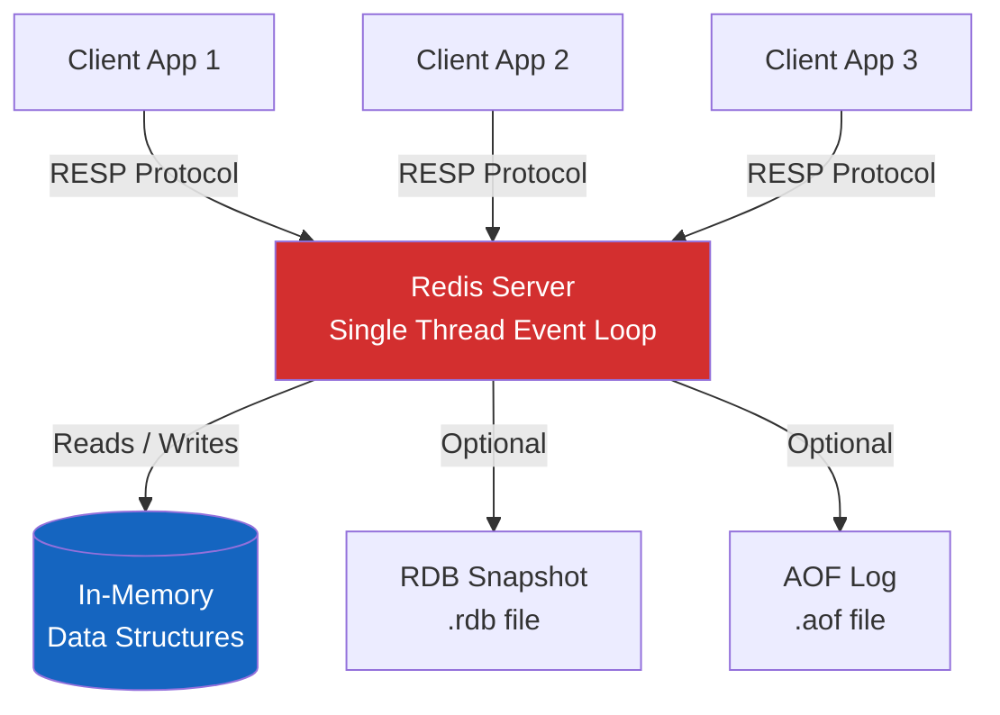
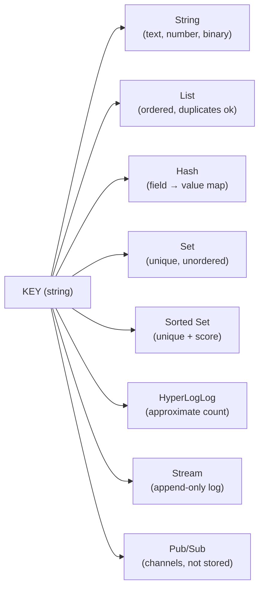
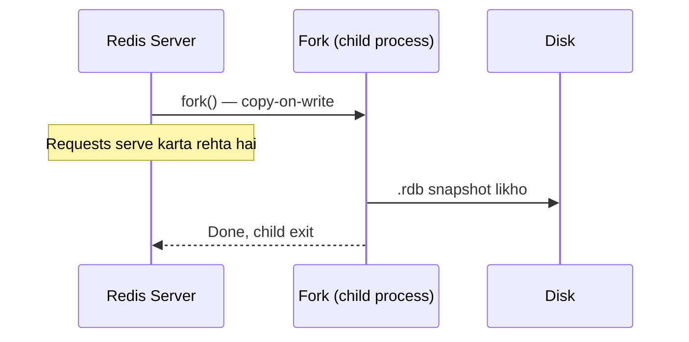
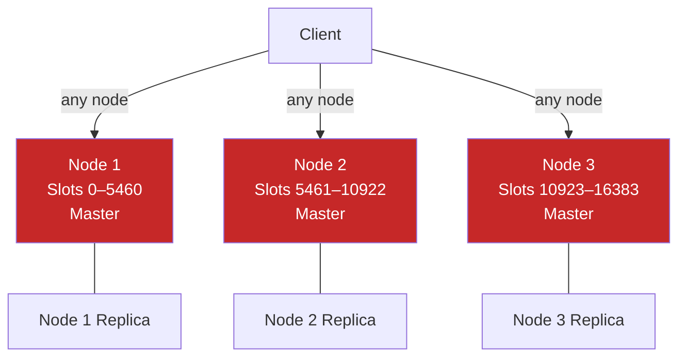
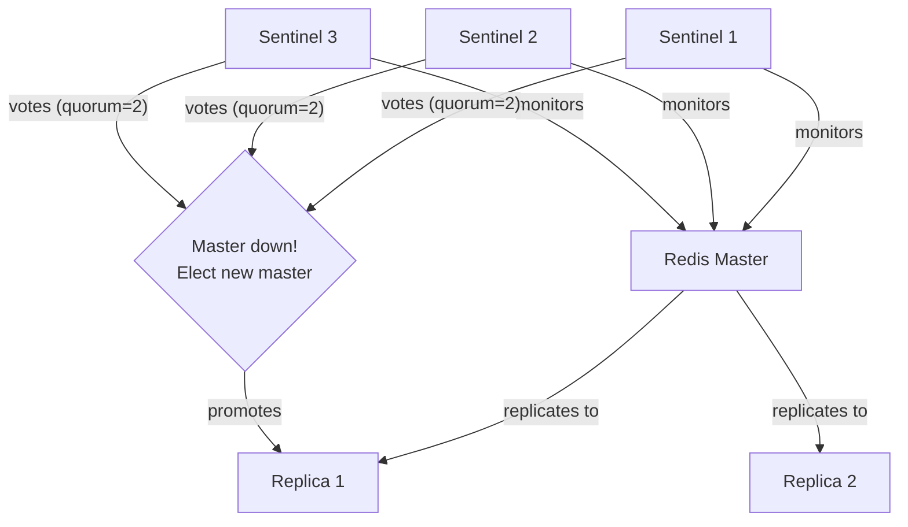
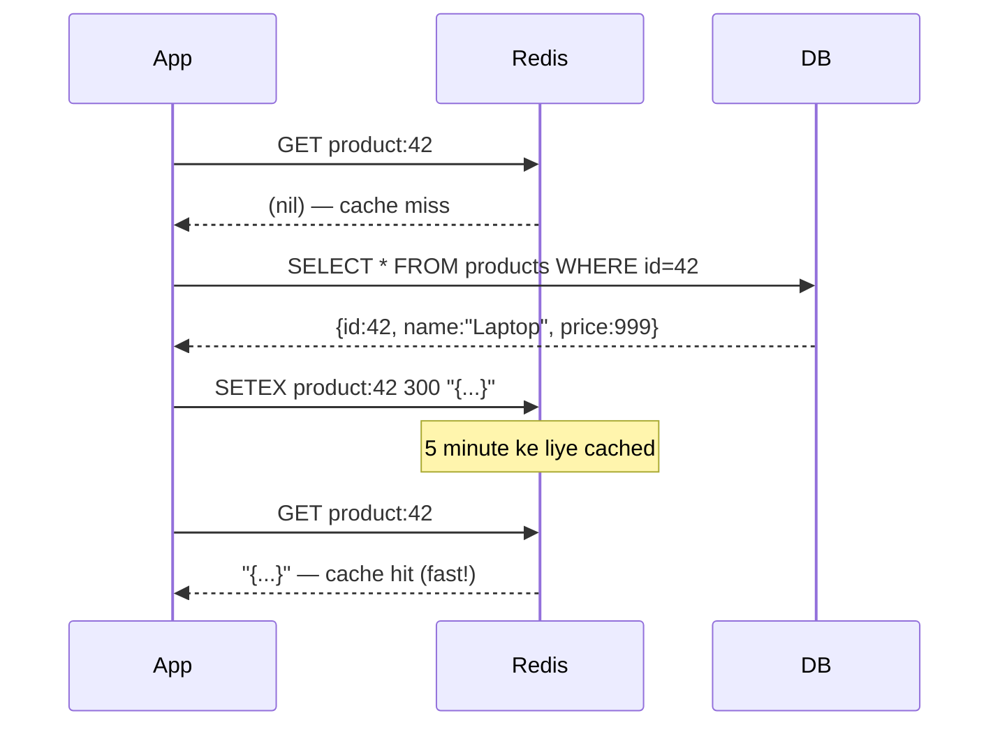

# Redis — In-Memory Data Structure Store Deep Dive

> "Redis sirf ek cache nahi hai. Yeh ek data structure server hai jo memory mein rehta hai."

---

## 🔥 Redis Hai Kya?

Socho tumhare office mein do storage systems hain:
- Ek **basement mein rakhi filing cabinet** — sab kuch hai usme, but tumhe neeche jaana padega, dhundhna padega, phir upar aana padega. Yeh hai disk-based database (PostgreSQL, MySQL).
- Ek **whiteboard tumhare desk pe** — milliseconds mein likh sakte ho, padh sakte ho. Yeh hai Redis.

Redis ka full form hai **RE**mote **DI**ctionary **S**erver. Yeh saara data RAM (tumhare computer ki working memory) mein store karta hai, isliye yeh bijli ki speed se kaam karta hai. Baat kar rahe hain **100,000+ operations per second** ki, ek hi machine pe.

### Key facts

| Property | Value |
|---|---|
| Storage | In-memory (RAM), optional persistence to disk |
| Data model | Key-value, but values rich data structures ho sakte hain |
| Throughput | 100,000–1,000,000+ ops/sec |
| Latency | Sub-millisecond (< 1ms) |
| Likha gaya | C mein |
| License | BSD (open-source), Redis Stack (proprietary modules) |
| Single-threaded core | Haan — ek hi thread commands handle karta hai (koi locking nahi chahiye) |

### Itna fast kyun hai?

```
Disk read  → ~10 ms (spinning disk) ya ~0.1 ms (SSD)
RAM read   → ~0.0001 ms (100 nanoseconds)
Redis ops  → ~0.1–1 ms (network round-trip ke saath)
```

Redis fast hai kyunki:
1. Data RAM mein rehta hai — reads ke liye koi disk I/O nahi
2. Simple data structures — no query parsing, no joins
3. Single-threaded command execution — lock contention hi nahi
4. Non-blocking I/O (epoll/kqueue) — ek thread se hazaron connections handle ho jaate hain

---

## 🏗️ Redis Architecture Overview



---

## 📦 Redis Data Structures

Redis simple key-value store nahi hai jahan value sirf string hoti hai. Values **aath core data types** mein se koi bhi ho sakti hain, har ek specific use case ke liye bani hai.



---

## 1️⃣ String — Swiss Army Knife

**Analogy:** String ko socho apne desk pe rakhi sticky note ki tarah. Usme naam likh sakte ho, number likh sakte ho, ya chota sa document bhi. Yeh sabse flexible type hai.

Redis String yeh sab store kar sakta hai:
- Plain text: `"hello"`
- Numbers: `"42"` (Redis inpe math kar sakta hai)
- Binary data: images, serialized objects (512 MB tak)

### Core commands

```bash
SET user:name "Alice"          # String store karo
GET user:name                  # → "Alice"

SET counter 0
INCR counter                   # → 1  (atomic increment)
INCRBY counter 5               # → 6
DECR counter                   # → 5

SETEX session:abc123 3600 "user_data_here"  # 60-minute TTL ke saath set
TTL session:abc123              # → 3600 (seconds baaki)

SETNX lock:payment 1           # Sirf tab set karo jab exist na kare (NX flag)
```

### Use case 1 — Expensive DB queries ko cache karna

Socho har baar Zomato app pe restaurant list load karne ke liye DB pe hit maarna pade — slow ho jayega. Isiliye cache use karte hain.

```python
import redis
import json

r = redis.Redis(host='localhost', port=6379, decode_responses=True)

def get_user(user_id: int) -> dict:
    cache_key = f"user:{user_id}"

    # 1. Pehle cache check karo
    cached = r.get(cache_key)
    if cached:
        print("Cache HIT")
        return json.loads(cached)

    # 2. Cache miss — database se fetch karo
    print("Cache MISS — querying database")
    user = db.query("SELECT * FROM users WHERE id = ?", user_id)

    # 3. 10 minute ke liye cache mein store karo
    r.setex(cache_key, 600, json.dumps(user))
    return user
```

### Use case 2 — Rate limiter

UPI apps mein dekha hoga — ek minute mein 5 se zyada baar wrong PIN daalo toh block ho jaate ho. Yeh hi cheez rate limiter karta hai.

```python
def is_rate_limited(user_id: str, limit: int = 100, window_sec: int = 60) -> bool:
    key = f"rate:{user_id}"
    count = r.incr(key)          # Atomic increment
    if count == 1:
        r.expire(key, window_sec) # Pehli request pe TTL set karo
    return count > limit
```

---

## 2️⃣ List — Ordered Queue

**Analogy:** List ek coffee shop ki queue jaisa hai. Log peeche join karte hain (RPUSH), barista aage se serve karta hai (LPOP). Ya socho plates ka stack — hamesha upar se hi add/remove karte ho.

Redis mein Lists **doubly-linked lists** hoti hain, isliye dono ends pe push/pop O(1) hota hai.

### Core commands

```bash
RPUSH tasks "send_email"        # Right (tail) mein add karo
RPUSH tasks "resize_image"
LPUSH tasks "urgent_task"       # Left (head) mein add karo — queue jump karta hai

LPOP tasks                      # Left se remove + return → "urgent_task"
RPOP tasks                      # Right se remove + return → "resize_image"

LRANGE tasks 0 -1               # Saare elements get karo
LLEN tasks                      # Elements count karo

BLPOP tasks 30                  # Blocking pop — 30 second tak wait karo
```

### Use case — Simple task queue

Bilkul Zomato ke order processing system jaisa — order aata hai, queue mein jaata hai, worker use process karta hai.

```python
# Producer (web server jobs add karta hai)
def enqueue_job(job_data: dict):
    r.rpush("job_queue", json.dumps(job_data))

# Consumer (worker jobs process karta hai)
def worker_loop():
    while True:
        # 5 second tak job ke liye wait karo
        result = r.blpop("job_queue", timeout=5)
        if result:
            _, raw_job = result
            job = json.loads(raw_job)
            process_job(job)

# Activity feed — last 100 actions rakho
def add_activity(user_id: str, activity: str):
    key = f"feed:{user_id}"
    r.lpush(key, activity)
    r.ltrim(key, 0, 99)  # Sirf 100 sabse recent rakho
```

---

## 3️⃣ Hash — Mini Document

**Analogy:** Hash spreadsheet ki ek row jaisa hai. Har row (Hash) ka ek naam (key) hota hai aur multiple columns (fields). Poora JSON blob string ki tarah store karke har baar deserialize karne ki bajaye, tum individual fields update kar sakte ho.

### Core commands

```bash
HSET user:1001 name "Alice" age 30 email "alice@example.com"
HGET user:1001 name             # → "Alice"
HGETALL user:1001               # → saare fields aur values
HMGET user:1001 name email      # → ["Alice", "alice@example.com"]
HINCRBY user:1001 age 1         # age field atomically increment karo
HDEL user:1001 email            # Field delete karo
HEXISTS user:1001 name          # → 1 (exist karta hai)
```

### Use case — User session storage

```python
def create_session(session_id: str, user_data: dict, ttl: int = 1800):
    key = f"session:{session_id}"
    r.hset(key, mapping={
        "user_id": user_data["id"],
        "username": user_data["username"],
        "role": user_data["role"],
        "login_time": str(time.time()),
    })
    r.expire(key, ttl)  # 30-minute session

def get_session_user_id(session_id: str) -> str | None:
    return r.hget(f"session:{session_id}", "user_id")

def update_last_active(session_id: str):
    r.hset(f"session:{session_id}", "last_active", str(time.time()))
    r.expire(f"session:{session_id}", 1800)  # Activity pe TTL reset karo
```

---

## 4️⃣ Set — Unique Collection

**Analogy:** Set ek thaili poker chips ki jaisa hai jisme har chip ka unique color hai. Ek hi color ke do chips nahi ho sakte. Tum jaldi se pooch sakte ho: "kya yeh color thaili mein hai?" aur do thailiyon ko compare kar sakte ho.

Sets powerful **set operations** support karte hain: union, intersection, difference — sab server-side.

### Core commands

```bash
SADD tags:post:42 "redis" "database" "caching"
SADD tags:post:99 "redis" "nosql" "performance"

SMEMBERS tags:post:42         # → {"redis", "database", "caching"}
SISMEMBER tags:post:42 "redis" # → 1 (haan, member hai)
SCARD tags:post:42             # → 3 (count)

SINTER tags:post:42 tags:post:99   # Intersection → {"redis"}
SUNION tags:post:42 tags:post:99   # Union → saare unique tags
SDIFF tags:post:42 tags:post:99    # Difference → {"database", "caching"}
```

### Use case — Online users aur mutual friends

```python
def user_comes_online(user_id: str):
    r.sadd("online_users", user_id)

def user_goes_offline(user_id: str):
    r.srem("online_users", user_id)

def get_online_count() -> int:
    return r.scard("online_users")

# Mere online friends kaun hain abhi?
def get_online_friends(user_id: str) -> set:
    friends_key = f"friends:{user_id}"
    # User ki friend list ko global online set se intersect karo
    return r.sinter(friends_key, "online_users")

# Do users ke mutual friends
def mutual_friends(user_a: str, user_b: str) -> set:
    return r.sinter(f"friends:{user_a}", f"friends:{user_b}")
```

---

## 5️⃣ Sorted Set — Ranked List

**Analogy:** Socho ek competition leaderboard. Har player ka ek score hai aur uska position us score se decide hota hai. Sorted Set bilkul yeh hi hai — har member ka ek **floating-point score** hota hai, aur members hamesha score ke hisaab se sorted rehte hain. Leaderboards, priority queues, aur sliding-window rate limiters ke liye perfect.

Internally yeh **skip list + hash map** se implement hota hai — insert/update O(log N) mein.

### Core commands

```bash
ZADD leaderboard 1500 "alice"
ZADD leaderboard 2300 "bob"
ZADD leaderboard 1800 "charlie"

ZRANGE leaderboard 0 -1 WITHSCORES      # Ascending (lowest pehle)
ZREVRANGE leaderboard 0 2 WITHSCORES    # Top 3 (highest pehle)
ZRANK leaderboard "alice"               # → 0 (0-indexed, ascending)
ZREVRANK leaderboard "bob"              # → 0 (rank 1 descending mein)
ZSCORE leaderboard "charlie"           # → 1800
ZINCRBY leaderboard 200 "alice"        # alice ka score → 1700
ZRANGEBYSCORE leaderboard 1000 2000    # Score range wale members
```

### Use case 1 — Game leaderboard

```python
def update_score(player: str, points: int):
    r.zincrby("game:leaderboard", points, player)

def get_top_10() -> list:
    # [(player, score), ...] return karta hai, highest pehle
    return r.zrevrange("game:leaderboard", 0, 9, withscores=True)

def get_player_rank(player: str) -> int:
    rank = r.zrevrank("game:leaderboard", player)
    return rank + 1 if rank is not None else None  # 1-indexed
```

### Use case 2 — Sliding window rate limiter

```python
import time

def sliding_window_rate_limit(user_id: str, limit: int = 100, window_ms: int = 60000) -> bool:
    now = int(time.time() * 1000)         # current time in ms
    window_start = now - window_ms

    key = f"ratelimit:{user_id}"

    pipe = r.pipeline()
    pipe.zremrangebyscore(key, 0, window_start)  # Purani requests hatao
    pipe.zadd(key, {str(now): now})               # Current request add karo
    pipe.zcard(key)                               # Window mein count karo
    pipe.expire(key, 70)                          # Cleanup TTL
    results = pipe.execute()

    request_count = results[2]
    return request_count > limit  # True matlab BLOCKED
```

---

## 6️⃣ HyperLogLog — Approximate Counter

**Analogy:** Socho tumhe count karna hai ki tumhari website pe kitne unique log aaye. Ek option hai — har visitor ki ID ki ek giant list rakho (memory-heavy). Doosra option hai ek clever math trick use karo jo bataye "roughly 1.2 million unique visitors" sirf 12 KB memory mein. Yeh trick hai HyperLogLog.

HyperLogLog tumhe **unique items ka approximate count** deta hai:
- Sirf **12 KB** memory, chahe unique items kitne bhi hon
- **~0.81% standard error** — zyadatar use cases ke liye kaafi accurate
- Tum **individual items retrieve nahi kar sakte** — sirf count milta hai

### Core commands

```bash
PFADD visitors:2024-01-15 "user_101" "user_205" "user_101"  # duplicates ignore ho jaate hain
PFADD visitors:2024-01-16 "user_101" "user_999" "user_500"

PFCOUNT visitors:2024-01-15        # → 2 (approximately)
PFCOUNT visitors:2024-01-15 visitors:2024-01-16  # Union count → 4
PFMERGE weekly_visitors visitors:2024-01-15 visitors:2024-01-16
```

### Use case — User IDs store kiye bina unique page views

```python
from datetime import date

def track_visit(page_id: str, user_id: str):
    today = date.today().isoformat()          # "2024-01-15"
    key = f"pageviews:{page_id}:{today}"
    r.pfadd(key, user_id)
    r.expire(key, 86400 * 30)                 # 30 din ke liye rakho

def get_unique_visitors(page_id: str, day: str) -> int:
    return r.pfcount(f"pageviews:{page_id}:{day}")

def get_unique_visitors_this_week(page_id: str, days: list) -> int:
    keys = [f"pageviews:{page_id}:{d}" for d in days]
    return r.pfcount(*keys)
```

| Approach | 1M unique users ke liye Memory | Exact? |
|---|---|---|
| Python set / DB table | ~50 MB+ | Haan |
| Redis Set (SADD) | ~50 MB+ | Haan |
| Redis HyperLogLog | 12 KB | Nahi (~0.81% error) |

---

## 7️⃣ Streams — Persistent Message Log

**Analogy:** Socho stock exchange ki printed ticker tape. Har trade order se print hota hai aur tape chalta rehta hai. Purani entries kabhi mitaayi nahi jaatin (jab tak tum trim na karo). Multiple log same tape read kar sakte hain, apne apne position se. Yeh hai Redis Stream.

Streams Redis ka sabse powerful data structure hai — ek **append-only log**, Kafka ke design se inspired. Pub/Sub ke alag, messages **persist** hote hain.

### Core commands

```bash
# Entries add karo (auto-generated ID: timestamp-sequence)
XADD orders * product "laptop" qty 2 price 999.99
XADD orders * product "phone" qty 1 price 499.99

# Entries read karo
XRANGE orders - +                      # Saari entries (oldest pehle)
XRANGE orders - + COUNT 10            # Pehli 10 entries
XREVRANGE orders + - COUNT 5          # Last 5 entries

# Consumer groups — multiple workers stream share karte hain
XGROUP CREATE orders processing $ MKSTREAM
XREADGROUP GROUP processing worker-1 COUNT 5 STREAMS orders >   # New messages read karo
XACK orders processing <message-id>   # Processed message acknowledge karo

# Consumer group ke bina read
XREAD COUNT 10 STREAMS orders 0       # Shuru se read karo
XREAD BLOCK 0 STREAMS orders $        # New message aane tak block karo
```

### Use case — Order processing pipeline

Swiggy ka order pipeline socho — order place hota hai, restaurant ko notify hota hai, delivery partner assign hota hai — sab alag alag consumers ek hi stream se read karte hain.

```python
# Producer — e-commerce checkout
def place_order(order_data: dict) -> str:
    message_id = r.xadd("orders", {
        "order_id": order_data["id"],
        "user_id": order_data["user_id"],
        "total": str(order_data["total"]),
        "status": "pending"
    })
    return message_id

# Consumer — inventory service
def inventory_worker():
    group = "inventory_group"
    consumer = "inventory-worker-1"

    # Agar group exist nahi karta toh create karo
    try:
        r.xgroup_create("orders", group, id="0", mkstream=True)
    except Exception:
        pass  # Group already exists

    while True:
        messages = r.xreadgroup(group, consumer, {"orders": ">"}, count=10, block=5000)
        if messages:
            for stream_name, entries in messages:
                for entry_id, fields in entries:
                    process_inventory(fields)
                    r.xack("orders", group, entry_id)   # Done mark karo
```

---

## 📡 Pub/Sub — Fire and Forget Messaging

**Analogy:** Socho ek radio broadcast. DJ (publisher) ek baar bolta hai, aur jo bhi us station pe tuned hai (subscribers) woh sunta hai. Agar tum sun hi nahi rahe the, toh miss ho gaya — koi replay nahi hai.

Redis Pub/Sub **persistent nahi** hai. Messages sirf **currently connected** subscribers tak deliver hote hain. Agar subscriber disconnect ho jaaye, us waqt bheje gaye messages lost ho jaate hain.

### Core commands

```bash
# Terminal 1 mein (subscriber):
SUBSCRIBE news:sports news:tech   # Multiple channels subscribe karo
PSUBSCRIBE news:*                 # Pattern subscribe — saare news channels

# Terminal 2 mein (publisher):
PUBLISH news:sports "Team wins championship!"
PUBLISH news:tech "Redis 8.0 released"
```

### Use case — Real-time notifications

```python
# Publisher — notification service
def send_notification(user_id: str, message: str):
    channel = f"notifications:{user_id}"
    r.publish(channel, json.dumps({
        "message": message,
        "timestamp": time.time()
    }))

# Subscriber — WebSocket server
def listen_for_notifications(user_id: str):
    pubsub = r.pubsub()
    pubsub.subscribe(f"notifications:{user_id}")

    for message in pubsub.listen():
        if message["type"] == "message":
            data = json.loads(message["data"])
            send_to_websocket(user_id, data)
```

### Pub/Sub vs Streams comparison

| Feature | Pub/Sub | Streams |
|---|---|---|
| Persistence | Nahi | Haan |
| Purane messages replay | Nahi | Haan |
| Consumer groups | Nahi | Haan |
| Message acknowledgement | Nahi | Haan |
| Best for | Live dashboards, chat | Event sourcing, task queues |

---

## 💾 Redis Persistence

**Analogy:** Redis tumhara data whiteboard (RAM) pe rakhta hai. Agar power chali jaaye, whiteboard erase ho jaata hai. Persistence hai whiteboard ki photo kheenchna taaki baad mein wapas draw kar sako.

Redis teen persistence modes deta hai:

### RDB (Redis Database) — Snapshot

Saare data ka ek **point-in-time snapshot** leta hai aur `.rdb` file mein save karta hai.

```
# redis.conf mein
save 900 1      # Save karo agar 900 seconds mein kam se kam 1 key change hui
save 300 10     # Save karo agar 300 seconds mein kam se kam 10 keys change hui
save 60 10000   # Save karo agar 60 seconds mein kam se kam 10,000 keys change hui

dbfilename dump.rdb
dir /var/lib/redis
```



### AOF (Append-Only File) — Transaction Log

**Har write command** ko `.aof` file mein log karta hai. Restart pe, Redis saare commands replay karta hai.

```
# redis.conf mein
appendonly yes
appendfilename "appendonly.aof"

# Sync policy (speed vs durability trade-off)
appendfsync always    # HAR command ke baad sync — sabse slow, sabse safe
appendfsync everysec  # Har second sync — good balance (default)
appendfsync no        # OS decide kare — sabse fast, sabse kam safe
```

### Comparison

| Property | RDB | AOF | RDB + AOF |
|---|---|---|---|
| File size | Chota (compact) | Bada (saare commands) | Medium |
| Recovery speed | Fast | Slow (saare cmds replay) | AOF use karta hai |
| Data loss risk | Last snapshot tak (minutes) | 1 second tak | 1 second tak |
| Performance impact | Kam (periodic fork) | Zyada (fsync overhead) | Zyada |
| Best for | Backups, disaster recovery | Durability-critical data | Production default |

**Production ke liye recommended setting:** **Dono** RDB aur AOF use karo.

---

## 🌐 Redis Cluster — Horizontal Scaling

**Analogy:** Ek Redis server ek cashier lane jaisa hai. Jab queue bahut lambi ho jaaye, tum aur lanes khol dete ho (sharding). Redis Cluster automatically tumhara data multiple nodes mein baant deta hai, aur har node sirf data ke ek portion ke liye responsible hota hai.

Redis Cluster **hash slots** use karta hai — total 16,384 slots, nodes mein distributed.

```
Key → CRC16(key) % 16384 → slot number → assigned node
```



### Hash tags — related keys ko same node pe rakhna

```bash
# Yeh keys same slot mein jaayengi kyunki hash "user:1001" pe compute hota hai
SET {user:1001}.name "Alice"
SET {user:1001}.email "alice@example.com"
SET {user:1001}.age 30

# Braces ke bina, yeh keys alag alag nodes pe ja sakti hain:
SET user:1001:name "Alice"
SET user:1001:email "alice@example.com"
```

---

## 🛡️ Redis Sentinel — High Availability

**Analogy:** Sentinel ek hospital ke monitoring room jaisa hai. Wahan nurses (Sentinel nodes) hamesha patient ki vitals (Redis master) dekhti rehti hain. Agar patient saans lena band kar de, nurses vote karti hain aur ek replacement bulaane ka charge leti hai (replica ko promote karna).

Redis Sentinel deta hai:
1. **Monitoring** — check karta hai ki master aur replicas alive hain ya nahi
2. **Notification** — kuch galat hone pe alert bhejta hai
3. **Automatic failover** — master marne pe replica ko promote karta hai
4. **Configuration provider** — clients Sentinel se current master ka address poochte hain



```
# sentinel.conf
sentinel monitor mymaster 127.0.0.1 6379 2   # Failover ke liye 2 votes chahiye
sentinel down-after-milliseconds mymaster 5000
sentinel failover-timeout mymaster 60000
```

### Sentinel vs Cluster

| Feature | Sentinel | Cluster |
|---|---|---|
| Purpose | High availability | Scalability + HA |
| Sharding | Nahi — saara data master pe | Haan — 16,384 slots |
| Scaling | Sirf vertical | Horizontal |
| Complexity | Kam | Zyada |
| Kab use karo | < 100 GB data | > 100 GB ya sharding chahiye |

---

## 🗑️ Redis as Cache — Eviction Policies

**Analogy:** Tumhare desk (RAM) pe limited space hai. Jab woh full ho jaaye aur kuch naya rakhna ho, tumhe decide karna padega kya phenkna hai. Eviction policies wahi rules hain jo yeh decision lene mein help karti hain.

`redis.conf` mein max memory aur eviction configure karo:

```
maxmemory 4gb
maxmemory-policy allkeys-lru
```

### Eviction policies explained

| Policy | Description | Best for |
|---|---|---|
| `noeviction` | Memory full hone pe error return karo | Critical data, kabhi evict na ho |
| `allkeys-lru` | Least recently used key evict karo | General cache |
| `allkeys-lfu` | Least frequently used key evict karo | Hot/cold data waale workloads |
| `allkeys-random` | Random key evict karo | Jab access pattern uniform ho |
| `volatile-lru` | LRU eviction sirf TTL waali keys mein | Mixed cache + persistent data |
| `volatile-lfu` | LFU eviction sirf TTL waali keys mein | Same as above, frequency-based |
| `volatile-ttl` | Sabse chhote TTL waali key pehle evict karo | Jab TTL priority indicate kare |
| `volatile-random` | TTL waali keys mein random eviction | Rare — usually recommend nahi karte |

**LRU vs LFU:**
- **LRU** (Least Recently Used) — jo bahut der se touch nahi hui usko evict karta hai. Aaj ek baar use hui key, pichle hafte 1,000 baar use hui key se survive kar jaayegi.
- **LFU** (Least Frequently Used) — jo overall sabse kam use hoti hai usko evict karta hai. Hot keys waale workloads ke liye zyada smart.

---

## 🔄 Cache Patterns

### Cache-Aside (Lazy Loading)

App khud cache manage karta hai. Sabse popular pattern.



```python
def get_product(product_id: int) -> dict:
    key = f"product:{product_id}"
    cached = r.get(key)
    if cached:
        return json.loads(cached)
    product = db.get_product(product_id)
    r.setex(key, 300, json.dumps(product))
    return product
```

### Write-Through

Cache AUR database dono mein ek saath likhte ho. Cache hamesha fresh rehta hai.

```python
def update_product(product_id: int, data: dict):
    # Pehle DB mein likho
    db.update_product(product_id, data)
    # Phir cache update karo
    key = f"product:{product_id}"
    r.setex(key, 300, json.dumps(data))
```

### Write-Behind (Write-Back)

Cache mein turant likho, DB mein asynchronously likho. Fast writes, but data loss ka risk.

```python
def update_product_fast(product_id: int, data: dict):
    key = f"product:{product_id}"
    r.setex(key, 300, json.dumps(data))
    # DB write ko async queue karo
    r.rpush("db_write_queue", json.dumps({"id": product_id, "data": data}))
```

### Pattern comparison

| Pattern | Read speed | Write speed | Consistency | Data loss risk |
|---|---|---|---|---|
| Cache-aside | Fast (warm-up ke baad) | Normal | Eventual | Kam |
| Write-through | Fast | Slower (double write) | Strong | Bahut kam |
| Write-behind | Fast | Fastest | Eventual | Zyada |

---

## ⚛️ Lua Scripts — Atomic Operations

**Analogy:** Redis mein ek Lua script ek bank teller jaisa hai jo apni window pe ek multi-step transaction kar raha hai. Koi doosra customer (command) beech mein interrupt nahi kar sakta jab tak woh kaam kar raha hai. Isse tumhe bina distributed lock ke atomicity mil jaati hai.

Redis Lua scripts ko atomically execute karta hai. Script ke andar ke saare commands bina kisi doosre command ke beech mein aaye run hote hain.

```lua
-- check_and_set.lua
-- Atomically: agar value expected se match kare, naya value set karo
local current = redis.call('GET', KEYS[1])
if current == ARGV[1] then
    redis.call('SET', KEYS[1], ARGV[2])
    return 1
else
    return 0
end
```

```python
# Script load karo aur run karo
check_and_set = r.register_script("""
    local current = redis.call('GET', KEYS[1])
    if current == ARGV[1] then
        redis.call('SET', KEYS[1], ARGV[2])
        return 1
    else
        return 0
    end
""")

# Compare-and-swap ki tarah use karo
result = check_and_set(keys=["my_key"], args=["old_value", "new_value"])
# 1 return hoga agar swap hua, 0 agar current value match nahi hui
```

### Real-world atomic Lua example — inventory deduction

BigBasket/Flipkart jaise platforms pe checkout ke time ek hi item ke liye race condition na ho, isliye atomic deduction zaruri hai.

```lua
-- deduct_inventory.lua
local stock = tonumber(redis.call('GET', KEYS[1]))
local requested = tonumber(ARGV[1])

if stock == nil then
    return -1  -- item mila nahi
elseif stock < requested then
    return -2  -- stock kam hai
else
    redis.call('DECRBY', KEYS[1], requested)
    return stock - requested  -- baaki bacha stock
end
```

```python
deduct = r.register_script(open("deduct_inventory.lua").read())

result = deduct(keys=[f"stock:item:{item_id}"], args=[quantity])
if result == -1:
    raise Exception("Item not found")
elif result == -2:
    raise Exception("Insufficient stock")
else:
    print(f"Order placed! Remaining stock: {result}")
```

---

## 📨 RESP Protocol — Clients Redis Se Kaise Baat Karte Hain

**Analogy:** RESP (Redis Serialization Protocol) ek language ke grammar rules jaisa hai. Client aur server dono ne yeh tay kiya hai ki isi tarah baat karenge taaki ek doosre ko perfectly samajh sakein.

RESP ek simple text-based protocol hai (RESP2) ya binary-safe (RESP3):

```
# Client bhejta hai: SET name Alice
*3\r\n          ← 3 elements ka array
$3\r\n          ← bulk string, 3 bytes
SET\r\n
$4\r\n          ← bulk string, 4 bytes
name\r\n
$5\r\n          ← bulk string, 5 bytes
Alice\r\n

# Server respond karta hai: OK
+OK\r\n         ← simple string

# GET ke liye: bulk string return karta hai
$5\r\n          ← 5 bytes aage aa rahe hain
Alice\r\n

# Integer response ke liye (INCR):
:42\r\n         ← integer

# Error ke liye:
-ERR unknown command 'FLORP'\r\n
```

RESP type prefixes:

| Prefix | Type | Example |
|---|---|---|
| `+` | Simple string | `+OK\r\n` |
| `-` | Error | `-ERR message\r\n` |
| `:` | Integer | `:42\r\n` |
| `$` | Bulk string | `$5\r\nHello\r\n` |
| `*` | Array | `*2\r\n$3\r\nfoo\r\n$3\r\nbar\r\n` |

---

## ✅ Redis Kab Use Karo

- Jab sub-millisecond response time chahiye
- Expensive database queries ya API calls cache karne ke liye
- Session management (user sessions, tokens store karna)
- Rate limiting (INCR with TTL, ya Sorted Set sliding window)
- Real-time leaderboards (Sorted Sets)
- Pub/Sub notifications (dashboards, chat, live updates)
- Task queues (List with BLPOP, ya Streams)
- Approximate precision ke saath unique counting (HyperLogLog)
- Distributed locks (SETNX ya Redlock algorithm)
- Event streaming (Streams)

## ❌ Redis Kab NAHI Use Karna

- Complex relational data ke liye primary database — PostgreSQL use karo
- Full-text search — Elasticsearch ya PostgreSQL FTS use karo
- Bahut bade datasets jo RAM mein fit na ho — disk-based DB use karo
- Multiple records mein span karne waale ACID transactions — relational DB use karo
- Long-term cold storage — jo data baar-baar access nahi hota woh RAM mein rakhne layak nahi
- Complex joins, aggregations, ya analytics queries — data warehouse use karo

---

## 📊 Redis Data Structures Summary

| Structure | Time Complexity | Best Use Case | Size Limit |
|---|---|---|---|
| String | O(1) get/set | Cache, counters, rate limits | 512 MB |
| List | O(1) push/pop | Task queues, activity feeds | 2^32 elements |
| Hash | O(1) get/set field | Sessions, object cache | 2^32 fields |
| Set | O(1) add/check, O(N) union | Unique tags, friend lists | 2^32 members |
| Sorted Set | O(log N) add/score | Leaderboards, priority queues | 2^32 members |
| HyperLogLog | O(1) add/count | Unique visitor counting | Hamesha 12 KB |
| Stream | O(1) append, O(log N) range | Event log, message queue | Unlimited |
| Pub/Sub | O(N) publish | Live broadcasts | N/A (store nahi hota) |

---

## 🔑 Key Takeaways

1. **Redis RAM mein rehta hai** — isiliye disk-based databases se 10–100x fast hai. Iska matlab hai iska ek memory budget bhi hai.

2. **Sahi data structure choose karo** — Redis sirf strings nahi hai. Galat structure use karna (jaise Hash fields ki jagah JSON blobs store karna jab individual fields update karni ho) memory aur performance dono waste karta hai.

3. **TTL tumhara dost hai** — cache keys pe hamesha `SETEX` ya `EXPIRE` se expiry set karo. Stale data aur memory bloat common mistakes hain.

4. **Eviction policy matter karti hai** — `maxmemory` set karo aur ek policy choose karo (pure caches ke liye `allkeys-lru` ek safe default hai). Production mein Redis ko kabhi memory limit ke bina mat chalao.

5. **Persistence ek spectrum hai** — backups ke liye RDB, durability ke liye AOF, production mein dono. Pure caches ke liye koi persistence nahi.

6. **Pub/Sub message queue NAHI hai** — agar koi subscriber connected nahi hai toh messages lost ho jaate hain. Guaranteed delivery chahiye toh Streams ya proper queue (RabbitMQ, Kafka) use karo.

7. **Atomicity ke liye Lua scripts** — jab bina lock ke atomically read-modify-write karna ho, Lua script sabse clean solution hai.

8. **Sentinel = HA, Cluster = Scale** — ek dataset pe automatic failover ke liye Sentinel use karo. Jab dataset ek machine se bada ho jaaye ya horizontal throughput chahiye ho, tab Cluster use karo.

9. **Redis single-threaded hai** — ek slow Lua script ya ek huge `KEYS *` command baaki saare operations ko block kar deta hai. Production mein kabhi `KEYS *` use mat karo; `SCAN` use karo.

10. **Batch efficiency ke liye commands pipeline karo** — `r.pipeline()` use karke multiple commands ek hi network round-trip mein bhejte ho, jisse bulk operations mein latency dramatically kam ho jaati hai.

---

> Redis ek precision tool hai. Jab tum sahi problem ke liye sahi data structure choose karte ho, cheating jaisa feel hota hai — jo cheezein database mein seconds leti hain, woh microseconds mein ho jaati hain. Key hai yeh samajhna ki har structure kis cheez ke liye design hua hai aur usko apne use case se match karna.
