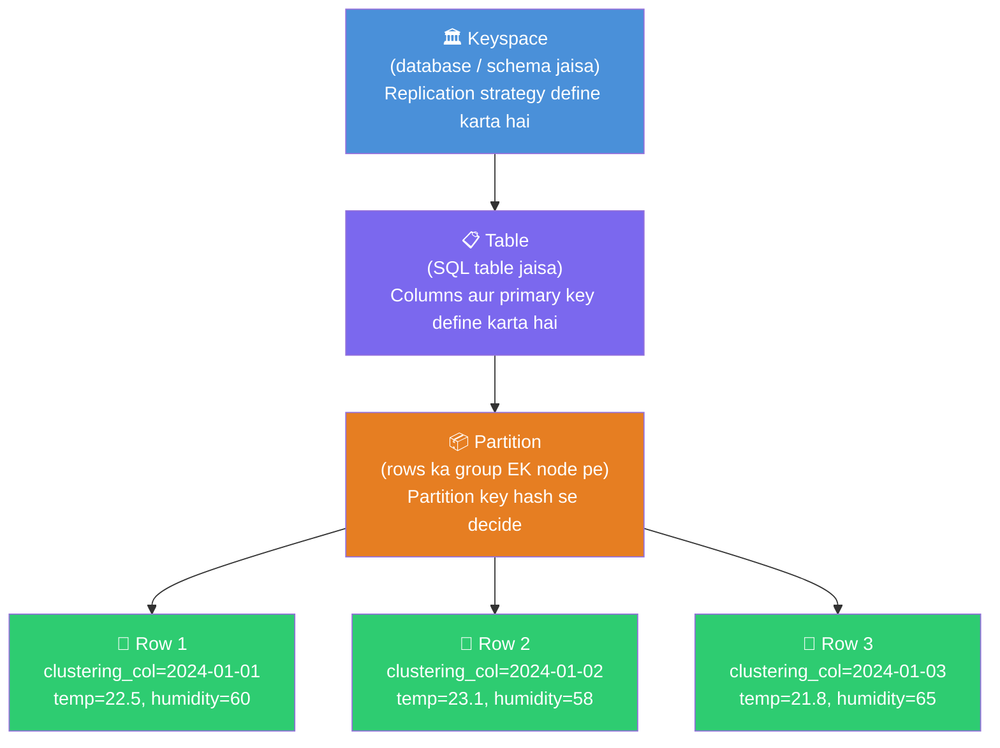
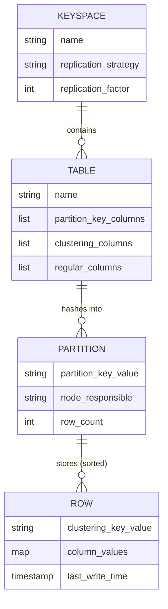
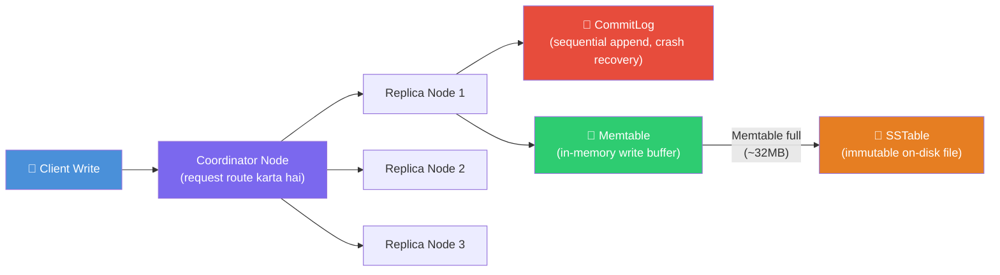
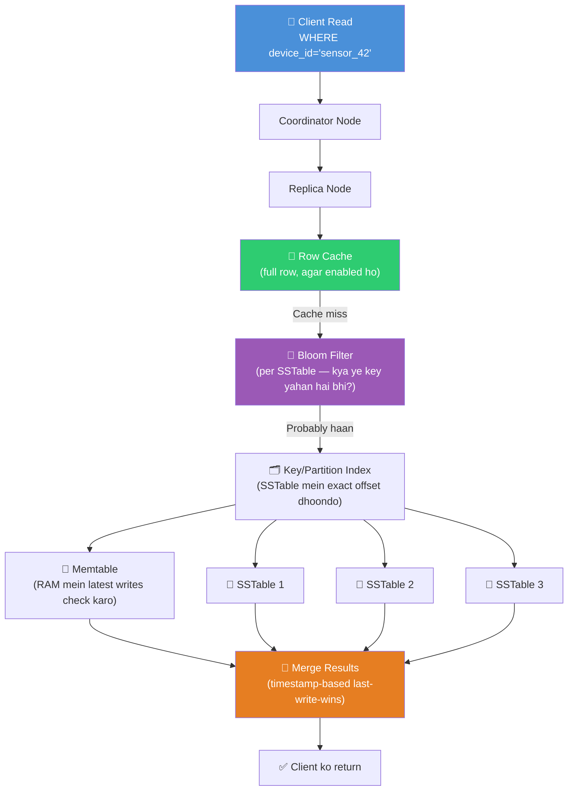

# 🏔️ Chapter 5: Cassandra — Wide Column Store for Massive Scale

> **Ye kiske liye hai:** Un developers ke liye jo SQL aur basic NoSQL samajhte hain, lekin ab deep jaana chahte hain ki Netflix, Apple, aur Instagram jaise systems kaise millions writes per second handle karte hain, woh bhi bina kisi single point of failure ke.

---

## 🌍 Scale Ka Problem Jisne Cassandra Ko Janm Diya

Socho tum duniya ka sabse bada inbox system chala rahe ho. Planet ka har user har dusre user ko message bhej sakta hai. Peak time pe tumhare paas **millions writes per second** aa rahe hain. Tumhara relational database — chahe server kitna bhi beefy ho — buckle karna shuru kar deta hai. Tum read replicas add karte ho. Par writes abhi bhi bottleneck hain kyunki sab ek hi primary server pe jaate hain. Tum PostgreSQL ko manually shard karte ho. Ab tumhare paas 64 shards hain, har ek ka apna primary, aur cross-shard queries ek nightmare ban jaate hain.

Facebook ne 2007 mein Cassandra bilkul isi problem ko solve karne ke liye banaya. Unhe ek aisa database chahiye tha jahan:

- **Har node writes accept kar sake** — koi single primary server na ho
- **Zyada nodes add karne se capacity linearly badhe** — re-sharding ka dard na ho
- **System up rahe chahe data centers down ho jaayein** — multi-region by design
- **Reads aur writes hamesha fast ho** — O(log N) ya usse behtar, petabyte scale pe bhi

Facebook ne 2008 mein Cassandra ko Apache ko open-source kar diya. Aaj, Netflix ise 300 million subscribers ki viewing history store karne ke liye use karta hai. Apple duniya ke sabse bade Cassandra deployments mein se ek chalata hai — thousands of nodes jo iCloud data store karte hain. Discord ne trillions messages isi mein store kiye.

---

## 🗂️ Cassandra Hai Kaunsa Type Ka Database?

Ek traditional spreadsheet ke baare mein socho: rows aur columns, har row ke same columns hote hain. Ye relational model hai.

Ab socho ek spreadsheet jahan **har row ke bilkul alag columns ho sakte hain**, aur ek hi "sheet" mein **billions rows** ho sakti hain, jo hundreds servers mein spread hai. Ye hai **wide column store**.

Cassandra ek **wide column store** hai — na ye relational database hai, na document database. Iska data model dono ke beech kahin hai:

- SQL jaisa: isme tables, rows, aur typed columns hote hain. Tum CQL (Cassandra Query Language) se query karte ho jo SQL jaisa dikhta hai.
- NoSQL jaisa: koi joins nahi, koi foreign keys nahi, koi referential integrity nahi, aur schema kuch configurations mein per-row flexible hai.
- Wide column ki apni khaasiyat: primary key do parts mein bat jaata hai — **partition key** (decide karta hai konsa server data hold karega) aur **clustering columns** (decide karta hai us server ke andar data kaise sort hoga).

---

## ⚖️ Cassandra vs PostgreSQL vs MongoDB

Deep jaane se pehle, ye raha big picture comparison:

| Feature | PostgreSQL | MongoDB | Cassandra |
|---|---|---|---|
| Data model | Tables, rows, columns | JSON documents | Wide column (partitions + columns) |
| Schema | Strict (migrations chahiye) | Per-document flexible | Per-row flexible, par PK fixed hai |
| Joins | Haan, full JOIN support | Limited ($lookup) | **Joins kabhi nahi — never** |
| Transactions | Full ACID | Multi-doc ACID | Sirf lightweight transactions (LWT) |
| Horizontal scaling | Hard (manual sharding) | Easy (built-in sharding) | **Native, linear scaling** |
| Write throughput | Medium | High | **Extremely high** |
| Read pattern | Koi bhi pattern (indexes help karte hain) | Koi bhi pattern | **Partition key se hi query karna padega** |
| Consistency | Strong (ACID) | Configurable | **Default eventual hai, tunable** |
| Multi-region | Painful | Atlas handle karta hai | **Built-in multi-datacenter** |
| Best for | Transactional apps, complex queries | Flexible schemas, rapid iteration | **Time-series, IoT, messaging, audit logs** |

Short mein: **PostgreSQL use karo jab correctness aur flexibility chahiye; MongoDB use karo jab flexible schema chahiye moderate scale pe; Cassandra use karo jab tumhe millions records per second write karne hain multiple data centers mein, woh bhi guaranteed uptime ke saath.**

---

## 🎯 CAP Theorem — Cassandra Kahan Khada Hai

Teen dosto ko socho: **Consistency**, **Availability**, aur **Partition Tolerance**. CAP theorem kehta hai ki tum in teeno mein se sirf do ko fully guarantee kar sakte ho, jab network partitions (nodes ek dusre se contact kho dein) hote hain.

Cassandra ek deliberate choice karta hai: **AP — Available + Partition Tolerant**.

| CAP Choice | Iska Matlab | Examples |
|---|---|---|
| **CA** (Consistency + Availability) | Perfectly kaam karta hai — par network splits handle nahi kar sakta | Traditional SQL (single node) |
| **CP** (Consistency + Partition Tolerant) | Splits ke dauran consistent rehta hai — par requests refuse kar sakta hai | HBase, Zookeeper, etcd |
| **AP** (Availability + Partition Tolerant) | Splits ke dauran hamesha reads/writes accept karta hai — data thoda stale ho sakta hai | **Cassandra**, DynamoDB, CouchDB |

Jab network partition tumhare Cassandra cluster ko do halves mein split karta hai, dono halves reads aur writes accept karte rehte hain. Partition heal hone ke baad, nodes apna data **reconcile** karte hain ek process se jise **last-write-wins** kehte hain (timestamps ke basis pe). Iska matlab ye hai ki tum thoda stale data padh sakte ho ek chhote window mein — isko hi kehte hain **eventual consistency**.

Ye bug nahi hai — ye woh price hai jo tum chukate ho kabhi down na hone ke liye. Zyaadatar applications ke liye (user feeds, metrics, IoT sensor data), 50 milliseconds stale data padhna bilkul theek hai. Bank transfer ke liye nahi — uske liye PostgreSQL use karo.

Cassandra tumhe consistency **tune** karne deta hai, per query. Tumhe har jagah eventual consistency accept karna zaruri nahi hai — tum critical reads pe QUORUM consistency maang sakte ho, thodi latency ki keemat pe.

---

## 🏗️ Cassandra Data Model — Upar Se Neeche

### Hierarchy

Ek library organize karne ke baare mein socho. Library building hai **keyspace**. Har floor ek **table** hai. Floor ka har bookshelf ek **partition** hai. Shelf ki books hain **rows** (ek specific order mein clustered). Har book ke andar ki information hai **column values**.



### Keyspace — Top-Level Container

Ek **keyspace** roughly PostgreSQL ke database ya schema jaisa hi hai. Iska sabse important setting hai **replication factor** — nodes mein data ke kitne copies exist karte hain.

```sql
-- Ek keyspace banao 3 replicas per datacenter ke saath
CREATE KEYSPACE iot_platform
  WITH replication = {
    'class': 'NetworkTopologyStrategy',
    'us-east': 3,
    'eu-west': 3
  };
```

`replication_factor = 3` ke saath, har partition 3 alag nodes pe store hota hai. Tum 2 nodes lose kar sakte ho aur phir bhi data read/write kar sakte ho. `NetworkTopologyStrategy` tumhe replicas ko racks aur data centers mein intelligently place karne deta hai.

### Primary Key — Sabse Important Decision Jo Tum Loge

Cassandra mein, **primary key** hi sab kuch hai. Ye decide karta hai:

1. **Konsa node** data store karega (partition key ke through)
2. **Rows kaise sort honge** node ke andar (clustering columns ke through)
3. **Konsi queries possible hain** (tumhe almost hamesha partition key se filter karna padega)

```
PRIMARY KEY = (partition_key) + clustering_columns
```

Partition key ko **shipping address** samjho — ye decide karta hai konsa warehouse (node) package store karega. Clustering columns ek **shelf number** jaisa hai us warehouse ke andar — ye items ka order decide karta hai jab woh arrive hote hain.

```sql
-- Example: IoT sensor readings
CREATE TABLE sensor_readings (
  device_id   TEXT,          -- partition key: ek device = ek node
  recorded_at TIMESTAMP,     -- clustering key: node ke andar time se sorted
  temperature DECIMAL,
  humidity    DECIMAL,
  pressure    DECIMAL,
  PRIMARY KEY (device_id, recorded_at)
) WITH CLUSTERING ORDER BY (recorded_at DESC);
```

Yahan:
- `device_id` hai **partition key** — ek device ki saari readings same node(s) pe rehti hain
- `recorded_at` hai **clustering column** — readings disk pe newest-first store hoti hain
- "Mujhe `sensor_42` ki last 100 readings do" query karna blazing fast hai — ye ek single partition scan hai reverse order mein

### Composite Partition Keys

Kabhi kabhi ek single column data ko nodes mein evenly distribute nahi karta. Tum **composite partition key** use kar sakte ho:

```sql
-- device_id AUR date (YYYYMMDD) dono se partition karo
-- Ek partition ko limit karta hai ek device ke ek din ki readings tak
CREATE TABLE sensor_readings_daily (
  device_id   TEXT,
  date        TEXT,      -- e.g. '2024-01-15'
  recorded_at TIMESTAMP,
  temperature DECIMAL,
  PRIMARY KEY ((device_id, date), recorded_at)
  --           ^^^^^^^^^^^^^^^^^ composite partition key (double parens dekho)
) WITH CLUSTERING ORDER BY (recorded_at DESC);
```

Double parentheses `((device_id, date))` Cassandra ko batate hain ki DONO columns milkar partition key banate hain. Ye ek common pattern hai time-series data ke liye — ye kisi single partition ko unbounded grow hone se rokta hai.

---

## 🎨 Data Model Diagram



---

## ✍️ Denormalization Optional Nahi Hai — Ye Hi Rule Hai

SQL mein, tum data normalize karte ho duplication avoid karne ke liye. Cassandra mein, tum **denormalize karte ho design se hi**. Koi joins nahi hain. Tumhe data waise store karna padta hai jaise tum use padhna chahte ho.

**Cassandra Data Modeling Ka Golden Rule:**

> Apne tables ko apni queries ke around design karo, apne entities ke around nahi.

Socho tum ek messaging app bana rahe ho. PostgreSQL mein tumhare paas ho sakta hai:

```sql
-- PostgreSQL (normalized)
CREATE TABLE users (id BIGINT PRIMARY KEY, username TEXT, ...);
CREATE TABLE conversations (id BIGINT PRIMARY KEY, name TEXT, ...);
CREATE TABLE messages (
  id BIGINT PRIMARY KEY,
  conversation_id BIGINT REFERENCES conversations(id),
  sender_id BIGINT REFERENCES users(id),
  body TEXT,
  sent_at TIMESTAMP
);
-- Query: ek conversation ke last 50 messages lao
SELECT m.*, u.username FROM messages m
JOIN users u ON m.sender_id = u.id
WHERE m.conversation_id = 42
ORDER BY m.sent_at DESC LIMIT 50;
```

Cassandra mein, tum pehle apni query identify karte ho: **"Ek conversation ke last 50 messages lao."** Phir tum aisa table banate ho jo is query ko single partition read bana de:

```sql
-- Cassandra (query-driven design)
CREATE TABLE messages_by_conversation (
  conversation_id BIGINT,
  sent_at         TIMESTAMP,
  message_id      UUID,
  sender_username TEXT,        -- denormalized! users table se copy kiya
  body            TEXT,
  PRIMARY KEY (conversation_id, sent_at, message_id)
) WITH CLUSTERING ORDER BY (sent_at DESC, message_id DESC);

-- Query: trivially fast, single partition scan
SELECT * FROM messages_by_conversation
WHERE conversation_id = 42
LIMIT 50;
```

Haan, tum `sender_username` har ek message row mein store karte ho. Ye intentional hai. Agar username change ho, tumhe saari copies update karni padengi — par reads hamesha instant rahengi. Ye trade-off hi Cassandra design ka dil hai.

---

## 💬 CQL — Cassandra Query Language

CQL SQL jaisa dikhta hai par isme important restrictions hain:

```sql
-- Ek keyspace USE karo
USE iot_platform;

-- CREATE TABLE
CREATE TABLE sensor_readings (
  device_id   TEXT,
  recorded_at TIMESTAMP,
  temperature DECIMAL,
  humidity    DECIMAL,
  PRIMARY KEY (device_id, recorded_at)
) WITH CLUSTERING ORDER BY (recorded_at DESC);

-- INSERT (hamesha full upsert hai — koi separate INSERT/UPDATE nahi)
INSERT INTO sensor_readings (device_id, recorded_at, temperature, humidity)
VALUES ('sensor_42', '2024-01-15 12:00:00', 22.5, 60.3)
USING TTL 604800;  -- 7 din baad automatically delete (604800 seconds)

-- SELECT — partition key include karna zaruri hai
SELECT * FROM sensor_readings
WHERE device_id = 'sensor_42'
  AND recorded_at >= '2024-01-15 00:00:00'
  AND recorded_at <= '2024-01-15 23:59:59';

-- SELECT with LIMIT
SELECT * FROM sensor_readings
WHERE device_id = 'sensor_42'
LIMIT 100;

-- Ek specific row UPDATE karo
UPDATE sensor_readings
SET temperature = 23.1
WHERE device_id = 'sensor_42'
  AND recorded_at = '2024-01-15 12:00:00';

-- Ek specific row DELETE karo
DELETE FROM sensor_readings
WHERE device_id = 'sensor_42'
  AND recorded_at = '2024-01-15 12:00:00';

-- Poora partition DELETE karo
DELETE FROM sensor_readings
WHERE device_id = 'sensor_42';
```

### TTL (Time-To-Live) — Automatic Data Expiry

Cassandra ka ek killer feature IoT aur logging ke liye: tum kisi bhi row ya column pe TTL laga sakte ho. TTL expire hone ke baad, Cassandra automatically data delete kar deta hai. Ye perfect hai sirf last 30 din ki sensor readings rakhne ke liye, bina koi separate cleanup job chalaye.

```sql
-- 30-day TTL ke saath insert karo
INSERT INTO sensor_readings (device_id, recorded_at, temperature)
VALUES ('sensor_42', toTimestamp(now()), 22.5)
USING TTL 2592000;  -- 30 din seconds mein

-- Ek row ka remaining TTL check karo
SELECT TTL(temperature) FROM sensor_readings
WHERE device_id = 'sensor_42'
  AND recorded_at = '2024-01-15 12:00:00';
```

---

## ⚡ Read/Write Path — Cassandra Data Kaise Handle Karta Hai

### Write Path

Cassandra mein writing jitna possible ho utna fast design kiya gaya hai. Ek restaurant ke chef ko socho: woh pehle order runner ko chillakar bata dete hain (commit log) taaki woh kabhi bhoola na jaaye, phir turant cooking shuru kar dete hain (memtable jo RAM mein hai). Kisi bhi point pe woh ruk kar wait nahi karte ki order archive mein file ho jaaye (SSTable disk pe).



**Step by step:**

1. **CommitLog append** — Write pehle disk pe ek commit log mein append hota hai (sequential write — extremely fast). Agar node abhi crash ho jaaye, data commit log se recover ho sakta hai restart pe.

2. **Memtable write** — Write ek in-memory data structure mein jaata hai jise **memtable** kehte hain. Ye recent data ki live, queryable copy hai.

3. **Acknowledgement** — Ek baar jab required number of replicas write confirm kar dete hain (tumhare consistency level ke hisaab se), coordinator client ko "success" bata deta hai.

4. **Flush to SSTable** — Jab memtable fill ho jaata hai (typically ~32-64MB), woh disk pe flush hota hai ek **SSTable** (Sorted String Table) ke roop mein — ek immutable, sorted file. SSTables banne ke baad kabhi modify nahi hoti; naye writes naye SSTables banate hain.

### Read Path

Reading zyada complex hai kyunki data multiple SSTables mein disk pe spread ho sakta hai plus live memtable mein bhi:



**Step by step:**

1. **Row cache check** — Agar row caching enabled hai aur row recently padhi gayi thi, turant return kar do. Bahut fast.

2. **Bloom filter** — Har SSTable ka ek Bloom filter hota hai (ek space-efficient probabilistic structure — Bloom Filters chapter dekho). Kisi bhi SSTable ko disk se padhne se pehle, Cassandra uska Bloom filter check karta hai. Agar filter kehta hai "definitely is SSTable mein nahi hai," poore SSTable ko skip kar do. Isse expensive disk seeks bach jaate hain.

3. **Key index** — Jo SSTables mein key ho sakti hai, unke liye partition index use karo exact byte offset disk pe dhoondne ke liye.

4. **Memtable + SSTable merge** — Cassandra relevant data memtable (sabse recent) se aur saare relevant SSTables se padhta hai. Kyunki har write timestamped hai, ye conflicts ko resolve kar sakta hai latest timestamp lekar — **last write wins**.

5. **Merged result return** — Coordinator replicas se results collect karta hai (consistency level ke hisaab se), unko reconcile karta hai, aur client ko return kar deta hai.

### Compaction — SSTables Ko Healthy Rakhna

Time ke saath, dozens ya hundreds SSTables jama ho jaate hain. Reads slow ho jaate hain kyunki zyada files check karni padti hain. **Compaction** background process hai jo multiple SSTables ko ek mein merge karta hai:

- Deleted data (tombstones) ko eliminate karta hai
- Overwritten data ko eliminate karta hai (sirf latest version rakhta hai)
- Files kam karke read performance improve karta hai
- Disk space free karta hai

Compaction ko apna desk saaf karne jaisa socho: kaam piles mein jama hota hai (SSTables), aur periodically tum sab kuch neat folders mein organize karte ho, purane drafts phenk dete ho, aur sirf zaruri cheez rakhte ho.

```
Compaction se pehle:
[SSTable-1: device_42 temp=22 at 12:00] + [SSTable-2: device_42 temp=23 at 12:05]

Compaction ke baad:
[SSTable-merged: device_42 temp=23 at 12:05]  ← sirf latest rakha gaya
```

---

## 🎚️ Consistency Levels — Trade-off Ko Tune Karna

Cassandra tumhe **per query** choose karne deta hai ki kitne replicas ko agree karna hai isse pehle ki read/write successful mana jaaye. Ye sabse powerful tuning knob hai jo Cassandra offer karta hai.

| Consistency Level | Writes Ko Chahiye | Reads Ko Chahiye | Trade-off |
|---|---|---|---|
| `ONE` | 1 replica confirm kare | 1 replica respond kare | Sabse fast, weakest consistency |
| `QUORUM` | Majority (RF/2 + 1) | Majority (RF/2 + 1) | Balanced — sabse common choice |
| `ALL` | Saare replicas confirm karein | Saare replicas respond karein | Strongest consistency, sabse slow, least available |
| `LOCAL_QUORUM` | Local DC mein majority | Local DC mein majority | Multi-DC apps ke liye best |
| `LOCAL_ONE` | Local DC mein 1 replica | Local DC mein 1 replica | Latency-sensitive local reads ke liye |

**QUORUM ka jaadu:** RF=3 ke saath, QUORUM ko 2 replicas chahiye. Agar tum QUORUM pe write aur QUORUM pe read karte ho, tumhe guarantee hai ki tum hamesha latest write padhoge — kyunki read quorum mein kam se kam ek replica ne write quorum mein participate kiya hoga.

```
RF=3, QUORUM=2

Write jaata hai replicas mein: A ✓, B ✓, C ✗ (down)  → Write succeed (2 of 3)
Read aata hai:                A ✓, B ✓               → A aur B dono ke paas latest data hai ✓
```

Tumhare application code mein (DataStax Java driver use karke):

```java
// Low-latency IoT write — ONE theek hai, occasional stale reads acceptable
session.execute(
    SimpleStatement.newInstance(
        "INSERT INTO sensor_readings (device_id, recorded_at, temperature) VALUES (?, ?, ?)",
        "sensor_42", Instant.now(), 22.5
    ).setConsistencyLevel(ConsistencyLevel.ONE)
);

// Critical payment record — QUORUM use karo
session.execute(
    SimpleStatement.newInstance(
        "INSERT INTO payment_events (user_id, event_id, amount) VALUES (?, ?, ?)",
        userId, UUID.randomUUID(), amount
    ).setConsistencyLevel(ConsistencyLevel.QUORUM)
);
```

---

## 🌡️ Full Data Modeling Example: IoT Sensor Platform

Chalo ek complete, real-world data model banate hain ek IoT platform ke liye jo millions devices se sensor readings collect karta hai.

### Requirements
- Har device se har 10 seconds mein reading store karo (86,400 readings/day/device)
- Query: "Ek device ki last N readings lao"
- Query: "Ek device ki kisi specific din ki saari readings lao"
- Query: "Ek device ki latest reading lao" (dashboard)
- 90 din se purana data auto-delete karo

### Step 1: Query-Driven Design

Hum queries se shuru karte hain, phir tables design karte hain.

```sql
-- Table 1: Main time-series table
-- Query: device + time range se readings
CREATE TABLE sensor_readings (
  device_id   TEXT,
  date        TEXT,          -- YYYYMMDD — partition size ko 1 din tak bounds karta hai
  recorded_at TIMESTAMP,
  temperature DECIMAL,
  humidity    DECIMAL,
  pressure    DECIMAL,
  battery_pct SMALLINT,
  PRIMARY KEY ((device_id, date), recorded_at)
) WITH CLUSTERING ORDER BY (recorded_at DESC)
  AND default_time_to_live = 7776000;  -- 90 din TTL

-- Table 2: Har device ki latest reading (dashboards ke liye)
-- Query: kisi bhi device ka current state instantly lao
CREATE TABLE sensor_latest (
  device_id   TEXT PRIMARY KEY,
  recorded_at TIMESTAMP,
  temperature DECIMAL,
  humidity    DECIMAL,
  pressure    DECIMAL,
  battery_pct SMALLINT,
  updated_at  TIMESTAMP
);

-- Table 3: Location ke hisaab se devices (map view ke liye)
-- Query: ek region ke saare devices
CREATE TABLE devices_by_region (
  region      TEXT,
  country     TEXT,
  device_id   TEXT,
  device_name TEXT,
  lat         DECIMAL,
  lng         DECIMAL,
  PRIMARY KEY ((region, country), device_id)
);
```

### Step 2: Write Path (Application Code)

```python
from cassandra.cluster import Cluster
from cassandra.auth import PlainTextAuthProvider
from cassandra import ConsistencyLevel
from cassandra.query import SimpleStatement
from datetime import datetime, timezone
import uuid

cluster = Cluster(['cassandra-node-1', 'cassandra-node-2', 'cassandra-node-3'])
session = cluster.connect('iot_platform')

def record_sensor_reading(device_id: str, temperature: float, humidity: float,
                           pressure: float, battery_pct: int):
    now = datetime.now(timezone.utc)
    date_str = now.strftime('%Y%m%d')

    # Time-series table mein write karo
    session.execute(
        """
        INSERT INTO sensor_readings
          (device_id, date, recorded_at, temperature, humidity, pressure, battery_pct)
        VALUES (%s, %s, %s, %s, %s, %s, %s)
        """,
        (device_id, date_str, now, temperature, humidity, pressure, battery_pct)
    )

    # Latest reading update karo (upsert — Cassandra INSERT hamesha overwrite karta hai)
    session.execute(
        """
        INSERT INTO sensor_latest
          (device_id, recorded_at, temperature, humidity, pressure, battery_pct, updated_at)
        VALUES (%s, %s, %s, %s, %s, %s, %s)
        """,
        (device_id, now, temperature, humidity, pressure, battery_pct, now)
    )

def get_device_readings_today(device_id: str, limit: int = 100):
    today = datetime.now(timezone.utc).strftime('%Y%m%d')
    rows = session.execute(
        "SELECT * FROM sensor_readings WHERE device_id=%s AND date=%s LIMIT %s",
        (device_id, today, limit)
    )
    return list(rows)

def get_latest_reading(device_id: str):
    row = session.execute(
        "SELECT * FROM sensor_latest WHERE device_id=%s",
        (device_id,)
    ).one()
    return row
```

---

## 🚫 Anti-Patterns — Cassandra Mein Ye Kabhi Mat Karna

### 1. ALLOW FILTERING — Performance Disaster

```sql
-- BAD: Ye poore cluster ka scan force karta hai
SELECT * FROM sensor_readings
WHERE temperature > 30.0
ALLOW FILTERING;
```

`ALLOW FILTERING` Cassandra ko batata hai **har node ka har partition** scan karo matching rows dhoondne ke liye. Billions rows ke saath, ye minutes le sakta hai aur tumhara cluster crash kar sakta hai. Production mein isko kabhi use mat karo.

**Fix:** Jo query pattern tumhe chahiye uske liye ek separate table design karo. Agar tumhe "saare devices jahan temperature > 30" chahiye, ek separate `hot_alerts` table maintain karo jisme tum write karo jab temperature threshold cross ho.

### 2. High-Cardinality Columns Pe Secondary Indexes

```sql
-- BAD: Ek near-unique column pe secondary index banana
CREATE INDEX ON sensor_readings (recorded_at);
-- recorded_at almost unique hai — ye index huge aur slow hoga
```

Cassandra mein secondary indexes locally har node pe store hote hain. Secondary index se query karne ke liye saare nodes ko broadcast karna padta hai — ye scatter-gather query ban jaati hai. Ye low-cardinality columns ke liye theek chalta hai (jaise status = 'active' | 'inactive') par timestamps ya UUIDs jaise high-cardinality columns ke liye bahut bura hai.

**Fix:** Materialized views ya ek separate denormalized table use karo.

### 3. Unbounded Partitions (Hot Partition Problem)

```sql
-- BAD: Partition key sirf device_id hai
-- Jo device saalon chalega uske ek hi partition mein billions rows ho jaayengi
CREATE TABLE sensor_readings (
  device_id   TEXT,
  recorded_at TIMESTAMP,
  temperature DECIMAL,
  PRIMARY KEY (device_id, recorded_at)
);
```

Ek partition = ek node. Agar saare reads/writes same partition pe jaate hain, woh ek node **hot spot** ban jaata hai jabki baaki idle baithe rehte hain. Partitions ko ~100MB se neeche rakhna chahiye.

**Fix:** Partition key mein ek time bucket add karo (jaise `(device_id, date)` data ko daily partitions mein split kar deta hai).

### 4. Cassandra Ko Relational Database Ki Tarah Use Karna

```sql
-- BAD: Ye fail hoge ya extremely slow honge
SELECT * FROM messages ORDER BY sent_at DESC;  -- koi partition key nahi = full scan
SELECT * FROM users WHERE name LIKE '%john%';  -- CQL mein text search nahi hai
SELECT COUNT(*) FROM messages;                  -- full cluster scan
```

---

## 🏆 Cassandra vs DynamoDB

Dono hi wide-column, AP databases hain massive scale ke liye design kiye gaye. Yahan dekho ye kaise differ karte hain:

| Feature | Cassandra (Apache/DataStax) | DynamoDB (AWS) |
|---|---|---|
| Hosting | Self-managed ya DataStax Astra (managed) | Fully managed (sirf AWS) |
| Cost model | Fixed server costs | Read/write unit + storage ke hisaab se pay |
| Multi-cloud | Haan — kahin bhi chalao | Sirf AWS |
| Data model | Keyspace → Table → Partition | Table → Partition → Sort key |
| Query language | CQL (SQL-like) | PartiQL ya DynamoDB API |
| Consistency | Tunable (ONE/QUORUM/ALL/etc.) | Eventually consistent ya strongly consistent |
| Secondary indexes | Local secondary indexes, materialized views | GSI (Global Secondary Index), LSI |
| Scaling | Manual ya automatic (DataStax Astra) | Fully automatic (on-demand ya provisioned) |
| Operational burden | High (self-managed) / Low (Astra) | Bahut kam |
| Vendor lock-in | Nahi (open source) | High (AWS proprietary) |
| Best for | Multi-cloud, cost-sensitive huge scale | AWS-native apps, zero ops chahne wali teams |

**Cassandra kab choose karo DynamoDB se zyada:** Tumhe multi-cloud ya on-premise deployment chahiye, tumhare paas predictable high-volume workloads hain (fixed costs per-unit pricing se better hai), ya tumhari team open-source tooling chahti hai.

**DynamoDB kab choose karo Cassandra se zyada:** Tum poori tarah AWS pe ho, zero operational overhead chahiye, tumhare paas variable/unpredictable traffic hai aur automatic scaling chahiye bina capacity planning ke.

---

## ✅ Cassandra Kab Use Karo

**Cassandra use karo jab:**

- Tumhe **millions writes per second** chahiye consistent low latency ke saath
- Tumhara data **time-series** nature ka hai (IoT, metrics, events, logs, audit trails)
- Tumhe **multi-datacenter replication** chahiye bina single point of failure ke
- Tumhare access patterns **well-defined hain aur partition key se read hote hain**
- Data ka ek **natural TTL** hai (tumhe sirf last N din chahiye)
- Tumhe **99.99%+ uptime** chahiye — Cassandra writes ke liye kabhi down nahi hota, node failures ke dauran bhi

**Real examples:** Netflix viewing history, Discord messages (trillions), Apple iCloud metadata, Instagram activity feeds, Uber trip data, time-series metrics (InfluxDB actually Cassandra se inspired hai).

---

## ❌ Cassandra Kab NAHI Use Karo

**Cassandra use MAT karo jab:**

- Tumhe **JOINs** ya complex relational queries chahiye — PostgreSQL use karo
- Tumhe **strong ACID transactions** chahiye — PostgreSQL ya CockroachDB use karo
- Tumhare access patterns **ad-hoc ya unpredictable** hain — PostgreSQL + proper indexes use karo
- Tumhare paas **small data** hai (< 1TB) — Cassandra ka operational overhead worth nahi hai
- Tumhe **full-text search** chahiye — Elasticsearch use karo
- Tumhari team chhoti hai aur distributed systems complexity handle nahi kar sakti
- Tumhe cheezein count karni hain, data aggregate karna hai, ya analytics chalane hain — ClickHouse ya BigQuery use karo

---

## 🔑 Key Takeaways

| Concept | Yaad Rakhne Wali Baat |
|---|---|
| **Wide column store** | Rows ke alag columns ho sakte hain; partition key + clustering columns data organize karte hain |
| **AP in CAP** | Hamesha available, eventually consistent — system kabhi writes reject nahi karta |
| **Partition key = shard key** | Partition key decide karta hai konsa node data hold karega — hot spots avoid karne ke liye wisely choose karo |
| **Clustering columns** | Partition ke andar rows ka sort order define karte hain — apni read queries ke liye design karo |
| **Sab kuch denormalize karo** | Kabhi joins nahi — data duplicate karo, tables ko query patterns ke around design karo |
| **Write path** | CommitLog (durability) → Memtable (speed) → SSTable (persistence) |
| **Read path** | Memtable + SSTables timestamps se merge hote hain; Bloom filters irrelevant files skip karte hain |
| **Compaction** | Background process jo SSTables merge karta hai — reads fast rakhta hai, space reclaim karta hai |
| **Consistency levels** | ONE (fast, weak) → QUORUM (balanced) → ALL (slow, strong) — per query tune karo |
| **TTL** | Built-in auto-expiry — perfect time-series data ke liye bina cleanup jobs ke |
| **Anti-patterns** | Production mein ALLOW FILTERING kabhi use mat karo; high-cardinality columns pe secondary indexes avoid karo; apne partition sizes bound karo |
| **Cassandra vs DynamoDB** | Cassandra = open source, multi-cloud, fixed costs; DynamoDB = AWS-managed, zero ops, variable cost |

---

> **Sabse important baat jo yaad rakhni hai:** Cassandra tumhe apne data ke baare mein alag tarike se sochne pe force karta hai. Tum pehle tables design nahi karte aur phir queries figure out nahi karte. Tum **queries se shuru karte ho aur aise tables design karte ho jo un queries ko ek single partition read bana dein**. Ek baar ye mindset click ho jaaye, Cassandra tumhare engineering arsenal ka sabse powerful tool ban jaata hai.
