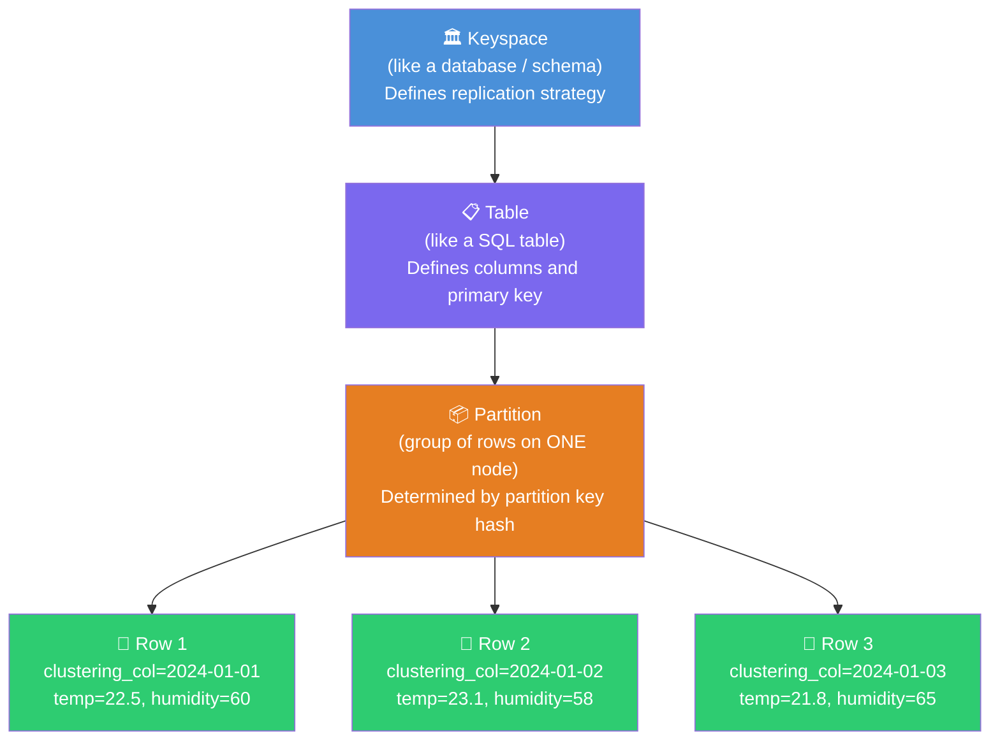
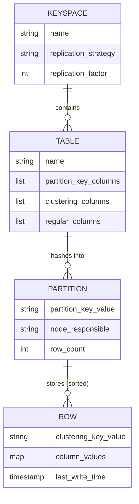
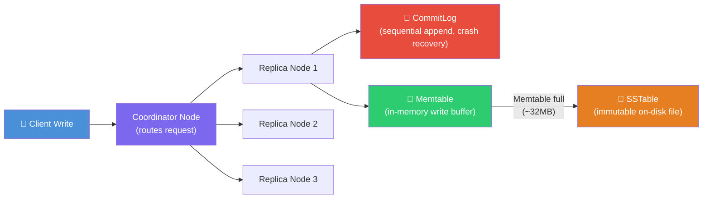
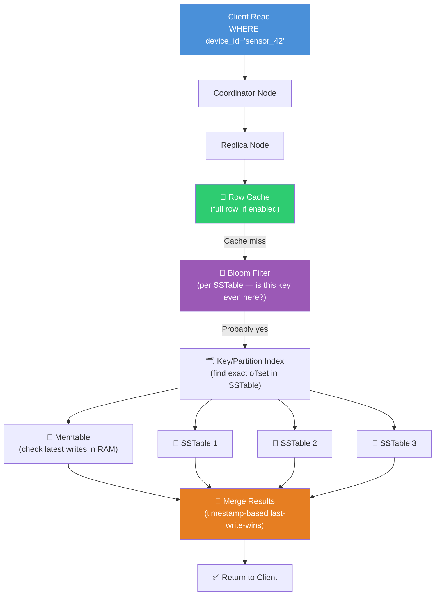

# 🏔️ Chapter 5: Cassandra — Wide Column Store for Massive Scale

> **Who this is for:** Developers who understand SQL and basic NoSQL but want to go deep on how systems like Netflix, Apple, and Instagram handle millions of writes per second without a single point of failure.

---

## 🌍 The Scale Problem That Created Cassandra

Imagine you run the world's largest inbox system. Every user on the planet can send messages to every other user. At peak, you have **millions of writes per second**. Your relational database — no matter how beefy the server — starts to buckle. You try to add read replicas. Writes are still a bottleneck because they all go to one primary server. You try sharding PostgreSQL manually. Now you have 64 shards, each with its own primary, and cross-shard queries are a nightmare.

Facebook built Cassandra in 2007 exactly to solve this problem. They needed a database where:

- **Every node can accept writes** — no single primary server
- **Adding more nodes linearly increases capacity** — no re-sharding pain
- **The system stays up even when data centers go down** — multi-region by design
- **Reads and writes are always fast** — O(log N) or better, even at petabyte scale

Facebook open-sourced Cassandra to Apache in 2008. Today, Netflix uses it to store viewing history for 300 million subscribers. Apple runs one of the world's largest Cassandra deployments — thousands of nodes storing iCloud data. Discord stored trillions of messages in it.

---

## 🗂️ What Kind of Database IS Cassandra?

Think of a traditional spreadsheet: rows and columns, every row has the same columns. That is a relational model.

Now think of a spreadsheet where **each row can have completely different columns**, and you can have **billions of rows per "sheet"**, spread across hundreds of servers. That is a **wide column store**.

Cassandra is a **wide column store** — not a relational database, not a document database. Its data model sits between the two:

- Like SQL: it has tables, rows, and typed columns. You query with CQL (Cassandra Query Language) which looks like SQL.
- Like NoSQL: it has no joins, no foreign keys, no referential integrity, and schema is flexible per row in some configurations.
- Unique to wide column: the primary key is split into a **partition key** (controls which server holds the data) and **clustering columns** (controls how data is sorted within that server).

---

## ⚖️ Cassandra vs PostgreSQL vs MongoDB

Before going deep, here is the big picture comparison:

| Feature | PostgreSQL | MongoDB | Cassandra |
|---|---|---|---|
| Data model | Tables, rows, columns | JSON documents | Wide column (partitions + columns) |
| Schema | Strict (migrations needed) | Flexible per document | Flexible per row, but PK is fixed |
| Joins | Yes, full JOIN support | Limited ($lookup) | **No joins — ever** |
| Transactions | Full ACID | Multi-doc ACID | Lightweight transactions only (LWT) |
| Horizontal scaling | Hard (manual sharding) | Easy (built-in sharding) | **Native, linear scaling** |
| Write throughput | Medium | High | **Extremely high** |
| Read pattern | Any pattern (indexes help) | Any pattern | **Must query by partition key** |
| Consistency | Strong (ACID) | Configurable | **Eventual by default, tunable** |
| Multi-region | Painful | Atlas handles it | **Built-in multi-datacenter** |
| Best for | Transactional apps, complex queries | Flexible schemas, rapid iteration | **Time-series, IoT, messaging, audit logs** |

The short version: **use PostgreSQL when you need correctness and flexibility; use MongoDB when you need a flexible schema with moderate scale; use Cassandra when you need to write millions of records per second across multiple data centers with guaranteed uptime.**

---

## 🎯 CAP Theorem — Where Cassandra Sits

Picture three friends: **Consistency**, **Availability**, and **Partition Tolerance**. The CAP theorem says you can only fully guarantee two of them when network partitions (nodes losing contact with each other) happen.

Cassandra makes a deliberate choice: **AP — Available + Partition Tolerant**.

| CAP Choice | What It Means | Examples |
|---|---|---|
| **CA** (Consistency + Availability) | Works perfectly — but can't handle network splits | Traditional SQL (single node) |
| **CP** (Consistency + Partition Tolerant) | Stays consistent during splits — but may refuse requests | HBase, Zookeeper, etcd |
| **AP** (Availability + Partition Tolerant) | Always accepts reads/writes during splits — data may be briefly stale | **Cassandra**, DynamoDB, CouchDB |

When a network partition splits your Cassandra cluster into two halves, both halves keep accepting reads and writes. Once the partition heals, the nodes **reconcile** their data using a process called **last-write-wins** (based on timestamps). This means you might read slightly stale data for a brief window — that is **eventual consistency**.

This is not a bug — it is the price you pay for never going down. For most applications (user feeds, metrics, IoT sensor data), reading data that is 50 milliseconds stale is completely fine. For a bank transfer, it is not — use PostgreSQL for that.

Cassandra lets you **tune** consistency per query. You do not have to accept eventual consistency everywhere if you do not want to — you can ask for QUORUM consistency on critical reads, at the cost of some latency.

---

## 🏗️ Cassandra Data Model — From Top to Bottom

### The Hierarchy

Think of organizing a library. The library building is the **keyspace**. Each floor is a **table**. Each bookshelf on a floor is a **partition**. The books on a shelf are **rows** (clustered in a specific order). The information inside each book is the **column values**.



### Keyspace — The Top-Level Container

A **keyspace** is roughly equivalent to a database or schema in PostgreSQL. Its most important setting is the **replication factor** — how many copies of each piece of data exist across nodes.

```sql
-- Create a keyspace with 3 replicas per datacenter
CREATE KEYSPACE iot_platform
  WITH replication = {
    'class': 'NetworkTopologyStrategy',
    'us-east': 3,
    'eu-west': 3
  };
```

With `replication_factor = 3`, every partition is stored on 3 different nodes. You can lose 2 nodes and still read/write data. The `NetworkTopologyStrategy` lets you place replicas intelligently across racks and data centers.

### The Primary Key — The Most Important Decision You Will Make

In Cassandra, the **primary key** is everything. It determines:

1. **Which node** stores the data (via the partition key)
2. **How rows are sorted** within a node (via clustering columns)
3. **What queries are even possible** (you almost always must filter by partition key)

```
PRIMARY KEY = (partition_key) + clustering_columns
```

Think of the partition key as the **shipping address** — it decides which warehouse (node) stores the package. The clustering columns are like the **shelf number** inside that warehouse — they decide the order of items once they arrive.

```sql
-- Example: IoT sensor readings
CREATE TABLE sensor_readings (
  device_id   TEXT,          -- partition key: one node per device
  recorded_at TIMESTAMP,     -- clustering key: sorted by time within node
  temperature DECIMAL,
  humidity    DECIMAL,
  pressure    DECIMAL,
  PRIMARY KEY (device_id, recorded_at)
) WITH CLUSTERING ORDER BY (recorded_at DESC);
```

Here:
- `device_id` is the **partition key** — all readings for a device live on the same node(s)
- `recorded_at` is the **clustering column** — readings are stored newest-first on disk
- Querying "give me the last 100 readings for device `sensor_42`" is blazing fast — it is a single partition scan in reverse order

### Composite Partition Keys

Sometimes a single column does not distribute data evenly across nodes. You can use a **composite partition key**:

```sql
-- Partition by BOTH device_id AND date (YYYYMMDD)
-- Limits one partition to one day of readings per device
CREATE TABLE sensor_readings_daily (
  device_id   TEXT,
  date        TEXT,      -- e.g. '2024-01-15'
  recorded_at TIMESTAMP,
  temperature DECIMAL,
  PRIMARY KEY ((device_id, date), recorded_at)
  --           ^^^^^^^^^^^^^^^^^ composite partition key (note double parens)
) WITH CLUSTERING ORDER BY (recorded_at DESC);
```

The double parentheses `((device_id, date))` tell Cassandra that BOTH columns together form the partition key. This is a common pattern for time-series data — it prevents any single partition from growing unbounded.

---

## 🎨 The Data Model Diagram



---

## ✍️ Denormalization Is Not Optional — It Is The Rule

In SQL, you normalize data to avoid duplication. In Cassandra, you **denormalize by design**. There are no joins. You must store data the way you want to read it.

**The Golden Rule of Cassandra Data Modeling:**

> Design your tables around your queries, not around your entities.

Imagine you are building a messaging app. In PostgreSQL you might have:

```sql
-- PostgreSQL (normalized)
CREATE TABLE users (id BIGINT PRIMARY KEY, username TEXT, ...);
CREATE TABLE conversations (id BIGINT PRIMARY KEY, name TEXT, ...);
CREATE TABLE messages (
  id BIGINT PRIMARY KEY,
  conversation_id BIGINT REFERENCES conversations(id),
  sender_id BIGINT REFERENCES users(id),
  body TEXT,
  sent_at TIMESTAMP
);
-- Query: get last 50 messages in a conversation
SELECT m.*, u.username FROM messages m
JOIN users u ON m.sender_id = u.id
WHERE m.conversation_id = 42
ORDER BY m.sent_at DESC LIMIT 50;
```

In Cassandra, you identify your query first: **"Get the last 50 messages in a conversation."** Then you build a table that makes that query a single partition read:

```sql
-- Cassandra (query-driven design)
CREATE TABLE messages_by_conversation (
  conversation_id BIGINT,
  sent_at         TIMESTAMP,
  message_id      UUID,
  sender_username TEXT,        -- denormalized! copied from users table
  body            TEXT,
  PRIMARY KEY (conversation_id, sent_at, message_id)
) WITH CLUSTERING ORDER BY (sent_at DESC, message_id DESC);

-- Query: trivially fast, single partition scan
SELECT * FROM messages_by_conversation
WHERE conversation_id = 42
LIMIT 50;
```

Yes, you store `sender_username` in every single message row. That is intentional. If the username changes, you update all the copies — but reads are always instant. This trade-off is the heart of Cassandra design.

---

## 💬 CQL — Cassandra Query Language

CQL looks like SQL but has important restrictions:

```sql
-- USE a keyspace
USE iot_platform;

-- CREATE TABLE
CREATE TABLE sensor_readings (
  device_id   TEXT,
  recorded_at TIMESTAMP,
  temperature DECIMAL,
  humidity    DECIMAL,
  PRIMARY KEY (device_id, recorded_at)
) WITH CLUSTERING ORDER BY (recorded_at DESC);

-- INSERT (always a full upsert — no separate INSERT/UPDATE)
INSERT INTO sensor_readings (device_id, recorded_at, temperature, humidity)
VALUES ('sensor_42', '2024-01-15 12:00:00', 22.5, 60.3)
USING TTL 604800;  -- automatically delete after 7 days (604800 seconds)

-- SELECT — must include partition key
SELECT * FROM sensor_readings
WHERE device_id = 'sensor_42'
  AND recorded_at >= '2024-01-15 00:00:00'
  AND recorded_at <= '2024-01-15 23:59:59';

-- SELECT with LIMIT
SELECT * FROM sensor_readings
WHERE device_id = 'sensor_42'
LIMIT 100;

-- UPDATE a specific row
UPDATE sensor_readings
SET temperature = 23.1
WHERE device_id = 'sensor_42'
  AND recorded_at = '2024-01-15 12:00:00';

-- DELETE a specific row
DELETE FROM sensor_readings
WHERE device_id = 'sensor_42'
  AND recorded_at = '2024-01-15 12:00:00';

-- DELETE a whole partition
DELETE FROM sensor_readings
WHERE device_id = 'sensor_42';
```

### TTL (Time-To-Live) — Automatic Data Expiry

One of Cassandra's killer features for IoT and logging: you can attach a TTL to any row or column. After the TTL expires, Cassandra automatically deletes the data. This is perfect for keeping only the last 30 days of sensor readings without running a separate cleanup job.

```sql
-- Insert with a 30-day TTL
INSERT INTO sensor_readings (device_id, recorded_at, temperature)
VALUES ('sensor_42', toTimestamp(now()), 22.5)
USING TTL 2592000;  -- 30 days in seconds

-- Check remaining TTL on a row
SELECT TTL(temperature) FROM sensor_readings
WHERE device_id = 'sensor_42'
  AND recorded_at = '2024-01-15 12:00:00';
```

---

## ⚡ The Read/Write Path — How Cassandra Handles Data

### The Write Path

Writing in Cassandra is designed to be as fast as possible. Think of a chef in a restaurant: they first shout the order to a runner (commit log) so it is never forgotten, then immediately start cooking (memtable in RAM). At no point do they stop to wait for the order to be filed in the archive (SSTable on disk).



**Step by step:**

1. **CommitLog append** — The write is first appended to a commit log on disk (sequential write — extremely fast). If the node crashes right now, the data can be recovered from the commit log on restart.

2. **Memtable write** — The write goes into an in-memory data structure called the **memtable**. This is the live, queryable copy of recent data.

3. **Acknowledgement** — Once the required number of replicas confirm the write (based on your consistency level), the coordinator tells the client "success."

4. **Flush to SSTable** — When the memtable fills up (typically around 32-64MB), it is flushed to disk as an **SSTable** (Sorted String Table) — an immutable, sorted file. SSTables are never modified after creation; new writes create new SSTables.

### The Read Path

Reading is more complex because data may be spread across multiple SSTables on disk plus the live memtable:



**Step by step:**

1. **Row cache check** — If row caching is enabled and the row was recently read, return immediately. Very fast.

2. **Bloom filter** — Each SSTable has a Bloom filter (a space-efficient probabilistic structure — see the Bloom Filters chapter). Before reading any SSTable from disk, Cassandra checks its Bloom filter. If the filter says "definitely not in this SSTable," skip it entirely. This avoids expensive disk seeks.

3. **Key index** — For SSTables that might have the key, use the partition index to find the exact byte offset on disk.

4. **Memtable + SSTable merge** — Cassandra reads the relevant data from the memtable (most recent) and from all relevant SSTables. Because each write is timestamped, it can resolve conflicts by taking the latest timestamp — **last write wins**.

5. **Return merged result** — The coordinator collects results from replicas (based on consistency level), reconciles them, and returns to the client.

### Compaction — Keeping SSTables Healthy

Over time, dozens or hundreds of SSTables accumulate. Reads become slower because more files must be checked. **Compaction** is the background process that merges multiple SSTables into one:

- Eliminates deleted data (tombstones)
- Eliminates overwritten data (only keeps the latest version)
- Improves read performance by reducing the number of files to check
- Frees disk space

Think of compaction like cleaning your desk: work accumulates in piles (SSTables), and periodically you organize everything into neat folders, throw away old drafts, and keep only what matters.

```
Before compaction:
[SSTable-1: device_42 temp=22 at 12:00] + [SSTable-2: device_42 temp=23 at 12:05]

After compaction:
[SSTable-merged: device_42 temp=23 at 12:05]  ← only latest kept
```

---

## 🎚️ Consistency Levels — Tuning the Trade-off

Cassandra lets you choose **per query** how many replicas must agree before a read/write is considered successful. This is the most powerful tuning knob Cassandra offers.

| Consistency Level | Writes Need | Reads Need | Trade-off |
|---|---|---|---|
| `ONE` | 1 replica to confirm | 1 replica to respond | Fastest, weakest consistency |
| `QUORUM` | Majority (RF/2 + 1) | Majority (RF/2 + 1) | Balanced — most common choice |
| `ALL` | All replicas to confirm | All replicas to respond | Strongest consistency, slowest, least available |
| `LOCAL_QUORUM` | Majority in local DC | Majority in local DC | Best for multi-DC apps |
| `LOCAL_ONE` | 1 replica in local DC | 1 replica in local DC | For latency-sensitive local reads |

**The magic of QUORUM:** With RF=3, QUORUM requires 2 replicas. If you write at QUORUM and read at QUORUM, you are guaranteed to always read the latest write — because at least one replica in the read quorum must have participated in the write quorum.

```
RF=3, QUORUM=2

Write goes to replicas: A ✓, B ✓, C ✗ (down)  → Write succeeds (2 of 3)
Read comes from:        A ✓, B ✓               → A and B both have latest data ✓
```

In your application code (using the DataStax Java driver):

```java
// Low-latency IoT write — ONE is fine, occasional stale reads acceptable
session.execute(
    SimpleStatement.newInstance(
        "INSERT INTO sensor_readings (device_id, recorded_at, temperature) VALUES (?, ?, ?)",
        "sensor_42", Instant.now(), 22.5
    ).setConsistencyLevel(ConsistencyLevel.ONE)
);

// Critical payment record — use QUORUM
session.execute(
    SimpleStatement.newInstance(
        "INSERT INTO payment_events (user_id, event_id, amount) VALUES (?, ?, ?)",
        userId, UUID.randomUUID(), amount
    ).setConsistencyLevel(ConsistencyLevel.QUORUM)
);
```

---

## 🌡️ Full Data Modeling Example: IoT Sensor Platform

Let us build a complete, real-world data model for an IoT platform that collects sensor readings from millions of devices.

### Requirements
- Store readings every 10 seconds per device (86,400 readings/day/device)
- Query: "Get last N readings for a device"
- Query: "Get all readings for a device on a specific day"
- Query: "Get latest reading for a device" (dashboard)
- Auto-delete data older than 90 days

### Step 1: Query-Driven Design

We start with the queries, then design the tables.

```sql
-- Table 1: Main time-series table
-- Query: readings by device + time range
CREATE TABLE sensor_readings (
  device_id   TEXT,
  date        TEXT,          -- YYYYMMDD — bounds partition size to 1 day
  recorded_at TIMESTAMP,
  temperature DECIMAL,
  humidity    DECIMAL,
  pressure    DECIMAL,
  battery_pct SMALLINT,
  PRIMARY KEY ((device_id, date), recorded_at)
) WITH CLUSTERING ORDER BY (recorded_at DESC)
  AND default_time_to_live = 7776000;  -- 90 days TTL

-- Table 2: Latest reading per device (for dashboards)
-- Query: get current state of any device instantly
CREATE TABLE sensor_latest (
  device_id   TEXT PRIMARY KEY,
  recorded_at TIMESTAMP,
  temperature DECIMAL,
  humidity    DECIMAL,
  pressure    DECIMAL,
  battery_pct SMALLINT,
  updated_at  TIMESTAMP
);

-- Table 3: Devices by location (for map view)
-- Query: all devices in a region
CREATE TABLE devices_by_region (
  region      TEXT,
  country     TEXT,
  device_id   TEXT,
  device_name TEXT,
  lat         DECIMAL,
  lng         DECIMAL,
  PRIMARY KEY ((region, country), device_id)
);
```

### Step 2: Write Path (Application Code)

```python
from cassandra.cluster import Cluster
from cassandra.auth import PlainTextAuthProvider
from cassandra import ConsistencyLevel
from cassandra.query import SimpleStatement
from datetime import datetime, timezone
import uuid

cluster = Cluster(['cassandra-node-1', 'cassandra-node-2', 'cassandra-node-3'])
session = cluster.connect('iot_platform')

def record_sensor_reading(device_id: str, temperature: float, humidity: float,
                           pressure: float, battery_pct: int):
    now = datetime.now(timezone.utc)
    date_str = now.strftime('%Y%m%d')

    # Write to time-series table
    session.execute(
        """
        INSERT INTO sensor_readings
          (device_id, date, recorded_at, temperature, humidity, pressure, battery_pct)
        VALUES (%s, %s, %s, %s, %s, %s, %s)
        """,
        (device_id, date_str, now, temperature, humidity, pressure, battery_pct)
    )

    # Update latest reading (upsert — Cassandra INSERT always overwrites)
    session.execute(
        """
        INSERT INTO sensor_latest
          (device_id, recorded_at, temperature, humidity, pressure, battery_pct, updated_at)
        VALUES (%s, %s, %s, %s, %s, %s, %s)
        """,
        (device_id, now, temperature, humidity, pressure, battery_pct, now)
    )

def get_device_readings_today(device_id: str, limit: int = 100):
    today = datetime.now(timezone.utc).strftime('%Y%m%d')
    rows = session.execute(
        "SELECT * FROM sensor_readings WHERE device_id=%s AND date=%s LIMIT %s",
        (device_id, today, limit)
    )
    return list(rows)

def get_latest_reading(device_id: str):
    row = session.execute(
        "SELECT * FROM sensor_latest WHERE device_id=%s",
        (device_id,)
    ).one()
    return row
```

---

## 🚫 Anti-Patterns — What NOT to Do in Cassandra

### 1. ALLOW FILTERING — The Performance Disaster

```sql
-- BAD: This forces a full cluster scan
SELECT * FROM sensor_readings
WHERE temperature > 30.0
ALLOW FILTERING;
```

`ALLOW FILTERING` tells Cassandra to scan **every partition on every node** to find matching rows. With billions of rows, this can take minutes and cripple your cluster. Never use it in production.

**Fix:** Design a separate table for the query pattern you need. If you need "all devices where temperature > 30," maintain a separate table of `hot_alerts` that you write to when temperature exceeds the threshold.

### 2. Secondary Indexes on High-Cardinality Columns

```sql
-- BAD: Creating a secondary index on a near-unique column
CREATE INDEX ON sensor_readings (recorded_at);
-- recorded_at is nearly unique — this index will be huge and slow
```

Secondary indexes in Cassandra are stored locally on each node. Querying by a secondary index requires broadcasting to all nodes — it becomes a scatter-gather query. This works OK for low-cardinality columns (e.g., status = 'active' | 'inactive') but is terrible for high-cardinality columns like timestamps or UUIDs.

**Fix:** Use materialized views or a separate denormalized table.

### 3. Unbounded Partitions (The Hot Partition Problem)

```sql
-- BAD: Partition key is just device_id
-- A device that runs for years will have billions of rows in ONE partition
CREATE TABLE sensor_readings (
  device_id   TEXT,
  recorded_at TIMESTAMP,
  temperature DECIMAL,
  PRIMARY KEY (device_id, recorded_at)
);
```

One partition = one node. If all reads/writes go to the same partition, that one node becomes a **hot spot** while others sit idle. Partitions should be kept under ~100MB.

**Fix:** Add a time bucket to the partition key (e.g., `(device_id, date)` splits data into daily partitions).

### 4. Using Cassandra Like a Relational Database

```sql
-- BAD: These will fail or be extremely slow
SELECT * FROM messages ORDER BY sent_at DESC;  -- no partition key = full scan
SELECT * FROM users WHERE name LIKE '%john%';  -- no text search in CQL
SELECT COUNT(*) FROM messages;                  -- full cluster scan
```

---

## 🏆 Cassandra vs DynamoDB

Both are wide-column, AP databases designed for massive scale. Here is how they differ:

| Feature | Cassandra (Apache/DataStax) | DynamoDB (AWS) |
|---|---|---|
| Hosting | Self-managed or DataStax Astra (managed) | Fully managed (AWS only) |
| Cost model | Fixed server costs | Pay per read/write unit + storage |
| Multi-cloud | Yes — run anywhere | AWS only |
| Data model | Keyspace → Table → Partition | Table → Partition → Sort key |
| Query language | CQL (SQL-like) | PartiQL or DynamoDB API |
| Consistency | Tunable (ONE/QUORUM/ALL/etc.) | Eventually consistent or strongly consistent |
| Secondary indexes | Local secondary indexes, materialized views | GSI (Global Secondary Index), LSI |
| Scaling | Manual or automatic (DataStax Astra) | Fully automatic (on-demand or provisioned) |
| Operational burden | High (self-managed) / Low (Astra) | Very low |
| Vendor lock-in | None (open source) | High (AWS proprietary) |
| Best for | Multi-cloud, cost-sensitive at huge scale | AWS-native apps, teams wanting zero ops |

**When to pick Cassandra over DynamoDB:** You need multi-cloud or on-premise deployment, you have predictable high-volume workloads (fixed costs beat per-unit pricing), or your team wants open-source tooling.

**When to pick DynamoDB over Cassandra:** You are all-in on AWS, you want zero operational overhead, you have variable/unpredictable traffic and want automatic scaling with no capacity planning.

---

## ✅ When to Use Cassandra

**Use Cassandra when:**

- You need **millions of writes per second** with consistent low latency
- Your data is **time-series** in nature (IoT, metrics, events, logs, audit trails)
- You need **multi-datacenter replication** with no single point of failure
- Your access patterns are **well-defined and read by partition key**
- Data has a **natural TTL** (you only need the last N days)
- You need **99.99%+ uptime** — Cassandra never goes down for writes, even during node failures

**Real examples:** Netflix viewing history, Discord messages (trillions), Apple iCloud metadata, Instagram activity feeds, Uber trip data, time-series metrics (InfluxDB actually inspired by Cassandra).

---

## ❌ When NOT to Use Cassandra

**Do NOT use Cassandra when:**

- You need **JOINs** or complex relational queries — use PostgreSQL
- You need **strong ACID transactions** — use PostgreSQL or CockroachDB
- Your access patterns are **ad-hoc or unpredictable** — use PostgreSQL + proper indexes
- You have **small data** (< 1TB) — Cassandra's operational overhead is not worth it
- You need **full-text search** — use Elasticsearch
- Your team is small and cannot handle distributed systems complexity
- You need to count things, aggregate data, or run analytics — use ClickHouse or BigQuery

---

## 🔑 Key Takeaways

| Concept | What to Remember |
|---|---|
| **Wide column store** | Rows can have different columns; partition key + clustering columns organize data |
| **AP in CAP** | Always available, eventually consistent — the system never rejects writes |
| **Partition key = shard key** | The partition key determines which node holds the data — choose it wisely to avoid hot spots |
| **Clustering columns** | Define the sort order of rows within a partition — design for your read queries |
| **Denormalize everything** | No joins ever — duplicate data, design tables around query patterns |
| **Write path** | CommitLog (durability) → Memtable (speed) → SSTable (persistence) |
| **Read path** | Memtable + SSTables merged via timestamps; Bloom filters skip irrelevant files |
| **Compaction** | Background process merging SSTables — keeps reads fast, reclaims space |
| **Consistency levels** | ONE (fast, weak) → QUORUM (balanced) → ALL (slow, strong) — tune per query |
| **TTL** | Built-in auto-expiry — perfect for time-series data without cleanup jobs |
| **Anti-patterns** | Never use ALLOW FILTERING in production; avoid secondary indexes on high-cardinality columns; bound your partition sizes |
| **Cassandra vs DynamoDB** | Cassandra = open source, multi-cloud, fixed costs; DynamoDB = AWS-managed, zero ops, variable cost |

---

> **The single most important thing to remember:** Cassandra forces you to think about your data differently. You do not design tables and then figure out queries. You **start with the queries and design tables that make those queries a single partition read**. Once that mindset clicks, Cassandra becomes one of the most powerful tools in your engineering arsenal.
