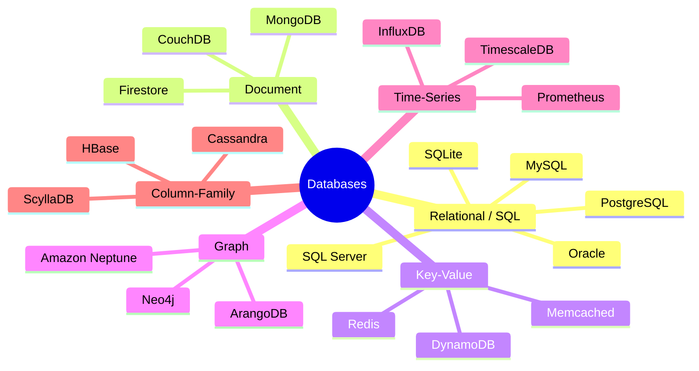

# 01 - What is a Database?

> **Level:** Absolute Beginner
> **Goal:** Understand what a database is, why it exists, and the landscape of database types before you write a single line of SQL.

---

## 📦 What is Data, and Why Do We Need to Store It?

Imagine you run a small online bookstore. Every day you deal with:

- Customer names, emails, and addresses
- Book titles, authors, prices, and stock counts
- Orders — who bought what, when, and how much they paid

You need to **remember** all of this. If you forget a customer's address, you cannot ship the book. If you forget how many copies of a book you have, you might sell something that is out of stock.

This "remembering" is what **data storage** is all about.

In the early days of computing, developers stored data in plain text files — like a `.txt` or `.csv` file on disk. This works for tiny amounts of data, but it falls apart fast:

- What if two people try to update the same file at the same time?
- How do you find one customer out of a million records quickly?
- What happens if the file gets corrupted?

A **database** solves all of these problems. It is an organised collection of data that can be stored, retrieved, updated, and deleted efficiently and safely.

---

## 📊 Database vs. Spreadsheet — A Simple Analogy

Think of a **spreadsheet** (like Excel or Google Sheets) as a notebook. It is great for:

- Small amounts of data (a few hundred or thousand rows)
- Simple calculations and charts
- One or two people working on it

Now think of a **database** as a filing system in a large library, managed by trained staff (the DBMS — more on that in a moment). It is designed for:

- Millions or billions of rows of data
- Dozens or hundreds of apps and users reading and writing at the same time
- Complex relationships between different types of data
- Rock-solid guarantees that your data will not be corrupted

| Feature | Spreadsheet | Database |
|---|---|---|
| Data size | Thousands of rows | Billions of rows |
| Concurrent users | 1-5 | Thousands |
| Relationships | Manual (vlookup) | Built-in (foreign keys) |
| Data safety | Low | High (transactions) |
| Query power | Basic formulas | Full query language (SQL) |
| Best for | Personal use, reports | Production applications |

---

## 🛠️ What is a DBMS?

A **Database Management System (DBMS)** is the software that sits between your application and the raw data files on disk. You do not interact with the files directly — you talk to the DBMS, and it handles everything.

Think of it like a bank teller. You do not go into the vault yourself to get your money. You ask the teller (the DBMS), and they handle retrieval, storage, and security on your behalf.

The DBMS handles:

- **Storage** — Writing data to disk in an efficient format
- **Retrieval** — Finding records quickly using indexes
- **Concurrency** — Letting multiple users read/write without conflicts
- **Security** — Controlling who can see or change what
- **Backup & Recovery** — Protecting data from hardware failures

When people say "I use PostgreSQL" or "I use MySQL", they mean they are using a specific DBMS.

---

## 🗂️ Types of Databases

Not all databases work the same way. Different problems call for different tools. Here is a map of the major database types:



### 1. Relational Databases (SQL)

Data is organised into **tables** — rows and columns, just like a spreadsheet but far more powerful. Tables are linked to each other through **relationships**.

**Real use case:** An e-commerce platform stores customers in one table, orders in another, and products in a third. A single order record links to the customer who placed it and the products they bought.

### 2. Document Databases

Data is stored as **documents** — usually JSON-like objects. Each document can have a different structure, making it flexible for unstructured or changing data.

**Real use case:** A content management system stores blog posts as documents. Each post might have different fields — some have a video, some have tags, some have a featured image — without needing to update a fixed schema.

Popular choice: **MongoDB**

### 3. Key-Value Stores

The simplest model — data is stored as a **key** paired with a **value**, like a dictionary or hashmap. Extremely fast for lookups.

**Real use case:** Caching a user's session data. When a user logs in, store `session:user123 -> { name: "Alice", role: "admin" }`. Retrieve it in under a millisecond on every request.

Popular choice: **Redis**

### 4. Graph Databases

Data is stored as **nodes** (entities) and **edges** (relationships between them). Perfect when the relationships between data are just as important as the data itself.

**Real use case:** A social network. Users are nodes. "Alice follows Bob" is an edge. Finding all friends-of-friends is trivial in a graph database but painful in a relational one.

Popular choice: **Neo4j**

### 5. Time-Series Databases

Optimised for data that is recorded at regular time intervals — **metrics, events, and measurements** over time.

**Real use case:** Monitoring server CPU usage every second. A time-series database can store millions of data points per second and answer queries like "show me average CPU from 2pm to 3pm yesterday" almost instantly.

Popular choice: **InfluxDB**

### 6. Column-Family Databases

Data is stored in **columns** rather than rows, which makes reading a specific column across millions of records extremely fast. Designed for massive write throughput.

**Real use case:** Netflix uses Apache Cassandra to store viewing history. Millions of users watching millions of shows — Cassandra handles the write load that would overwhelm a relational database.

Popular choice: **Apache Cassandra**

---

## 👑 Why Relational Databases Dominate

Despite the variety of database types above, **relational databases (RDBMS)** are the default choice for most applications. Here is why:

### Structured Data
Most business data has a clear, consistent structure. A customer always has a name, email, and address. An order always has a date, total, and status. Tables with fixed columns are a perfect fit.

### Relationships
Real-world data is deeply interconnected. An order belongs to a customer. An order contains multiple products. Relational databases express these connections naturally using **foreign keys** and **joins**.

### ACID Guarantees
This is the big one. ACID stands for:

- **Atomicity** — A transaction either fully succeeds or fully fails. If you transfer $100 from Account A to Account B, both the debit and the credit happen — or neither does.
- **Consistency** — The database is always left in a valid state. Rules (like "balance cannot be negative") are enforced.
- **Isolation** — Concurrent transactions do not interfere with each other. Two people buying the last item in stock cannot both think they succeeded.
- **Durability** — Once a transaction is committed, it survives crashes. Your data is not lost if the server restarts.

For anything involving money, user accounts, or critical business records, ACID guarantees are non-negotiable. Relational databases provide them out of the box.

### SQL — A Universal Language
Structured Query Language (SQL) is decades old, massively documented, and universally understood. Any developer who knows SQL can work with PostgreSQL, MySQL, SQL Server, or Oracle without starting from scratch.

---

## 🏦 The Big Players: Relational Databases

| Feature | PostgreSQL | MySQL | SQL Server | Oracle DB | SQLite |
|---|---|---|---|---|---|
| **License** | Open source (free) | Open source (free) | Commercial | Commercial | Public domain |
| **Best for** | Complex apps, analytics | Web apps, read-heavy | Enterprise (Microsoft stack) | Large enterprise | Embedded / mobile |
| **Who uses it** | Instagram, Notion, GitHub | WordPress, Airbnb | Banks, hospitals | Banks, airlines | iOS apps, Android apps |
| **Runs on** | Linux, Mac, Windows | Linux, Mac, Windows | Windows (primary) | Linux, Windows | Everywhere (no server) |
| **ACID** | Full | Full (InnoDB) | Full | Full | Full |
| **JSON support** | Excellent | Good | Good | Good | Basic |
| **Scaling** | Vertical + extensions | Vertical | Vertical + clustering | Vertical + RAC | Single file only |

**PostgreSQL** is the recommended starting point for most new developers. It is free, extremely capable, and used in production by some of the world's largest applications.

**MySQL** is a close second — it powers a huge proportion of the web (especially WordPress sites) and is widely supported by hosting providers.

**SQL Server** is the go-to choice in companies that are already invested in the Microsoft ecosystem (.NET, Azure, Windows Server).

**Oracle DB** is found in large enterprises — banks, airlines, government. It is powerful but expensive and complex.

**SQLite** is unique: it requires no server. The entire database lives in a single file. It is built into every iPhone and Android phone, and it is perfect for learning SQL or embedding a database in a desktop application.

---

## 🔌 The Client-Server Model

When you build an application that uses a database, they usually run as separate processes — often on separate machines. Here is how they communicate:

```
+------------------+         TCP/IP Network         +------------------+
|   Your App       |  -----------------------------> |   Database       |
|  (the client)    |  <-----------------------------  |   Server         |
|                  |    Query sent / Results returned |                  |
+------------------+                                 +------------------+
```

1. Your application (Node.js, Python, Java — whatever you use) opens a **connection** to the database server.
2. It sends a **query** — a request written in SQL — over the network.
3. The database server processes the query, reads or writes data, and sends back the **results**.
4. Your application uses those results to render a page, return an API response, or continue processing.

The "network" can be the actual internet, a private network between servers in a data centre, or even `localhost` (the same machine) during development.

This separation means the database can serve many different applications at once — a web server, a mobile API, a background job processor — all talking to the same database.

---

## 💻 What a Database Client Looks Like

A **database client** is a tool you use to connect to a database server, write queries, and inspect data. You will use one constantly during development.

**Command-line clients (text-based):**

- `psql` — The official PostgreSQL command-line client. Powerful and available everywhere.
- `mysql` — The MySQL command-line client. Works the same way.

Example of using `psql`:
```
$ psql -h localhost -U myuser -d mybookstore

mybookstore=# SELECT name, email FROM customers LIMIT 5;
 name          | email
---------------+-------------------------
 Alice Smith   | alice@example.com
 Bob Jones     | bob@example.com
(2 rows)
```

**GUI clients (visual tools):**

- **DBeaver** — Free, open source, works with every major database. Great for beginners.
- **TablePlus** — Clean, fast, Mac and Windows. Popular with professional developers.
- **MySQL Workbench** — Official MySQL GUI from Oracle.
- **pgAdmin** — Official PostgreSQL GUI. Feature-rich but complex.

Most developers start with a GUI client to see their data visually, then gradually become comfortable with the command line.

---

## 📐 Schema: The Blueprint of Your Data

A **schema** is the structure — the blueprint — that defines what your data looks like. It specifies:

- What tables exist
- What columns each table has
- What data type each column holds (text, number, date, etc.)
- What rules apply (required fields, unique values, foreign keys)

Example schema for a bookstore:

```sql
-- The customers table
CREATE TABLE customers (
    id          INT PRIMARY KEY,
    name        VARCHAR(100) NOT NULL,
    email       VARCHAR(150) UNIQUE NOT NULL,
    created_at  TIMESTAMP DEFAULT NOW()
);

-- The books table
CREATE TABLE books (
    id          INT PRIMARY KEY,
    title       VARCHAR(200) NOT NULL,
    author      VARCHAR(100),
    price       DECIMAL(10, 2),
    stock       INT DEFAULT 0
);

-- The orders table links customers to books
CREATE TABLE orders (
    id           INT PRIMARY KEY,
    customer_id  INT REFERENCES customers(id),
    book_id      INT REFERENCES books(id),
    quantity     INT NOT NULL,
    ordered_at   TIMESTAMP DEFAULT NOW()
);
```

The schema is defined once (or evolved carefully over time using **migrations**), and then every row inserted must follow the rules. This consistency is what makes relational databases reliable.

---

## 🚫 When NOT to Use a Relational Database

Relational databases are excellent, but they are not the right tool for every job. Consider an alternative when:

- **Your data has no fixed structure** — If each record can have wildly different fields, a document database (MongoDB) is more flexible.
- **You need extreme write throughput** — Logging billions of events per day? Cassandra or a time-series database handles this better.
- **You are caching frequently accessed data** — Use Redis. It lives in memory and is orders of magnitude faster than any disk-based database for simple key lookups.
- **Your problem is about traversing relationships** — Recommendation engines, fraud detection networks, social graphs — Neo4j handles these queries far more efficiently than SQL joins.
- **You are building a tiny embedded application** — SQLite is already a relational database, but for truly minimal apps, even that might be overkill.

The key principle: **choose the database that fits the shape of your data and your access patterns**, not just the one you are most familiar with.

---

## Key Takeaways

- A **database** is an organised, managed collection of data — far more powerful than a file or spreadsheet.
- A **DBMS** (Database Management System) is the software (PostgreSQL, MySQL, etc.) that manages the database for you.
- **Relational databases** store data in tables with rows and columns, linked by relationships. They dominate because of structure, SQL, and ACID guarantees.
- Other database types (Document, Key-Value, Graph, Time-Series, Column-Family) exist for specific use cases — use them when they are the right tool.
- Your app talks to the database through the **client-server model** — sending queries over a connection and receiving results.
- A **schema** is the blueprint that defines your data structure before you store anything.
- **PostgreSQL** is the best starting point for most developers learning relational databases today.

---

## Quiz

Test your understanding before moving on.

**Question 1:** A social media company wants to find all users who are friends-of-friends of a given user. Which type of database is best suited for this?

- A) Relational (SQL)
- B) Key-Value
- C) Graph
- D) Time-Series

**Question 2:** What does the "A" in ACID stand for, and what does it mean in practice?

- A) Authentication — only authorised users can write data
- B) Atomicity — a transaction fully succeeds or fully fails, never partially
- C) Availability — the database is always online
- D) Aggregation — data can be grouped and summed

**Question 3:** You are building a mobile app and need a database that requires no server setup, lives in a single file, and works offline. Which database is the best fit?

- A) PostgreSQL
- B) Oracle DB
- C) Redis
- D) SQLite

---

> **Answers:** 1-C, 2-B, 3-D

---

*Next chapter: **02 - Relational Databases Deep Dive** — tables, rows, columns, primary keys, foreign keys, and your first SQL queries.*
