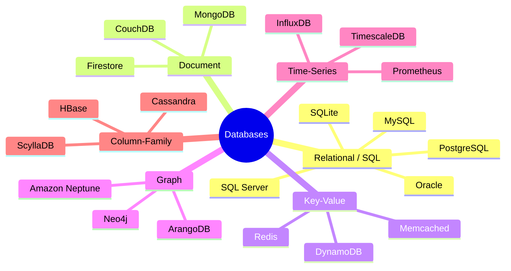

# 01 - What is a Database?

> **Level:** Absolute Beginner
> **Goal:** Samjho database hota kya hai, kyun zaruri hai, aur SQL likhne se pehle database types ki puri duniya dekh lo.

---

## 📦 Data Kya Hai, Aur Isko Store Karna Kyun Zaruri Hai?

Socho tum ek chhota sa online bookstore chala rahe ho — apna khud ka "mini Flipkart for books". Har din tumhe deal karna padta hai:

- Customer ke naam, email, aur address
- Book titles, authors, prices, aur stock counts
- Orders — kisne kya khareeda, kab khareeda, aur kitna paisa diya

Ye sab tumhe **yaad rakhna** padega. Agar tum customer ka address bhool gaye, toh book ship nahi kar paoge. Agar tumhe pata hi nahi ki kitni copies bachi hain, toh out-of-stock cheez bhi bech doge.

Ye "yaad rakhna" hi **data storage** kehlata hai.

Computing ke shuruaati dinon mein developers plain text files mein data store karte the — jaise `.txt` ya `.csv` file disk pe. Ye kaam chal jaata hai jab data bahut kam ho, lekin jaldi hi problem shuru ho jaati hai:

- Agar do log ek hi file ko ek saath update karne lage toh?
- Ek million records mein se ek customer ko jaldi kaise dhoondoge?
- Agar file corrupt ho gayi toh?

Ek **database** in sab problems ko solve karta hai. Ye data ka ek organised collection hai jise efficiently aur safely store, retrieve, update, aur delete kiya ja sakta hai.

---

## 📊 Database vs. Spreadsheet — Ek Simple Analogy

**Spreadsheet** (Excel ya Google Sheets) ko ek notebook samjho. Ye achha hai jab:

- Data kam ho (kuch sau ya hazaar rows)
- Simple calculations aur charts karne ho
- Ek ya do log hi us pe kaam kar rahe ho

Ab **database** ko socho ek bade library ki filing system jaisa, jise trained staff (DBMS — thodi der mein iske baare mein baat karenge) manage karta hai. Ye design hi kiya gaya hai:

- Millions ya billions rows of data ke liye
- Dozens ya hundreds apps aur users ek saath read/write karne ke liye
- Different types of data ke beech complex relationships ke liye
- Solid guarantee ke liye ki tumhara data corrupt nahi hoga

| Feature | Spreadsheet | Database |
|---|---|---|
| Data size | Hazaaron rows | Billions rows |
| Concurrent users | 1-5 | Thousands |
| Relationships | Manual (vlookup) | Built-in (foreign keys) |
| Data safety | Kam | Zyada (transactions) |
| Query power | Basic formulas | Full query language (SQL) |
| Best for | Personal use, reports | Production applications |

---

## 🛠️ DBMS Kya Hai?

Ek **Database Management System (DBMS)** wo software hai jo tumhari application aur disk pe pade raw data files ke beech baithta hai. Tum files se directly baat nahi karte — tum DBMS se baat karte ho, aur wo sab kuch sambhal leta hai.

Isko ek bank teller jaisa socho. Tum khud vault mein jaake apna paisa nahi nikaalte. Tum teller (DBMS) se maangte ho, aur wo retrieval, storage, aur security tumhari taraf se handle karta hai.

DBMS ye handle karta hai:

- **Storage** — Data ko efficient format mein disk pe likhna
- **Retrieval** — Indexes use karke records jaldi dhoondna
- **Concurrency** — Multiple users ko bina conflict ke read/write karne dena
- **Security** — Kaun kya dekh sakta hai ya change kar sakta hai, ye control karna
- **Backup & Recovery** — Hardware failure se data ko bachana

Jab log kehte hain "main PostgreSQL use karta hoon" ya "main MySQL use karta hoon", toh unka matlab hota hai ki wo ek specific DBMS use kar rahe hain.

---

## 🗂️ Databases Ke Types

Sab databases ek jaise kaam nahi karte. Alag-alag problems ke liye alag tools chahiye hote hain. Yahan major database types ka ek map hai:



### 1. Relational Databases (SQL)

Data **tables** mein organise hota hai — rows aur columns, ekdum spreadsheet jaisa lekin bahut zyada powerful. Tables ek dusre se **relationships** ke through linked hote hain.

**Real use case:** Ek e-commerce platform customers ko ek table mein, orders ko dusre mein, aur products ko teesre table mein store karta hai. Ek single order record us customer se link hota hai jisne order kiya, aur un products se jo usne khareede.

### 2. Document Databases

Data **documents** ki tarah store hota hai — usually JSON-like objects. Har document ka structure alag ho sakta hai, isliye ye unstructured ya changing data ke liye flexible hai.

**Real use case:** Ek content management system blog posts ko documents ki tarah store karta hai. Har post ke fields alag ho sakte hain — kisi mein video hai, kisi mein tags hain, kisi mein featured image hai — bina fixed schema update kiye.

Popular choice: **MongoDB**

### 3. Key-Value Stores

Sabse simple model — data ek **key** aur uske paired **value** ki tarah store hota hai, bilkul dictionary ya hashmap jaisa. Lookups ke liye extremely fast.

**Real use case:** User ka session data cache karna. Jab user login karta hai, `session:user123 -> { name: "Alice", role: "admin" }` store karo. Har request pe isko ek millisecond se kam mein retrieve karo.

Popular choice: **Redis**

### 4. Graph Databases

Data **nodes** (entities) aur **edges** (unke beech relationships) ki tarah store hota hai. Perfect tab jab data ke beech ka relationship khud data jitna hi important ho.

**Real use case:** Ek social network. Users nodes hain. "Alice follows Bob" ek edge hai. Sabhi friends-of-friends dhoondna graph database mein aasaan hai, lekin relational database mein bahut painful.

Popular choice: **Neo4j**

### 5. Time-Series Databases

Ye us data ke liye optimised hai jo regular time intervals pe record hota hai — **metrics, events, aur measurements** time ke saath.

**Real use case:** Server ka CPU usage har second monitor karna. Time-series database har second millions data points store kar sakta hai, aur "kal 2pm se 3pm ke beech average CPU dikhao" jaise queries ka jawab turant de sakta hai.

Popular choice: **InfluxDB**

### 6. Column-Family Databases

Data rows ke bajaye **columns** mein store hota hai, jisse millions records mein se ek specific column read karna extremely fast ho jaata hai. Massive write throughput ke liye design kiya gaya hai.

**Real use case:** Netflix Apache Cassandra use karta hai viewing history store karne ke liye. Millions users millions shows dekh rahe hain — Cassandra us write load ko handle karta hai jo ek relational database ko overwhelm kar de.

Popular choice: **Apache Cassandra**

---

## 👑 Relational Databases Kyun Dominate Karte Hain

Upar itni variety hone ke baad bhi, **relational databases (RDBMS)** hi zyadatar applications ke liye default choice hote hain. Wajah dekhte hain:

### Structured Data
Zyadatar business data ka structure clear aur consistent hota hai. Ek customer ke paas hamesha naam, email, aur address hota hai. Ek order mein hamesha date, total, aur status hota hai. Fixed columns wale tables iske liye perfect fit hain.

### Relationships
Real-world data deeply interconnected hota hai. Ek order ek customer ka hota hai. Ek order mein multiple products hote hain. Relational databases ye connections naturally express karte hain **foreign keys** aur **joins** ke through.

### ACID Guarantees
Ye sabse badi baat hai. ACID ka matlab hai:

- **Atomicity** — Ek transaction ya toh pura succeed karta hai, ya pura fail. Agar tum Account A se Account B mein ₹100 transfer kar rahe ho, toh debit aur credit dono hote hain — ya kuch bhi nahi hota.
- **Consistency** — Database hamesha ek valid state mein rehta hai. Rules (jaise "balance negative nahi ho sakta") enforce hote hain.
- **Isolation** — Concurrent transactions ek dusre mein interfere nahi karte. Do log last item khareedne ki koshish kar rahe hain toh dono ko lagna nahi chahiye ki unka order successful ho gaya.
- **Durability** — Ek baar transaction commit ho gaya, toh wo crash mein bhi survive karta hai. Server restart hone pe tumhara data khoya nahi jaata.

Paise, user accounts, ya critical business records se juda kuch bhi ho, toh ACID guarantees non-negotiable hain. Relational databases ye out of the box provide karte hain.

### SQL — Ek Universal Language
Structured Query Language (SQL) dashakon purani hai, massively documented hai, aur universally samjhi jaati hai. Jo bhi developer SQL jaanta hai, wo PostgreSQL, MySQL, SQL Server, ya Oracle ke saath bina zero se shuru kiye kaam kar sakta hai.

---

## 🏦 Bade Players: Relational Databases

| Feature | PostgreSQL | MySQL | SQL Server | Oracle DB | SQLite |
|---|---|---|---|---|---|
| **License** | Open source (free) | Open source (free) | Commercial | Commercial | Public domain |
| **Best for** | Complex apps, analytics | Web apps, read-heavy | Enterprise (Microsoft stack) | Large enterprise | Embedded / mobile |
| **Kaun use karta hai** | Instagram, Notion, GitHub | WordPress, Airbnb | Banks, hospitals | Banks, airlines | iOS apps, Android apps |
| **Runs on** | Linux, Mac, Windows | Linux, Mac, Windows | Windows (primary) | Linux, Windows | Everywhere (no server) |
| **ACID** | Full | Full (InnoDB) | Full | Full | Full |
| **JSON support** | Excellent | Good | Good | Good | Basic |
| **Scaling** | Vertical + extensions | Vertical | Vertical + clustering | Vertical + RAC | Single file only |

**PostgreSQL** naye developers ke liye recommended starting point hai. Ye free hai, extremely capable hai, aur duniya ke sabse bade applications mein production mein use hota hai.

**MySQL** iske kaafi kareeb hai — ye web ka bada hissa power karta hai (especially WordPress sites) aur zyadatar hosting providers isko support karte hain.

**SQL Server** un companies ka go-to choice hai jo already Microsoft ecosystem (.NET, Azure, Windows Server) mein invested hain.

**Oracle DB** bade enterprises mein milta hai — banks, airlines, government. Ye powerful hai lekin expensive aur complex bhi hai.

**SQLite** unique hai: isko koi server nahi chahiye. Poora database ek single file mein rehta hai. Ye har iPhone aur Android phone mein built-in hai, aur SQL seekhne ya desktop application mein database embed karne ke liye perfect hai.

---

## 🔌 Client-Server Model

Jab tum ek application banate ho jo database use karti hai, wo usually alag processes ki tarah run hote hain — kabhi-kabhi toh alag machines pe bhi. Ye kaise communicate karte hain, dekho:

```
+------------------+         TCP/IP Network         +------------------+
|   Your App       |  -----------------------------> |   Database       |
|  (the client)    |  <-----------------------------  |   Server         |
|                  |    Query sent / Results returned |                  |
+------------------+                                 +------------------+
```

1. Tumhari application (Node.js, Python, Java — jo bhi tum use karo) database server se ek **connection** open karti hai.
2. Ye ek **query** bhejti hai — SQL mein likha hua request — network ke through.
3. Database server query process karta hai, data read ya write karta hai, aur **results** wapas bhejta hai.
4. Tumhari application un results ka use karke page render karti hai, API response deti hai, ya aage processing continue karti hai.

Ye "network" actual internet ho sakta hai, ek data centre ke servers ke beech private network ho sakta hai, ya development ke time `localhost` (wahi machine) bhi ho sakta hai.

Ye separation isliye zaruri hai kyunki isse database ek saath alag-alag applications ko serve kar sakta hai — ek web server, ek mobile API, ek background job processor — sab ek hi database se baat kar rahe hain, bilkul UPI backend jaise jo Paytm, PhonePe, aur GPay teeno se ek saath deal karta hai.

---

## 💻 Database Client Kaisa Dikhta Hai

Ek **database client** ek tool hai jise tum database server se connect karne, queries likhne, aur data inspect karne ke liye use karte ho. Development ke dauraan tum isko hardam use karoge.

**Command-line clients (text-based):**

- `psql` — Official PostgreSQL command-line client. Powerful aur har jagah available.
- `mysql` — MySQL command-line client. Same tarike se kaam karta hai.

`psql` use karne ka example:
```
$ psql -h localhost -U myuser -d mybookstore

mybookstore=# SELECT name, email FROM customers LIMIT 5;
 name          | email
---------------+-------------------------
 Alice Smith   | alice@example.com
 Bob Jones     | bob@example.com
(2 rows)
```

**GUI clients (visual tools):**

- **DBeaver** — Free, open source, har major database ke saath kaam karta hai. Beginners ke liye great.
- **TablePlus** — Clean, fast, Mac aur Windows. Professional developers mein popular.
- **MySQL Workbench** — Oracle ka official MySQL GUI.
- **pgAdmin** — Official PostgreSQL GUI. Feature-rich lekin complex.

Zyadatar developers pehle ek GUI client se shuru karte hain apna data visually dekhne ke liye, phir dheere-dheere command line se comfortable ho jaate hain.

---

## 📐 Schema: Tumhare Data Ka Blueprint

Ek **schema** wo structure hai — blueprint — jo define karta hai tumhara data dikhta kaisa hai. Ye specify karta hai:

- Kaunse tables exist karte hain
- Har table mein kaunse columns hain
- Har column kis data type ka hai (text, number, date, etc.)
- Kaunse rules apply hote hain (required fields, unique values, foreign keys)

Bookstore ke liye ek example schema:

```sql
-- The customers table
CREATE TABLE customers (
    id          INT PRIMARY KEY,
    name        VARCHAR(100) NOT NULL,
    email       VARCHAR(150) UNIQUE NOT NULL,
    created_at  TIMESTAMP DEFAULT NOW()
);

-- The books table
CREATE TABLE books (
    id          INT PRIMARY KEY,
    title       VARCHAR(200) NOT NULL,
    author      VARCHAR(100),
    price       DECIMAL(10, 2),
    stock       INT DEFAULT 0
);

-- The orders table links customers to books
CREATE TABLE orders (
    id           INT PRIMARY KEY,
    customer_id  INT REFERENCES customers(id),
    book_id      INT REFERENCES books(id),
    quantity     INT NOT NULL,
    ordered_at   TIMESTAMP DEFAULT NOW()
);
```

Schema ek baar define hota hai (ya time ke saath **migrations** use karke carefully evolve hota hai), aur uske baad insert hone wali har row ko in rules ko follow karna hota hai. Yahi consistency relational databases ko reliable banati hai.

---

## 🚫 Relational Database Kab NAHI Use Karna Chahiye

Relational databases excellent hain, lekin har job ke liye sahi tool nahi hain. In situations mein alternative sochna chahiye:

- **Tumhare data ka koi fixed structure nahi hai** — Agar har record ke fields wildly different ho sakte hain, toh document database (MongoDB) zyada flexible hai.
- **Tumhe extreme write throughput chahiye** — Roz billions events log kar rahe ho? Cassandra ya ek time-series database ye behtar handle karta hai.
- **Tum frequently accessed data cache kar rahe ho** — Redis use karo. Ye memory mein rehta hai aur simple key lookups ke liye kisi bhi disk-based database se orders of magnitude fast hai.
- **Tumhara problem relationships traverse karne ke baare mein hai** — Recommendation engines, fraud detection networks, social graphs — Neo4j inn queries ko SQL joins se kahin zyada efficiently handle karta hai.
- **Tum ek tiny embedded application bana rahe ho** — SQLite already ek relational database hai, lekin truly minimal apps ke liye, wo bhi overkill ho sakta hai.

Key principle: **wo database chuno jo tumhare data ke shape aur access patterns ke fit ho**, sirf wo mat chuno jise tum sabse zyada jaante ho.

---

## Key Takeaways

- Ek **database** data ka organised, managed collection hai — file ya spreadsheet se kahin zyada powerful.
- Ek **DBMS** (Database Management System) wo software hai (PostgreSQL, MySQL, etc.) jo tumhare liye database manage karta hai.
- **Relational databases** data ko tables mein rows aur columns ke saath store karte hain, relationships ke through linked. Ye structure, SQL, aur ACID guarantees ki wajah se dominate karte hain.
- Doosre database types (Document, Key-Value, Graph, Time-Series, Column-Family) specific use cases ke liye exist karte hain — jab wo sahi tool ho, tab unhe use karo.
- Tumhari app database se **client-server model** ke through baat karti hai — connection ke through queries bhej ke aur results receive karke.
- Ek **schema** wo blueprint hai jo kuch bhi store karne se pehle tumhare data ka structure define karta hai.
- **PostgreSQL** aaj relational databases seekhne wale zyadatar developers ke liye best starting point hai.

---

## Quiz

Aage badhne se pehle apni understanding test kar lo.

**Question 1:** Ek social media company ek given user ke sabhi friends-of-friends dhoondna chahti hai. Iske liye kaunsa database type best suited hai?

- A) Relational (SQL)
- B) Key-Value
- C) Graph
- D) Time-Series

**Question 2:** ACID mein "A" ka matlab kya hai, aur practically iska matlab kya hota hai?

- A) Authentication — sirf authorised users hi data write kar sakte hain
- B) Atomicity — ek transaction fully succeed karta hai ya fully fail, kabhi partially nahi
- C) Availability — database hamesha online rehta hai
- D) Aggregation — data group aur sum kiya ja sakta hai

**Question 3:** Tum ek mobile app bana rahe ho aur tumhe aisa database chahiye jise koi server setup na chahiye ho, jo ek single file mein rahe, aur offline kaam kare. Kaunsa database best fit hai?

- A) PostgreSQL
- B) Oracle DB
- C) Redis
- D) SQLite

---

> **Answers:** 1-C, 2-B, 3-D

---

*Next chapter: **02 - Relational Databases Deep Dive** — tables, rows, columns, primary keys, foreign keys, aur tumhare first SQL queries.*
